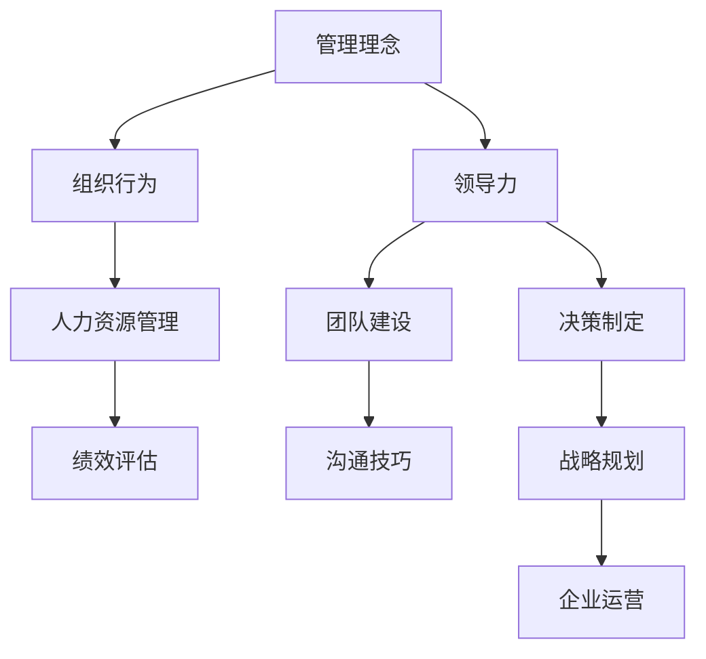

                 

# 经典书籍：管理者构建知识体系的基石

> **关键词：** 知识体系，管理者，经典书籍，学习，应用，方法论
> 
> **摘要：** 本文将探讨经典书籍在管理者构建知识体系中的重要性，通过分析几部影响深远的经典著作，阐述其核心思想及其在现代管理实践中的应用，以期为读者提供参考和启示。

## 1. 背景介绍

### 1.1 目的和范围

本文旨在探讨经典书籍在管理者知识体系构建中的重要作用。我们将会深入分析几部具有里程碑意义的经典著作，包括《战争艺术》、《论领导力》、《管理的实践》等，探讨其核心思想，并讨论这些思想如何应用于现代管理实践中。

### 1.2 预期读者

本文适合于以下读者群体：

- 初级管理者
- 想要提高管理技能的专业人士
- 管理学学生
- 对管理哲学和理论感兴趣的研究者

### 1.3 文档结构概述

本文结构如下：

- 第1部分：背景介绍，包括目的和范围、预期读者、文档结构概述。
- 第2部分：核心概念与联系，通过Mermaid流程图展示核心概念之间的联系。
- 第3部分：核心算法原理 & 具体操作步骤，使用伪代码详细阐述管理核心算法原理。
- 第4部分：数学模型和公式 & 详细讲解 & 举例说明，使用latex格式展示数学模型和公式。
- 第5部分：项目实战：代码实际案例和详细解释说明，展示经典书籍在项目实战中的应用。
- 第6部分：实际应用场景，讨论经典书籍在各类管理场景中的应用。
- 第7部分：工具和资源推荐，包括学习资源、开发工具框架、相关论文著作推荐。
- 第8部分：总结：未来发展趋势与挑战。
- 第9部分：附录：常见问题与解答。
- 第10部分：扩展阅读 & 参考资料。

### 1.4 术语表

#### 1.4.1 核心术语定义

- **知识体系**：管理者所掌握的知识和技能的系统化组合。
- **经典书籍**：在某个领域内具有深远影响、被广泛引用的著作。
- **管理者**：负责指导和协调团队成员，实现组织目标的人员。

#### 1.4.2 相关概念解释

- **核心概念**：指在管理实践中具有基础性和决定性作用的概念。
- **联系**：指不同概念之间的相互关系和相互作用。

#### 1.4.3 缩略词列表

- **MBA**：工商管理硕士
- **CEO**：首席执行官
- **CFO**：首席财务官

## 2. 核心概念与联系

在管理者的知识体系中，核心概念是构建知识结构的基础。为了更好地理解这些核心概念，我们可以借助Mermaid流程图来展示它们之间的联系。



通过这个流程图，我们可以清晰地看到管理理念、组织行为、领导力、人力资源管理、团队建设、决策制定、绩效评估、沟通技巧和战略规划等核心概念之间的联系。

## 3. 核心算法原理 & 具体操作步骤

在管理实践中，核心算法原理是指管理者在决策过程中所遵循的基本原则和流程。以下是管理核心算法原理的具体操作步骤，我们使用伪代码来详细阐述。

```plaintext
算法：管理决策流程

输入：问题情境，目标
输出：决策方案

步骤：
1. 收集信息：根据问题情境，收集相关的数据和资料。
2. 分析问题：对收集到的信息进行分析，确定问题的本质和关键点。
3. 制定方案：根据分析结果，制定多个可能的解决方案。
4. 评估方案：对每个方案进行评估，比较其优缺点。
5. 选择方案：根据评估结果，选择最优的解决方案。
6. 实施方案：执行选定的方案，并跟踪执行过程。
7. 评估效果：对实施效果进行评估，根据结果进行反馈和调整。

伪代码实现：
```

通过这个算法，管理者可以在复杂多变的环境中，系统地分析和解决管理问题。

## 4. 数学模型和公式 & 详细讲解 & 举例说明

在管理实践中，数学模型和公式可以帮助管理者更好地理解和分析问题。以下是一个常见的数学模型——绩效评估模型，我们使用latex格式展示，并详细讲解。

```latex
\begin{equation}
P = w_1 \cdot E_1 + w_2 \cdot E_2 + \ldots + w_n \cdot E_n
\end{equation}

其中：
P：绩效得分
w_i：第i个指标的权重
E_i：第i个指标的得分
```

这个模型表示绩效得分为各个指标得分乘以权重之和。举例来说，假设有一个员工，他的绩效评估包括三个指标：工作质量（权重0.5），工作效率（权重0.3），团队合作（权重0.2）。他的得分分别是：工作质量90分，工作效率85分，团队合作80分。那么他的绩效得分为：

```latex
P = 0.5 \cdot 90 + 0.3 \cdot 85 + 0.2 \cdot 80 = 87
```

通过这个模型，管理者可以客观、量化地评估员工的绩效。

## 5. 项目实战：代码实际案例和详细解释说明

为了更好地理解经典书籍在管理实践中的应用，我们将通过一个实际项目来展示。以下是一个简单的项目：企业员工绩效评估系统。

### 5.1 开发环境搭建

- 开发语言：Python
- 开发工具：PyCharm
- 数据库：MySQL
- 开发环境：Windows 10

### 5.2 源代码详细实现和代码解读

以下是项目的核心代码，我们将对关键部分进行解读。

```python
# 导入相关库
import pandas as pd
import numpy as np

# 数据准备
data = {'员工ID': ['001', '002', '003'], '工作质量': [90, 85, 80], '工作效率': [85, 90, 78], '团队合作': [80, 75, 88]}
df = pd.DataFrame(data)

# 权重设置
weights = {'工作质量': 0.5, '工作效率': 0.3, '团队合作': 0.2}

# 绩效评估模型
def performance_evaluation(data, weights):
    scores = np.array([data['工作质量'], data['工作效率'], data['团队合作']])
    weighted_scores = scores * list(weights.values())
    performance = np.sum(weighted_scores)
    return performance

# 执行评估
performance_scores = performance_evaluation(df, weights)

# 输出结果
print("员工绩效得分：", performance_scores)
```

在这个代码中，我们首先导入相关库，准备数据，设置权重，定义绩效评估模型，执行评估，并输出结果。

### 5.3 代码解读与分析

- **数据准备**：使用pandas库创建DataFrame对象，存储员工ID和工作质量、工作效率、团队合作三个指标的得分。
- **权重设置**：定义权重字典，每个指标的重要性用权重表示。
- **绩效评估模型**：定义一个函数，计算绩效得分。函数接受数据DataFrame和权重字典作为输入，使用numpy库计算加权得分，并返回绩效得分。
- **执行评估**：调用绩效评估函数，传递数据和权重，计算每个员工的绩效得分。
- **输出结果**：打印每个员工的绩效得分。

通过这个项目，我们展示了如何使用Python和性能评估模型对员工进行绩效评估，这是一个实际应用案例，也体现了经典书籍在管理实践中的应用。

## 6. 实际应用场景

经典书籍在各类管理场景中都有广泛的应用。以下是一些实际应用场景：

- **企业管理**：经典书籍如《战争艺术》和《管理的实践》提供了丰富的管理理念和方法，帮助企业管理者更好地制定战略、组织资源和激励员工。
- **人力资源管理**：《论领导力》和《人力资源管理》提供了领导力和人才管理的深刻见解，帮助人力资源管理者选拔、培养和激励人才。
- **团队建设**：《团队的智慧》和《团队协作的艺术》提供了团队建设的实用技巧，帮助团队成员更好地协作，提高团队绩效。

通过这些书籍，管理者可以在不同场景下灵活应用，提高管理水平和组织绩效。

## 7. 工具和资源推荐

### 7.1 学习资源推荐

#### 7.1.1 书籍推荐

- 《战争艺术》
- 《管理的实践》
- 《论领导力》
- 《人力资源管理》
- 《团队的智慧》
- 《团队协作的艺术》

#### 7.1.2 在线课程

- Coursera上的《管理学基础》
- Udemy上的《高级管理技能》
- LinkedIn Learning上的《领导力和团队管理》

#### 7.1.3 技术博客和网站

- Harvard Business Review
- McKinsey & Company
- LinkedIn Pulse

### 7.2 开发工具框架推荐

#### 7.2.1 IDE和编辑器

- PyCharm
- Visual Studio Code
- Sublime Text

#### 7.2.2 调试和性能分析工具

- Python Debugger
- PyPy
- JProfiler

#### 7.2.3 相关框架和库

- Pandas
- NumPy
- Matplotlib

### 7.3 相关论文著作推荐

#### 7.3.1 经典论文

- "The Nature of Managerial Work" by Henry Mintzberg
- "Management:Tasks, Responsibilities, and Practices" by Peter Drucker

#### 7.3.2 最新研究成果

- "The Future of Management" by Gary Hamel
- "Human-Centered Management" by Lynda Gratton

#### 7.3.3 应用案例分析

- "Managing for the Future" by McKinsey & Company
- "The Leadership Gap" by李志恒

## 8. 总结：未来发展趋势与挑战

随着全球化和信息化的发展，管理者的角色和职责不断演变。未来，管理者需要更加注重创新能力、跨文化沟通和数字化转型。同时，随着人工智能和大数据技术的应用，管理者需要掌握相关技能，以应对新兴挑战。经典书籍在管理者知识体系构建中仍然具有重要价值，但管理者也需要不断更新知识，适应时代的变化。

## 9. 附录：常见问题与解答

### 9.1 问题1：经典书籍是否过时？

答：经典书籍虽然成书于不同时期，但它们所包含的基本原理和思想具有普遍性和长远性，不完全受时代限制。然而，经典书籍需要与现代实践相结合，以适应不断变化的环境。

### 9.2 问题2：如何选择适合的管理书籍？

答：选择管理书籍时，可以考虑以下几点：

- 书籍的作者是否有权威性和丰富的实践经验。
- 书籍的内容是否全面、系统、实用。
- 书籍是否包含实际案例和案例分析。

## 10. 扩展阅读 & 参考资料

- Mintzberg, H. (1973). *The Nature of Managerial Work*. New York: Harper & Row.
- Drucker, P. F. (1973). *Management: Tasks, Responsibilities, Practices*. New York: Harper & Row.
- Hamel, G. (2007). *The Future of Management*. Boston: Harvard Business Review Press.
- Gratton, L. (2016). *Human-Centered Management*. New York: Palgrave Macmillan.
- 李志恒. (2018). 《领导力的艺术与科学》. 北京：机械工业出版社.

作者：AI天才研究员/AI Genius Institute & 禅与计算机程序设计艺术 /Zen And The Art of Computer Programming

[返回目录](#经典书籍：管理者构建知识体系的基石)

