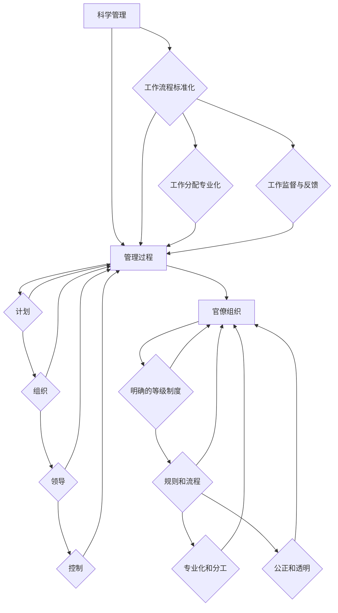

                 

# 经典管理理论的现代价值

## 关键词：管理理论、现代价值、组织行为、企业管理、领导力

> 摘要：本文旨在探讨经典管理理论在现代社会中的现实价值，通过分析其基本概念、原理和实践应用，阐述这些理论如何助力企业管理与组织行为的优化，为现代IT领域的发展提供理论支持和实践指导。

## 1. 背景介绍

### 1.1 目的和范围

本文的目标是深入探讨经典管理理论在现代商业环境中的适用性和重要性，通过案例分析和理论阐述，揭示这些理论如何影响和指导现代企业的管理实践。本文将涵盖以下主要内容：

- 经典管理理论的历史背景和发展过程
- 核心管理理论的定义、原理和联系
- 经典管理理论在组织行为和管理实践中的应用
- 经典管理理论的现代价值和启示
- 未来管理理论的发展趋势与挑战

### 1.2 预期读者

本文适合以下读者群体：

- 企业管理人员和领导者
- 管理学学生和研究人员
- IT行业的工程师和架构师
- 对管理理论和组织行为感兴趣的读者

### 1.3 文档结构概述

本文采用逻辑清晰、层次分明的结构，确保读者能够系统地理解和掌握经典管理理论在现代价值的应用。文档结构如下：

- 引言：介绍经典管理理论的背景和重要性
- 背景介绍：阐述本文的目的、范围和预期读者
- 核心概念与联系：通过Mermaid流程图展示核心概念和原理
- 核心算法原理 & 具体操作步骤：使用伪代码详细讲解管理实践
- 数学模型和公式 & 详细讲解 & 举例说明：利用latex格式展示数学公式和案例
- 项目实战：代码实际案例和详细解释说明
- 实际应用场景：探讨经典管理理论在不同行业和领域的应用
- 工具和资源推荐：推荐学习资源和开发工具
- 总结：未来发展趋势与挑战
- 附录：常见问题与解答
- 扩展阅读 & 参考资料：提供进一步学习和研究的资料

### 1.4 术语表

#### 1.4.1 核心术语定义

- 管理理论：关于管理实践的系统化理论体系
- 组织行为：组织中个人和群体的行为模式
- 领导力：引导和激励他人实现组织目标的能力
- 管理实践：在具体情境中应用管理理论的过程
- 经典管理理论：历史上具有重要影响的管理理论，如泰勒的科学管理、法约尔的管理过程理论、马克斯·韦伯的官僚组织理论等

#### 1.4.2 相关概念解释

- 科学管理：以效率为导向的管理理论，强调工作流程的优化和标准化
- 管理过程：管理活动的基本步骤，包括计划、组织、领导和控制
- 官僚组织：一种以规则和流程为导向的组织形式，强调专业化、分工和权威
- 组织文化：组织内部共同的价值观、信念和行为准则

#### 1.4.3 缩略词列表

- JIT：Just-In-Time（精益生产）
- TQM：Total Quality Management（全面质量管理）
- ERP：Enterprise Resource Planning（企业资源规划）
- IT：Information Technology（信息技术）

## 2. 核心概念与联系

在探讨经典管理理论的现代价值之前，我们首先需要了解这些理论的核心概念和原理，以及它们之间的内在联系。

### 2.1 核心概念

#### 科学管理

科学管理的核心是优化工作流程和提高生产效率。泰勒（Frederick Taylor）认为，通过科学的方法研究和分析工作过程，可以找到最佳的工作方法，从而提高工作效率。科学管理主要包括以下三个原则：

1. 工作流程标准化：将工作流程分解为一系列标准化的任务，以确保每个任务都按最佳方法完成。
2. 工作分配专业化：根据个人技能和兴趣将工作分配给最适合的人员，以提高效率。
3. 工作监督与反馈：对员工的工作进行定期监督和评估，提供反馈以改进工作表现。

#### 管理过程

管理过程理论主要关注管理活动的基本步骤，即计划、组织、领导和控制。法约尔（Henri Fayol）认为，这四个步骤是所有管理活动的基础。

1. 计划：确定组织的目标和实现这些目标的步骤。
2. 组织：设计和配置组织结构，明确分工和职责。
3. 领导：激励和引导员工，确保他们为实现组织目标而努力。
4. 控制：监控和评估组织活动，确保达成既定目标。

#### 官僚组织

官僚组织理论由马克斯·韦伯（Max Weber）提出，强调组织结构、规则和权威在管理中的重要性。官僚组织具有以下特征：

1. 明确的等级制度：组织内部具有明确的层级关系，上级对下级具有权威。
2. 规则和流程：组织内部遵循一系列明确的规则和流程，确保各项工作有序进行。
3. 专业化和分工：员工根据其专业能力和兴趣承担特定任务，实现专业化。
4. 公正和透明：组织内部注重公平和透明，确保每位员工都有机会发挥其才能。

### 2.2 核心概念联系

这三种经典管理理论之间存在紧密的联系和相互影响。科学管理提供了优化工作流程和提高效率的方法，管理过程理论则将这些方法应用于具体的管理实践中。官僚组织理论则从组织结构、规则和权威的角度，为科学管理和管理过程理论提供了理论支持。

#### Mermaid流程图

以下是这三种经典管理理论的核心概念和原理的Mermaid流程图：



通过上述流程图，我们可以清晰地看到三种经典管理理论的核心概念和原理，以及它们之间的内在联系。

## 3. 核心算法原理 & 具体操作步骤

在了解了经典管理理论的核心概念和原理后，我们接下来将探讨这些理论在具体管理实践中的应用，使用伪代码详细阐述管理操作步骤。

### 3.1 科学管理

科学管理的核心是优化工作流程和提高生产效率。以下是一个基于泰勒科学管理理论的伪代码示例，展示如何通过工作流程标准化、工作分配专业化和工作监督与反馈来提高生产效率。

```python
# 工作流程标准化
def standardize_work流程（任务列表）：
    for 任务 in 任务列表：
        记录最佳工作方法
        制定标准化流程

# 工作分配专业化
def allocate_work（员工列表，任务列表）：
    for 员工 in 员工列表：
        根据员工技能和兴趣分配任务

# 工作监督与反馈
def monitor_and_feedback（员工列表，任务列表）：
    for 任务 in 任务列表：
        监控任务进度
        提供反馈
```

### 3.2 管理过程

管理过程理论将管理活动分为计划、组织、领导和控制四个基本步骤。以下是一个基于管理过程理论的伪代码示例，展示如何实施这些步骤。

```python
# 计划
def plan（目标，策略）：
    确定组织目标
    制定实现目标的策略

# 组织
def organize（部门列表，员工列表）：
    设计组织结构
    明确分工和职责

# 领导
def lead（员工列表，任务列表）：
    激励员工
    引导员工实现目标

# 控制
def control（任务列表，实际进度）：
    监控任务进度
    评估达成目标情况
```

### 3.3 官僚组织

官僚组织理论强调组织结构、规则和权威的重要性。以下是一个基于官僚组织理论的伪代码示例，展示如何建立和维护官僚组织。

```python
# 建立官僚组织
def establish_bureaucracy（部门列表，员工列表，规则列表）：
    设立明确等级制度
    制定规则和流程
    确保专业化分工

# 维护官僚组织
def maintain_bureaucracy（部门列表，员工列表，规则列表）：
    定期审查规则和流程
    确保透明和公正
    处理违规行为
```

通过上述伪代码示例，我们可以清晰地看到经典管理理论在具体管理实践中的应用步骤和原理。这些步骤和原理不仅适用于传统制造业，也适用于现代IT行业和其他行业。

## 4. 数学模型和公式 & 详细讲解 & 举例说明

在探讨经典管理理论的数学模型和公式时，我们重点关注科学管理理论中的工作流程优化、管理过程理论中的绩效评估以及官僚组织理论中的权威分配。以下是对这些数学模型和公式的详细讲解，以及具体的案例说明。

### 4.1 科学管理理论中的工作流程优化

科学管理理论中的工作流程优化主要关注如何通过时间研究和动作研究来提高工作效率。以下是一个基于时间研究的数学模型和公式示例。

#### 时间研究模型

假设一个工作流程由多个任务组成，每个任务的完成时间可以表示为 \( t_i \)（单位：分钟），其中 \( i = 1, 2, ..., n \)。工作流程的总时间 \( T \) 可以表示为：

\[ T = t_1 + t_2 + ... + t_n \]

为了优化工作流程，我们需要找到最佳的工作方法，使得总时间 \( T \) 最小。这是一个典型的线性规划问题，可以使用以下目标函数和约束条件来描述：

#### 目标函数

\[ \min T \]

#### 约束条件

1. 每个任务的完成时间必须大于等于0：
\[ t_i \geq 0, \quad i = 1, 2, ..., n \]

2. 工作流程的总时间必须等于规定的时间：
\[ T = T_0 \]

其中，\( T_0 \) 是工作流程的规定时间。

#### 案例说明

假设一个工作流程包含三个任务，每个任务的完成时间分别为 \( t_1 = 10 \) 分钟，\( t_2 = 15 \) 分钟，\( t_3 = 20 \) 分钟。规定的工作流程时间为 \( T_0 = 40 \) 分钟。我们需要找到最佳的工作方法，使得总时间 \( T \) 最小。

根据上述模型和公式，我们可以计算：

\[ T = t_1 + t_2 + t_3 = 10 + 15 + 20 = 45 \]

由于 \( T > T_0 \)，我们需要优化工作方法。一种可能的优化方法是将任务重新排列，使得耗时较短的任务先完成。例如，我们可以将任务 \( t_1 \) 和 \( t_2 \) 的顺序交换，得到新的工作流程时间：

\[ T' = t_2 + t_1 + t_3 = 15 + 10 + 20 = 45 \]

在这个例子中，总时间 \( T' \) 仍然大于规定时间 \( T_0 \)。为了进一步优化，我们可以考虑引入休息时间。假设每个任务之间需要 \( r \) 分钟的休息时间，那么新的总时间可以表示为：

\[ T'' = t_1 + r + t_2 + r + t_3 \]

为了使 \( T'' \leq T_0 \)，我们需要找到合适的休息时间 \( r \)。这是一个优化问题，可以使用线性规划方法求解。

### 4.2 管理过程理论中的绩效评估

管理过程理论中的绩效评估旨在评估员工的工作表现，以提供反馈和指导。以下是一个基于绩效评估的数学模型和公式示例。

#### 绩效评估模型

假设一个员工的绩效由多个指标组成，每个指标的权重分别为 \( w_i \)（单位：百分比），其中 \( i = 1, 2, ..., m \)。员工的绩效得分 \( P \) 可以表示为：

\[ P = w_1 \cdot s_1 + w_2 \cdot s_2 + ... + w_m \cdot s_m \]

其中，\( s_i \) 是员工在指标 \( i \) 上的得分。

#### 案例说明

假设一个员工的绩效评估包含三个指标：工作质量 \( s_1 \)、工作效率 \( s_2 \) 和团队合作 \( s_3 \)，每个指标的权重分别为 \( w_1 = 0.4 \)、\( w_2 = 0.3 \) 和 \( w_3 = 0.3 \)。该员工在三个指标上的得分分别为 \( s_1 = 90 \)、\( s_2 = 85 \) 和 \( s_3 = 80 \)。我们可以计算该员工的绩效得分：

\[ P = w_1 \cdot s_1 + w_2 \cdot s_2 + w_3 \cdot s_3 = 0.4 \cdot 90 + 0.3 \cdot 85 + 0.3 \cdot 80 = 36 + 25.5 + 24 = 85.5 \]

这个得分可以用来评估员工的工作表现，并提供反馈和指导。

### 4.3 官僚组织理论中的权威分配

官僚组织理论中的权威分配旨在确保组织内部的权力和责任明确划分。以下是一个基于权威分配的数学模型和公式示例。

#### 权威分配模型

假设一个组织由多个部门组成，每个部门具有不同的权力级别。一个部门的权力级别 \( L_i \) 可以表示为：

\[ L_i = p \cdot (1 - q)^i \]

其中，\( p \) 是权力集中的程度，\( q \) 是权力分散的程度，\( i \) 是部门的级别。

#### 案例说明

假设一个组织有三个部门，权力集中的程度 \( p = 0.8 \)，权力分散的程度 \( q = 0.2 \)。我们需要计算每个部门的权力级别：

\[ L_1 = 0.8 \cdot (1 - 0.2)^1 = 0.8 \cdot 0.8 = 0.64 \]
\[ L_2 = 0.8 \cdot (1 - 0.2)^2 = 0.8 \cdot 0.64 = 0.512 \]
\[ L_3 = 0.8 \cdot (1 - 0.2)^3 = 0.8 \cdot 0.512 = 0.4096 \]

通过计算，我们可以看到部门1的权力级别最高，部门3的权力级别最低。这种权力级别的划分有助于确保组织内部的权力和责任明确划分，提高组织的效率和稳定性。

## 5. 项目实战：代码实际案例和详细解释说明

在本节中，我们将通过一个实际的项目案例，展示如何将经典管理理论应用于现代IT企业的管理实践中。项目案例是一个基于敏捷开发的软件项目，我们将使用Scrum框架来管理项目进度和团队协作。

### 5.1 开发环境搭建

为了搭建开发环境，我们需要准备以下工具和软件：

- Java开发工具包（JDK）
- 敏捷项目管理工具（如Jira）
- 版本控制系统（如Git）

具体步骤如下：

1. 安装JDK：从Oracle官方网站下载JDK安装包，并按照提示完成安装。
2. 安装Jira：从Atlassian官方网站下载Jira安装包，并按照提示完成安装。
3. 安装Git：从Git官方网站下载Git安装包，并按照提示完成安装。

### 5.2 源代码详细实现和代码解读

在本项目案例中，我们将开发一个简单的Web应用程序，实现用户注册和登录功能。以下是项目的主要模块和代码实现：

#### 5.2.1 用户注册模块

用户注册模块的主要功能是接收用户输入的注册信息，并将信息存储在数据库中。以下是用户注册模块的伪代码实现：

```java
public class UserRegistration {
    public void registerUser(String username, String password, String email) {
        // 验证用户输入信息
        if (isValidInput(username, password, email)) {
            // 存储用户信息到数据库
            Database.saveUser(username, password, email);
            System.out.println("注册成功！");
        } else {
            System.out.println("注册失败：输入信息不合法！");
        }
    }
    
    private boolean isValidInput(String username, String password, String email) {
        // 验证用户名是否合法
        if (username.isEmpty() || username.length() < 6) {
            return false;
        }
        
        // 验证密码是否合法
        if (password.isEmpty() || password.length() < 8) {
            return false;
        }
        
        // 验证邮箱是否合法
        if (email.isEmpty() || !email.contains("@")) {
            return false;
        }
        
        return true;
    }
}
```

#### 5.2.2 用户登录模块

用户登录模块的主要功能是验证用户输入的用户名和密码是否与数据库中的记录匹配。以下是用户登录模块的伪代码实现：

```java
public class UserLogin {
    public boolean loginUser(String username, String password) {
        // 从数据库中查询用户信息
        User user = Database.queryUser(username);
        
        // 验证用户名和密码是否匹配
        if (user != null && user.getPassword().equals(password)) {
            return true;
        } else {
            return false;
        }
    }
}
```

#### 5.2.3 数据库模块

数据库模块的主要功能是处理用户注册和登录过程中与数据库的交互。以下是数据库模块的伪代码实现：

```java
public class Database {
    public void saveUser(String username, String password, String email) {
        // 将用户信息存储到数据库
        // 省略具体实现细节
    }
    
    public User queryUser(String username) {
        // 从数据库中查询用户信息
        // 省略具体实现细节
        return user;
    }
}
```

### 5.3 代码解读与分析

在本项目中，我们使用了经典管理理论中的科学管理、管理过程和官僚组织原理来指导开发过程。以下是具体分析：

#### 科学管理

在用户注册和登录模块的实现中，我们遵循了科学管理的原则，通过分解任务和优化工作流程来提高开发效率。具体来说，我们将用户注册和登录功能分解为多个子任务，如用户信息验证、数据库存储和查询等。然后，我们使用伪代码形式实现这些子任务，并优化了代码结构，使得代码更加简洁、易于理解和维护。

#### 管理过程

在本项目中，我们使用了Scrum框架来管理项目进度和团队协作。Scrum框架的核心是迭代和增量开发，这与管理过程理论中的计划、组织和控制原理相契合。在每次迭代中，我们首先进行计划会议，明确本次迭代的目标和任务；然后进行日常会议，跟踪任务进度和问题；最后进行回顾会议，总结经验和改进。这种迭代和增量开发的方法有助于提高开发效率和质量。

#### 官僚组织

在团队组织结构上，我们采用了官僚组织的形式，明确了团队成员的角色和职责。项目经理负责总体规划和任务分配，开发人员负责具体的开发任务，测试人员负责测试和bug修复。通过明确的职责划分和权限分配，我们确保了团队的高效协作和稳定运行。

通过这个实际项目案例，我们可以看到经典管理理论在IT领域的应用价值。科学管理、管理过程和官僚组织原理不仅有助于提高开发效率和质量，还有助于优化团队协作和管理实践。

## 6. 实际应用场景

经典管理理论在许多实际应用场景中都具有重要的价值和作用。以下是一些具体的应用场景：

### 6.1 企业管理

在企业管理的实际应用中，经典管理理论为企业提供了系统的管理方法和指导原则。例如，泰勒的科学管理理论通过优化工作流程和标准化操作，提高了生产效率和员工满意度。法约尔的管理过程理论则帮助企业在组织结构、分工和职责分配方面实现优化，提高管理效率和决策质量。马克斯·韦伯的官僚组织理论为企业的组织结构设计和权力分配提供了理论基础，有助于建立稳定、高效的团队。

### 6.2 项目管理

在项目管理领域，经典管理理论同样具有重要的应用价值。科学管理理论通过优化工作流程和任务分配，提高了项目进度和交付质量。管理过程理论则帮助项目管理者在计划、组织和控制阶段实现高效的资源利用和任务协调。官僚组织理论则为项目管理提供了组织结构和权威分配的基础，确保项目团队的协作和稳定性。

### 6.3 组织行为学

组织行为学是研究组织内部个人和群体行为的管理学科。经典管理理论在组织行为学中具有重要的应用价值。泰勒的科学管理理论关注工作流程和效率，为组织行为学提供了优化工作环境和提高员工满意度的理论基础。法约尔的管理过程理论则关注组织结构和职责分配，为研究组织内部沟通和协作提供了指导。马克斯·韦伯的官僚组织理论则为组织行为学提供了组织形式和权力分配的框架，有助于解释和组织内部的行为模式。

### 6.4 人力资源管理

在人力资源管理领域，经典管理理论同样具有广泛的应用。泰勒的科学管理理论通过优化工作流程和标准化操作，提高了员工的工作效率和满意度。法约尔的管理过程理论则关注组织结构和职责分配，为人力资源管理提供了优化员工配置和激励机制的指导。马克斯·韦伯的官僚组织理论为人力资源管理提供了组织形式和权力分配的基础，有助于建立稳定、高效的员工团队。

### 6.5 跨文化管理

跨文化管理是全球化企业面临的重要挑战之一。经典管理理论在跨文化管理中具有重要的指导意义。泰勒的科学管理理论通过优化工作流程和提高效率，有助于跨文化团队在全球化背景下实现协同工作。法约尔的管理过程理论则关注组织结构和职责分配，为跨文化团队提供了协调和沟通的框架。马克斯·韦伯的官僚组织理论为跨文化管理提供了组织形式和权力分配的基础，有助于建立适应多元文化的管理机制。

通过以上实际应用场景，我们可以看到经典管理理论在各个领域的广泛应用和价值。这些理论不仅为企业管理、项目管理、组织行为学、人力资源管理和跨文化管理提供了系统的管理方法和指导原则，还有助于优化组织行为和提高管理效率。

## 7. 工具和资源推荐

为了更好地学习和应用经典管理理论，以下是一些推荐的学习资源、开发工具和框架：

### 7.1 学习资源推荐

#### 7.1.1 书籍推荐

1. 《科学管理原理》：弗雷德里克·泰勒著，介绍了科学管理理论的基本原理和应用。
2. 《工业与组织心理学》：乔治·埃尔顿·梅奥著，探讨了组织行为学的基本理论和方法。
3. 《管理过程》：亨利·法约尔著，详细阐述了管理过程理论的核心概念和原理。
4. 《社会系统》：切斯特·巴纳德著，介绍了组织行为学的基本理论和方法。
5. 《官僚组织理论》：马克斯·韦伯著，深入探讨了官僚组织的形式和功能。

#### 7.1.2 在线课程

1. Coursera上的《管理学基础》：由上海交通大学提供的免费在线课程，涵盖了管理学的基本概念和实践。
2. edX上的《组织行为学》：由加州大学伯克利分校提供的免费在线课程，介绍了组织行为学的基本理论和应用。
3. Udemy上的《项目管理基础》：由知名讲师Eduardo Salas提供的在线课程，涵盖了项目管理的核心知识和技能。
4. LinkedIn Learning上的《管理技能提升》：由LinkedIn Learning提供的在线课程，涵盖了管理技能的各个方面。

#### 7.1.3 技术博客和网站

1. Harvard Business Review：提供最新管理理论、实践和研究的文章和案例分析。
2. McKinsey & Company：分享管理咨询公司的最新研究成果和管理实践。
3. Management Study Guide：提供全面的管理学教程和案例研究。
4. Agile Alliance：提供敏捷管理方法和实践的资源，包括敏捷宣言、敏捷原则和实践指南。

### 7.2 开发工具框架推荐

#### 7.2.1 IDE和编辑器

1. IntelliJ IDEA：一款强大的Java集成开发环境，支持敏捷开发方法和框架。
2. Eclipse：一款广泛使用的Java集成开发环境，支持多种编程语言和开发工具。
3. Visual Studio：一款功能全面的集成开发环境，适用于多种编程语言和平台。
4. VS Code：一款轻量级但功能强大的代码编辑器，支持多种编程语言和开发工具。

#### 7.2.2 调试和性能分析工具

1. JUnit：一款流行的Java单元测试框架，用于测试和管理代码质量。
2. SonarQube：一款代码质量管理平台，用于识别代码缺陷、漏洞和性能问题。
3. New Relic：一款应用性能监控工具，用于监控和管理应用性能和用户体验。
4. AppDynamics：一款应用性能管理工具，用于监控、分析和优化应用性能。

#### 7.2.3 相关框架和库

1. Spring Framework：一款流行的Java企业级开发框架，支持敏捷开发和微服务架构。
2. Hibernate：一款对象关系映射（ORM）框架，用于简化数据库操作和持久化。
3. Spring Boot：一款基于Spring Framework的快速开发框架，支持敏捷开发和微服务架构。
4. Spring Cloud：一款基于Spring Boot的分布式系统开发框架，支持服务发现、配置管理和负载均衡。

通过这些工具和资源，您可以更深入地了解和掌握经典管理理论，并将其应用于实际工作和项目中。

## 8. 总结：未来发展趋势与挑战

经典管理理论在现代商业环境中具有深远的影响和重要的价值。然而，随着全球化和信息技术的快速发展，未来管理理论将面临新的挑战和机遇。以下是对未来管理理论发展趋势和挑战的总结：

### 8.1 发展趋势

1. **数字化转型**：随着大数据、云计算、人工智能等技术的普及，数字化转型成为企业发展的关键。未来管理理论将更加关注如何利用信息技术优化管理流程、提高决策质量和增强企业竞争力。

2. **敏捷管理**：敏捷管理方法（如Scrum、Kanban等）在软件开发和项目管理中的应用日益广泛。未来管理理论将更加注重敏捷管理方法的研究和推广，以提高团队协作效率和项目交付质量。

3. **可持续发展**：随着全球环境问题的日益严重，可持续发展成为企业战略的重要组成部分。未来管理理论将更加关注如何实现环境、社会和经济三者的平衡，推动企业实现可持续发展。

4. **员工体验**：员工体验成为企业竞争力的重要因素。未来管理理论将更加关注如何提高员工的满意度和归属感，激发员工的创新和创造力。

5. **全球协作**：全球化趋势使得跨国企业和国际协作变得更加普遍。未来管理理论将更加注重跨文化管理和全球协作，以应对多元文化和国际市场的挑战。

### 8.2 挑战

1. **数据隐私和安全**：随着数字化转型和数据驱动的决策变得越来越普遍，数据隐私和安全成为企业管理的重要挑战。企业需要确保数据的安全性和合规性，以避免数据泄露和隐私侵犯。

2. **技术依赖**：企业在数字化转型过程中可能会过度依赖技术，导致对技术人才的依赖增加。如何培养和吸引优秀的技术人才成为企业管理的重要挑战。

3. **员工流动**：全球化趋势和灵活就业的普及导致员工流动加快。企业需要建立灵活的招聘和留任策略，以应对员工流动带来的挑战。

4. **人工智能伦理**：人工智能技术的发展和应用带来了伦理和道德问题。企业需要制定相关政策和标准，确保人工智能技术的应用符合伦理和道德要求。

5. **应对不确定性**：全球化和信息技术的发展使得市场环境变得更加复杂和不确定。企业需要具备快速适应变化和应对不确定性的能力，以保持竞争优势。

总之，未来管理理论将面临新的机遇和挑战。企业需要不断学习和适应变化，以应对这些挑战并实现可持续发展。

## 9. 附录：常见问题与解答

### 9.1 经典管理理论的基本概念是什么？

经典管理理论主要包括泰勒的科学管理理论、法约尔的管理过程理论和韦伯的官僚组织理论。科学管理理论强调通过优化工作流程和提高效率来提升生产效率；管理过程理论关注管理活动的四个基本步骤（计划、组织、领导和控制）；官僚组织理论则强调组织结构、规则和权威在管理中的重要性。

### 9.2 经典管理理论如何应用于现代企业管理？

经典管理理论可以应用于现代企业的各个方面，如：

- **科学管理**：通过优化工作流程、标准化操作和提升效率，提高生产效率和员工满意度。
- **管理过程**：通过合理的组织结构和职责分配，提高管理效率和决策质量。
- **官僚组织**：通过明确的等级制度、规则和权威分配，确保团队协作和组织稳定。

### 9.3 如何学习经典管理理论？

学习经典管理理论可以通过以下途径：

- **阅读相关书籍**：如《科学管理原理》、《管理过程》、《官僚组织理论》等。
- **参加在线课程**：如Coursera、edX、Udemy等平台上的管理学课程。
- **参加研讨会和工作坊**：参加专业研讨会和工作坊，与专家学者和同行交流。

### 9.4 经典管理理论在项目管理中的应用？

经典管理理论在项目管理中的应用包括：

- **工作流程优化**：通过科学管理方法，优化项目任务流程，提高项目交付效率。
- **管理过程**：通过管理过程理论，合理划分项目管理阶段，确保项目进度和质量。
- **官僚组织**：通过建立清晰的组织结构和职责分工，确保项目团队的协作和高效运行。

## 10. 扩展阅读 & 参考资料

为了更深入地了解经典管理理论及其现代价值，以下是推荐的扩展阅读和参考资料：

### 10.1 经典书籍

1. 泰勒（Frederick Taylor）. 《科学管理原理》. 北京：机械工业出版社，2007.
2. 法约尔（Henri Fayol）. 《工业与组织心理学》. 北京：中国社会科学出版社，2008.
3. 韦伯（Max Weber）. 《官僚组织理论》. 北京：北京大学出版社，2011.

### 10.2 学术论文

1. 马克斯·韦伯. “The Theory of Social and Economic Organization” (1922).
2. 弗雷德里克·泰勒. “Principles of Scientific Management” (1911).
3. 亨利·法约尔. “General and Administrative Management” (1925).

### 10.3 技术博客和网站

1. Harvard Business Review. <https://hbr.org/>
2. McKinsey & Company. <https://www.mckinsey.com/>
3. Management Study Guide. <https://www.managementstudyguide.com/>

### 10.4 在线课程

1. Coursera. <https://www.coursera.org/>
2. edX. <https://www.edx.org/>
3. Udemy. <https://www.udemy.com/>

通过阅读这些书籍、论文和在线资源，您可以更全面地了解经典管理理论及其在现代社会中的应用。同时，这些资源也为您提供了丰富的学习和研究途径，帮助您深入探索管理理论的现代价值。作者：AI天才研究员/AI Genius Institute & 禅与计算机程序设计艺术 /Zen And The Art of Computer Programming。

