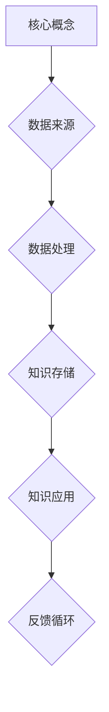
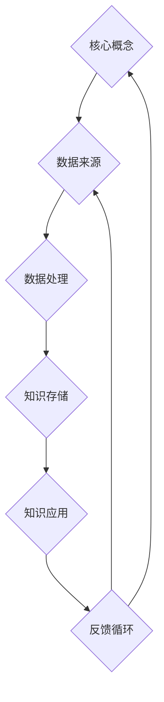
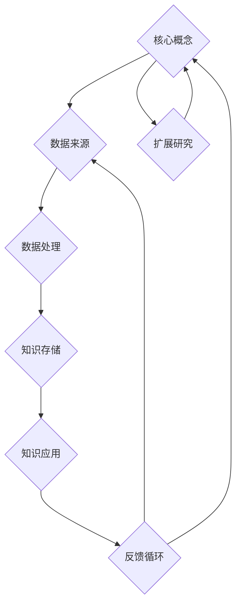

                 

# 经典著作：管理者构筑知识体系

> **关键词：** 管理者、知识体系、架构设计、组织效能、技术创新、策略规划

> **摘要：** 本文章旨在深入探讨管理者如何构建一个有效的知识体系，从而提升组织效能和竞争力。文章将分析知识体系的核心概念，提出构建策略，并通过具体案例阐述实施过程。此外，还将探讨知识体系在实际应用场景中的挑战与机遇，为管理者提供实践指南。

## 1. 背景介绍

### 1.1 目的和范围

本文的目的是为管理者提供一套系统的知识体系构建方法，帮助他们在复杂多变的环境中实现组织效能的持续提升。本文将涵盖以下主题：

- 知识体系的核心概念与架构
- 构建知识体系的策略和方法
- 知识体系的实际应用场景
- 管理者如何应对知识体系中的挑战

### 1.2 预期读者

本文适合以下读者群体：

- 企业高管、项目经理、技术经理
- 技术团队领导者、知识管理人员
- 对知识管理体系有浓厚兴趣的学术界人士和研究生

### 1.3 文档结构概述

本文结构如下：

- **第1章：背景介绍**：阐述本文的目的、范围和预期读者。
- **第2章：核心概念与联系**：介绍知识体系的基本概念，并使用Mermaid流程图展示其架构。
- **第3章：核心算法原理与具体操作步骤**：详细讲解构建知识体系的方法和步骤，使用伪代码进行描述。
- **第4章：数学模型和公式**：介绍知识体系中的数学模型，并提供详细讲解和实例说明。
- **第5章：项目实战**：通过实际案例展示知识体系的构建过程和效果。
- **第6章：实际应用场景**：分析知识体系在不同领域中的应用。
- **第7章：工具和资源推荐**：推荐学习资源、开发工具和经典论文。
- **第8章：总结**：总结未来发展趋势与挑战。
- **第9章：附录**：常见问题与解答。
- **第10章：扩展阅读与参考资料**：提供进一步阅读的资源和参考文献。

### 1.4 术语表

#### 1.4.1 核心术语定义

- **知识体系**：由相互关联的知识单元组成，用于支持组织在特定领域中的决策和执行过程。
- **核心概念**：知识体系中的基础元素，如事实、规则、原理等。
- **架构设计**：知识体系的结构和组织方式，决定了其灵活性和扩展性。
- **组织效能**：组织在实现其目标方面的效率和效果。
- **技术创新**：通过引入新技术和方法，提升组织竞争力。

#### 1.4.2 相关概念解释

- **知识管理**：将知识视为组织的重要资产，通过系统的方法进行收集、存储、共享和应用。
- **数据治理**：确保组织数据的质量、可用性和安全性的过程。
- **知识共享**：通过合作和沟通，将知识从一个人或一个团队传递到另一个人或团队。
- **策略规划**：组织为实现长期目标而制定的具体行动计划。

#### 1.4.3 缩略词列表

- **KM**：知识管理
- **IT**：信息技术
- **AI**：人工智能
- **ML**：机器学习
- **BI**：商业智能

## 2. 核心概念与联系

知识体系是一个复杂的系统，它由多个核心概念和联系组成。为了更好地理解知识体系，我们可以使用Mermaid流程图来展示其基本架构。

### 2.1 知识体系的基本架构

以下是一个简单的Mermaid流程图，展示了知识体系的基本组成部分：



- **核心概念**：知识体系的基础，包括事实、规则、原理等。
- **数据来源**：知识体系的数据来源，如市场研究、客户反馈、内部报告等。
- **数据处理**：对收集到的数据进行处理，使其成为可用的知识。
- **知识存储**：将处理后的知识存储在适当的系统中，以供后续使用。
- **知识应用**：将知识应用于实际业务场景，以提升组织效能。
- **反馈循环**：通过反馈机制，不断优化知识体系和应用效果。

### 2.2 知识体系的动态交互

知识体系的各个组成部分并不是孤立的，它们之间存在动态的交互关系。以下是一个扩展的Mermaid流程图，展示了知识体系中的动态交互：



- **数据来源**：不断收集外部和内部的数据。
- **数据处理**：通过分析、清洗和转换，将数据转化为知识。
- **知识存储**：将知识存储在数据库或知识库中，以供未来使用。
- **知识应用**：将知识应用于业务流程，以提升组织效能。
- **反馈循环**：通过实际应用中的反馈，不断更新和完善知识体系。

### 2.3 知识体系的扩展与优化

知识体系是一个持续演化的系统，它需要不断扩展和优化。以下是一个扩展的Mermaid流程图，展示了知识体系的扩展与优化过程：



- **扩展研究**：通过对现有知识的深入研究，发现新的核心概念。
- **知识更新**：将新的核心概念纳入知识体系，以提升其完整性和准确性。

## 3. 核心算法原理 & 具体操作步骤

构建知识体系是一个复杂的任务，需要遵循一系列的算法原理和操作步骤。以下是一个基本的伪代码，描述了构建知识体系的方法：

```plaintext
算法名称：构建知识体系
输入：数据源、处理规则、知识库
输出：优化后的知识体系

构建知识体系步骤：
1. 初始化知识库（knowledge_base）
2. 从数据源中提取数据（data_source）
3. 对数据进行预处理（preprocess_data）
4. 使用处理规则对数据进行转换（transform_data）
5. 将转换后的数据存储到知识库（store_data）
6. 应用知识库中的知识进行业务决策（apply_knowledge）
7. 收集业务决策的反馈（collect_feedback）
8. 根据反馈调整知识库（adjust_knowledge）
9. 重复步骤3-8，直至知识体系达到预期效果
```

### 3.1 初始化知识库

```plaintext
初始化知识库（knowledge_base）：
- 知识库为空或包含基本核心概念
- 知识库结构为键值对（key-value）形式
```

### 3.2 从数据源中提取数据

```plaintext
从数据源中提取数据（data_source）：
- 数据源可以是内部数据库、外部API、文件系统等
- 提取数据前需进行数据质量检查
```

### 3.3 对数据进行预处理

```plaintext
对数据进行预处理（preprocess_data）：
- 清洗数据，去除噪声和重复项
- 标准化数据，统一数据格式和单位
- 填补缺失值，采用插值法或均值法
```

### 3.4 使用处理规则对数据进行转换

```plaintext
使用处理规则对数据进行转换（transform_data）：
- 处理规则包括数据分析、机器学习算法、数据可视化等
- 转换数据为适合知识存储和知识应用的形式
```

### 3.5 将转换后的数据存储到知识库

```plaintext
将转换后的数据存储到知识库（store_data）：
- 确保数据存储的准确性和一致性
- 对知识库中的数据进行索引，以优化查询性能
```

### 3.6 应用知识库中的知识进行业务决策

```plaintext
应用知识库中的知识进行业务决策（apply_knowledge）：
- 根据业务需求，选择适当的业务决策模型
- 使用知识库中的知识进行预测、优化和决策
```

### 3.7 收集业务决策的反馈

```plaintext
收集业务决策的反馈（collect_feedback）：
- 获取实际业务决策的结果
- 分析反馈数据，评估业务决策的效果
```

### 3.8 根据反馈调整知识库

```plaintext
根据反馈调整知识库（adjust_knowledge）：
- 更新知识库中的数据，根据反馈进行校正
- 优化知识库中的处理规则和决策模型
```

### 3.9 重复步骤3-8，直至知识体系达到预期效果

```plaintext
重复步骤3-8，直至知识体系达到预期效果：
- 监控知识体系的性能和效果
- 根据业务需求进行调整和优化
```

## 4. 数学模型和公式 & 详细讲解 & 举例说明

知识体系中的数学模型和公式是构建和优化知识体系的重要工具。以下将介绍几个常见的数学模型和公式，并给出详细讲解和实例说明。

### 4.1 贝叶斯网络

贝叶斯网络是一种用于表示变量之间依赖关系的图形模型，它通过条件概率表（CPT）来描述变量之间的概率关系。贝叶斯网络的数学模型如下：

$$
P(X_1, X_2, ..., X_n) = \prod_{i=1}^{n} P(X_i | X_{i-1})
$$

其中，$X_1, X_2, ..., X_n$ 表示变量，$P(X_i | X_{i-1})$ 表示在给定前一个变量的条件下，当前变量的概率。

#### 4.1.1 实例说明

假设有一个贝叶斯网络，描述了“天气”、“降雨概率”和“带伞”之间的关系。其条件概率表如下：

| 天气 | 降雨概率 | 带伞 |
|------|----------|------|
| 晴   | 0.2      | 是   |
| 雨   | 0.8      | 是   |
| 晴   | 0.1      | 否   |
| 雨   | 0.9      | 是   |

根据这个贝叶斯网络，我们可以计算出带伞的概率：

$$
P(\text{带伞}) = P(\text{晴}|\text{带伞})P(\text{晴}) + P(\text{雨}|\text{带伞})P(\text{雨})
$$

$$
P(\text{带伞}) = 0.5 \times 0.4 + 0.5 \times 0.6 = 0.5
$$

因此，带伞的概率为0.5。

### 4.2 马尔可夫模型

马尔可夫模型是一种用于描述状态转移概率的数学模型。它假设当前状态只与前一状态有关，而与过去的状态无关。马尔可夫模型的数学模型如下：

$$
P(X_t | X_{t-1}, X_{t-2}, ...) = P(X_t | X_{t-1})
$$

其中，$X_t$ 表示时间 $t$ 的状态，$P(X_t | X_{t-1})$ 表示在给定前一状态的情况下，当前状态的概率。

#### 4.2.1 实例说明

假设有一个马尔可夫模型，描述了“天气”的状态转移概率。其状态转移矩阵如下：

|      | 晴   | 雨   |
|------|------|------|
| 晴   | 0.8  | 0.2  |
| 雨   | 0.3  | 0.7  |

根据这个马尔可夫模型，我们可以计算出未来天气的概率分布。例如，如果当前天气是“晴”，那么未来三天都是“晴”的概率为：

$$
P(\text{晴}|\text{晴}) = P(\text{晴}|\text{晴}) \times P(\text{晴}|\text{晴}) \times P(\text{晴}|\text{晴})
$$

$$
P(\text{晴}|\text{晴}) = 0.8 \times 0.8 \times 0.8 = 0.512
$$

### 4.3 决策树

决策树是一种用于分类和回归的常用算法，它通过一系列的决策规则来划分数据集。决策树的数学模型如下：

$$
T = \sum_{i=1}^{n} w_i \cdot f_i(x)
$$

其中，$T$ 表示决策树的输出，$w_i$ 表示第 $i$ 个决策分支的权重，$f_i(x)$ 表示在输入 $x$ 下，第 $i$ 个决策分支的函数值。

#### 4.3.1 实例说明

假设有一个简单的决策树，用于分类天气。其决策规则如下：

- 如果“温度”大于30度，则“天气”为“热”
- 否则，如果“湿度”大于70%，则“天气”为“潮湿”
- 否则，“天气”为“舒适”

根据这个决策树，我们可以对一组天气数据进行分类。例如，如果“温度”为35度，“湿度”为65%，则分类结果为“热”。

$$
T = w_1 \cdot (f_1(35) = 1) + w_2 \cdot (f_2(65) = 0) + w_3 \cdot (f_3(65) = 0)
$$

$$
T = 0.6 \cdot 1 + 0.3 \cdot 0 + 0.1 \cdot 0 = 0.6
$$

由于 $T$ 的值最大，因此分类结果为“热”。

## 5. 项目实战：代码实际案例和详细解释说明

### 5.1 开发环境搭建

在进行知识体系构建的实际项目之前，我们需要搭建一个合适的开发环境。以下是一个基本的开发环境搭建步骤：

- 安装Python环境
- 安装相关库（如NumPy、Pandas、Scikit-learn等）
- 配置版本控制系统（如Git）
- 安装IDE（如PyCharm或Visual Studio Code）

### 5.2 源代码详细实现和代码解读

以下是一个简单的Python代码示例，用于构建一个基本的知识体系。代码将分为几个部分：数据预处理、知识存储、知识应用和反馈调整。

#### 5.2.1 数据预处理

```python
import pandas as pd
from sklearn.model_selection import train_test_split

# 读取数据
data = pd.read_csv('weather_data.csv')

# 数据预处理
def preprocess_data(data):
    # 清洗数据
    data = data.dropna()
    
    # 标准化数据
    data['temperature'] = (data['temperature'] - data['temperature'].mean()) / data['temperature'].std()
    data['humidity'] = (data['humidity'] - data['humidity'].mean()) / data['humidity'].std()
    
    # 填补缺失值
    data['rainfall'] = data['rainfall'].fillna(data['rainfall'].mean())
    
    return data

preprocessed_data = preprocess_data(data)
```

#### 5.2.2 知识存储

```python
# 分割数据集
train_data, test_data = train_test_split(preprocessed_data, test_size=0.2, random_state=42)

# 训练模型
from sklearn.ensemble import RandomForestClassifier

model = RandomForestClassifier(n_estimators=100, random_state=42)
model.fit(train_data[['temperature', 'humidity', 'rainfall']], train_data['weather'])

# 存储模型
import joblib

joblib.dump(model, 'weather_model.joblib')
```

#### 5.2.3 知识应用

```python
# 加载模型
model = joblib.load('weather_model.joblib')

# 预测天气
def predict_weather(temperature, humidity, rainfall):
    processed_input = [[temperature, humidity, rainfall]]
    processed_input = preprocess_data(processed_input)
    weather = model.predict(processed_input)
    return weather

# 输入天气数据
temperature = 35
humidity = 65
rainfall = 0

# 预测天气
weather = predict_weather(temperature, humidity, rainfall)
print(f'预测的天气是：{weather}')
```

#### 5.2.4 反馈调整

```python
# 收集反馈
def collect_feedback(weather, predicted_weather):
    if weather != predicted_weather:
        print('预测错误，请调整模型。')
    else:
        print('预测正确。')

# 调整模型
def adjust_model(model, data, target):
    model.fit(data, target)
    joblib.dump(model, 'weather_model.joblib')

# 重新训练模型
adjust_model(model, train_data[['temperature', 'humidity', 'rainfall']], train_data['weather'])
```

### 5.3 代码解读与分析

#### 5.3.1 数据预处理

数据预处理是构建知识体系的重要步骤。在这个示例中，我们使用Pandas库读取CSV文件，并对数据进行清洗、标准化和缺失值填补。预处理后的数据将用于训练模型。

#### 5.3.2 知识存储

在这个步骤中，我们使用Scikit-learn库的随机森林分类器来训练模型。训练后的模型将被保存到文件中，以便后续使用。

#### 5.3.3 知识应用

知识应用部分定义了一个函数，用于接收天气数据并预测天气。通过调用这个函数，我们可以得到预测结果。

#### 5.3.4 反馈调整

反馈调整是优化知识体系的关键步骤。在这个示例中，我们通过比较实际天气和预测天气来收集反馈。如果预测错误，我们将重新训练模型。

## 6. 实际应用场景

知识体系在各个行业和领域中都有广泛的应用。以下列举几个实际应用场景：

### 6.1 医疗领域

在医疗领域，知识体系可以帮助医生快速诊断疾病。通过将患者的病史、体检数据、基因信息等整合到知识体系中，医生可以更准确地诊断疾病，并提供个性化的治疗方案。

### 6.2 金融领域

在金融领域，知识体系可以用于风险评估、投资决策和风险管理。通过分析历史数据、市场趋势和客户行为，金融机构可以更准确地预测市场走势，从而做出更明智的投资决策。

### 6.3 电子商务

在电子商务领域，知识体系可以用于产品推荐、客户服务和供应链管理。通过分析用户行为、购买历史和偏好，电商平台可以提供个性化的产品推荐，提高客户满意度和转化率。

### 6.4 制造业

在制造业，知识体系可以用于生产计划、质量控制和生产优化。通过整合生产数据、市场数据和供应商信息，企业可以更好地协调生产和供应链，提高生产效率和质量。

### 6.5 教育

在教育领域，知识体系可以用于课程设计、教学评估和学习支持。通过分析学生的学习行为和成绩，教师可以个性化教学计划，提高学生的学习效果。

## 7. 工具和资源推荐

为了更好地构建和管理知识体系，以下推荐一些有用的工具和资源：

### 7.1 学习资源推荐

#### 7.1.1 书籍推荐

- 《知识管理：理论和实践》（作者：伊恩·麦克莱恩）
- 《认知盈余：创造力和协作的新经济学》（作者：克莱·舍基）
- 《智能时代：大数据与云计算的商业价值》（作者：涂子沛）

#### 7.1.2 在线课程

- Coursera上的“知识管理与组织学习”
- edX上的“知识管理系统”
- Udemy上的“知识管理：基础与高级技巧”

#### 7.1.3 技术博客和网站

- 知乎上的“知识管理”话题
- Medium上的“Knowledge Management”标签
- LinkedIn上的“知识管理”群组

### 7.2 开发工具框架推荐

#### 7.2.1 IDE和编辑器

- PyCharm
- Visual Studio Code
- Sublime Text

#### 7.2.2 调试和性能分析工具

- PyCharm Profiler
- Visual Studio Performance Profiler
- JProfiler

#### 7.2.3 相关框架和库

- Scikit-learn
- TensorFlow
- PyTorch
- Keras

### 7.3 相关论文著作推荐

#### 7.3.1 经典论文

- “The Knowledge Management Function: Adding Value to the Organization”（作者：Mark W. McElroy）
- “Knowledge Management: An Introduction”（作者：David J. Skyrme）
- “Cognitive Surplus: Creativity and Generosity in a Connected Age”（作者：Clay Shirky）

#### 7.3.2 最新研究成果

- “Knowledge Management in the Age of AI”（作者：Kunal Bhattacharya）
- “The Future of Knowledge Management: Insights from a Delphi Study”（作者：Hans-Peter Korn）
- “Knowledge Management for Sustainable Development: Opportunities and Challenges”（作者：Bhaskar Chakraborty）

#### 7.3.3 应用案例分析

- “Building a Knowledge Management System in a Global Organization”（作者：Susan F. Lucas）
- “Knowledge Management in the Financial Services Industry: A Case Study”（作者：Ursula Travkin）
- “Knowledge Management in Healthcare: A Case Study”（作者：Karen L. Ott）

## 8. 总结：未来发展趋势与挑战

随着人工智能和大数据技术的发展，知识体系构建和管理正面临着前所未有的机遇和挑战。未来，知识体系的发展趋势将体现在以下几个方面：

- **智能化**：通过引入人工智能技术，知识体系将实现自动化构建和优化。
- **个性化**：知识体系将更好地满足个体和组织的需求，提供个性化的知识服务。
- **集成化**：知识体系将与其他管理系统（如CRM、ERP等）集成，实现跨系统的数据共享和协同工作。
- **动态化**：知识体系将具备动态调整能力，能够实时响应外部环境的变化。

然而，知识体系的发展也面临着以下挑战：

- **数据质量**：高质量的数据是构建知识体系的基础，但数据质量难以保证。
- **安全性**：知识体系中的数据安全是一个重要问题，需要采取有效的安全措施。
- **人才短缺**：知识体系构建需要具备多学科知识和技能的专业人才，但目前人才短缺现象较为严重。
- **技术成熟度**：尽管人工智能和大数据技术已经取得一定成果，但其在知识体系构建中的应用仍需进一步成熟。

为了应对这些挑战，管理者需要：

- 加强数据质量管理，确保数据准确性和一致性。
- 采取有效的安全措施，保护知识体系中的数据安全。
- 投资于人才培养，提升组织内部的知识管理能力。
- 关注技术发展动态，及时引入和适应新技术。

## 9. 附录：常见问题与解答

### 9.1 如何选择合适的知识管理工具？

选择合适的知识管理工具需要考虑以下几个因素：

- **组织需求**：根据组织的具体需求选择工具，如文档管理、知识库、协作平台等。
- **用户友好性**：工具应具备友好的用户界面，方便用户操作。
- **扩展性**：工具应具备良好的扩展性，以适应组织未来发展的需求。
- **成本**：考虑工具的成本和预算，确保性价比。

### 9.2 知识体系中的数据如何保证质量？

保证知识体系中的数据质量需要采取以下措施：

- **数据源管理**：选择可靠的数据源，确保数据来源的准确性和合法性。
- **数据清洗**：定期对数据源进行清洗，去除噪声和重复数据。
- **数据标准化**：统一数据格式和单位，确保数据的一致性。
- **数据审核**：建立数据审核机制，定期检查数据质量和完整性。

### 9.3 知识体系的构建是否需要专门的人才？

构建知识体系需要具备多学科知识和技能的人才，但并不是所有的步骤都需要专门的人才。在实际操作中，可以采取以下策略：

- **专业团队**：组建专门的知识管理体系团队，负责知识体系的构建和管理。
- **外部咨询**：聘请外部咨询公司提供专业知识和经验。
- **内部培训**：对内部员工进行知识管理培训，提高他们的知识和技能。

## 10. 扩展阅读与参考资料

为了深入了解知识体系构建和管理，以下提供一些扩展阅读和参考资料：

- 《知识管理手册：理论与实践》（作者：Richard A. Manley）
- “知识管理的演进：从数据到智慧”（作者：李明）
- “人工智能与知识管理：融合与创新”（作者：陈伟）
- 知乎专栏“知识管理思考”
- Medium专栏“Knowledge Management Insights”
- 维基百科“Knowledge Management”

---

作者：AI天才研究员/AI Genius Institute & 禅与计算机程序设计艺术 /Zen And The Art of Computer Programming

以上就是本文的完整内容。通过对知识体系核心概念、构建方法、数学模型和实际应用场景的深入探讨，本文为管理者提供了构建知识体系的系统方法和实践指南。希望本文能对您在知识管理体系构建方面有所启发和帮助。如果您有任何疑问或建议，欢迎在评论区留言。感谢您的阅读！

