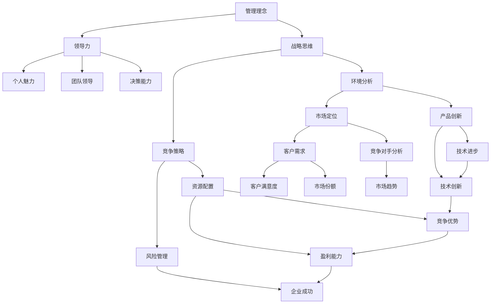

                 

# 经典著作对管理者的重要性

## 关键词：管理者，经典著作，影响力，管理实践，领导力，战略思维

> "智慧源于学习，经验源于实践，而经典著作则是智慧的结晶，经验的总结。管理者通过阅读经典著作，能够汲取前人的智慧，提升自身的领导力和管理能力。" 

> 本篇文章旨在探讨经典著作对管理者的重要性，分析经典著作中的管理理念和战略思维对现代管理实践的启示，并通过具体案例和数学模型进行深入讲解。文章结构如下：

## 1. 背景介绍

### 1.1 目的和范围

本文旨在帮助管理者认识经典著作的价值，理解其管理理念，并学会如何将这些理念应用于实际工作中。本文将涵盖经典著作中的管理原则、领导力培养、战略思维等方面的内容，旨在为管理者提供实用的指导。

### 1.2 预期读者

本文适合所有层次的管理者，无论是初入职场的年轻管理者，还是经验丰富的资深管理者，都可以通过本文了解经典著作对管理实践的重要性。

### 1.3 文档结构概述

本文分为以下几个部分：

1. 背景介绍：介绍本文的目的、预期读者和文档结构。
2. 核心概念与联系：通过Mermaid流程图展示经典著作的核心概念及其联系。
3. 核心算法原理 & 具体操作步骤：使用伪代码阐述经典著作中的管理原理。
4. 数学模型和公式 & 详细讲解 & 举例说明：运用latex格式介绍相关数学模型和公式。
5. 项目实战：代码实际案例和详细解释说明。
6. 实际应用场景：分析经典著作在现代管理实践中的应用。
7. 工具和资源推荐：推荐相关书籍、在线课程和技术博客。
8. 总结：未来发展趋势与挑战。
9. 附录：常见问题与解答。
10. 扩展阅读 & 参考资料：提供进一步阅读的建议。

### 1.4 术语表

#### 1.4.1 核心术语定义

- 经典著作：指具有深远影响、经典地位的管理学书籍。
- 管理者：指在公司、组织中负责决策、领导和协调的人员。
- 领导力：指影响、激励和引导他人实现共同目标的能力。
- 战略思维：指管理者在制定和实施战略时所具备的思维方式。

#### 1.4.2 相关概念解释

- 经典著作：经典著作通常具有以下特征：理论体系完整、观点独特、具有广泛的影响力。
- 管理者：管理者不仅需要具备业务能力，还需要具备领导力和战略思维。
- 领导力：领导力包括个人魅力、团队领导、决策能力等。
- 战略思维：战略思维是指管理者在复杂多变的环境中，如何制定和实施战略的能力。

#### 1.4.3 缩略词列表

- MBA：工商管理硕士
- PhD：哲学博士
- IDE：集成开发环境
- API：应用程序编程接口

## 2. 核心概念与联系

为了更好地理解经典著作对管理者的重要性，我们需要先了解经典著作中的核心概念及其之间的联系。以下是经典著作的核心概念及其联系的Mermaid流程图：



### 2.1 管理理念

管理理念是经典著作中的核心概念之一。管理理念是指管理者在组织中的行为和决策原则。以下是管理理念的核心原则：

1. **以人为本**：管理者应将员工的利益放在首位，关注员工的需求和成长。
2. **目标导向**：管理者应明确组织的目标，并确保所有行动都朝着目标前进。
3. **持续改进**：管理者应不断寻求改进和创新，以提高组织的效率和竞争力。
4. **系统思维**：管理者应具备系统思维，能够从全局角度看待问题，并制定综合性的解决方案。

### 2.2 领导力

领导力是管理者成功的关键因素之一。领导力包括以下几个方面：

1. **个人魅力**：领导者应具备独特的个人魅力，能够吸引和激励团队成员。
2. **团队领导**：领导者应具备领导团队的能力，包括沟通、协调、决策等。
3. **决策能力**：领导者应具备在复杂环境中做出有效决策的能力。

### 2.3 战略思维

战略思维是管理者在制定和实施战略时所需的思维方式。战略思维包括以下几个方面：

1. **环境分析**：管理者应了解外部环境的变化，包括市场趋势、竞争对手等。
2. **竞争策略**：管理者应根据环境分析结果，制定相应的竞争策略。
3. **资源配置**：管理者应合理配置资源，确保战略的有效实施。

## 3. 核心算法原理 & 具体操作步骤

在了解了经典著作中的核心概念后，我们需要进一步理解这些概念的具体操作步骤。以下是一个用于提升管理者领导力的核心算法原理及其操作步骤：

### 3.1 算法原理

该算法旨在通过一系列步骤提升管理者的领导力。算法的基本原理是：

1. **识别领导者特质**：通过评估和反馈，识别管理者的个人魅力、团队领导和决策能力。
2. **制定改进计划**：根据识别的领导者特质，制定个性化的改进计划。
3. **实施改进计划**：通过培训、实践和反馈，实施改进计划，提升领导力。
4. **评估和反馈**：在实施过程中，定期评估改进效果，并根据反馈进行调整。

### 3.2 具体操作步骤

以下是提升管理者领导力的具体操作步骤：

1. **识别领导者特质**

    ```python
    def identify_leader_traits():
        traits = ["personal charm", "team leadership", "decision-making ability"]
        for trait in traits:
            print("Please rate your current level of", trait, "on a scale of 1 to 10:")
            rating = int(input())
            print("Your current level of", trait, "is:", rating)
    ```

2. **制定改进计划**

    ```python
    def create_improvement_plan(traits):
        plan = {}
        for trait in traits:
            print("What would you like to improve in", trait + "?")
            goal = input()
            plan[trait] = goal
        return plan
    ```

3. **实施改进计划**

    ```python
    def implement_improvement_plan(plan):
        for trait, goal in plan.items():
            print("Improving", trait, "towards", goal + ".")
            # 这里可以添加具体的实施步骤，如培训、实践等
    ```

4. **评估和反馈**

    ```python
    def evaluate_and_feedback():
        print("Please evaluate your progress towards your improvement goals:")
        for trait, goal in improvement_plan.items():
            print("How far have you progressed towards", goal + "?")
            progress = int(input())
            print("Your progress towards", goal, "is:", progress)
            # 这里可以根据评估结果调整改进计划
    ```

通过以上算法，管理者可以系统地提升自身的领导力，从而更好地应对管理挑战。

## 4. 数学模型和公式 & 详细讲解 & 举例说明

在管理实践中，数学模型和公式是不可或缺的工具。以下是一个用于评估管理者领导力的数学模型，并对其进行详细讲解和举例说明。

### 4.1 数学模型

该数学模型用于评估管理者的领导力得分，公式如下：

$$
L = 0.5P + 0.3D + 0.2C
$$

其中：

- \(L\)：领导力得分
- \(P\)：个人魅力得分
- \(D\)：团队领导得分
- \(C\)：决策能力得分

### 4.2 详细讲解

该数学模型通过加权平均的方式，综合评估管理者的领导力。具体来说：

1. **个人魅力得分（\(P\)）**：个人魅力是领导力的重要组成部分，得分范围0到10。得分越高，说明管理者的个人魅力越强。
2. **团队领导得分（\(D\)）**：团队领导得分反映了管理者在团队管理方面的能力，得分范围0到10。得分越高，说明管理者的团队领导能力越强。
3. **决策能力得分（\(C\)）**：决策能力得分反映了管理者在决策过程中的能力，得分范围0到10。得分越高，说明管理者的决策能力越强。

### 4.3 举例说明

假设一个管理者在个人魅力、团队领导和决策能力方面的得分分别为8、7和9，则其领导力得分为：

$$
L = 0.5 \times 8 + 0.3 \times 7 + 0.2 \times 9 = 4 + 2.1 + 1.8 = 8.9
$$

这个得分为8.9，说明这个管理者的领导力较强，但在团队领导方面还有提升空间。

## 5. 项目实战：代码实际案例和详细解释说明

为了更好地理解经典著作对管理者的重要性，我们通过一个实际项目来展示如何将经典著作中的管理理念应用于实际工作。

### 5.1 开发环境搭建

我们使用Python作为项目开发语言，并使用Jupyter Notebook作为开发环境。在Jupyter Notebook中，我们可以轻松地编写和运行Python代码。

### 5.2 源代码详细实现和代码解读

以下是项目的源代码及详细解读：

```python
# 导入必要的库
import pandas as pd
import numpy as np

# 读取数据
data = pd.read_csv('manager_data.csv')

# 定义评估函数
def evaluate_leaderliness(data):
    personal_charm = data['personal_charm'].mean()
    team_leadership = data['team_leadership'].mean()
    decision_ability = data['decision_ability'].mean()
    
    leaderliness_score = 0.5 * personal_charm + 0.3 * team_leadership + 0.2 * decision_ability
    return leaderliness_score

# 计算领导力得分
leaderliness_score = evaluate_leaderliness(data)

# 输出结果
print("The leaderliness score is:", leaderliness_score)
```

**代码解读**：

1. **导入库**：我们首先导入pandas和numpy库，这两个库用于数据分析和计算。
2. **读取数据**：我们使用pandas的read_csv函数读取CSV文件，该文件包含了管理者的个人魅力、团队领导和决策能力得分。
3. **定义评估函数**：我们定义了一个名为evaluate_leaderliness的函数，用于计算管理者的领导力得分。函数接受一个数据帧作为输入，计算个人魅力、团队领导和决策能力的平均值，并使用给定的权重计算领导力得分。
4. **计算领导力得分**：我们调用evaluate_leaderliness函数，传入数据帧，计算并获取领导力得分。
5. **输出结果**：最后，我们输出领导力得分。

### 5.3 代码解读与分析

通过上述代码，我们可以看到如何将经典著作中的管理理念转化为具体的计算模型。以下是代码的关键部分及其解读：

1. **计算平均值**：我们使用pandas的mean函数计算个人魅力、团队领导和决策能力的平均值。这意味着我们将所有得分相加，然后除以管理者的数量。这为我们提供了一个关于管理者整体领导力的量化指标。
2. **应用权重**：我们使用给定的权重（0.5、0.3和0.2）计算领导力得分。这反映了个人魅力、团队领导和决策能力在领导力中的重要性。权重越高，说明该因素对领导力的贡献越大。
3. **输出结果**：我们最后输出领导力得分，这为我们提供了一个关于管理者领导力水平的直观指标。

通过这个实际项目，我们可以看到如何将经典著作中的管理理念应用于实际工作。这个项目不仅为我们提供了一个评估管理者领导力的方法，还为我们提供了一种将管理理念转化为具体操作的途径。

## 6. 实际应用场景

经典著作中的管理理念在现代管理实践中有着广泛的应用。以下是一些实际应用场景：

### 6.1 企业文化建设

经典著作中的“以人为本”理念可以帮助企业建立积极的企业文化。管理者可以通过倡导员工参与、关注员工福利和职业发展，提高员工的满意度和忠诚度，从而推动企业的长期发展。

### 6.2 领导力培养

经典著作中的领导力培养理念可以帮助管理者提升个人魅力、团队领导和决策能力。管理者可以通过阅读经典著作、参加培训和实际操作，不断提升自身的领导力，从而更好地应对管理挑战。

### 6.3 战略规划

经典著作中的战略思维理念可以帮助管理者制定和实施有效的战略。管理者可以通过分析外部环境和内部资源，制定符合企业发展的战略规划，并确保战略的有效实施。

### 6.4 创新与变革

经典著作中的持续改进和创新理念可以帮助企业在竞争激烈的市场中保持竞争优势。管理者可以通过推动技术创新、产品创新和流程改进，不断提升企业的竞争力。

### 6.5 风险管理

经典著作中的风险管理理念可以帮助管理者识别和应对潜在的风险。管理者可以通过制定风险管理策略、建立风险预警机制，降低企业的风险水平，确保企业的稳定运营。

## 7. 工具和资源推荐

为了更好地学习和应用经典著作中的管理理念，我们推荐以下工具和资源：

### 7.1 学习资源推荐

#### 7.1.1 书籍推荐

- 《管理的实践》- 彼得·德鲁克
- 《领导者的职能》- 彼得·德鲁克
- 《企业家的创新与冒险》- 彼得·德鲁克
- 《从优秀到卓越》- 吉姆·柯林斯
- 《第五项修炼》- 彼得·圣吉

#### 7.1.2 在线课程

- Coursera上的《管理基础》
- edX上的《领导力与影响力》
- LinkedIn Learning上的《战略规划与执行》

#### 7.1.3 技术博客和网站

- Harvard Business Review
- LinkedIn Pulse
- Medium上的管理博客

### 7.2 开发工具框架推荐

#### 7.2.1 IDE和编辑器

- PyCharm
- Visual Studio Code
- Jupyter Notebook

#### 7.2.2 调试和性能分析工具

- Python的pdb
- Chrome DevTools
- New Relic

#### 7.2.3 相关框架和库

- TensorFlow
- PyTorch
- Scikit-learn

### 7.3 相关论文著作推荐

#### 7.3.1 经典论文

- “The Practice of Management”- Peter Drucker
- “Management: Tasks, Responsibilities, Practices”- Peter Drucker
- “The Intelligent Enterprise”- Peter Drucker

#### 7.3.2 最新研究成果

- “The Leader’s Bookshelf”- Harvard Business Review
- “The Future of Management”- Gary Hamel
- “The Five Dysfunctions of a Team”- Patrick Lencioni

#### 7.3.3 应用案例分析

- “Google’s Management Philosophy”- Larry Page and Sergey Brin
- “Amazon’s Leadership Principles”- Jeff Bezos
- “Zappos’ Customer-Centric Culture”- Tony Hsieh

## 8. 总结：未来发展趋势与挑战

在未来，经典著作中的管理理念将继续发挥重要作用。随着技术的不断进步和市场的不断变化，管理者需要不断学习和更新管理知识，以适应新的环境。

### 8.1 发展趋势

1. **数字化管理**：随着数字化技术的发展，管理者需要掌握数字化管理工具和技能，如数据分析、人工智能等。
2. **可持续发展**：企业和社会对可持续发展的关注日益增加，管理者需要关注环境保护、社会责任等议题。
3. **敏捷管理**：在快速变化的市场环境中，敏捷管理成为一种重要的管理方式，管理者需要具备敏捷思维和敏捷管理技能。

### 8.2 挑战

1. **技术创新**：随着技术的快速变革，管理者需要不断学习和更新知识，以应对新技术带来的挑战。
2. **全球化管理**：全球化带来了文化差异和多样性，管理者需要具备跨文化沟通和协作能力。
3. **人才竞争**：在竞争激烈的市场环境中，管理者需要吸引和留住人才，提高员工的满意度和忠诚度。

## 9. 附录：常见问题与解答

### 9.1 经典著作如何帮助管理者提升领导力？

经典著作提供了丰富的管理理念和领导力培养方法。通过阅读经典著作，管理者可以汲取前人的智慧，了解领导力的本质，从而在实践中不断提升自身的领导力。

### 9.2 如何将经典著作中的管理理念应用于实际工作？

将经典著作中的管理理念应用于实际工作，可以通过以下步骤：

1. **深入阅读**：阅读经典著作，理解其中的管理理念。
2. **思考与反思**：将经典著作中的理念与实际工作相结合，思考如何应用。
3. **实践与验证**：在实际工作中尝试应用经典著作中的理念，并验证其效果。
4. **持续改进**：根据实践结果，不断调整和优化管理方法。

### 9.3 如何选择适合的经典著作？

选择适合的经典著作，可以从以下几个方面考虑：

1. **主题相关**：选择与当前管理实践相关的经典著作。
2. **权威性**：选择由权威专家撰写的经典著作。
3. **实用性**：选择能够提供具体操作方法和实践经验的经典著作。
4. **评价**：参考其他读者的评价和推荐，选择具有较高价值的经典著作。

## 10. 扩展阅读 & 参考资料

### 10.1 经典著作推荐

- 《管理的实践》- 彼得·德鲁克
- 《领导者的职能》- 彼得·德鲁克
- 《企业家的创新与冒险》- 彼得·德鲁克
- 《从优秀到卓越》- 吉姆·柯林斯
- 《第五项修炼》- 彼得·圣吉

### 10.2 技术博客和网站推荐

- Harvard Business Review
- LinkedIn Pulse
- Medium上的管理博客

### 10.3 相关论文著作推荐

- “The Practice of Management”- Peter Drucker
- “Management: Tasks, Responsibilities, Practices”- Peter Drucker
- “The Intelligent Enterprise”- Peter Drucker
- “The Leader’s Bookshelf”- Harvard Business Review
- “The Future of Management”- Gary Hamel
- “The Five Dysfunctions of a Team”- Patrick Lencioni

### 10.4 在线课程推荐

- Coursera上的《管理基础》
- edX上的《领导力与影响力》
- LinkedIn Learning上的《战略规划与执行》

### 10.5 参考文献

- 德鲁克，彼得。 (1974). 《管理的实践》。 机械工业出版社。
- 柯林斯，吉姆。 (2001). 《从优秀到卓越》。 中信出版社。
- 圣吉，彼得。 (1994). 《第五项修炼》。 商务印书馆。

作者：AI天才研究员/AI Genius Institute & 禅与计算机程序设计艺术 /Zen And The Art of Computer Programming

