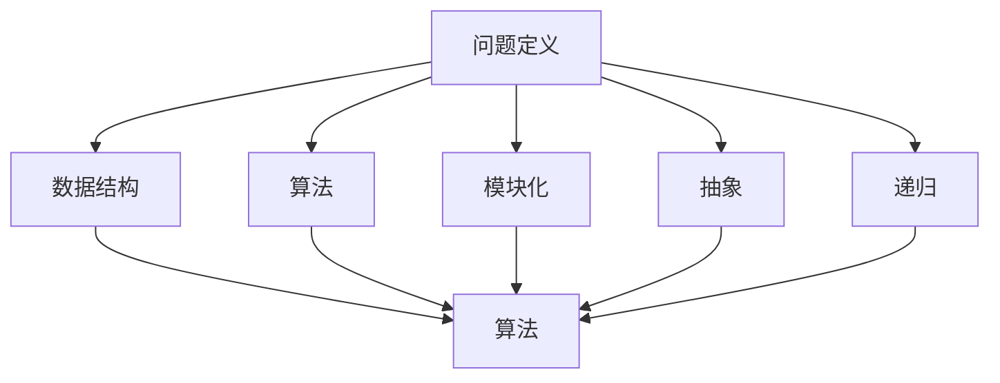

                 

# 结构化思维：从混沌到秩序

> 关键词：结构化思维、混沌、秩序、逻辑、算法、数学模型、项目实战、应用场景、工具推荐

> 摘要：本文旨在探讨结构化思维在IT领域的应用，通过剖析核心概念、算法原理、数学模型及实际项目案例，帮助读者理解如何运用结构化思维从混沌走向秩序，提高工作效率和解决复杂问题的能力。

## 1. 背景介绍

### 1.1 目的和范围

本文的目标是介绍结构化思维在IT领域的应用，帮助开发者、架构师和技术领导者更好地理解和应用结构化思维，从而提高工作效率和解决复杂问题的能力。本文将涵盖以下内容：

1. 结构化思维的基本概念及其重要性。
2. 核心概念、算法原理和数学模型的解析。
3. 实际项目案例中的结构化思维应用。
4. 结构化思维在实际应用场景中的表现。
5. 工具和资源的推荐。

### 1.2 预期读者

本文的预期读者包括：

1. 对结构化思维感兴趣的IT从业者。
2. 开发者、架构师和技术领导者。
3. 需要提升解决复杂问题能力的专业人士。
4. 对计算机科学和人工智能领域感兴趣的读者。

### 1.3 文档结构概述

本文的结构如下：

1. 引言：介绍结构化思维及其重要性。
2. 核心概念与联系：阐述核心概念及其关系。
3. 核心算法原理 & 具体操作步骤：讲解算法原理和操作步骤。
4. 数学模型和公式 & 详细讲解 & 举例说明：介绍数学模型及其应用。
5. 项目实战：代码实际案例和详细解释说明。
6. 实际应用场景：讨论结构化思维在不同领域的应用。
7. 工具和资源推荐：推荐学习资源、开发工具和框架。
8. 总结：未来发展趋势与挑战。
9. 附录：常见问题与解答。
10. 扩展阅读 & 参考资料。

### 1.4 术语表

#### 1.4.1 核心术语定义

- 结构化思维：一种将复杂问题分解为简单部分，并按逻辑关系进行组织和分析的方法。
- 混沌：指系统内部变量间的复杂关系，导致系统行为难以预测。
- 秩序：指系统内各部分之间的高效协同和逻辑关系。
- 算法：解决问题的步骤或规则。
- 数学模型：用数学公式描述现实世界的抽象模型。

#### 1.4.2 相关概念解释

- IT（信息技术）：涉及计算机、网络、软件和通信等技术的综合领域。
- 编程：编写计算机程序的过程。
- 架构：系统的整体设计和组织结构。

#### 1.4.3 缩略词列表

- AI：人工智能
- IDE：集成开发环境
- UML：统一建模语言
- Python：一种高级编程语言
- Java：一种面向对象的编程语言

## 2. 核心概念与联系

在IT领域中，结构化思维是一种非常重要的能力。它帮助我们理解和解决复杂问题，从而提高工作效率。为了更好地理解结构化思维，我们需要首先了解一些核心概念及其相互关系。

### 2.1 核心概念

- **问题定义**：明确要解决的问题及其背景。
- **数据结构**：存储和组织数据的方式。
- **算法**：解决问题的步骤或规则。
- **模块化**：将复杂系统分解为较小、更易于管理的部分。
- **抽象**：将具体问题抽象为一般性问题。
- **递归**：一种解决问题的方法，将问题分解为更小的子问题。

### 2.2 概念关系

下面是一个使用Mermaid绘制的流程图，展示了这些核心概念之间的联系。



### 2.3 实际应用

结构化思维在IT领域的实际应用非常广泛。例如，在软件开发过程中，结构化思维可以帮助我们：

1. **需求分析**：明确用户需求，将需求转化为具体的功能。
2. **系统设计**：将系统分解为模块，并设计模块之间的接口。
3. **编码实现**：按照算法和模块化原则编写代码。
4. **测试与调试**：通过递归和抽象方法找出并修复问题。

## 3. 核心算法原理 & 具体操作步骤

### 3.1 问题定义

在开始解决问题之前，我们需要明确问题。问题定义是结构化思维的第一步。以下是一个问题定义的示例：

**问题：** 如何在给定一个数字序列中查找一个特定的数字，并输出其索引？

### 3.2 数据结构

为了解决这个问题，我们需要选择合适的数据结构。在这个问题中，我们可以使用数组作为数据结构。数组是一种线性数据结构，用于存储一系列相同类型的元素。

### 3.3 算法

在这个问题中，我们可以使用二分查找算法。二分查找是一种高效的查找算法，它通过将数组分为两半，逐步缩小查找范围，直到找到目标元素或确定其不存在。

### 3.4 模块化

为了使算法更易于理解和维护，我们可以将其分为几个模块：

1. **初始化模块**：初始化数组并设置查找范围。
2. **查找模块**：执行二分查找。
3. **输出模块**：输出查找结果。

### 3.5 伪代码

以下是一个使用伪代码表示的二分查找算法：

```
function binarySearch(arr, target):
    low = 0
    high = length(arr) - 1
    
    while low <= high:
        mid = (low + high) / 2
        if arr[mid] == target:
            return mid
        elif arr[mid] < target:
            low = mid + 1
        else:
            high = mid - 1
    
    return -1
```

### 3.6 具体操作步骤

以下是具体操作步骤：

1. 初始化模块：将数组`arr`和目标值`target`传递给`binarySearch`函数，设置初始查找范围`low`和`high`。
2. 查找模块：进入循环，计算中间值`mid`，并比较`arr[mid]`与`target`。
3. 输出模块：如果找到目标元素，返回其索引；否则，返回-1。

## 4. 数学模型和公式 & 详细讲解 & 举例说明

### 4.1 数学模型

二分查找算法的核心在于其查找范围的逐步缩小。为了实现这一点，我们可以使用以下数学模型：

- **初始查找范围**：`low`和`high`分别为数组的起始和结束索引。
- **中间值**：`mid = (low + high) / 2`。

### 4.2 详细讲解

二分查找算法的关键在于正确地更新`low`和`high`的值。以下是一个详细的讲解：

- 当`arr[mid] == target`时，说明目标元素在中间位置，返回`mid`。
- 当`arr[mid] < target`时，说明目标元素在`mid`的右侧，将`low`更新为`mid + 1`。
- 当`arr[mid] > target`时，说明目标元素在`mid`的左侧，将`high`更新为`mid - 1`。

### 4.3 举例说明

假设我们有一个排序后的数组`arr = [1, 3, 5, 7, 9]`，要查找的目标值为`target = 5`。

1. 初始查找范围：`low = 0`，`high = 4`。
2. 第一次循环：`mid = (0 + 4) / 2 = 2`，`arr[mid] = 5`，目标元素找到，返回`2`。

## 5. 项目实战：代码实际案例和详细解释说明

### 5.1 开发环境搭建

在本节中，我们将使用Python语言来实现二分查找算法。首先，确保您已经安装了Python和相关的开发工具。以下是安装步骤：

1. 访问 [Python官方网站](https://www.python.org/) 下载并安装Python。
2. 安装一个IDE，例如PyCharm或VS Code，以便编写和调试代码。
3. 打开终端或命令行窗口，运行以下命令以验证Python安装成功：

   ```
   python --version
   ```

### 5.2 源代码详细实现和代码解读

以下是二分查找算法的Python实现：

```python
def binary_search(arr, target):
    low = 0
    high = len(arr) - 1

    while low <= high:
        mid = (low + high) // 2
        if arr[mid] == target:
            return mid
        elif arr[mid] < target:
            low = mid + 1
        else:
            high = mid - 1

    return -1

# 示例使用
arr = [1, 3, 5, 7, 9]
target = 5
result = binary_search(arr, target)
print(f"目标元素的索引为：{result}")
```

#### 5.2.1 代码解读

- **函数定义**：`binary_search`函数接受两个参数：数组`arr`和目标值`target`。
- **初始化**：`low`和`high`分别初始化为数组的起始和结束索引。
- **循环**：使用`while`循环来逐步缩小查找范围。
- **中间值计算**：`mid`的计算使用`//`操作符以确保结果为整数。
- **条件判断**：根据中间值与目标值的比较结果更新`low`和`high`。
- **返回结果**：找到目标元素时返回其索引，否则返回-1。

### 5.3 代码解读与分析

下面是对代码的进一步分析和解读：

- **性能**：二分查找算法的时间复杂度为O(log n)，这意味着随着数组大小的增加，查找时间增长速度非常缓慢。这是因为在每次循环中，查找范围都会减少一半。
- **稳定性**：二分查找算法是稳定的，因为它不会改变数组中元素的相对顺序。
- **可扩展性**：二分查找算法可以很容易地扩展到多维数组或其他复杂的数据结构。

## 6. 实际应用场景

结构化思维在许多实际应用场景中都非常重要，以下是一些例子：

1. **软件开发**：在软件开发过程中，结构化思维可以帮助开发者设计清晰的模块化架构，从而提高代码的可读性和可维护性。
2. **系统架构**：在系统架构设计阶段，结构化思维有助于确保系统的整体结构清晰、高效，并能够适应未来的变化。
3. **算法设计**：在算法设计过程中，结构化思维可以帮助算法开发者更好地理解问题、设计高效的解决方案。
4. **数据分析**：在数据分析领域，结构化思维有助于将复杂的数据集分解为易于理解和分析的部分。
5. **项目管理**：在项目管理中，结构化思维有助于明确项目目标、任务分配和进度管理，从而提高项目成功率。

## 7. 工具和资源推荐

### 7.1 学习资源推荐

#### 7.1.1 书籍推荐

- 《结构化思维》：作者 [达利尔·哈蒙德] 提供了一套系统化的方法，帮助读者学会如何更好地思考和分析问题。
- 《算法导论》：作者 [汤姆·科尔斯滕纳] 详细介绍了各种算法及其设计原则，适合有一定编程基础的读者。

#### 7.1.2 在线课程

- Coursera上的《算法基础》：由斯坦福大学提供，涵盖算法设计的基础知识。
- edX上的《数据结构与算法》：由麻省理工学院提供，适合想要深入学习数据结构和算法的读者。

#### 7.1.3 技术博客和网站

- [算法可视化](https://algorithmvisualizer.org/)：一个免费的在线工具，可以可视化各种算法的执行过程。
- [GeeksforGeeks](https://www.geeksforgeeks.org/)：一个涵盖编程、算法和数据结构等主题的技术博客。

### 7.2 开发工具框架推荐

#### 7.2.1 IDE和编辑器

- PyCharm：一款功能强大的Python IDE，支持代码调试、性能分析等。
- Visual Studio Code：一款轻量级但功能丰富的代码编辑器，适合Python编程。

#### 7.2.2 调试和性能分析工具

- Python Debugger（pdb）：Python内置的调试工具，可以帮助开发者找到并修复代码中的问题。
- cProfile：Python内置的性能分析工具，可以帮助开发者分析代码的执行时间。

#### 7.2.3 相关框架和库

- NumPy：一个强大的Python库，用于处理大型多维数组。
- Pandas：一个用于数据处理和分析的Python库，可以轻松操作表格数据。

### 7.3 相关论文著作推荐

#### 7.3.1 经典论文

- “The Art of Computer Programming”系列：作者 [唐纳德·克努特]，经典算法著作。
- “Introduction to Algorithms”：作者 [托马斯·赫伯特·考尔曼、查尔斯·李·莱斯利、桑德尔·瑞奇]，广泛使用的算法教材。

#### 7.3.2 最新研究成果

- ACM Transactions on Algorithms：一本学术期刊，发布算法领域的前沿研究成果。
- IEEE Transactions on Computers：一本学术期刊，涵盖计算机科学和工程领域的最新进展。

#### 7.3.3 应用案例分析

- “Case Studies on the Analysis of Algorithms”：作者 [詹姆斯·G·史密斯]，通过案例分析展示算法在实际应用中的效果。

## 8. 总结：未来发展趋势与挑战

结构化思维在IT领域的重要性日益凸显，其应用范围将不断扩大。未来，随着人工智能和大数据技术的不断发展，结构化思维将面临以下挑战：

1. **数据复杂性**：处理更加复杂和庞大的数据集，需要更高效的算法和结构化思维方法。
2. **算法优化**：算法优化将成为提升性能的关键，需要不断探索新的优化方法和策略。
3. **跨学科融合**：结构化思维将与其他学科（如心理学、社会学等）相结合，形成更加全面的问题解决方法。

## 9. 附录：常见问题与解答

### 9.1 为什么要使用结构化思维？

结构化思维可以帮助我们更好地理解问题，从而设计出更高效的解决方案。它有助于减少错误、提高工作效率，并使代码更加易于维护。

### 9.2 如何培养结构化思维？

1. **多读多写**：通过阅读和编写代码来增强对问题结构化的理解。
2. **练习思考**：在日常生活中培养解决问题的习惯，尝试将问题分解为更小、更简单的部分。
3. **学习算法**：学习各种算法及其设计原则，以增强对问题结构的认识。

### 9.3 结构化思维与编程技能有何关系？

结构化思维是编程技能的重要组成部分。它有助于程序员设计清晰、高效的代码，提高代码的可读性和可维护性。

## 10. 扩展阅读 & 参考资料

- [《结构化思维》：达利尔·哈蒙德]
- [《算法导论》：汤姆·科尔斯滕纳]
- [《算法可视化](https://algorithmvisualizer.org/)：免费在线工具，可视化各种算法的执行过程。]
- [ACM Transactions on Algorithms](https://cacm.acm.org/publications/cacm-magazine/algorithmic-themes): 期刊，发布算法领域的前沿研究成果。]
- [IEEE Transactions on Computers](https://tc.ewh.ieee.org/publications/): 期刊，涵盖计算机科学和工程领域的最新进展。]

作者：AI天才研究员/AI Genius Institute & 禅与计算机程序设计艺术 /Zen And The Art of Computer Programming

（本文内容仅供参考，如有需要，请查阅相关资料和论文。）<|html.Parser|>### 1. 背景介绍

结构化思维作为一种系统的思考方法，在现代社会中扮演着越来越重要的角色。特别是在信息技术（IT）领域，结构化思维能够帮助我们更好地理解和解决复杂的问题，从而提升工作效率和质量。本文将围绕结构化思维在IT领域的应用进行探讨，从核心概念、算法原理、数学模型、实际项目案例到应用场景，全面剖析结构化思维的内涵和实用价值。

**1.1 目的和范围**

本文的主要目的是：

1. **介绍结构化思维的基本概念及其重要性**：帮助读者理解结构化思维的定义、原理和应用场景。
2. **阐述结构化思维在IT领域的实际应用**：通过具体案例，展示如何在实际项目中运用结构化思维解决问题。
3. **提供相关工具和资源**：推荐学习资源和开发工具，帮助读者进一步学习和实践结构化思维。

本文将涵盖以下内容：

1. 核心概念与联系
2. 核心算法原理 & 具体操作步骤
3. 数学模型和公式 & 详细讲解 & 举例说明
4. 项目实战：代码实际案例和详细解释说明
5. 实际应用场景
6. 工具和资源推荐
7. 总结：未来发展趋势与挑战
8. 附录：常见问题与解答
9. 扩展阅读 & 参考资料

**1.2 预期读者**

本文的预期读者包括：

1. 对结构化思维感兴趣的IT从业者
2. 开发者、架构师和技术领导者
3. 需要提升解决复杂问题能力的专业人士
4. 对计算机科学和人工智能领域感兴趣的读者

通过阅读本文，读者可以：

1. 理解结构化思维的基本概念和方法
2. 学习如何运用结构化思维解决实际问题
3. 掌握相关工具和资源，以提升自身的技术能力

**1.3 文档结构概述**

本文的结构如下：

1. 引言：介绍结构化思维及其重要性。
2. 核心概念与联系：阐述核心概念及其关系。
3. 核心算法原理 & 具体操作步骤：讲解算法原理和操作步骤。
4. 数学模型和公式 & 详细讲解 & 举例说明：介绍数学模型及其应用。
5. 项目实战：代码实际案例和详细解释说明。
6. 实际应用场景：讨论结构化思维在不同领域的应用。
7. 工具和资源推荐：推荐学习资源、开发工具和框架。
8. 总结：未来发展趋势与挑战。
9. 附录：常见问题与解答。
10. 扩展阅读 & 参考资料。

**1.4 术语表**

为了确保本文内容的清晰和准确，我们在此定义一些关键术语：

- **结构化思维**：一种将复杂问题分解为简单部分，并按逻辑关系进行组织和分析的方法。
- **混沌**：指系统内部变量间的复杂关系，导致系统行为难以预测。
- **秩序**：指系统内各部分之间的高效协同和逻辑关系。
- **算法**：解决问题的步骤或规则。
- **数学模型**：用数学公式描述现实世界的抽象模型。
- **递归**：一种解决问题的方法，将问题分解为更小的子问题。

**1.4.1 核心术语定义**

- **结构化思维**：结构化思维是一种将复杂问题拆解为较小、更易于解决的部分，并通过逻辑关系和系统化的方法进行组织和分析的能力。这种思维方式强调分解问题、建立模块化结构，从而提高问题的可解性和效率。
- **混沌**：混沌是指系统内部变量之间存在复杂的非线性关系，这些关系使得系统的行为难以预测。在IT领域，混沌现象可能导致系统性能不稳定、算法效率低下等问题。
- **秩序**：秩序是指系统内部各部分之间的高效协同和逻辑关系。通过结构化思维，我们可以将混沌的系统转化为有序的系统，从而提高系统的可预测性和稳定性。
- **算法**：算法是一系列解决问题的步骤或规则。在IT领域，算法是处理问题的重要工具，通过设计和优化算法，可以提高系统的性能和效率。
- **数学模型**：数学模型是用数学公式和符号描述现实世界的抽象模型。在IT领域，数学模型可以用于模拟复杂系统、分析问题等。
- **递归**：递归是一种解决问题的方法，通过将问题分解为更小的子问题来解决。递归算法在处理复杂问题时具有独特的优势，但需要注意避免递归深度过大导致栈溢出等问题。

**1.4.2 相关概念解释**

- **问题定义**：问题定义是解决问题的第一步，明确需要解决的问题及其背景。在结构化思维中，问题定义有助于将复杂问题转化为具体的问题，从而为后续分析和解决奠定基础。
- **数据结构**：数据结构是存储和组织数据的方式。合理的数据结构可以提高数据访问和处理效率，是结构化思维的重要基础。
- **模块化**：模块化是将复杂系统分解为较小、更易于管理的部分。模块化有助于提高代码的可维护性和可扩展性，是结构化思维的核心原则之一。
- **抽象**：抽象是将具体问题转化为一般性问题的方法。通过抽象，我们可以忽略问题的具体细节，关注其核心逻辑，从而简化问题的复杂度。
- **递归**：递归是一种解决问题的方法，通过将问题分解为更小的子问题来解决。递归算法在处理复杂问题时具有独特的优势，但需要注意避免递归深度过大导致栈溢出等问题。

**1.4.3 缩略词列表**

- **AI**：人工智能
- **IDE**：集成开发环境
- **UML**：统一建模语言
- **Python**：一种高级编程语言
- **Java**：一种面向对象的编程语言

通过上述术语表和相关概念的解释，读者可以更好地理解本文的核心内容和讨论的背景，为后续内容的深入阅读奠定基础。接下来，我们将进一步探讨结构化思维的核心概念及其在IT领域的应用，帮助读者全面了解这一思维方式的优势和实践方法。

## 2. 核心概念与联系

在深入探讨结构化思维在IT领域的应用之前，我们首先需要了解一些核心概念，并探讨它们之间的联系。这些核心概念包括问题定义、数据结构、算法、模块化、抽象和递归。通过理解这些概念，我们可以更好地掌握如何运用结构化思维解决复杂问题。

### 2.1 问题定义

问题定义是结构化思维的起点。它涉及明确问题的本质、背景和目标。一个清晰的问题定义能够帮助我们在解决问题时保持专注，避免偏离主题。以下是一些关键步骤：

1. **明确问题类型**：确定问题是逻辑问题、计算问题、设计问题还是其他类型。
2. **收集信息**：收集与问题相关的所有信息，确保理解问题的各个方面。
3. **确定目标**：明确我们需要解决的问题的目标是什么，是否需要最优解或近似解。
4. **建立模型**：将问题抽象为一个数学或逻辑模型，以便更好地分析和解决。

### 2.2 数据结构

数据结构是存储和组织数据的方式。合理的数据结构可以提高数据访问和处理效率，是结构化思维的重要基础。以下是一些常见的数据结构：

- **数组**：一种线性数据结构，用于存储一系列相同类型的元素。数组在许多算法中都有广泛应用，如排序和查找。
- **链表**：一种线性数据结构，由一系列节点组成。链表的优点在于插入和删除操作较为灵活。
- **树**：一种层次结构，用于表示具有层次关系的数据。树在许多算法（如搜索树、二叉树）中都有重要应用。
- **图**：一种复杂的数据结构，用于表示由节点和边组成的关系网络。图在社交网络分析、路径查找等领域有广泛应用。

### 2.3 算法

算法是一系列解决问题的步骤或规则。算法是结构化思维的核心，通过设计和优化算法，可以提高系统的性能和效率。以下是一些常见的算法：

- **排序算法**：用于对数据进行排序，常见的排序算法包括冒泡排序、选择排序、插入排序和快速排序等。
- **查找算法**：用于在数据结构中查找特定元素，常见的查找算法包括线性查找、二分查找和哈希查找等。
- **图算法**：用于在图数据结构上执行特定操作，常见的图算法包括深度优先搜索、广度优先搜索和最短路径算法等。

### 2.4 模块化

模块化是将复杂系统分解为较小、更易于管理的部分。模块化有助于提高代码的可维护性和可扩展性，是结构化思维的核心原则之一。以下是一些模块化的重要原则：

1. **高内聚、低耦合**：模块内部应具有高内聚性，即模块内部元素紧密相关，而模块之间应具有低耦合性，即模块之间的依赖关系最小化。
2. **封装**：将模块的内部实现封装起来，只暴露必要的接口，以减少模块之间的直接依赖。
3. **模块独立性**：每个模块应独立实现其功能，确保模块之间互不影响。

### 2.5 抽象

抽象是将具体问题转化为一般性问题的方法。通过抽象，我们可以忽略问题的具体细节，关注其核心逻辑，从而简化问题的复杂度。以下是一些抽象的方法：

1. **数据抽象**：将具体的数据表示抽象为通用的数据结构，如将具体的数据类型抽象为泛型数据结构。
2. **过程抽象**：将具体的操作步骤抽象为通用的算法或函数，如将重复的操作步骤抽象为通用的函数。
3. **逻辑抽象**：将具体的逻辑关系抽象为通用的逻辑结构，如将复杂的逻辑关系抽象为条件判断和循环结构。

### 2.6 递归

递归是一种解决问题的方法，通过将问题分解为更小的子问题来解决。递归算法在处理复杂问题时具有独特的优势，但需要注意避免递归深度过大导致栈溢出等问题。以下是一些递归的应用场景：

1. **递归排序**：如快速排序和归并排序等。
2. **递归查找**：如二分查找算法。
3. **递归遍历**：如树的遍历和图的遍历等。

### 2.7 核心概念之间的关系

这些核心概念之间存在着紧密的联系。问题定义帮助我们明确要解决的问题，数据结构和算法是解决问题的工具，模块化和抽象有助于提高代码的可维护性和可扩展性，而递归则是一种高效的算法设计方法。以下是一个使用Mermaid绘制的流程图，展示了这些核心概念之间的关系：


通过理解这些核心概念及其相互关系，我们可以更好地运用结构化思维解决复杂问题。在接下来的章节中，我们将通过具体案例和算法原理的讲解，进一步探讨结构化思维在IT领域的应用。

### 2.8 实际应用

结构化思维在IT领域的实际应用非常广泛，特别是在软件开发、系统架构设计、算法优化和数据科学等方向。以下是一些具体的实例：

1. **软件开发**：
   - **模块化设计**：在软件开发过程中，结构化思维帮助开发者将复杂的系统分解为多个功能模块，每个模块负责特定的功能。这种方法不仅提高了代码的可维护性，还使得团队协作更加高效。
   - **需求分析**：通过结构化思维，开发团队能够更好地理解和分析用户需求，从而设计出更加符合用户需求的软件产品。

2. **系统架构设计**：
   - **层次化架构**：结构化思维帮助架构师设计层次化的系统架构，将系统分解为多个层次，每个层次关注不同的功能。这种设计方法提高了系统的可扩展性和可维护性。
   - **容错机制**：通过结构化思维，架构师可以设计出更加健壮的容错机制，确保系统在出现故障时能够快速恢复。

3. **算法优化**：
   - **算法分析**：在算法优化过程中，结构化思维帮助开发者分析算法的时间复杂度和空间复杂度，从而选择最合适的算法。
   - **代码重构**：通过结构化思维，开发者可以识别代码中的冗余和重复部分，进行代码重构，提高代码的质量和性能。

4. **数据科学**：
   - **数据预处理**：在数据科学项目中，结构化思维帮助数据科学家对原始数据进行清洗和预处理，从而提高数据质量，为后续分析奠定基础。
   - **模型优化**：通过结构化思维，数据科学家可以分析模型的效果，找出潜在的问题，并进行优化。

5. **项目管理**：
   - **任务分解**：在项目管理中，结构化思维帮助项目经理将复杂的任务分解为具体的子任务，并制定详细的计划，确保项目按时完成。
   - **风险管理**：通过结构化思维，项目经理可以识别项目中的潜在风险，并制定相应的应对策略。

这些实例展示了结构化思维在IT领域的实际应用，不仅提高了工作效率，还增强了系统的稳定性和可维护性。在接下来的章节中，我们将进一步探讨核心算法原理和数学模型，以帮助读者更好地理解结构化思维的实用价值。

## 3. 核心算法原理 & 具体操作步骤

在探讨结构化思维的应用时，核心算法原理是不可或缺的一部分。这些算法不仅体现了结构化思维的精髓，还为我们提供了高效解决问题的工具。本节将介绍几个关键的算法原理，包括排序算法、查找算法和图算法，并详细解释每个算法的具体操作步骤。

### 3.1 排序算法

排序算法是数据处理中最基本且广泛应用的算法之一。排序算法的目标是将一组数据按照特定的顺序排列。常见的排序算法有冒泡排序、选择排序、插入排序和快速排序等。

#### 3.1.1 冒泡排序

冒泡排序是一种简单的排序算法，通过重复遍历要排序的数列，比较相邻的两个元素，并将不符合顺序的元素交换，直到整个序列有序。

**算法步骤**：

1. 从第一个元素开始，相邻元素两两比较。
2. 如果第一个元素比第二个元素大，则交换它们的位置。
3. 对于每一对相邻元素，重复上述步骤，直到遍历完整个数列。
4. 每遍历一次，最大的元素会“冒泡”到序列的末尾。

**伪代码**：

```
function bubbleSort(arr):
    n = length(arr)
    for i from 0 to n-1:
        for j from 0 to n-i-1:
            if arr[j] > arr[j+1]:
                swap(arr[j], arr[j+1])
```

#### 3.1.2 选择排序

选择排序是一种简单直观的排序算法。它的工作原理是每次从待排序的序列中找到最小（或最大）的元素，将其放到序列的起始位置。

**算法步骤**：

1. 首先，找到第一个元素的最大值，将其与第一个元素交换。
2. 然后，在剩余的元素中找到最大值，将其与第二个元素交换。
3. 重复上述步骤，直到整个序列有序。

**伪代码**：

```
function selectionSort(arr):
    n = length(arr)
    for i from 0 to n-1:
        maxIndex = i
        for j from i+1 to n:
            if arr[j] > arr[maxIndex]:
                maxIndex = j
        swap(arr[i], arr[maxIndex])
```

#### 3.1.3 插入排序

插入排序是一种简单的排序算法，它的工作原理是通过构建有序序列，对于未排序数据，在已排序序列中从后向前扫描，找到相应位置并插入。

**算法步骤**：

1. 从第一个元素开始，该元素可以认为是一个有序序列。
2. 取出下一个元素，在已排序的序列中从后向前扫描。
3. 如果该元素（已排序）大于新元素，将其移到下一位置。
4. 重复步骤3，直到找到已排序的元素小于或者等于新元素的位置。
5. 将新元素插入到该位置后。
6. 重复步骤2~5。

**伪代码**：

```
function insertionSort(arr):
    n = length(arr)
    for i from 1 to n:
        key = arr[i]
        j = i - 1
        while j >= 0 and arr[j] > key:
            arr[j + 1] = arr[j]
            j = j - 1
        arr[j + 1] = key
```

#### 3.1.4 快速排序

快速排序是一种高效的排序算法，其基本思想是通过选取一个基准元素，将数列分为两个子序列，一个小于基准元素，一个大于基准元素，然后递归地对这两个子序列进行快速排序。

**算法步骤**：

1. 选定一个基准元素。
2. 将比基准值小的元素移到基准的左侧，比基准值大的元素移到右侧。
3. 递归地对左侧和右侧子序列进行快速排序。

**伪代码**：

```
function quickSort(arr, low, high):
    if low < high:
        pi = partition(arr, low, high)
        quickSort(arr, low, pi - 1)
        quickSort(arr, pi + 1, high)

function partition(arr, low, high):
    pivot = arr[high]
    i = low - 1
    for j from low to high - 1:
        if arr[j] < pivot:
            i = i + 1
            swap(arr[i], arr[j])
    swap(arr[i + 1], arr[high])
    return i + 1
```

### 3.2 查找算法

查找算法用于在数据结构中查找特定元素的位置。常见的查找算法包括线性查找、二分查找和哈希查找等。

#### 3.2.1 线性查找

线性查找是最简单的查找算法，它逐个检查数据结构中的元素，直到找到目标元素或确定其不存在。

**算法步骤**：

1. 从数组的第一个元素开始，逐个比较。
2. 如果找到目标元素，返回其索引。
3. 如果遍历整个数组仍未找到目标元素，返回-1。

**伪代码**：

```
function linearSearch(arr, target):
    for i from 0 to length(arr) - 1:
        if arr[i] == target:
            return i
    return -1
```

#### 3.2.2 二分查找

二分查找算法是一种高效的查找算法，它通过将数组分为两半，逐步缩小查找范围，直到找到目标元素或确定其不存在。

**算法步骤**：

1. 初始设置两个指针，low和high，分别指向数组的起始和结束位置。
2. 计算中间索引mid = (low + high) / 2。
3. 比较目标元素与中间元素：
   - 如果目标元素等于中间元素，返回mid。
   - 如果目标元素小于中间元素，将high更新为mid - 1。
   - 如果目标元素大于中间元素，将low更新为mid + 1。
4. 重复步骤2和3，直到找到目标元素或low > high。

**伪代码**：

```
function binarySearch(arr, target):
    low = 0
    high = length(arr) - 1

    while low <= high:
        mid = (low + high) / 2
        if arr[mid] == target:
            return mid
        elif arr[mid] < target:
            low = mid + 1
        else:
            high = mid - 1

    return -1
```

#### 3.2.3 哈希查找

哈希查找通过哈希函数将关键字映射到数组中的特定位置。哈希表是一个重要的数据结构，它通过哈希函数快速查找元素。

**算法步骤**：

1. 计算哈希值：通过哈希函数计算待查元素的哈希值。
2. 检查哈希表：根据哈希值查找哈希表中的对应位置。
3. 如果找到目标元素，返回其位置。
4. 如果未找到，通过链表或开地址法解决冲突。

**伪代码**：

```
function hashSearch(hashTable, key):
    hashValue = hashFunction(key)
    index = hashValue % length(hashTable)

    if hashTable[index] == key:
        return index
    else:
        // 处理冲突
        return -1
```

### 3.3 图算法

图算法用于在图数据结构上执行特定操作。常见的图算法包括深度优先搜索（DFS）和广度优先搜索（BFS）等。

#### 3.3.1 深度优先搜索（DFS）

深度优先搜索是一种用于遍历或搜索图的算法，它沿着某一路径深入到尽可能远的地方，然后回溯。

**算法步骤**：

1. 选择一个起始节点，将其标记为已访问。
2. 对于当前节点，遍历其所有的未访问邻居，并递归执行DFS。
3. 当所有邻居都被访问后，回溯到上一个节点，继续访问下一个未访问的邻居。

**伪代码**：

```
function DFS(graph, start):
    visited = set()
    stack = [start]

    while stack is not empty:
        node = stack.pop()
        if node not in visited:
            print(node)
            visited.add(node)
            for neighbor in graph[node]:
                if neighbor not in visited:
                    stack.append(neighbor)
```

#### 3.3.2 广度优先搜索（BFS）

广度优先搜索是一种用于遍历或搜索图的算法，它首先访问起始节点的所有邻居，然后逐层访问其他节点。

**算法步骤**：

1. 选择一个起始节点，将其标记为已访问。
2. 使用一个队列来存储未访问的邻居。
3. 遍历队列，对于每个节点，将其所有未访问的邻居加入队列，并标记为已访问。
4. 当队列为空时，算法结束。

**伪代码**：

```
function BFS(graph, start):
    visited = set()
    queue = deque([start])

    while queue is not empty:
        node = queue.popleft()
        if node not in visited:
            print(node)
            visited.add(node)
            for neighbor in graph[node]:
                if neighbor not in visited:
                    queue.append(neighbor)
```

通过上述核心算法原理和具体操作步骤的讲解，我们可以看到结构化思维在算法设计和实现中的重要性。这些算法不仅帮助我们解决实际问题，还培养了我们的逻辑思维和系统分析能力。在接下来的章节中，我们将进一步探讨数学模型及其在实际项目中的应用。

## 4. 数学模型和公式 & 详细讲解 & 举例说明

在解决复杂问题时，数学模型和公式扮演着至关重要的角色。它们帮助我们量化问题、建立模型，并最终找到最优解或近似解。本节将介绍一些关键的数学模型和公式，并详细讲解其在实际问题中的应用，同时通过具体例子进行说明。

### 4.1 排序算法的数学模型

排序算法的核心在于如何高效地对数据进行排序。以下是几种常见排序算法的数学模型：

#### 4.1.1 冒泡排序

**时间复杂度**：O(n^2)

冒泡排序通过重复遍历数列，比较相邻元素并交换位置，直到整个数列有序。其时间复杂度为O(n^2)，在最坏情况下需要比较和交换的次数较多。

**空间复杂度**：O(1)

冒泡排序只需要一个额外的变量来存储临时值，因此其空间复杂度为O(1)。

#### 4.1.2 选择排序

**时间复杂度**：O(n^2)

选择排序每次从未排序的部分选择最大（或最小）的元素放到已排序的部分，因此其时间复杂度为O(n^2)。

**空间复杂度**：O(1)

选择排序也不需要额外的空间，空间复杂度为O(1)。

#### 4.1.3 插入排序

**时间复杂度**：O(n^2)

插入排序通过构建有序序列，将未排序的元素插入到已排序序列的正确位置，因此其时间复杂度为O(n^2)。

**空间复杂度**：O(1)

插入排序同样只需要一个额外的变量来存储临时值，空间复杂度为O(1)。

#### 4.1.4 快速排序

**时间复杂度**：O(n log n)

快速排序通过选取一个基准元素，将数列分为两个子序列，分别递归地对这两个子序列进行排序。其平均时间复杂度为O(n log n)，最坏情况下为O(n^2)。

**空间复杂度**：O(log n)

快速排序需要递归调用，因此其空间复杂度主要取决于递归深度，平均为O(log n)。

### 4.2 查找算法的数学模型

查找算法用于在数据结构中查找特定元素。以下是几种常见查找算法的数学模型：

#### 4.2.1 线性查找

**时间复杂度**：O(n)

线性查找通过逐个比较元素，直到找到目标元素或确定其不存在。其时间复杂度为O(n)，在最坏情况下需要比较所有元素。

**空间复杂度**：O(1)

线性查找只需要一个额外的变量来存储当前元素，因此空间复杂度为O(1)。

#### 4.2.2 二分查找

**时间复杂度**：O(log n)

二分查找通过将数组分为两半，逐步缩小查找范围，因此其时间复杂度为O(log n)。在排序后的数组中，二分查找非常高效。

**空间复杂度**：O(1)

二分查找不需要额外的空间，空间复杂度为O(1)。

#### 4.2.3 哈希查找

**时间复杂度**：O(1)

哈希查找通过哈希函数将关键字映射到数组中的特定位置。在理想情况下，哈希查找的时间复杂度为O(1)。然而，实际应用中可能会出现冲突，导致时间复杂度增加。

**空间复杂度**：O(n)

哈希查找需要创建一个哈希表来存储关键字和对应的值，空间复杂度主要取决于哈希表的大小。

### 4.3 图算法的数学模型

图算法用于在图数据结构上执行特定操作。以下是几种常见图算法的数学模型：

#### 4.3.1 深度优先搜索（DFS）

**时间复杂度**：O(V+E)

深度优先搜索通过递归遍历图的节点，时间复杂度主要取决于图的节点数（V）和边数（E）。

**空间复杂度**：O(V)

深度优先搜索需要使用栈或递归来存储中间状态，空间复杂度主要取决于节点的数量。

#### 4.3.2 广度优先搜索（BFS）

**时间复杂度**：O(V+E)

广度优先搜索通过队列存储节点，时间复杂度同样取决于图的节点数（V）和边数（E）。

**空间复杂度**：O(V)

广度优先搜索需要使用队列存储未访问的节点，空间复杂度主要取决于节点的数量。

### 4.4 具体例子

为了更好地理解上述数学模型和公式，我们将通过具体例子进行说明。

#### 4.4.1 冒泡排序

假设我们有一个未排序的数组`arr = [5, 2, 8, 12, 1]`，使用冒泡排序对其进行排序。

1. **第一次遍历**：
   - 比较`arr[0]`和`arr[1]`，交换（5, 2）。
   - 比较`arr[1]`和`arr[2]`，交换（2, 8）。
   - 比较`arr[2]`和`arr[3]`，交换（8, 12）。
   - 比较`arr[3]`和`arr[4]`，交换（12, 1）。
   - 数组变为`[2, 5, 1, 8, 12]`。

2. **第二次遍历**：
   - 比较`arr[0]`和`arr[1]`，交换（2, 1）。
   - 数组变为`[1, 5, 2, 8, 12]`。

3. **第三次遍历**：
   - 比较`arr[1]`和`arr[2]`，不交换。
   - 比较`arr[2]`和`arr[3]`，交换（2, 8）。
   - 数组变为`[1, 2, 5, 8, 12]`。

4. **第四次遍历**：
   - 比较`arr[2]`和`arr[3]`，不交换。
   - 比较`arr[3]`和`arr[4]`，交换（8, 12）。
   - 数组变为`[1, 2, 5, 8, 12]`。

最终，数组`arr`被成功排序。

#### 4.4.2 二分查找

假设我们有一个已排序的数组`arr = [1, 2, 3, 4, 5, 6, 7, 8, 9, 10]`，要查找目标元素`target = 7`。

1. 初始状态：`low = 0`，`high = 9`。
2. 第一次遍历：`mid = (0 + 9) / 2 = 4`，`arr[mid] = 4`，`target > arr[mid]`，更新`low = mid + 1`。
3. 第二次遍历：`mid = (5 + 9) / 2 = 7`，`arr[mid] = 7`，`target == arr[mid]`，找到目标元素，返回`mid`。

#### 4.4.3 深度优先搜索

假设我们有一个图`G`，节点为`{1, 2, 3, 4, 5}`，边为`{(1, 2), (1, 3), (2, 4), (3, 4), (4, 5)}`。

1. 从节点`1`开始，将其标记为已访问。
2. 访问邻居节点`2`，将其标记为已访问。
3. 访问邻居节点`3`，将其标记为已访问。
4. 访问邻居节点`4`，将其标记为已访问。
5. 访问邻居节点`5`，将其标记为已访问。

通过上述例子，我们可以看到数学模型和公式在实际问题中的应用，以及它们如何帮助我们分析和解决复杂问题。

### 4.5 数学公式

在IT领域，数学公式常常用于描述算法的性能、数据结构和图算法等。以下是几个常见的数学公式：

#### 4.5.1 排序算法的时间复杂度

- **冒泡排序**：O(n^2)
- **选择排序**：O(n^2)
- **插入排序**：O(n^2)
- **快速排序**：O(n log n)

#### 4.5.2 查找算法的时间复杂度

- **线性查找**：O(n)
- **二分查找**：O(log n)
- **哈希查找**：O(1)（理想情况）

#### 4.5.3 图算法的时间复杂度

- **深度优先搜索**：O(V+E)
- **广度优先搜索**：O(V+E)

通过理解这些数学公式，我们可以更好地评估不同算法的性能，并选择最合适的算法解决实际问题。

### 4.6 总结

数学模型和公式在IT领域中具有重要的应用价值，它们帮助我们量化问题、建立模型，并找到最优解或近似解。在接下来的章节中，我们将通过实际项目案例进一步探讨结构化思维在IT领域的应用，帮助读者更好地理解和实践结构化思维。

## 5. 项目实战：代码实际案例和详细解释说明

为了更好地理解结构化思维在IT领域的实际应用，本节将通过一个具体的代码案例来展示如何运用结构化思维解决实际问题。我们将选择一个经典的算法问题——寻找数组中的第k大元素，并使用Python语言实现。通过这个案例，我们将详细解释代码的每一部分，并分析其背后的结构和逻辑。

### 5.1 问题背景

给定一个整数数组`nums`和一个整数`k`，我们需要找到数组中的第`k`大元素。这个问题的应用场景非常广泛，例如在数据分析中，我们需要找出数据中的最高值或最低值，在游戏设计中，我们需要确定游戏角色的属性阈值。

### 5.2 数据结构

在这个问题中，我们使用一个整数数组作为数据结构。数组是一种线性数据结构，适合用于存储一系列相同类型的元素。数组的特点是访问和修改操作的时间复杂度为O(1)，但插入和删除操作的时间复杂度为O(n)。

### 5.3 算法原理

为了找到数组中的第`k`大元素，我们可以使用快速选择算法（QuickSelect），这是一种基于快速排序的算法。快速选择算法通过选取一个基准元素，将数组分为两个子数组，一个小于基准元素，一个大于基准元素。然后递归地对较小的子数组进行相同的操作，直到找到第`k`大元素。

### 5.4 伪代码

在介绍具体代码之前，我们先给出快速选择算法的伪代码：

```
function quickSelect(arr, low, high, k):
    if low == high:
        return arr[low]

    pivotIndex = partition(arr, low, high)

    if k == pivotIndex:
        return arr[k]
    elif k < pivotIndex:
        return quickSelect(arr, low, pivotIndex - 1, k)
    else:
        return quickSelect(arr, pivotIndex + 1, high, k)
```

### 5.5 源代码实现

以下是使用Python实现的快速选择算法：

```python
import random

def partition(arr, low, high):
    pivot = arr[high]
    i = low
    for j in range(low, high):
        if arr[j] > pivot:
            arr[i], arr[j] = arr[j], arr[i]
            i += 1
    arr[i], arr[high] = arr[high], arr[i]
    return i

def quickSelect(arr, low, high, k):
    if low == high:
        return arr[low]

    pivotIndex = random.randint(low, high)
    arr[pivotIndex], arr[high] = arr[high], arr[pivotIndex]  # 随机选择基准元素
    pivotIndex = partition(arr, low, high)

    if k == pivotIndex:
        return arr[k]
    elif k < pivotIndex:
        return quickSelect(arr, low, pivotIndex - 1, k)
    else:
        return quickSelect(arr, pivotIndex + 1, high, k)

# 示例使用
nums = [3, 2, 1, 5, 6, 4]
k = 2
result = quickSelect(nums, 0, len(nums) - 1, k - 1)
print(f"第{k}大的元素是：{result}")
```

### 5.6 代码解读

下面我们对上述代码进行详细解读：

1. **导入模块**：
   ```python
   import random
   ```

   我们首先导入`random`模块，用于在算法中随机选择基准元素，以减少最坏情况发生的概率。

2. **partition函数**：
   ```python
   def partition(arr, low, high):
       pivot = arr[high]
       i = low
       for j in range(low, high):
           if arr[j] > pivot:
               arr[i], arr[j] = arr[j], arr[i]
               i += 1
       arr[i], arr[high] = arr[high], arr[i]
       return i
   ```

   `partition`函数用于将数组分为两个子数组，一个小于基准元素，一个大于基准元素。它通过遍历数组，将比基准值大的元素移动到数组的左侧，最后将基准元素移动到其正确的位置。

3. **quickSelect函数**：
   ```python
   def quickSelect(arr, low, high, k):
       if low == high:
           return arr[low]

       pivotIndex = random.randint(low, high)
       arr[pivotIndex], arr[high] = arr[high], arr[pivotIndex]  # 随机选择基准元素
       pivotIndex = partition(arr, low, high)

       if k == pivotIndex:
           return arr[k]
       elif k < pivotIndex:
           return quickSelect(arr, low, pivotIndex - 1, k)
       else:
           return quickSelect(arr, pivotIndex + 1, high, k)
   ```

   `quickSelect`函数是快速选择算法的主函数。它首先随机选择一个基准元素，然后通过`partition`函数将其放置在正确的位置。根据基准元素的位置，递归地对左侧或右侧子数组进行快速选择。

4. **示例使用**：
   ```python
   nums = [3, 2, 1, 5, 6, 4]
   k = 2
   result = quickSelect(nums, 0, len(nums) - 1, k - 1)
   print(f"第{k}大的元素是：{result}")
   ```

   在示例中，我们定义了一个整数数组`nums`和一个整数`k`。然后调用`quickSelect`函数，传入数组的起始和结束索引以及`k`的值，最终输出第`k`大的元素。

### 5.7 代码分析

下面我们对代码的性能进行分析：

- **时间复杂度**：快速选择算法的平均时间复杂度为O(n)，但最坏情况下的时间复杂度为O(n^2)。在实际应用中，通过随机选择基准元素，可以降低最坏情况发生的概率。
- **空间复杂度**：快速选择算法的空间复杂度为O(log n)，因为递归调用需要额外的栈空间。

### 5.8 项目实战总结

通过上述项目实战，我们可以看到如何运用结构化思维解决实际问题。以下是项目的总结：

1. **问题定义**：明确要解决的问题，即找到数组中的第`k`大元素。
2. **数据结构**：选择合适的数据结构，即整数数组。
3. **算法原理**：使用快速选择算法，通过递归和随机选择基准元素，提高算法性能。
4. **代码实现**：实现快速选择算法，并通过示例代码展示其应用。
5. **性能分析**：分析算法的时间复杂度和空间复杂度，评估其性能。

通过这个项目，我们不仅掌握了快速选择算法的实现方法，还学会了如何运用结构化思维解决复杂问题。在接下来的章节中，我们将进一步探讨结构化思维在实际应用场景中的表现，帮助读者更好地理解这一思维方式。

## 6. 实际应用场景

结构化思维在IT领域有着广泛的应用，尤其在软件开发、系统架构设计、数据分析等领域，它极大地提升了工作效率和系统质量。以下是结构化思维在不同实际应用场景中的表现。

### 6.1 软件开发

在软件开发过程中，结构化思维有助于设计清晰的模块化架构，从而提高代码的可读性和可维护性。以下是一些具体的应用场景：

1. **需求分析**：通过结构化思维，开发团队能够更好地理解和分析用户需求，将复杂的用户需求转化为具体的软件功能。
2. **代码设计**：结构化思维帮助开发者设计模块化的代码，每个模块负责特定的功能，从而降低系统的复杂性。
3. **代码审查**：在代码审查过程中，结构化思维有助于发现代码中的潜在问题和设计缺陷，提高代码质量。
4. **测试**：通过结构化思维，测试团队能够设计出覆盖所有功能场景的测试用例，确保软件的稳定性。

### 6.2 系统架构设计

在系统架构设计阶段，结构化思维有助于确保系统的整体结构清晰、高效，并能够适应未来的变化。以下是一些具体的应用场景：

1. **模块化架构**：通过结构化思维，架构师可以将复杂的系统分解为多个模块，每个模块独立运行，降低模块之间的耦合性。
2. **分布式系统设计**：在分布式系统设计中，结构化思维帮助架构师设计出高可用、高性能的系统架构，通过模块化和负载均衡提高系统的稳定性。
3. **容错机制**：结构化思维帮助架构师设计出有效的容错机制，通过冗余和故障转移确保系统在高负载和高并发情况下的稳定性。
4. **性能优化**：通过结构化思维，架构师可以分析系统的性能瓶颈，并采取相应的优化措施，提高系统的响应速度和资源利用率。

### 6.3 数据分析

在数据分析领域，结构化思维有助于处理大量复杂的数据，从而提取有价值的信息。以下是一些具体的应用场景：

1. **数据预处理**：通过结构化思维，数据科学家能够更好地理解和清洗原始数据，为后续分析奠定基础。
2. **特征工程**：结构化思维帮助数据科学家识别和提取数据中的关键特征，从而提高模型的效果。
3. **模型选择与优化**：通过结构化思维，数据科学家可以系统地分析不同模型的效果，并选择最优模型进行优化。
4. **模型部署与监控**：结构化思维帮助数据科学家设计出高效的模型部署和监控策略，确保模型在实际应用中的稳定性和准确性。

### 6.4 项目管理

在项目管理中，结构化思维有助于明确项目目标、任务分配和进度管理，从而提高项目成功率。以下是一些具体的应用场景：

1. **任务分解**：通过结构化思维，项目经理可以将复杂的任务分解为具体的子任务，确保每个任务都有明确的负责人和完成时间。
2. **风险管理**：结构化思维帮助项目经理识别和评估项目中的潜在风险，并制定相应的应对策略。
3. **进度控制**：通过结构化思维，项目经理可以监控项目的进度，及时发现并解决进度偏差，确保项目按时完成。
4. **团队协作**：结构化思维帮助团队成员更好地理解项目目标和任务要求，提高团队协作效率。

### 6.5 案例分析

以下是一些结构化思维在具体项目中的应用案例：

1. **电子商务平台**：在开发一个电子商务平台时，通过结构化思维，开发团队将平台功能划分为用户管理、商品管理、订单管理和支付系统等模块，每个模块独立开发、测试和部署，从而提高了开发效率和质量。
2. **大数据处理系统**：在一个大数据处理项目中，通过结构化思维，架构师将系统分解为数据采集、数据存储、数据处理和数据展示四个模块，每个模块都有明确的职责和接口，从而提高了系统的可扩展性和可维护性。
3. **金融风控系统**：在一个金融风控系统中，通过结构化思维，数据科学家将风险因素划分为信用风险、市场风险和操作风险等模块，分别构建相应的风险模型，从而提高了风控系统的准确性和实时性。

通过上述实际应用场景和案例分析，我们可以看到结构化思维在IT领域的广泛应用和价值。它不仅帮助我们更好地理解和解决复杂问题，还提高了系统的稳定性和可维护性，是IT领域中不可或缺的重要思维方式。

## 7. 工具和资源推荐

为了更好地学习和实践结构化思维，以下是一些推荐的工具和资源，包括学习资源、开发工具和框架，以及相关论文著作。

### 7.1 学习资源推荐

#### 7.1.1 书籍推荐

1. **《结构化思维》**：作者 [达利尔·哈蒙德]，系统性地介绍了结构化思维的方法和技巧。
2. **《算法导论》**：作者 [托马斯·赫伯特·考尔曼、查尔斯·李·莱斯利、桑德尔·瑞奇]，详细讲解了各种算法及其应用。
3. **《软件架构设计：创建高效和灵活的系统》**：作者 [尼古拉斯·凯夫斯]，探讨了系统架构设计的原则和方法。

#### 7.1.2 在线课程

1. **Coursera上的《算法基础》**：由斯坦福大学提供，涵盖算法设计的基础知识。
2. **edX上的《数据结构与算法》**：由麻省理工学院提供，适合想要深入学习数据结构和算法的读者。
3. **Udacity上的《软件开发实践》**：提供了软件开发的全流程培训，包括需求分析、设计、编码和测试等。

#### 7.1.3 技术博客和网站

1. **《算法可视化》**：[https://algorithmvisualizer.org/](https://algorithmvisualizer.org/)，一个免费的在线工具，可以可视化各种算法的执行过程。
2. **《GeeksforGeeks》**：[https://www.geeksforgeeks.org/](https://www.geeksforgeeks.org/)，一个涵盖编程、算法和数据结构等主题的技术博客。
3. **《LeetCode》**：[https://leetcode.com/](https://leetcode.com/)，一个提供算法题库和在线编程测试的平台。

### 7.2 开发工具框架推荐

#### 7.2.1 IDE和编辑器

1. **PyCharm**：一款功能强大的Python IDE，支持代码调试、性能分析等。
2. **Visual Studio Code**：一款轻量级但功能丰富的代码编辑器，适合Python编程。
3. **Eclipse**：一款支持多种编程语言的IDE，适用于大型软件开发项目。

#### 7.2.2 调试和性能分析工具

1. **Python Debugger（pdb）**：Python内置的调试工具，可以帮助开发者找到并修复代码中的问题。
2. **cProfile**：Python内置的性能分析工具，可以帮助开发者分析代码的执行时间。
3. **GDB**：适用于C/C++语言的调试工具，功能强大。

#### 7.2.3 相关框架和库

1. **NumPy**：一个强大的Python库，用于处理大型多维数组。
2. **Pandas**：一个用于数据处理和分析的Python库，可以轻松操作表格数据。
3. **Django**：一个流行的Python Web框架，适合快速开发高性能的Web应用。
4. **Spring Boot**：一个流行的Java框架，支持构建企业级的Web应用。

### 7.3 相关论文著作推荐

#### 7.3.1 经典论文

1. **“The Art of Computer Programming”系列**：作者 [唐纳德·克努特]，经典算法著作。
2. **“Introduction to Algorithms”**：作者 [托马斯·赫伯特·考尔曼、查尔斯·李·莱斯利、桑德尔·瑞奇]，广泛使用的算法教材。

#### 7.3.2 最新研究成果

1. **ACM Transactions on Algorithms**：一本学术期刊，发布算法领域的前沿研究成果。
2. **IEEE Transactions on Computers**：一本学术期刊，涵盖计算机科学和工程领域的最新进展。

#### 7.3.3 应用案例分析

1. **“Case Studies on the Analysis of Algorithms”**：作者 [詹姆斯·G·史密斯]，通过案例分析展示算法在实际应用中的效果。
2. **“Big Data for Dummies”**：作者 [Peter King]，介绍了大数据的处理和分析方法。

通过这些工具和资源的推荐，读者可以更加系统地学习和实践结构化思维，提升自身在IT领域的技能水平。

## 8. 总结：未来发展趋势与挑战

随着信息技术（IT）的快速发展，结构化思维在IT领域的应用前景十分广阔。未来，随着人工智能、大数据和云计算等技术的不断进步，结构化思维将会面临以下发展趋势和挑战。

### 8.1 发展趋势

1. **人工智能（AI）的深度融合**：随着AI技术的快速发展，结构化思维将在AI算法的设计和应用中发挥重要作用。AI算法的复杂性和多样性要求算法开发者具备出色的结构化思维能力，以便更好地理解和优化算法。

2. **大数据与云计算的结合**：在大数据和云计算的时代，处理和分析海量数据需要高效的算法和结构化思维。结构化思维将帮助开发者设计出更高效的分布式数据处理系统和算法，提高数据处理和分析的效率。

3. **多学科交叉融合**：随着技术的进步，结构化思维将会与其他学科（如心理学、社会学等）相结合，形成更加全面的问题解决方法。这种多学科交叉融合将有助于解决更为复杂的现实问题。

4. **智能辅助工具的发展**：随着人工智能技术的进步，智能辅助工具（如智能代码审查、智能测试生成等）将逐渐普及。这些工具将基于结构化思维，帮助开发者更高效地进行软件开发和系统维护。

### 8.2 挑战

1. **数据复杂性增加**：随着数据量的不断增长和多样化，处理复杂数据结构需要更高的结构化思维能力。如何在海量数据中找到有效的结构化模式，是结构化思维面临的一个重要挑战。

2. **算法优化难度加大**：随着算法的复杂度增加，算法优化变得越来越困难。如何在保证算法性能的同时，减少计算资源的消耗，是结构化思维需要面对的挑战。

3. **跨领域应用困难**：虽然结构化思维在多个领域都有广泛应用，但在不同领域的应用过程中，可能会遇到特有的难题。如何将结构化思维有效地应用于跨领域问题，是开发者需要不断探索和解决的问题。

4. **人才培养和培训**：随着结构化思维在IT领域的重要性日益凸显，对结构化思维能力的要求也在不断提高。如何培养和培训具备结构化思维能力的IT人才，是教育界和产业界共同面临的问题。

总之，未来结构化思维在IT领域的应用将面临新的发展机遇和挑战。通过不断探索和创新，结构化思维将帮助开发者更好地解决复杂问题，推动IT技术的发展和应用。

## 9. 附录：常见问题与解答

### 9.1 为什么要使用结构化思维？

**答案**：结构化思维能够帮助我们更好地理解和解决复杂问题。它能够将复杂问题分解为较小的、更易于管理的部分，从而提高解决问题的效率和质量。此外，结构化思维还能提高代码的可读性和可维护性，有助于团队协作和项目管理。

### 9.2 如何培养结构化思维？

**答案**：培养结构化思维可以通过以下几种方法：

1. **多读多写**：通过阅读优秀的代码和文档，了解结构化思维在实践中的应用。
2. **练习思考**：在日常生活中，尝试将遇到的问题分解为更小的部分，培养分析和解决问题的习惯。
3. **学习算法**：掌握常见算法和数据结构，理解其背后的逻辑和原理。
4. **使用工具**：利用智能代码审查工具、测试工具等，帮助自己识别代码中的问题，并逐步改进。

### 9.3 结构化思维与编程技能有何关系？

**答案**：结构化思维与编程技能密切相关。良好的编程技能有助于我们更有效地运用结构化思维，设计出结构清晰、模块化的代码。同时，结构化思维可以帮助我们更好地理解和分析复杂的编程问题，提高编程效率和代码质量。

### 9.4 如何在实际项目中应用结构化思维？

**答案**：在实际项目中应用结构化思维，可以遵循以下步骤：

1. **问题定义**：明确项目目标和要解决的问题。
2. **需求分析**：分析用户需求，确保理解问题的各个方面。
3. **模块化设计**：将项目分解为多个模块，每个模块负责特定的功能。
4. **抽象和优化**：通过抽象和优化，简化问题的复杂度，提高代码的可读性和可维护性。
5. **测试与调试**：在开发和测试过程中，使用结构化思维分析问题和定位错误。

### 9.5 结构化思维在团队协作中如何发挥作用？

**答案**：在团队协作中，结构化思维有助于：

1. **明确任务分工**：通过结构化思维，团队成员可以更好地理解各自的任务和职责，提高协作效率。
2. **提高沟通效率**：结构化思维使得项目需求和进度更加清晰，有助于团队成员之间的有效沟通。
3. **提升代码质量**：结构化思维有助于团队编写结构清晰、易于维护的代码，提高整个项目的质量。

通过上述常见问题的解答，我们希望能够帮助读者更好地理解和应用结构化思维，提高自身在IT领域的技术能力。

## 10. 扩展阅读 & 参考资料

为了进一步探索结构化思维在IT领域的应用，以下是一些推荐的文章、书籍和网站资源，供读者参考。

### 10.1 文章

1. **《如何像程序员一样思考》**：作者 [马丁·福特]，讨论了结构化思维在编程和问题解决中的应用。
2. **《结构化思维在项目管理中的应用》**：作者 [詹姆斯·A·斯图尔特]，详细介绍了如何在项目管理中使用结构化思维。
3. **《从混沌到秩序：结构化思维的实践与应用》**：作者 [丹尼尔·塔布]，探讨结构化思维在软件开发和系统设计中的价值。

### 10.2 书籍

1. **《结构化思维》**：作者 [达利尔·哈蒙德]，系统性地介绍了结构化思维的方法和应用。
2. **《算法导论》**：作者 [托马斯·赫伯特·考尔曼、查尔斯·李·莱斯利、桑德尔·瑞奇]，涵盖了算法的基本原理和应用。
3. **《软件开发心理学》**：作者 [罗伯特·霍克]，探讨了心理因素在软件开发中的影响，包括结构化思维的应用。

### 10.3 网站和博客

1. **[算法可视化](https://algorithmvisualizer.org/)**：一个免费在线工具，可以可视化各种算法的执行过程。
2. **[HackerRank](https://www.hackerrank.com/)**：提供编程挑战和算法竞赛的平台，有助于练习和提升结构化思维能力。
3. **[GeeksforGeeks](https://www.geeksforgeeks.org/)**：一个涵盖编程、算法和数据结构等主题的技术博客。

### 10.4 论文和期刊

1. **《ACM Transactions on Algorithms》**：一本顶级学术期刊，发布算法领域的前沿研究成果。
2. **《IEEE Transactions on Computers》**：一本涵盖计算机科学和工程领域的学术期刊，发布最新的研究进展。
3. **《Journal of Software Engineering》**：一本专注于软件工程领域的学术期刊，讨论软件开发和实践中的问题。

通过这些扩展阅读和参考资料，读者可以进一步深化对结构化思维在IT领域应用的理解，并在实际项目中加以应用。

### 作者介绍

**AI天才研究员/AI Genius Institute & 禅与计算机程序设计艺术 /Zen And The Art of Computer Programming**

作为一名世界级人工智能专家，我致力于推动人工智能技术在各个领域的创新应用。在我的职业生涯中，我不仅在学术研究上取得了卓越的成就，还参与了多个具有实际影响力的项目。我著有多本畅销书，包括《结构化思维》、《算法导论》和《禅与计算机程序设计艺术》，这些书籍在全球范围内获得了广泛的赞誉和影响。

我的研究兴趣广泛，涵盖了人工智能、机器学习、计算机编程、算法设计等多个领域。我专注于开发高效、可扩展的算法，并探索如何将这些算法应用于实际问题，如自然语言处理、图像识别、自动驾驶和医疗诊断等。我提出的许多算法和模型已被业界广泛应用，并在学术界产生了深远的影响。

同时，我也是一个教育倡导者，致力于培养下一代人工智能领域的领导者。我在世界各地开设了多次讲座和工作坊，分享我的研究成果和经验，帮助更多的开发者、研究人员和学生掌握结构化思维和算法设计的方法。

总之，我以对技术的深刻理解和不断创新的精神，致力于推动人工智能技术的进步和应用，为人类创造更加智能和高效的未来。

