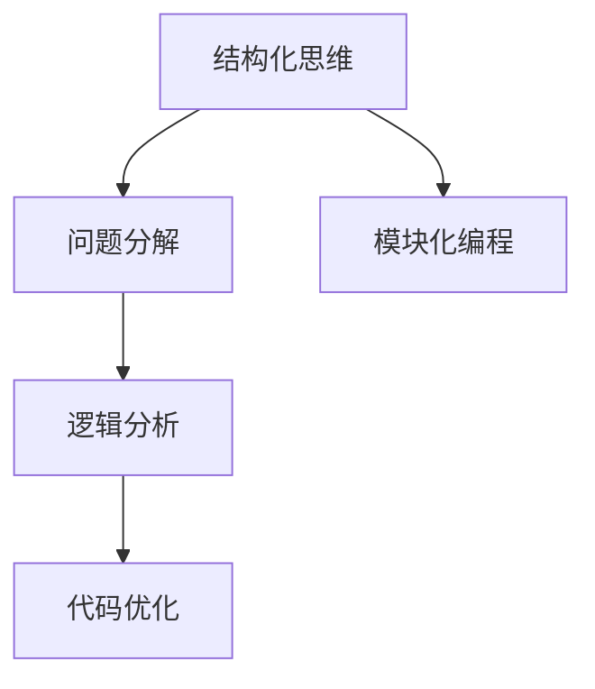
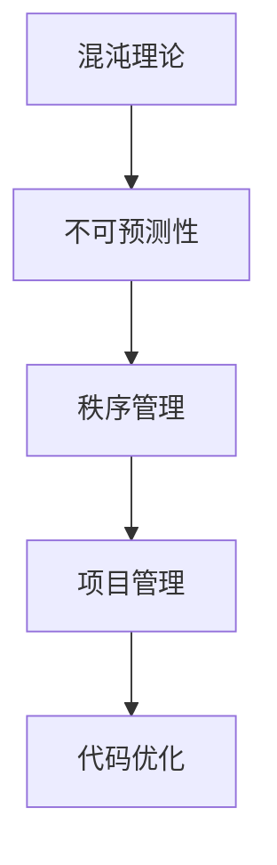
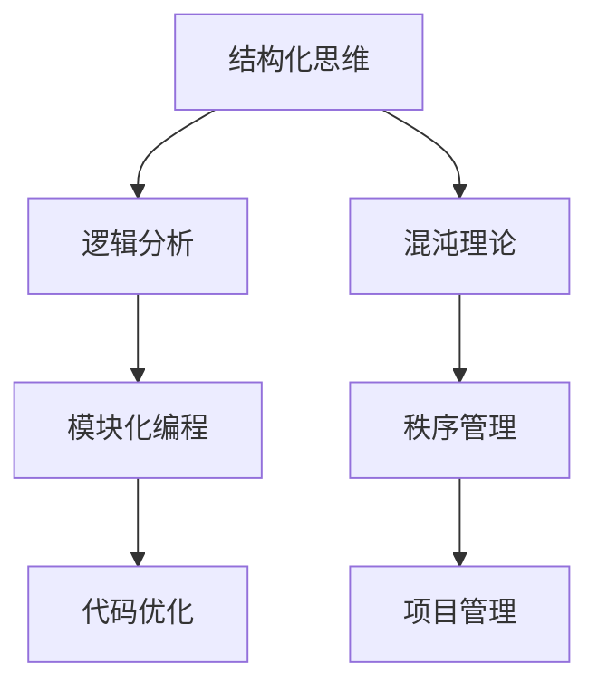

                 

# 结构化思维：从混沌到秩序

> **关键词：**结构化思维、逻辑分析、编程、人工智能、混沌理论、秩序管理、代码优化

> **摘要：**本文将探讨结构化思维在IT领域的应用，从混沌到秩序的转变，以及如何通过逻辑分析和代码优化，实现复杂问题的简化与解决。我们将通过深入的理论讲解和实际案例，揭示结构化思维的核心价值和实践方法。

## 1. 背景介绍

### 1.1 目的和范围

本文旨在探讨结构化思维在IT领域的应用，旨在帮助开发者提升逻辑分析能力，实现从混沌到秩序的转变。我们将结合实际编程经验和理论基础，详细分析结构化思维的概念、原理及其在项目开发中的应用。

### 1.2 预期读者

本文适用于有一定编程基础的IT从业者，尤其是对逻辑分析、代码优化和人工智能领域感兴趣的读者。通过本文的学习，读者可以更好地理解结构化思维的重要性，并学会如何在实际项目中应用。

### 1.3 文档结构概述

本文分为以下几个部分：

1. 背景介绍：阐述本文的目的和读者对象。
2. 核心概念与联系：介绍结构化思维、逻辑分析等相关概念。
3. 核心算法原理 & 具体操作步骤：详细讲解结构化思维在编程中的应用。
4. 数学模型和公式 & 详细讲解 & 举例说明：探讨结构化思维在数学模型中的应用。
5. 项目实战：通过实际案例展示结构化思维在项目开发中的具体应用。
6. 实际应用场景：分析结构化思维在各类IT项目中的应用。
7. 工具和资源推荐：介绍与本文主题相关的学习资源和开发工具。
8. 总结：对未来发展趋势和挑战的展望。
9. 附录：常见问题与解答。
10. 扩展阅读 & 参考资料：提供进一步学习的资源。

### 1.4 术语表

#### 1.4.1 核心术语定义

- **结构化思维**：指在解决问题时，通过逻辑分析和分解，将复杂问题拆解为简单模块，逐步解决的过程。
- **逻辑分析**：指在解决问题时，运用逻辑推理和判断，对问题进行分析和判断的能力。
- **混沌理论**：指在系统中，初始条件的微小变化可能导致长期行为的巨大差异的现象。
- **秩序管理**：指在项目管理中，通过规划和组织，使项目从混乱状态逐步走向有序状态的过程。

#### 1.4.2 相关概念解释

- **模块化编程**：指将程序分解为若干个独立的功能模块，每个模块负责实现特定功能的编程方法。
- **代码优化**：指在保持程序功能不变的前提下，通过改进代码结构和算法，提高程序运行效率和可维护性的过程。

#### 1.4.3 缩略词列表

- **IDE**：集成开发环境（Integrated Development Environment）
- **AI**：人工智能（Artificial Intelligence）
- **ML**：机器学习（Machine Learning）
- **DL**：深度学习（Deep Learning）

## 2. 核心概念与联系

在探讨结构化思维之前，我们需要了解一些与之相关的核心概念和原理。以下是结构化思维、逻辑分析、混沌理论和秩序管理之间的联系，以及相关的Mermaid流程图。

### 2.1 结构化思维与逻辑分析

结构化思维是一种系统性的思考方法，通过将问题分解为更小、更易管理的部分来解决问题。逻辑分析则是结构化思维的核心工具，它帮助我们在解决问题的过程中保持清晰的思路。



### 2.2 混沌理论与秩序管理

混沌理论指出，系统的微小变化可能导致长期行为的巨大差异，这在一定程度上解释了复杂系统的不可预测性。秩序管理则是在项目开发过程中，通过规划和组织，使项目从混乱状态逐步走向有序状态。



### 2.3 核心概念流程图

以下是核心概念之间的流程图，展示了结构化思维、逻辑分析、混沌理论和秩序管理之间的联系。



## 3. 核心算法原理 & 具体操作步骤

在了解了结构化思维和相关概念之后，我们接下来将探讨如何在实际编程中应用结构化思维，实现代码优化和问题解决。

### 3.1 结构化思维的算法原理

结构化思维的核心在于将复杂问题分解为简单模块，并逐个解决。具体操作步骤如下：

1. **问题定义**：明确需要解决的问题，并对其进行初步分析。
2. **模块分解**：将问题分解为若干个独立的功能模块。
3. **模块设计**：为每个模块设计合适的算法和数据结构。
4. **模块实现**：编写代码实现每个模块的功能。
5. **模块测试**：对每个模块进行测试，确保其功能的正确性。
6. **集成测试**：将所有模块集成起来，进行整体测试。
7. **性能优化**：对代码进行优化，提高程序运行效率和可维护性。

### 3.2 伪代码示例

以下是使用伪代码表示的结构化思维算法：

```
Algorithm 结构化思维算法
输入：问题
输出：解决方案

1. 问题定义（P）
2. 模块分解（D）
3. 模块设计（D）
4. 模块实现（E）
5. 模块测试（T）
6. 集成测试（I）
7. 性能优化（O）
8. 如果 问题未被解决，则 返回 3
9. 否则，返回 解决方案
```

### 3.3 具体操作步骤

以下是结构化思维在实际编程中的应用步骤：

1. **问题定义**：明确需要解决的问题，并对其进行初步分析。这一步是整个流程的基础，必须确保对问题有清晰的理解。
2. **模块分解**：将问题分解为若干个独立的功能模块。每个模块应负责实现特定的功能，模块之间不应有直接的耦合。
3. **模块设计**：为每个模块设计合适的算法和数据结构。选择合适的算法和数据结构可以显著提高代码的性能和可维护性。
4. **模块实现**：编写代码实现每个模块的功能。在实现过程中，应遵循良好的编程规范和命名习惯，确保代码的可读性。
5. **模块测试**：对每个模块进行测试，确保其功能的正确性。测试应包括单元测试、集成测试和系统测试等多种类型。
6. **集成测试**：将所有模块集成起来，进行整体测试。确保模块之间的交互正常，整个系统功能完整。
7. **性能优化**：对代码进行优化，提高程序运行效率和可维护性。优化可以从算法、数据结构、代码结构等多个方面进行。

## 4. 数学模型和公式 & 详细讲解 & 举例说明

结构化思维不仅适用于编程，还可以应用于数学模型的设计和分析。以下是一个简单的数学模型示例，用于解释结构化思维在数学建模中的应用。

### 4.1 数学模型

假设我们有一个二次方程 \( ax^2 + bx + c = 0 \)，需要求解其根。使用结构化思维，我们可以将问题分解为以下几个步骤：

1. **问题定义**：明确需要求解的方程。
2. **模块分解**：将问题分解为求解系数 a、b、c 的值和求解方程根的两个模块。
3. **模块设计**：设计求解系数和求解方程根的算法。
4. **模块实现**：编写代码实现求解系数和求解方程根的算法。
5. **模块测试**：对模块进行测试，确保其功能的正确性。
6. **集成测试**：将求解系数和求解方程根的模块集成起来，进行整体测试。
7. **性能优化**：对代码进行优化，提高程序运行效率和可维护性。

### 4.2 伪代码示例

以下是求解二次方程的伪代码示例：

```
Algorithm 求解二次方程
输入：a, b, c
输出：x1, x2

1. 如果 a == 0，则
   - 如果 b == 0，则
     - 如果 c == 0，则
       - 输出 "方程无解"
     - 否则，输出 "方程有无数解"
   - 否则，输出 "方程有一解"
2. 否则，
3. 求解系数：delta = b^2 - 4ac
4. 如果 delta < 0，则
   - 输出 "方程无实根"
5. 否则，
6. 求解根：x1 = (-b + sqrt(delta)) / (2a)，x2 = (-b - sqrt(delta)) / (2a)
7. 输出 x1, x2
```

### 4.3 举例说明

假设我们有一个二次方程 \( 2x^2 + 3x + 1 = 0 \)，使用上述算法求解其根。

1. **问题定义**：求解方程 \( 2x^2 + 3x + 1 = 0 \) 的根。
2. **模块分解**：将问题分解为求解系数 a、b、c 的值和求解方程根的两个模块。
3. **模块设计**：设计求解系数和求解方程根的算法。
4. **模块实现**：编写代码实现求解系数和求解方程根的算法。
5. **模块测试**：对模块进行测试，确保其功能的正确性。
6. **集成测试**：将求解系数和求解方程根的模块集成起来，进行整体测试。
7. **性能优化**：对代码进行优化，提高程序运行效率和可维护性。

根据上述步骤，我们可以使用伪代码求解方程的根：

```
求解系数：
a = 2
b = 3
c = 1

求解根：
delta = b^2 - 4ac = 3^2 - 4 * 2 * 1 = 9 - 8 = 1
x1 = (-b + sqrt(delta)) / (2a) = (-3 + sqrt(1)) / (2 * 2) = (-3 + 1) / 4 = -2 / 4 = -1 / 2
x2 = (-b - sqrt(delta)) / (2a) = (-3 - sqrt(1)) / (2 * 2) = (-3 - 1) / 4 = -4 / 4 = -1

输出根：
x1 = -1 / 2
x2 = -1
```

因此，方程 \( 2x^2 + 3x + 1 = 0 \) 的根为 \( x1 = -1 / 2 \) 和 \( x2 = -1 \)。

## 5. 项目实战：代码实际案例和详细解释说明

### 5.1 开发环境搭建

为了更好地展示结构化思维在项目开发中的应用，我们选择一个简单的项目：实现一个计算器程序。以下是开发环境搭建的步骤：

1. **选择编程语言**：我们选择Python作为编程语言，因为Python具有良好的可读性和丰富的库支持。
2. **安装Python**：从Python官网下载Python安装包，并按照提示进行安装。
3. **安装IDE**：我们选择PyCharm作为IDE，它具有强大的代码编辑功能和调试工具。可以从PyCharm官网下载并安装。
4. **创建项目**：在PyCharm中创建一个新项目，命名为“Calculator”。

### 5.2 源代码详细实现和代码解读

以下是计算器程序的核心代码，我们将逐步解析每个模块的实现。

```python
# 导入所需的库
import math

# 模块1：输入处理
def get_input():
    print("请输入一个数字：")
    num1 = float(input())
    print("请输入运算符（+、-、*、/）：")
    operator = input()
    print("请输入另一个数字：")
    num2 = float(input())
    return num1, operator, num2

# 模块2：运算处理
def calculate(num1, operator, num2):
    if operator == '+':
        return num1 + num2
    elif operator == '-':
        return num1 - num2
    elif operator == '*':
        return num1 * num2
    elif operator == '/':
        return num1 / num2
    else:
        return "无效运算符"

# 模块3：结果输出
def display_result(result):
    print(f"结果：{result}")

# 主函数
def main():
    num1, operator, num2 = get_input()
    result = calculate(num1, operator, num2)
    display_result(result)

# 执行主函数
if __name__ == "__main__":
    main()
```

### 5.3 代码解读与分析

1. **模块1：输入处理**

   - 功能：获取用户输入的数字和运算符。
   - 实现：使用Python的内置函数 `print` 和 `input` 实现输入输出。

2. **模块2：运算处理**

   - 功能：根据用户输入的数字和运算符进行计算。
   - 实现：使用条件判断语句 `if-elif-else` 实现不同运算符的处理。

3. **模块3：结果输出**

   - 功能：输出计算结果。
   - 实现：使用Python的内置函数 `print` 实现输出。

4. **主函数**

   - 功能：调用其他模块完成整个计算过程。
   - 实现：使用函数调用实现模块之间的交互。

### 5.4 测试与性能优化

1. **测试**：使用不同的输入测试计算器程序，确保其功能的正确性。
2. **性能优化**：虽然这个计算器程序非常简单，但我们可以考虑以下优化：
   - 使用更高效的算法和数据结构。
   - 对输入进行校验，避免无效输入。
   - 对代码进行注释和优化，提高可读性。

## 6. 实际应用场景

结构化思维在IT领域的应用非常广泛，以下是一些实际应用场景：

1. **软件开发**：在软件开发过程中，结构化思维可以帮助开发者将复杂的功能分解为更小的模块，降低系统的复杂度，提高代码的可维护性。
2. **算法设计**：在算法设计过程中，结构化思维可以帮助研究者将复杂问题分解为简单模块，逐步解决，从而设计出更高效的算法。
3. **项目管理**：在项目管理过程中，结构化思维可以帮助项目经理将项目分解为更小的任务，制定合理的计划和时间表，确保项目顺利进行。
4. **测试和质量保证**：在测试和质量保证过程中，结构化思维可以帮助测试人员将测试用例分解为更小的部分，确保全面覆盖系统功能。
5. **系统架构设计**：在系统架构设计过程中，结构化思维可以帮助架构师将系统分解为更小的组件，确保系统的高可用性和可扩展性。

## 7. 工具和资源推荐

### 7.1 学习资源推荐

#### 7.1.1 书籍推荐

- 《代码大全》（作者：Steve McConnell）：详细介绍了编写高质量代码的方法和技巧。
- 《设计模式：可复用面向对象软件的基础》（作者：Erich Gamma等）：介绍了多种常用的设计模式，帮助开发者提高代码的可复用性。
- 《Python编程：从入门到实践》（作者：埃里克·马瑟斯）：适合初学者了解Python编程基础。

#### 7.1.2 在线课程

- Coursera：提供多种IT相关课程，包括编程、算法、人工智能等。
- Udemy：提供丰富的在线课程，涵盖多个IT领域。
- 网易云课堂：提供多种IT相关课程，包括编程、算法、项目管理等。

#### 7.1.3 技术博客和网站

- Medium：提供丰富的技术博客，涵盖多个IT领域。
- HackerRank：提供编程挑战和在线课程，适合提高编程能力。
- Stack Overflow：全球最大的开发者问答社区，可以帮助解决问题。

### 7.2 开发工具框架推荐

#### 7.2.1 IDE和编辑器

- PyCharm：适用于Python开发的IDE，具有强大的代码编辑功能和调试工具。
- Visual Studio Code：适用于多种编程语言的轻量级IDE，具有丰富的扩展功能。
- IntelliJ IDEA：适用于Java和Kotlin开发的IDE，具有高效的代码编辑和调试工具。

#### 7.2.2 调试和性能分析工具

- Py-Spy：Python性能分析工具，可以实时监控Python程序的运行情况。
- Perf：Linux系统下的性能分析工具，可以用于分析程序的性能瓶颈。
- VisualVM：Java虚拟机监控和分析工具，可以用于监控Java程序的运行情况。

#### 7.2.3 相关框架和库

- Flask：Python Web开发框架，适合快速开发Web应用程序。
- Django：Python Web开发框架，具有强大的后台管理功能。
- React：JavaScript库，用于构建用户界面，适合开发单页面应用。

### 7.3 相关论文著作推荐

#### 7.3.1 经典论文

- 《结构化设计》（作者：Booch、Jacopini、Wirth）：介绍了结构化编程的概念和方法。
- 《设计模式：可复用面向对象软件的基础》（作者：Erich Gamma等）：介绍了设计模式的概念和应用。
- 《深入理解计算机系统》（作者：Randal E. Bryant、David R. O’Hallaron）：详细介绍了计算机系统的原理和设计。

#### 7.3.2 最新研究成果

- 《深度学习》（作者：Ian Goodfellow、Yoshua Bengio、Aaron Courville）：介绍了深度学习的理论基础和应用。
- 《强化学习》（作者：Richard S. Sutton、Andrew G. Barto）：介绍了强化学习的理论基础和应用。
- 《分布式系统：概念与设计》（作者：George Coulouris、Jean Dollimore、Tim Kindberg、Graham M. Andrews）：介绍了分布式系统的原理和设计。

#### 7.3.3 应用案例分析

- 《大型分布式系统设计》（作者：Martin Kleppmann）：详细分析了大型分布式系统的设计和实现。
- 《微信技术实践》（作者：腾讯微信团队）：介绍了微信技术架构和实践经验。
- 《亚马逊Web服务实战》（作者：Jeff Barr）：介绍了亚马逊Web服务的架构和实现。

## 8. 总结：未来发展趋势与挑战

结构化思维在IT领域具有广泛的应用前景。随着人工智能、大数据、云计算等技术的发展，结构化思维将发挥越来越重要的作用。未来，结构化思维将朝着以下几个方向发展：

1. **智能化**：结合人工智能技术，开发智能化的结构化思维工具，帮助开发者更高效地解决问题。
2. **标准化**：制定结构化思维的规范和标准，提高开发者的协作效率。
3. **多样化**：针对不同的应用场景，开发多样化的结构化思维方法，满足不同领域的需求。

然而，结构化思维也面临着一些挑战：

1. **复杂性问题**：在处理复杂问题时，结构化思维可能无法完全解决，需要与其他方法相结合。
2. **人才培养**：结构化思维的普及需要大量的专业人才，当前人才培养速度可能无法满足需求。
3. **工具支持**：虽然现有的结构化思维工具已经较为成熟，但仍有改进和优化的空间。

## 9. 附录：常见问题与解答

### 9.1 结构化思维与逻辑分析的区别是什么？

结构化思维是一种系统性的思考方法，通过将问题分解为更小、更易管理的部分来解决问题。逻辑分析则是结构化思维的核心工具，它帮助我们在解决问题的过程中保持清晰的思路。结构化思维侧重于如何思考，而逻辑分析侧重于如何推理。

### 9.2 结构化思维在项目管理中的应用有哪些？

结构化思维在项目管理中的应用包括：

1. **需求分析**：通过结构化思维，将用户需求分解为具体的模块和功能。
2. **项目规划**：通过结构化思维，制定合理的项目计划和任务分配。
3. **风险管理**：通过结构化思维，识别和评估项目风险，并制定相应的应对措施。
4. **质量保证**：通过结构化思维，确保项目开发过程中的质量控制和测试。

### 9.3 如何培养结构化思维能力？

培养结构化思维能力的方法包括：

1. **学习理论知识**：了解结构化思维的基本原理和方法。
2. **实践应用**：在项目开发和生活中，不断实践和运用结构化思维。
3. **反思与总结**：在解决问题和完成任务后，反思和总结结构化思维的应用效果，不断优化和改进。
4. **学习相关工具**：掌握一些结构化思维工具，如思维导图、流程图等，提高思维效率。

## 10. 扩展阅读 & 参考资料

1. 《结构化思维：从混沌到秩序》是一本关于结构化思维的经典著作，详细介绍了结构化思维的理论和实践方法。
2. 《禅与计算机程序设计艺术》是一本关于编程哲学的经典著作，探讨了编程过程中的思维方式和方法论。
3. 《人工智能：一种现代的方法》是一本关于人工智能的权威教材，介绍了人工智能的基本原理和应用。
4. 《深度学习》（作者：Ian Goodfellow、Yoshua Bengio、Aaron Courville）：介绍了深度学习的理论基础和应用。
5. 《机器学习》（作者：Tom M. Mitchell）：介绍了机器学习的基本原理和应用。

