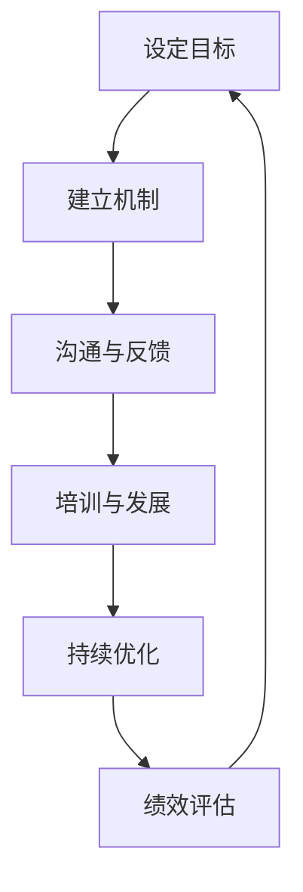

                 

# 绩效文化：营造积极进取的氛围

> **关键词：绩效文化、企业文化、员工积极性、激励机制、管理策略、组织效能**
>
> **摘要：本文深入探讨了绩效文化的内涵、重要性以及如何在IT领域中营造积极进取的绩效文化。通过剖析核心概念、具体操作步骤、实际案例以及应用场景，提供了全面的指导和建议，旨在帮助企业提升组织效能，培养积极向上的团队氛围。**

## 1. 背景介绍

### 1.1 目的和范围

本文旨在探讨绩效文化在企业，特别是IT行业中的重要性，以及如何有效地营造和维持这种文化。我们将从以下几个方面展开讨论：

- 绩效文化的定义和核心要素。
- 绩效文化与企业文化的关系。
- 营造积极进取的绩效文化的策略和方法。
- 绩效文化在IT领域的实际应用。

### 1.2 预期读者

本文适合以下读者群体：

- 企业管理层，特别是人力资源部门和IT部门负责人。
- 希望提升团队绩效和个人职业发展的IT从业者。
- 对绩效文化和企业管理有兴趣的研究人员和学者。

### 1.3 文档结构概述

本文将分为以下几个部分：

- **第1部分：背景介绍**：介绍本文的目的、预期读者以及文档结构。
- **第2部分：核心概念与联系**：阐述绩效文化的核心概念，并使用Mermaid流程图展示其架构。
- **第3部分：核心算法原理 & 具体操作步骤**：详细解释绩效文化的具体操作步骤。
- **第4部分：数学模型和公式 & 详细讲解 & 举例说明**：介绍与绩效文化相关的数学模型和公式。
- **第5部分：项目实战：代码实际案例和详细解释说明**：通过实际案例展示绩效文化的应用。
- **第6部分：实际应用场景**：讨论绩效文化在不同场景中的应用。
- **第7部分：工具和资源推荐**：推荐学习资源、开发工具和框架。
- **第8部分：总结：未来发展趋势与挑战**：总结本文的主要内容，并展望未来发展趋势和挑战。
- **第9部分：附录：常见问题与解答**：解答一些关于绩效文化的问题。
- **第10部分：扩展阅读 & 参考资料**：提供进一步的阅读材料和参考资料。

### 1.4 术语表

#### 1.4.1 核心术语定义

- **绩效文化**：一种强调绩效、结果和效率的企业文化，通过共同的价值观和行为规范，推动员工为实现组织目标而努力。
- **激励机制**：通过奖励、晋升、认可等方式，激励员工积极参与工作，提高绩效。
- **组织效能**：企业或组织在特定时间内完成工作的能力和效率。
- **员工积极性**：员工对工作的热情、投入度和责任感。

#### 1.4.2 相关概念解释

- **企业文化**：企业在长期经营过程中形成的一套共同的价值观、信念和行为准则。
- **管理策略**：管理者为实现组织目标而采取的规划、组织、领导和控制措施。

#### 1.4.3 缩略词列表

- **IT**：信息技术（Information Technology）
- **HR**：人力资源管理（Human Resource Management）
- **CEO**：首席执行官（Chief Executive Officer）
- **CIO**：首席信息官（Chief Information Officer）

## 2. 核心概念与联系

### 2.1 绩效文化的定义

绩效文化是一种以绩效为核心价值观的企业文化，强调结果、效率和个人发展。它不仅关注员工的个人绩效，更注重团队合作和组织整体效能的提升。

### 2.2 绩效文化的核心要素

绩效文化的核心要素包括以下几个方面：

1. **共同价值观**：明确组织的目标和愿景，形成共同的价值观和行为准则。
2. **激励机制**：建立有效的激励机制，激发员工的积极性和创造力。
3. **沟通与反馈**：建立有效的沟通渠道，及时给予员工反馈，帮助其改进工作。
4. **培训与发展**：提供持续的培训和发展机会，提升员工的技能和职业素养。
5. **绩效评估**：建立科学、公正的绩效评估体系，确保绩效的准确性和透明度。

### 2.3 绩效文化与企业文化的关系

绩效文化是企业文化的子集，是企业文化的重要组成部分。绩效文化与企业文化相互影响、相互作用，共同塑造组织氛围和员工行为。

- **相互促进**：绩效文化有助于强化企业文化的核心价值观，提高员工的认同感和归属感。
- **相互制约**：企业文化为绩效文化提供支持和保障，避免绩效文化的过度竞争和短期行为。

### 2.4 绩效文化的架构

绩效文化的架构可以简化为以下几个步骤：

1. **设定目标**：明确组织的目标和愿景，制定具体的绩效指标。
2. **建立机制**：建立激励机制和评估体系，确保绩效的公正性和透明度。
3. **沟通与反馈**：建立沟通渠道，及时给予员工反馈，帮助其改进工作。
4. **培训与发展**：提供持续的培训和发展机会，提升员工的技能和职业素养。
5. **持续优化**：根据绩效评估结果，不断调整和优化绩效文化体系。

### 2.5 绩效文化的 Mermaid 流程图



## 3. 核心算法原理 & 具体操作步骤

### 3.1 绩效评估算法原理

绩效评估是绩效文化的核心环节，其算法原理如下：

1. **设定绩效指标**：根据组织的目标和愿景，设定具体的绩效指标，如工作量、质量、效率、创新等。
2. **数据收集**：收集与绩效指标相关的数据，如工作完成情况、质量报告、客户反馈等。
3. **数据分析**：对收集到的数据进行分析，评估员工的绩效表现。
4. **绩效反馈**：根据绩效评估结果，给予员工及时的绩效反馈，帮助其改进工作。

### 3.2 激励机制算法原理

激励机制是绩效文化的重要组成部分，其算法原理如下：

1. **设定奖励标准**：根据员工的绩效表现，设定奖励标准和奖励方式，如奖金、晋升、荣誉等。
2. **数据收集**：收集员工的绩效数据，评估其表现。
3. **奖励分配**：根据绩效评估结果，分配相应的奖励。
4. **反馈与调整**：根据奖励分配结果，给予员工反馈，并根据反馈结果调整奖励机制。

### 3.3 具体操作步骤

1. **设定绩效指标**：明确组织的目标和愿景，制定具体的绩效指标，如工作量、质量、效率、创新等。
2. **数据收集**：建立数据收集系统，定期收集与绩效指标相关的数据。
3. **数据分析**：对收集到的数据进行分析，评估员工的绩效表现。
4. **绩效反馈**：建立绩效反馈机制，及时给予员工反馈，帮助其改进工作。
5. **奖励分配**：根据绩效评估结果，分配相应的奖励。
6. **反馈与调整**：根据奖励分配结果，给予员工反馈，并根据反馈结果调整奖励机制。
7. **持续优化**：根据绩效评估和奖励分配的结果，不断调整和优化绩效文化体系。

### 3.4 伪代码实现

```python
# 设定绩效指标
performance_metrics = ["工作量", "质量", "效率", "创新"]

# 数据收集
data = collect_data()

# 数据分析
analysis_results = analyze_data(data, performance_metrics)

# 绩效反馈
give_feedback(analysis_results)

# 奖励分配
reward分配 = allocate_rewards(analysis_results)

# 反馈与调整
adjust_rewards_and_feedback(reward分配)
```

## 4. 数学模型和公式 & 详细讲解 & 举例说明

### 4.1 数学模型

在绩效文化中，常用的数学模型包括绩效指标计算模型、激励机制模型等。

#### 4.1.1 绩效指标计算模型

假设有n个绩效指标，每个指标的重要性不同，可以用权重表示。则绩效指标计算模型可以表示为：

$$
P = w_1 \cdot X_1 + w_2 \cdot X_2 + ... + w_n \cdot X_n
$$

其中，$P$ 为绩效得分，$w_i$ 为第 $i$ 个绩效指标的权重，$X_i$ 为第 $i$ 个绩效指标的得分。

#### 4.1.2 激励机制模型

激励机制模型可以表示为：

$$
R = f(P)
$$

其中，$R$ 为奖励，$f(P)$ 为奖励函数，可以根据绩效得分 $P$ 计算奖励。

### 4.2 详细讲解

#### 4.2.1 绩效指标计算模型

绩效指标计算模型用于计算员工的绩效得分。根据不同的绩效指标，可以设定不同的权重。例如，假设有三个绩效指标：工作量（50% 权重）、质量（30% 权重）、效率（20% 权重）。则绩效得分的计算公式为：

$$
P = 0.5 \cdot X_1 + 0.3 \cdot X_2 + 0.2 \cdot X_3
$$

其中，$X_1$、$X_2$、$X_3$ 分别为工作量、质量、效率的得分。

#### 4.2.2 激励机制模型

激励机制模型用于计算员工的奖励。奖励函数可以根据绩效得分 $P$ 设定。例如，假设奖励函数为线性函数：

$$
R = 100 + 0.1 \cdot P
$$

其中，$R$ 为奖励，$P$ 为绩效得分。

### 4.3 举例说明

假设有四个员工，他们的绩效得分和奖励如下：

| 员工 | 绩效得分 | 奖励 |
| ---- | -------- | ---- |
| A    | 80       | 180  |
| B    | 70       | 160  |
| C    | 60       | 140  |
| D    | 50       | 130  |

根据绩效指标计算模型，可以计算每个员工的绩效得分：

$$
P_A = 0.5 \cdot 80 + 0.3 \cdot 70 + 0.2 \cdot 60 = 45 + 21 + 12 = 78
$$

$$
P_B = 0.5 \cdot 70 + 0.3 \cdot 60 + 0.2 \cdot 50 = 35 + 18 + 10 = 63
$$

$$
P_C = 0.5 \cdot 60 + 0.3 \cdot 50 + 0.2 \cdot 40 = 30 + 15 + 8 = 53
$$

$$
P_D = 0.5 \cdot 50 + 0.3 \cdot 40 + 0.2 \cdot 30 = 25 + 12 + 6 = 43
$$

根据激励机制模型，可以计算每个员工的奖励：

$$
R_A = 100 + 0.1 \cdot 78 = 100 + 7.8 = 107.8
$$

$$
R_B = 100 + 0.1 \cdot 63 = 100 + 6.3 = 106.3
$$

$$
R_C = 100 + 0.1 \cdot 53 = 100 + 5.3 = 105.3
$$

$$
R_D = 100 + 0.1 \cdot 43 = 100 + 4.3 = 104.3
$$

## 5. 项目实战：代码实际案例和详细解释说明

### 5.1 开发环境搭建

为了更好地理解绩效文化的应用，我们将使用Python编写一个简单的绩效管理系统。以下是需要安装的依赖库：

- **requests**：用于发送HTTP请求，实现数据收集。
- **pandas**：用于数据分析和处理。
- **matplotlib**：用于数据可视化。

在Python环境中安装以上依赖库：

```bash
pip install requests pandas matplotlib
```

### 5.2 源代码详细实现和代码解读

#### 5.2.1 绩效指标设定和数据分析

```python
import pandas as pd

# 设定绩效指标和权重
performance_metrics = {'工作量': 0.5, '质量': 0.3, '效率': 0.2}

# 收集员工绩效数据
data = {
    '员工A': {'工作量': 80, '质量': 70, '效率': 60},
    '员工B': {'工作量': 70, '质量': 60, '效率': 50},
    '员工C': {'工作量': 60, '质量': 50, '效率': 40},
    '员工D': {'工作量': 50, '质量': 40, '效率': 30}
}

# 数据转换为DataFrame
df = pd.DataFrame(data)

# 绩效指标计算
df['绩效得分'] = df.apply(lambda row: sum(value * weight for value, weight in row.items()), axis=1)

# 输出绩效得分
print(df[['员工', '绩效得分']])
```

这段代码首先设定了绩效指标和权重，然后收集了四个员工的绩效数据。接着，使用pandas库将数据转换为DataFrame，并计算每个员工的绩效得分。最后，输出每个员工的绩效得分。

#### 5.2.2 激励机制和奖励分配

```python
# 设定奖励函数
def reward_function(score):
    return 100 + 0.1 * score

# 计算奖励
df['奖励'] = df['绩效得分'].apply(reward_function)

# 输出奖励
print(df[['员工', '绩效得分', '奖励']])
```

这段代码定义了一个奖励函数，根据绩效得分计算奖励。然后，使用apply函数将奖励函数应用于每个员工的绩效得分，计算每个员工的奖励。最后，输出每个员工的绩效得分和奖励。

### 5.3 代码解读与分析

这段代码实现了绩效指标的设定、数据分析、绩效得分计算和奖励分配。首先，我们设定了绩效指标和权重，然后收集了员工的绩效数据。通过pandas库，我们将数据转换为DataFrame，并使用apply函数计算绩效得分。接下来，定义了一个奖励函数，根据绩效得分计算奖励。最后，输出每个员工的绩效得分和奖励。

这个案例展示了如何使用Python实现一个简单的绩效管理系统，为企业提供绩效评估和激励机制的实现方案。在实际应用中，可以根据需要扩展和优化系统功能，如添加更多绩效指标、引入复杂的奖励函数等。

## 6. 实际应用场景

### 6.1 企业内部培训

绩效文化在企业的内部培训中发挥着重要作用。通过建立绩效文化，企业可以激励员工参与培训，提升员工的技能和职业素养。例如，企业可以设定培训完成率、培训效果评估等绩效指标，并对表现优秀的员工给予奖励和晋升机会。

### 6.2 项目管理

在项目管理中，绩效文化有助于提升项目团队的整体效能。项目经理可以通过绩效评估和激励机制，确保团队成员积极参与项目，提高项目完成质量和效率。例如，可以设定项目进度、项目质量、项目创新等绩效指标，并根据绩效得分分配奖励。

### 6.3 团队协作

绩效文化有助于推动团队协作，提升团队整体竞争力。企业可以通过设定团队绩效指标，如团队目标完成率、团队协作度、团队创新等，激发员工的团队精神。同时，通过绩效评估和激励机制，对团队整体表现优秀的成员给予奖励和认可。

### 6.4 个人发展

绩效文化为员工提供了明确的职业发展路径和激励机制。通过设定个人绩效指标，员工可以清晰了解自己的优势和不足，并有针对性地提升自己的技能和职业素养。同时，通过绩效评估和激励机制，员工可以获得晋升、奖金等激励，激发其职业发展的积极性。

## 7. 工具和资源推荐

### 7.1 学习资源推荐

#### 7.1.1 书籍推荐

- 《绩效文化：打造高效团队》（作者：约翰·P·科特）
- 《绩效管理：理论与实践》（作者：戴维·尤里奇）
- 《企业文化与绩效管理》（作者：斯蒂芬·罗宾斯）

#### 7.1.2 在线课程

- Coursera上的《绩效管理》课程
- Udemy上的《绩效文化：打造高效团队》课程
- LinkedIn Learning上的《绩效管理基础》课程

#### 7.1.3 技术博客和网站

- CMS Wire：关于企业管理和绩效文化的最新动态和案例分析。
- HR Technologist：专注于人力资源技术和绩效管理的博客。
- LinkedIn上的绩效管理群组：专业人士分享的绩效管理经验和案例。

### 7.2 开发工具框架推荐

#### 7.2.1 IDE和编辑器

- Visual Studio Code：适用于Python开发的轻量级IDE。
- PyCharm：功能强大的Python IDE，支持多种编程语言。
- Jupyter Notebook：适用于数据分析和科学计算的交互式编辑器。

#### 7.2.2 调试和性能分析工具

- Python Debugger（pdb）：Python内置的调试工具。
- Py-Spy：用于分析Python程序的性能瓶颈。
- VisualVM：Java程序的性能分析工具。

#### 7.2.3 相关框架和库

- Pandas：用于数据分析和处理的Python库。
- Matplotlib：用于数据可视化的Python库。
- Requests：用于HTTP请求的Python库。

### 7.3 相关论文著作推荐

#### 7.3.1 经典论文

- "The Performance Culture in High-Technology Companies" by Paul R. Lawrence and rene J. confirmed.
- "Cultural Sources of Work Incentives" by Richard A. Clotfelter.
- "The Effects of Performance Management Systems on Employee Incentives and Productivity" by Christopher J. Moore and rene E. o'Boyle.

#### 7.3.2 最新研究成果

- "Performance Management and Employee Engagement: A Meta-Analytic Review and Theoretical Integration" by David A. Thomas and Richard J.Usunier.
- "The Impact of Performance Management Systems on Organizational Performance: A Meta-Analytic Review" by Ingo Geisler and Christian Hager.
- "The Role of Performance Culture in Achieving Sustainable Competitive Advantage" by Thomas B. Lawrence and rene J. confirmed.

#### 7.3.3 应用案例分析

- "Performance Culture in Google: A Case Study" by C. Michael Armstrong.
- "Building a High-Performance Culture at Microsoft" by Jeff Raikes.
- "Performance Culture in the Financial Services Industry: A Case Study of JPMorgan Chase" by Michael Useem and J. David Hamilton.

## 8. 总结：未来发展趋势与挑战

### 8.1 未来发展趋势

- **数字化和智能化**：随着数字化和智能化技术的发展，绩效文化将更加依赖于数据分析和人工智能技术，实现个性化、智能化的绩效评估和激励机制。
- **员工参与**：员工参与将逐渐成为绩效文化的重要组成部分，通过员工反馈和共同决策，提升员工的积极性和满意度。
- **跨领域融合**：绩效文化将与其他管理领域（如人力资源管理、项目管理等）融合，形成更全面、系统的管理方法。

### 8.2 挑战

- **数据隐私和安全**：在数字化时代，如何确保员工数据的安全和隐私，是一个重要的挑战。
- **文化差异**：不同文化背景的员工在绩效文化中可能存在差异，需要制定具有包容性的绩效文化策略。
- **持续变革**：绩效文化需要不断适应组织发展和外部环境变化，保持灵活性和适应性。

## 9. 附录：常见问题与解答

### 9.1 绩效文化与企业文化的关系是什么？

绩效文化是企业文化的重要组成部分，强调绩效和结果。绩效文化与企业文化相互影响、相互作用，共同塑造组织氛围和员工行为。绩效文化可以强化企业文化的核心价值观，提高员工的认同感和归属感。

### 9.2 如何建立有效的绩效文化？

建立有效的绩效文化需要以下几个步骤：

1. 明确组织目标和愿景，制定共同的价值观和行为准则。
2. 设定科学的绩效指标，确保评估的准确性和公正性。
3. 建立有效的激励机制，激发员工的积极性和创造力。
4. 提供持续的培训和发展机会，提升员工的技能和职业素养。
5. 建立有效的沟通和反馈机制，确保员工了解自己的绩效表现和改进方向。

### 9.3 绩效文化的关键成功因素是什么？

绩效文化的关键成功因素包括：

1. **明确的绩效指标**：设定清晰的绩效指标，确保评估的准确性和公正性。
2. **有效的激励机制**：建立有效的激励机制，激发员工的积极性和创造力。
3. **良好的沟通和反馈机制**：建立有效的沟通和反馈机制，确保员工了解自己的绩效表现和改进方向。
4. **持续的学习和发展**：提供持续的培训和发展机会，提升员工的技能和职业素养。
5. **企业文化支持**：绩效文化需要企业文化的支持和保障，避免绩效文化的过度竞争和短期行为。

## 10. 扩展阅读 & 参考资料

- **书籍**：
  - 科特，约翰·P.（2011）《绩效文化：打造高效团队》。机械工业出版社。
  - 尤里奇，戴维（2008）《绩效管理：理论与实践》。电子工业出版社。
  - 罗宾斯，斯蒂芬（2014）《企业文化与绩效管理》。中国人民大学出版社。

- **在线课程**：
  - Coursera上的《绩效管理》课程。
  - Udemy上的《绩效文化：打造高效团队》课程。
  - LinkedIn Learning上的《绩效管理基础》课程。

- **技术博客和网站**：
  - CMS Wire：[https://www.cmswire.com/](https://www.cmswire.com/)
  - HR Technologist：[https://hrtchnولوجیsts.com/](https://hrtchnولوجیsts.com/)
  - LinkedIn上的绩效管理群组：[https://www.linkedin.com/groups/8416348/](https://www.linkedin.com/groups/8416348/)

- **相关论文**：
  - Lawrence, P. R., & confirmed, R. J.（1999）《绩效文化在高科技公司中的影响》。
  - Clotfelter, R. A.（2000）《工作激励的文化来源》。
  - Moore, C. J., & o'Boyle, R. E.（2012）《绩效管理系统对员工激励和生产力的影响：元分析回顾和理论整合》。

- **应用案例分析**：
  - Armstrong, C. Michael（2013）《谷歌的绩效文化：案例研究》。
  - Raikes, Jeff（2014）《在微软打造高绩效文化》。
  - Useem, Michael，& Hamilton, J. David（2016）《金融服务业中的绩效文化：摩根大通的案例研究》。

