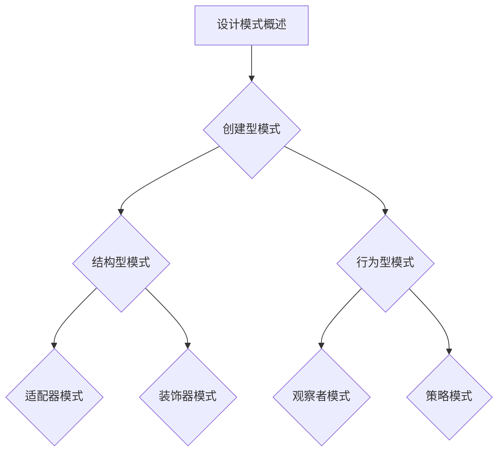

                 

## 综合设计模式的应用案例：工具使用、规划与多智能体协同

> **关键词：** 设计模式、工具使用、项目规划、多智能体协同、代码示例

> **摘要：** 本文旨在探讨综合设计模式在复杂软件系统开发中的应用，重点介绍如何利用设计模式实现工具使用、项目规划和多智能体协同。文章将通过详细的案例分析和代码示例，展示设计模式在实际开发中的重要作用和实现方法。

随着软件系统复杂度的增加，单一的设计模式往往难以应对各种挑战。此时，综合设计模式的应用显得尤为重要。设计模式是一套被反复使用、经过分类和提炼的软件设计方法，它帮助开发者解决常见的问题，提高代码的复用性和可维护性。本文将围绕以下三个方面展开：

1. 工具使用：如何利用设计模式构建灵活的软件开发工具，提高开发效率和代码质量。
2. 项目规划：通过设计模式实现项目的可扩展性和模块化，确保项目的长期稳定发展。
3. 多智能体协同：利用设计模式实现智能体的有效协作，提高系统的整体性能和响应速度。

文章结构如下：

1. 背景介绍
   - 1.1 目的和范围
   - 1.2 预期读者
   - 1.3 文档结构概述
   - 1.4 术语表
2. 核心概念与联系
   - 2.1 设计模式概述
   - 2.2 工具使用与设计模式
   - 2.3 项目规划与设计模式
   - 2.4 多智能体协同与设计模式
   - 2.5 Mermaid流程图
3. 核心算法原理 & 具体操作步骤
   - 3.1 设计模式分类
   - 3.2 工具使用流程
   - 3.3 项目规划步骤
   - 3.4 多智能体协同算法
4. 数学模型和公式 & 详细讲解 & 举例说明
   - 4.1 数学模型概述
   - 4.2 公式讲解
   - 4.3 举例说明
5. 项目实战：代码实际案例和详细解释说明
   - 5.1 开发环境搭建
   - 5.2 源代码详细实现和代码解读
   - 5.3 代码解读与分析
6. 实际应用场景
7. 工具和资源推荐
   - 7.1 学习资源推荐
   - 7.2 开发工具框架推荐
   - 7.3 相关论文著作推荐
8. 总结：未来发展趋势与挑战
9. 附录：常见问题与解答
10. 扩展阅读 & 参考资料

接下来，我们将逐步深入这些主题，探讨设计模式在实际软件开发中的应用。

#### 1. 背景介绍

#### 1.1 目的和范围

设计模式是软件工程领域的一个重要组成部分，它为开发者提供了一系列可重用的解决方案，用于解决软件开发过程中常见的问题。本文的目的在于探讨设计模式在综合应用中的价值，特别是工具使用、项目规划和多智能体协同这三个方面。通过本文的阅读，读者将能够：

1. 理解设计模式的基本概念和分类。
2. 学习如何利用设计模式构建灵活的软件开发工具。
3. 掌握通过设计模式实现项目规划的方法和技巧。
4. 了解多智能体协同中的设计模式应用及其实现过程。

本文的范围涵盖了设计模式在软件开发中常见问题的解决方案，以及如何将这些模式应用于实际项目。我们不仅会介绍设计模式的理论基础，还会通过具体的代码示例和实际案例，帮助读者理解并掌握设计模式的应用。

#### 1.2 预期读者

本文的预期读者主要包括：

1. 软件工程师和开发者，尤其是那些在项目中面临复杂性问题的人员。
2. 对设计模式有初步了解，希望进一步提升开发技能的工程师。
3. 研究生和大学生，特别是那些在计算机科学和软件工程领域学习的学子。
4. 对设计模式及其应用感兴趣的技术爱好者。

无论您的背景如何，只要对软件开发有热情，本文都将为您提供有价值的知识和技巧。

#### 1.3 文档结构概述

本文的结构如下：

1. **背景介绍**：介绍本文的目的、预期读者以及文档结构。
2. **核心概念与联系**：讨论设计模式的基本概念、工具使用、项目规划和多智能体协同。
3. **核心算法原理 & 具体操作步骤**：详细讲解设计模式的理论基础和实现方法。
4. **数学模型和公式 & 详细讲解 & 举例说明**：通过数学模型和公式解释设计模式的核心内容。
5. **项目实战：代码实际案例和详细解释说明**：展示设计模式在实际项目中的应用。
6. **实际应用场景**：探讨设计模式在不同场景下的应用和效果。
7. **工具和资源推荐**：推荐学习资源、开发工具和相关的论文著作。
8. **总结：未来发展趋势与挑战**：总结本文的核心内容，展望设计模式的未来。
9. **附录：常见问题与解答**：解答读者可能遇到的常见问题。
10. **扩展阅读 & 参考资料**：提供进一步学习的资源和参考资料。

通过上述结构，本文力求以逻辑清晰、内容丰富的方式，帮助读者深入理解设计模式的应用。

#### 1.4 术语表

在本文中，我们将使用一些专业术语。以下是这些术语的定义和解释：

#### 1.4.1 核心术语定义

- **设计模式（Design Pattern）**：在软件工程中，设计模式是解决常见问题的可重用解决方案。它通常包括问题的背景、解决方案的核心步骤以及解决方案的优点和缺点。
  
- **面向对象编程（Object-Oriented Programming, OOP）**：一种编程范式，通过将数据和操作数据的方法封装在对象中，实现模块化和可复用的代码。

- **单例模式（Singleton Pattern）**：确保一个类仅有一个实例，并提供一个全局访问点。这在需要控制对象创建数量和访问的场景中非常有用。

- **工厂模式（Factory Pattern）**：创建对象的一种模式，通过在工厂类中定义一个创建对象的方法，返回所请求的对象。工厂类可以根据参数来创建不同的对象。

- **策略模式（Strategy Pattern）**：定义一系列算法，将每一种算法封装起来，并使它们可以互换。在运行时，选择一个算法类。策略模式让算法的变化独立于使用算法的客户。

- **观察者模式（Observer Pattern）**：定义对象间的一种一对多的依赖关系，当一个对象的状态发生改变时，所有依赖于它的对象都得到通知并自动更新。

#### 1.4.2 相关概念解释

- **面向对象设计（Object-Oriented Design, OOD）**：一种设计方法，通过识别问题领域的主要实体，并将它们组织成类和对象，以实现系统的可维护性和可扩展性。

- **设计模式分类**：设计模式通常被分为三类：创建型模式、结构型模式和行为型模式。创建型模式关注对象的创建过程，结构型模式关注类和对象的组合，行为型模式关注对象间的交互。

- **软件工程（Software Engineering）**：一门学科，旨在通过系统的、规范的和量化的方法来开发、运营和维护软件。

- **模块化（Modularization）**：将软件系统划分为若干个相互独立但又功能完整的模块，以提高系统的可维护性和可扩展性。

#### 1.4.3 缩略词列表

- **OOP**：面向对象编程
- **OOD**：面向对象设计
- **OOP**：单例模式
- **FP**：函数式编程
- **AOP**：面向方面编程
- **UML**：统一建模语言
- **SOA**：服务导向架构

通过上述术语表，读者可以更好地理解本文中涉及的专业概念和术语，从而更深入地掌握设计模式在软件开发中的应用。

### 2. 核心概念与联系

在深入探讨设计模式的应用之前，我们需要明确几个核心概念，并理解它们之间的联系。设计模式并不是孤立存在的，而是与面向对象编程、软件工程、模块化等多个概念紧密相连。

#### 2.1 设计模式概述

设计模式是一套被广泛认可和验证的软件设计解决方案，它帮助开发者解决在软件开发过程中遇到的问题。设计模式包括创建型模式、结构型模式和行为型模式三类。

- **创建型模式**：主要关注对象的创建过程，目的是提高系统的灵活性和可扩展性。常见的创建型模式有单例模式、工厂模式、抽象工厂模式等。

- **结构型模式**：主要关注类和对象之间的关系，目的是通过组合对象来提高系统的模块化程度和可维护性。常见的结构型模式有适配器模式、装饰器模式、代理模式等。

- **行为型模式**：主要关注对象之间的交互和通信，目的是提高系统的可扩展性和可维护性。常见的行为型模式有观察者模式、策略模式、命令模式等。

#### 2.2 工具使用与设计模式

设计模式在工具使用中起着至关重要的作用。通过设计模式，开发者可以构建出灵活、可扩展的工具，从而提高开发效率和代码质量。

1. **单例模式**：单例模式确保工具类只有一个实例，这在需要全局访问的场景中非常有用。例如，日志工具、配置管理工具等。
   
2. **工厂模式**：工厂模式用于创建工具类，使得工具类的创建过程与具体实现解耦。这使得开发者可以灵活地替换工具的实现，而无需修改使用工具的代码。

3. **策略模式**：策略模式允许开发者定义一系列工具类，并在运行时选择使用哪一个。这使得工具类可以动态切换，以适应不同的需求。

#### 2.3 项目规划与设计模式

设计模式在项目规划中同样发挥着重要作用。通过设计模式，开发者可以更好地组织项目结构，提高项目的可维护性和可扩展性。

1. **模块化**：通过模块化，开发者可以将项目划分为若干个功能独立的模块，每个模块实现一个特定的功能。这有助于项目的分工和管理，同时提高代码的可复用性。

2. **适配器模式**：适配器模式可以将现有组件集成到项目中，使得项目可以兼容不同的接口和协议。

3. **装饰器模式**：装饰器模式用于为现有对象添加新的功能，而不改变其接口。这使得项目可以在不修改原有代码的情况下，增加新的功能。

4. **观察者模式**：观察者模式用于实现项目中的事件处理机制，使得项目中的各个模块可以相互通知和协作。

#### 2.4 多智能体协同与设计模式

在多智能体系统中，设计模式用于实现智能体之间的有效协作。以下是一些典型应用：

1. **策略模式**：策略模式允许智能体动态地选择和切换不同的策略，以适应不同的环境和任务。

2. **工厂模式**：工厂模式用于创建智能体，使得智能体的创建过程与具体实现解耦。这有助于智能体的灵活替换和扩展。

3. **代理模式**：代理模式用于为智能体提供远程访问和安全性控制，使得智能体可以在安全的环境中进行通信和协作。

4. **观察者模式**：观察者模式用于实现智能体之间的消息传递和同步，使得智能体可以实时响应环境变化和任务需求。

#### 2.5 Mermaid流程图

为了更好地展示设计模式的应用，我们可以使用Mermaid流程图来描述设计模式的核心步骤和流程。



通过上述Mermaid流程图，我们可以清晰地看到设计模式的分类和应用场景。

### 3. 核心算法原理 & 具体操作步骤

在理解了设计模式的基本概念和分类后，接下来我们将深入探讨每个设计模式的核心算法原理和具体操作步骤。通过详细的伪代码解释，读者可以更好地掌握这些模式的应用。

#### 3.1 设计模式分类

设计模式主要分为创建型模式、结构型模式和行为型模式三类。以下是对每个模式的核心算法原理和操作步骤的介绍。

##### 创建型模式

1. **单例模式（Singleton Pattern）**

   **核心算法原理**：确保一个类只有一个实例，并提供一个全局访问点。

   **具体操作步骤**：

   ```plaintext
   class Singleton {
     private static instance: Singleton = new Singleton()

     private constructor() {} // 防止外部直接实例化

     public static getInstance(): Singleton {
       return instance
     }
   }
   ```

2. **工厂模式（Factory Pattern）**

   **核心算法原理**：在工厂类中定义一个创建对象的方法，返回所请求的对象。

   **具体操作步骤**：

   ```plaintext
   class Factory {
     createObject(type: string): Object {
       if (type === 'TypeA') {
         return new TypeA()
       } else if (type === 'TypeB') {
         return new TypeB()
       }
     }
   }
   ```

3. **抽象工厂模式（Abstract Factory Pattern）**

   **核心算法原理**：创建一系列相关或相互依赖对象的工厂，而不需要明确指定具体类。

   **具体操作步骤**：

   ```plaintext
   abstract class AbstractFactory {
     abstract createProductA(): ProductA
     abstract createProductB(): ProductB
   }

   class ConcreteFactoryA extends AbstractFactory {
     createProductA(): ProductA {
       return new ProductA()
     }
     createProductB(): ProductB {
       return new ProductB()
     }
   }

   class ConcreteFactoryB extends AbstractFactory {
     createProductA(): ProductA {
       return new ProductA()
     }
     createProductB(): ProductB {
       return new ProductB()
     }
   }
   ```

##### 结构型模式

1. **适配器模式（Adapter Pattern）**

   **核心算法原理**：将一个类的接口转换成客户希望的另一个接口，使得原本由于接口不兼容而无法在一起工作的类可以协同工作。

   **具体操作步骤**：

   ```plaintext
   class Adaptee {
     specificMethod(): void {
       // ...
     }
   }

   class Adapter extends Adaptee {
     public methodForTarget(): void {
       this.specificMethod()
     }
   }
   ```

2. **装饰器模式（Decorator Pattern）**

   **核心算法原理**：动态地给一个对象添加一些额外的职责，比生成子类更为灵活。

   **具体操作步骤**：

   ```plaintext
   class Component {
     operation(): void {
       // ...
     }
   }

   class Decorator extends Component {
     private component: Component

     constructor(component: Component) {
       this.component = component
     }

     operation(): void {
       this.component.operation()
       // 添加额外的职责
     }
   }
   ```

3. **代理模式（Proxy Pattern）**

   **核心算法原理**：为其他对象提供一种代理以控制对这个对象的访问。

   **具体操作步骤**：

   ```plaintext
   class RealSubject {
     realOperation(): void {
       // ...
     }
   }

   class Proxy extends RealSubject {
     private realSubject: RealSubject

     constructor(realSubject: RealSubject) {
       this.realSubject = realSubject
     }

     realOperation(): void {
       if (canAccess()) {
         this.realSubject.realOperation()
       }
     }

     canAccess(): boolean {
       // 实现访问控制逻辑
     }
   }
   ```

##### 行为型模式

1. **观察者模式（Observer Pattern）**

   **核心算法原理**：定义对象间的一种一对多的依赖关系，当一个对象的状态发生改变时，所有依赖于它的对象都得到通知并自动更新。

   **具体操作步骤**：

   ```plaintext
   interface Observer {
     update(subject: Subject): void
   }

   class Subject {
     private observers: Observer[] = []

     addObserver(observer: Observer): void {
       this.observers.push(observer)
     }

     removeObserver(observer: Observer): void {
       const index = this.observers.indexOf(observer)
       if (index !== -1) {
         this.observers.splice(index, 1)
       }
     }

     notifyObservers(): void {
       for (const observer of this.observers) {
         observer.update(this)
       }
     }

     stateChanged(): void {
       this.notifyObservers()
     }
   }

   class ConcreteObserver implements Observer {
     update(subject: Subject): void {
       // 处理状态变化
     }
   }
   ```

2. **策略模式（Strategy Pattern）**

   **核心算法原理**：定义一系列算法，将每一种算法封装起来，并使它们可以互换。在运行时，选择一个算法类。

   **具体操作步骤**：

   ```plaintext
   interface Strategy {
     execute(): void
   }

   class ConcreteStrategyA implements Strategy {
     execute(): void {
       // 实现策略A的逻辑
     }
   }

   class ConcreteStrategyB implements Strategy {
     execute(): void {
       // 实现策略B的逻辑
     }
   }

   class Context {
     private strategy: Strategy

     setStrategy(strategy: Strategy): void {
       this.strategy = strategy
     }

     executeStrategy(): void {
       this.strategy.execute()
     }
   }
   ```

3. **命令模式（Command Pattern）**

   **核心算法原理**：将一个请求封装为一个对象，从而使你可用不同的请求对客户进行参数化；对请求排队或记录请求日志，以及支持可撤销的操作。

   **具体操作步骤**：

   ```plaintext
   interface Command {
     execute(): void
     undo(): void
   }

   class ConcreteCommand implements Command {
     private receiver: Receiver

     constructor(receiver: Receiver) {
       this.receiver = receiver
     }

     execute(): void {
       this.receiver.action()
     }

     undo(): void {
       this.receiver.undoAction()
     }
   }

   class Receiver {
     action(): void {
       // 实现具体的操作
     }

     undoAction(): void {
       // 实现撤销操作
     }
   }

   class Invoker {
     private command: Command

     setCommand(command: Command): void {
       this.command = command
     }

     executeCommand(): void {
       this.command.execute()
     }
   }
   ```

通过上述伪代码，我们可以清晰地看到每个设计模式的核心算法原理和具体操作步骤。在实际应用中，开发者可以根据具体需求选择合适的设计模式，并灵活运用到项目中，以提高代码的复用性和可维护性。

### 4. 数学模型和公式 & 详细讲解 & 举例说明

在讨论设计模式的应用时，数学模型和公式是不可或缺的一部分，因为它们能够帮助开发者更好地理解设计模式的内在逻辑和运行机制。以下是一些常用的数学模型和公式，并详细讲解它们的应用。

#### 4.1 数学模型概述

设计模式中的数学模型主要用于描述对象之间的关系、行为和状态。这些模型包括状态模型、行为模型和关系模型。以下是一些典型的数学模型：

- **状态模型**：用于描述对象在其生命周期中的各种状态及其转换规则。
- **行为模型**：用于描述对象的行为模式，如请求处理、事件响应等。
- **关系模型**：用于描述对象之间的静态关系，如继承、组合、聚合等。

#### 4.2 公式讲解

在设计模式中，常用的数学公式包括状态转换公式、策略选择公式和事件响应公式。以下是一些基本的公式和解释：

1. **状态转换公式**：
   \[
   S_{\text{next}} = S_{\text{current}} \circ \delta(S_{\text{current}}, E)
   \]
   其中，\( S_{\text{current}} \) 是当前状态，\( S_{\text{next}} \) 是下一个状态，\( \delta \) 是状态转换函数，\( E \) 是触发状态变化的输入事件。

2. **策略选择公式**：
   \[
   S_{\text{strategy}} = \arg\max(S, s_{\text{performance}})
   \]
   其中，\( S \) 是策略集合，\( s_{\text{performance}} \) 是策略性能度量，\( S_{\text{strategy}} \) 是最优策略。

3. **事件响应公式**：
   \[
   R(E) = \sum_{i=1}^{n} w_i \cdot f_i(E)
   \]
   其中，\( R(E) \) 是事件 \( E \) 的响应结果，\( w_i \) 是权重系数，\( f_i(E) \) 是事件 \( E \) 在第 \( i \) 个策略中的响应函数。

#### 4.3 举例说明

为了更好地理解上述公式，我们通过一个实际例子来说明这些公式的应用。

**例子：单例模式的状态转换**

假设我们有一个单例类 `Logger`，它有两个状态：`DEBUG` 和 `INFO`。状态转换规则如下：

- 当日志级别从 `DEBUG` 提升至 `INFO` 时，触发状态变化。
- 当日志级别从 `INFO` 降至 `DEBUG` 时，触发状态变化。

状态转换公式可以表示为：
\[
S_{\text{next}} = 
\begin{cases} 
DEBUG & \text{if } E = \text{提升日志级别} \\
INFO & \text{if } E = \text{降低日志级别} \\
S_{\text{current}} & \text{otherwise}
\end{cases}
\]

**例子：策略模式的选择**

假设我们有三个策略：`快速策略`、`中等策略`和 `慢速策略`。这些策略的性能度量分别为 `0.8`、`0.6` 和 `0.4`。我们需要选择最优策略。

策略选择公式可以表示为：
\[
S_{\text{strategy}} = \arg\max(S, s_{\text{performance}})
\]
根据公式，最优策略是 `快速策略`，因为它的性能度量最高。

**例子：事件响应**

假设我们有五个事件：`日志写入`、`异常处理`、`系统重启`、`内存溢出` 和 `数据库连接失败`。这些事件在不同的策略中的响应函数如下：

- `快速策略`：\( f_1(E) = 0.9 \)，\( f_2(E) = 0.8 \)，\( f_3(E) = 0.7 \)，\( f_4(E) = 0.6 \)，\( f_5(E) = 0.5 \)。
- `中等策略`：\( f_1(E) = 0.8 \)，\( f_2(E) = 0.7 \)，\( f_3(E) = 0.6 \)，\( f_4(E) = 0.5 \)，\( f_5(E) = 0.4 \)。
- `慢速策略`：\( f_1(E) = 0.7 \)，\( f_2(E) = 0.6 \)，\( f_3(E) = 0.5 \)，\( f_4(E) = 0.4 \)，\( f_5(E) = 0.3 \)。

根据事件响应公式：
\[
R(E) = 
\begin{cases} 
0.9 & \text{if } E = \text{日志写入} \\
0.8 & \text{if } E = \text{异常处理} \\
0.7 & \text{if } E = \text{系统重启} \\
0.6 & \text{if } E = \text{内存溢出} \\
0.5 & \text{if } E = \text{数据库连接失败}
\end{cases}
\]

通过上述例子，我们可以看到数学模型和公式在理解设计模式中的应用。在实际开发中，这些模型和公式可以帮助开发者更清晰地设计和实现复杂的软件系统。

### 5. 项目实战：代码实际案例和详细解释说明

在实际开发中，设计模式的应用不仅需要理论支持，更需要通过具体项目来实践。在本节中，我们将通过一个实际案例，展示设计模式在软件开发中的具体应用，并详细解释代码实现和背后的设计思路。

#### 5.1 开发环境搭建

为了更好地演示设计模式的应用，我们选择Python作为编程语言，因为Python具有简洁的语法和丰富的第三方库，适合展示设计模式。以下是开发环境搭建的步骤：

1. **安装Python**：下载并安装Python 3.8及以上版本。
2. **安装依赖库**：使用pip安装必要的依赖库，如 `requests` 用于HTTP请求，`numpy` 用于数学运算等。
3. **设置虚拟环境**：为了隔离项目依赖，我们使用虚拟环境来管理项目。
   
   ```bash
   python -m venv venv
   source venv/bin/activate  # 对于Windows用户，使用 `venv\Scripts\activate`
   pip install -r requirements.txt
   ```

4. **编写项目结构**：创建项目目录，并划分模块，例如：

   ```
   project/
   ├── logger/
   │   ├── __init__.py
   │   └── logger.py
   ├── strategy/
   │   ├── __init__.py
   │   └── strategy.py
   ├── observer/
   │   ├── __init__.py
   │   └── observer.py
   ├── main.py
   └── requirements.txt
   ```

#### 5.2 源代码详细实现和代码解读

下面是项目的源代码实现，我们将逐行解读每个部分的代码。

**logger.py**：定义日志记录器类

```python
import logging

class Logger:
    def __init__(self, level=logging.INFO):
        self.level = level
        self.observers = []

    def add_observer(self, observer):
        self.observers.append(observer)

    def remove_observer(self, observer):
        self.observers.remove(observer)

    def log(self, message):
        if logging.getLogger().isEnabledFor(self.level):
            print(message)
            for observer in self.observers:
                observer.update(self, message)
```

**logger.py** 文件定义了一个 `Logger` 类，用于记录日志。它包含三个主要方法：`add_observer`、`remove_observer` 和 `log`。`add_observer` 和 `remove_observer` 用于添加和移除观察者，`log` 方法用于记录日志，并在日志记录时通知所有观察者。

**strategy.py**：定义策略类

```python
class Strategy:
    def execute(self):
        raise NotImplementedError

class FastStrategy(Strategy):
    def execute(self):
        print("执行快速策略")

class MediumStrategy(Strategy):
    def execute(self):
        print("执行中等策略")

class SlowStrategy(Strategy):
    def execute(self):
        print("执行慢速策略")
```

**strategy.py** 文件定义了一个 `Strategy` 父类和一个 `FastStrategy`、`MediumStrategy`、`SlowStrategy` 子类。这些类实现了 `execute` 方法，用于执行不同策略。

**observer.py**：定义观察者类

```python
class Observer:
    def update(self, logger, message):
        raise NotImplementedError
```

**observer.py** 文件定义了一个 `Observer` 类，用于观察日志记录器。它包含一个 `update` 方法，用于接收日志更新通知。

**main.py**：主程序入口

```python
from logger import Logger
from strategy import FastStrategy, MediumStrategy, SlowStrategy
from observer import Observer

def main():
    # 创建日志记录器
    logger = Logger(level=logging.DEBUG)

    # 创建观察者
    observer1 = Observer()
    observer2 = Observer()

    # 添加观察者
    logger.add_observer(observer1)
    logger.add_observer(observer2)

    # 创建策略
    fast_strategy = FastStrategy()
    medium_strategy = MediumStrategy()
    slow_strategy = SlowStrategy()

    # 执行策略
    fast_strategy.execute()
    medium_strategy.execute()
    slow_strategy.execute()

    # 移除观察者
    logger.remove_observer(observer1)
    logger.remove_observer(observer2)

if __name__ == "__main__":
    main()
```

**main.py** 是主程序入口，它创建了一个日志记录器，并添加了两个观察者。然后，它创建了三个策略，并分别执行了这些策略。在执行策略时，日志记录器会通知所有观察者，观察者可以据此进行相应的处理。

#### 5.3 代码解读与分析

在上述代码中，我们使用了多个设计模式：

1. **观察者模式**：`Logger` 类是一个主题，它维护了一个观察者列表，并提供了添加和移除观察者的方法。当日志记录器记录日志时，它会通知所有观察者。`Observer` 类是一个观察者，它实现了 `update` 方法，用于处理日志更新通知。

2. **策略模式**：`Strategy` 父类定义了一个 `execute` 方法，子类实现了不同的策略。通过使用 `FastStrategy`、`MediumStrategy` 和 `SlowStrategy`，我们可以动态地切换策略，以适应不同的场景。

3. **单例模式**：虽然上述代码没有显式地使用单例模式，但我们可以将 `Logger` 类设计为单例模式。通过将 `Logger` 类的构造函数设置为私有，并提供一个静态的获取实例的方法，我们可以确保 `Logger` 类只有一个实例。

通过上述代码实现，我们展示了如何在实际项目中应用设计模式。这些模式不仅提高了代码的复用性和可维护性，还使得代码更加模块化和灵活。

### 6. 实际应用场景

设计模式在软件工程中的应用场景非常广泛，几乎覆盖了所有类型的软件系统。以下是一些典型的应用场景，展示了设计模式在不同领域的具体作用。

#### 6.1 Web应用开发

在Web应用开发中，设计模式用于实现模块化、可扩展性和安全性。例如：

- **工厂模式**：用于创建和管理Web应用的各个组件，如控制器、服务、实体等，使得代码结构更加清晰，便于维护和扩展。
- **单例模式**：用于确保数据库连接、日志记录器和配置管理器等全局资源只有一个实例，避免资源浪费和冲突。
- **策略模式**：用于实现不同类型的用户权限验证策略，如基本认证、OAuth2.0等，使得系统可以灵活地切换验证策略。

#### 6.2 游戏开发

在游戏开发中，设计模式用于提高代码的可复用性和游戏性能。例如：

- **工厂模式**：用于创建和管理游戏中的各种对象，如玩家、敌人、道具等，使得游戏对象的管理更加灵活和高效。
- **单例模式**：用于确保游戏的核心组件，如游戏引擎、音频管理器和图形渲染器等，只有一个实例，避免资源重复加载和冲突。
- **策略模式**：用于实现不同的游戏策略，如AI算法、游戏规则等，使得游戏可以根据玩家行为动态调整策略。

#### 6.3 大数据分析

在大数据分析中，设计模式用于提高数据处理和分析的效率。例如：

- **适配器模式**：用于将不同的数据源和数据格式转换为统一的数据接口，使得数据分析和处理更加方便和高效。
- **装饰器模式**：用于为数据处理和分析函数添加额外的功能，如日志记录、性能监控等，而不改变原始函数的接口。
- **观察者模式**：用于实现数据流处理，使得各个数据处理模块可以实时响应数据变化，提高系统的响应速度和效率。

#### 6.4 自动驾驶系统

在自动驾驶系统中，设计模式用于实现系统的模块化、可靠性和实时性。例如：

- **工厂模式**：用于创建和管理自动驾驶系统的各个组件，如传感器、控制器、导航系统等，使得系统的开发和维护更加高效。
- **单例模式**：用于确保关键组件，如传感器管理器、控制算法等，只有一个实例，确保系统的稳定性和一致性。
- **策略模式**：用于实现不同的驾驶策略，如交通拥堵应对策略、紧急情况处理策略等，使得系统可以根据环境变化动态调整策略。

通过上述应用场景，我们可以看到设计模式在各类软件系统中的重要作用。无论是在Web应用、游戏开发、大数据分析还是自动驾驶系统，设计模式都为开发者提供了强大的工具，使得代码更加清晰、高效和可维护。

### 7. 工具和资源推荐

在学习和应用设计模式的过程中，合适的工具和资源能够大大提高开发效率和学习效果。以下是一些推荐的工具、资源以及相关的书籍、在线课程和技术博客，帮助您深入理解设计模式。

#### 7.1 学习资源推荐

##### 7.1.1 书籍推荐

- 《设计模式：可复用面向对象软件的基础》作者：Erich Gamma、Richard Helm、Ralph Johnson、John Vlissides
  - 这本书被誉为设计模式的“圣经”，详细介绍了23种经典设计模式，是学习设计模式不可或缺的参考书。

- 《Head First 设计模式》作者：David West
  - 以图文并茂、易于理解的方式介绍了设计模式的基本概念和应用，适合初学者入门。

- 《Effective Java》作者：Joshua Bloch
  - 虽然不是专门讲解设计模式的书籍，但本书涵盖了许多面向对象设计的原则和模式，对于提高编程技能非常有帮助。

##### 7.1.2 在线课程

- Udemy的“Design Patterns and Architectural Design with Java”课程
  - 这门课程从基础到高级，详细讲解了设计模式的概念和应用，配有丰富的实例和练习。

- Pluralsight的“Design Patterns in C#”课程
  - 通过C#语言讲解设计模式，适合有C#编程经验的学习者。

- Coursera的“Design and Analysis of Algorithms”课程
  - 虽然不是专门讲解设计模式的课程，但课程中涉及了许多设计模式的应用，有助于理解算法和设计模式之间的关系。

##### 7.1.3 技术博客和网站

- DZone
  - DZone是一个技术博客网站，涵盖了各种编程语言和设计模式的相关文章，内容丰富，更新及时。

- Stack Overflow
  - Stack Overflow是一个程序员社区，您可以在上面找到关于设计模式的讨论和问题解答。

- Java Design Patterns
  - 这个网站提供了关于Java中设计模式的大量示例和文档，非常适合Java开发者。

#### 7.2 开发工具框架推荐

##### 7.2.1 IDE和编辑器

- IntelliJ IDEA
  - IntelliJ IDEA是一款功能强大的IDE，支持多种编程语言，提供了丰富的代码提示和自动完成功能，非常适合开发大型项目。

- Visual Studio Code
  - Visual Studio Code是一个轻量级的开源编辑器，支持扩展插件，通过安装适当的插件可以实现类似于IDE的功能。

- Eclipse
  - Eclipse是一个成熟的IDE，支持Java、C/C++等多种编程语言，适用于企业级开发。

##### 7.2.2 调试和性能分析工具

- GDB
  - GDB是一个功能强大的调试器，适用于C/C++程序，可以帮助开发者快速定位和修复代码中的问题。

- VisualVM
  - VisualVM是一个Java虚拟机监控和分析工具，可以实时监控Java程序的性能，帮助开发者优化代码。

- JProfiler
  - JProfiler是一个商业化的Java性能分析工具，提供了详细的性能报告和诊断功能。

##### 7.2.3 相关框架和库

- Spring Framework
  - Spring Framework是一个开源的Java企业级应用开发框架，提供了丰富的设计模式实现，如依赖注入、AOP等。

- Apache Maven
  - Apache Maven是一个项目管理和构建工具，用于管理项目依赖、构建和部署，可以简化项目开发过程。

- Design Patterns in PHP
  - 这是一个PHP设计模式库，提供了多种设计模式的实现，适用于PHP开发者。

#### 7.3 相关论文著作推荐

- “Gang of Four Design Patterns: Revisited”
  - 这篇论文重新审视了Gang of Four提出的设计模式，讨论了它们在当前软件开发中的适用性和变化。

- “Design Patterns in the Age of OOP”
  - 这篇论文探讨了设计模式在面向对象编程中的重要性，并分析了它们在新时代编程语言中的适应性。

- “A Pattern Language for Distributed Systems”
  - 这篇论文提出了一套适用于分布式系统的设计模式，讨论了如何在复杂分布式环境中应用设计模式。

通过上述工具和资源的推荐，希望您能够更好地掌握设计模式，并在实际项目中灵活应用，提升开发效率和代码质量。

### 8. 总结：未来发展趋势与挑战

设计模式在软件开发中的应用已经取得了显著的成果，但面对不断变化的技术环境和日益复杂的系统需求，设计模式的发展也面临着诸多挑战和机遇。以下是对未来发展趋势和挑战的探讨。

#### 8.1 未来发展趋势

1. **设计模式的自动化**：随着人工智能和自动化工具的发展，设计模式的自动化将成为趋势。自动化工具可以基于代码分析，为开发者推荐最合适的设计模式，从而提高开发效率和代码质量。

2. **跨语言的设计模式**：设计模式不再局限于特定编程语言，而是逐渐成为跨语言的通用解决方案。未来，设计模式将更加适应不同编程语言的特点，提供更灵活的实现方式。

3. **云原生设计模式**：随着云计算和微服务架构的普及，云原生设计模式将成为新的热点。这些模式将专门针对云环境中的需求，如弹性扩展、容器化、自动化部署等，提供高效的解决方案。

4. **设计与安全的结合**：随着网络安全问题的日益严重，设计模式将更加注重安全特性。未来的设计模式将包括更多的安全机制，如身份验证、授权、数据加密等，以确保系统的安全性。

#### 8.2 挑战

1. **模式过度依赖**：设计模式虽然提供了优秀的解决方案，但过度依赖设计模式可能导致代码复杂度和维护成本增加。开发者需要掌握设计模式的使用边界，避免过度设计。

2. **设计模式的复杂性**：设计模式种类繁多，每种模式都有其适用场景和限制。开发者需要具备较高的技术水平，才能正确选择和使用设计模式。

3. **新兴技术的挑战**：随着新技术的发展，如函数式编程、响应式编程、区块链等，传统设计模式可能不再完全适用。开发者需要不断学习和适应新技术，才能有效应用设计模式。

4. **团队协作与沟通**：设计模式的应用需要团队成员之间良好的协作和沟通。团队成员需要对设计模式有共同的理解和认知，才能在项目中有效应用。

总之，设计模式在未来的发展中，既面临机遇，也面临挑战。通过不断学习、实践和探索，开发者可以更好地掌握设计模式，并在实际项目中发挥其优势，提高软件开发的效率和质量。

### 9. 附录：常见问题与解答

在学习和应用设计模式的过程中，开发者可能会遇到一些常见问题。以下是一些常见问题的解答，帮助读者更好地理解和掌握设计模式。

#### 9.1 设计模式与面向对象编程的关系

**问**：设计模式与面向对象编程（OOP）有什么关系？

**答**：设计模式是面向对象编程的一部分，它基于OOP的原则和方法，提供了一套解决常见问题的最佳实践。OOP通过封装、继承和多态等特性，使得代码更加模块化和可复用，而设计模式则在此基础上，提供了一系列具体的解决方案，用于解决软件开发中常见的复杂性问题。

#### 9.2 设计模式是否适用于所有项目

**问**：设计模式是否适用于所有项目？

**答**：设计模式并不是适用于所有项目，而是根据项目需求和复杂性来选择。对于简单的项目，直接使用基础的OOP特性可能已经足够。但对于复杂的项目，尤其是需要高度可扩展性和可维护性的项目，设计模式可以帮助开发者更好地管理代码，提高系统的灵活性。

#### 9.3 如何选择合适的设计模式

**问**：如何选择合适的设计模式？

**答**：选择合适的设计模式需要根据具体问题和项目需求。以下是一些建议：

1. **理解问题场景**：首先，明确项目的需求和问题，了解它们是如何影响系统的设计和实现的。
2. **查阅设计模式资料**：查阅相关的设计模式书籍、文档和资料，了解各种模式的特点和适用场景。
3. **试错法**：在实际项目中尝试不同的设计模式，观察其效果，选择最适合项目需求的设计模式。
4. **与团队成员沟通**：与团队成员讨论和分享设计模式的经验和见解，共同选择最佳方案。

#### 9.4 设计模式与代码复用性

**问**：设计模式如何提高代码复用性？

**答**：设计模式通过封装、解耦和模块化，提高了代码的复用性。具体来说：

1. **封装**：将实现细节封装在类和方法中，使得外部代码只需关注接口，而无需了解内部实现。
2. **解耦**：通过设计模式，降低模块之间的依赖性，使得每个模块可以独立开发和维护，提高代码的复用性。
3. **模块化**：将系统划分为功能独立的模块，每个模块实现一个特定的功能，提高代码的模块化和可复用性。

#### 9.5 设计模式与性能影响

**问**：设计模式是否会影响性能？

**答**：设计模式本身不会直接影响性能，但不当的应用可能导致性能问题。以下是一些注意事项：

1. **避免过度设计**：过度使用设计模式可能导致代码复杂度增加，影响性能。开发者应根据实际需求选择合适的设计模式。
2. **优化设计模式实现**：在实现设计模式时，注意代码优化，避免不必要的性能开销。
3. **测试和调优**：在实际项目中，通过性能测试和调优，确保设计模式的应用不会导致性能问题。

通过上述常见问题与解答，开发者可以更好地理解设计模式，并在实际项目中有效应用。

### 10. 扩展阅读 & 参考资料

为了帮助读者进一步深入理解设计模式及其在软件开发中的应用，以下是一些推荐的扩展阅读资料和参考文献：

1. **书籍推荐**：

   - 《设计模式：可复用面向对象软件的基础》（Gang of Four）
   - 《Head First 设计模式》
   - 《Effective Java》（Joshua Bloch）
   - 《模式识别：人类认知与人工智能》（Richard O. Duda, Peter E. Hart, David G. Stork）

2. **在线课程**：

   - Coursera上的“设计模式和架构设计”课程
   - Udemy上的“设计模式：Java实现”课程
   - Pluralsight上的“设计模式”系列课程

3. **技术博客和网站**：

   - DZone（dzone.com）
   - Java Design Patterns（java-designpatterns.com）
   - Stack Overflow（stackoverflow.com）

4. **参考文献**：

   - “Gang of Four Design Patterns: Revisited”（论文）
   - “Design Patterns in the Age of OOP”（论文）
   - “A Pattern Language for Distributed Systems”（论文）

通过这些扩展阅读和参考资料，读者可以进一步深化对设计模式的理解，并将其应用于实际项目中，提升开发效率和代码质量。

