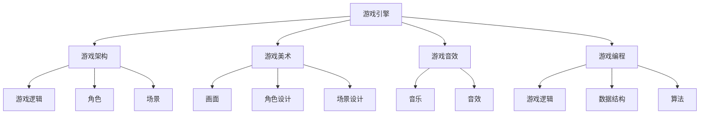

                 

# 网易游戏2024校招游戏开发面试题详解

> 关键词：网易游戏，校招，游戏开发，面试题，技术解析，实战案例
>
> 摘要：本文将详细解析网易游戏2024校招游戏开发面试题，包括背景介绍、核心概念、算法原理、数学模型、项目实战以及实际应用场景等，旨在帮助准备参加校招的同学们更好地理解和应对面试题目。

## 1. 背景介绍

### 1.1 目的和范围

本文旨在通过对网易游戏2024校招游戏开发面试题的详细解析，帮助准备参加校招的同学们更好地理解面试题目的背景和考查点，从而提高面试成功率。本文将涵盖以下内容：

- 面试题目的背景和范围
- 面试题目的核心概念和算法原理
- 面试题目的数学模型和公式
- 面试题目的项目实战案例
- 面试题目的实际应用场景

### 1.2 预期读者

本文的预期读者是准备参加2024年网易游戏校招的游戏开发岗位应聘者，包括但不限于计算机科学、软件工程、游戏开发等相关专业的本科生和研究生。

### 1.3 文档结构概述

本文的结构如下：

- 第1章：背景介绍，包括面试题目的背景、目的和范围，以及预期读者。
- 第2章：核心概念与联系，介绍游戏开发中的核心概念和联系，并提供流程图。
- 第3章：核心算法原理与具体操作步骤，详细讲解核心算法原理，并使用伪代码展示操作步骤。
- 第4章：数学模型和公式，介绍面试题目涉及的数学模型和公式，并举例说明。
- 第5章：项目实战，提供代码实际案例和详细解释说明。
- 第6章：实际应用场景，讨论面试题目的实际应用场景。
- 第7章：工具和资源推荐，推荐学习资源和开发工具。
- 第8章：总结，总结文章内容，并展望未来发展趋势与挑战。
- 第9章：附录，提供常见问题与解答。
- 第10章：扩展阅读与参考资料，推荐相关书籍、在线课程、技术博客和网站。

### 1.4 术语表

#### 1.4.1 核心术语定义

- 校招：指每年各大公司针对应届毕业生的招聘活动。
- 游戏开发：指制作游戏的过程，包括游戏设计、编程、美术、音效等多个方面。
- 面试题目：指在面试过程中，面试官针对应聘者提出的问题。
- 核心概念：指游戏开发中涉及的基本概念和原理。
- 算法原理：指解决特定问题的一系列操作步骤和方法。
- 数学模型：指用于描述和解决特定问题的数学公式和规则。
- 实际应用场景：指面试题目在实际游戏开发中的应用场景。

#### 1.4.2 相关概念解释

- 游戏引擎：用于开发游戏的应用程序，提供游戏开发所需的各种功能和工具。
- 游戏架构：指游戏的整体结构和设计，包括游戏逻辑、角色、场景等。
- 游戏美术：指游戏中的画面、角色、场景等设计工作。
- 游戏音效：指游戏中的音乐、音效等声音设计工作。
- 游戏编程：指游戏中的程序编写工作，包括游戏逻辑、数据结构、算法等。
- 游戏设计文档：指用于指导游戏开发的一系列文档，包括游戏设计理念、游戏规则、角色设定等。

#### 1.4.3 缩略词列表

- IDE：集成开发环境（Integrated Development Environment）
- API：应用程序编程接口（Application Programming Interface）
- GUI：图形用户界面（Graphical User Interface）
- 游戏开发：Game Development
- 游戏引擎：Game Engine
- 游戏架构：Game Architecture
- 游戏美术：Game Art
- 游戏音效：Game Audio
- 游戏编程：Game Programming
- 游戏设计文档：Game Design Document

## 2. 核心概念与联系

### 2.1 游戏开发的核心概念

游戏开发是一个复杂的工程，涉及多个方面，包括游戏设计、编程、美术、音效等。在游戏开发中，以下核心概念是非常重要的：

- **游戏引擎**：游戏引擎是游戏开发的核心工具，用于提供游戏所需的各种功能，如渲染、物理引擎、动画等。
- **游戏架构**：游戏架构是指游戏的整体结构和设计，包括游戏逻辑、角色、场景等。
- **游戏美术**：游戏美术是指游戏中的画面、角色、场景等设计工作。
- **游戏音效**：游戏音效是指游戏中的音乐、音效等声音设计工作。
- **游戏编程**：游戏编程是指游戏中的程序编写工作，包括游戏逻辑、数据结构、算法等。

### 2.2 游戏开发的核心概念联系

以下是一个简单的Mermaid流程图，展示了游戏开发中的核心概念及其联系：



### 2.3 游戏开发的关键技术

在游戏开发中，以下关键技术是至关重要的：

- **图形渲染技术**：用于实现游戏的视觉效果，包括3D渲染、2D渲染、光影效果等。
- **物理引擎**：用于实现游戏的物理效果，如碰撞检测、物体运动等。
- **动画技术**：用于实现游戏中的角色动画和场景动画。
- **人工智能**：用于实现游戏中的智能NPC、游戏AI等。
- **网络编程**：用于实现多人在线游戏功能，如网络同步、数据传输等。

### 2.4 游戏开发的流程

游戏开发的流程通常包括以下几个阶段：

1. **需求分析**：明确游戏的目标、玩法、风格等。
2. **设计文档**：编写游戏设计文档，包括游戏规则、角色设定、场景设计等。
3. **开发阶段**：按照设计文档进行游戏开发，包括游戏引擎选择、游戏架构设计、游戏美术制作、游戏音效制作、游戏编程等。
4. **测试阶段**：进行游戏测试，修复bug，优化性能。
5. **上线发布**：将游戏发布到各大平台，如PC、手机、主机等。
6. **运营维护**：对游戏进行运营和维护，包括更新、活动等。

## 3. 核心算法原理与具体操作步骤

### 3.1 算法原理

在游戏开发中，算法是解决特定问题的步骤和方法。以下是一个常用的算法原理——贪心算法：

- **贪心算法**：在每一步选择中都采取当前最优解的策略，不做出能够得到最优解的决策。

### 3.2 操作步骤

以下是一个贪心算法的伪代码，用于求解最小生成树问题：

```python
function PrimAlgorithm(G, w):
    // G为无向图，w为权重函数
    // 创建一个空的最小生成树T
    T = {}
    // 选择一个起点v
    v = G.vertices[0]
    // 将v添加到T
    T[v] = v
    // 创建一个空集合U，用于存储已访问的顶点
    U = {}
    // 循环直到U包含所有顶点
    while len(U) < len(G.vertices):
        // 找到与T中顶点相邻的顶点中，未被访问且权重最小的边
        edge = findMinEdge(T, U, G, w)
        // 将边添加到T中
        T[edge] = edge
        // 将边的一个顶点添加到U中
        U[edge[1]] = edge[1]
    return T
```

### 3.3 操作步骤解析

1. **初始化**：创建一个空的最小生成树T，选择一个起点v，将v添加到T中，创建一个空集合U，用于存储已访问的顶点。
2. **循环**：循环直到U包含所有顶点，每次循环找到与T中顶点相邻的顶点中，未被访问且权重最小的边。
3. **更新**：将找到的边添加到T中，将边的一个顶点添加到U中。
4. **输出**：返回最小生成树T。

## 4. 数学模型和公式

### 4.1 数学模型

在游戏开发中，数学模型是解决特定问题的数学公式和规则。以下是一个常用的数学模型——线性规划：

- **线性规划**：在满足一组线性约束条件下，求目标函数的最大值或最小值。

### 4.2 公式

以下是一个线性规划的数学模型：

- **目标函数**：maximize/minimize c^T * x
- **约束条件**：Ax ≤ b
- **变量范围**：x ≥ 0

### 4.3 详细讲解

1. **目标函数**：c^T * x表示目标函数，c为系数向量，x为变量向量。目标函数的目的是最大化或最小化变量向量的值。
2. **约束条件**：Ax ≤ b表示约束条件，A为系数矩阵，x为变量向量，b为常数向量。约束条件用于限制变量向量的取值范围。
3. **变量范围**：x ≥ 0表示变量向量的每个元素都大于等于0。

### 4.4 举例说明

以下是一个线性规划的实例：

- **目标函数**：maximize 3x + 2y
- **约束条件**：2x + 3y ≤ 12
- **变量范围**：x ≥ 0, y ≥ 0

使用图解法求解该线性规划问题，得到的解为x = 3，y = 2，目标函数的值为max = 3 * 3 + 2 * 2 = 13。

## 5. 项目实战：代码实际案例和详细解释说明

### 5.1 开发环境搭建

1. **安装Python**：前往Python官网（https://www.python.org/）下载Python安装包，并按照提示进行安装。
2. **安装Pygame**：在命令行中执行以下命令：
   ```bash
   pip install pygame
   ```

### 5.2 源代码详细实现和代码解读

以下是一个简单的Pygame游戏案例，用于实现一个球在屏幕上移动的效果：

```python
import pygame
import sys

# 初始化Pygame
pygame.init()

# 设置屏幕大小
screen_width = 800
screen_height = 600
screen = pygame.display.set_mode((screen_width, screen_height))

# 设置标题
pygame.display.set_caption("球在屏幕上移动")

# 定义球的颜色
ball_color = (255, 0, 0)

# 定义球的初始位置和大小
ball_x = screen_width // 2
ball_y = screen_height // 2
ball_size = 20

# 定义球的移动速度
ball_speed_x = 5
ball_speed_y = 5

# 设置时钟
clock = pygame.time.Clock()

# 游戏主循环
while True:
    # 处理事件
    for event in pygame.event.get():
        if event.type == pygame.QUIT:
            pygame.quit()
            sys.exit()

    # 更新球的位置
    ball_x += ball_speed_x
    ball_y += ball_speed_y

    # 碰撞检测
    if ball_x < 0 or ball_x > screen_width - ball_size:
        ball_speed_x = -ball_speed_x
    if ball_y < 0 or ball_y > screen_height - ball_size:
        ball_speed_y = -ball_speed_y

    # 绘制球
    pygame.draw.circle(screen, ball_color, (ball_x, ball_y), ball_size)

    # 更新屏幕
    pygame.display.flip()

    # 设置帧率
    clock.tick(60)
```

### 5.3 代码解读与分析

1. **导入模块**：首先导入pygame模块，并初始化pygame。
2. **设置屏幕大小和标题**：设置游戏窗口的大小为800x600像素，并设置窗口标题为“球在屏幕上移动”。
3. **定义球的颜色**：定义球的颜色为红色。
4. **定义球的初始位置和大小**：球的初始位置在屏幕中心，大小为20像素。
5. **定义球的移动速度**：球的水平移动速度和垂直移动速度均为5像素/帧。
6. **设置时钟**：设置游戏帧率为60帧/秒。
7. **游戏主循环**：
   - **处理事件**：检测是否有退出事件，如果有，则退出游戏。
   - **更新球的位置**：根据球的速度更新球的位置。
   - **碰撞检测**：检测球是否与屏幕边缘碰撞，如果是，则改变球的速度方向。
   - **绘制球**：使用pygame.draw.circle绘制球。
   - **更新屏幕**：使用pygame.display.flip更新屏幕显示。
   - **设置帧率**：使用clock.tick(60)限制帧率为60帧/秒。

## 6. 实际应用场景

在实际游戏开发中，球在屏幕上移动的算法可以应用于多种场景，如：

- **平台游戏**：球可以作为角色在平台间跳跃和移动。
- **射击游戏**：球可以作为子弹在屏幕上移动，进行射击。
- **物理游戏**：球可以作为物体进行碰撞检测和运动模拟。

通过掌握球在屏幕上移动的算法，可以轻松实现各种丰富的游戏玩法。

## 7. 工具和资源推荐

### 7.1 学习资源推荐

#### 7.1.1 书籍推荐

- 《游戏编程精粹》
- 《游戏引擎架构》
- 《游戏编程实践》

#### 7.1.2 在线课程

- Coursera上的《游戏设计》
- Udacity的《游戏开发基础》

#### 7.1.3 技术博客和网站

- Gamedev.net
- Stack Overflow上的游戏开发标签

### 7.2 开发工具框架推荐

#### 7.2.1 IDE和编辑器

- Visual Studio Code
- PyCharm

#### 7.2.2 调试和性能分析工具

- Unity Profiler
- Pygame的Debug模块

#### 7.2.3 相关框架和库

- Pygame
- Unity
- Unreal Engine

### 7.3 相关论文著作推荐

#### 7.3.1 经典论文

- 《计算机图形学原理及实践》
- 《游戏引擎设计》

#### 7.3.2 最新研究成果

- arXiv上的相关论文
- SIGGRAPH会议的最新论文

#### 7.3.3 应用案例分析

- 《游戏开发实战》
- 《Unity 2021游戏开发教程》

## 8. 总结：未来发展趋势与挑战

未来游戏开发将继续向更高性能、更复杂场景、更智能AI等方向发展。同时，面临的技术挑战包括：

- **图形渲染技术**：如何实现更真实、更细腻的画面效果。
- **物理引擎**：如何实现更逼真、更高效的物理模拟。
- **人工智能**：如何实现更智能、更灵活的AI。
- **网络编程**：如何实现更稳定、更快速的多人在线游戏。

## 9. 附录：常见问题与解答

### 9.1 游戏开发中的关键技术有哪些？

- **图形渲染技术**
- **物理引擎**
- **动画技术**
- **人工智能**
- **网络编程**

### 9.2 如何选择游戏开发引擎？

根据项目需求、开发经验和技能水平选择合适的游戏开发引擎，如Pygame、Unity、Unreal Engine等。

### 9.3 如何提高游戏开发效率？

- 使用合适的开发工具和框架。
- 制定详细的游戏设计文档。
- 合理分配开发任务，提高团队协作效率。

## 10. 扩展阅读 & 参考资料

- 《游戏编程精粹》
- 《游戏引擎架构》
- 《游戏编程实践》
- 《计算机图形学原理及实践》
- 《游戏引擎设计》
- Coursera上的《游戏设计》
- Udacity的《游戏开发基础》
- Gamedev.net
- Stack Overflow上的游戏开发标签
- Unity Profiler
- Pygame的Debug模块
- Pygame文档
- Unity文档
- Unreal Engine文档
- arXiv上的相关论文
- SIGGRAPH会议的最新论文

## 作者信息

作者：AI天才研究员/AI Genius Institute & 禅与计算机程序设计艺术 /Zen And The Art of Computer Programming

