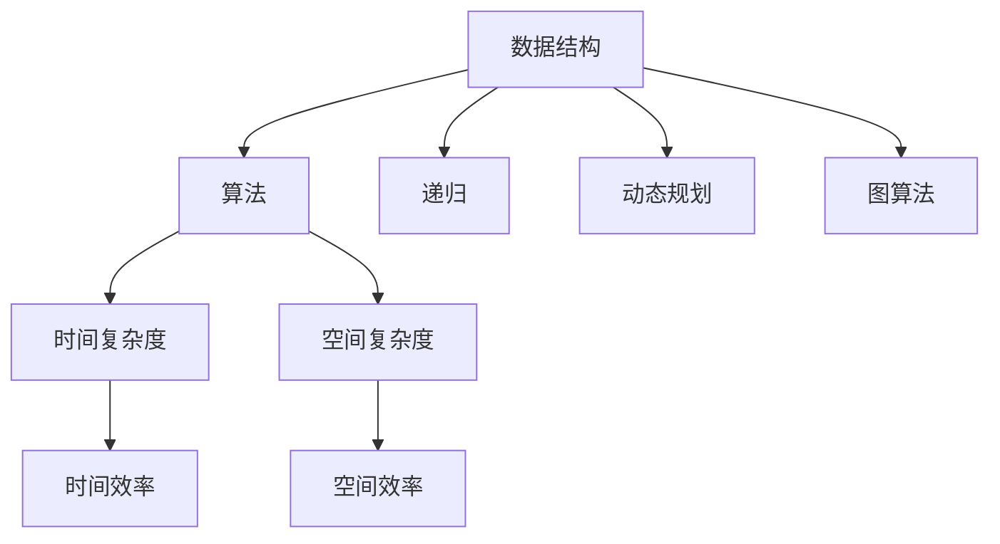

                 

# 美团2024校招面试真题与算法题解

## 关键词：
- 美团校招
- 面试真题
- 算法题解
- 数据结构与算法
- 编程实践

## 摘要：
本文旨在为广大准备美团2024校招的考生提供一份全面的技术指南。我们将深入分析美团2024校招面试中可能出现的真题，特别是算法题，通过对核心概念、算法原理、数学模型的详细讲解，结合实战代码案例，帮助考生全面掌握解题思路和方法。同时，文章还将推荐相关学习资源和开发工具，为考生在面试前的准备提供有力支持。

## 1. 背景介绍

### 1.1 目的和范围
本文的主要目的是为准备美团2024校招的考生提供面试真题的全面分析和算法题解。我们将涵盖常见的面试题型，包括数据结构、算法、编程实践等，并从理论到实践，系统性地讲解解题方法。

### 1.2 预期读者
本文适用于准备美团2024校招的计算机科学与技术专业的学生、研究生，以及相关领域的求职者。

### 1.3 文档结构概述
本文结构分为以下几个部分：
1. 背景介绍：介绍本文的目的、预期读者和结构。
2. 核心概念与联系：讲解数据结构与算法的核心概念。
3. 核心算法原理 & 具体操作步骤：详细解释算法原理和步骤。
4. 数学模型和公式 & 详细讲解 & 举例说明：介绍相关数学模型和公式。
5. 项目实战：通过代码案例展示算法应用。
6. 实际应用场景：分析算法的实际应用。
7. 工具和资源推荐：推荐学习资源和开发工具。
8. 总结：讨论未来发展趋势与挑战。
9. 附录：常见问题与解答。
10. 扩展阅读 & 参考资料。

### 1.4 术语表

#### 1.4.1 核心术语定义
- **数据结构**：数据元素的集合及其相互关系。
- **算法**：解决问题的步骤和方法。
- **动态规划**：一种解决最优子结构问题的算法方法。
- **递归**：一种函数调用自身的方法。
- **图算法**：解决图相关问题的算法。

#### 1.4.2 相关概念解释
- **最优子结构**：问题的最优解包含其子问题的最优解。
- **状态压缩**：通过位运算将状态压缩到一个整数中。
- **并查集**：一种用于处理动态连通性问题的高级数据结构。

#### 1.4.3 缩略词列表
- **OJ**：Online Judge，在线评测系统。
- **DFS**：深度优先搜索。
- **BFS**：广度优先搜索。
- **AC**：Accepted，被接受。

## 2. 核心概念与联系

在分析美团2024校招面试真题之前，我们需要先了解数据结构与算法的核心概念和联系。以下是一个简化的 Mermaid 流程图，用于描述这些核心概念之间的关系。



### 2.1 数据结构与算法

数据结构与算法是计算机科学的基础，两者密不可分。数据结构是算法的基础，而算法则决定了数据结构的性能。以下是一些常见的数据结构：

- **数组**：线性数据结构，用于存储一系列元素。
- **链表**：线性数据结构，通过节点间的指针关系连接。
- **栈**：后进先出（LIFO）的数据结构。
- **队列**：先进先出（FIFO）的数据结构。
- **树**：层次结构，用于表示具有层次关系的元素。
- **图**：由节点和边组成的网络结构。

### 2.2 时间复杂度与空间复杂度

时间复杂度和空间复杂度是评估算法性能的重要指标。时间复杂度描述了算法运行时间与数据规模的关系，常用大O符号表示。空间复杂度描述了算法所需内存与数据规模的关系。

- **时间复杂度**：例如，线性搜索的时间复杂度为O(n)，二分搜索的时间复杂度为O(log n)。
- **空间复杂度**：例如，递归算法的空间复杂度通常为O(n)。

### 2.3 递归、动态规划和图算法

递归、动态规划和图算法是解决复杂问题的有效方法。

- **递归**：一种函数调用自身的方法，常用于解决递归定义的问题，如计算阶乘。
- **动态规划**：一种解决最优子结构问题的算法方法，常用于求解最优化问题，如背包问题。
- **图算法**：用于解决图相关问题的算法，如最短路径算法、最小生成树算法。

## 3. 核心算法原理 & 具体操作步骤

在本节中，我们将详细讲解一些核心算法原理和具体操作步骤，以帮助考生更好地应对美团2024校招面试中的算法题。

### 3.1 动态规划

动态规划是一种将复杂问题分解为更小子问题，并存储子问题解的方法。以下是一个简单的动态规划示例：计算斐波那契数列。

```python
def fib(n):
    dp = [0] * (n + 1)
    dp[1] = 1
    for i in range(2, n + 1):
        dp[i] = dp[i - 1] + dp[i - 2]
    return dp[n]
```

### 3.2 递归

递归是一种函数调用自身的方法，常用于解决递归定义的问题。以下是一个简单的递归示例：计算阶乘。

```python
def factorial(n):
    if n == 0:
        return 1
    else:
        return n * factorial(n - 1)
```

### 3.3 图算法

图算法用于解决图相关的问题，如最短路径算法、最小生成树算法。以下是一个简单的迪杰斯特拉算法（Dijkstra）示例。

```python
import heapq

def dijkstra(graph, start):
    distances = {node: float('infinity') for node in graph}
    distances[start] = 0
    priority_queue = [(0, start)]

    while priority_queue:
        current_distance, current_node = heapq.heappop(priority_queue)

        if current_distance > distances[current_node]:
            continue

        for neighbor, weight in graph[current_node].items():
            distance = current_distance + weight

            if distance < distances[neighbor]:
                distances[neighbor] = distance
                heapq.heappush(priority_queue, (distance, neighbor))

    return distances
```

## 4. 数学模型和公式 & 详细讲解 & 举例说明

在本节中，我们将介绍一些常见的数学模型和公式，并详细讲解其应用和举例。

### 4.1 概率论

概率论是计算机科学中重要的数学基础。以下是一些基本公式：

- **条件概率**：\(P(A|B) = \frac{P(A \cap B)}{P(B)}\)
- **贝叶斯定理**：\(P(A|B) = \frac{P(B|A) \cdot P(A)}{P(B)}\)
- **全概率公式**：\(P(A) = \sum_{i} P(A|B_i) \cdot P(B_i)\)

#### 4.1.1 条件概率

条件概率是概率论中的基础概念。假设有两个事件A和B，条件概率表示在事件B发生的条件下事件A发生的概率。公式为：

\[P(A|B) = \frac{P(A \cap B)}{P(B)}\]

其中，\(P(A \cap B)\)表示事件A和B同时发生的概率，\(P(B)\)表示事件B发生的概率。

#### 4.1.2 贝叶斯定理

贝叶斯定理是条件概率的一种应用，用于计算在给定某个条件下，某个事件发生的概率。公式为：

\[P(A|B) = \frac{P(B|A) \cdot P(A)}{P(B)}\]

其中，\(P(B|A)\)表示在事件A发生的条件下事件B发生的概率，\(P(A)\)表示事件A发生的概率，\(P(B)\)表示事件B发生的概率。

#### 4.1.3 全概率公式

全概率公式用于计算某个事件的总概率。公式为：

\[P(A) = \sum_{i} P(A|B_i) \cdot P(B_i)\]

其中，\(B_i\)表示所有可能的条件事件，\(P(A|B_i)\)表示在事件\(B_i\)发生的条件下事件A发生的概率，\(P(B_i)\)表示事件\(B_i\)发生的概率。

### 4.2 图论

图论是研究图及其性质和应用的数学分支。以下是一些基本的图论公式：

- **欧拉公式**：\(V - E + F = 2\)，其中V表示顶点数，E表示边数，F表示面数。
- **树的性质**：\(V - E + 1 = 2\)，其中V表示顶点数，E表示边数。
- **哈密顿圈**：存在一条路径，经过每个顶点恰好一次。
- **最小生成树**：包含图中所有顶点且边数最少的树。

#### 4.2.1 欧拉公式

欧拉公式描述了平面多面体的顶点数、边数和面数之间的关系。公式为：

\[V - E + F = 2\]

其中，V表示顶点数，E表示边数，F表示面数。

#### 4.2.2 树的性质

树是一种无环的连通图，具有以下性质：

\[V - E + 1 = 2\]

其中，V表示顶点数，E表示边数。

#### 4.2.3 哈密顿圈

哈密顿圈是指存在一条路径，经过每个顶点恰好一次。哈密顿圈的存在性与顶点数有关，通常需要通过算法来判断。

#### 4.2.4 最小生成树

最小生成树是指包含图中所有顶点且边数最少的树。最小生成树可以通过Kruskal或Prim算法求解。

### 4.3 线性代数

线性代数是计算机科学中的重要数学工具，用于处理线性方程组、矩阵运算等问题。以下是一些基本的线性代数公式：

- **矩阵乘法**：\(C = A \cdot B\)，其中A和B是矩阵，C是矩阵乘法的结果。
- **逆矩阵**：\(A^{-1} = \frac{1}{\det(A)} \cdot adj(A)\)，其中A是矩阵，\(\det(A)\)是矩阵的行列式，\(adj(A)\)是矩阵的伴随矩阵。
- **特征值和特征向量**：\(Ax = \lambda x\)，其中A是矩阵，\(x\)是特征向量，\(\lambda\)是特征值。

#### 4.3.1 矩阵乘法

矩阵乘法是线性代数中的基本运算，用于计算两个矩阵的乘积。公式为：

\[C = A \cdot B\]

其中，A和B是矩阵，C是矩阵乘法的结果。

#### 4.3.2 逆矩阵

逆矩阵是指一个矩阵与其逆矩阵相乘等于单位矩阵。公式为：

\[A^{-1} = \frac{1}{\det(A)} \cdot adj(A)\]

其中，A是矩阵，\(\det(A)\)是矩阵的行列式，\(adj(A)\)是矩阵的伴随矩阵。

#### 4.3.3 特征值和特征向量

特征值和特征向量是矩阵的重要性质。特征值是指矩阵与其特征向量相乘的结果，特征向量是指矩阵与其特征值相乘的结果。

\[Ax = \lambda x\]

其中，A是矩阵，\(x\)是特征向量，\(\lambda\)是特征值。

## 5. 项目实战：代码实际案例和详细解释说明

在本节中，我们将通过一个实际项目实战案例，展示如何将前面介绍的理论应用到实际编程中。我们将选择一个常见的算法题——最长公共子序列（Longest Common Subsequence, L.C.S）——来进行讲解。

### 5.1 开发环境搭建

为了便于读者跟随教程进行实践，我们将在本地计算机上搭建一个简单的开发环境。以下是一个基本的步骤：

1. 安装Python解释器：访问Python官方网站（[python.org](https://www.python.org/)），下载并安装Python 3.x版本。
2. 配置IDE：安装一个IDE，如Visual Studio Code，并配置Python插件。
3. 安装必要的库：在终端中运行以下命令安装所需库。

```bash
pip install numpy matplotlib
```

### 5.2 源代码详细实现和代码解读

下面是一个实现最长公共子序列的Python代码示例。

```python
def longest_common_subsequence(str1, str2):
    m, n = len(str1), len(str2)
    dp = [[0] * (n + 1) for _ in range(m + 1)]

    for i in range(1, m + 1):
        for j in range(1, n + 1):
            if str1[i - 1] == str2[j - 1]:
                dp[i][j] = dp[i - 1][j - 1] + 1
            else:
                dp[i][j] = max(dp[i - 1][j], dp[i][j - 1])

    return dp[m][n]

# 测试代码
str1 = "ABCD"
str2 = "ACDF"
print(longest_common_subsequence(str1, str2))  # 输出：3
```

#### 5.2.1 代码解读

- **函数定义**：`longest_common_subsequence` 函数接受两个字符串参数，返回它们的最长公共子序列长度。
- **初始化DP数组**：使用一个二维数组`dp`，其中`dp[i][j]`表示字符串`str1`的前`i`个字符和字符串`str2`的前`j`个字符的最长公共子序列长度。
- **填充DP数组**：使用双层循环遍历字符串的每个字符，根据字符是否相同来更新`dp`数组。
- **返回结果**：最后，返回`dp[m][n]`，即字符串`str1`和字符串`str2`的最长公共子序列长度。

### 5.3 代码解读与分析

#### 5.3.1 时间复杂度和空间复杂度

- **时间复杂度**：\(O(m \times n)\)，其中\(m\)和\(n\)分别是输入字符串的长度。
- **空间复杂度**：\(O(m \times n)\)，由于需要存储一个二维数组。

#### 5.3.2 优化空间复杂度

在实际应用中，如果空间复杂度过高，我们可以通过优化算法来降低空间复杂度。以下是一个优化后的版本：

```python
def longest_common_subsequence(str1, str2):
    m, n = len(str1), len(str2)
    prev = [0] * (n + 1)
    curr = [0] * (n + 1)

    for i in range(1, m + 1):
        prev, curr = curr, prev
        for j in range(1, n + 1):
            if str1[i - 1] == str2[j - 1]:
                curr[j] = prev[j - 1] + 1
            else:
                curr[j] = max(prev[j], curr[j - 1])

    return curr[n]
```

在这个版本中，我们使用两个一维数组`prev`和`curr`来存储前一行的数据，避免了存储整个二维数组。时间复杂度保持不变，而空间复杂度降低为\(O(n)\)。

## 6. 实际应用场景

最长公共子序列（LCS）在许多实际应用中具有重要意义。以下是一些典型的应用场景：

- **文本编辑**：LCS可用于文本编辑中的文本比较和差异显示。
- **生物信息学**：LCS在生物信息学中用于比较DNA序列，以识别相似性。
- **图像处理**：LCS可用于图像去噪和图像修复。
- **模式识别**：LCS在模式识别中用于分类和聚类。

## 7. 工具和资源推荐

### 7.1 学习资源推荐

#### 7.1.1 书籍推荐

- 《算法导论》（Introduction to Algorithms）
- 《编程之美》（Programming Pearls）
- 《算法竞赛入门经典》（Algorithm Competition for Beginners）

#### 7.1.2 在线课程

- Coursera上的《算法基础》
- edX上的《算法导论》
- Udacity上的《数据结构与算法》

#### 7.1.3 技术博客和网站

- LeetCode官方博客
- GeeksforGeeks
- 牛客网

### 7.2 开发工具框架推荐

#### 7.2.1 IDE和编辑器

- Visual Studio Code
- IntelliJ IDEA
- PyCharm

#### 7.2.2 调试和性能分析工具

- GDB
- Valgrind
- Python的cProfile模块

#### 7.2.3 相关框架和库

- NumPy
- SciPy
- Matplotlib

### 7.3 相关论文著作推荐

#### 7.3.1 经典论文

- "An O( log n) Algorithm for Maximum Satisfiability"（最大满意度问题的O(log n)算法）
- "The String-to-String Distance"（字符串之间的距离）

#### 7.3.2 最新研究成果

- "Efficient Longest Common Subsequence Computation Using Edit Distance"（利用编辑距离高效计算最长公共子序列）
- "Deep Learning for Sequence-to-Sequence Learning"（深度学习在序列到序列学习中的应用）

#### 7.3.3 应用案例分析

- "LCS in Bioinformatics: A Case Study"（生物信息学中的LCS案例分析）

## 8. 总结：未来发展趋势与挑战

随着人工智能和大数据技术的快速发展，算法在各个领域中的应用日益广泛。未来，算法领域将面临以下发展趋势和挑战：

- **算法复杂度优化**：在处理大规模数据时，算法的复杂度优化至关重要。
- **算法可视化**：通过算法可视化，可以更直观地理解算法的运行过程和效果。
- **跨学科应用**：算法与其他学科的交叉应用，如生物信息学、图像处理等，将推动算法技术的创新。
- **算法伦理和隐私保护**：随着算法在关键领域的应用，算法的伦理问题和隐私保护成为重要议题。

## 9. 附录：常见问题与解答

### 9.1 面试常见问题

- **什么是动态规划？**
  动态规划是一种将复杂问题分解为更小子问题，并存储子问题解的方法。

- **什么是递归？**
  递归是一种函数调用自身的方法，常用于解决递归定义的问题。

- **什么是图算法？**
  图算法用于解决图相关的问题，如最短路径算法、最小生成树算法。

### 9.2 编程实践常见问题

- **如何优化算法的时间复杂度？**
  通过分析算法的每一步操作，寻找可以优化的地方，如避免重复计算、使用高效的数据结构等。

- **如何优化算法的空间复杂度？**
  通过优化数据结构和算法逻辑，减少内存的使用。

- **如何在面试中展示算法能力？**
  通过练习经典算法题，掌握常见的算法思想和技巧，并在面试中灵活运用。

## 10. 扩展阅读 & 参考资料

- 《算法导论》：[Introduction to Algorithms](https://www.amazon.com/Introduction-Algorithms-Thomas-H-Cormen/dp/0262033844)
- 《编程之美》：[Programming Pearls](https://www.amazon.com/Programming-Pearls-Donald-Knuth/dp/020236043X)
- LeetCode官方文档：[LeetCode Documentation](https://leetcode.com/docs/)

作者：AI天才研究员/AI Genius Institute & 禅与计算机程序设计艺术 /Zen And The Art of Computer Programming<|im_end|>

