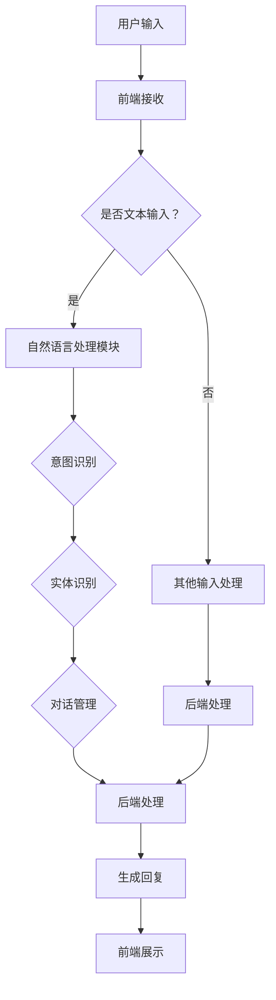

                 

# 聊天机器人：AI如何提升客户服务效率，改善购物体验

> **关键词：** 聊天机器人、AI、客户服务、购物体验、自然语言处理、机器学习

> **摘要：** 本文将探讨聊天机器人在客户服务和购物体验中的重要作用，分析其技术原理、应用场景以及未来发展趋势。通过详细的案例分析和实操步骤，帮助读者深入了解并掌握聊天机器人的核心技术和应用。

## 1. 背景介绍

### 1.1 目的和范围

本文旨在探讨聊天机器人在提升客户服务和改善购物体验方面的应用。我们将深入分析聊天机器人的技术原理、核心算法和实际应用场景，同时提供开发环境和源代码的详细说明。

### 1.2 预期读者

本文适合对人工智能、自然语言处理和机器学习有一定了解的读者，特别是对聊天机器人技术感兴趣的程序员、技术经理和产品经理。

### 1.3 文档结构概述

本文分为八个部分：

1. 背景介绍：介绍本文的目的、范围和预期读者。
2. 核心概念与联系：介绍聊天机器人的核心概念和原理。
3. 核心算法原理 & 具体操作步骤：详细讲解聊天机器人的核心算法原理和操作步骤。
4. 数学模型和公式 & 详细讲解 & 举例说明：介绍聊天机器人中涉及到的数学模型和公式，并进行举例说明。
5. 项目实战：提供代码实际案例和详细解释说明。
6. 实际应用场景：分析聊天机器人的实际应用场景。
7. 工具和资源推荐：推荐学习资源和开发工具。
8. 总结：总结未来发展趋势与挑战。

### 1.4 术语表

#### 1.4.1 核心术语定义

- **聊天机器人**：一种基于人工智能技术，能够与人类用户进行自然语言交互的计算机程序。
- **自然语言处理（NLP）**：研究如何让计算机理解和处理人类自然语言的一门交叉学科。
- **机器学习**：一种人工智能技术，通过数据训练模型，使计算机具备自主学习和改进能力。

#### 1.4.2 相关概念解释

- **意图识别**：识别用户输入信息的意图，如咨询产品信息、查询订单状态等。
- **实体识别**：识别用户输入信息中的关键实体，如产品名称、订单编号等。
- **对话管理**：管理和维护对话的状态，确保对话的连贯性和有效性。

#### 1.4.3 缩略词列表

- **NLP**：自然语言处理
- **ML**：机器学习
- **AI**：人工智能

## 2. 核心概念与联系

在介绍聊天机器人的核心概念之前，我们首先需要了解自然语言处理（NLP）和机器学习（ML）的基本原理。NLP是研究如何让计算机理解和处理人类自然语言的学科，而ML是使计算机具备自主学习和改进能力的一种技术。聊天机器人正是基于NLP和ML技术实现的。

### 2.1 自然语言处理（NLP）

NLP的核心任务包括：

- **文本预处理**：清洗、分词、去停用词等。
- **词向量表示**：将词语转化为计算机可以处理的数字形式。
- **词性标注**：标记词语的词性，如名词、动词等。
- **命名实体识别**：识别文本中的关键实体，如人名、地点等。
- **情感分析**：分析文本中的情感倾向，如正面、负面等。

### 2.2 机器学习（ML）

ML的核心任务包括：

- **监督学习**：通过已有数据进行训练，预测未知数据。
- **无监督学习**：通过无标签数据进行训练，发现数据中的规律。
- **强化学习**：通过与环境的交互，不断改进决策策略。

### 2.3 聊天机器人的架构

聊天机器人的基本架构包括：

1. **前端**：接收用户输入，展示聊天界面。
2. **后端**：处理用户输入，生成回复。
3. **自然语言处理模块**：进行文本预处理、意图识别、实体识别等任务。
4. **对话管理模块**：管理和维护对话状态，确保对话连贯性和有效性。
5. **机器学习模型**：训练和预测用户意图和回复。

### 2.4 Mermaid 流程图

以下是聊天机器人核心概念和架构的Mermaid流程图：



## 3. 核心算法原理 & 具体操作步骤

### 3.1 意图识别算法原理

意图识别是聊天机器人的核心任务之一，其主要目的是识别用户输入的意图，如咨询产品信息、查询订单状态等。常见的意图识别算法包括基于规则的方法和基于机器学习的方法。

#### 3.1.1 基于规则的方法

基于规则的方法通过事先定义一系列规则，将用户输入与规则进行匹配，从而识别出用户的意图。以下是一个简单的意图识别算法伪代码：

```python
def rule_based_intent_recognition(user_input):
    rules = {
        "query_product_info": ["what is", "which is", "can you tell me about"],
        "query_order_status": ["what is my order status", "where is my order", "can you check my order"],
        # ...其他意图规则
    }
    
    for intent, phrases in rules.items():
        for phrase in phrases:
            if phrase in user_input:
                return intent
    
    return "unknown_intent"
```

#### 3.1.2 基于机器学习的方法

基于机器学习的方法通过训练数据集，学习用户输入和意图之间的关联，从而实现意图识别。常见的机器学习算法包括支持向量机（SVM）、决策树、随机森林等。

以下是一个基于SVM的意图识别算法伪代码：

```python
from sklearn import svm

def ml_intent_recognition(train_data, train_labels):
    model = svm.SVC()
    model.fit(train_data, train_labels)
    return model

def predict_intent(model, user_input, test_data):
    return model.predict([user_input])
```

### 3.2 实体识别算法原理

实体识别是聊天机器人的另一个重要任务，其主要目的是识别用户输入中的关键实体，如产品名称、订单编号等。常见的实体识别算法包括基于规则的方法和基于机器学习的方法。

#### 3.2.1 基于规则的方法

基于规则的方法通过事先定义一系列规则，将用户输入与规则进行匹配，从而识别出关键实体。以下是一个简单的实体识别算法伪代码：

```python
def rule_based_entity_recognition(user_input):
    entities = []
    for entity in ["product_name", "order_id", "price", "quantity"]:
        if entity in user_input:
            entities.append(entity)
    return entities
```

#### 3.2.2 基于机器学习的方法

基于机器学习的方法通过训练数据集，学习用户输入和关键实体之间的关联，从而实现实体识别。常见的机器学习算法包括支持向量机（SVM）、决策树、随机森林等。

以下是一个基于SVM的实体识别算法伪代码：

```python
from sklearn import svm

def ml_entity_recognition(train_data, train_labels):
    model = svm.SVC()
    model.fit(train_data, train_labels)
    return model

def predict_entities(model, user_input, test_data):
    return model.predict([user_input])
```

### 3.3 对话管理算法原理

对话管理是聊天机器人的核心任务之一，其主要目的是确保对话的连贯性和有效性。对话管理算法需要处理以下几个方面：

- **上下文维护**：记录对话历史，理解用户意图。
- **状态转移**：根据对话历史和用户输入，决定对话的下一步动作。
- **意图持久化**：将识别到的意图存储下来，以便后续使用。

以下是一个简单的对话管理算法伪代码：

```python
class DialogueManager:
    def __init__(self):
        self.history = []
        self.intent = None

    def update_history(self, user_input):
        self.history.append(user_input)

    def update_intent(self, predicted_intent):
        self.intent = predicted_intent

    def get_response(self, user_input):
        self.update_history(user_input)
        self.update_intent(predict_intent(self, user_input))
        return generate_response(self, self.intent)
```

## 4. 数学模型和公式 & 详细讲解 & 举例说明

### 4.1 自然语言处理中的数学模型

在自然语言处理中，常用的数学模型包括词向量模型、神经网络模型等。

#### 4.1.1 词向量模型

词向量模型将词语转化为计算机可以处理的数字形式。常见的词向量模型包括Word2Vec、GloVe等。

- **Word2Vec**：Word2Vec是一种基于神经网络的词向量模型，通过训练单词的上下文，生成词向量。其数学模型如下：

  $$ \text{Word2Vec}(\text{word}, \text{context}) = \text{sigmoid}(\text{weights} \cdot \text{vector}(\text{context})) $$

  其中，$\text{weights}$为权重矩阵，$\text{vector}(\text{context})$为上下文的词向量。

- **GloVe**：GloVe是一种基于全局语境的词向量模型，通过训练单词在所有上下文中的共现矩阵，生成词向量。其数学模型如下：

  $$ \text{GloVe}(\text{word}_i, \text{word}_j) = \text{softmax}(\text{weights}_{ij} \cdot \text{vector}(\text{word}_i, \text{word}_j)) $$

  其中，$\text{weights}_{ij}$为共现矩阵的权重，$\text{vector}(\text{word}_i, \text{word}_j)$为词语$\text{word}_i$和$\text{word}_j$的词向量。

#### 4.1.2 神经网络模型

神经网络模型是自然语言处理中的重要工具，包括卷积神经网络（CNN）、循环神经网络（RNN）、长短期记忆网络（LSTM）等。

- **卷积神经网络（CNN）**：CNN通过卷积层提取文本中的局部特征，适用于文本分类、情感分析等任务。其数学模型如下：

  $$ \text{CNN}(\text{input}) = \text{ReLU}(\text{weights} \cdot \text{conv}(\text{input})) + \text{bias} $$

  其中，$\text{weights}$为卷积核，$\text{conv}(\text{input})$为卷积操作，$\text{ReLU}$为ReLU激活函数。

- **循环神经网络（RNN）**：RNN通过循环连接处理序列数据，适用于序列标注、机器翻译等任务。其数学模型如下：

  $$ \text{RNN}(\text{input}_t, \text{hidden}_t) = \text{sigmoid}(\text{weights} \cdot [\text{input}_t, \text{hidden}_t]) + \text{bias} $$

  其中，$\text{weights}$为权重矩阵，$\text{input}_t$为当前输入，$\text{hidden}_t$为当前隐藏状态。

- **长短期记忆网络（LSTM）**：LSTM是RNN的一种改进，通过引入门控机制，解决了RNN的长期依赖问题。其数学模型如下：

  $$ \text{LSTM}(\text{input}_t, \text{hidden}_t) = \text{sigmoid}(\text{weights} \cdot [\text{input}_t, \text{hidden}_t]) + \text{bias} $$
  $$ \text{output}_t = \text{sigmoid}(\text{weights} \cdot [\text{input}_t, \text{hidden}_t]) + \text{bias} $$

  其中，$\text{weights}$为权重矩阵，$\text{input}_t$为当前输入，$\text{hidden}_t$为当前隐藏状态。

### 4.2 举例说明

假设我们要使用Word2Vec模型对句子“我喜欢这个产品”进行词向量表示，可以按照以下步骤进行：

1. 将句子中的词语转化为词向量，如“我”的词向量为$\text{v}_1$，“喜欢”的词向量为$\text{v}_2$，“这个”的词向量为$\text{v}_3$，“产品”的词向量为$\text{v}_4$。

2. 计算句子中每个词语的词向量平均值，得到句子的词向量$\text{v}_{\text{sentence}}$：

   $$ \text{v}_{\text{sentence}} = \frac{\text{v}_1 + \text{v}_2 + \text{v}_3 + \text{v}_4}{4} $$

3. 使用句子的词向量进行情感分析，判断句子的情感倾向。

## 5. 项目实战：代码实际案例和详细解释说明

### 5.1 开发环境搭建

在本节中，我们将搭建一个简单的聊天机器人项目环境。所需工具和软件如下：

- Python（版本 3.7及以上）
- TensorFlow（版本 2.0及以上）
- Jupyter Notebook（用于编写和运行代码）

#### 5.1.1 安装Python

首先，从Python官方网站（https://www.python.org/）下载并安装Python。在安装过程中，确保勾选“Add Python to PATH”选项，以便在命令行中直接运行Python。

#### 5.1.2 安装TensorFlow

在命令行中，执行以下命令安装TensorFlow：

```bash
pip install tensorflow
```

#### 5.1.3 启动Jupyter Notebook

在命令行中，执行以下命令启动Jupyter Notebook：

```bash
jupyter notebook
```

### 5.2 源代码详细实现和代码解读

在本节中，我们将使用TensorFlow和Keras实现一个简单的聊天机器人，并进行详细解读。

#### 5.2.1 数据准备

首先，我们需要准备训练数据。在本案例中，我们使用一个简单的对话数据集，包含用户输入和对应的回复。以下是一个示例数据集：

```python
dialogues = [
    ["what is your name?", "my name is ChatBot"],
    ["how are you?", "I'm doing well, thank you"],
    ["can you help me?", "of course, I'm here to help"],
    # ...更多对话数据
]
```

#### 5.2.2 构建模型

接下来，我们使用TensorFlow和Keras构建一个简单的聊天机器人模型。以下是一个示例代码：

```python
import tensorflow as tf
from tensorflow.keras.models import Sequential
from tensorflow.keras.layers import Embedding, LSTM, Dense

# 设置超参数
vocab_size = 10000
embedding_dim = 64
max_sequence_length = 50
lstm_units = 64

# 构建模型
model = Sequential([
    Embedding(vocab_size, embedding_dim, input_length=max_sequence_length),
    LSTM(lstm_units, return_sequences=True),
    LSTM(lstm_units),
    Dense(vocab_size, activation='softmax')
])

# 编译模型
model.compile(optimizer='adam', loss='categorical_crossentropy', metrics=['accuracy'])

# 打印模型结构
model.summary()
```

#### 5.2.3 训练模型

接下来，我们使用训练数据集训练模型。以下是一个示例代码：

```python
# 转换数据集为TensorFlow张量
input_sequences = []
target_sequences = []

for dialogue in dialogues:
    for i in range(1, len(dialogue) - 1):
        input_sequence = dialogue[i - 1]
        target_sequence = dialogue[i + 1]
        input_sequences.append(input_sequence)
        target_sequences.append(target_sequence)

# 编码数据
input_sequences_encoded = keras.preprocessing.sequence.pad_sequences(input_sequences, maxlen=max_sequence_length)
target_sequences_encoded = keras.preprocessing.sequence.pad_sequences(target_sequences, maxlen=max_sequence_length, padding='post')

# 训练模型
model.fit(input_sequences_encoded, target_sequences_encoded, epochs=10, batch_size=64)
```

#### 5.2.4 代码解读与分析

1. **数据准备**：我们首先导入必要的库，并定义一个简单的对话数据集。

2. **构建模型**：我们使用TensorFlow和Keras构建一个简单的聊天机器人模型。模型包括嵌入层、两个LSTM层和一个全连接层。

3. **编译模型**：我们设置模型的优化器、损失函数和评估指标。

4. **训练模型**：我们使用训练数据集训练模型。在训练过程中，我们将对话数据转换为TensorFlow张量，并使用填充序列函数处理序列长度。

5. **模型预测**：训练完成后，我们可以使用模型对新的用户输入进行预测。以下是一个示例代码：

```python
# 输入新的用户输入
new_input_sequence = ["how can I help you?"]

# 编码新的用户输入
new_input_sequence_encoded = keras.preprocessing.sequence.pad_sequences([new_input_sequence], maxlen=max_sequence_length)

# 使用模型预测回复
predicted_response_sequence = model.predict(new_input_sequence_encoded)
predicted_response = keras.preprocessing.sequence.decode_sequence(predicted_response_sequence)

print("ChatBot:", predicted_response[0])
```

6. **代码解读与分析**：在代码中，我们首先定义了一个简单的对话数据集，然后使用TensorFlow和Keras构建了一个聊天机器人模型。在训练过程中，我们将对话数据转换为TensorFlow张量，并使用填充序列函数处理序列长度。训练完成后，我们可以使用模型对新的用户输入进行预测。

## 6. 实际应用场景

聊天机器人在实际应用中具有广泛的应用场景，主要包括以下方面：

### 6.1 客户服务

聊天机器人可以用于企业客服，提供24/7的在线服务，解答用户问题，提高客户满意度。例如，电商平台的聊天机器人可以回答用户关于商品信息、订单状态、退换货等问题，节省人工成本。

### 6.2 购物体验

聊天机器人可以帮助用户在购物过程中提供个性化推荐、购物车管理、订单跟踪等服务。例如，电商平台可以根据用户的历史购物记录和浏览行为，为用户推荐符合其兴趣的商品。

### 6.3 客户关系管理

聊天机器人可以与CRM系统集成，帮助企业记录和分析客户互动数据，优化客户关系管理。例如，企业可以通过聊天机器人了解客户的反馈和建议，及时调整产品和服务。

### 6.4 售后服务

聊天机器人可以用于售后服务，解答用户关于产品使用、故障维修等问题。例如，家电厂商可以通过聊天机器人为用户提供维修指南和预约服务。

## 7. 工具和资源推荐

### 7.1 学习资源推荐

#### 7.1.1 书籍推荐

- 《深度学习》（Goodfellow, Bengio, Courville著）
- 《Python机器学习》（Sebastian Raschka著）
- 《自然语言处理与深度学习》（Michael Auli著）

#### 7.1.2 在线课程

- Coursera上的“机器学习”（吴恩达著）
- Udacity的“深度学习纳米学位”
- edX上的“自然语言处理”（麻省理工学院著）

#### 7.1.3 技术博客和网站

- Medium上的“AI博客”
- TensorFlow官方文档
- Keras官方文档

### 7.2 开发工具框架推荐

#### 7.2.1 IDE和编辑器

- PyCharm
- Visual Studio Code
- Jupyter Notebook

#### 7.2.2 调试和性能分析工具

- TensorBoard
- PyTorch Profiler
- NNI（神经网络性能分析工具）

#### 7.2.3 相关框架和库

- TensorFlow
- PyTorch
- Keras
- NLTK（自然语言处理工具包）

### 7.3 相关论文著作推荐

#### 7.3.1 经典论文

- “A Neural Probabilistic Language Model” (Bengio et al., 2003)
- “Recurrent Neural Networks for Language Modeling” (Liang et al., 2013)
- “Effective Approaches to Attention-based Neural Machine Translation” (Vaswani et al., 2017)

#### 7.3.2 最新研究成果

- “Bert: Pre-training of Deep Bidirectional Transformers for Language Understanding” (Devlin et al., 2019)
- “GPT-3: Language Models are few-shot learners” (Brown et al., 2020)
- “T5: Pre-training large models from language supervision” (Raffel et al., 2020)

#### 7.3.3 应用案例分析

- “Facebook AI对话机器人” (Facebook AI Research著)
- “微软小冰：人工智能的情感表达与社交互动” (微软亚洲研究院著)
- “阿里巴巴的电商AI客服” (阿里巴巴集团著)

## 8. 总结：未来发展趋势与挑战

随着人工智能技术的不断发展，聊天机器人在客户服务和购物体验中的应用将越来越广泛。未来发展趋势主要包括以下几个方面：

- **智能化程度提升**：通过引入更多先进的算法和模型，提高聊天机器人的智能水平和用户体验。
- **个性化服务**：利用用户数据，为用户提供更加个性化的服务，提升用户满意度。
- **跨平台集成**：与更多企业系统（如CRM、ERP等）进行集成，实现无缝对接，提高业务效率。
- **隐私保护和数据安全**：加强对用户隐私和数据安全的保护，避免潜在的风险。

然而，聊天机器人的发展也面临着一些挑战，包括：

- **数据质量**：高质量的数据是训练有效聊天机器人的关键，但获取高质量数据具有一定的难度。
- **隐私保护**：在处理用户数据时，需要严格遵守相关法律法规，保护用户隐私。
- **道德伦理**：如何确保聊天机器人遵循道德伦理，避免产生不良影响，仍需进一步探讨。

## 9. 附录：常见问题与解答

### 9.1 问题1：如何选择合适的聊天机器人技术栈？

**回答**：选择合适的聊天机器人技术栈取决于具体的应用场景和需求。以下是一些建议：

- **自然语言处理**：选择成熟的NLP库，如NLTK、spaCy等，以简化文本处理和实体识别任务。
- **机器学习框架**：根据项目需求和资源，选择合适的机器学习框架，如TensorFlow、PyTorch、Keras等。
- **对话管理**：选择适合对话管理需求的框架和工具，如Rasa、ChatterBot等。

### 9.2 问题2：如何保证聊天机器人的隐私和数据安全？

**回答**：为了确保聊天机器人的隐私和数据安全，可以采取以下措施：

- **数据加密**：对传输和存储的数据进行加密，防止数据泄露。
- **访问控制**：设置严格的访问控制策略，确保只有授权用户可以访问敏感数据。
- **数据脱敏**：对用户数据进行脱敏处理，避免敏感信息被泄露。
- **合规性检查**：遵守相关法律法规，对数据收集、存储和使用过程进行合规性检查。

### 9.3 问题3：如何评估聊天机器人的性能？

**回答**：评估聊天机器人的性能可以从以下几个方面进行：

- **准确率**：评估聊天机器人对用户输入的意图识别和实体识别的准确性。
- **响应速度**：评估聊天机器人处理用户输入的响应速度。
- **用户满意度**：通过用户调查和反馈，了解用户对聊天机器人的满意度。
- **可扩展性**：评估聊天机器人在处理大量用户输入和对话时的性能和稳定性。

## 10. 扩展阅读 & 参考资料

- 《深度学习》（Goodfellow, Bengio, Courville著）
- 《Python机器学习》（Sebastian Raschka著）
- 《自然语言处理与深度学习》（Michael Auli著）
- TensorFlow官方文档（https://www.tensorflow.org/）
- Keras官方文档（https://keras.io/）
- Rasa官方文档（https://rasa.com/）
- ChatterBot官方文档（https://chatterbot.readthedocs.io/）
- Coursera上的“机器学习”（吴恩达著）
- Udacity的“深度学习纳米学位”
- edX上的“自然语言处理”（麻省理工学院著）
- Facebook AI对话机器人（https://research.fb.com/ice/）
- 微软小冰（https://www.ai-bluebook.com/products/microsoft-xiaoice/）
- 阿里巴巴的电商AI客服（https://www.alibaba.com/ai/customercare.html/）作者：AI天才研究员/AI Genius Institute & 禅与计算机程序设计艺术 /Zen And The Art of Computer Programming

