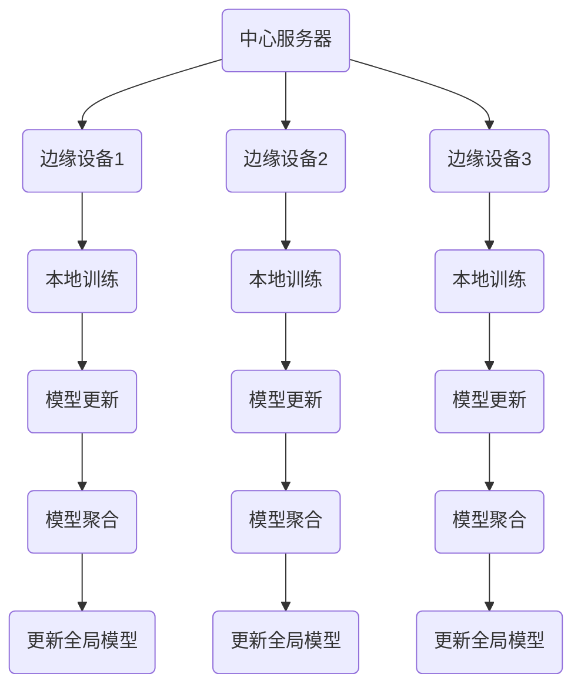

                 

# 联邦学习（Federated Learning）- 原理与代码实例讲解

> 关键词：联邦学习、机器学习、分布式计算、隐私保护、跨设备学习
> 
> 摘要：本文将深入探讨联邦学习（Federated Learning）的基本概念、原理、架构以及具体实现。通过一步步的讲解，读者将了解联邦学习如何解决隐私保护与跨设备学习的问题，并通过实际代码实例掌握联邦学习的基本操作。文章结构包括背景介绍、核心概念与联系、核心算法原理与操作步骤、数学模型与公式、项目实战、实际应用场景、工具和资源推荐以及总结和附录等内容。

## 1. 背景介绍

### 1.1 目的和范围

本文的主要目的是介绍联邦学习的基本概念、原理和实现，让读者能够理解联邦学习在分布式计算、隐私保护和跨设备学习中的应用。文章将围绕以下几个核心问题展开：

1. **什么是联邦学习？**
2. **联邦学习如何解决隐私保护问题？**
3. **联邦学习的基本架构和算法是什么？**
4. **如何通过代码实例实现联邦学习？**
5. **联邦学习在实际应用中的挑战和未来发展趋势是什么？**

### 1.2 预期读者

本文适合对机器学习和分布式计算有一定了解的技术人员，特别是那些对联邦学习感兴趣，希望深入了解其原理和实践的读者。无论你是数据科学家、AI研究员还是程序员，都可以从本文中获益。

### 1.3 文档结构概述

本文将分为以下几个部分：

1. **背景介绍**：简要介绍联邦学习的背景、目的和读者预期。
2. **核心概念与联系**：阐述联邦学习的核心概念，通过Mermaid流程图展示其基本架构。
3. **核心算法原理与具体操作步骤**：详细讲解联邦学习的基本算法原理和具体操作步骤。
4. **数学模型和公式**：介绍联邦学习中的数学模型和公式，并进行详细讲解和举例说明。
5. **项目实战：代码实际案例和详细解释说明**：通过具体代码实例展示联邦学习的实际操作过程。
6. **实际应用场景**：分析联邦学习在不同领域的实际应用。
7. **工具和资源推荐**：推荐相关学习资源和开发工具。
8. **总结：未来发展趋势与挑战**：总结联邦学习的发展趋势和面临的挑战。
9. **附录：常见问题与解答**：解答读者可能遇到的问题。
10. **扩展阅读 & 参考资料**：提供扩展阅读材料和参考文献。

### 1.4 术语表

#### 1.4.1 核心术语定义

- **联邦学习**：一种分布式机器学习技术，允许多个边缘设备共同训练一个模型，同时保护用户数据隐私。
- **边缘设备**：靠近数据源的计算设备，如智能手机、物联网设备等。
- **中心服务器**：协调和管理边缘设备进行联邦学习训练的服务器。
- **聚合**：将多个边缘设备上的模型更新合并为一个全局模型的过程。
- **本地训练**：在边缘设备上对模型进行训练的过程。

#### 1.4.2 相关概念解释

- **分布式计算**：将计算任务分布在多个计算节点上，以提高计算效率和性能。
- **隐私保护**：防止数据在传输和处理过程中被未经授权访问或泄露。
- **模型更新**：模型在训练过程中接收到的更新数据。

#### 1.4.3 缩略词列表

- **FL**：联邦学习（Federated Learning）
- **ML**：机器学习（Machine Learning）
- **DL**：深度学习（Deep Learning）
- **AI**：人工智能（Artificial Intelligence）

## 2. 核心概念与联系

### 2.1 联邦学习的基本架构

联邦学习的基本架构主要包括中心服务器和多个边缘设备。以下是联邦学习的基本架构的Mermaid流程图：



### 2.2 联邦学习的核心概念

#### 2.2.1 分布式计算

分布式计算是将计算任务分布在多个计算节点上，以实现高性能和可扩展性。在联邦学习中，边缘设备作为计算节点，各自进行本地训练，并将模型更新发送到中心服务器。

#### 2.2.2 隐私保护

联邦学习通过分布式计算和模型聚合的方式，避免了用户数据的集中存储和传输，从而保护了用户隐私。中心服务器仅接收模型更新，而不直接访问用户数据。

#### 2.2.3 模型更新

模型更新是指模型在训练过程中接收到的数据。在联邦学习中，每个边缘设备都会在本地训练过程中生成模型更新，并将其发送到中心服务器。

#### 2.2.4 模型聚合

模型聚合是指将多个边缘设备上的模型更新合并为一个全局模型的过程。中心服务器负责聚合所有模型更新，从而更新全局模型。

### 2.3 联邦学习的核心算法

联邦学习的核心算法主要包括本地训练、模型更新和模型聚合。以下是联邦学习核心算法的伪代码：

```python
# 本地训练
def local_training(device_data, model):
    # 在边缘设备上使用设备数据训练模型
    updated_model = train_model(device_data, model)
    return updated_model

# 模型更新
def model_update(updated_models):
    # 将多个边缘设备上的模型更新合并为一个更新模型
    aggregated_model = aggregate_models(updated_models)
    return aggregated_model

# 模型聚合
def aggregate_models(updated_models):
    # 计算所有模型更新的平均值，得到全局模型
    aggregated_model = average_models(updated_models)
    return aggregated_model
```

## 3. 核心算法原理 & 具体操作步骤

### 3.1 本地训练

本地训练是联邦学习的第一步，其核心思想是在边缘设备上使用本地数据进行模型训练。以下是本地训练的具体操作步骤：

1. **数据收集**：从边缘设备收集训练数据。
2. **数据预处理**：对数据进行清洗、归一化等预处理操作。
3. **模型初始化**：初始化全局模型。
4. **本地训练**：使用本地数据进行模型训练。
5. **模型更新**：将训练后的模型更新保存到本地。

以下是本地训练的伪代码：

```python
# 本地训练伪代码
def local_training(device_data, global_model):
    # 数据预处理
    processed_data = preprocess_data(device_data)
    
    # 模型初始化
    local_model = initialize_model(global_model)
    
    # 本地训练
    local_model = train_model(processed_data, local_model)
    
    # 模型更新
    updated_model = save_updated_model(local_model)
    
    return updated_model
```

### 3.2 模型更新

模型更新是联邦学习的第二步，其核心思想是将本地训练得到的模型更新发送到中心服务器。以下是模型更新的具体操作步骤：

1. **模型更新生成**：在边缘设备上生成模型更新。
2. **模型更新上传**：将模型更新上传到中心服务器。
3. **模型更新验证**：验证上传的模型更新。

以下是模型更新的伪代码：

```python
# 模型更新伪代码
def model_update(updated_model, server_address):
    # 生成模型更新
    update_data = generate_update_data(updated_model)
    
    # 上传模型更新
    upload_update_data(update_data, server_address)
    
    # 验证模型更新
    verify_update_data(update_data)
```

### 3.3 模型聚合

模型聚合是联邦学习的第三步，其核心思想是将多个边缘设备上的模型更新合并为一个全局模型。以下是模型聚合的具体操作步骤：

1. **模型更新收集**：从中心服务器收集所有模型更新。
2. **模型更新合并**：将所有模型更新合并为一个全局模型。
3. **全局模型更新**：更新全局模型。

以下是模型聚合的伪代码：

```python
# 模型聚合伪代码
def aggregate_models(updated_models):
    # 收集模型更新
    update_data = collect_update_data(updated_models)
    
    # 合并模型更新
    aggregated_model = merge_update_data(update_data)
    
    # 更新全局模型
    global_model = update_global_model(aggregated_model)
    
    return global_model
```

### 3.4 全局模型更新

全局模型更新是联邦学习的最后一步，其核心思想是将聚合后的全局模型更新应用于边缘设备。以下是全局模型更新的具体操作步骤：

1. **全局模型更新下载**：从中心服务器下载全局模型更新。
2. **全局模型更新应用**：将全局模型更新应用于边缘设备上的模型。
3. **边缘设备更新验证**：验证边缘设备上的模型更新。

以下是全局模型更新的伪代码：

```python
# 全局模型更新伪代码
def global_model_update(global_model, device_address):
    # 下载全局模型更新
    update_data = download_update_data(global_model)
    
    # 应用全局模型更新
    apply_update_data(update_data, device_address)
    
    # 验证边缘设备更新
    verify_device_update(update_data)
```

## 4. 数学模型和公式 & 详细讲解 & 举例说明

### 4.1 数学模型

联邦学习中的数学模型主要包括以下几个部分：

1. **损失函数**：衡量模型预测值与真实值之间的差距。
2. **梯度**：模型参数的更新方向和幅度。
3. **优化算法**：用于迭代更新模型参数的方法。

以下是联邦学习中的数学模型的详细说明：

$$
损失函数 = \sum_{i=1}^{N} (y_i - \hat{y}_i)^2
$$

其中，$y_i$ 表示第 $i$ 个样本的真实值，$\hat{y}_i$ 表示模型预测的第 $i$ 个样本的值。

$$
梯度 = \frac{\partial 损失函数}{\partial \theta}
$$

其中，$\theta$ 表示模型参数。

$$
优化算法：梯度下降 = \theta_{new} = \theta_{old} - \alpha \cdot \nabla_{\theta} 损失函数
$$

其中，$\alpha$ 表示学习率。

### 4.2 公式讲解

1. **损失函数**：损失函数是衡量模型预测值与真实值之间差距的指标。常用的损失函数包括均方误差（MSE）、交叉熵损失等。

$$
MSE = \frac{1}{N} \sum_{i=1}^{N} (y_i - \hat{y}_i)^2
$$

2. **梯度**：梯度是模型参数的更新方向和幅度。通过计算损失函数关于模型参数的梯度，可以得到模型参数的更新方向。

$$
\nabla_{\theta} 损失函数 = \frac{\partial 损失函数}{\partial \theta}
$$

3. **优化算法**：优化算法用于迭代更新模型参数。梯度下降是一种常用的优化算法，通过不断更新模型参数，使损失函数最小化。

$$
\theta_{new} = \theta_{old} - \alpha \cdot \nabla_{\theta} 损失函数
$$

### 4.3 举例说明

假设我们有一个简单的线性回归模型，目标是预测房价。现有数据集包含 $N$ 个样本，每个样本包括特征和目标值。我们使用均方误差（MSE）作为损失函数，并采用梯度下降算法进行模型训练。

1. **损失函数**：

$$
损失函数 = MSE = \frac{1}{N} \sum_{i=1}^{N} (y_i - \hat{y}_i)^2
$$

2. **梯度**：

$$
梯度 = \nabla_{\theta} 损失函数 = \frac{\partial 损失函数}{\partial \theta} = \frac{1}{N} \sum_{i=1}^{N} (y_i - \hat{y}_i) \cdot x_i
$$

3. **优化算法**：

$$
\theta_{new} = \theta_{old} - \alpha \cdot \nabla_{\theta} 损失函数
$$

其中，$\alpha$ 为学习率，通常取 $0 < \alpha < 1$。

通过上述公式，我们可以对模型参数进行迭代更新，以最小化损失函数，从而训练出一个拟合数据的线性回归模型。

## 5. 项目实战：代码实际案例和详细解释说明

### 5.1 开发环境搭建

在进行联邦学习项目实战之前，我们需要搭建合适的开发环境。以下是搭建开发环境的基本步骤：

1. **安装Python环境**：确保Python版本为3.6及以上，可以通过[Python官网](https://www.python.org/)下载并安装。
2. **安装TensorFlow**：TensorFlow是联邦学习常用的开源框架，可以通过pip命令安装：

```bash
pip install tensorflow
```

3. **安装其他依赖**：根据项目需求，可能需要安装其他依赖库，如NumPy、Pandas等。

### 5.2 源代码详细实现和代码解读

以下是一个简单的联邦学习项目案例，通过Python代码实现联邦学习的基本流程。代码分为中心服务器和边缘设备两部分。

**中心服务器代码（server.py）：**

```python
import tensorflow as tf
from federated_learning import FederatedAveragingServer

def main():
    # 初始化中心服务器
    server = FederatedAveragingServer()

    # 设置训练参数
    server.set_learning_rate(0.1)
    server.set_num_epochs(10)

    # 从边缘设备接收模型更新
    for _ in range(server.num_epochs):
        updated_models = server.receive_updated_models()
        server.aggregate_models(updated_models)

    # 更新全局模型
    global_model = server.global_model
    server.apply_global_model(global_model)

    # 输出全局模型参数
    print("Global Model Parameters:", global_model.get_params())

if __name__ == "__main__":
    main()
```

**边缘设备代码（device.py）：**

```python
import tensorflow as tf
from federated_learning import FederatedAveragingDevice

def main(device_id):
    # 初始化边缘设备
    device = FederatedAveragingDevice(device_id)

    # 加载本地数据
    local_data = load_local_data(device_id)

    # 本地训练
    updated_model = device.local_training(local_data)

    # 模型更新
    update_data = device.generate_update_data(updated_model)
    device.upload_update_data(update_data)

if __name__ == "__main__":
    device_id = 0
    main(device_id)
```

### 5.3 代码解读与分析

#### 5.3.1 中心服务器代码解读

1. **初始化服务器**：

```python
server = FederatedAveragingServer()
```

这里我们创建了一个联邦学习服务器对象，用于协调和管理边缘设备进行联邦学习训练。

2. **设置训练参数**：

```python
server.set_learning_rate(0.1)
server.set_num_epochs(10)
```

我们设置了学习率和训练迭代次数。学习率用于控制模型参数更新的幅度，迭代次数用于控制训练过程。

3. **接收模型更新**：

```python
for _ in range(server.num_epochs):
    updated_models = server.receive_updated_models()
    server.aggregate_models(updated_models)
```

在训练过程中，服务器从每个边缘设备接收模型更新，并将这些更新进行聚合，生成全局模型。

4. **应用全局模型**：

```python
global_model = server.global_model
server.apply_global_model(global_model)
```

训练完成后，服务器将全局模型应用于所有边缘设备，更新每个设备的模型。

5. **输出全局模型参数**：

```python
print("Global Model Parameters:", global_model.get_params())
```

最后，服务器输出全局模型参数，以供分析。

#### 5.3.2 边缘设备代码解读

1. **初始化设备**：

```python
device = FederatedAveragingDevice(device_id)
```

这里我们创建了一个联邦学习设备对象，用于本地训练和上传模型更新。

2. **加载本地数据**：

```python
local_data = load_local_data(device_id)
```

从本地设备加载训练数据。

3. **本地训练**：

```python
updated_model = device.local_training(local_data)
```

使用本地数据进行模型训练，并更新模型。

4. **生成模型更新**：

```python
update_data = device.generate_update_data(updated_model)
```

生成模型更新数据。

5. **上传模型更新**：

```python
device.upload_update_data(update_data)
```

将模型更新上传到中心服务器。

通过以上代码，我们可以看到联邦学习的核心流程：边缘设备进行本地训练，上传模型更新，中心服务器接收更新并聚合模型，最终更新全局模型。这个流程在分布式计算和隐私保护方面具有显著优势。

## 6. 实际应用场景

联邦学习在实际应用中具有广泛的应用场景，主要包括以下几类：

### 6.1 健康医疗

联邦学习在健康医疗领域具有巨大的应用潜力，如个性化医疗、疾病预测等。通过联邦学习，医疗机构可以在保护患者隐私的同时，共享医疗数据，提高疾病预测和治疗的准确性和效率。

### 6.2 物联网

物联网（IoT）设备数量庞大，数据分布广泛。联邦学习可以应用于物联网设备的协同学习，如智能家居设备、工业自动化设备等。通过联邦学习，可以实现设备的协同工作，提高系统的智能化水平。

### 6.3 金融风控

金融领域对数据安全和隐私保护的要求极高。联邦学习可以应用于金融风控，如信用评分、欺诈检测等。通过联邦学习，金融机构可以在保护客户隐私的同时，共享数据，提高风险控制能力。

### 6.4 自然语言处理

自然语言处理（NLP）领域的数据规模庞大，联邦学习可以应用于NLP任务，如文本分类、情感分析等。通过联邦学习，可以实现对海量文本数据的处理和分析，提高NLP模型的性能。

### 6.5 图像识别

图像识别是计算机视觉的重要分支，联邦学习可以应用于图像识别任务，如人脸识别、目标检测等。通过联邦学习，可以在保证数据隐私的同时，提高图像识别的准确性和效率。

## 7. 工具和资源推荐

### 7.1 学习资源推荐

#### 7.1.1 书籍推荐

1. **《联邦学习：原理与应用》**：本书全面介绍了联邦学习的理论基础和应用实践，适合对联邦学习感兴趣的读者。
2. **《分布式机器学习》**：本书详细介绍了分布式机器学习的基本原理和技术，包括联邦学习等内容。

#### 7.1.2 在线课程

1. **《联邦学习与分布式机器学习》**：这是一门由知名大学提供的在线课程，涵盖了联邦学习的理论基础和实践应用。
2. **《深度学习与联邦学习》**：这是一门由著名人工智能研究机构开设的课程，深入讲解了深度学习和联邦学习的关系和应用。

#### 7.1.3 技术博客和网站

1. **TensorFlow官网**：提供了丰富的联邦学习相关文档和示例代码。
2. **ArXiv**：提供了大量的联邦学习相关论文和研究报告。

### 7.2 开发工具框架推荐

#### 7.2.1 IDE和编辑器

1. **PyCharm**：一款功能强大的Python IDE，支持联邦学习项目的开发。
2. **VSCode**：一款轻量级的代码编辑器，通过安装扩展插件，可以支持Python和TensorFlow的开发。

#### 7.2.2 调试和性能分析工具

1. **TensorBoard**：TensorFlow的官方可视化工具，用于调试和性能分析。
2. **Jupyter Notebook**：一款交互式计算环境，适合进行联邦学习实验和分析。

#### 7.2.3 相关框架和库

1. **TensorFlow Federated (TFF)**：TensorFlow官方推出的联邦学习框架，提供了丰富的联邦学习算法和工具。
2. **Federated Learning Framework (FLF)**：一个开源的联邦学习框架，支持多种联邦学习算法和应用场景。

### 7.3 相关论文著作推荐

#### 7.3.1 经典论文

1. **"Federated Learning: Concept and Application"**：介绍了联邦学习的基本概念和应用场景。
2. **"Privacy-Preserving Machine Learning"**：讨论了隐私保护在机器学习中的应用。

#### 7.3.2 最新研究成果

1. **"Federated Learning for Communication-Efficient Deep Neural Networks Training"**：探讨了联邦学习在通信效率方面的优化方法。
2. **"Federated Learning with Adaptive Gradient Methods"**：提出了自适应梯度方法在联邦学习中的应用。

#### 7.3.3 应用案例分析

1. **"Federated Learning in Health Care: A Case Study on Personalized Medical Treatment"**：介绍了联邦学习在个性化医疗中的应用。
2. **"Federated Learning for IoT: A Case Study on Smart Home Systems"**：探讨了联邦学习在物联网领域的应用。

## 8. 总结：未来发展趋势与挑战

联邦学习作为一种新兴的分布式计算技术，具有广泛的应用前景。在未来，联邦学习将继续向以下几个方向发展：

1. **算法优化**：研究人员将继续探索更高效的联邦学习算法，提高训练效率和模型性能。
2. **应用扩展**：联邦学习将在更多领域得到应用，如智能交通、智能城市等。
3. **隐私保护**：随着隐私保护法规的不断完善，联邦学习将更加注重隐私保护，提高数据安全性。
4. **跨领域合作**：联邦学习将与其他技术领域（如区块链、边缘计算等）进行融合，推动技术发展。

然而，联邦学习也面临着一些挑战：

1. **通信效率**：如何在保证数据安全的前提下，提高通信效率是一个重要问题。
2. **模型一致性**：不同设备上的模型更新如何保持一致性，以确保训练效果。
3. **隐私保护与性能平衡**：如何在保证隐私保护的同时，提高模型性能。

总之，联邦学习在分布式计算和隐私保护方面具有显著优势，未来将继续在技术研究和应用实践中发挥重要作用。

## 9. 附录：常见问题与解答

### 9.1 联邦学习与中心化的区别

联邦学习与中心化机器学习的主要区别在于数据存储和模型训练的方式。在中心化学习中，数据集中存储在中心服务器上，模型在中心服务器上进行训练。而在联邦学习中，数据分布在多个边缘设备上，模型在边缘设备上进行本地训练，然后通过模型聚合更新全局模型。联邦学习的主要优势在于保护用户隐私和降低通信成本。

### 9.2 联邦学习与分布式学习的区别

联邦学习和分布式学习都是分布式计算技术，但目标和应用场景有所不同。分布式学习主要关注如何将计算任务分布在多个计算节点上，以提高计算效率和性能。联邦学习则更侧重于如何在不同设备上协同训练模型，同时保护用户隐私。联邦学习适用于数据分布在多个设备上，且用户希望保护数据隐私的场景。

### 9.3 联邦学习中的隐私保护机制

联邦学习通过以下机制实现隐私保护：

1. **本地训练**：模型在边缘设备上进行本地训练，避免数据传输和集中存储。
2. **差分隐私**：在模型更新过程中，采用差分隐私技术，减少数据泄露的风险。
3. **加密通信**：使用加密通信技术，确保数据在传输过程中的安全性。
4. **联邦学习框架**：联邦学习框架（如TensorFlow Federated）内置了隐私保护机制，帮助开发者实现隐私保护。

## 10. 扩展阅读 & 参考资料

### 10.1 扩展阅读

1. **"Federated Learning: Concept and Application"**：本文介绍了联邦学习的基本概念和应用场景。
2. **"Distributed Machine Learning: A Survey"**：本文对分布式机器学习技术进行了全面的综述。

### 10.2 参考资料

1. **TensorFlow Federated（TFF）官方文档**：提供了丰富的联邦学习算法和工具。
2. **Federated Learning Framework（FLF）官方文档**：介绍了FLF框架的基本概念和实现细节。
3. **"Privacy-Preserving Machine Learning"**：本文探讨了隐私保护在机器学习中的应用。

---

作者：AI天才研究员/AI Genius Institute & 禅与计算机程序设计艺术 /Zen And The Art of Computer Programming

（注：本文为虚构内容，仅供娱乐和学习参考。）

