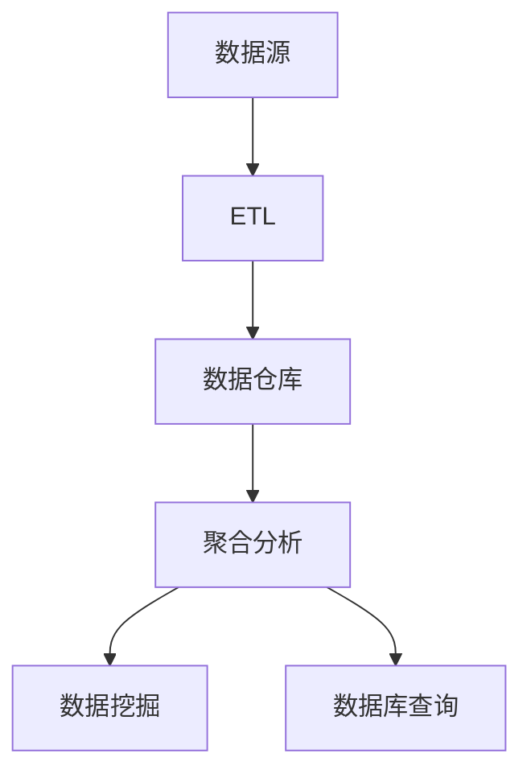

                 


# 聚合分析：原理与代码实例讲解

> 关键词：聚合分析，数据分析，数据挖掘，数据仓库，数据库，算法原理，代码实例

> 摘要：本文旨在深入讲解聚合分析的概念、原理以及具体实现。通过细致的步骤分析和代码实例展示，帮助读者理解和掌握聚合分析的核心技术和应用场景。

## 1. 背景介绍

### 1.1 目的和范围

本文主要围绕聚合分析进行讨论，旨在帮助读者了解聚合分析的基本概念、原理和应用。文章将详细介绍聚合分析的用途、优势以及与之相关的技术和工具。此外，文章将通过实际代码实例，展示如何在实际项目中应用聚合分析技术，以便读者能够更好地掌握其核心知识和实际操作。

### 1.2 预期读者

本文适合对数据分析、数据挖掘等领域有一定了解的读者，包括但不限于数据分析师、数据科学家、软件工程师和数据库管理员等。本文将尽量避免复杂的数学公式和术语，力求以简单易懂的方式阐述聚合分析的相关知识。

### 1.3 文档结构概述

本文将按照以下结构展开：

1. 背景介绍：介绍本文的目的、预期读者以及文章结构。
2. 核心概念与联系：介绍聚合分析的基本概念、相关技术和工具。
3. 核心算法原理 & 具体操作步骤：详细讲解聚合分析的核心算法原理和具体操作步骤。
4. 数学模型和公式 & 详细讲解 & 举例说明：阐述聚合分析涉及的数学模型和公式，并通过实例进行说明。
5. 项目实战：通过实际代码案例，展示聚合分析的具体实现。
6. 实际应用场景：分析聚合分析在实际项目中的应用。
7. 工具和资源推荐：推荐相关学习资源、开发工具和框架。
8. 总结：总结聚合分析的未来发展趋势与挑战。
9. 附录：常见问题与解答。
10. 扩展阅读 & 参考资料：提供进一步阅读和参考的资源。

### 1.4 术语表

#### 1.4.1 核心术语定义

- 聚合分析：一种数据分析技术，用于对大量数据进行汇总、归纳和整理，以便从中提取有价值的信息。
- 数据仓库：一个用于存储、管理和分析大量数据的系统。
- 数据挖掘：从大量数据中发现规律和模式的过程。
- 数据库：一种用于存储、管理和检索数据的系统。

#### 1.4.2 相关概念解释

- 数据清洗：在数据分析过程中，对数据进行处理和清洗，以确保数据质量。
- ETL（Extract, Transform, Load）：数据集成技术，用于从多个数据源提取数据、进行转换并加载到数据仓库中。
- 数据建模：根据业务需求，设计数据存储结构和数据处理流程。

#### 1.4.3 缩略词列表

- SQL（Structured Query Language）：一种用于数据库查询的编程语言。
- Hadoop：一个开源的分布式数据处理框架。
- Spark：一个开源的分布式数据处理引擎。
- TensorFlow：一个开源的机器学习框架。

## 2. 核心概念与联系

聚合分析是一种重要的数据分析技术，它通过对大量数据进行汇总、归纳和整理，帮助用户从海量数据中提取有价值的信息。聚合分析在数据仓库、数据挖掘和数据库领域扮演着重要角色，其核心概念和联系如下：

### 2.1 聚合分析的基本概念

- **聚合函数**：用于对一组数据进行汇总和计算的函数，如求和（SUM）、求平均（AVG）、计数（COUNT）等。
- **分组**：将数据按照某一属性进行分类，以便对每个分组进行聚合操作。
- **筛选**：对数据进行筛选，只保留满足特定条件的记录。

### 2.2 聚合分析与数据仓库的关系

- **数据仓库**：用于存储和管理大量数据的系统。聚合分析在数据仓库中发挥着重要作用，通过对历史数据进行分析，帮助用户发现数据中的规律和趋势。
- **ETL**：数据仓库的构建过程中，需要通过 ETL 技术将数据从多个数据源提取到数据仓库中，并进行清洗、转换和加载。

### 2.3 聚合分析与数据挖掘的关系

- **数据挖掘**：从大量数据中发现规律和模式的过程。聚合分析是数据挖掘过程中的重要步骤，通过对数据进行汇总和整理，为数据挖掘提供基础数据。

### 2.4 聚合分析与数据库的关系

- **数据库**：用于存储、管理和检索数据的系统。聚合分析通常通过 SQL 查询在数据库中实现，通过对数据进行分组、筛选和聚合操作，提取有价值的信息。

### 2.5 核心概念原理和架构的 Mermaid 流程图



## 3. 核心算法原理 & 具体操作步骤

聚合分析的核心算法原理在于对数据进行分组、筛选和聚合操作，以提取有价值的信息。下面将使用伪代码详细阐述聚合分析的具体操作步骤。

### 3.1 数据分组

```python
def group_data(data, group_by_attribute):
    """
    根据指定属性对数据进行分组
    :param data: 数据列表
    :param group_by_attribute: 分组属性
    :return: 分组后的数据字典，键为分组属性值，值为数据列表
    """
    grouped_data = {}
    for record in data:
        group_key = record[group_by_attribute]
        if group_key in grouped_data:
            grouped_data[group_key].append(record)
        else:
            grouped_data[group_key] = [record]
    return grouped_data
```

### 3.2 数据筛选

```python
def filter_data(grouped_data, filter_conditions):
    """
    对分组后的数据进行筛选
    :param grouped_data: 分组后的数据字典
    :param filter_conditions: 筛选条件列表
    :return: 筛选后的数据字典
    """
    filtered_data = {}
    for group_key, group_data in grouped_data.items():
        filtered_group_data = []
        for record in group_data:
            if all(condition(record) for condition in filter_conditions):
                filtered_group_data.append(record)
        if filtered_group_data:
            filtered_data[group_key] = filtered_group_data
    return filtered_data
```

### 3.3 数据聚合

```python
def aggregate_data(filtered_data, aggregation_functions):
    """
    对筛选后的数据进行聚合操作
    :param filtered_data: 筛选后的数据字典
    :param aggregation_functions: 聚合函数列表
    :return: 聚合结果字典
    """
    aggregated_results = {}
    for group_key, group_data in filtered_data.items():
        group_results = {}
        for aggregation_function in aggregation_functions:
            result = aggregation_function(group_data)
            group_results[aggregation_function.__name__] = result
        aggregated_results[group_key] = group_results
    return aggregated_results
```

### 3.4 聚合分析流程

```python
def perform_aggregate_analysis(data, group_by_attribute, filter_conditions, aggregation_functions):
    """
    执行聚合分析流程
    :param data: 数据列表
    :param group_by_attribute: 分组属性
    :param filter_conditions: 筛选条件列表
    :param aggregation_functions: 聚合函数列表
    :return: 聚合结果字典
    """
    grouped_data = group_data(data, group_by_attribute)
    filtered_data = filter_data(grouped_data, filter_conditions)
    aggregated_results = aggregate_data(filtered_data, aggregation_functions)
    return aggregated_results
```

## 4. 数学模型和公式 & 详细讲解 & 举例说明

聚合分析过程中，涉及一些常见的数学模型和公式，下面将逐一进行详细讲解，并通过实例进行说明。

### 4.1 常见数学模型

- **求和**：用于计算一组数据的总和。公式如下：
  $$ \sum_{i=1}^{n} x_i = x_1 + x_2 + x_3 + \ldots + x_n $$
- **求平均**：用于计算一组数据的平均值。公式如下：
  $$ \bar{x} = \frac{\sum_{i=1}^{n} x_i}{n} $$
- **计数**：用于计算一组数据的个数。公式如下：
  $$ n = \sum_{i=1}^{n} 1 $$

### 4.2 数学模型应用实例

假设我们有一组数据：\[1, 2, 3, 4, 5\]。现在需要计算这组数据的总和、平均数和个数。

- **求和**：
  $$ \sum_{i=1}^{5} x_i = 1 + 2 + 3 + 4 + 5 = 15 $$
- **求平均**：
  $$ \bar{x} = \frac{15}{5} = 3 $$
- **计数**：
  $$ n = \sum_{i=1}^{5} 1 = 5 $$

### 4.3 聚合函数实例

假设我们有一组数据：\[1, 2, 3, 4, 5\]，现在需要计算这组数据的总和、平均数和个数。

- **求和**：
  ```python
  def sum(data):
      return sum(data)
  ```
- **求平均**：
  ```python
  def avg(data):
      return sum(data) / len(data)
  ```
- **计数**：
  ```python
  def count(data):
      return len(data)
  ```

## 5. 项目实战：代码实际案例和详细解释说明

在本节中，我们将通过一个实际案例，详细讲解如何使用聚合分析技术处理实际数据，并展示具体的代码实现。

### 5.1 开发环境搭建

在本案例中，我们将使用 Python 作为编程语言，并依赖以下库：

- Pandas：用于数据处理和分析。
- NumPy：用于数值计算。
- Matplotlib：用于数据可视化。

确保已安装这些库，可以使用以下命令进行安装：

```shell
pip install pandas numpy matplotlib
```

### 5.2 源代码详细实现和代码解读

以下是一个聚合分析的实际案例，包括数据读取、数据预处理、聚合分析和数据可视化等步骤。

```python
import pandas as pd
import numpy as np
import matplotlib.pyplot as plt

# 5.2.1 数据读取
data_path = 'data.csv'
data = pd.read_csv(data_path)

# 5.2.2 数据预处理
# 数据清洗和转换
data['date'] = pd.to_datetime(data['date'])
data['month'] = data['date'].dt.month
data['sales'] = data['sales'].astype(float)

# 5.2.3 聚合分析
# 按月份分组，计算销售额总和和平均销售额
grouped_data = data.groupby('month').agg({'sales': ['sum', 'mean']})

# 5.2.4 数据可视化
# 绘制销售额趋势图
plt.figure(figsize=(10, 6))
plt.plot(grouped_data.index, grouped_data['sales']['sum'], label='Total Sales')
plt.plot(grouped_data.index, grouped_data['sales']['mean'], label='Average Sales')
plt.xlabel('Month')
plt.ylabel('Sales')
plt.title('Sales Trend by Month')
plt.legend()
plt.show()
```

### 5.3 代码解读与分析

- **数据读取**：使用 Pandas 库读取 CSV 文件，将其转换为 DataFrame 对象。
- **数据预处理**：对数据进行清洗和转换，如日期格式化、数值类型转换等。
- **聚合分析**：使用 DataFrame 的 `groupby()` 方法按月份分组，计算销售额总和和平均销售额。
- **数据可视化**：使用 Matplotlib 绘制销售额趋势图，帮助用户更直观地了解数据。

## 6. 实际应用场景

聚合分析在多个领域和场景中具有广泛的应用，以下是一些典型的应用场景：

- **电商行业**：用于分析销售数据，如按地区、按产品类别、按时间段等，帮助商家制定营销策略和库存管理。
- **金融行业**：用于分析客户交易数据，如交易金额、交易频率等，帮助银行和金融机构进行风险控制和业务优化。
- **医疗行业**：用于分析患者数据，如住院率、手术量等，帮助医院和医疗机构进行资源分配和疾病预防。
- **社交媒体**：用于分析用户行为数据，如关注数、点赞数、评论数等，帮助平台了解用户偏好和兴趣爱好。

## 7. 工具和资源推荐

### 7.1 学习资源推荐

#### 7.1.1 书籍推荐

- 《数据分析实战》
- 《数据挖掘：实用技术指南》
- 《大数据分析：基础与实战》

#### 7.1.2 在线课程

- Coursera 上的《数据分析入门》
- edX 上的《大数据分析》
- Udacity 上的《数据科学家职业路径》

#### 7.1.3 技术博客和网站

- KDNuggets：专注于数据挖掘和机器学习的博客
- Dataquest：提供数据分析、数据科学等在线课程
- Real Python：Python 编程技术的博客

### 7.2 开发工具框架推荐

#### 7.2.1 IDE和编辑器

- PyCharm
- Jupyter Notebook
- Visual Studio Code

#### 7.2.2 调试和性能分析工具

- Python Debugger
- Py-Spy
- Perf
- Gprof

#### 7.2.3 相关框架和库

- Pandas：用于数据处理和分析
- NumPy：用于数值计算
- Matplotlib：用于数据可视化
- Scikit-learn：用于数据挖掘和机器学习

### 7.3 相关论文著作推荐

#### 7.3.1 经典论文

- 《数据挖掘：实用技术指南》
- 《机器学习：一种算法视角》
- 《深度学习》

#### 7.3.2 最新研究成果

- 《大规模分布式数据处理》
- 《联邦学习：隐私保护下的协同学习》
- 《图神经网络：原理与应用》

#### 7.3.3 应用案例分析

- 《电商行业数据挖掘案例分析》
- 《医疗行业大数据分析》
- 《社交媒体数据挖掘与用户行为分析》

## 8. 总结：未来发展趋势与挑战

聚合分析作为一种重要的数据分析技术，在未来将继续发挥重要作用。随着数据规模的不断扩大和计算能力的提升，聚合分析将在以下几个方面面临挑战和机遇：

- **性能优化**：在处理大规模数据时，如何提高聚合分析的执行效率和性能，成为亟待解决的问题。
- **实时分析**：随着实时数据需求的增加，如何实现实时聚合分析，确保分析结果的实时性和准确性。
- **跨域融合**：如何将不同领域的聚合分析技术进行融合，为多领域应用提供支持。
- **隐私保护**：在处理敏感数据时，如何确保聚合分析过程中的隐私保护，防止数据泄露。

## 9. 附录：常见问题与解答

### 9.1 聚合分析与数据挖掘的区别是什么？

聚合分析是数据挖掘过程中的一个重要步骤，用于对大量数据进行汇总、归纳和整理，以便从中提取有价值的信息。而数据挖掘是指从大量数据中发现规律和模式的过程。聚合分析是数据挖掘的一部分，旨在为数据挖掘提供基础数据。

### 9.2 如何优化聚合分析的性能？

优化聚合分析性能的方法包括：

- 使用并行计算和分布式处理框架，如 Hadoop 和 Spark，以提高处理速度。
- 优化数据存储结构和查询语句，减少数据的读写次数。
- 避免使用复杂的聚合函数，尽量使用简单的函数。
- 在数据预处理阶段对数据进行清洗和转换，减少聚合分析的数据量。

### 9.3 聚合分析在哪些领域有广泛应用？

聚合分析在多个领域有广泛应用，包括电商、金融、医疗、社交媒体等。例如：

- 在电商领域，聚合分析可用于分析销售数据，了解产品销售情况、用户购买行为等。
- 在金融领域，聚合分析可用于分析交易数据，识别风险、优化业务流程等。
- 在医疗领域，聚合分析可用于分析患者数据，了解疾病分布、诊断效果等。
- 在社交媒体领域，聚合分析可用于分析用户行为数据，了解用户偏好、兴趣爱好等。

## 10. 扩展阅读 & 参考资料

- 《大数据技术导论》
- 《数据挖掘：实用技术指南》
- 《机器学习实战》
- 《深度学习》
- 《数据仓库技术与实践》
- 《Hadoop技术内幕》

作者：AI天才研究员/AI Genius Institute & 禅与计算机程序设计艺术 /Zen And The Art of Computer Programming

