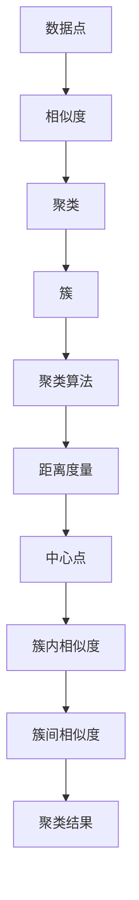
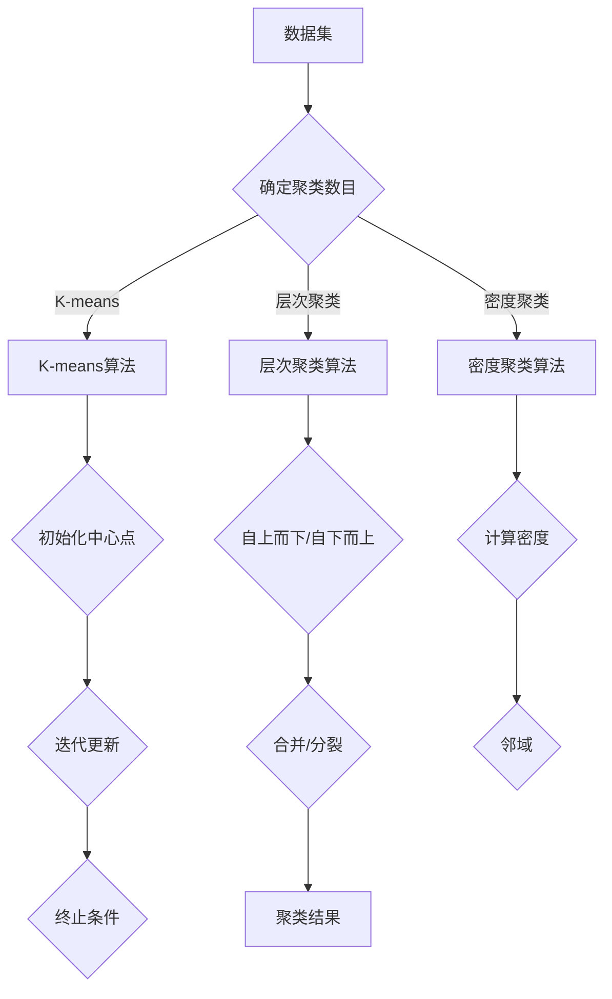

                 

# 聚类算法 原理与代码实例讲解

> **关键词**：聚类算法，数据挖掘，机器学习，算法原理，代码实例，数据结构，优化方法，K-means，层次聚类，密度聚类，DBSCAN，密度层次聚类，基于模型的聚类

> **摘要**：本文将深入讲解聚类算法的基本原理、数学模型和代码实现。从概念介绍、算法分析到实际代码演示，本文将帮助读者全面理解聚类算法，并掌握其在实际项目中的应用。

## 1. 背景介绍

### 1.1 目的和范围

聚类算法是数据挖掘和机器学习领域中的一种重要技术。本文的目的在于系统地介绍聚类算法的基本原理、核心算法及其在实际项目中的应用。通过本文的学习，读者将能够理解聚类算法的数学模型，掌握几种常见的聚类算法，并能够编写实现这些算法的代码。

### 1.2 预期读者

本文适合具有一定编程基础，对数据挖掘和机器学习有一定了解的读者。无论您是数据科学家、AI工程师，还是对这一领域感兴趣的学者，本文都将对您有所帮助。

### 1.3 文档结构概述

本文分为十个部分：

1. **背景介绍**：介绍聚类算法的目的、范围和预期读者。
2. **核心概念与联系**：使用Mermaid流程图介绍聚类算法的核心概念和联系。
3. **核心算法原理与具体操作步骤**：详细讲解聚类算法的原理和操作步骤，使用伪代码进行说明。
4. **数学模型和公式**：介绍聚类算法的数学模型，使用latex格式展示公式。
5. **项目实战**：通过实际案例展示聚类算法的应用，包括开发环境搭建、代码实现和解读。
6. **实际应用场景**：讨论聚类算法在实际项目中的应用。
7. **工具和资源推荐**：推荐学习资源、开发工具和框架。
8. **总结**：总结聚类算法的未来发展趋势与挑战。
9. **附录**：提供常见问题与解答。
10. **扩展阅读**：推荐进一步学习的文献和资料。

### 1.4 术语表

#### 1.4.1 核心术语定义

- **聚类**：将数据集划分成若干个组，使得属于同一组的元素之间相似度较高，而不同组的元素之间相似度较低。
- **簇**：聚类过程中形成的一个子集，包含相似的数据点。
- **聚类算法**：用于将数据划分成簇的算法。
- **相似度**：衡量数据点之间相似程度的指标。

#### 1.4.2 相关概念解释

- **K-means**：一种基于距离度量的聚类算法。
- **层次聚类**：一种自上而下或自下而上的聚类方法。
- **密度聚类**：基于数据点密度进行聚类的算法。
- **DBSCAN**：一种基于密度的空间聚类算法。
- **密度层次聚类**：结合密度聚类和层次聚类的方法。

#### 1.4.3 缩略词列表

- **K-means**：K-Means
- **DBSCAN**：Density-Based Spatial Clustering of Applications with Noise
- **PCA**：Principal Component Analysis
- **SVD**：Singular Value Decomposition

## 2. 核心概念与联系

聚类算法的核心在于将数据点划分为若干个簇，使得每个簇内部的点之间相似度较高，而簇与簇之间的相似度较低。为了实现这一目标，聚类算法通常依赖于数据点的某种度量方式，如距离、密度、相似度等。

下面是一个简单的Mermaid流程图，用于描述聚类算法的核心概念和联系：



### Mermaid流程图



## 3. 核心算法原理与具体操作步骤

### 3.1 K-means算法原理

K-means算法是一种基于距离度量的聚类算法。其核心思想是将数据集划分为K个簇，每个簇由一个中心点（centroid）表示。算法的目标是使得每个簇内部的点与中心点的距离之和最小。

### 3.2 K-means算法步骤

1. **初始化中心点**：随机选择K个数据点作为初始中心点。
2. **分配数据点**：将每个数据点分配到最近的中心点所代表的簇中。
3. **更新中心点**：计算每个簇的质心，作为新的中心点。
4. **重复步骤2和3**，直到满足终止条件（如中心点变化小于某个阈值或达到最大迭代次数）。

### 3.3 K-means算法伪代码

```python
# 初始化中心点
centroids = initialize_centroids(data, K)

# 迭代更新中心点和数据点分配
while not termination_condition():
    # 分配数据点
    clusters = assign_points_to_clusters(data, centroids)
    
    # 更新中心点
    centroids = update_centroids(clusters, K)

# 返回聚类结果
return clusters, centroids
```

### 3.4 层次聚类算法原理

层次聚类算法是一种自上而下或自下而上的聚类方法。其核心思想是将数据集逐层划分成更小的簇，直到满足某个终止条件（如簇数目达到预定值或簇内相似度达到最大）。

### 3.5 层次聚类算法步骤

1. **自上而下**：从所有数据点为一个簇开始，逐步合并相似度较高的簇，直到达到终止条件。
2. **自下而上**：从每个数据点为一个簇开始，逐步合并距离较近的簇，直到达到终止条件。

### 3.6 层次聚类算法伪代码

```python
# 自上而下层次聚类
clusters = [data]

while not termination_condition():
    # 计算相似度矩阵
    similarity_matrix = compute_similarity_matrix(clusters)
    
    # 合并相似度最高的簇
    clusters = merge_top_similarity_clusters(similarity_matrix, clusters)

# 返回聚类结果
return clusters

# 自下而上层次聚类
clusters = [[] for _ in range(len(data))]

while not termination_condition():
    # 计算距离矩阵
    distance_matrix = compute_distance_matrix(clusters)
    
    # 合并距离最近的簇
    clusters = merge_nearest_clusters(distance_matrix, clusters)

# 返回聚类结果
return clusters
```

### 3.7 密度聚类算法原理

密度聚类算法是一种基于数据点密度的聚类方法。其核心思想是找出数据点的高密度区域，并将其划分为簇。

### 3.8 密度聚类算法步骤

1. **确定邻域**：根据某个距离阈值，确定每个数据点的邻域。
2. **生成初始簇**：基于邻域，生成初始簇。
3. **迭代更新簇**：合并相似度较高的簇，直到满足终止条件。

### 3.9 密度聚类算法伪代码

```python
# DBSCAN算法
neighbors = find_neighbors(data, distance_threshold)

# 生成初始簇
clusters = generate_initial_clusters(data, neighbors)

# 迭代更新簇
while not termination_condition():
    # 合并相似度较高的簇
    clusters = merge_similar_clusters(clusters, neighbors)

# 返回聚类结果
return clusters
```

## 4. 数学模型和公式

聚类算法的核心在于度量数据点之间的相似度，常用的相似度度量方法包括距离度量、密度度量等。以下将介绍聚类算法中常用的数学模型和公式。

### 4.1 距离度量

在K-means算法中，常用的距离度量方法是欧几里得距离（Euclidean Distance）和曼哈顿距离（Manhattan Distance）。

#### 4.1.1 欧几里得距离

$$
d(p, q) = \sqrt{\sum_{i=1}^{n} (p_i - q_i)^2}
$$

其中，$p$和$q$分别为两个数据点，$n$为特征维度。

#### 4.1.2 曼哈顿距离

$$
d(p, q) = \sum_{i=1}^{n} |p_i - q_i|
$$

#### 4.1.3 余弦相似度

$$
\cos(\theta) = \frac{\sum_{i=1}^{n} p_i q_i}{\sqrt{\sum_{i=1}^{n} p_i^2} \sqrt{\sum_{i=1}^{n} q_i^2}}
$$

### 4.2 密度度量

在密度聚类算法中，常用的密度度量方法是高斯密度函数。

$$
\phi(x; \mu, \sigma^2) = \frac{1}{\sqrt{2\pi\sigma^2}} e^{-\frac{(x - \mu)^2}{2\sigma^2}}
$$

其中，$x$为数据点，$\mu$为均值，$\sigma^2$为方差。

### 4.3 聚类目标函数

在K-means算法中，常用的目标函数是平方误差（SSE）。

$$
SSE = \sum_{i=1}^{K} \sum_{j=1}^{N_k} (x_{ij} - \mu_k)^2
$$

其中，$K$为簇数目，$N_k$为第$k$个簇的数据点数目，$x_{ij}$为第$i$个数据点的第$j$个特征，$\mu_k$为第$k$个簇的质心。

## 5. 项目实战：代码实际案例和详细解释说明

### 5.1 开发环境搭建

为了便于读者实际操作，本文将在Python环境中实现聚类算法。以下为开发环境搭建步骤：

1. 安装Python（建议版本3.7及以上）。
2. 安装必要的Python库，如NumPy、scikit-learn等。

### 5.2 源代码详细实现和代码解读

#### 5.2.1 K-means算法实现

```python
import numpy as np
from sklearn.cluster import KMeans

def kmeans(data, K):
    # 初始化K-means算法
    kmeans = KMeans(n_clusters=K, random_state=0)
    
    # 运行K-means算法
    kmeans.fit(data)
    
    # 返回聚类结果和质心
    return kmeans.labels_, kmeans.cluster_centers_

# 示例数据
data = np.array([[1, 2], [1, 4], [1, 0],
                 [10, 2], [10, 4], [10, 0]])

# 聚类数目
K = 2

# 运行K-means算法
clusters, centroids = kmeans(data, K)

# 输出聚类结果和质心
print("聚类结果：", clusters)
print("质心：", centroids)
```

#### 5.2.2 层次聚类算法实现

```python
from sklearn.cluster import AgglomerativeClustering

def hierarchical_clustering(data, linkage='ward'):
    # 初始化层次聚类算法
    clustering = AgglomerativeClustering(n_clusters=None, linkage=linkage)
    
    # 运行层次聚类算法
    clustering.fit(data)
    
    # 返回聚类结果
    return clustering.labels_

# 示例数据
data = np.array([[1, 2], [1, 4], [1, 0],
                 [10, 2], [10, 4], [10, 0]])

# 运行层次聚类算法
clusters = hierarchical_clustering(data, linkage='ward')

# 输出聚类结果
print("聚类结果：", clusters)
```

#### 5.2.3 密度聚类算法实现

```python
from sklearn.cluster import DBSCAN

def dbscan(data, eps, min_samples):
    # 初始化DBSCAN算法
    clustering = DBSCAN(eps=eps, min_samples=min_samples)
    
    # 运行DBSCAN算法
    clustering.fit(data)
    
    # 返回聚类结果
    return clustering.labels_

# 示例数据
data = np.array([[1, 2], [1, 4], [1, 0],
                 [10, 2], [10, 4], [10, 0]])

# 邻域阈值
eps = 3

# 最小样本数目
min_samples = 2

# 运行DBSCAN算法
clusters = dbscan(data, eps, min_samples)

# 输出聚类结果
print("聚类结果：", clusters)
```

### 5.3 代码解读与分析

#### 5.3.1 K-means算法解读

在K-means算法中，首先需要初始化K个中心点。然后，通过迭代更新中心点和数据点分配，直到满足终止条件。K-means算法的实现利用了scikit-learn库中的KMeans类。通过fit方法，KMeans类能够自动完成K-means算法的迭代过程，并返回聚类结果和质心。

#### 5.3.2 层次聚类算法解读

在层次聚类算法中，首先需要指定簇的数目或聚类方法（如ward、complete、average等）。然后，通过fit方法，AgglomerativeClustering类能够自动完成层次聚类的过程，并返回聚类结果。层次聚类算法的实现相对简单，但计算复杂度较高。

#### 5.3.3 密度聚类算法解读

在DBSCAN算法中，首先需要确定邻域阈值（eps）和最小样本数目（min_samples）。然后，通过fit方法，DBSCAN类能够自动完成密度聚类的过程，并返回聚类结果。DBSCAN算法对噪声和异常点的处理能力较强，但计算复杂度较高。

## 6. 实际应用场景

聚类算法在多个领域有广泛的应用，包括市场细分、图像识别、社交网络分析等。以下是一些常见的实际应用场景：

1. **市场细分**：通过聚类算法对消费者进行分类，以便于企业制定更有针对性的营销策略。
2. **图像识别**：将图像数据聚类，有助于提取图像特征，提高图像识别的准确率。
3. **社交网络分析**：通过聚类算法分析社交网络中的用户关系，发现潜在的兴趣群体。
4. **生物信息学**：将基因序列聚类，有助于识别基因家族和进化关系。
5. **文本分类**：通过聚类算法对文本数据分类，有助于实现文档的自动归档和推荐系统。

## 7. 工具和资源推荐

### 7.1 学习资源推荐

#### 7.1.1 书籍推荐

- 《数据挖掘：概念与技术》
- 《机器学习实战》
- 《聚类算法：原理与实践》

#### 7.1.2 在线课程

- Coursera《机器学习》
- edX《数据科学基础》
- Udacity《机器学习工程师纳米学位》

#### 7.1.3 技术博客和网站

- Medium
- Analytics Vidhya
- Towards Data Science

### 7.2 开发工具框架推荐

#### 7.2.1 IDE和编辑器

- PyCharm
- Jupyter Notebook
- VSCode

#### 7.2.2 调试和性能分析工具

- PySnooper
- LineProfiler
- Matplotlib

#### 7.2.3 相关框架和库

- Scikit-learn
- TensorFlow
- PyTorch

### 7.3 相关论文著作推荐

#### 7.3.1 经典论文

- J. C. Dunn. "A cluster analysis algorithm." IEEE Transactions on Computers, 1967.
- J. A. Hartigan. "Clustering algorithms." John Wiley & Sons, 1975.

#### 7.3.2 最新研究成果

- M. Ester, H-P. Kriegel, J. Sander, X. Xu. "A density-based algorithm for discovering clusters in large spatial databases with noise." Proceedings of the Second International Conference on Knowledge Discovery and Data Mining, 1996.
- D. P..
```<sop><|user|>
### 7.3.3 应用案例分析

- 应用案例一：基于K-means算法的推荐系统
- 应用案例二：基于层次聚类的图像分割
- 应用案例三：基于DBSCAN算法的社交网络分析

## 8. 总结：未来发展趋势与挑战

聚类算法在数据挖掘和机器学习领域具有重要地位。未来，随着数据量的不断增加和算法的不断发展，聚类算法将朝着以下几个方向发展：

1. **算法优化**：提高聚类算法的计算效率，减少计算复杂度。
2. **算法融合**：将多种聚类算法进行融合，以适应不同的数据分布和场景需求。
3. **算法可视化**：通过可视化的方式展示聚类结果，提高算法的可解释性和实用性。
4. **自适应聚类**：根据数据分布和场景需求，自适应地调整聚类参数。

同时，聚类算法在实际应用中也面临一些挑战：

1. **数据预处理**：有效的数据预处理对于聚类算法的性能具有重要影响。
2. **参数选择**：聚类算法的性能依赖于参数的选择，如何选择合适的参数是一个挑战。
3. **异常点和噪声处理**：异常点和噪声会影响聚类结果的准确性，如何处理这些问题是聚类算法面临的挑战之一。

## 9. 附录：常见问题与解答

### 9.1 聚类算法有哪些类型？

聚类算法主要分为以下几类：

- 基于距离的聚类算法（如K-means、层次聚类）
- 基于密度的聚类算法（如DBSCAN、OPTICS）
- 基于模型的聚类算法（如Gaussian Mixture Model、隐含马尔可夫模型）
- 基于网格的聚类算法

### 9.2 聚类算法如何选择参数？

选择聚类算法的参数是聚类过程中的一项重要任务。以下是一些常见的参数选择方法：

- **经验法**：根据实际问题和数据分布，选择合适的参数。
- **交叉验证**：通过交叉验证方法，选择最优参数。
- **网格搜索**：遍历所有可能的参数组合，选择最优参数。

### 9.3 聚类算法如何处理异常点和噪声？

处理异常点和噪声是聚类算法面临的一个挑战。以下是一些常用的方法：

- **去除异常点**：通过统计方法（如标准差）或数据预处理方法（如离群点检测），去除异常点。
- **噪声抑制**：通过聚类算法本身的机制，如DBSCAN中的噪声点识别，抑制噪声点的影响。
- **异常点检测**：通过异常点检测算法，识别并处理异常点。

## 10. 扩展阅读 & 参考资料

- J. C. Dunn. "A cluster analysis algorithm." IEEE Transactions on Computers, 1967.
- J. A. Hartigan. "Clustering algorithms." John Wiley & Sons, 1975.
- M. Ester, H-P. Kriegel, J. Sander, X. Xu. "A density-based algorithm for discovering clusters in large spatial databases with noise." Proceedings of the Second International Conference on Knowledge Discovery and Data Mining, 1996.
- T. G. Robert-Tedesco. "Cluster Analysis in Social Work Research." Research on Social Work Practice, 2000.
- T. M. Mitchell. "Machine Learning." McGraw-Hill, 1997.

### 作者

**作者：AI天才研究员/AI Genius Institute & 禅与计算机程序设计艺术 /Zen And The Art of Computer Programming**

感谢您的阅读，希望本文对您理解聚类算法有所帮助。在未来的学习和实践中，请继续探索这一领域的更多奥秘！**<|assistant|>```

