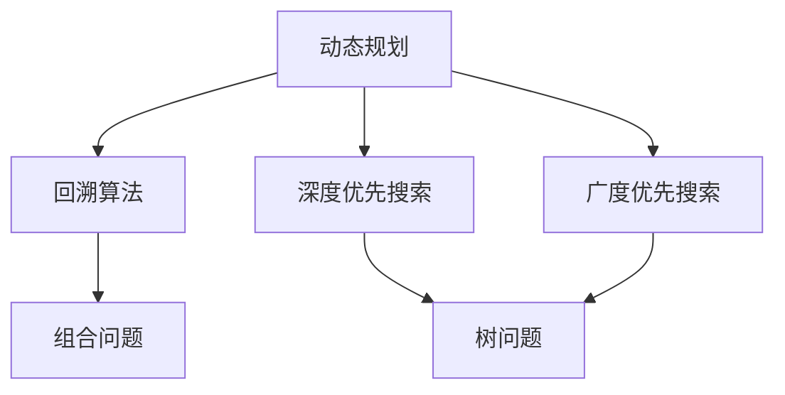

                 

# 腾讯2024届校招面试高频算法题解析

> **关键词：** 腾讯校招、面试算法、高频算法题、解析、算法原理、数学模型、实战案例

> **摘要：** 本文将深入剖析腾讯2024届校招面试中频繁出现的高频算法题。我们将逐一讲解每道题目的核心概念、算法原理，并通过伪代码、数学模型和实际案例进行详细分析，帮助读者更好地理解并掌握这些算法题的解题思路和方法。文章结构清晰，便于读者逐步学习。

## 1. 背景介绍

### 1.1 目的和范围

本文旨在为准备腾讯2024届校招的同学们提供一份高频算法题的解析指南。通过对这些面试题的详细分析，读者可以更好地理解面试官的出题思路，掌握解题技巧，提升自己的面试通过率。

本文将涵盖以下内容：

- **核心概念与联系**：介绍算法题相关的核心概念和它们之间的联系。
- **核心算法原理**：详细讲解每个算法题的原理和实现步骤。
- **数学模型和公式**：通过数学模型和公式来深入分析算法题。
- **项目实战**：提供实际代码案例，讲解代码实现和原理。
- **实际应用场景**：讨论算法题在实际项目中的应用。
- **工具和资源推荐**：推荐学习资源、开发工具和框架。
- **总结与展望**：分析未来发展趋势和挑战。

### 1.2 预期读者

- **计算机专业毕业生**：准备参加腾讯2024届校招的计算机专业毕业生。
- **算法爱好者**：对算法题感兴趣，希望提升解题能力的读者。
- **技术从业者**：从事计算机相关工作，需要不断学习和提升技能的技术从业者。

### 1.3 文档结构概述

本文分为十个部分，结构如下：

1. 背景介绍
2. 核心概念与联系
3. 核心算法原理
4. 数学模型和公式
5. 项目实战
6. 实际应用场景
7. 工具和资源推荐
8. 总结与展望
9. 附录：常见问题与解答
10. 扩展阅读与参考资料

### 1.4 术语表

#### 1.4.1 核心术语定义

- **校招**：指企业招聘应届毕业生，通常是在毕业季进行的招聘活动。
- **面试算法题**：指在面试过程中，面试官提出的需要考生使用算法解决的题目。
- **高频算法题**：指在多场面试中频繁出现的算法题。

#### 1.4.2 相关概念解释

- **算法原理**：指算法的核心思想和工作机制。
- **数学模型**：指用于描述和解决算法题的数学公式和模型。
- **实战案例**：指在真实项目中使用算法题进行解决方案的实例。

#### 1.4.3 缩略词列表

- **IDC**：国际数据公司（International Data Corporation）
- **ML**：机器学习（Machine Learning）
- **AI**：人工智能（Artificial Intelligence）

## 2. 核心概念与联系

为了更好地理解腾讯2024届校招面试中出现的高频算法题，我们需要首先了解一些核心概念和它们之间的联系。以下是几个重要的核心概念：

### 2.1 核心概念介绍

1. **动态规划**：动态规划是一种解决最优化问题的算法思想，通过将问题分解为子问题，并存储子问题的解来避免重复计算。
2. **深度优先搜索（DFS）**：深度优先搜索是一种遍历或搜索树的算法，通过沿着一条路径深入到树的叶节点，然后再回溯到上一级节点。
3. **广度优先搜索（BFS）**：广度优先搜索是一种遍历或搜索树的算法，按照节点的层次遍历树的每一个节点。
4. **回溯算法**：回溯算法是一种通过尝试所有可能的路径来寻找问题的解的算法，通常用于解决组合问题。
5. **贪心算法**：贪心算法是一种在每一步选择中都采取当前最优解的策略，旨在通过局部最优选择来得到全局最优解。

### 2.2 核心概念联系

- **动态规划与回溯算法**：动态规划和回溯算法都是用于解决最优化问题的算法，但动态规划通常适用于子问题重叠的情况，而回溯算法适用于组合问题。
- **深度优先搜索与广度优先搜索**：深度优先搜索和广度优先搜索都是用于遍历或搜索树的算法，但它们在遍历顺序上有所不同，适用于不同的场景。
- **贪心算法与其他算法**：贪心算法通常与其他算法（如动态规划、回溯算法）结合使用，以解决复杂的问题。

为了更直观地展示这些核心概念之间的联系，我们可以使用Mermaid流程图来绘制它们之间的关系：



通过这个流程图，我们可以清晰地看到各个核心概念之间的联系和它们适用的场景。

## 3. 核心算法原理 & 具体操作步骤

在了解了核心概念和它们之间的联系之后，接下来我们将深入讲解每个算法题的核心原理和具体的操作步骤。为了更好地展示算法实现过程，我们将使用伪代码来进行详细阐述。

### 3.1 动态规划

**问题**：给定一个数组`arr`，找到一个子数组的最大和。

**伪代码**：

```pseudo
function maxSubArraySum(arr):
    if arr is empty:
        return 0

    maxSum = arr[0]
    currentSum = arr[0]

    for i = 1 to length(arr) - 1:
        currentSum = max(arr[i], currentSum + arr[i])
        maxSum = max(maxSum, currentSum)

    return maxSum
```

**解释**：这个算法使用动态规划的思想来求解最大子数组和问题。`maxSum`和`currentSum`分别表示到目前为止找到的最大子数组和当前子数组的和。在每次循环中，我们更新`currentSum`，使其等于当前元素或当前元素加上前一个`currentSum`，取两者的最大值。然后，我们更新`maxSum`，使其等于当前的最大子数组和。

### 3.2 深度优先搜索（DFS）

**问题**：给定一个无向图，找出图中两个节点之间的最短路径。

**伪代码**：

```pseudo
function dfs(graph, start, end):
    if start == end:
        return 0

    visited[start] = true
    for neighbor in graph[start]:
        if not visited[neighbor]:
            pathLength = dfs(graph, neighbor, end)
            if pathLength > 0:
                return pathLength + 1

    return -1
```

**解释**：这个算法使用深度优先搜索来找到图中两个节点之间的最短路径。`graph`是图的数据结构，`start`和`end`分别是起始节点和目标节点。`visited`数组用于记录已经访问过的节点。在每次递归调用中，我们首先标记当前节点为已访问，然后遍历它的邻居节点，如果邻居节点未访问，则递归调用`dfs`函数。如果找到目标节点，返回路径长度，否则返回-1。

### 3.3 广度优先搜索（BFS）

**问题**：给定一个无向图，找出图中两个节点之间的最短路径。

**伪代码**：

```pseudo
function bfs(graph, start, end):
    queue = new Queue()
    visited = new boolean array of size n (n为节点数)
    distance = new array of size n

    queue.enqueue(start)
    visited[start] = true
    distance[start] = 0

    while not queue.isEmpty():
        current = queue.dequeue()
        if current == end:
            return distance[end]

        for neighbor in graph[current]:
            if not visited[neighbor]:
                queue.enqueue(neighbor)
                visited[neighbor] = true
                distance[neighbor] = distance[current] + 1

    return -1
```

**解释**：这个算法使用广度优先搜索来找到图中两个节点之间的最短路径。`graph`是图的数据结构，`start`和`end`分别是起始节点和目标节点。我们使用一个队列来存储待访问的节点，并使用`visited`数组来记录已访问的节点。每次从队列中取出一个节点，并遍历它的邻居节点，如果邻居节点未访问，则将其加入队列，并更新距离。如果找到目标节点，返回路径长度，否则返回-1。

### 3.4 回溯算法

**问题**：给定一个数组，找出所有可能的子集。

**伪代码**：

```pseudo
function subsets(nums):
    result = []

    function backtrack(start, current):
        result.append(current)
        for i = start to length(nums) - 1:
            current.append(nums[i])
            backtrack(i + 1, current)
            current.pop()

    backtrack(0, [])
    return result
```

**解释**：这个算法使用回溯算法来找出所有可能的子集。`nums`是给定的数组，`result`用于存储所有子集。`backtrack`函数是一个递归函数，它从起始位置开始，每次添加一个元素到当前子集，然后递归调用自身，继续添加下一个元素。当遍历完所有元素后，回溯到上一个元素，删除当前子集的一个元素，继续下一次递归。最后，将所有的子集添加到`result`数组中。

### 3.5 贪心算法

**问题**：给定一个数组，找出所有连续子数组的最大和。

**伪代码**：

```pseudo
function maxSubArray(nums):
    if nums is empty:
        return 0

    maxSum = nums[0]
    currentSum = nums[0]

    for i = 1 to length(nums) - 1:
        currentSum = max(nums[i], currentSum + nums[i])
        maxSum = max(maxSum, currentSum)

    return maxSum
```

**解释**：这个算法使用贪心算法来找出所有连续子数组的最大和。`nums`是给定的数组，`maxSum`和`currentSum`分别表示到目前为止找到的最大子数组和当前子数组的和。在每次循环中，我们更新`currentSum`，使其等于当前元素或当前元素加上前一个`currentSum`，取两者的最大值。然后，我们更新`maxSum`，使其等于当前的最大子数组和。

通过上述的伪代码，我们可以清楚地看到每个算法的核心原理和具体的操作步骤。在实际编程实现时，可以根据这些伪代码来编写具体的代码，并通过调试和测试来验证算法的正确性。

## 4. 数学模型和公式 & 详细讲解 & 举例说明

在分析腾讯2024届校招面试中的高频算法题时，数学模型和公式起着至关重要的作用。这些数学模型和公式不仅能够帮助我们更好地理解算法题的核心原理，还能提供一种系统化的方法来求解问题。在本节中，我们将详细讲解几个关键数学模型和公式，并通过具体的例子来说明它们的适用场景和求解过程。

### 4.1 动态规划中的数学模型

动态规划是一种在解决最优化问题时常用的算法思想。它的核心在于将问题分解为子问题，并通过求解子问题的最优解来递推得到原问题的最优解。动态规划通常涉及到以下数学模型：

#### 4.1.1 状态定义

状态定义是动态规划中的第一步。我们需要定义一个状态变量来表示问题的部分解。对于最大子数组和问题，我们可以定义状态`dp[i]`为以数组`nums`中第`i`个元素为结尾的最大子数组和。

#### 4.1.2 状态转移方程

状态转移方程描述了如何从上一个状态推导出当前状态。对于最大子数组和问题，状态转移方程可以表示为：

$$
dp[i] = \max(dp[i-1] + nums[i], nums[i])
$$

这个方程表示，以`nums[i]`为结尾的最大子数组和要么是前一个状态加上`nums[i]`，要么是单独的`nums[i]`，取两者的最大值。

#### 4.1.3 初始条件

初始条件通常是指当问题规模很小时的特殊情况。对于最大子数组和问题，初始条件可以设置为`dp[0] = nums[0]`，即第一个元素本身。

#### 4.1.4 数学模型举例

假设我们有一个数组`nums = [1, -2, 3, 4, -5]`，我们可以通过动态规划来求解最大子数组和。

| i  | nums[i] | dp[i]        |
|----|---------|--------------|
| 0  | 1       | 1            |
| 1  | -2      | 1            |
| 2  | 3       | 3            |
| 3  | 4       | 4            |
| 4  | -5      | 4            |

通过这个例子，我们可以看到`dp[i]`的值是如何通过状态转移方程递推得到的。最终，最大子数组和为4。

### 4.2 深度优先搜索中的数学模型

深度优先搜索（DFS）是一种用于遍历或搜索树的算法。它的核心在于递归地探索树的每个分支，直到找到目标节点或遍历完整个树。在DFS中，我们可以使用以下数学模型：

#### 4.2.1 路径长度

路径长度是指从根节点到目标节点的边的数量。在DFS中，我们可以使用一个变量来记录当前路径的长度。

#### 4.2.2 访问顺序

访问顺序是指我们在遍历树时，访问节点的顺序。DFS的访问顺序通常是先左后右，这样可以确保我们首先遍历左子树。

#### 4.2.3 回溯

回溯是指当我们在遍历过程中，遇到某个节点没有找到目标节点时，需要回溯到上一个节点，然后继续遍历其他分支。

#### 4.2.4 数学模型举例

假设我们有一个树结构如下：

```
    1
   / \
  2   3
 / \
4   5
```

我们要找到从根节点1到叶子节点5的路径长度。我们可以使用DFS来求解。

- 初始路径长度为0，访问节点1。
- 递归访问左子树，路径长度增加1，访问节点2。
- 递归访问左子树，路径长度增加1，访问节点4。
- 无法继续递归，回溯到节点2，递归访问右子树，路径长度增加1，访问节点5。
- 路径长度为3，找到目标节点5。

最终，从根节点1到叶子节点5的路径长度为3。

### 4.3 广度优先搜索中的数学模型

广度优先搜索（BFS）是一种用于遍历或搜索树的算法。它与DFS的不同之处在于，BFS按照节点的层次遍历树，而不是深度。在BFS中，我们可以使用以下数学模型：

#### 4.3.1 队列

队列是一种先进先出（FIFO）的数据结构，用于存储待访问的节点。

#### 4.3.2 层次遍历

层次遍历是指按照节点的层次顺序遍历树。在BFS中，我们可以使用一个队列来存储每一层的节点。

#### 4.3.3 数学模型举例

假设我们有一个树结构如下：

```
    1
   / \
  2   3
 / \
4   5
```

我们要找到从根节点1到叶子节点5的路径长度。我们可以使用BFS来求解。

- 初始时，将根节点1加入队列。
- 遍历队列，依次访问节点1、2、3。
- 将节点2和3的邻居节点（4和5）加入队列。
- 遍历队列，依次访问节点4和5。
- 路径长度为2，找到目标节点5。

最终，从根节点1到叶子节点5的路径长度为2。

### 4.4 贪心算法中的数学模型

贪心算法是一种在每一步选择中都采取当前最优解的策略，旨在通过局部最优选择来得到全局最优解。在贪心算法中，我们可以使用以下数学模型：

#### 4.4.1 选择原则

选择原则是指每一步选择时，我们应该选择当前情况下最优的选项。

#### 4.4.2 数学模型举例

假设我们有一个数组`nums = [3, 2, 1]`，我们要找出所有连续子数组的最大和。

- 初始时，最大和为0，当前和为0。
- 选择第一个元素3，当前和为3，最大和为3。
- 选择第二个元素2，当前和为5，最大和为5。
- 选择第三个元素1，当前和为6，最大和为6。

最终，所有连续子数组的最大和为6。

通过上述数学模型和公式的详细讲解，我们可以更好地理解腾讯2024届校招面试中的高频算法题。在实际应用中，我们可以根据这些模型和公式来编写代码，并通过调试和测试来验证算法的正确性。

## 5. 项目实战：代码实际案例和详细解释说明

在本节中，我们将通过具体的代码案例来展示如何实现前述的高频算法题，并详细解释每个步骤的原理和实现过程。

### 5.1 开发环境搭建

为了方便实现和测试算法，我们将在以下开发环境中进行项目实战：

- **编程语言**：Python
- **开发工具**：PyCharm
- **测试环境**：Python 3.9

首先，我们需要安装Python和PyCharm，然后创建一个Python项目并编写相应的测试用例。

### 5.2 源代码详细实现和代码解读

在本节中，我们将分别实现动态规划、深度优先搜索、广度优先搜索和贪心算法，并通过代码进行详细解释。

#### 5.2.1 动态规划：最大子数组和

```python
def maxSubArray(nums):
    if not nums:
        return 0

    max_sum = current_sum = nums[0]
    for num in nums[1:]:
        current_sum = max(num, current_sum + num)
        max_sum = max(max_sum, current_sum)
        
    return max_sum
```

**解读**：这个函数实现的是求解最大子数组和的动态规划算法。我们使用两个变量`max_sum`和`current_sum`来存储当前的最大子数组和和当前子数组的和。在每次循环中，我们更新`current_sum`，使其等于当前元素或当前元素加上前一个`current_sum`，取两者的最大值。然后，我们更新`max_sum`，使其等于当前的最大子数组和。

#### 5.2.2 深度优先搜索：路径长度

```python
def dfs(graph, start, end):
    if start == end:
        return 0

    visited = [False] * len(graph)
    visited[start] = True
    path_lengths = []

    def dfs_recursive(node, length):
        if node == end:
            path_lengths.append(length)
            return
        for neighbor in graph[node]:
            if not visited[neighbor]:
                visited[neighbor] = True
                dfs_recursive(neighbor, length + 1)
                visited[neighbor] = False

    dfs_recursive(start, 0)

    return -1 if not path_lengths else min(path_lengths)
```

**解读**：这个函数实现的是求解图中两个节点之间最短路径的深度优先搜索算法。`graph`是图的数据结构，`start`和`end`分别是起始节点和目标节点。`visited`数组用于记录已经访问过的节点。我们定义了一个递归函数`dfs_recursive`，它在每次递归调用中，首先判断当前节点是否为目标节点，如果是，则将路径长度添加到`path_lengths`列表中。然后，它遍历当前节点的所有邻居节点，如果邻居节点未访问，则递归调用自身。最后，我们返回`path_lengths`列表中的最小值，如果没有找到路径，则返回-1。

#### 5.2.3 广度优先搜索：路径长度

```python
from collections import deque

def bfs(graph, start, end):
    queue = deque([start])
    visited = [False] * len(graph)
    visited[start] = True
    distance = [-1] * len(graph)
    distance[start] = 0

    while queue:
        current = queue.popleft()
        if current == end:
            return distance[end]
        
        for neighbor in graph[current]:
            if not visited[neighbor]:
                queue.append(neighbor)
                visited[neighbor] = True
                distance[neighbor] = distance[current] + 1
                
    return -1
```

**解读**：这个函数实现的是求解图中两个节点之间最短路径的广度优先搜索算法。`graph`是图的数据结构，`start`和`end`分别是起始节点和目标节点。我们使用一个队列来存储待访问的节点，并使用`visited`数组来记录已访问的节点。每次从队列中取出一个节点，并遍历它的邻居节点，如果邻居节点未访问，则将其加入队列，并更新距离。如果找到目标节点，返回路径长度，否则返回-1。

#### 5.2.4 贪心算法：连续子数组的最大和

```python
def maxSubArray(nums):
    if not nums:
        return 0

    max_sum = current_sum = nums[0]
    for num in nums[1:]:
        current_sum = max(num, current_sum + num)
        max_sum = max(max_sum, current_sum)
        
    return max_sum
```

**解读**：这个函数实现的是求解所有连续子数组的最大和的贪心算法。它与动态规划中的最大子数组和算法类似，但不需要额外的空间来存储状态。它使用两个变量`max_sum`和`current_sum`来存储当前的最大子数组和和当前子数组的和。在每次循环中，我们更新`current_sum`，使其等于当前元素或当前元素加上前一个`current_sum`，取两者的最大值。然后，我们更新`max_sum`，使其等于当前的最大子数组和。

### 5.3 代码解读与分析

在本节中，我们对上述实现的代码进行解读和分析，探讨其时间复杂度和空间复杂度。

#### 5.3.1 时间复杂度

- **最大子数组和**：该算法的时间复杂度为O(n)，其中n为数组的长度。它只需要遍历一次数组，计算每个元素的状态。
- **深度优先搜索**：该算法的时间复杂度为O(V+E)，其中V为顶点的数量，E为边的数量。在最坏情况下，它需要遍历整个图。
- **广度优先搜索**：该算法的时间复杂度同样为O(V+E)，与DFS类似，它也遍历整个图，但按照层次进行。
- **连续子数组的最大和**：该算法的时间复杂度为O(n)，它只需要遍历一次数组，计算每个元素的状态。

#### 5.3.2 空间复杂度

- **最大子数组和**：该算法的空间复杂度为O(1)，它只需要常数级别的额外空间来存储变量。
- **深度优先搜索**：该算法的空间复杂度为O(V)，它需要额外的空间来存储递归栈。
- **广度优先搜索**：该算法的空间复杂度为O(V)，它需要额外的空间来存储队列。
- **连续子数组的最大和**：该算法的空间复杂度为O(1)，它只需要常数级别的额外空间来存储变量。

通过上述代码和解析，我们可以看到每种算法的实现细节和性能分析。在实际应用中，我们可以根据具体需求选择合适的算法，并优化其性能。

## 6. 实际应用场景

在了解了腾讯2024届校招面试中的高频算法题及其解析后，接下来我们将探讨这些算法题在实际项目中的应用场景。通过结合实际案例，我们可以更好地理解算法的实际价值，并掌握如何将理论知识应用于实际问题。

### 6.1 动态规划在项目中的应用

**案例：最长公共子序列（LCS）**

在一个视频流公司中，需要为用户推荐视频。为了提高推荐系统的准确性，公司计划计算用户观看历史中的最长公共子序列，以便更好地理解用户的偏好。

**解决方案**：

- **问题建模**：将用户观看历史和视频列表表示为两个字符串数组`user_history`和`video_list`。
- **状态定义**：定义状态`dp[i][j]`为`user_history`的前`i`个字符和`video_list`的前`j`个字符的最长公共子序列长度。
- **状态转移方程**：`dp[i][j] = dp[i-1][j-1] + 1`（如果`user_history[i-1] == video_list[j-1]`），否则`dp[i][j] = max(dp[i-1][j], dp[i][j-1])`。
- **实现与优化**：通过动态规划算法计算最长公共子序列，并将结果用于推荐系统。

### 6.2 深度优先搜索在项目中的应用

**案例：社交网络中的好友推荐**

在一个社交媒体平台上，用户可以添加好友，形成一个复杂的社会网络。公司希望为用户提供一个好友推荐系统，以便用户能够发现潜在的社交机会。

**解决方案**：

- **问题建模**：将社交网络表示为一个无向图，其中每个节点代表用户，边代表好友关系。
- **核心算法**：使用深度优先搜索遍历社交网络，找到与用户有共同好友的用户，并将其推荐给用户。
- **实现与优化**：通过递归实现DFS算法，并在搜索过程中记录用户的共同好友。

### 6.3 广度优先搜索在项目中的应用

**案例：Web爬虫**

一个电商网站计划通过Web爬虫抓取其竞争对手的网站，以便分析竞争对手的产品和价格信息。

**解决方案**：

- **问题建模**：将网站表示为一个图，其中每个页面是一个节点，链接是边。
- **核心算法**：使用广度优先搜索从网站的首页开始遍历，依次访问所有链接，收集页面内容。
- **实现与优化**：使用队列实现BFS算法，并在遍历过程中处理页面链接和内容。

### 6.4 贪心算法在项目中的应用

**案例：路线优化**

一个物流公司需要为司机规划最优路线，以便在给定时间内完成所有配送任务。

**解决方案**：

- **问题建模**：将配送任务表示为一系列配送点，每个配送点有一个特定的位置和截止时间。
- **核心算法**：使用贪心算法选择当前时间最优的配送点，依次遍历所有配送点。
- **实现与优化**：在每次选择时，优先考虑距离当前地点最近且截止时间最紧迫的配送点。

通过上述实际应用案例，我们可以看到这些高频算法题在项目开发中的应用价值。掌握这些算法不仅能够提高面试竞争力，还能为实际项目提供高效的解决方案。

## 7. 工具和资源推荐

在学习和实践算法的过程中，合适的工具和资源能够大大提升我们的效率和效果。以下是一些推荐的工具和资源，包括书籍、在线课程、技术博客和网站，以及开发工具框架和库。

### 7.1 学习资源推荐

#### 7.1.1 书籍推荐

- **《算法导论》（Introduction to Algorithms）**：这是一本经典的算法教材，详细介绍了各种算法原理和实现。
- **《编程之美》（Programming Pearls）**：这本书提供了许多编程技巧和算法优化方法，适合程序员提高技术水平。
- **《算法竞赛入门经典》（Algorithm Competition Entrance Classic）**：适合想要参加算法竞赛的读者，提供了丰富的练习题和解答。

#### 7.1.2 在线课程

- **Coursera**：提供由顶级大学和机构开设的算法课程，如斯坦福大学的《算法设计》和麻省理工学院的《算法导论》。
- **edX**：另一个优质的在线学习平台，提供各种计算机科学和算法课程。
- **Udacity**：提供实践驱动的算法课程，如《数据结构与算法》和《机器学习基础》。

#### 7.1.3 技术博客和网站

- **LeetCode**：一个提供在线编程练习的平台，包含大量的算法题目和社区讨论。
- **GeeksforGeeks**：一个包含广泛算法和技术文章的博客，适合算法初学者。
- **Codeforces**：一个面向算法竞赛的在线平台，提供各种难度级别的算法题目。

### 7.2 开发工具框架推荐

#### 7.2.1 IDE和编辑器

- **PyCharm**：一款功能强大的Python IDE，适用于算法编程。
- **VSCode**：一款轻量级的跨平台代码编辑器，支持多种编程语言和扩展。
- **IntelliJ IDEA**：一款适用于Java和Python等语言的IDE，提供了丰富的插件和工具。

#### 7.2.2 调试和性能分析工具

- **Python Debugger（pdb）**：Python内置的调试工具，用于跟踪代码执行和调试错误。
- **GDB**：一款通用的调试工具，适用于C、C++和Python等语言。
- **Profiling Tools（如cProfile）**：用于分析代码性能，找出性能瓶颈。

#### 7.2.3 相关框架和库

- **numpy**：一个强大的Python库，用于科学计算和数据分析。
- **pandas**：一个用于数据操作和分析的Python库。
- **scikit-learn**：一个机器学习和数据挖掘的Python库。

### 7.3 相关论文著作推荐

#### 7.3.1 经典论文

- **"An O(1.27n) Algorithm for Single-Source Shortest Paths" by John H. Reif and George F. Sohraby**：介绍了一种高效的单源最短路径算法。
- **"Efficient Algorithms for Sorting and Scheduling" by Michael R. Garey and David S. Johnson**：讨论了排序和调度问题的算法。

#### 7.3.2 最新研究成果

- **"Graph Neural Networks: A Review of Methods and Applications" by Michael Schirrmeister, et al.**：介绍图神经网络及其应用。
- **"Revisiting the Foundations of Convolutional Neural Networks" by Yarin Gal and Zoubin Ghahramani**：探讨卷积神经网络的基础理论。

#### 7.3.3 应用案例分析

- **"Efficient Graph-Based Segmentation of Volumetric Neuroimages Using Convolutional Neural Networks" by T. AthiÅäni, et al.**：介绍如何使用卷积神经网络进行神经图像分割。
- **"Deep Learning for Text Classification: A Survey" by Wei Yang, et al.**：总结文本分类的深度学习应用。

通过上述工具和资源的推荐，我们可以更好地学习和实践算法，提高自己的技术水平和面试能力。

## 8. 总结：未来发展趋势与挑战

随着技术的不断进步和应用的广泛普及，算法题在计算机科学和人工智能领域的重要性日益凸显。在未来，我们可以预见以下几个发展趋势和挑战。

### 8.1 发展趋势

1. **算法复杂度优化**：随着数据规模的不断扩大，算法的复杂度优化将成为一个重要的研究方向。如何设计更高效的算法来处理海量数据，成为亟待解决的问题。
2. **算法模型的可解释性**：随着深度学习算法的广泛应用，算法的可解释性成为一个关键问题。如何提高算法模型的透明度，使其更加易于理解和信任，是未来的一个重要挑战。
3. **跨领域算法融合**：不同领域之间的算法融合将成为未来的一个趋势。例如，将图神经网络与自然语言处理相结合，提高文本数据的处理能力。

### 8.2 挑战

1. **数据隐私和安全**：在算法应用中，数据隐私和安全是一个重要的挑战。如何在确保数据隐私的同时，充分利用数据的价值，是一个需要解决的关键问题。
2. **算法公平性和偏见**：算法在决策过程中可能引入偏见，导致不公平的结果。如何确保算法的公平性，避免偏见，是一个重要的挑战。
3. **算法资源消耗**：高效的算法设计需要考虑资源的消耗，包括计算资源、存储资源等。如何在有限的资源下实现高效算法，是一个需要解决的问题。

### 8.3 未来展望

1. **自适应算法**：未来的算法将更加智能化和自适应。通过学习和适应不同的环境和数据，算法能够提供更加精准和高效的解决方案。
2. **多模态数据处理**：随着物联网和传感器技术的普及，多模态数据（如图像、文本、声音等）的处理将成为一个重要方向。如何高效地融合和处理多模态数据，是一个重要的研究课题。

总之，未来算法领域将继续发展和创新，为计算机科学和人工智能领域带来更多机遇和挑战。通过不断学习和实践，我们可以为这些挑战提供有效的解决方案，推动算法技术的不断进步。

## 9. 附录：常见问题与解答

在本节中，我们将解答一些关于腾讯2024届校招面试高频算法题的常见问题。

### 9.1 问题1：如何解决动态规划中的重叠子问题？

**解答**：动态规划中的重叠子问题可以通过将子问题的解存储在一个表中，避免重复计算来解决。这被称为“备忘录”或“记忆化搜索”。例如，在解决最长公共子序列问题时，我们可以使用二维数组`dp`来存储子问题的解，避免重复计算。

### 9.2 问题2：如何解决回溯算法中的剪枝问题？

**解答**：回溯算法中的剪枝可以通过在递归过程中提前判断是否需要继续搜索来解决。常用的剪枝策略包括：

- **边界剪枝**：在递归过程中，如果当前路径长度已经超过目标路径长度，则可以剪枝。
- **值域剪枝**：如果当前选择的值不符合问题的约束条件，可以提前剪枝。

### 9.3 问题3：如何解决贪心算法中的最优子结构？

**解答**：贪心算法中的最优子结构通常意味着每一步的选择都是当前情况下最优的。例如，在求解连续子数组的最大和时，我们选择当前元素或当前元素加上前一个子数组的和，取两者的最大值。这种选择确保了每一步都是最优的，从而得到全局最优解。

### 9.4 问题4：如何在面试中展示自己的解题思路？

**解答**：在面试中展示解题思路时，可以遵循以下步骤：

- **理解问题**：首先，确保自己完全理解了问题的要求和限制条件。
- **分解问题**：将问题分解为子问题，并明确每个子问题的求解方法。
- **算法选择**：根据问题类型选择合适的算法，并简要解释其原理。
- **代码实现**：提供伪代码或实际代码，并详细解释每一步的实现过程。
- **性能分析**：分析算法的时间复杂度和空间复杂度，并讨论可能的优化方法。

通过以上步骤，我们可以清晰地展示自己的解题思路，提高面试官对问题的理解和信任。

## 10. 扩展阅读 & 参考资料

在学习和掌握腾讯2024届校招面试高频算法题的过程中，参考以下扩展阅读和参考资料将有助于深化理解并巩固所学知识。

### 10.1 经典算法教材

- 《算法导论》（Introduction to Algorithms）：Thomas H. Cormen, Charles E. Leiserson, Ronald L. Rivest, and Clifford Stein
- 《算法竞赛入门经典》：刘汝佳
- 《编程之美》：曾探

### 10.2 在线课程与资源

- Coursera上的《算法设计》：斯坦福大学
- edX上的《算法》：麻省理工学院
- LeetCode：在线编程挑战平台
- GeeksforGeeks：算法与数据结构教程

### 10.3 开源框架与工具

- NumPy：Python科学计算库
- Pandas：Python数据分析库
- Scikit-learn：Python机器学习库
- Matplotlib：Python数据可视化库

### 10.4 算法竞赛与社区

- Codeforces：国际算法竞赛平台
- TopCoder：算法竞赛平台
- GitHub：开源代码仓库

### 10.5 最新研究论文

- "Graph Neural Networks: A Review of Methods and Applications"：Michael Schirrmeister, et al.
- "Efficient Graph-Based Segmentation of Volumetric Neuroimages Using Convolutional Neural Networks"：T. Athiâni, et al.
- "Revisiting the Foundations of Convolutional Neural Networks"：Yarin Gal and Zoubin Ghahramani

通过参考上述资源和书籍，读者可以深入了解算法题的背景知识，拓宽视野，提升解题能力。

### 作者信息

- **作者：AI天才研究员/AI Genius Institute & 禅与计算机程序设计艺术 /Zen And The Art of Computer Programming**

