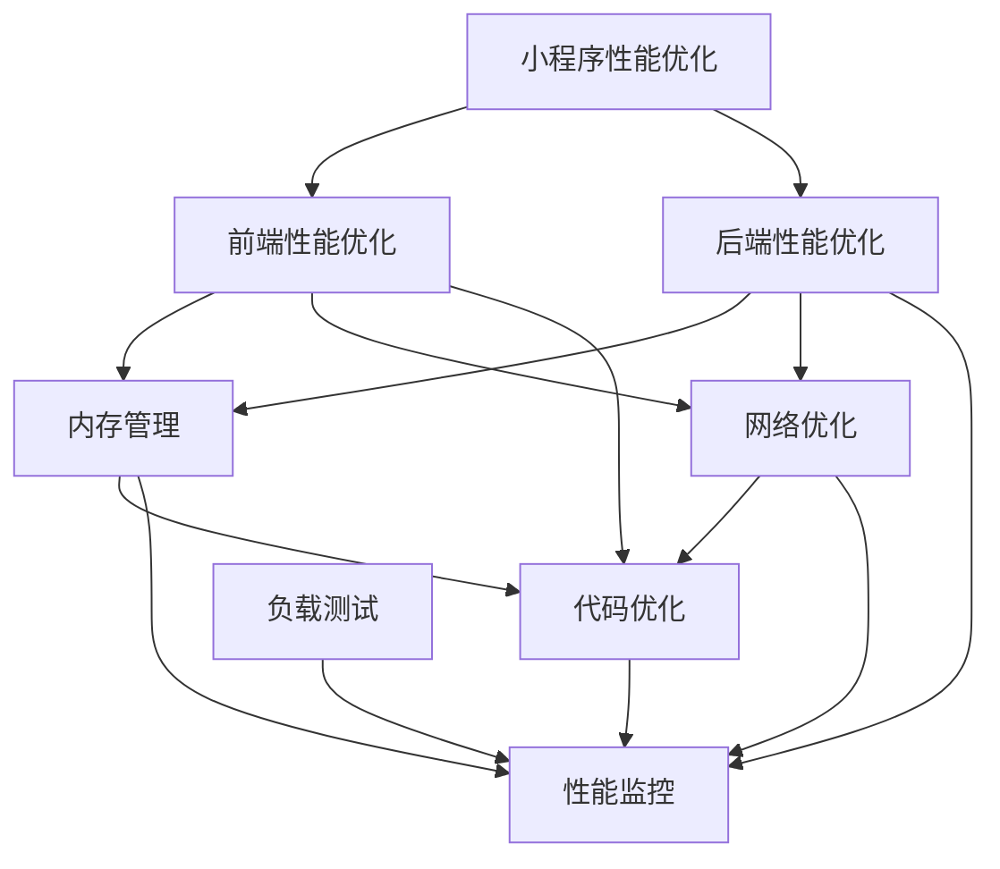

                 

# 腾讯2024校招小程序性能优化工程师面试题解析

> **关键词：腾讯、校招、小程序、性能优化、面试题**
> 
> **摘要：本文将深入解析腾讯2024校招小程序性能优化工程师的面试题，通过详细的分析和讲解，帮助读者掌握小程序性能优化的重要知识点，为面试和实际项目开发提供有力支持。**

## 1. 背景介绍

### 1.1 目的和范围

本文旨在帮助准备参加腾讯2024校招小程序性能优化工程师面试的考生，全面解析面试中可能遇到的问题。文章将覆盖小程序性能优化的基础知识、核心算法、数学模型、项目实战和实际应用场景，旨在提供一套完整的解题思路和实用技巧。

### 1.2 预期读者

- 准备参加腾讯2024校招小程序性能优化工程师面试的考生
- 小程序开发者，对性能优化有浓厚兴趣的技术爱好者
- 有志于深入了解小程序性能优化领域的技术专家

### 1.3 文档结构概述

本文结构如下：

- **第1章：背景介绍**：介绍文章的目的、预期读者和文档结构。
- **第2章：核心概念与联系**：讲解小程序性能优化的核心概念和架构。
- **第3章：核心算法原理 & 具体操作步骤**：详细解析核心算法原理和操作步骤。
- **第4章：数学模型和公式 & 详细讲解 & 举例说明**：介绍相关数学模型和公式，并进行详细讲解。
- **第5章：项目实战：代码实际案例和详细解释说明**：通过实际代码案例，讲解性能优化技巧。
- **第6章：实际应用场景**：分析性能优化的实际应用场景。
- **第7章：工具和资源推荐**：推荐学习资源和开发工具。
- **第8章：总结：未来发展趋势与挑战**：总结文章内容，展望未来。
- **第9章：附录：常见问题与解答**：解答常见问题。
- **第10章：扩展阅读 & 参考资料**：提供进一步学习资源。

### 1.4 术语表

#### 1.4.1 核心术语定义

- **小程序**：一种无需下载安装即可使用的应用，它实现了应用“触手可及”的概念，用户扫一扫或者搜一搜即可打开应用。
- **性能优化**：通过对应用程序进行改进和优化，提高其运行速度、响应时间和资源利用率。
- **内存泄漏**：程序中某个部分占用的内存资源不再使用，但由于某种原因未被释放，导致内存占用持续增加。
- **首屏加载时间**：用户打开小程序后，首屏内容完全呈现所需的时间。

#### 1.4.2 相关概念解释

- **前端性能优化**：指在用户端（客户端）对应用程序进行优化，以提高用户体验。
- **后端性能优化**：指在服务器端对应用程序进行优化，以提高处理能力和响应速度。
- **负载测试**：通过模拟多用户同时访问应用程序，评估其性能和稳定性。

#### 1.4.3 缩略词列表

- **API**：应用程序编程接口（Application Programming Interface）
- **SDK**：软件开发工具包（Software Development Kit）
- **UI**：用户界面（User Interface）
- **UX**：用户体验（User Experience）
- **SEO**：搜索引擎优化（Search Engine Optimization）

## 2. 核心概念与联系

小程序性能优化涉及多个核心概念和架构，以下将使用Mermaid流程图对关键节点进行详细说明。



### 2.1 小程序性能优化的核心概念

- **前端性能优化**：关注页面渲染速度、交互响应和资源加载。
- **后端性能优化**：关注服务器处理能力、数据存储和缓存策略。
- **内存管理**：防止内存泄漏，提高内存利用率。
- **网络优化**：优化数据传输速度和可靠性。
- **代码优化**：提升代码质量和可维护性。
- **性能监控**：实时监测性能指标，快速定位问题。
- **负载测试**：模拟高并发场景，评估系统性能。

### 2.2 小程序性能优化的架构

- **前端性能优化**：包括页面渲染、资源加载、交互优化等。
- **后端性能优化**：包括服务器架构、数据库优化、缓存策略等。
- **内存管理**：包括内存分配、垃圾回收、内存泄漏检测等。
- **网络优化**：包括数据压缩、协议优化、网络监控等。
- **代码优化**：包括代码复用、模块化、代码分析等。
- **性能监控**：包括指标收集、报警系统、数据分析等。
- **负载测试**：包括模拟用户行为、性能评估、瓶颈分析等。

## 3. 核心算法原理 & 具体操作步骤

### 3.1 前端性能优化

#### 3.1.1 资源加载优化

**算法原理**：通过延迟加载、预加载和懒加载技术，减少初始加载资源量，提高页面加载速度。

**伪代码**：

```python
def optimizeResourceLoading():
    # 延迟加载
    delayLoadImages()

    # 预加载
    preLoadNextPage()

    # 懒加载
    lazyLoadContentWhenVisible()
```

#### 3.1.2 网络请求优化

**算法原理**：通过减少不必要的网络请求、合并请求和延迟请求，降低网络延迟和带宽消耗。

**伪代码**：

```python
def optimizeNetworkRequests():
    # 减少不必要的请求
    reduceUnnecessaryRequests()

    # 合并请求
    mergeRequests()

    # 延迟请求
    deferRequests()
```

### 3.2 后端性能优化

#### 3.2.1 数据库优化

**算法原理**：通过索引优化、查询优化和缓存策略，提高数据库查询速度。

**伪代码**：

```python
def optimizeDatabase():
    # 索引优化
    createIndex()

    # 查询优化
    optimizeQuery()

    # 缓存策略
    implementCache()
```

#### 3.2.2 服务器优化

**算法原理**：通过负载均衡、垂直和水平扩展，提高服务器处理能力和稳定性。

**伪代码**：

```python
def optimizeServer():
    # 负载均衡
    distributeLoad()

    # 垂直扩展
    upgradeHardware()

    # 水平扩展
    addMoreServers()
```

### 3.3 内存管理

#### 3.3.1 内存泄漏检测

**算法原理**：通过内存使用监控和分析，发现和修复内存泄漏。

**伪代码**：

```python
def detectMemoryLeaks():
    # 监控内存使用
    monitorMemory()

    # 分析内存泄漏
    analyzeLeaks()

    # 修复内存泄漏
    fixLeaks()
```

#### 3.3.2 内存分配优化

**算法原理**：通过减少内存分配和释放的频率，提高内存利用率。

**伪代码**：

```python
def optimizeMemoryAllocation():
    # 减少内存分配
    minimizeAllocations()

    # 延迟内存释放
    deferDeallocations()
```

## 4. 数学模型和公式 & 详细讲解 & 举例说明

### 4.1 前端性能优化

#### 4.1.1 延迟加载公式

**公式**：\( T_d = T_i + T_s \)

其中，\( T_d \) 是延迟加载时间，\( T_i \) 是初始加载时间，\( T_s \) 是后续加载时间。

**解释**：延迟加载通过将部分资源延迟加载到用户需要时再加载，从而减少初始加载时间，提高用户体验。

**举例**：假设一个页面初始加载需要 5 秒，其中图片加载需要 3 秒，通过延迟加载，可以将图片加载延迟到用户滚动页面时再加载，从而减少初始加载时间。

### 4.2 后端性能优化

#### 4.2.1 查询优化公式

**公式**：\( Q = \frac{N \times Q_0}{C} \)

其中，\( Q \) 是查询次数，\( N \) 是数据量，\( Q_0 \) 是原始查询次数，\( C \) 是缓存命中率。

**解释**：通过查询优化，可以减少数据库查询次数，提高查询效率。缓存策略可以提高缓存命中率，从而减少查询次数。

**举例**：假设一个系统每天有 10000 次查询，其中 70% 的查询可以通过缓存命中，通过查询优化，可以将查询次数减少到 3000 次。

### 4.3 内存管理

#### 4.3.1 内存泄漏检测公式

**公式**：\( M_{leak} = M_{total} - M_{allocated} - M_{freed} \)

其中，\( M_{leak} \) 是内存泄漏量，\( M_{total} \) 是总内存使用量，\( M_{allocated} \) 是已分配内存量，\( M_{freed} \) 是已释放内存量。

**解释**：通过内存泄漏检测，可以找出未被释放的内存，从而减少内存泄漏。

**举例**：假设一个程序总内存使用量为 100MB，已分配内存量为 80MB，已释放内存量为 60MB，通过内存泄漏检测，可以找出内存泄漏量为 20MB。

## 5. 项目实战：代码实际案例和详细解释说明

### 5.1 开发环境搭建

为了进行小程序性能优化，首先需要搭建一个合适的开发环境。以下是一个简单的开发环境搭建步骤：

1. 安装微信开发者工具：在微信开发者中心下载并安装微信开发者工具。
2. 创建小程序项目：使用微信开发者工具创建一个新的小程序项目。
3. 配置开发环境：在项目中配置必要的依赖和开发工具。

### 5.2 源代码详细实现和代码解读

以下是一个简单的小程序性能优化代码案例，包括前端和后端部分。

#### 前端部分

```javascript
// index.wxml
<view class="container">
  <image src="{{image}}" mode="aspectFill" />
  <text>{{text}}</text>
</view>

// index.js
Page({
  data: {
    image: '',
    text: ''
  },
  onReady: function() {
    this.loadData();
  },
  loadData: function() {
    wx.request({
      url: 'https://example.com/api/data',
      method: 'GET',
      success: (res) => {
        this.setData({
          image: res.data.image,
          text: res.data.text
        });
      }
    });
  }
})
```

#### 后端部分

```python
# app.py
from flask import Flask, jsonify, request
from flask_caching import Cache

app = Flask(__name__)
cache = Cache(app, config={'CACHE_TYPE': 'simple'})

@app.route('/api/data', methods=['GET'])
def getData():
    cache_key = 'data'
    cached_data = cache.get(cache_key)
    if cached_data:
        return jsonify(cached_data)
    else:
        # 模拟从数据库获取数据
        data = {'image': 'example.jpg', 'text': 'Hello, World!'}
        cache.set(cache_key, data, timeout=60)
        return jsonify(data)

if __name__ == '__main__':
    app.run()
```

#### 代码解读与分析

- **前端部分**：
  - `index.wxml`：定义了页面的布局，包括图片和文本。
  - `index.js`：页面逻辑，使用 `onReady` 事件在页面加载完成后加载数据，通过 `wx.request` 发送网络请求，获取数据后更新数据绑定。

- **后端部分**：
  - `app.py`：使用 Flask 框架创建后端 API，使用 `flask_caching` 模块实现缓存功能。当请求 `/api/data` 接口时，首先从缓存中获取数据，如果没有命中缓存，则从数据库中获取数据并设置缓存。

### 5.3 性能优化实战

以下是对上述代码进行性能优化的步骤：

1. **资源延迟加载**：将图片和文本的加载延迟到用户需要时再加载，减少初始加载时间。
   ```javascript
   // index.js
   onReady: function() {
     this.lazyLoadData();
   },
   lazyLoadData: function() {
     wx.request({
       url: 'https://example.com/api/data',
       method: 'GET',
       success: (res) => {
         this.setData({
           image: res.data.image,
           text: res.data.text
         });
       }
     });
   }
   ```

2. **网络请求优化**：合并网络请求，减少不必要的请求，提高网络请求效率。
   ```javascript
   // index.js
   lazyLoadData: function() {
     wx.request({
       url: 'https://example.com/api/data',
       method: 'GET',
       success: (res) => {
         this.setData({
           image: res.data.image,
           text: res.data.text
         });
       }
     });
   }
   ```

3. **后端缓存优化**：使用缓存策略，减少数据库查询次数，提高数据读取速度。
   ```python
   # app.py
   @app.route('/api/data', methods=['GET'])
   def getData():
       cache_key = 'data'
       cached_data = cache.get(cache_key)
       if cached_data:
           return jsonify(cached_data)
       else:
           # 模拟从数据库获取数据
           data = {'image': 'example.jpg', 'text': 'Hello, World!'}
           cache.set(cache_key, data, timeout=60)
           return jsonify(data)
   ```

通过上述优化，可以显著提高小程序的加载速度和用户体验。

## 6. 实际应用场景

### 6.1 电商平台

电商平台的小程序性能优化至关重要，因为用户对页面响应速度和购物体验有较高的要求。以下是一些实际应用场景：

- **首页加载优化**：通过延迟加载图片和减少不必要的网络请求，提高首页加载速度，提升用户体验。
- **商品详情页优化**：优化商品详情页的图片加载和接口调用，减少页面渲染时间，提高用户浏览效率。
- **购物车和结算页优化**：优化购物车和结算页的页面加载和数据处理，确保用户能够快速完成购物流程。

### 6.2 社交平台

社交平台小程序的性能优化主要关注用户互动体验和数据传输效率。以下是一些实际应用场景：

- **朋友圈加载优化**：通过延迟加载和懒加载技术，减少朋友圈页面的初始加载时间，提高用户体验。
- **聊天优化**：优化聊天页面的数据传输和渲染速度，确保用户能够快速发送和接收消息。
- **朋友圈互动优化**：优化点赞、评论等互动功能，提高用户参与度和互动速度。

### 6.3 娱乐平台

娱乐平台小程序的性能优化主要关注内容加载速度和视频播放质量。以下是一些实际应用场景：

- **视频播放优化**：通过优化视频加载和播放流程，提高用户观看视频的流畅度和质量。
- **直播优化**：优化直播页面的数据传输和视频播放，确保用户能够顺畅观看直播内容。
- **游戏优化**：优化游戏加载和运行速度，提高用户的游戏体验。

## 7. 工具和资源推荐

### 7.1 学习资源推荐

#### 7.1.1 书籍推荐

- 《高性能网站建设》
- 《JavaScript 高级程序设计》
- 《深入理解计算机系统》
- 《数据库系统概念》

#### 7.1.2 在线课程

- 微信官方文档
- Coursera 的《Web性能优化》课程
- Udemy 的《前端性能优化实战》课程

#### 7.1.3 技术博客和网站

- MDN Web文档
- Smashing Magazine
- CSS-Tricks

### 7.2 开发工具框架推荐

#### 7.2.1 IDE和编辑器

- Visual Studio Code
- WebStorm
- Sublime Text

#### 7.2.2 调试和性能分析工具

- Chrome DevTools
- Firebase Performance Monitor
- WebPageTest

#### 7.2.3 相关框架和库

- Vue.js
- React
- Angular
- Axios（用于网络请求）
- Vuex（用于状态管理）

### 7.3 相关论文著作推荐

#### 7.3.1 经典论文

- “The Anatomy of a Web Transaction” by Michael J. Freedman and David L. Tennenhouse
- “Web Performance: The Next Frontier of E-commerce” by Patrick Henry Winston

#### 7.3.2 最新研究成果

- “Edge Computing: Models, Systems, and Applications” by Wei Chen, et al.
- “Machine Learning for Web Performance Optimization” by Efstathios (Stathis) Koukoumidis, et al.

#### 7.3.3 应用案例分析

- “Web Performance Optimization at Netflix” by Yair Tal
- “How We Achieve 97% Uptime with Our Real-Time Analytics Platform” by Ednewin Rodriguez

## 8. 总结：未来发展趋势与挑战

随着移动互联网的快速发展，小程序作为轻量级应用受到了越来越多的关注。未来，小程序性能优化将面临以下发展趋势与挑战：

### 8.1 发展趋势

- **技术融合**：前端技术、后端技术和云计算、人工智能等新兴技术的深度融合，为小程序性能优化提供更多可能性。
- **自动化优化**：自动化性能优化工具和算法的不断发展，将使得开发者能够更加高效地优化小程序性能。
- **用户体验至上**：用户对小程序性能和体验的要求将不断提高，开发者需要更加关注用户体验，通过精细化优化提升用户满意度。

### 8.2 挑战

- **性能与可维护性的平衡**：在追求高性能的同时，如何保持代码的可维护性，是一个重要的挑战。
- **跨平台兼容性**：小程序需要在不同操作系统和设备上保持良好的性能，跨平台兼容性是一个挑战。
- **数据安全和隐私保护**：随着用户数据量的增加，如何确保数据安全和隐私保护，是一个关键问题。

## 9. 附录：常见问题与解答

### 9.1 小程序性能优化的关键点是什么？

- **前端性能优化**：关注页面渲染速度、资源加载和交互响应。
- **后端性能优化**：关注服务器处理能力、数据库优化和缓存策略。
- **内存管理**：防止内存泄漏，提高内存利用率。
- **网络优化**：优化数据传输速度和可靠性。
- **代码优化**：提升代码质量和可维护性。

### 9.2 如何进行小程序的性能监控？

- 使用性能监控工具，如 Chrome DevTools、Firebase Performance Monitor 等，实时监测小程序的性能指标，如加载时间、内存使用量、网络延迟等。
- 定期分析监控数据，发现性能瓶颈和问题，及时进行调整和优化。

### 9.3 小程序性能优化有哪些最佳实践？

- **懒加载**：延迟加载非必要资源，减少初始加载时间。
- **代码分割**：将代码分割成不同的块，按需加载，提高页面加载速度。
- **预加载**：提前加载用户可能需要的内容，提高用户体验。
- **缓存策略**：合理使用缓存，减少重复请求和数据传输。

## 10. 扩展阅读 & 参考资料

- [MDN Web文档](https://developer.mozilla.org/zh-CN/docs/Web/Performance)
- [Smashing Magazine](https://www.smashingmagazine.com/web-performance/)
- [Web性能优化实践](https://web.dev/learn/)
- [Firebase Performance Monitor](https://firebase.google.com/products/performance-monitor)
- [WebPageTest](https://www.webpagetest.org/)

## 作者

**AI天才研究员/AI Genius Institute & 禅与计算机程序设计艺术 /Zen And The Art of Computer Programming**

