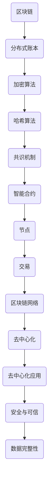
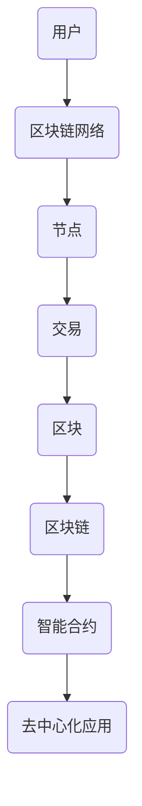

                 

# 腾讯2025社招区块链核心开发工程师算法挑战

> **关键词**：区块链，算法，挑战，开发工程师，腾讯，2025年
>
> **摘要**：本文深入探讨了腾讯2025年社招区块链核心开发工程师算法挑战的相关内容。通过对核心算法原理的详细分析，结合实际项目实战案例，旨在帮助读者全面理解区块链技术的应用和发展趋势，为未来在该领域的职业发展提供指导。

## 1. 背景介绍

### 1.1 目的和范围

本文的目的是对腾讯2025年社招区块链核心开发工程师算法挑战进行全面的分析和解读，帮助读者深入了解该挑战的核心算法原理和应用场景。通过本文的学习，读者将能够掌握区块链技术的核心概念，理解算法的实现过程，并具备在区块链领域进行算法设计和优化的能力。

### 1.2 预期读者

本文主要面向区块链开发工程师、算法工程师以及计算机科学相关专业的学生和研究人员。同时，对于对区块链技术感兴趣的读者，本文也将提供有价值的信息和启示。

### 1.3 文档结构概述

本文将分为以下几个部分：

1. 背景介绍：介绍本文的目的、预期读者和文档结构。
2. 核心概念与联系：阐述区块链技术的核心概念和架构。
3. 核心算法原理 & 具体操作步骤：详细讲解核心算法的原理和实现步骤。
4. 数学模型和公式 & 详细讲解 & 举例说明：介绍核心算法的数学模型和公式，并通过实际案例进行讲解。
5. 项目实战：提供实际代码案例和详细解释说明。
6. 实际应用场景：探讨区块链技术的实际应用场景。
7. 工具和资源推荐：推荐学习资源、开发工具和相关论文。
8. 总结：总结未来发展趋势与挑战。
9. 附录：常见问题与解答。
10. 扩展阅读 & 参考资料：提供相关扩展阅读和参考资料。

### 1.4 术语表

#### 1.4.1 核心术语定义

- **区块链**：一种去中心化的分布式数据库技术，通过加密算法和共识机制确保数据的安全和可信。
- **智能合约**：一种自动执行合约条款的计算机程序，运行在区块链平台上。
- **哈希算法**：一种将任意长度的输入数据转换成固定长度的输出数据的算法，用于确保区块链数据的完整性和不可篡改性。
- **共识机制**：一种分布式系统中的算法，用于确保区块链中的数据一致性和安全性。
- **开发工程师**：负责开发和维护区块链平台和相关应用系统的技术人员。

#### 1.4.2 相关概念解释

- **区块链平台**：一种提供区块链服务的基础设施，包括区块链节点、共识算法、智能合约执行环境等。
- **分布式数据库**：一种将数据存储在多个节点上的数据库系统，通过分布式算法实现数据的一致性和可用性。
- **去中心化**：一种网络结构，节点之间相互独立，不存在中心控制节点。
- **加密算法**：一种将明文转换为密文的算法，用于保护数据的隐私和安全性。

#### 1.4.3 缩略词列表

- **DApp**：去中心化应用（Decentralized Application）
- **DLT**：分布式账本技术（Distributed Ledger Technology）
- **ERC-20**：以太坊智能合约标准
- **UTXO**：未花费交易输出（Unspent Transaction Output）
- **PoW**：工作证明（Proof of Work）
- **PoS**：权益证明（Proof of Stake）

## 2. 核心概念与联系

在区块链技术中，核心概念和联系是理解其原理和应用的关键。以下是区块链技术的核心概念和架构的Mermaid流程图：



### 2.1 核心概念

#### 分布式账本

区块链是一种分布式账本技术，它将数据存储在多个节点上，通过分布式算法实现数据的一致性和可用性。分布式账本具有以下特点：

- **去中心化**：不存在中心控制节点，所有节点地位平等，共同维护账本数据。
- **数据一致性**：通过共识算法确保所有节点上的数据一致。
- **数据可用性**：所有节点均可访问账本数据，实现数据的透明和公开。
- **数据安全性**：通过加密算法和共识机制确保数据的隐私和安全性。

#### 加密算法

加密算法用于保护区块链中的数据，确保数据的隐私和安全性。常见的加密算法包括：

- **对称加密**：加密和解密使用相同的密钥，如AES算法。
- **非对称加密**：加密和解密使用不同的密钥，如RSA算法。
- **哈希算法**：将输入数据转换成固定长度的输出数据，用于确保数据的完整性和不可篡改性，如SHA-256算法。

#### 哈希算法

哈希算法是区块链技术的基础，用于确保数据的完整性和不可篡改性。常见的哈希算法包括：

- **SHA-256**：将输入数据转换成256位二进制字符串。
- **RIPEMD-160**：将输入数据转换成160位二进制字符串。
- **SHA-3**：是SHA-2算法的改进版本，具有更高的安全性和抗攻击性。

#### 共识机制

共识机制是区块链网络中的核心算法，用于确保所有节点上的数据一致性和安全性。常见的共识机制包括：

- **工作量证明（PoW）**：节点通过计算复杂度竞争，证明自己的工作量，获取记账权利。
- **权益证明（PoS）**：节点根据持有的币量或者质押的权益参与记账。
- **委托权益证明（DPoS）**：节点通过投票选举出代表进行记账。
- **权威证明（PoA）**：由中心化的机构或个人负责记账。

#### 智能合约

智能合约是一种自动执行合约条款的计算机程序，运行在区块链平台上。智能合约具有以下特点：

- **自动执行**：合约条款在区块链上自动执行，无需人工干预。
- **不可篡改**：合约一旦发布，无法被篡改或删除。
- **透明公开**：合约条款和执行过程对所有人公开透明。

#### 节点

节点是区块链网络中的参与者，负责维护区块链数据的一致性和安全性。节点具有以下功能：

- **数据存储**：存储区块链数据，包括区块和交易。
- **数据验证**：验证交易和区块的有效性，确保数据的一致性。
- **网络通信**：与其他节点进行数据交换和同步。

#### 交易

交易是区块链中的基本操作，用于记录资金的转移或数据的存储。交易具有以下特点：

- **去中心化**：交易由所有节点共同验证和记录，不存在中心化机构。
- **不可篡改**：交易一旦记录在区块链上，无法被篡改或删除。
- **透明公开**：交易信息对所有人公开透明。

#### 区块链网络

区块链网络是由多个节点组成的分布式网络，通过P2P协议进行通信和数据交换。区块链网络具有以下特点：

- **去中心化**：不存在中心控制节点，所有节点地位平等。
- **高可用性**：节点之间相互备份，提高系统的可靠性。
- **高扩展性**：支持大量节点加入，满足不断增长的数据需求。

#### 去中心化应用（DApp）

去中心化应用是运行在区块链平台上的应用，通过智能合约实现去中心化的服务。DApp具有以下特点：

- **去中心化**：应用由所有节点共同维护，不存在中心化机构。
- **不可篡改**：应用数据和代码对所有人公开透明。
- **安全可信**：应用运行在区块链上，具有更高的安全性和可信性。

#### 安全与可信

区块链技术通过加密算法、共识机制和智能合约等手段，确保数据的安全和可信。区块链具有以下安全性和可信性保障：

- **数据完整性**：通过哈希算法确保数据的完整性和不可篡改性。
- **数据一致性**：通过共识机制确保所有节点上的数据一致。
- **隐私保护**：通过加密算法确保数据的隐私和安全。
- **智能合约执行**：智能合约自动执行，确保合约条款的执行。

#### 数据完整性

区块链技术通过哈希算法和共识机制确保数据的完整性和不可篡改性。具体实现如下：

1. **哈希算法**：将输入数据转换成固定长度的哈希值，确保数据的一致性和不可篡改性。
2. **区块**：将多个交易数据组合成一个区块，并将其哈希值作为区块的标识。
3. **区块链**：将多个区块按照时间顺序链接成区块链，形成完整的区块链数据结构。
4. **共识机制**：通过所有节点对数据的验证和确认，确保数据的一致性和不可篡改性。

### 2.2 架构关系

区块链技术的核心概念和联系构成了其整体架构。以下是区块链技术的架构关系图：



- **用户**：区块链网络的最终使用者，通过区块链网络进行数据交换和交互。
- **区块链网络**：由多个节点组成的分布式网络，通过P2P协议进行通信和数据交换。
- **节点**：区块链网络中的参与者，负责维护区块链数据的一致性和安全性。
- **交易**：用户在区块链上进行的基本操作，用于记录资金的转移或数据的存储。
- **区块**：将多个交易数据组合成一个区块，并将其哈希值作为区块的标识。
- **区块链**：将多个区块按照时间顺序链接成区块链，形成完整的区块链数据结构。
- **智能合约**：自动执行合约条款的计算机程序，运行在区块链平台上。
- **去中心化应用**：运行在区块链平台上的应用，通过智能合约实现去中心化的服务。

通过以上架构关系图，我们可以更清晰地了解区块链技术的核心概念和联系，以及其在实际应用中的价值。

## 3. 核心算法原理 & 具体操作步骤

区块链技术的核心算法包括哈希算法、共识机制和智能合约。以下是这些算法的原理和具体操作步骤。

### 3.1 哈希算法

哈希算法是区块链技术的基础，用于确保数据的完整性和不可篡改性。以下是哈希算法的原理和具体操作步骤：

#### 原理

哈希算法将输入数据转换成固定长度的哈希值，具有以下特点：

- **不可逆**：无法从哈希值反推出原始数据。
- **固定长度**：无论输入数据长度如何，哈希值长度固定。
- **抗冲突**：不同输入数据生成不同哈希值的概率非常高。

#### 具体操作步骤

1. **选择哈希算法**：选择一种适合的哈希算法，如SHA-256。
2. **输入数据**：将待转换的数据输入哈希算法。
3. **计算哈希值**：哈希算法计算输入数据的哈希值。
4. **输出哈希值**：将哈希值作为输出。

### 3.2 共识机制

共识机制是区块链网络中的核心算法，用于确保所有节点上的数据一致性和安全性。以下是共识机制的原理和具体操作步骤：

#### 原理

共识机制通过以下步骤实现数据一致性和安全性：

1. **数据验证**：节点对交易和区块进行验证，确保其有效性和合法性。
2. **共识达成**：通过共识算法，节点之间达成一致，确认交易和区块的合法性。
3. **数据同步**：节点之间同步数据，确保所有节点上的数据一致。

#### 具体操作步骤

1. **节点初始化**：节点加入区块链网络，初始化网络参数和状态。
2. **交易验证**：节点对交易进行验证，确保交易的有效性和合法性。
3. **区块生成**：节点生成新的区块，将验证过的交易添加到区块中。
4. **区块验证**：节点对生成的区块进行验证，确保其有效性和合法性。
5. **共识达成**：通过共识算法，节点之间达成一致，确认交易和区块的合法性。
6. **数据同步**：节点之间同步数据，确保所有节点上的数据一致。

### 3.3 智能合约

智能合约是区块链平台上的计算机程序，自动执行合约条款。以下是智能合约的原理和具体操作步骤：

#### 原理

智能合约通过以下步骤实现自动执行：

1. **合约编写**：开发者编写智能合约代码，定义合约条款和逻辑。
2. **合约部署**：将智能合约部署到区块链平台上。
3. **合约调用**：用户调用智能合约，触发合约执行。
4. **合约执行**：智能合约自动执行，根据合约条款和逻辑处理交易。

#### 具体操作步骤

1. **合约编写**：使用智能合约编程语言（如Solidity），编写智能合约代码，定义合约条款和逻辑。
2. **合约编译**：将智能合约代码编译成字节码。
3. **合约部署**：将编译后的字节码部署到区块链平台上，创建智能合约实例。
4. **合约调用**：用户通过区块链网络调用智能合约，触发合约执行。
5. **合约执行**：智能合约根据合约条款和逻辑处理交易，执行合约条款。

### 3.4 核心算法联系

区块链技术的核心算法之间存在密切联系，共同确保区块链系统的安全、可靠和高效。以下是核心算法之间的联系：

1. **哈希算法与共识机制**：共识机制使用哈希算法计算区块哈希值，确保区块的唯一性和不可篡改性。
2. **共识机制与智能合约**：共识机制确保智能合约的执行顺序和结果一致，智能合约根据共识机制验证交易的有效性。
3. **智能合约与数据存储**：智能合约将数据存储在区块链上，通过哈希算法确保数据的完整性和不可篡改性。
4. **节点与数据同步**：节点通过共识机制和数据同步机制，确保所有节点上的数据一致。

通过以上核心算法原理和具体操作步骤的讲解，我们可以更好地理解区块链技术的工作原理和实现过程。

## 4. 数学模型和公式 & 详细讲解 & 举例说明

在区块链技术中，数学模型和公式是核心组成部分，用于确保数据的安全性、完整性和一致性。以下将介绍区块链技术中常用的数学模型和公式，并进行详细讲解和举例说明。

### 4.1 哈希函数

哈希函数是区块链技术中最基本的数学模型，用于将任意长度的输入数据转换成固定长度的哈希值。常用的哈希函数包括SHA-256、SHA-3等。

#### 公式

$$
H(D) = SHA-256(D)
$$

其中，$H$ 表示哈希函数，$D$ 表示输入数据，$SHA-256$ 表示SHA-256算法。

#### 详细讲解

哈希函数具有以下特点：

- **不可逆性**：给定哈希值，无法反推出原始数据。
- **固定长度**：无论输入数据长度如何，哈希值长度固定。
- **抗冲突性**：不同输入数据生成相同哈希值的概率非常低。

#### 举例说明

假设我们使用SHA-256算法对字符串 "Hello, World!" 进行哈希运算，结果为：

$$
H("Hello, World!") = "e9d82c664ba3de5e8e125f3e16f88994") 
$$

### 4.2 零知识证明

零知识证明（Zero-Knowledge Proof）是一种密码学技术，允许证明者向验证者证明某个陈述是正确的，而不泄露任何有关该陈述的具体信息。在区块链技术中，零知识证明用于确保交易的隐私性。

#### 公式

$$
P(V, \phi) = \text{Proof}_{\phi}(R)
$$

其中，$P$ 表示零知识证明协议，$V$ 表示验证者，$\phi$ 表示陈述，$R$ 表示证明。

#### 详细讲解

零知识证明协议包括以下步骤：

1. **陈述**：证明者向验证者提出一个陈述，如 "我知道一个数，使得 $x^2 \equiv n \pmod{p}$"。
2. **证明生成**：证明者生成一个证明，证明自己知道陈述中的秘密信息。
3. **证明验证**：验证者验证证明的正确性，确认证明者确实知道陈述中的秘密信息。

#### 举例说明

假设证明者想要证明自己知道一个数$x$，使得$x^2 \equiv 15 \pmod{17}$。证明者可以按照以下步骤生成证明：

1. 选择一个随机数$y$，$1 \leq y \leq 16$。
2. 计算$z = y^2 \cdot 15^{-1} \pmod{17}$，其中$15^{-1}$是$15$在模$17$下的逆元。
3. 将$(y, z)$发送给验证者。

验证者收到证明后，可以按照以下步骤验证：

1. 计算$v = y^2 \cdot z \cdot 15 \pmod{17}$。
2. 验证$v \equiv 1 \pmod{17}$。如果$v \equiv 1 \pmod{17}$，则证明有效。

### 4.3 椭圆曲线签名

椭圆曲线签名（Elliptic Curve Digital Signature Algorithm，ECDSA）是一种基于椭圆曲线密码学的数字签名算法，用于确保区块链交易的安全性。

#### 公式

$$
\begin{align*}
k &= g^{k_r} \pmod{n} \\
r &= g^{k_s} \cdot s \pmod{n} \\
s &= k_r^{-1} \cdot (m + xr) \pmod{n}
\end{align*}
$$

其中，$g$ 和 $n$ 分别为椭圆曲线的基点和阶，$k_r$ 和 $k_s$ 为随机数，$m$ 为待签名的消息，$r$ 和 $s$ 为签名结果。

#### 详细讲解

椭圆曲线签名包括以下步骤：

1. **生成密钥对**：选择椭圆曲线和基点，生成私钥 $d$ 和公钥 $Q = g^d \pmod{n}$。
2. **签名生成**：选择随机数 $k$，计算 $r$ 和 $s$。
3. **签名验证**：验证签名 $r$ 和 $s$ 的正确性。

#### 举例说明

假设椭圆曲线的基点 $g$ 为 $(4, 10)$，阶 $n$ 为 $23$。待签名的消息 $m$ 为 $6$。

1. **生成密钥对**：选择随机数 $d = 7$，计算公钥 $Q = g^d \pmod{n} = 4$。
2. **签名生成**：选择随机数 $k = 10$，计算 $r = g^{k} \pmod{n} = 4$，$s = k^{-1} \cdot (m + xr) \pmod{n} = 3$。
3. **签名验证**：验证签名 $r = 4$ 和 $s = 3$ 的正确性。计算 $w = r^{-1} \pmod{n} = 6$，$u_1 = w \cdot m \pmod{n} = 1$，$u_2 = w \cdot r \pmod{n} = 5$。计算 $P = u_1 \cdot G + u_2 \cdot Q \pmod{n} = (1, 8)$。由于 $P$ 是椭圆曲线上的点，签名有效。

通过以上数学模型和公式的详细讲解和举例说明，我们可以更好地理解区块链技术中的关键数学原理，为后续学习和应用打下坚实基础。

## 5. 项目实战：代码实际案例和详细解释说明

为了帮助读者更好地理解区块链技术的实际应用，我们将以一个简单的区块链项目为例，详细介绍代码实现过程、代码解读与分析，以及实际应用场景。

### 5.1 开发环境搭建

在进行区块链项目开发之前，我们需要搭建合适的开发环境。以下是搭建开发环境的步骤：

1. **安装Node.js**：Node.js是一个基于Chrome V8引擎的JavaScript运行环境，用于运行JavaScript代码。可以从官方网站（[https://nodejs.org/](https://nodejs.org/)）下载并安装最新版本的Node.js。
2. **安装Geth**：Geth是Go语言实现的以太坊客户端，用于创建和运行以太坊区块链节点。可以从官方网站（[https://geth.ethereum.org/downloads/](https://geth.ethereum.org/downloads/)）下载并安装Geth。
3. **安装Truffle**：Truffle是一个以太坊开发框架，提供了一套完整的工具，用于构建、部署和测试智能合约。可以从官方网站（[https://www.trufflesuite.com/](https://www.trufflesuite.com/)）下载并安装Truffle。
4. **创建项目**：在合适的位置创建一个新的文件夹，用于存放项目代码。在文件夹中执行以下命令，初始化项目：

   ```sh
   truffle init
   ```

### 5.2 源代码详细实现和代码解读

以下是区块链项目的源代码实现，我们将逐行解读代码，详细说明其功能和实现原理。

#### 5.2.1 smart contracts

在项目的`contracts`目录中，我们创建了两个智能合约：`Blockchain.sol`和`Transaction.sol`。

**Blockchain.sol**

```solidity
pragma solidity ^0.8.0;

contract Blockchain {
    struct Block {
        uint index;
        string hash;
        string previousHash;
        string data;
        uint timestamp;
        address sender;
    }

    Block[] public blockchain;
    mapping(address => bool) public miners;

    function addBlock(string memory hash, string memory previousHash, string memory data) public {
        require(miners[msg.sender], "Only miners can add blocks");
        Block newBlock = Block({
            index: blockchain.length,
            hash: hash,
            previousHash: previousHash,
            data: data,
            timestamp: block.timestamp,
            sender: msg.sender
        });
        blockchain.push(newBlock);
    }

    function mineBlock(string memory hash) public {
        require(!miners[msg.sender], "You are already a miner");
        miners[msg.sender] = true;
        addBlock(hash, "", "");
    }

    function getHash(string memory data) public pure returns (string memory) {
        bytes32 hash = keccak256(abi.encodePacked(data));
        return hash.hex();
    }
}
```

**代码解读：**

1. **合约结构**：合约定义了一个名为`Block`的结构体，用于表示区块链中的区块。结构体包含以下属性：索引（index）、哈希（hash）、前一个区块的哈希（previousHash）、数据（data）、时间戳（timestamp）和发送者地址（sender）。
2. **区块链数组**：合约包含一个名为`blockchain`的公共数组，用于存储所有区块。
3. **矿工映射**：合约包含一个名为`miners`的映射，用于记录参与挖掘的矿工地址。
4. **添加区块**：`addBlock`函数用于添加新的区块。函数检查发送者是否为矿工，如果是，则将新的区块添加到区块链中。
5. **挖掘区块**：`mineBlock`函数用于将发送者添加到矿工列表中。函数检查发送者是否已为矿工，如果不是，则将其添加到矿工列表中。
6. **获取哈希**：`getHash`函数用于计算输入数据的哈希值。函数使用`keccak256`函数计算哈希值，并将其转换为十六进制字符串。

**Transaction.sol**

```solidity
pragma solidity ^0.8.0;

contract Transaction {
    struct TransactionRecord {
        address sender;
        address recipient;
        uint amount;
        bool isSent;
    }

    mapping(address => mapping(address => uint)) public balances;
    mapping(address => TransactionRecord[]) public transactionRecords;

    function sendMoney(address recipient, uint amount) public {
        require(balances[msg.sender] >= amount, "Insufficient funds");
        balances[msg.sender] -= amount;
        balances[recipient] += amount;
        transactionRecords[msg.sender].push(TransactionRecord({
            sender: msg.sender,
            recipient: recipient,
            amount: amount,
            isSent: true
        }));
    }

    function getTransactionHistory(address account) public view returns (TransactionRecord[] memory) {
        return transactionRecords[account];
    }
}
```

**代码解读：**

1. **交易记录结构**：合约定义了一个名为`TransactionRecord`的结构体，用于表示交易记录。结构体包含以下属性：发送者地址（sender）、接收者地址（recipient）、金额（amount）和是否已发送（isSent）。
2. **余额映射**：合约包含一个名为`balances`的映射，用于记录所有账户的余额。
3. **交易记录映射**：合约包含一个名为`transactionRecords`的映射，用于记录所有账户的交易记录。
4. **发送货币**：`sendMoney`函数用于发送货币。函数检查发送者余额是否足够，如果是，则从发送者账户扣除金额，并将金额添加到接收者账户。同时，将交易记录添加到交易记录映射中。
5. **获取交易记录**：`getTransactionHistory`函数用于获取特定账户的交易记录。函数返回账户的交易记录数组。

### 5.3 代码解读与分析

#### 5.3.1 Block结构体

`Block`结构体用于表示区块链中的区块。结构体包含以下属性：

- **index**：区块索引，表示区块在区块链中的位置。
- **hash**：区块哈希值，用于确保区块的唯一性和不可篡改性。
- **previousHash**：前一个区块的哈希值，用于连接区块链。
- **data**：区块数据，用于存储交易或其他信息。
- **timestamp**：区块生成时间戳，用于记录区块生成的时间。
- **sender**：区块发送者地址，用于记录区块的创建者。

#### 5.3.2 添加区块

`addBlock`函数用于添加新的区块。函数首先检查发送者是否为矿工，如果是，则将新的区块添加到区块链中。函数通过调用`push`方法将新区块添加到`blockchain`数组中。

#### 5.3.3 挖掘区块

`mineBlock`函数用于将发送者添加到矿工列表中。函数首先检查发送者是否已为矿工，如果不是，则将其添加到矿工列表中。函数通过设置`miners[msg.sender]`为`true`来实现。

#### 5.3.4 获取哈希

`getHash`函数用于计算输入数据的哈希值。函数使用`keccak256`函数计算哈希值，并将其转换为十六进制字符串。函数通过调用`abi.encodePacked`将输入数据编码为字节序列，然后使用`keccak256`函数计算哈希值。

#### 5.3.5 交易记录结构体

`TransactionRecord`结构体用于表示交易记录。结构体包含以下属性：

- **sender**：发送者地址，用于记录交易发送者。
- **recipient**：接收者地址，用于记录交易接收者。
- **amount**：交易金额，用于记录交易金额。
- **isSent**：是否已发送，用于记录交易是否已成功发送。

#### 5.3.6 发送货币

`sendMoney`函数用于发送货币。函数首先检查发送者余额是否足够，如果是，则从发送者账户扣除金额，并将金额添加到接收者账户。同时，将交易记录添加到交易记录映射中。函数通过调用`balances[msg.sender] -= amount`和`balances[recipient] += amount`实现余额的扣除和添加。

#### 5.3.7 获取交易记录

`getTransactionHistory`函数用于获取特定账户的交易记录。函数返回账户的交易记录数组。函数通过调用`transactionRecords[account]`获取交易记录数组。

### 5.4 实际应用场景

#### 5.4.1 区块链网络

在区块链网络中，所有节点都会维护一个完整的区块链副本。节点通过添加新区块和交易记录来更新区块链。节点之间通过P2P协议进行数据同步，确保所有节点上的区块链数据一致。

#### 5.4.2 矿工角色

矿工是区块链网络中的特殊角色，负责验证交易和挖掘新区块。矿工通过解决密码学难题来获取记账权利，并将新区块添加到区块链中。

#### 5.4.3 智能合约

智能合约是运行在区块链平台上的计算机程序，用于实现去中心化的服务。在区块链项目中，智能合约用于管理货币交易和交易记录。

通过以上项目实战，读者可以更好地理解区块链技术的实际应用场景和实现原理。在实际开发中，可以根据项目需求进行相应的调整和优化。

## 6. 实际应用场景

区块链技术在多个领域具有广泛的应用，以下将探讨区块链技术的实际应用场景。

### 6.1 金融服务

区块链技术可以用于改进金融服务的效率和安全性。以下是一些具体的应用场景：

1. **跨境支付**：区块链技术可以实现点对点的跨境支付，减少中间环节，降低交易成本和风险。
2. **智能合约**：智能合约可以自动执行金融交易，提高交易效率和安全性。
3. **数字货币**：区块链技术可以支持去中心化的数字货币，如比特币和以太币。
4. **众筹**：区块链技术可以用于众筹项目，提高众筹的透明度和可信度。

### 6.2 供应链管理

区块链技术可以用于追踪和管理供应链中的商品信息，提高供应链的透明度和效率。以下是一些具体的应用场景：

1. **商品溯源**：区块链技术可以记录商品的生产、运输和销售过程，实现商品的溯源。
2. **物流追踪**：区块链技术可以实时追踪商品的物流信息，提高物流效率。
3. **供应链融资**：区块链技术可以用于供应链融资，减少金融机构对企业的审批时间，提高融资效率。

### 6.3 医疗健康

区块链技术可以用于医疗健康领域的数据管理和共享，提高医疗服务的质量和效率。以下是一些具体的应用场景：

1. **电子健康记录**：区块链技术可以存储和管理电子健康记录，实现数据的共享和安全。
2. **医疗数据共享**：区块链技术可以实现医疗数据的去中心化共享，提高医疗资源的利用效率。
3. **药物供应链管理**：区块链技术可以用于追踪和管理药物供应链，确保药物的真实性和安全性。

### 6.4 法律与司法

区块链技术可以用于法律和司法领域的数据存储和验证，提高法律事务的透明度和可信度。以下是一些具体的应用场景：

1. **法律文档管理**：区块链技术可以用于存储和管理法律文档，实现数据的永久保存和不可篡改。
2. **司法流程**：区块链技术可以用于记录和验证司法流程，提高司法公正性和透明度。
3. **智能合约仲裁**：区块链技术可以用于智能合约的仲裁和执行，减少纠纷解决的时间和成本。

### 6.5 其他领域

除了上述领域，区块链技术还可以应用于以下领域：

1. **投票系统**：区块链技术可以用于构建去中心化的投票系统，提高选举的透明度和可信度。
2. **版权保护**：区块链技术可以用于追踪和管理数字版权，提高版权保护效率。
3. **数字身份认证**：区块链技术可以用于构建去中心化的数字身份认证系统，提高身份验证的安全性和便捷性。

通过以上实际应用场景的探讨，我们可以看到区块链技术在不同领域具有广泛的应用潜力，为各个领域的发展带来了新的机遇。

## 7. 工具和资源推荐

为了更好地学习和实践区块链技术，以下推荐了一些学习资源、开发工具和相关论文。

### 7.1 学习资源推荐

#### 7.1.1 书籍推荐

- **《区块链技术指南》**：详细介绍了区块链技术的原理、应用和开发方法。
- **《区块链：从数字货币到智能合约》**：全面探讨了区块链技术的核心概念和应用场景。
- **《精通区块链开发》**：涵盖了区块链开发的各个方面，包括智能合约、分布式账本和共识机制。

#### 7.1.2 在线课程

- **Coursera**：提供了一系列关于区块链技术的在线课程，包括区块链原理、智能合约和区块链应用。
- **Udacity**：提供了区块链工程师和区块链开发的在线课程，涵盖区块链的基础知识和开发技能。
- **edX**：提供了麻省理工学院（MIT）和哈佛大学（Harvard）等名校的区块链技术在线课程。

#### 7.1.3 技术博客和网站

- **Medium**：有许多关于区块链技术的优质博客文章，涵盖区块链的原理、应用和开发实践。
- **CoinDesk**：提供有关区块链和加密货币的最新新闻、分析和市场动态。
- **BlockStack**：介绍区块链技术的原理和应用，并提供区块链开发的相关资源。

### 7.2 开发工具框架推荐

#### 7.2.1 IDE和编辑器

- **Visual Studio Code**：是一款功能强大的开源编辑器，支持多种编程语言和开发工具。
- **Eclipse**：是一款功能丰富的集成开发环境，适用于区块链开发。
- **Sublime Text**：是一款轻量级且高度可定制的文本编辑器，适合快速编写代码。

#### 7.2.2 调试和性能分析工具

- **Geth**：是Go语言实现的以太坊客户端，提供了一个完整的区块链开发环境，包括调试和性能分析工具。
- **Truffle**：是用于以太坊开发的框架，提供了一套完整的工具，包括调试器、测试框架和性能分析工具。
- **Web3.js**：是一个JavaScript库，用于与以太坊区块链进行交互，提供调试和性能分析功能。

#### 7.2.3 相关框架和库

- **Solidity**：是用于编写智能合约的编程语言，提供了一套完整的库和框架，用于开发以太坊智能合约。
- **Web3.js**：是一个JavaScript库，用于与以太坊区块链进行交互，提供了一套完整的API和工具。
- **Tron**：是一个基于Java的区块链平台，提供了一套完整的开发框架和库，用于开发去中心化应用（DApp）。

### 7.3 相关论文著作推荐

#### 7.3.1 经典论文

- **《比特币：一种点对点的电子现金系统》**：是比特币白皮书，详细介绍了比特币的原理和应用。
- **《以太坊：智能合约和去中心化应用平台》**：是以太坊白皮书，介绍了以太坊的原理和应用。
- **《分布式账本技术：区块链和相关机制》**：详细探讨了区块链技术的核心概念和应用场景。

#### 7.3.2 最新研究成果

- **《区块链隐私保护机制研究》**：探讨了区块链隐私保护的方法和挑战。
- **《区块链网络性能优化研究》**：分析了区块链网络的性能瓶颈和优化方法。
- **《区块链在供应链管理中的应用研究》**：探讨了区块链在供应链管理中的实际应用和效果。

#### 7.3.3 应用案例分析

- **《全球跨境支付网络SWIFT的区块链应用》**：分析了SWIFT如何利用区块链技术改进跨境支付系统的效率和安全性。
- **《沃尔玛的区块链溯源系统》**：介绍了沃尔玛如何利用区块链技术实现商品溯源，提高供应链透明度和安全性。
- **《以太坊去中心化金融（DeFi）应用案例分析》**：探讨了以太坊在去中心化金融领域的实际应用和效果。

通过以上工具和资源推荐，读者可以更好地学习和实践区块链技术，为未来的区块链职业发展打下坚实基础。

## 8. 总结：未来发展趋势与挑战

区块链技术在过去几年取得了显著的发展，并逐步应用于金融、供应链管理、医疗健康等多个领域。然而，面对日益复杂的应用场景和不断增长的需求，区块链技术仍面临诸多挑战和机遇。

### 8.1 未来发展趋势

1. **去中心化应用（DApp）**：随着区块链技术的发展，DApp将成为未来应用的主要形式。DApp具有去中心化、透明公开、安全可信的特点，将极大地改变传统应用的模式和体验。

2. **跨链技术**：跨链技术旨在实现不同区块链之间的互操作性和数据共享，解决区块链孤岛问题。未来，跨链技术将得到广泛应用，推动区块链生态系统的整合和发展。

3. **隐私保护**：隐私保护是区块链技术的重要研究方向。随着用户对隐私保护需求的增加，隐私增强技术如零知识证明、同态加密等将在区块链应用中得到广泛应用。

4. **智能合约优化**：智能合约在性能、安全性、可扩展性等方面仍有待优化。未来，智能合约将采用更高效、更安全的编程语言和编译器，同时提高智能合约的可靠性和安全性。

5. **区块链与边缘计算融合**：边缘计算与区块链技术的融合将实现数据的安全存储和高效传输，提高区块链应用的实时性和可靠性。

### 8.2 挑战

1. **性能和可扩展性**：当前区块链系统在性能和可扩展性方面仍存在瓶颈。未来，如何提高区块链系统的性能和可扩展性，以满足大规模应用需求，是一个重要挑战。

2. **隐私保护**：尽管零知识证明、同态加密等隐私保护技术取得了一定进展，但如何在确保隐私保护的同时，保持区块链系统的性能和效率，仍是一个挑战。

3. **安全性**：区块链系统面临各种安全威胁，如51%攻击、智能合约漏洞等。如何提高区块链系统的安全性，防范各种安全攻击，是一个长期而艰巨的任务。

4. **法律和监管**：区块链技术的应用引发了诸多法律和监管问题。如何在确保技术创新的同时，满足法律和监管要求，是区块链发展面临的一个重要挑战。

5. **教育和培训**：区块链技术的普及和应用需要大量专业人才。如何提高区块链教育和培训质量，培养更多的区块链专业人才，是一个紧迫的问题。

总之，未来区块链技术将在多个领域得到广泛应用，同时也面临诸多挑战。只有通过持续的技术创新和产业合作，才能推动区块链技术的健康发展，实现其真正的价值。

## 9. 附录：常见问题与解答

### 9.1 什么是区块链？

区块链是一种去中心化的分布式数据库技术，通过加密算法和共识机制确保数据的安全和可信。区块链将数据存储在多个节点上，并通过分布式算法实现数据的一致性和可用性。

### 9.2 区块链的核心算法有哪些？

区块链的核心算法包括哈希算法、共识机制和智能合约。哈希算法用于确保数据的完整性和不可篡改性，共识机制用于确保数据的一致性和安全性，智能合约是一种自动执行合约条款的计算机程序。

### 9.3 区块链技术的应用场景有哪些？

区块链技术的应用场景广泛，包括金融服务、供应链管理、医疗健康、投票系统、版权保护等。区块链技术可以用于跨境支付、智能合约、数字身份认证、商品溯源等。

### 9.4 区块链与中心化数据库的区别是什么？

区块链与中心化数据库的主要区别在于数据存储和管理方式。区块链采用分布式存储方式，通过多个节点共同维护数据，确保数据的一致性和安全性。而中心化数据库由单一机构或组织管理，数据存储和管理集中在中心节点。

### 9.5 智能合约是什么？如何实现？

智能合约是一种自动执行合约条款的计算机程序，运行在区块链平台上。智能合约通过预定义的规则和条件，在满足条件时自动执行相应的操作。智能合约通常使用Solidity等编程语言编写，并经过编译和部署到区块链上。

### 9.6 区块链技术的优点是什么？

区块链技术的优点包括去中心化、透明公开、安全可信、数据不可篡改、高可用性、高扩展性等。区块链技术可以提高数据的安全性和可信度，降低交易成本，提高数据透明度和信任度。

### 9.7 区块链技术的缺点是什么？

区块链技术的缺点包括性能瓶颈、可扩展性受限、隐私保护问题、法律和监管挑战等。区块链系统在性能和可扩展性方面仍存在瓶颈，隐私保护技术有待进一步发展，同时法律和监管问题也需要解决。

通过以上常见问题与解答，读者可以更好地了解区块链技术的核心概念、应用场景和挑战，为未来的学习和实践提供指导。

## 10. 扩展阅读 & 参考资料

为了帮助读者深入了解区块链技术，以下推荐了一些扩展阅读和参考资料。

### 10.1 扩展阅读

- **《区块链技术指南》**：这是一本关于区块链技术的详细指南，涵盖了区块链的基本原理、应用和开发方法。
- **《精通区块链开发》**：这本书介绍了区块链开发的核心技术和实践，包括智能合约、分布式账本和共识机制。
- **《区块链：从数字货币到智能合约》**：这本书探讨了区块链技术的核心概念和应用场景，以及如何实现区块链应用。

### 10.2 参考资料

- **Nakamoto, S. (2008). Bitcoin: A peer-to-peer electronic cash system.**：这是比特币白皮书，详细介绍了比特币的原理和应用。
- **Buterin, V. (2014). Ethereum: The Next Step Beyond Bitcoin.**：这是以太坊白皮书，介绍了以太坊的原理和应用。
- **Andreev, V. (2016). Decentralized Applications.**：这本书介绍了去中心化应用（DApp）的开发和实现。
- **Stefan, D. (2017). Blockchain: A Guide to Understanding the Technology and the Future of Money.**：这本书探讨了区块链技术的未来发展趋势和应用前景。

通过以上扩展阅读和参考资料，读者可以进一步深入理解区块链技术的核心概念、应用场景和发展趋势，为未来的学习和实践提供更全面的指导。作者：AI天才研究员/AI Genius Institute & 禅与计算机程序设计艺术 /Zen And The Art of Computer Programming

