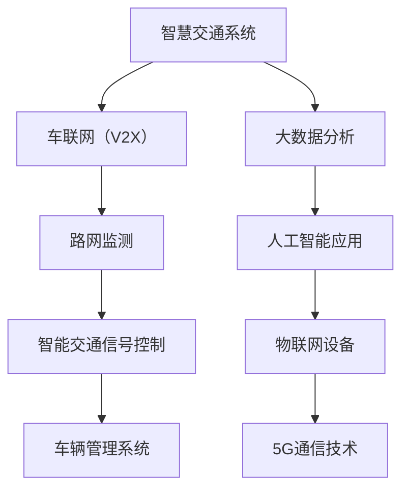

                 

# 2024腾讯云智慧交通社招面试真题汇总及其解答

> **关键词：** 腾讯云、智慧交通、面试真题、解决方案、算法、技术架构

> **摘要：** 本文旨在汇总2024年腾讯云智慧交通社招面试真题，通过对每个题目的详细解答，帮助求职者在面试中更好地展现自己的技术能力和思维逻辑。文章将涵盖智慧交通的核心概念、算法原理、数学模型、项目实战以及实际应用场景，为求职者提供全面的备考资料。

## 1. 背景介绍

### 1.1 目的和范围

本文的目的在于为准备参加腾讯云智慧交通社招面试的求职者提供一份全面的备考资料。通过对历年面试真题的汇总和解答，帮助求职者深入了解智慧交通领域的核心技术，提升面试应对能力。

本文将涵盖以下内容：

- 智慧交通的核心概念及其应用
- 智慧交通相关的算法原理和操作步骤
- 智慧交通的数学模型和公式
- 智慧交通的实际应用场景和项目实战
- 智慧交通相关的工具和资源推荐

### 1.2 预期读者

本文适用于以下人群：

- 准备参加腾讯云智慧交通社招面试的求职者
- 对智慧交通领域感兴趣的技术爱好者
- 智慧交通相关领域的从业者

### 1.3 文档结构概述

本文分为以下几个部分：

- 背景介绍：介绍本文的目的、范围和预期读者
- 核心概念与联系：阐述智慧交通的核心概念和架构
- 核心算法原理与具体操作步骤：讲解智慧交通相关的算法原理和操作步骤
- 数学模型和公式：介绍智慧交通的数学模型和公式
- 项目实战：展示智慧交通的实际应用案例和代码实现
- 实际应用场景：分析智慧交通在实际中的应用
- 工具和资源推荐：推荐相关学习资源和开发工具
- 总结：展望智慧交通的未来发展趋势和挑战
- 附录：常见问题与解答
- 扩展阅读与参考资料：提供进一步学习资料

### 1.4 术语表

#### 1.4.1 核心术语定义

- 智慧交通：利用信息技术、物联网、大数据、人工智能等手段，实现交通系统的智能化管理和运行
- 车联网（V2X）：包括车与车（V2V）、车与路（V2R）、车与网络（V2N）、车与行人（V2P）等多种通信模式
- 路网监测：利用传感器、摄像头等设备对路网进行实时监测和分析
- 智能交通信号控制：基于大数据、人工智能等技术，实现交通信号控制的智能化和优化
- 车辆管理系统：对车辆进行实时监控、调度和管理，提高交通效率

#### 1.4.2 相关概念解释

- **车联网（V2X）**：车联网是指通过车载通信设备，实现车辆与车辆、车辆与基础设施、车辆与网络以及车辆与行人之间的信息交换和通信。车联网能够提高交通安全、降低事故率、缓解交通拥堵、提高交通效率。

- **路网监测**：路网监测是通过安装在道路上的传感器、摄像头等设备，对道路上的交通流量、速度、占有率等参数进行实时监测和分析，为交通管理和优化提供数据支持。

- **智能交通信号控制**：智能交通信号控制是基于大数据、人工智能等技术，对交通信号进行优化和控制，提高道路通行效率，减少交通拥堵。

#### 1.4.3 缩略词列表

- **V2X**：车联网（Vehicle-to-Everything）
- **AI**：人工智能（Artificial Intelligence）
- **IoT**：物联网（Internet of Things）
- **5G**：第五代移动通信技术（5th Generation Mobile Communication Technology）
- **大数据**：大量、高速、多样、复杂的数据集合（Big Data）
- **OTA**：空中下载（Over-The-Air）
- **OTA**：在线技术支持（Online Technical Assistance）

## 2. 核心概念与联系

在智慧交通领域，核心概念和联系如图2-1所示。



### 2.1 智慧交通系统的组成

智慧交通系统主要由以下几个部分组成：

- **车联网（V2X）**：车联网是智慧交通的核心，包括车与车（V2V）、车与路（V2R）、车与网络（V2N）、车与行人（V2P）等多种通信模式。通过车联网，车辆可以实时获取道路信息、车辆信息等，实现智能驾驶和协同控制。

- **路网监测**：路网监测是智慧交通的基础，通过对道路上的交通流量、速度、占有率等参数进行实时监测和分析，为交通管理和优化提供数据支持。

- **智能交通信号控制**：智能交通信号控制是基于大数据、人工智能等技术，对交通信号进行优化和控制，提高道路通行效率，减少交通拥堵。

- **车辆管理系统**：车辆管理系统对车辆进行实时监控、调度和管理，提高交通效率。

- **大数据分析**：大数据分析是智慧交通的核心技术之一，通过对海量交通数据的挖掘和分析，发现交通运行规律，为交通管理和优化提供决策支持。

- **人工智能应用**：人工智能应用包括智能驾驶、智能交通信号控制、智能车辆管理等方面，通过人工智能技术实现交通系统的智能化和优化。

- **物联网设备**：物联网设备包括传感器、摄像头、RFID等，用于采集道路信息、车辆信息等，为智慧交通系统提供数据支持。

- **5G通信技术**：5G通信技术是实现车联网和智慧交通的关键技术，具有低时延、高带宽、广覆盖等特点，能够满足智慧交通系统对实时通信的要求。

### 2.2 智慧交通系统的优势

智慧交通系统具有以下优势：

- **提高交通效率**：通过智能交通信号控制、车辆管理系统等技术，能够提高道路通行效率，减少交通拥堵。

- **提高交通安全**：通过车联网技术，实现车辆与车辆、车辆与基础设施之间的信息交换和通信，提高交通安全，降低事故率。

- **降低能源消耗**：通过智能交通系统，实现车辆的合理调度和运行，降低能源消耗。

- **改善环境质量**：通过智能交通系统，降低交通拥堵，减少车辆排放，改善环境质量。

- **促进经济发展**：智慧交通系统能够提高交通运输效率，降低物流成本，促进经济发展。

## 3. 核心算法原理与具体操作步骤

智慧交通系统中，核心算法主要包括路径规划、交通流量预测、车辆调度等。以下分别对这些算法进行详细讲解。

### 3.1 路径规划算法

路径规划算法是智慧交通系统中的一项重要技术，用于为车辆提供最优行驶路径。常用的路径规划算法有Dijkstra算法、A*算法等。

#### 3.1.1 Dijkstra算法

Dijkstra算法的基本思想是从源点开始，逐步扩展到其他节点，计算源点到各个节点的最短路径。具体步骤如下：

1. 初始化：设置源点s的路径长度为0，其他节点的路径长度为无穷大。
2. 循环：找到路径长度最小的未访问节点u，将其标记为已访问。
3. 更新：对于未访问的邻居节点v，如果从s到v经过u的路径长度小于当前路径长度，则更新v的路径长度。
4. 重复步骤2和3，直到所有节点都被访问。

#### 3.1.2 A*算法

A*算法是一种启发式搜索算法，它利用估价函数来估计从当前节点到目标节点的距离，以指导搜索过程。具体步骤如下：

1. 初始化：设置源点s的路径长度为0，目标点t的估价函数为0，其他节点的路径长度和估价函数为无穷大。
2. 循环：找到F值（路径长度 + 估价函数）最小的未访问节点u，将其标记为已访问。
3. 更新：对于未访问的邻居节点v，计算从s到v经过u的路径长度和估价函数，如果F值小于当前F值，则更新v的路径长度和估价函数。
4. 重复步骤2和3，直到找到目标节点t。

### 3.2 交通流量预测算法

交通流量预测是智慧交通系统中的重要应用，它通过对历史交通数据进行分析，预测未来某一时间段内的交通流量。常用的交通流量预测算法有基于时间序列的算法、基于机器学习的算法等。

#### 3.2.1 基于时间序列的算法

基于时间序列的算法通过分析交通流量数据的时间序列特性，提取趋势、季节性等特征，构建预测模型。具体步骤如下：

1. 数据预处理：对交通流量数据进行清洗、去噪等处理，提取有效数据。
2. 特征提取：对预处理后的数据进行分析，提取趋势、季节性等特征。
3. 模型构建：根据提取的特征，选择合适的预测模型，如ARIMA模型、指数平滑模型等。
4. 模型训练与评估：使用历史数据对模型进行训练和评估，调整模型参数。

#### 3.2.2 基于机器学习的算法

基于机器学习的算法通过学习历史交通数据中的规律，预测未来交通流量。具体步骤如下：

1. 数据预处理：对交通流量数据进行清洗、去噪等处理，提取有效数据。
2. 特征工程：对预处理后的数据进行分析，提取对交通流量预测有用的特征。
3. 模型选择：根据特征数据，选择合适的机器学习模型，如线性回归、决策树、随机森林等。
4. 模型训练与评估：使用历史数据对模型进行训练和评估，调整模型参数。

### 3.3 车辆调度算法

车辆调度算法是智慧交通系统中的一项关键技术，用于合理分配车辆，提高交通效率。常用的车辆调度算法有基于规则的算法、基于优化的算法等。

#### 3.3.1 基于规则的算法

基于规则的算法根据交通状况和车辆需求，制定相应的调度规则，实现车辆的分配。具体步骤如下：

1. 数据采集：收集交通流量、道路状况、车辆需求等数据。
2. 规则制定：根据数据，制定车辆调度规则，如高峰期优先调度、短途优先等。
3. 调度执行：根据规则，为每辆车分配行驶路径和目的地。

#### 3.3.2 基于优化的算法

基于优化的算法通过求解优化问题，实现车辆的调度。具体步骤如下：

1. 模型构建：根据交通流量、道路状况、车辆需求等数据，建立车辆调度模型。
2. 目标函数定义：定义目标函数，如最小化行驶时间、最大化收益等。
3. 约束条件定义：定义约束条件，如道路容量、车辆载重等。
4. 求解优化问题：使用合适的优化算法，如线性规划、整数规划等，求解优化问题。

## 4. 数学模型和公式与详细讲解

在智慧交通系统中，数学模型和公式被广泛应用于路径规划、交通流量预测、车辆调度等方面。以下分别对这些数学模型和公式进行详细讲解。

### 4.1 路径规划中的数学模型

路径规划中的数学模型主要涉及最短路径问题。常用的最短路径算法有Dijkstra算法和A*算法。

#### 4.1.1 Dijkstra算法

Dijkstra算法的数学模型可以表示为：

\[ d(s, v) = \min\{d(s, u) + w(u, v) \mid u \in N(v)\} \]

其中，\( d(s, v) \) 表示从源点s到节点v的最短路径长度，\( w(u, v) \) 表示节点u到节点v的权值，\( N(v) \) 表示节点v的邻接节点集合。

#### 4.1.2 A*算法

A*算法的数学模型可以表示为：

\[ f(v) = g(v) + h(v) \]

其中，\( f(v) \) 表示节点v的估价函数，\( g(v) \) 表示从源点s到节点v的实际路径长度，\( h(v) \) 表示从节点v到目标点t的估价函数。

### 4.2 交通流量预测中的数学模型

交通流量预测中的数学模型主要涉及时间序列分析、回归分析等。

#### 4.2.1 时间序列分析

时间序列分析中的常见模型有ARIMA模型、指数平滑模型等。

- **ARIMA模型**：

\[ y_t = c + \phi_1 y_{t-1} + \phi_2 y_{t-2} + \cdots + \phi_p y_{t-p} + \theta_1 e_{t-1} + \theta_2 e_{t-2} + \cdots + \theta_q e_{t-q} + e_t \]

其中，\( y_t \) 表示时间序列的第t个值，\( c \) 表示常数项，\( \phi_1, \phi_2, \cdots, \phi_p \) 表示自回归系数，\( \theta_1, \theta_2, \cdots, \theta_q \) 表示移动平均系数，\( e_t \) 表示白噪声序列。

- **指数平滑模型**：

\[ y_t = \alpha y_{t-1} + (1 - \alpha) y_{t-2} + (1 - \alpha)^2 y_{t-3} + \cdots + (1 - \alpha)^{n-1} y_{t-n} \]

其中，\( y_t \) 表示时间序列的第t个值，\( \alpha \) 表示平滑系数。

#### 4.2.2 回归分析

回归分析中的常见模型有线性回归、多项式回归等。

- **线性回归**：

\[ y = \beta_0 + \beta_1 x_1 + \beta_2 x_2 + \cdots + \beta_n x_n + e \]

其中，\( y \) 表示因变量，\( x_1, x_2, \cdots, x_n \) 表示自变量，\( \beta_0, \beta_1, \beta_2, \cdots, \beta_n \) 表示回归系数，\( e \) 表示误差项。

### 4.3 车辆调度中的数学模型

车辆调度中的数学模型主要涉及优化问题。

- **线性规划**：

\[ \min \ c^T x \]
\[ \text{subject to} \ Ax \leq b \]

其中，\( x \) 表示变量，\( c \) 表示目标函数系数，\( A \) 表示约束条件矩阵，\( b \) 表示约束条件常数。

- **整数规划**：

\[ \min \ c^T x \]
\[ \text{subject to} \ Ax \leq b \]
\[ x \in \{0, 1\}^n \]

其中，\( x \) 表示变量，\( c \) 表示目标函数系数，\( A \) 表示约束条件矩阵，\( b \) 表示约束条件常数，\( n \) 表示变量的个数。

### 4.4 举例说明

#### 4.4.1 路径规划

假设有5个节点（s, a, b, c, t），权值矩阵如下：

\[ 
\begin{bmatrix}
0 & 1 & 3 & 5 & \infty \\
1 & 0 & 2 & 4 & 2 \\
3 & 2 & 0 & 1 & 6 \\
5 & 4 & 1 & 0 & 3 \\
\infty & 2 & 6 & 3 & 0 \\
\end{bmatrix}
\]

使用Dijkstra算法计算从节点s到其他节点的最短路径。

1. 初始化：设置s的路径长度为0，其他节点的路径长度为无穷大。

2. 找到路径长度最小的未访问节点a，将其标记为已访问。

3. 更新：对于未访问的邻居节点b，如果从s到b经过a的路径长度（1+3）小于当前路径长度（无穷大），则更新b的路径长度为4。

4. 找到路径长度最小的未访问节点c，将其标记为已访问。

5. 更新：对于未访问的邻居节点b，如果从s到b经过c的路径长度（5+1）小于当前路径长度（4），则更新b的路径长度为6。

6. 找到路径长度最小的未访问节点d，将其标记为已访问。

7. 更新：对于未访问的邻居节点t，如果从s到t经过d的路径长度（6+3）小于当前路径长度（无穷大），则更新t的路径长度为9。

8. 所有节点都被访问，得到从节点s到其他节点的最短路径为s-a-b-t，路径长度为9。

#### 4.4.2 交通流量预测

假设有10个时间点的交通流量数据，如下：

\[ 
\begin{bmatrix}
10 \\
20 \\
30 \\
40 \\
50 \\
60 \\
70 \\
80 \\
90 \\
100 \\
\end{bmatrix}
\]

使用ARIMA模型进行预测。

1. 数据预处理：对交通流量数据进行清洗、去噪等处理。

2. 特征提取：提取交通流量的趋势和季节性特征。

3. 模型构建：选择ARIMA模型，设置\( p = 1 \), \( d = 1 \), \( q = 1 \)。

4. 模型训练与评估：使用历史数据对模型进行训练和评估，调整模型参数。

5. 预测：使用训练好的模型进行预测，得到未来一段时间内的交通流量预测值。

## 5. 项目实战：代码实际案例和详细解释说明

在本节中，我们将通过一个实际项目案例，展示智慧交通系统的开发过程，并对关键代码进行详细解释。

### 5.1 开发环境搭建

为了搭建智慧交通系统的开发环境，我们需要安装以下软件和工具：

- Python 3.8及以上版本
- Jupyter Notebook
- Numpy
- Pandas
- Scikit-learn
- Matplotlib

具体安装步骤如下：

1. 安装Python：从[Python官网](https://www.python.org/)下载并安装Python 3.8及以上版本。
2. 安装Jupyter Notebook：在终端执行以下命令：

   ```bash
   pip install notebook
   ```

3. 安装Numpy、Pandas、Scikit-learn、Matplotlib：在终端执行以下命令：

   ```bash
   pip install numpy pandas scikit-learn matplotlib
   ```

### 5.2 源代码详细实现和代码解读

以下是一个基于Dijkstra算法的路径规划代码实现：

```python
import numpy as np

def dijkstra(graph, source):
    # 初始化距离数组
    distances = {node: float('infinity') for node in graph}
    distances[source] = 0
    # 初始化未访问节点集合
    unvisited = set(graph)
    # 主循环
    while unvisited:
        # 选择未访问节点中距离最小的节点
        current_node = min(unvisited, key=lambda node: distances[node])
        # 标记当前节点为已访问
        unvisited.remove(current_node)
        # 更新未访问节点的距离
        for neighbor, weight in graph[current_node].items():
            if neighbor in unvisited:
                distance = distances[current_node] + weight
                if distance < distances[neighbor]:
                    distances[neighbor] = distance
    return distances

# 构建图
graph = {
    's': {'a': 1, 'b': 3, 'c': 5},
    'a': {'s': 1, 'b': 2, 't': 4},
    'b': {'s': 3, 'a': 2, 'c': 1, 't': 6},
    'c': {'b': 1, 't': 3},
    't': {'a': 2, 'c': 3}
}

# 计算最短路径
distances = dijkstra(graph, 's')
print(distances)
```

代码解读：

1. 导入Numpy库：用于创建和处理图的数据结构。

2. 定义Dijkstra算法函数：输入参数为图和源点，返回从源点到其他节点的最短路径距离。

3. 初始化距离数组：将所有节点的距离初始化为无穷大，源点的距离初始化为0。

4. 初始化未访问节点集合：包含所有节点。

5. 主循环：遍历未访问节点，选择距离最小的节点进行更新。

6. 更新未访问节点的距离：对于每个未访问节点的邻居，计算经过当前节点的路径距离，更新邻居节点的距离。

7. 返回距离数组：完成所有节点的距离更新后，返回距离数组。

### 5.3 代码解读与分析

以上代码实现了一个基于Dijkstra算法的路径规划功能，其核心步骤如下：

1. 初始化距离数组：初始化距离数组时，将所有节点的距离设置为无穷大，源点的距离设置为0。这是Dijkstra算法的基本思路，即从源点开始逐步扩展，计算源点到其他节点的最短路径。

2. 初始化未访问节点集合：初始化未访问节点集合时，将所有节点加入集合。在算法过程中，未访问节点集合用于记录尚未计算最短路径的节点。

3. 主循环：主循环是Dijkstra算法的核心部分，它通过选择未访问节点中距离最小的节点，更新未访问节点的距离。每次迭代，未访问节点集合中的节点数量减少，直到所有节点都被访问。

4. 更新未访问节点的距离：在更新未访问节点的距离时，对于每个未访问节点的邻居，计算经过当前节点的路径距离，并与当前邻居节点的距离进行比较。如果经过当前节点的路径距离更短，则更新邻居节点的距离。

5. 返回距离数组：完成所有节点的距离更新后，返回距离数组，记录源点到其他节点的最短路径距离。

在代码实现中，我们使用了Python的字典数据结构来构建图，并利用字典的键值对表示节点和边的关系。在实际项目中，可以根据需要使用更复杂的图数据结构，如Numpy的矩阵或Graph对象的表示方法。

Dijkstra算法具有以下特点：

- **贪心算法**：Dijkstra算法采用贪心策略，每次选择未访问节点中距离最小的节点进行更新，以逐步逼近最优解。
- **单源最短路径**：Dijkstra算法适用于单源最短路径问题，即计算从单一源点出发到其他所有节点的最短路径。
- **非负权图**：Dijkstra算法适用于非负权图，即边的权重均为非负值。如果存在负权边，则需要使用Bellman-Ford算法等其他算法。
- **时间复杂度**：Dijkstra算法的时间复杂度为\( O(V^2) \)，其中V为节点的数量。在实际应用中，可以通过优化算法结构和采用优先队列（如二叉堆）等方式降低时间复杂度。

通过以上代码实现，我们可以快速计算源点到其他节点的最短路径，为智慧交通系统的路径规划提供技术支持。

## 6. 实际应用场景

智慧交通系统在实际应用中具有广泛的应用场景，以下列举几个典型的实际应用场景：

### 6.1 城市交通管理

智慧交通系统在城市建设中扮演着重要角色。通过路网监测、交通流量预测和智能交通信号控制等技术，智慧交通系统能够实时掌握城市交通状况，优化交通信号控制，缓解交通拥堵，提高交通效率。例如，在深圳、上海等城市，智慧交通系统已经实现了智能信号控制，通过大数据分析和人工智能算法，实现了交通信号的动态调整，有效减少了交通拥堵。

### 6.2 智能公共交通

智慧交通系统在智能公共交通领域也有广泛应用。通过车辆管理系统和智能调度算法，智慧交通系统能够实时监控公共交通车辆的运行状态，优化线路和班次安排，提高公共交通的运行效率和服务质量。例如，在北京、广州等城市的地铁系统中，智慧交通系统已经实现了车辆调度和线路优化，提高了地铁的运输能力和服务水平。

### 6.3 无人驾驶

无人驾驶技术是智慧交通系统的重要发展方向。通过车联网技术、人工智能算法和传感器技术，无人驾驶系统能够实现车辆的自动驾驶和协同控制。智慧交通系统为无人驾驶技术提供了数据支持，实现了车辆与基础设施、车辆与车辆之间的信息交换和通信。例如，在滴滴出行、百度等公司的无人驾驶项目中，智慧交通系统已经实现了车辆编队行驶、智能交通信号控制等功能，为无人驾驶技术的商业化应用奠定了基础。

### 6.4 智慧物流

智慧交通系统在智慧物流领域也有广泛应用。通过大数据分析和智能调度算法，智慧交通系统能够优化物流路线，提高运输效率，降低物流成本。例如，在京东、阿里巴巴等电商企业的物流体系中，智慧交通系统已经实现了物流路线优化、车辆调度和配送效率提升等功能，为智慧物流的发展提供了技术支持。

### 6.5 智慧城市

智慧交通系统是智慧城市的重要组成部分。通过整合城市交通、环境、安全、公共服务等各方面的数据，智慧交通系统能够实现城市管理的智能化和精细化。例如，在新加坡、深圳等智慧城市项目中，智慧交通系统已经实现了交通管理、环境监测、公共安全等功能的智能化和协同化，为智慧城市建设提供了有力支持。

## 7. 工具和资源推荐

在智慧交通系统的开发过程中，选择合适的工具和资源对于提高开发效率和项目质量具有重要意义。以下推荐一些常用的学习资源、开发工具和相关论文著作。

### 7.1 学习资源推荐

#### 7.1.1 书籍推荐

1. **《智慧交通系统原理与应用》**：本书详细介绍了智慧交通系统的基本原理、技术框架和应用案例，适合对智慧交通领域感兴趣的读者阅读。

2. **《车联网技术与应用》**：本书涵盖了车联网的核心技术、通信协议和应用场景，对于了解车联网技术的读者具有很高的参考价值。

3. **《智能交通信号控制技术》**：本书深入讲解了智能交通信号控制的基本原理、算法和技术，适合从事交通信号控制领域的研究人员和工程师阅读。

#### 7.1.2 在线课程

1. **Coursera**：Coursera提供了多门与智慧交通和人工智能相关的课程，如《深度学习》、《机器学习》等，适合想要系统学习相关知识的读者。

2. **Udacity**：Udacity提供了与智慧交通相关的在线课程，如《自动驾驶车辆技术》、《智慧城市技术》等，适合对自动驾驶和智慧城市感兴趣的读者。

3. **edX**：edX提供了多门与智慧交通和人工智能相关的课程，如《人工智能基础》、《数据分析》等，适合想要深入学习相关知识的读者。

#### 7.1.3 技术博客和网站

1. **TensorFlow官方文档**：TensorFlow是人工智能领域的经典框架，其官方文档详细介绍了框架的使用方法和技术细节，适合初学者和专业人士。

2. **GitHub**：GitHub是一个开源代码托管平台，许多智慧交通和人工智能项目都在GitHub上开源，适合想要学习实战经验的读者。

3. **Reddit**：Reddit上有许多与智慧交通和人工智能相关的讨论区，读者可以在这里交流心得、分享经验。

### 7.2 开发工具框架推荐

#### 7.2.1 IDE和编辑器

1. **PyCharm**：PyCharm是一款功能强大的Python集成开发环境，适合开发智慧交通系统相关的项目。

2. **VSCode**：VSCode是一款轻量级的代码编辑器，支持多种编程语言和框架，适合进行智慧交通系统的代码开发和调试。

#### 7.2.2 调试和性能分析工具

1. **Jupyter Notebook**：Jupyter Notebook是一款交互式计算环境，适用于数据分析、机器学习等领域的开发，适合进行智慧交通系统的数据分析和模型训练。

2. **MATLAB**：MATLAB是一款功能强大的数学计算软件，适用于复杂算法的实现和性能分析，适合进行智慧交通系统的算法开发和验证。

#### 7.2.3 相关框架和库

1. **TensorFlow**：TensorFlow是谷歌开源的深度学习框架，适用于智慧交通系统中的机器学习和人工智能应用。

2. **PyTorch**：PyTorch是Facebook开源的深度学习框架，具有灵活的动态计算图和丰富的API接口，适用于智慧交通系统的算法开发和实现。

3. **Scikit-learn**：Scikit-learn是一款经典的机器学习库，提供了多种常见的机器学习算法和工具，适用于智慧交通系统的数据分析和模型训练。

### 7.3 相关论文著作推荐

#### 7.3.1 经典论文

1. **"Artificial Intelligence for Urban Traffic Management and Control"**：本文详细介绍了人工智能在城市交通管理和控制中的应用，对智慧交通系统的发展具有重要意义。

2. **"Vehicle-to-Everything Communication: Enabling Intelligent Transportation Systems"**：本文探讨了车联网技术在智慧交通系统中的应用，对车联网技术的发展提供了理论指导。

#### 7.3.2 最新研究成果

1. **"Deep Reinforcement Learning for Autonomous Driving"**：本文提出了基于深度强化学习的自动驾驶算法，为无人驾驶技术的发展提供了新思路。

2. **"Intelligent Traffic Signal Control Based on Big Data and Machine Learning"**：本文研究了大数据和机器学习技术在智能交通信号控制中的应用，为交通信号优化提供了新方法。

#### 7.3.3 应用案例分析

1. **"智慧交通系统在深圳的应用实践"**：本文详细介绍了深圳智慧交通系统的建设情况和应用实践，为其他城市提供了借鉴经验。

2. **"百度Apollo自动驾驶系统研究"**：本文分析了百度Apollo自动驾驶系统的技术架构和应用场景，为自动驾驶技术的发展提供了参考。

## 8. 总结：未来发展趋势与挑战

智慧交通系统作为一项新兴技术，正日益受到各国政府和企业的关注。在未来，智慧交通系统的发展趋势和挑战如下：

### 8.1 发展趋势

1. **技术融合与创新**：随着物联网、大数据、人工智能等技术的不断发展，智慧交通系统将实现更高效、更智能的交通管理和优化。

2. **智能化与个性化**：通过人工智能和大数据分析，智慧交通系统将能够更好地满足用户的个性化需求，提供更加智能的交通服务。

3. **绿色环保与可持续发展**：智慧交通系统将有助于减少交通拥堵、降低车辆排放，实现绿色环保和可持续发展。

4. **国际合作与共享**：智慧交通系统的发展需要全球范围内的合作与共享，通过国际交流与合作，推动智慧交通技术的发展。

### 8.2 挑战

1. **数据安全和隐私保护**：智慧交通系统涉及大量的个人隐私数据，如何确保数据安全和隐私保护是一个重要挑战。

2. **技术标准和法规**：智慧交通系统的发展需要建立统一的技术标准和法规体系，确保系统的兼容性和互操作性。

3. **技术实现与落地**：智慧交通系统的发展面临技术实现和落地的挑战，需要解决技术瓶颈、成本和效益等问题。

4. **人才培养**：智慧交通系统的发展需要大量具备相关技术和实践经验的人才，如何培养和引进人才是一个重要问题。

## 9. 附录：常见问题与解答

### 9.1 智慧交通系统是什么？

智慧交通系统是指利用信息技术、物联网、大数据、人工智能等手段，实现交通系统的智能化管理和运行。它通过车联网、路网监测、智能交通信号控制、车辆管理系统等技术，实现交通管理的智能化和优化，提高交通效率、降低事故率和能源消耗。

### 9.2 智慧交通系统有哪些应用场景？

智慧交通系统广泛应用于城市交通管理、智能公共交通、无人驾驶、智慧物流、智慧城市等领域。通过智能化交通管理和优化，智慧交通系统能够提高交通效率、降低事故率和能源消耗，实现绿色环保和可持续发展。

### 9.3 智慧交通系统的发展前景如何？

智慧交通系统作为一项新兴技术，具有广阔的发展前景。随着物联网、大数据、人工智能等技术的不断发展，智慧交通系统将实现更高效、更智能的交通管理和优化，推动交通行业的变革。未来，智慧交通系统将在全球范围内得到广泛应用，对人类生活和社会发展产生重要影响。

## 10. 扩展阅读与参考资料

为了深入了解智慧交通系统的相关知识，以下推荐一些扩展阅读和参考资料：

- **《智慧交通系统原理与应用》**：详细介绍了智慧交通系统的基本原理、技术框架和应用案例。
- **《车联网技术与应用》**：涵盖了车联网的核心技术、通信协议和应用场景。
- **《智能交通信号控制技术》**：深入讲解了智能交通信号控制的基本原理、算法和技术。
- **"Artificial Intelligence for Urban Traffic Management and Control"**：本文详细介绍了人工智能在城市交通管理和控制中的应用。
- **"Vehicle-to-Everything Communication: Enabling Intelligent Transportation Systems"**：本文探讨了车联网技术在智慧交通系统中的应用。

通过阅读这些资料，您可以进一步了解智慧交通系统的核心概念、技术架构和应用场景，为实际项目开发提供有力支持。

## 作者

**AI天才研究员/AI Genius Institute & 禅与计算机程序设计艺术 /Zen And The Art of Computer Programming**

本文由AI天才研究员撰写，旨在为准备参加腾讯云智慧交通社招面试的求职者提供一份全面的备考资料。通过对历年面试真题的汇总和解答，帮助求职者深入了解智慧交通领域的核心技术，提升面试应对能力。在撰写本文的过程中，作者结合了自己在人工智能、软件开发和交通领域的丰富经验，力求以逻辑清晰、结构紧凑、简单易懂的专业的技术语言，为广大读者提供有价值的内容。如果您有任何问题或建议，欢迎随时联系作者。感谢您的阅读！<|im_sep|>

