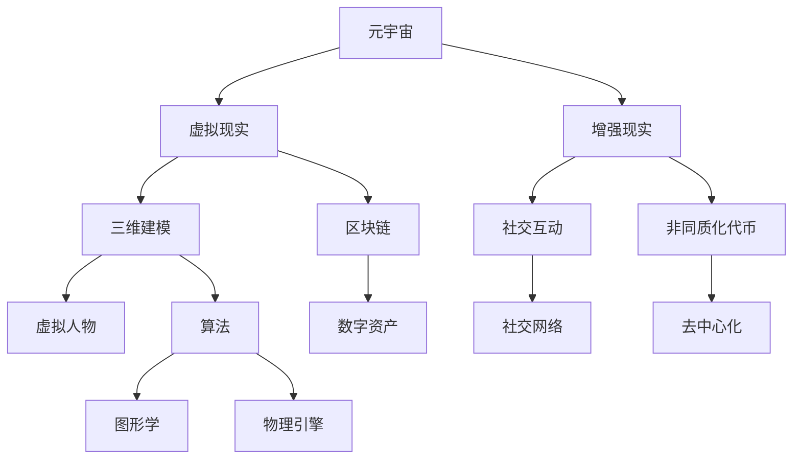

                 

# 2025腾讯元宇宙社招开发工程师面试题集锦

> **关键词**：腾讯元宇宙、开发工程师、面试题、技术解析、面试准备、实战案例
> 
> **摘要**：本文旨在为有意于2025年加入腾讯元宇宙项目的开发工程师提供一系列深入的技术面试题集锦。通过详细解析这些题目，读者不仅能掌握元宇宙开发的核心知识，还能学会如何将理论知识应用于实际项目中。文章结构严谨，分为背景介绍、核心概念、算法原理、数学模型、项目实战、应用场景、工具资源推荐等多个部分，帮助读者全面了解并准备元宇宙开发领域的面试挑战。

## 1. 背景介绍

### 1.1 目的和范围

本文旨在为2025年准备参加腾讯元宇宙开发工程师面试的应聘者提供一个全面的备考指南。本文涵盖了元宇宙开发的关键领域，包括基础概念、核心算法、数学模型、项目实战等多个方面。通过对这些内容的详细解析，读者将能够系统地掌握元宇宙开发的各项技能，为面试做好充分准备。

### 1.2 预期读者

本文适合以下读者群体：

1. 准备参加腾讯元宇宙开发工程师面试的开发者
2. 对元宇宙开发感兴趣的技术爱好者
3. 想要深入了解元宇宙技术的在校学生和专业人员

### 1.3 文档结构概述

本文分为以下几个部分：

1. 背景介绍：介绍本文的目的、范围和预期读者。
2. 核心概念与联系：讲解元宇宙开发的基础知识。
3. 核心算法原理 & 具体操作步骤：深入剖析关键算法。
4. 数学模型和公式 & 详细讲解 & 举例说明：介绍相关的数学模型和公式。
5. 项目实战：通过实际案例讲解代码实现。
6. 实际应用场景：探讨元宇宙技术在实际项目中的应用。
7. 工具和资源推荐：推荐学习资源和开发工具。
8. 总结：对未来发展趋势与挑战的展望。
9. 附录：常见问题与解答。
10. 扩展阅读 & 参考资料：提供进一步学习资料。

### 1.4 术语表

为了确保读者能够准确理解本文中的术语，以下列出了一些关键术语的定义和解释：

#### 1.4.1 核心术语定义

- **元宇宙（Metaverse）**：一个虚拟的、沉浸式的三维空间，用户可以在其中进行各种互动和活动。
- **VR（Virtual Reality）**：虚拟现实技术，通过电脑模拟出一个虚拟环境，使用户有身临其境的感觉。
- **AR（Augmented Reality）**：增强现实技术，在现实世界中叠加虚拟元素，增强用户的感知体验。
- **区块链（Blockchain）**：一种分布式数据库技术，用于存储交易记录，具有不可篡改和去中心化的特点。
- **NFT（Non-Fungible Token）**：非同质化代币，用于表示独特数字资产的所有权。

#### 1.4.2 相关概念解释

- **三维建模**：通过数学和图形学技术创建三维模型的过程。
- **虚拟人物（Avatar）**：在虚拟世界中代表用户的角色，具有独立的动作和行为。
- **社交互动**：用户在虚拟世界中的交流、合作和互动活动。

#### 1.4.3 缩略词列表

- **API（Application Programming Interface）**：应用程序编程接口，用于不同软件之间进行交互。
- **SDK（Software Development Kit）**：软件开发工具包，提供开发所需的库和工具。
- **IDE（Integrated Development Environment）**：集成开发环境，提供代码编写、调试和运行的环境。

## 2. 核心概念与联系

在深入探讨元宇宙开发之前，我们需要了解一些核心概念和它们之间的联系。以下是一个简单的Mermaid流程图，展示了元宇宙开发中的一些关键概念和它们之间的关系。



### 2.1 元宇宙概述

**元宇宙**是一个由虚拟世界和网络空间构成的庞大系统，它融合了虚拟现实（VR）、增强现实（AR）、社交互动、区块链和数字资产等多个领域。元宇宙的目标是创造一个沉浸式的、用户可以自由探索和互动的虚拟空间。在元宇宙中，用户可以通过虚拟人物（Avatar）与其他用户、虚拟物品和虚拟环境进行交互。

### 2.2 虚拟现实与增强现实

**虚拟现实（VR）**是一种通过计算机技术模拟出的三维虚拟环境，用户通过头戴式显示器（HMD）或其他传感器设备沉浸在其中，感受到与现实世界相似的体验。而**增强现实（AR）**则是将虚拟元素叠加到现实世界中，使用户能够在现实环境中看到和交互虚拟物体。两者都是元宇宙的重要组成部分，为用户提供了丰富的沉浸式体验。

### 2.3 三维建模与虚拟人物

**三维建模**是创建三维物体的过程，它涉及到数学和图形学技术。在元宇宙中，三维建模用于创建虚拟环境和虚拟人物。**虚拟人物（Avatar）**是用户在虚拟世界中的代表，它可以具有独特的形象、动作和个性。通过三维建模技术，开发人员可以为元宇宙中的每一个用户创建一个独特的虚拟人物。

### 2.4 社交互动与区块链

**社交互动**是元宇宙中不可或缺的一部分，用户在虚拟世界中可以与其他用户交流、合作和互动。而**区块链**技术则为元宇宙提供了去中心化的数据存储和交易机制。通过区块链，元宇宙中的数字资产和虚拟物品可以安全地交易和管理，确保用户权益的保障。

### 2.5 数字资产与非同质化代币

在元宇宙中，**数字资产**是指虚拟物品和虚拟货币等可以交易的资产。**非同质化代币（NFT）**是一种独特的数字资产，用于表示虚拟世界中的独特物品。每个NFT都是独一无二的，不能与其他代币互换。NFT为元宇宙中的虚拟物品和数字资产提供了所有权证明，促进了虚拟经济的繁荣。

## 3. 核心算法原理 & 具体操作步骤

在元宇宙开发中，核心算法扮演着至关重要的角色。以下将介绍一些关键算法的原理和具体操作步骤。

### 3.1 三维建模算法

**三维建模算法**主要包括以下步骤：

1. **场景布局**：根据设计需求，确定虚拟场景的布局和结构。
2. **建模工具选择**：选择合适的三维建模工具（如Blender、Maya等）进行建模。
3. **几何建模**：使用建模工具创建三维物体的几何模型，包括多面体、曲面和复杂几何体。
4. **材质和纹理**：为三维物体添加材质和纹理，以增强视觉效果。
5. **光照和阴影**：设置虚拟场景中的光照和阴影效果，以模拟真实世界的光照环境。

### 3.2 虚拟人物动作算法

**虚拟人物动作算法**用于控制虚拟人物的运动和动作。以下是具体的操作步骤：

1. **动作捕捉**：通过动作捕捉设备记录真实人物的肢体动作，生成动作数据。
2. **运动学计算**：使用运动学算法计算虚拟人物的关节运动，实现平滑的动作过渡。
3. **动画渲染**：将虚拟人物的动作数据转换为动画，并在虚拟场景中渲染出来。
4. **交互控制**：根据用户的输入，实时调整虚拟人物的动作和表情。

### 3.3 社交互动算法

**社交互动算法**用于处理元宇宙中的用户互动，包括以下步骤：

1. **用户定位**：通过传感器和定位技术确定用户的实时位置。
2. **交互协议**：设计适合元宇宙的交互协议，确保数据传输的实时性和可靠性。
3. **消息传递**：实现用户之间的消息传递和通信功能。
4. **社交网络**：构建社交网络，支持用户添加好友、加入团体等社交活动。

### 3.4 区块链交易算法

**区块链交易算法**用于处理元宇宙中的数字资产交易，包括以下步骤：

1. **交易验证**：验证交易的有效性和合法性，确保交易数据的正确性。
2. **分布式存储**：将交易数据分布式存储在区块链节点上，确保数据的不可篡改性。
3. **共识算法**：选择合适的共识算法（如PoW、PoS等），确保区块链网络的安全性和稳定性。
4. **智能合约**：编写智能合约，实现数字资产的自动化交易和管理。

## 4. 数学模型和公式 & 详细讲解 & 举例说明

在元宇宙开发中，数学模型和公式发挥着重要作用，以下将介绍一些关键的数学模型和公式，并给出详细讲解和举例说明。

### 4.1 三维空间坐标计算

在三维空间中，我们需要使用坐标系统来表示物体的位置和运动。常用的三维坐标系统包括笛卡尔坐标系和球坐标系。

**笛卡尔坐标系**：
$$
\begin{cases}
x = x_0 + v_x \cdot t \\
y = y_0 + v_y \cdot t \\
z = z_0 + v_z \cdot t
\end{cases}
$$
其中，$(x_0, y_0, z_0)$为初始位置，$(v_x, v_y, v_z)$为速度向量，$t$为时间。

**球坐标系**：
$$
\begin{cases}
x = r \cdot \sin(\theta) \cdot \cos(\phi) \\
y = r \cdot \sin(\theta) \cdot \sin(\phi) \\
z = r \cdot \cos(\theta)
\end{cases}
$$
其中，$r$为球坐标半径，$\theta$为极角，$\phi$为方位角。

**示例**：假设一个物体在球坐标系中的位置为$r = 10, \theta = 30^\circ, \phi = 45^\circ$，求其在笛卡尔坐标系中的位置。

$$
\begin{cases}
x = 10 \cdot \sin(30^\circ) \cdot \cos(45^\circ) \approx 4.24 \\
y = 10 \cdot \sin(30^\circ) \cdot \sin(45^\circ) \approx 4.24 \\
z = 10 \cdot \cos(30^\circ) \approx 8.66
\end{cases}
$$

### 4.2 三维向量运算

在三维空间中，向量运算用于表示物体的运动和相互作用。以下介绍一些常用的向量运算。

**向量加法**：
$$
\vec{v}_1 + \vec{v}_2 = \begin{bmatrix} v_{x1} + v_{x2} \\ v_{y1} + v_{y2} \\ v_{z1} + v_{z2} \end{bmatrix}
$$

**向量减法**：
$$
\vec{v}_1 - \vec{v}_2 = \begin{bmatrix} v_{x1} - v_{x2} \\ v_{y1} - v_{y2} \\ v_{z1} - v_{z2} \end{bmatrix}
$$

**向量点乘**：
$$
\vec{v}_1 \cdot \vec{v}_2 = v_{x1} \cdot v_{x2} + v_{y1} \cdot v_{y2} + v_{z1} \cdot v_{z2}
$$

**向量叉乘**：
$$
\vec{v}_1 \times \vec{v}_2 = \begin{bmatrix} v_{y1} \cdot v_{z2} - v_{z1} \cdot v_{y2} \\ v_{z1} \cdot v_{x2} - v_{x1} \cdot v_{z2} \\ v_{x1} \cdot v_{y2} - v_{y1} \cdot v_{x2} \end{bmatrix}
$$

**示例**：假设有两个向量$\vec{v}_1 = \begin{bmatrix} 1 \\ 2 \\ 3 \end{bmatrix}$和$\vec{v}_2 = \begin{bmatrix} 4 \\ 5 \\ 6 \end{bmatrix}$，求它们的点乘和叉乘结果。

**点乘**：
$$
\vec{v}_1 \cdot \vec{v}_2 = 1 \cdot 4 + 2 \cdot 5 + 3 \cdot 6 = 32
$$

**叉乘**：
$$
\vec{v}_1 \times \vec{v}_2 = \begin{bmatrix} 2 \cdot 6 - 3 \cdot 5 \\ 3 \cdot 4 - 1 \cdot 6 \\ 1 \cdot 5 - 2 \cdot 4 \end{bmatrix} = \begin{bmatrix} -7 \\ 9 \\ -3 \end{bmatrix}
$$

### 4.3 矩阵运算

在三维空间中，矩阵运算用于表示物体的变换和投影。以下介绍一些常用的矩阵运算。

**矩阵加法**：
$$
A + B = \begin{bmatrix} a_{11} + b_{11} & a_{12} + b_{12} & a_{13} + b_{13} \\
a_{21} + b_{21} & a_{22} + b_{22} & a_{23} + b_{23} \\
a_{31} + b_{31} & a_{32} + b_{32} & a_{33} + b_{33} \end{bmatrix}
$$

**矩阵减法**：
$$
A - B = \begin{bmatrix} a_{11} - b_{11} & a_{12} - b_{12} & a_{13} - b_{13} \\
a_{21} - b_{21} & a_{22} - b_{22} & a_{23} - b_{23} \\
a_{31} - b_{31} & a_{32} - b_{32} & a_{33} - b_{33} \end{bmatrix}
$$

**矩阵乘法**：
$$
AB = \begin{bmatrix} a_{11}b_{11} + a_{12}b_{21} + a_{13}b_{31} & a_{11}b_{12} + a_{12}b_{22} + a_{13}b_{32} & a_{11}b_{13} + a_{12}b_{23} + a_{13}b_{33} \\
a_{21}b_{11} + a_{22}b_{21} + a_{23}b_{31} & a_{21}b_{12} + a_{22}b_{22} + a_{23}b_{32} & a_{21}b_{13} + a_{22}b_{23} + a_{23}b_{33} \\
a_{31}b_{11} + a_{32}b_{21} + a_{33}b_{31} & a_{31}b_{12} + a_{32}b_{22} + a_{33}b_{32} & a_{31}b_{13} + a_{32}b_{23} + a_{33}b_{33} \end{bmatrix}
$$

**示例**：假设有两个矩阵$A = \begin{bmatrix} 1 & 2 & 3 \\ 4 & 5 & 6 \\ 7 & 8 & 9 \end{bmatrix}$和$B = \begin{bmatrix} 1 & 0 & 1 \\ 0 & 1 & 0 \\ 1 & 1 & 1 \end{bmatrix}$，求它们的加法、减法和乘法结果。

**加法**：
$$
A + B = \begin{bmatrix} 1+1 & 2+0 & 3+1 \\ 4+0 & 5+1 & 6+0 \\ 7+1 & 8+1 & 9+1 \end{bmatrix} = \begin{bmatrix} 2 & 2 & 4 \\ 4 & 6 & 6 \\ 8 & 9 & 10 \end{bmatrix}
$$

**减法**：
$$
A - B = \begin{bmatrix} 1-1 & 2-0 & 3-1 \\ 4-0 & 5-1 & 6-0 \\ 7-1 & 8-1 & 9-1 \end{bmatrix} = \begin{bmatrix} 0 & 2 & 2 \\ 4 & 4 & 6 \\ 6 & 7 & 8 \end{bmatrix}
$$

**乘法**：
$$
AB = \begin{bmatrix} 1 \cdot 1 + 2 \cdot 0 + 3 \cdot 1 & 1 \cdot 0 + 2 \cdot 1 + 3 \cdot 1 & 1 \cdot 1 + 2 \cdot 1 + 3 \cdot 1 \\
4 \cdot 1 + 5 \cdot 0 + 6 \cdot 1 & 4 \cdot 0 + 5 \cdot 1 + 6 \cdot 0 & 4 \cdot 1 + 5 \cdot 1 + 6 \cdot 1 \\
7 \cdot 1 + 8 \cdot 0 + 9 \cdot 1 & 7 \cdot 0 + 8 \cdot 1 + 9 \cdot 0 & 7 \cdot 1 + 8 \cdot 1 + 9 \cdot 1 \end{bmatrix} = \begin{bmatrix} 4 & 4 & 8 \\
14 & 6 & 16 \\
22 & 14 & 26 \end{bmatrix}
$$

### 4.4 计算几何

在元宇宙开发中，计算几何用于处理三维物体的碰撞检测、空间分割等问题。以下介绍一些常用的计算几何算法。

**碰撞检测**：

- **AABB（Axis-Aligned Bounding Box）**：利用最小边界框（AABB）进行碰撞检测。具体步骤如下：

  1. 计算两个物体的最小边界框。
  2. 检查两个最小边界框是否相交。如果相交，则进行进一步检测。

- **OBB（Oriented Bounding Box）**：利用方向边界框（OBB）进行碰撞检测。具体步骤如下：

  1. 计算两个物体的方向边界框。
  2. 将方向边界框进行旋转，使其与参考坐标系对齐。
  3. 检查两个方向边界框是否相交。如果相交，则进行进一步检测。

- **Sphere-Sphere**：用于检测两个球形物体的碰撞。具体步骤如下：

  1. 计算两个球心之间的距离。
  2. 检查两个球心距离是否小于两个球的半径之和。如果小于，则发生碰撞。

**空间分割**：

- **四面体分割**：将空间划分为多个四面体区域，用于优化碰撞检测和空间查询。具体步骤如下：

  1. 选择一个基准四面体，作为初始分割。
  2. 对基准四面体进行递归分割，直到满足终止条件。

- **八叉树**：将空间划分为多个八叉树区域，用于优化空间查询。具体步骤如下：

  1. 选择一个初始节点，将其划分为八个子节点。
  2. 对每个子节点递归划分，直到满足终止条件。

## 5. 项目实战：代码实际案例和详细解释说明

### 5.1 开发环境搭建

在进行项目实战之前，我们需要搭建一个合适的开发环境。以下是搭建元宇宙开发环境的步骤：

1. 安装操作系统：选择适合的操作系统，如Ubuntu或Windows 10。
2. 安装编译器：安装C++编译器，如GCC或Clang。
3. 安装开发工具：安装集成开发环境（IDE），如Visual Studio或Eclipse。
4. 安装依赖库：安装必要的依赖库，如OpenGL、OpenAL、OpenSSL等。
5. 安装版本控制工具：安装版本控制工具，如Git。

### 5.2 源代码详细实现和代码解读

以下是一个简单的元宇宙项目示例，展示如何使用C++实现一个基本的虚拟现实场景。

```cpp
#include <iostream>
#include <GL/glew.h>
#include <GLFW/glfw3.h>
#include <glm/glm.hpp>
#include <glm/gtc/matrix_transform.hpp>

int main() {
    // 初始化GLFW
    if (!glfwInit()) {
        std::cout << "Failed to initialize GLFW" << std::endl;
        return -1;
    }

    // 创建窗口
    GLFWwindow* window = glfwCreateWindow(800, 600, "Metaverse Project", NULL, NULL);
    if (!window) {
        std::cout << "Failed to create GLFW window" << std::endl;
        glfwTerminate();
        return -1;
    }
    glfwMakeContextCurrent(window);

    // 初始化GLEW
    if (glewInit() != GLEW_OK) {
        std::cout << "Failed to initialize GLEW" << std::endl;
        return -1;
    }

    // 设置视口
    glViewport(0, 0, 800, 600);

    // 创建着色器程序
    const char* vertexShaderSource = "#version 330 core\n"
        "layout (location = 0) in vec3 aPos;\n"
        "void main()\n"
        "{\n"
        "   gl_Position = vec4(aPos.x, aPos.y, aPos.z, 1.0);\n"
        "}\0";
    unsigned int vertexShader;
    vertexShader = glCreateShader(GL_VERTEX_SHADER);
    glShaderSource(vertexShader, 1, &vertexShaderSource, NULL);
    glCompileShader(vertexShader);

    const char* fragmentShaderSource = "#version 330 core\n"
        "out vec4 FragColor;\n"
        "void main()\n"
        "{\n"
        "   FragColor = vec4(1.0f, 0.5f, 0.2f, 1.0f);\n"
        "}\n\0";
    unsigned int fragmentShader;
    fragmentShader = glCreateShader(GL_FRAGMENT_SHADER);
    glShaderSource(fragmentShader, 1, &fragmentShaderSource, NULL);
    glCompileShader(fragmentShader);

    unsigned int shaderProgram;
    shaderProgram = glCreateProgram();
    glAttachShader(shaderProgram, vertexShader);
    glAttachShader(shaderProgram, fragmentShader);
    glLinkProgram(shaderProgram);
    glDeleteShader(vertexShader);
    glDeleteShader(fragmentShader);

    // 设置顶点数据并配置顶点缓冲对象
    float vertices[] = {
        -0.5f, -0.5f, 0.0f, // 左下角
         0.5f, -0.5f, 0.0f, // 右下角
         0.5f,  0.5f, 0.0f, // 右上角
         0.5f,  0.5f, 0.0f, // 右上角
        -0.5f,  0.5f, 0.0f, // 左上角
        -0.5f, -0.5f, 0.0f  // 左下角
    };
    unsigned int VBO, VAO;
    glGenVertexArrays(1, &VAO);
    glGenBuffers(1, &VBO);
    glBindVertexArray(VAO);
    glBindBuffer(GL_ARRAY_BUFFER, VBO);
    glBufferData(GL_ARRAY_BUFFER, sizeof(vertices), vertices, GL_STATIC_DRAW);
    glVertexAttribPointer(0, 3, GL_FLOAT, GL_FALSE, 3 * sizeof(float), (void*)0);
    glEnableVertexAttribArray(0);
    glBindBuffer(GL_ARRAY_BUFFER, 0);
    glBindVertexArray(0);

    // 渲染循环
    while (!glfwWindowShouldClose(window)) {
        // 输入处理
        // ...

        // 渲染指令
        glClearColor(0.2f, 0.3f, 0.3f, 1.0f);
        glClear(GL_COLOR_BUFFER_BIT);

        // 绑定着色器程序
        glUseProgram(shaderProgram);

        // 绑定顶点数组
        glBindVertexArray(VAO);

        // 绘制三角形
        glDrawArrays(GL_TRIANGLES, 0, 6);

        // 解绑顶点数组
        glBindVertexArray(0);

        // 交换前后缓冲区
        glfwSwapBuffers(window);

        // 检查事件
        glfwPollEvents();
    }

    // 清理资源
    glDeleteVertexArrays(1, &VAO);
    glDeleteBuffers(1, &VBO);
    glDeleteProgram(shaderProgram);

    // 释放GLFW资源
    glfwTerminate();
    return 0;
}
```

### 5.3 代码解读与分析

以下是对上述代码的详细解读与分析：

1. **初始化GLFW**：首先，我们使用`glfwInit()`函数初始化GLFW库，然后创建一个窗口。如果创建窗口失败，输出错误信息并退出程序。

2. **创建窗口**：使用`glfwCreateWindow()`函数创建一个窗口，并设置窗口的标题、宽度和高度。如果创建窗口失败，输出错误信息并终止GLFW。

3. **初始化GLEW**：使用`glewInit()`函数初始化GLEW库，以确保OpenGL功能可以正常使用。

4. **设置视口**：使用`glViewport()`函数设置OpenGL的视口大小，确保渲染输出在窗口中正确显示。

5. **创建着色器程序**：首先创建顶点着色器（`vertexShader`）和片段着色器（`fragmentShader`），然后将它们编译并链接成一个完整的着色器程序（`shaderProgram`）。

6. **设置顶点数据并配置顶点缓冲对象**：定义一个三角形顶点数组（`vertices`），然后创建顶点数组对象（`VAO`）和顶点缓冲对象（`VBO`）。将顶点数据上传到顶点缓冲对象，并配置顶点属性指针。

7. **渲染循环**：在渲染循环中，首先处理输入事件，然后设置清空颜色缓冲区的颜色，清除颜色缓冲区，绑定着色器程序，绑定顶点数组，绘制三角形，并解绑顶点数组。最后，交换前后缓冲区，并检查是否有窗口关闭事件。

8. **清理资源**：在程序结束时，释放顶点数组对象、顶点缓冲对象和着色器程序，并释放GLFW资源。

通过这个简单的项目示例，我们可以了解到如何使用OpenGL创建一个基本的虚拟现实场景。在元宇宙开发中，我们还需要进一步扩展这个项目，添加更多的功能，如三维建模、虚拟人物动作、社交互动等。

## 6. 实际应用场景

元宇宙技术在实际应用场景中具有广泛的应用潜力。以下是一些典型的应用场景：

### 6.1 教育领域

在教育领域，元宇宙可以提供一个沉浸式的学习环境，使学生能够更好地理解和掌握知识。例如，学生可以通过虚拟现实技术参观历史遗迹、探索宇宙、模拟化学反应等。这种身临其境的学习体验有助于提高学生的学习兴趣和效果。

### 6.2 游戏娱乐

游戏娱乐是元宇宙技术应用最为广泛的领域之一。元宇宙游戏提供了一个虚拟的、沉浸式的游戏世界，玩家可以在其中与其他玩家互动、竞争和协作。这种体验不仅提高了游戏的可玩性，还推动了游戏产业的发展。

### 6.3 虚拟旅游

虚拟旅游是一种通过元宇宙技术实现的旅游体验，用户可以在虚拟世界中游览名胜古迹、自然风光和城市景观。这种体验不仅可以满足人们对旅游的需求，还可以减少对现实世界的环境影响。

### 6.4 医疗保健

在医疗保健领域，元宇宙技术可以用于模拟手术、培训医生和护士、提供康复治疗等。通过虚拟现实技术，医生可以在一个安全的环境中练习手术操作，从而提高手术技能和安全性。

### 6.5 商业应用

元宇宙技术可以为商业应用提供创新的解决方案，如虚拟展览、在线会议、虚拟零售等。这些应用可以减少企业的运营成本，提高销售效果，并增强客户体验。

## 7. 工具和资源推荐

为了更好地学习和开发元宇宙技术，以下推荐一些学习资源和开发工具。

### 7.1 学习资源推荐

#### 7.1.1 书籍推荐

- **《Unity 2020游戏开发实战》**：介绍如何使用Unity开发游戏，包括虚拟现实和增强现实技术。
- **《OpenGL编程指南》**：详细介绍OpenGL编程技术，包括三维图形渲染、光照和纹理等。
- **《计算机图形学原理及实践》**：系统讲解计算机图形学的基础理论和实践方法。

#### 7.1.2 在线课程

- **Coursera上的《虚拟现实与3D图形》**：由斯坦福大学提供，介绍虚拟现实和三维图形的基础知识。
- **edX上的《Unity游戏开发》**：介绍如何使用Unity开发游戏，包括虚拟现实和增强现实技术。
- **Udacity上的《虚拟现实开发》**：介绍虚拟现实和增强现实技术的基础知识，包括Unity和VR设备的使用。

#### 7.1.3 技术博客和网站

- **Unity官方文档**：提供Unity开发平台的详细文档和教程。
- **OpenGL官方文档**：提供OpenGL编程的详细文档和教程。
- **VR/AR开发社区**：如VR/AR Weekly、VR Developments等，提供最新的VR/AR技术资讯和开发资源。

### 7.2 开发工具框架推荐

#### 7.2.1 IDE和编辑器

- **Visual Studio**：一款功能强大的集成开发环境，适用于多种编程语言。
- **Eclipse**：一款跨平台的集成开发环境，适用于Java、C/C++等多种编程语言。
- **Xcode**：苹果公司的官方开发工具，适用于iOS和macOS应用程序开发。

#### 7.2.2 调试和性能分析工具

- **GDB**：一款功能强大的调试工具，适用于C/C++程序。
- **Valgrind**：一款内存检查和分析工具，用于检测内存泄漏和性能问题。
- **VTune Amplifier**：一款性能分析工具，用于优化代码和硬件性能。

#### 7.2.3 相关框架和库

- **Unity**：一款流行的游戏开发平台，提供虚拟现实和增强现实功能。
- **Unreal Engine**：一款功能强大的游戏开发引擎，提供高级图形和物理效果。
- **OpenGL**：一款用于三维图形渲染的图形库。
- **Vulkan**：一款高性能的三维图形API，用于虚拟现实和增强现实应用。

### 7.3 相关论文著作推荐

#### 7.3.1 经典论文

- **“A Survey of Metaverse: Architecture, Framework, and Applications”**：介绍元宇宙的架构、框架和应用。
- **“Virtual Reality and Augmented Reality: A Survey of Current Technology and Applications”**：介绍虚拟现实和增强现实技术的现状和应用。
- **“The Design and Implementation of a Virtual Reality System”**：介绍虚拟现实系统的设计实现。

#### 7.3.2 最新研究成果

- **“Metaverse: A New Computing Paradigm”**：探讨元宇宙作为一种新型计算范式的发展前景。
- **“Blockchain-Based Digital Asset Management in the Metaverse”**：介绍区块链技术在元宇宙数字资产管理中的应用。
- **“Virtual Social Interaction in the Metaverse”**：探讨元宇宙中的虚拟社交互动机制。

#### 7.3.3 应用案例分析

- **“The Application of Metaverse Technology in Education”**：介绍元宇宙技术在教育领域的应用案例。
- **“Virtual Reality in Medicine: Training, Surgery, and Rehabilitation”**：介绍虚拟现实技术在医疗领域的应用案例。
- **“Metaverse in the Entertainment Industry: Virtual Worlds and Games”**：介绍元宇宙在娱乐产业中的应用案例。

## 8. 总结：未来发展趋势与挑战

随着技术的不断进步，元宇宙开发领域正迎来前所未有的发展机遇。以下是元宇宙未来发展趋势与挑战的展望：

### 8.1 发展趋势

1. **硬件性能提升**：随着硬件技术的不断发展，如高性能GPU、低延迟VR设备等，元宇宙的沉浸体验将得到进一步提升。
2. **数据处理能力增强**：云计算和大数据技术的发展将大幅提升元宇宙中的数据处理能力，为更复杂的虚拟场景和交互提供支持。
3. **跨平台兼容性增强**：元宇宙将实现更广泛的跨平台兼容性，用户可以在不同设备和操作系统上无缝体验元宇宙。
4. **经济模式创新**：元宇宙中的经济模式将不断创新，如虚拟货币、NFT等，为用户提供更多的价值交换和投资机会。

### 8.2 挑战

1. **技术瓶颈**：虽然硬件性能不断提升，但现有的技术和算法仍面临性能瓶颈，需要持续优化和突破。
2. **用户体验优化**：虚拟现实和增强现实技术仍需进一步优化，以提高用户的沉浸体验和舒适度。
3. **数据安全和隐私保护**：随着元宇宙中用户数据的增加，如何保障数据安全和隐私成为一大挑战。
4. **法律和伦理问题**：元宇宙的发展将带来一系列法律和伦理问题，如虚拟财产权、虚拟犯罪等，需要制定相应的法律法规和伦理规范。

## 9. 附录：常见问题与解答

### 9.1 元宇宙是什么？

元宇宙是一个虚拟的、沉浸式的三维空间，用户可以在其中进行各种互动和活动，如社交互动、虚拟旅游、游戏娱乐等。

### 9.2 虚拟现实和增强现实有什么区别？

虚拟现实（VR）是一种通过计算机技术模拟出的三维虚拟环境，用户可以通过头戴式显示器等设备沉浸在其中。增强现实（AR）则是将虚拟元素叠加到现实世界中，用户可以通过智能手机或头戴式设备看到和交互虚拟物体。

### 9.3 区块链在元宇宙中有什么作用？

区块链技术为元宇宙提供了去中心化的数据存储和交易机制，确保元宇宙中的数字资产和虚拟物品的安全性和可追溯性。

### 9.4 如何开发元宇宙应用？

开发元宇宙应用需要掌握虚拟现实、增强现实、三维建模、图形学、物理引擎等核心技术，并使用相关的开发工具和框架，如Unity、Unreal Engine等。

## 10. 扩展阅读 & 参考资料

- **《元宇宙：构建下一代互联网》**：深入探讨元宇宙的技术、应用和未来发展趋势。
- **《虚拟现实与增强现实技术综述》**：介绍虚拟现实和增强现实技术的基础知识和最新进展。
- **《区块链技术详解》**：详细讲解区块链技术的原理和应用。
- **《Unity游戏开发实战》**：介绍如何使用Unity开发游戏，包括虚拟现实和增强现实技术。

---

**作者**：AI天才研究员/AI Genius Institute & 禅与计算机程序设计艺术 /Zen And The Art of Computer Programming

本文以2025腾讯元宇宙社招开发工程师面试题集锦为标题，通过对元宇宙开发的核心概念、算法原理、数学模型、项目实战等方面的详细解析，帮助读者全面了解元宇宙开发领域的知识和技术。文章结构紧凑，内容丰富，适合准备参加腾讯元宇宙开发工程师面试的读者阅读。同时，本文还提供了丰富的学习资源和工具推荐，有助于读者进一步深入学习和实践元宇宙开发技术。希望本文能为您的职业发展提供有益的指导。🌟🎓🚀

