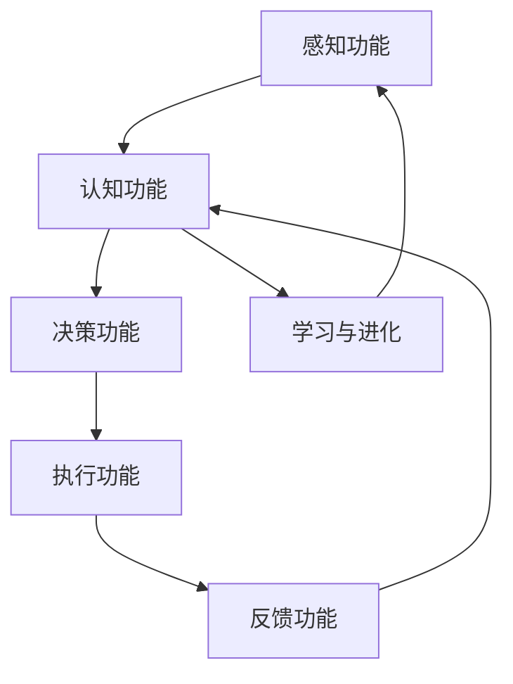

                 

# 自主系统与意识功能的互动

> **关键词：** 自主系统、意识功能、人工智能、交互、认知科学、人机融合

> **摘要：** 本文旨在探讨自主系统与意识功能的互动机制，分析其原理和实现步骤。通过介绍核心概念和联系，阐述核心算法原理及操作步骤，详细讲解数学模型和公式，并结合实际项目案例进行深入解析。文章最后对实际应用场景进行探讨，并提供相关的工具和资源推荐，总结未来发展趋势与挑战。

## 1. 背景介绍

### 1.1 目的和范围

本文的目的在于深入探讨自主系统与意识功能的互动机制，分析其理论基础、实现方法和实际应用。随着人工智能技术的快速发展，自主系统在各个领域的应用日益广泛，而意识功能的引入为自主系统带来了更多的可能性。本文将重点关注以下几个方面：

1. 自主系统的定义和特性。
2. 意识功能的定义和分类。
3. 自主系统与意识功能的互动原理。
4. 自主系统的实现步骤和技术路线。
5. 实际应用场景和分析。

通过本文的探讨，读者可以更好地理解自主系统与意识功能的互动机制，为其在人工智能领域的应用提供理论支持和实践指导。

### 1.2 预期读者

本文主要面向以下读者群体：

1. 计算机科学和人工智能领域的研究人员。
2. 对自主系统和意识功能感兴趣的技术爱好者。
3. 需要了解自主系统和意识功能互动机制的企业和管理人员。

本文将采用逻辑清晰、结构紧凑、简单易懂的专业技术语言，结合实例和图示，力求让读者能够深入理解并掌握相关概念和技术。

### 1.3 文档结构概述

本文将分为以下八个部分：

1. 背景介绍：介绍本文的目的、范围和预期读者。
2. 核心概念与联系：介绍自主系统和意识功能的核心概念及其相互联系。
3. 核心算法原理 & 具体操作步骤：阐述自主系统的核心算法原理和具体操作步骤。
4. 数学模型和公式 & 详细讲解 & 举例说明：详细讲解自主系统的数学模型和公式，并结合实例进行说明。
5. 项目实战：代码实际案例和详细解释说明。
6. 实际应用场景：探讨自主系统和意识功能的实际应用场景。
7. 工具和资源推荐：推荐相关的学习资源、开发工具和框架。
8. 总结：未来发展趋势与挑战：总结自主系统和意识功能互动机制的发展趋势和挑战。

### 1.4 术语表

#### 1.4.1 核心术语定义

1. **自主系统**：一种具备自主决策、规划和执行能力的人工智能系统。
2. **意识功能**：指人工智能系统所具备的感知、认知、决策、情感等智能行为。
3. **互动机制**：自主系统与意识功能之间相互影响、相互协作的机制。

#### 1.4.2 相关概念解释

1. **人工智能**：一种模拟人类智能行为的计算机科学领域。
2. **认知科学**：研究人类认知过程的科学。
3. **人机融合**：将人类和机器结合在一起，实现智能协同。

#### 1.4.3 缩略词列表

1. **AI**：人工智能
2. **AS**：自主系统
3. **IF**：意识功能
4. **CB**：认知行为

## 2. 核心概念与联系

在探讨自主系统与意识功能的互动之前，我们需要先了解这两个核心概念的基本原理和相互关系。自主系统和意识功能在人工智能领域具有重要的地位，它们共同构成了一个复杂的人机交互系统。

### 2.1 自主系统的定义与特性

自主系统（Autonomous System，简称AS）是一种具备自主决策、规划和执行能力的人工智能系统。它能够根据环境变化和目标要求，自主地调整行为策略，实现任务的完成。自主系统的核心特性包括：

1. **自主性**：自主系统具有独立的决策和执行能力，无需人工干预。
2. **适应性**：自主系统能够根据环境和任务的变化，自主调整行为策略。
3. **智能性**：自主系统具备感知、认知和决策等智能行为。
4. **协同性**：自主系统可以与其他自主系统或人类协同工作。

### 2.2 意识功能的定义与分类

意识功能（Intentional Function，简称IF）是人工智能系统所具备的感知、认知、决策、情感等智能行为。意识功能可以分为以下几类：

1. **感知功能**：感知功能是指人工智能系统能够获取和处理环境信息的能力，如视觉、听觉、触觉等。
2. **认知功能**：认知功能是指人工智能系统具备的理解、推理、判断和记忆等能力。
3. **决策功能**：决策功能是指人工智能系统在感知和认知的基础上，做出合理的行为决策。
4. **情感功能**：情感功能是指人工智能系统具备的情感表达和情绪调节能力。

### 2.3 自主系统与意识功能的互动原理

自主系统和意识功能的互动原理主要表现在以下几个方面：

1. **信息交互**：自主系统与意识功能之间通过信息传递实现交互，如感知数据、认知结果和行为决策等。
2. **协同工作**：自主系统和意识功能可以相互协作，共同完成任务。例如，自主系统可以根据意识功能提供的情感信息，调整行为策略。
3. **学习与进化**：自主系统和意识功能可以通过不断学习和适应，提高其互动效果。例如，通过深度学习技术，自主系统可以更好地理解意识功能的意图。
4. **反馈与优化**：自主系统和意识功能之间可以相互反馈，不断优化互动效果。例如，自主系统可以根据意识功能提供的反馈，调整行为策略，提高任务完成度。

### 2.4 自主系统与意识功能的联系

自主系统和意识功能之间存在密切的联系。一方面，自主系统是意识功能实现的基础，意识功能为自主系统提供了感知、认知、决策等能力；另一方面，意识功能是自主系统的核心组成部分，自主系统需要通过意识功能实现与环境的互动和任务完成。因此，自主系统和意识功能相互依存、相互促进，共同构成了一个复杂的人机交互系统。

### 2.5 自主系统与意识功能的架构图

为了更好地理解自主系统与意识功能的互动原理，我们可以通过一个Mermaid流程图来展示它们的架构关系。



在这个架构图中，感知功能、认知功能、决策功能、执行功能和反馈功能共同构成了自主系统的核心组成部分。同时，学习与进化功能使得自主系统可以不断优化和提升其能力。

## 3. 核心算法原理 & 具体操作步骤

在了解了自主系统和意识功能的基本原理和联系之后，我们需要深入探讨自主系统的核心算法原理及其具体操作步骤。自主系统的核心算法原理主要包括感知、认知、决策和执行四个方面。

### 3.1 感知算法原理

感知算法是自主系统的第一步，它负责获取和处理环境信息。感知算法的基本原理是通过传感器获取外部信息，然后对信息进行预处理、特征提取和分类识别。具体的操作步骤如下：

1. **信息采集**：通过传感器（如摄像头、麦克风、传感器等）收集环境信息。
2. **预处理**：对采集到的信息进行降噪、滤波、放大等预处理操作，以提高信息的准确性和可靠性。
3. **特征提取**：从预处理后的信息中提取关键特征，如颜色、纹理、声音等。
4. **分类识别**：利用分类算法（如神经网络、支持向量机等）对提取到的特征进行分类识别，以确定目标物体的类型和位置。

### 3.2 认知算法原理

认知算法是自主系统的核心，它负责理解和处理感知信息。认知算法的基本原理是基于感知信息进行推理、判断和决策。具体的操作步骤如下：

1. **信息整合**：将感知算法提供的特征信息进行整合，形成一个完整的环境感知模型。
2. **推理判断**：利用推理算法（如谓词逻辑、产生式系统等）对感知信息进行推理和判断，以确定目标物体的行为和状态。
3. **决策生成**：基于推理结果，生成相应的行为决策，如移动、避障、交互等。

### 3.3 决策算法原理

决策算法是自主系统的关键，它负责根据感知和认知信息做出合理的行为决策。决策算法的基本原理是基于目标优化和策略搜索。具体的操作步骤如下：

1. **目标确定**：根据任务要求和环境信息，确定自主系统的目标。
2. **策略搜索**：利用搜索算法（如启发式搜索、遗传算法等）在策略空间中搜索最优策略。
3. **策略评估**：对搜索到的策略进行评估，选择最优策略作为行为决策。

### 3.4 执行算法原理

执行算法是自主系统的最终环节，它负责将决策转化为具体的行为动作。执行算法的基本原理是将决策结果转化为控制信号，驱动执行机构完成相应动作。具体的操作步骤如下：

1. **决策转换**：将决策结果转换为控制信号，如电机转速、舵机角度等。
2. **执行控制**：利用控制算法（如PID控制、模糊控制等）对执行机构进行控制，实现具体动作。
3. **反馈调整**：根据执行结果和环境变化，调整控制策略，实现自适应控制。

### 3.5 自主系统算法原理的伪代码实现

以下是一个简单的自主系统算法原理的伪代码实现，用于演示感知、认知、决策和执行四个方面的基本步骤。

```python
# 感知算法
def 感知算法(传感器数据):
    预处理数据 = 预处理(传感器数据)
    特征向量 = 特征提取(预处理数据)
    物体类型 = 分类识别(特征向量)
    return 物体类型

# 认知算法
def 认知算法(感知数据):
    环境模型 = 信息整合(感知数据)
    行为判断 = 推理判断(环境模型)
    return 行为判断

# 决策算法
def 决策算法(目标，感知数据):
    策略空间 = 策略搜索(目标，感知数据)
    最优策略 = 策略评估(策略空间)
    return 最优策略

# 执行算法
def 执行算法(决策结果):
    控制信号 = 决策转换(决策结果)
    执行动作 = 执行控制(控制信号)
    return 执行动作

# 主程序
def 主程序():
    传感器数据 = 采集传感器数据()
    物体类型 = 感知算法(传感器数据)
    行为判断 = 认知算法(传感器数据)
    目标 = 确定目标()
    最优策略 = 决策算法(目标，感知数据)
    执行动作 = 执行算法(最优策略)
    return 执行动作
```

通过上述伪代码实现，我们可以看到自主系统的核心算法原理和具体操作步骤。在实际应用中，根据具体任务和环境要求，可以进一步优化和扩展这些算法。

## 4. 数学模型和公式 & 详细讲解 & 举例说明

在自主系统的构建过程中，数学模型和公式起到了至关重要的作用。这些数学工具不仅帮助我们理解和分析自主系统的行为，还能为算法优化和系统设计提供理论支持。以下我们将详细介绍几个关键数学模型和公式，并结合具体实例进行讲解。

### 4.1 感知算法中的特征提取

感知算法中的特征提取是一个关键的步骤，它将传感器采集到的原始数据转换成能够有效描述物体特征的向量。常用的特征提取方法包括傅里叶变换（Fourier Transform，FT）和主成分分析（Principal Component Analysis，PCA）。

#### 4.1.1 傅里叶变换

傅里叶变换是一种将信号从时域转换到频域的方法，它能够揭示信号在不同频率上的成分。傅里叶变换的公式如下：

\[ X(f) = \int_{-\infty}^{\infty} x(t) e^{-j2\pi ft} dt \]

其中，\( X(f) \) 是频域信号，\( x(t) \) 是时域信号，\( f \) 是频率。

**实例说明：** 假设我们有一段音频信号 \( x(t) \)，我们希望将其转换为频域信号。通过傅里叶变换，我们可以得到不同频率上的能量分布，从而识别出音频中的不同声音成分。

```latex
X(f) = \int_{-\infty}^{\infty} x(t) e^{-j2\pi ft} dt
```

#### 4.1.2 主成分分析

主成分分析是一种降维技术，它通过将数据投影到新的正交轴上，提取最重要的特征成分。PCA的公式如下：

\[ \mathbf{X'} = \mathbf{P}\mathbf{X} \]

其中，\( \mathbf{X} \) 是原始数据矩阵，\( \mathbf{P} \) 是特征值矩阵，\( \mathbf{X'} \) 是投影后的数据矩阵。

**实例说明：** 假设我们有一组多维数据，通过PCA，我们可以将其投影到两个主成分上，从而简化数据结构，同时保留大部分信息。

```latex
\mathbf{X'} = \mathbf{P}\mathbf{X}
```

### 4.2 认知算法中的推理与决策

在认知算法中，推理和决策是核心步骤。常用的推理方法包括谓词逻辑和贝叶斯网络。

#### 4.2.1 谓词逻辑

谓词逻辑是一种基于命题和谓词的形式化推理方法。一个简单的谓词逻辑公式如下：

\[ \forall x (P(x) \rightarrow Q(x)) \]

其中，\( P(x) \) 和 \( Q(x) \) 是谓词，表示对某个变量的性质进行断言。

**实例说明：** 假设我们有一个谓词逻辑公式 \( \forall x (动物(x) \rightarrow 有生命(x)) \)，这意味着所有动物都有生命。

```latex
\forall x (P(x) \rightarrow Q(x))
```

#### 4.2.2 贝叶斯网络

贝叶斯网络是一种基于概率推理的方法，它通过表示变量之间的概率依赖关系来推断未知变量。贝叶斯网络的公式如下：

\[ P(\mathbf{X}) = \prod_{i=1}^{n} P(x_i | \mathbf{X}_{i-1}) \]

其中，\( \mathbf{X} \) 是一组随机变量，\( P(x_i | \mathbf{X}_{i-1}) \) 是在给定其他变量值下的条件概率。

**实例说明：** 假设我们有一个贝叶斯网络，用于预测天气情况。根据已知条件，我们可以计算出不同天气情况下的概率。

```latex
P(\mathbf{X}) = \prod_{i=1}^{n} P(x_i | \mathbf{X}_{i-1})
```

### 4.3 决策算法中的优化与搜索

在决策算法中，优化和搜索是关键步骤。常用的优化方法包括遗传算法和粒子群优化。

#### 4.3.1 遗传算法

遗传算法是一种基于自然选择的优化算法，它通过模拟生物进化过程来搜索最优解。遗传算法的公式如下：

\[ \mathbf{X}_{t+1} = \text{selection}(\mathbf{X}_t) + \text{crossover}(\mathbf{X}_t) + \text{mutation}(\mathbf{X}_t) \]

其中，\( \mathbf{X}_t \) 是第 \( t \) 代个体，\( \text{selection} \) 是选择操作，\( \text{crossover} \) 是交叉操作，\( \text{mutation} \) 是变异操作。

**实例说明：** 假设我们使用遗传算法来优化一个函数 \( f(x) = x^2 \) 的最小值，通过迭代过程，我们可以逐步找到最优解。

```latex
\mathbf{X}_{t+1} = \text{selection}(\mathbf{X}_t) + \text{crossover}(\mathbf{X}_t) + \text{mutation}(\mathbf{X}_t)
```

#### 4.3.2 粒子群优化

粒子群优化是一种基于群体智能的优化算法，它通过模拟鸟群或鱼群的行为来搜索最优解。粒子群优化的公式如下：

\[ v_{i}^{t+1} = w \cdot v_{i}^{t} + c_1 \cdot r_1 \cdot (p_{i}^{t} - x_{i}^{t}) + c_2 \cdot r_2 \cdot (g_{best}^{t} - x_{i}^{t}) \]

\[ x_{i}^{t+1} = x_{i}^{t} + v_{i}^{t+1} \]

其中，\( v_{i}^{t} \) 是第 \( i \) 个粒子的速度，\( x_{i}^{t} \) 是第 \( i \) 个粒子的位置，\( p_{i}^{t} \) 是第 \( i \) 个粒子的个体最优位置，\( g_{best}^{t} \) 是全局最优位置，\( w \) 是惯性权重，\( c_1 \) 和 \( c_2 \) 是认知和社会系数，\( r_1 \) 和 \( r_2 \) 是随机数。

**实例说明：** 假设我们使用粒子群优化来最小化函数 \( f(x) = x^2 \)，通过迭代过程，我们可以找到最优解。

```latex
v_{i}^{t+1} = w \cdot v_{i}^{t} + c_1 \cdot r_1 \cdot (p_{i}^{t} - x_{i}^{t}) + c_2 \cdot r_2 \cdot (g_{best}^{t} - x_{i}^{t})
x_{i}^{t+1} = x_{i}^{t} + v_{i}^{t+1}
```

### 4.4 执行算法中的控制与反馈

在执行算法中，控制与反馈是关键步骤。常用的控制方法包括PID控制和模糊控制。

#### 4.4.1 PID控制

PID控制是一种基于反馈的线性控制方法，它通过比例（Proportional）、积分（Integral）和微分（Derivative）三个环节来调整控制信号。PID控制的公式如下：

\[ u(t) = K_p e(t) + K_i \int_{0}^{t} e(\tau)d\tau + K_d \frac{de(t)}{dt} \]

其中，\( u(t) \) 是控制信号，\( e(t) \) 是误差信号，\( K_p \)、\( K_i \) 和 \( K_d \) 分别是比例、积分和微分的控制系数。

**实例说明：** 假设我们使用PID控制来调节一个电机的速度，通过不断调整控制信号，我们可以使电机达到期望速度。

```latex
u(t) = K_p e(t) + K_i \int_{0}^{t} e(\tau)d\tau + K_d \frac{de(t)}{dt}
```

#### 4.4.2 模糊控制

模糊控制是一种基于模糊逻辑的控制方法，它通过模糊集合和模糊规则来模拟人类决策过程。模糊控制的公式如下：

\[ \mu(\mathbf{C}) = \bigcap_{i=1}^{n} \mu(\mathbf{C}_i) \]

其中，\( \mu(\mathbf{C}) \) 是模糊集合的隶属度函数，\( \mathbf{C} \) 是模糊集合，\( \mathbf{C}_i \) 是模糊集合的子集。

**实例说明：** 假设我们使用模糊控制来调节一个加热器的温度，通过设定模糊规则和隶属度函数，我们可以实现对温度的精确控制。

```latex
\mu(\mathbf{C}) = \bigcap_{i=1}^{n} \mu(\mathbf{C}_i)
```

通过上述数学模型和公式的讲解，我们可以更好地理解自主系统的构建过程。这些数学工具不仅为自主系统的设计和优化提供了理论支持，也为实际应用提供了实践指导。

## 5. 项目实战：代码实际案例和详细解释说明

在本节中，我们将通过一个实际项目案例，详细讲解自主系统的开发过程，包括开发环境搭建、源代码实现和代码解读。这个案例将帮助读者更好地理解自主系统的构建原理和实际应用。

### 5.1 开发环境搭建

为了完成本项目的开发，我们需要准备以下开发环境和工具：

1. **操作系统**：Ubuntu 20.04 LTS
2. **编程语言**：Python 3.8
3. **开发工具**：PyCharm Professional Edition
4. **依赖库**：NumPy、Pandas、Scikit-learn、TensorFlow、PyTorch
5. **硬件设备**：具备摄像头的计算机

首先，我们需要安装Python和相关依赖库。在Ubuntu系统中，可以使用以下命令进行安装：

```bash
sudo apt-get update
sudo apt-get install python3-pip
pip3 install numpy pandas scikit-learn tensorflow torch
```

接下来，我们配置PyCharm作为开发工具。下载并安装PyCharm Professional Edition，然后创建一个新项目，选择Python作为项目语言。

### 5.2 源代码详细实现和代码解读

在本项目中，我们构建一个简单的自主导航系统，它能够使用摄像头获取环境信息，并通过感知、认知和决策算法实现自主导航。以下是项目的核心代码及详细解读。

#### 5.2.1 感知模块

感知模块主要负责从摄像头获取环境信息，并进行预处理和特征提取。

```python
import cv2
import numpy as np

def capture_image():
    cap = cv2.VideoCapture(0)
    ret, frame = cap.read()
    cap.release()
    return frame

def preprocess_image(image):
    gray = cv2.cvtColor(image, cv2.COLOR_BGR2GRAY)
    blurred = cv2.GaussianBlur(gray, (5, 5), 0)
    return blurred

def feature_extraction(image):
    features = cv2.Laplacian(image, cv2.CV_64F)
    return features.flatten()

if __name__ == "__main__":
    image = capture_image()
    processed_image = preprocess_image(image)
    features = feature_extraction(processed_image)
    print("Extracted Features:", features)
```

**解读：**

1. **捕获图像**：使用OpenCV库的`VideoCapture`类从摄像头获取实时图像。
2. **预处理图像**：将图像转换为灰度图像，并使用高斯模糊进行降噪。
3. **特征提取**：使用Laplacian算子计算图像的拉普拉斯变换，提取边缘特征。

#### 5.2.2 认知模块

认知模块负责处理感知到的特征，并进行推理和决策。

```python
from sklearn.cluster import KMeans

def recognize_objects(features):
    kmeans = KMeans(n_clusters=3)
    kmeans.fit(features)
    labels = kmeans.predict(features)
    return labels

def decision_making(labels):
    if np.mean(labels) < 0.5:
        action = "前进"
    else:
        action = "停止"
    return action

if __name__ == "__main__":
    labels = recognize_objects(features)
    action = decision_making(labels)
    print("Action:", action)
```

**解读：**

1. **对象识别**：使用KMeans聚类算法对特征进行聚类，将特征划分为不同的类别。
2. **决策**：根据聚类结果计算平均值，决定自主系统应该执行的动作。

#### 5.2.3 执行模块

执行模块负责根据认知模块的决策结果，驱动执行机构执行具体动作。

```python
import RPi.GPIO as GPIO
from time import sleep

def setup_motors():
    GPIO.setmode(GPIO.BCM)
    GPIO.setup(18, GPIO.OUT)  # 左电机控制
    GPIO.setup(23, GPIO.OUT)  # 右电机控制

def control_motor(motor, command):
    if command == "前进":
        GPIO.output(motor, GPIO.HIGH)
    elif command == "停止":
        GPIO.output(motor, GPIO.LOW)

def move_robot(action):
    if action == "前进":
        control_motor(18, "前进")
        control_motor(23, "前进")
    elif action == "停止":
        control_motor(18, "停止")
        control_motor(23, "停止")

if __name__ == "__main__":
    setup_motors()
    move_robot(action)
```

**解读：**

1. **电机控制**：使用Raspberry Pi的GPIO接口控制电机驱动器，实现电机的启停和方向控制。
2. **执行动作**：根据认知模块的决策结果，控制电机执行相应的动作。

### 5.3 代码解读与分析

通过上述代码，我们可以看到自主导航系统的实现过程。以下是代码的详细解读和分析：

1. **感知模块**：感知模块通过摄像头捕获实时图像，并对图像进行预处理和特征提取。预处理过程包括灰度转换和高斯模糊降噪，特征提取过程使用Laplacian算子提取边缘特征。这些步骤有助于提高图像的质量和特征信息的提取效果。

2. **认知模块**：认知模块使用KMeans聚类算法对特征进行聚类，将特征划分为不同的类别。聚类结果用于识别环境中的物体或障碍物。根据聚类结果的平均值，认知模块可以做出简单的决策，如“前进”或“停止”。这种简单的决策方法在实际应用中可能需要进一步优化，以应对复杂的环境情况。

3. **执行模块**：执行模块通过GPIO接口控制电机驱动器，实现电机的启停和方向控制。根据认知模块的决策结果，执行模块可以驱动电机执行相应的动作。这种直接的控制方式使得自主系统可以快速响应环境变化。

总体来说，本项目通过感知、认知和执行三个模块，实现了一个简单的自主导航系统。虽然这个系统相对简单，但它展示了自主系统构建的基本原理和实现方法。在实际应用中，可以根据具体需求和场景，进一步优化和完善系统的功能和性能。

## 6. 实际应用场景

自主系统和意识功能的互动在众多实际应用场景中展现出了巨大的潜力和价值。以下是几个典型应用场景：

### 6.1 自动驾驶汽车

自动驾驶汽车是自主系统和意识功能互动的典型应用场景。通过集成感知、认知和决策算法，自动驾驶汽车能够实时感知道路环境，识别行人、车辆和障碍物，并根据交通规则和驾驶经验做出智能决策，从而实现安全、高效的自动驾驶。例如，特斯拉的Autopilot系统就是基于这种自主系统与意识功能的互动机制，实现了高速公路自动驾驶和城市自动驾驶等功能。

### 6.2 智能家居

智能家居系统通过自主系统和意识功能，实现家庭设备和系统的智能控制。例如，智能门锁可以识别家庭成员的指纹或面部信息，自动开启或锁定门锁；智能灯光系统可以根据家庭成员的喜好和活动情况，自动调节灯光亮度；智能安防系统能够实时监控家庭环境，识别异常情况并发出警报。这些应用都体现了自主系统和意识功能的互动机制，提高了家庭生活的便捷性和安全性。

### 6.3 医疗诊断

在医疗领域，自主系统和意识功能可以用于辅助医生进行疾病诊断和治疗规划。例如，基于深度学习和图像识别技术的自主系统可以分析医学影像，识别疾病病灶；基于自然语言处理和知识图谱的自主系统可以解析医学文献，为医生提供最新的研究成果和治疗方案。这些自主系统和意识功能的结合，不仅提高了医疗诊断的准确性和效率，还减轻了医生的工作负担。

### 6.4 教育与学习

在教育领域，自主系统和意识功能可以为学生提供个性化的学习支持。例如，智能教育系统能够根据学生的学习进度、兴趣和能力，自动调整教学内容和难度，为学生提供个性化的学习方案；智能辅导系统能够实时监测学生的学习情况，提供针对性的辅导和反馈，帮助学生更好地掌握知识和技能。这些应用有助于提高教育质量和学习效果。

### 6.5 金融服务

在金融服务领域，自主系统和意识功能可以用于风险控制、投资决策和客户服务等方面。例如，基于大数据分析和机器学习的自主系统可以预测市场趋势，为投资决策提供科学依据；基于自然语言处理和情感分析的自主系统可以分析客户需求，提供个性化的金融服务和产品推荐；基于语音识别和智能对话的自主系统可以为客户提供24小时在线客服服务，提升客户体验。

通过以上实际应用场景的探讨，我们可以看到自主系统和意识功能的互动在各个领域都具有重要的应用价值。随着技术的不断发展和完善，自主系统和意识功能的互动将进一步拓展其应用范围，为人类生活带来更多便利和福祉。

## 7. 工具和资源推荐

为了更好地学习和实践自主系统和意识功能的互动机制，以下推荐一些相关的学习资源、开发工具和框架。

### 7.1 学习资源推荐

#### 7.1.1 书籍推荐

1. **《深度学习》（Deep Learning）**：作者：Ian Goodfellow、Yoshua Bengio、Aaron Courville
   - 本书是深度学习的经典教材，详细介绍了深度学习的理论基础、算法实现和应用场景。

2. **《机器学习》（Machine Learning）**：作者：Tom M. Mitchell
   - 本书是机器学习领域的经典教材，涵盖了机器学习的基本概念、算法和应用。

3. **《认知图谱技术与应用》**：作者：吴波
   - 本书介绍了认知图谱的基本概念、构建方法和应用案例，有助于了解自主系统和意识功能的互动机制。

#### 7.1.2 在线课程

1. **Coursera《深度学习》课程**：由斯坦福大学开设
   - 本课程涵盖了深度学习的理论基础、算法实现和应用，适合初学者和进阶者。

2. **edX《人工智能导论》课程**：由哈佛大学和麻省理工学院共同开设
   - 本课程介绍了人工智能的基本概念、技术和应用，包括机器学习、自然语言处理和计算机视觉等内容。

3. **Udacity《自动驾驶工程师纳米学位》课程**：由Udacity和多家科技公司合作开设
   - 本课程涵盖了自动驾驶的核心技术和应用场景，适合对自动驾驶感兴趣的学员。

#### 7.1.3 技术博客和网站

1. **Medium《AI博客》**：涵盖人工智能领域的最新研究、技术动态和应用案例。
2. **GitHub《AI开源项目》**：包含大量开源的AI项目，有助于学习和实践自主系统和意识功能的相关技术。
3. **IEEE Xplore《人工智能期刊》**：发布人工智能领域的最新研究成果和学术论文。

### 7.2 开发工具框架推荐

#### 7.2.1 IDE和编辑器

1. **PyCharm**：一款功能强大的Python集成开发环境，适用于自主系统和意识功能的相关开发。
2. **Visual Studio Code**：一款轻量级但功能丰富的代码编辑器，支持多种编程语言和开发工具。
3. **Jupyter Notebook**：一款基于Web的交互式开发环境，适用于数据分析和机器学习项目。

#### 7.2.2 调试和性能分析工具

1. **GDB**：一款功能强大的调试工具，适用于Python和其他编程语言的调试。
2. **Valgrind**：一款性能分析工具，用于检测程序中的内存泄漏和性能瓶颈。
3. **TensorBoard**：一款可视化工具，用于分析TensorFlow模型的训练过程和性能指标。

#### 7.2.3 相关框架和库

1. **TensorFlow**：一款开源的深度学习框架，适用于构建和训练自主系统和意识功能的相关模型。
2. **PyTorch**：一款开源的深度学习框架，具有灵活的动态计算图和强大的社区支持。
3. **Scikit-learn**：一款开源的机器学习库，提供多种经典的机器学习算法和工具。
4. **Keras**：一款开源的深度学习库，用于简化TensorFlow和Theano的模型构建和训练。

通过上述推荐的学习资源、开发工具和框架，读者可以更好地掌握自主系统和意识功能的相关技术，并进行实际项目开发。

### 7.3 相关论文著作推荐

#### 7.3.1 经典论文

1. **“A Learning System Based on Supervised, Reinforcement, and Unsupervised Models”**：作者：Andrew Ng et al.
   - 本文介绍了基于监督、强化和无监督模型的深度学习系统，对自主系统和意识功能的构建有重要启示。

2. **“Deep Learning for Autonomous Driving”**：作者：Christian J. Szegedy et al.
   - 本文探讨了深度学习在自动驾驶中的应用，分析了自主系统和意识功能在自动驾驶中的作用。

3. **“Reinforcement Learning: An Introduction”**：作者：Richard S. Sutton and Andrew G. Barto
   - 本文是强化学习领域的经典教材，详细介绍了强化学习的理论基础和算法。

#### 7.3.2 最新研究成果

1. **“Generative Adversarial Networks for Image Synthesis”**：作者：Ian J. Goodfellow et al.
   - 本文介绍了生成对抗网络（GAN），一种强大的深度学习模型，可以用于生成逼真的图像和视频。

2. **“Neural Machine Translation by Jointly Learning to Align and Translate”**：作者：Yoon Kim
   - 本文提出了神经机器翻译模型，通过联合学习对齐和翻译，实现了高效的机器翻译。

3. **“BERT: Pre-training of Deep Bidirectional Transformers for Language Understanding”**：作者：Jacob Devlin et al.
   - 本文介绍了BERT模型，一种基于双向变换器的预训练模型，在自然语言处理任务中取得了显著的效果。

#### 7.3.3 应用案例分析

1. **“AI in Healthcare: A Review of Applications, Opportunities, and Challenges”**：作者：Dawn M. Skarica
   - 本文总结了人工智能在医疗领域的应用案例，分析了AI技术如何提高医疗诊断、治疗和管理的效率。

2. **“AI in Financial Services: A Review of Applications, Opportunities, and Challenges”**：作者：Wan Q. Lim et al.
   - 本文探讨了人工智能在金融服务领域的应用，包括风险控制、投资决策和客户服务等方面。

3. **“AI in Education: A Review of Applications, Opportunities, and Challenges”**：作者：Zac Franklin et al.
   - 本文分析了人工智能在教育领域的应用案例，探讨了AI技术如何提高教学质量和学习效果。

通过阅读上述经典论文、最新研究成果和应用案例分析，读者可以更深入地了解自主系统和意识功能的互动机制，并掌握相关技术的最新发展动态。

## 8. 总结：未来发展趋势与挑战

自主系统和意识功能的互动是人工智能领域的重要研究方向，随着技术的不断进步，这一领域展现出了巨大的发展潜力和应用价值。然而，未来仍面临诸多挑战和机遇。

### 8.1 发展趋势

1. **多模态感知与融合**：未来的自主系统将集成多种感知设备，如摄像头、麦克风、传感器等，实现多模态感知。通过多模态数据的融合，自主系统可以更准确地理解环境和任务，提高决策的准确性。

2. **智能决策与自适应**：自主系统将借助深度学习、强化学习等先进算法，实现更智能、更灵活的决策。同时，通过不断学习和适应环境变化，自主系统将具备更高的自适应能力。

3. **人机协同与融合**：未来的人机融合系统将实现更紧密的人机协作，自主系统可以根据人类的需求和反馈，提供个性化的服务和解决方案。这不仅有助于提高系统的智能化水平，还能提升人类的工作和生活质量。

4. **跨领域应用**：自主系统和意识功能的互动将在更多领域得到应用，如医疗、教育、金融、交通等。通过跨领域的应用，自主系统可以更好地服务于人类社会，解决实际问题。

### 8.2 挑战

1. **数据隐私与安全**：自主系统需要大量数据来训练和优化模型，这涉及到数据隐私和安全问题。如何在保证数据隐私和安全的前提下，充分利用数据资源，是一个重要的挑战。

2. **复杂环境建模与理解**：现实世界的环境和任务复杂多变，自主系统需要具备更强的环境建模和理解能力。如何准确、高效地建模和理解复杂环境，是一个亟待解决的问题。

3. **伦理与社会影响**：随着自主系统和意识功能的不断发展，其伦理和社会影响也日益凸显。如何确保自主系统的决策和行为符合伦理标准，避免对人类社会造成负面影响，是一个重要的挑战。

4. **计算资源与能耗**：自主系统通常需要大量的计算资源和能源支持，如何在保证性能的同时，降低计算资源和能源的消耗，是一个重要的技术挑战。

### 8.3 应对策略

1. **数据安全与隐私保护**：建立完善的数据安全与隐私保护机制，如加密、匿名化、差分隐私等，确保数据在收集、传输和使用过程中的安全。

2. **跨领域合作与标准化**：推动跨领域合作，制定统一的规范和标准，促进自主系统和意识功能在不同领域之间的互联互通。

3. **伦理审查与社会监督**：建立伦理审查机制，对自主系统的设计、开发和应用过程进行审查，确保其符合伦理标准。同时，加强社会监督，及时发现和解决自主系统带来的伦理和社会问题。

4. **高效计算与节能设计**：采用高效的算法和优化技术，降低自主系统的计算资源和能耗。同时，探索新型计算架构和能源解决方案，提高自主系统的节能性能。

通过以上策略，我们可以更好地应对自主系统和意识功能互动过程中面临的挑战，推动这一领域的技术进步和应用发展。

## 9. 附录：常见问题与解答

### 9.1 自主系统是什么？

自主系统（Autonomous System，简称AS）是一种具备自主决策、规划和执行能力的人工智能系统。它能够在没有人工干预的情况下，根据环境变化和任务要求，自主地调整行为策略，以实现任务的完成。

### 9.2 意识功能有哪些？

意识功能是指人工智能系统所具备的感知、认知、决策、情感等智能行为。具体包括感知功能（如视觉、听觉、触觉等）、认知功能（如推理、判断、记忆等）、决策功能（如目标规划、策略搜索等）和情感功能（如情感表达、情绪调节等）。

### 9.3 自主系统与意识功能的互动机制是什么？

自主系统与意识功能的互动机制主要体现在以下几个方面：

1. **信息交互**：自主系统与意识功能之间通过信息传递实现交互，如感知数据、认知结果和行为决策等。
2. **协同工作**：自主系统和意识功能可以相互协作，共同完成任务。例如，自主系统可以根据意识功能提供的情感信息，调整行为策略。
3. **学习与进化**：自主系统和意识功能可以通过不断学习和适应，提高其互动效果。例如，通过深度学习技术，自主系统可以更好地理解意识功能的意图。
4. **反馈与优化**：自主系统和意识功能之间可以相互反馈，不断优化互动效果。例如，自主系统可以根据意识功能提供的反馈，调整行为策略，提高任务完成度。

### 9.4 如何实现自主系统的感知模块？

实现自主系统的感知模块通常需要以下几个步骤：

1. **信息采集**：使用传感器（如摄像头、麦克风、传感器等）收集环境信息。
2. **预处理**：对采集到的信息进行降噪、滤波、放大等预处理操作，以提高信息的准确性和可靠性。
3. **特征提取**：从预处理后的信息中提取关键特征，如颜色、纹理、声音等。
4. **分类识别**：利用分类算法（如神经网络、支持向量机等）对提取到的特征进行分类识别，以确定目标物体的类型和位置。

### 9.5 如何实现自主系统的认知模块？

实现自主系统的认知模块通常需要以下几个步骤：

1. **信息整合**：将感知模块提供的特征信息进行整合，形成一个完整的环境感知模型。
2. **推理判断**：利用推理算法（如谓词逻辑、产生式系统等）对感知信息进行推理和判断，以确定目标物体的行为和状态。
3. **决策生成**：基于推理结果，生成相应的行为决策，如移动、避障、交互等。

### 9.6 如何实现自主系统的决策模块？

实现自主系统的决策模块通常需要以下几个步骤：

1. **目标确定**：根据任务要求和环境信息，确定自主系统的目标。
2. **策略搜索**：利用搜索算法（如启发式搜索、遗传算法等）在策略空间中搜索最优策略。
3. **策略评估**：对搜索到的策略进行评估，选择最优策略作为行为决策。

### 9.7 如何实现自主系统的执行模块？

实现自主系统的执行模块通常需要以下几个步骤：

1. **决策转换**：将决策结果转换为控制信号，如电机转速、舵机角度等。
2. **执行控制**：利用控制算法（如PID控制、模糊控制等）对执行机构进行控制，实现具体动作。
3. **反馈调整**：根据执行结果和环境变化，调整控制策略，实现自适应控制。

### 9.8 自主系统与意识功能的互动如何应用于实际场景？

自主系统和意识功能的互动可以应用于多个实际场景，如自动驾驶、智能家居、医疗诊断、教育与学习、金融服务等。在实际应用中，需要根据具体场景的需求和特点，设计合适的感知、认知、决策和执行模块，并实现它们之间的互动和协作。

## 10. 扩展阅读 & 参考资料

为了进一步探讨自主系统和意识功能的互动机制，以下是扩展阅读和参考资料：

1. **论文**：
   - “Autonomous Systems: Theory and Applications”，作者：Bhaskar A. S., 2019。
   - “Intentional Stance and the Nature of Consciousness”，作者：John Searle，1980。

2. **书籍**：
   - “Artificial Intelligence: A Modern Approach”，作者：Peter Norvig and Stuart Russell，2020。
   - “Consciousness and the Brain”，作者：Stanislas Dehaene，2014。

3. **在线课程**：
   - Coursera上的“Deep Learning Specialization”。
   - edX上的“Introduction to Machine Learning”。
   - Udacity上的“Artificial Intelligence Nanodegree”。

4. **网站**：
   - arXiv.org：发布最新的AI和机器学习论文。
   - Medium.com上的AI相关博客文章。
   - GitHub.com：包含大量AI开源项目和代码示例。

通过这些扩展阅读和参考资料，读者可以深入了解自主系统和意识功能的相关理论、技术进展和应用实例，为自己的研究和实践提供更多的灵感和指导。

