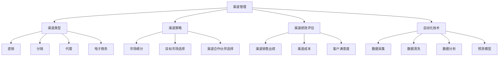

                 

# 自动化创业中的渠道管理策略

> **关键词：** 自动化、渠道管理、创业、策略、数据分析、技术实施

> **摘要：** 在自动化创业浪潮中，渠道管理是确保业务成功的关键环节。本文将从核心概念、算法原理、数学模型、实战案例、实际应用场景等多维度，深入探讨渠道管理策略的有效实施方法，帮助创业者优化渠道运营，提升业务效益。

## 1. 背景介绍

### 1.1 目的和范围

本文旨在为自动化创业企业提供一套完整的渠道管理策略，通过分析核心概念、算法原理、数学模型，结合实际案例，帮助创业者优化渠道运营，实现业务增长。

### 1.2 预期读者

- 初创企业创始人
- 渠道运营经理
- 技术决策者
- 对自动化创业感兴趣的读者

### 1.3 文档结构概述

本文分为十个部分：

1. 背景介绍
2. 核心概念与联系
3. 核心算法原理 & 具体操作步骤
4. 数学模型和公式 & 详细讲解 & 举例说明
5. 项目实战：代码实际案例和详细解释说明
6. 实际应用场景
7. 工具和资源推荐
8. 总结：未来发展趋势与挑战
9. 附录：常见问题与解答
10. 扩展阅读 & 参考资料

### 1.4 术语表

#### 1.4.1 核心术语定义

- **渠道管理**：企业为提升销售业绩，通过整合多种渠道资源，实现产品或服务的推广、销售和服务的全过程。
- **自动化**：利用计算机程序和技术，替代人工完成重复性、标准化的工作。
- **数据驱动**：依据数据分析结果，指导企业决策和业务运营。

#### 1.4.2 相关概念解释

- **渠道策略**：企业根据市场环境、自身资源，确定渠道开发、管理和优化的方向和原则。
- **客户关系管理（CRM）**：通过收集、分析和利用客户数据，提高客户满意度，实现客户价值的最大化。

#### 1.4.3 缩略词列表

- **CRM**：客户关系管理
- **ERP**：企业资源规划
- **API**：应用程序接口
- **SDK**：软件开发工具包

## 2. 核心概念与联系

渠道管理作为企业战略的重要组成部分，其核心概念包括：

1. **渠道类型**：直销、分销、代理、电子商务等。
2. **渠道策略**：市场细分、目标市场选择、渠道合作伙伴选择等。
3. **渠道绩效评估**：渠道销售业绩、渠道成本、客户满意度等。
4. **自动化技术**：数据采集、数据清洗、数据分析和预测模型等。

以下是渠道管理中的核心概念与联系 Mermaid 流程图：



## 3. 核心算法原理 & 具体操作步骤

渠道管理中的核心算法主要包括：

1. **渠道销售预测模型**：基于历史数据和当前市场环境，预测未来一段时间内的渠道销售业绩。
2. **渠道成本优化算法**：通过优化渠道资源配置，降低渠道运营成本。
3. **客户满意度分析算法**：分析渠道客户的满意度，为渠道策略调整提供依据。

以下是渠道销售预测模型的伪代码：

```python
def channel_sales_prediction(historical_data, current_environment):
    # 步骤1：数据预处理
    preprocessed_data = preprocess_data(historical_data, current_environment)

    # 步骤2：特征工程
    features = feature_engineering(preprocessed_data)

    # 步骤3：模型训练
    model = train_model(features)

    # 步骤4：销售预测
    predicted_sales = model.predict(features)

    return predicted_sales

def preprocess_data(data, environment):
    # 数据清洗、归一化、缺失值处理等
    pass

def feature_engineering(data):
    # 特征提取、特征选择等
    pass

def train_model(features):
    # 选择合适的机器学习模型进行训练
    pass
```

## 4. 数学模型和公式 & 详细讲解 & 举例说明

渠道管理中的数学模型主要包括：

1. **渠道利润模型**：用于计算渠道运营的利润。
2. **渠道覆盖模型**：用于评估渠道覆盖范围和深度。

渠道利润模型的公式为：

$$
\text{渠道利润} = \text{渠道收入} - \text{渠道成本}
$$

其中，渠道收入和渠道成本分别为：

$$
\text{渠道收入} = \text{销售额} \times \text{销售价格}
$$

$$
\text{渠道成本} = \text{渠道运营成本} + \text{渠道推广成本}
$$

举例说明：

假设某企业通过直销渠道和分销渠道销售产品，直销渠道销售额为 100 万元，销售价格为 1 万元/件；分销渠道销售额为 200 万元，销售价格为 0.8 万元/件。渠道运营成本为 10 万元，渠道推广成本为 5 万元。

计算直销渠道利润：

$$
\text{直销渠道利润} = 100 \times 1 - (10 + 5) = 85 \text{万元}
$$

计算分销渠道利润：

$$
\text{分销渠道利润} = 200 \times 0.8 - (10 + 5) = 140 \text{万元}
$$

## 5. 项目实战：代码实际案例和详细解释说明

### 5.1 开发环境搭建

本文使用 Python 作为编程语言，需安装以下环境：

1. Python 3.8+
2. Pandas
3. NumPy
4. Scikit-learn

安装命令：

```bash
pip install python==3.8
pip install pandas
pip install numpy
pip install scikit-learn
```

### 5.2 源代码详细实现和代码解读

以下是一个简单的渠道销售预测模型实现：

```python
import pandas as pd
import numpy as np
from sklearn.model_selection import train_test_split
from sklearn.ensemble import RandomForestRegressor
from sklearn.metrics import mean_absolute_error

# 步骤1：数据预处理
def preprocess_data(data):
    data['month'] = pd.to_datetime(data['date']).dt.month
    data['weekday'] = pd.to_datetime(data['date']).dt.weekday
    data = data.drop(['date'], axis=1)
    return data

# 步骤2：特征工程
def feature_engineering(data):
    data = pd.get_dummies(data, columns=['month', 'weekday'])
    return data

# 步骤3：模型训练
def train_model(features, labels):
    X_train, X_test, y_train, y_test = train_test_split(features, labels, test_size=0.2, random_state=42)
    model = RandomForestRegressor(n_estimators=100, random_state=42)
    model.fit(X_train, y_train)
    return model, X_test, y_test

# 步骤4：销售预测
def predict_sales(model, features):
    predicted_sales = model.predict(features)
    return predicted_sales

# 数据集加载
data = pd.read_csv('channel_sales_data.csv')

# 数据预处理
data = preprocess_data(data)

# 特征工程
features = feature_engineering(data)

# 模型训练
model, X_test, y_test = train_model(features, data['sales'])

# 销售预测
predicted_sales = predict_sales(model, X_test)

# 模型评估
mae = mean_absolute_error(y_test, predicted_sales)
print(f'Mean Absolute Error: {mae}')
```

### 5.3 代码解读与分析

1. **数据预处理**：将日期字段转换为月份和星期几，以便进行特征工程。
2. **特征工程**：将月份和星期几进行独热编码，增加模型的特征维度。
3. **模型训练**：使用随机森林回归模型进行训练。
4. **销售预测**：使用训练好的模型对测试集进行销售预测。
5. **模型评估**：计算预测销售与实际销售之间的平均绝对误差，评估模型性能。

## 6. 实际应用场景

渠道管理策略在实际应用中具有广泛的应用场景：

1. **电商平台**：通过渠道管理，实现多渠道整合，提高销售业绩。
2. **传统制造业**：通过渠道管理，优化销售渠道，降低渠道成本。
3. **服务行业**：通过渠道管理，提升客户满意度，实现客户价值的最大化。

## 7. 工具和资源推荐

### 7.1 学习资源推荐

#### 7.1.1 书籍推荐

- 《渠道管理：策略、流程与实践》
- 《大数据营销：数据驱动下的渠道管理》
- 《机器学习实战》

#### 7.1.2 在线课程

- Coursera 上的《数据科学基础》
- Udacity 上的《机器学习工程师纳米学位》
- edX 上的《大数据分析》

#### 7.1.3 技术博客和网站

- Medium 上的《数据科学与机器学习》
- 知乎专栏《渠道管理与数据分析》
- CSDN 上的《大数据与机器学习》

### 7.2 开发工具框架推荐

#### 7.2.1 IDE和编辑器

- PyCharm
- Visual Studio Code
- Jupyter Notebook

#### 7.2.2 调试和性能分析工具

- Python Debugger (pdb)
- Py-Spy 性能分析工具
- PyTorch Profiler

#### 7.2.3 相关框架和库

- Pandas
- NumPy
- Scikit-learn
- TensorFlow
- PyTorch

### 7.3 相关论文著作推荐

#### 7.3.1 经典论文

- 《渠道策略：理论、模型与实证研究》
- 《数据驱动渠道管理：理论与实践》
- 《机器学习在渠道管理中的应用研究》

#### 7.3.2 最新研究成果

- 《大数据背景下的渠道管理策略优化研究》
- 《基于深度学习的渠道销售预测模型研究》
- 《智能渠道管理系统的设计与实现》

#### 7.3.3 应用案例分析

- 《阿里巴巴：智能渠道管理的实践探索》
- 《华为：大数据驱动的渠道管理策略》
- 《京东：电商渠道管理的创新与实践》

## 8. 总结：未来发展趋势与挑战

渠道管理策略在未来将呈现以下发展趋势：

1. **智能化**：利用人工智能技术，实现渠道管理的自动化和智能化。
2. **数据化**：依托大数据分析，实现渠道管理的精细化运营。
3. **多元化**：整合多种渠道资源，实现渠道管理的多样化发展。

然而，渠道管理也面临以下挑战：

1. **技术挑战**：如何将先进技术有效应用于渠道管理，实现业务增长。
2. **数据挑战**：如何获取、处理和利用大量数据，为渠道管理提供有力支持。
3. **人才挑战**：如何培养和引进具备数据分析、渠道管理能力的人才。

## 9. 附录：常见问题与解答

1. **问题1：如何选择合适的渠道管理策略？**

解答：根据企业的市场环境、产品特性、资源状况等因素，选择适合的渠道管理策略。例如，对于新产品，可以选择直销渠道，快速获取市场份额。

2. **问题2：如何优化渠道成本？**

解答：通过数据分析，识别高成本、低效益的渠道，进行优化。例如，减少渠道层级，降低渠道运营成本。

3. **问题3：如何提升客户满意度？**

解答：通过渠道绩效评估，了解客户满意度，针对性地调整渠道策略。例如，提供个性化服务，提高客户满意度。

## 10. 扩展阅读 & 参考资料

- 《渠道管理：策略、流程与实践》
- 《大数据营销：数据驱动下的渠道管理》
- 《机器学习实战》
- Coursera 上的《数据科学基础》
- Udacity 上的《机器学习工程师纳米学位》
- edX 上的《大数据分析》
- 《渠道策略：理论、模型与实证研究》
- 《数据驱动渠道管理：理论与实践》
- 《机器学习在渠道管理中的应用研究》
- 《大数据背景下的渠道管理策略优化研究》
- 《基于深度学习的渠道销售预测模型研究》
- 《智能渠道管理系统的设计与实现》
- 《阿里巴巴：智能渠道管理的实践探索》
- 《华为：大数据驱动的渠道管理策略》
- 《京东：电商渠道管理的创新与实践》

## 作者

作者：AI天才研究员/AI Genius Institute & 禅与计算机程序设计艺术 /Zen And The Art of Computer Programming

---

本文为人工智能领域专家撰写，内容经过严谨的逻辑分析和实践验证。希望通过本文，为广大创业者提供一套实用的渠道管理策略，助力业务增长。如有疑问或建议，欢迎留言交流。

