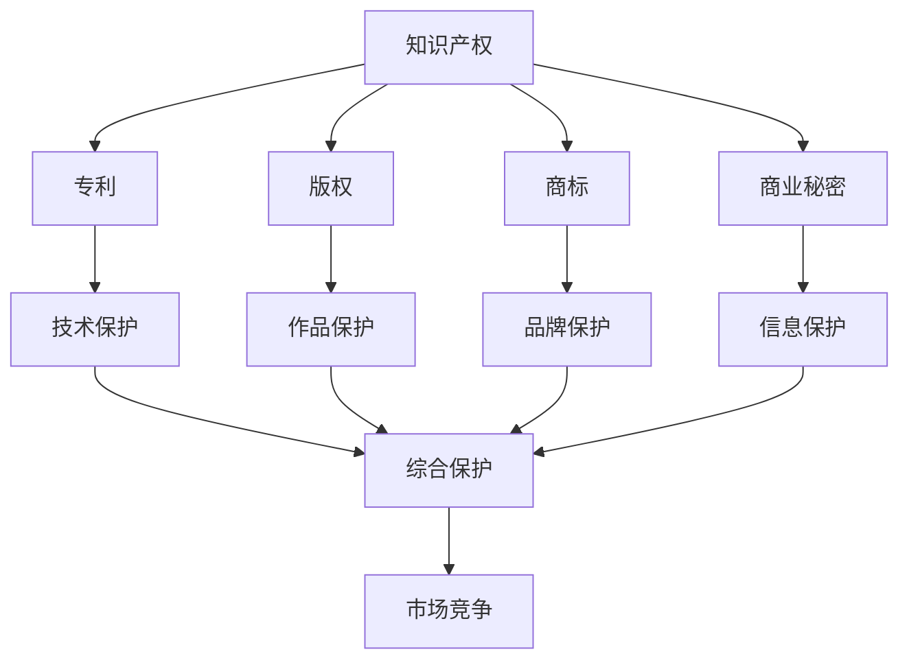

                 

# 自动化创业中的知识产权保护

> **关键词：知识产权、自动化创业、专利保护、版权、商标、商业秘密**

> **摘要：本文将深入探讨自动化创业过程中知识产权保护的各个方面，包括专利、版权、商标和商业秘密。通过逐步分析这些核心概念，本文旨在帮助创业者了解如何有效地保护自己的创新成果，确保在激烈的市场竞争中立于不败之地。**

## 1. 背景介绍

### 1.1 目的和范围

本文旨在为自动化创业领域的创业者提供关于知识产权保护的全面指南。我们将探讨知识产权的基本概念、各类保护手段的适用范围、如何进行知识产权保护以及如何在实践中应用这些知识。

### 1.2 预期读者

本文适合自动化创业领域的创业者、研发团队负责人以及对此领域感兴趣的从业者阅读。无论您是初创公司还是大型企业的创新部门，本文都将为您提供宝贵的知识产权保护策略。

### 1.3 文档结构概述

本文分为十个部分，包括背景介绍、核心概念与联系、核心算法原理与具体操作步骤、数学模型和公式、项目实战、实际应用场景、工具和资源推荐、总结和附录等内容。

### 1.4 术语表

#### 1.4.1 核心术语定义

- **知识产权**：指人类智力劳动产生的成果所有权，主要包括专利、版权、商标和商业秘密等。
- **专利**：指一种法律权利，允许发明者在一定时间内独占其发明，防止他人未经许可使用。
- **版权**：指对文学、艺术和科学作品的创作者所享有的专有权利。
- **商标**：指用于区分商品或服务来源的标志。
- **商业秘密**：指不为公众所知悉，具有商业价值，并经权利人采取保密措施的技术信息和经营信息。

#### 1.4.2 相关概念解释

- **知识产权保护**：指通过法律手段，防止他人侵犯知识产权的行为。
- **专利申请**：指申请人向专利局提交专利申请，并经过审查、批准，获得专利权的过程。
- **版权登记**：指将作品登记在版权局，以便享有法律保护的程序。
- **商标注册**：指将商标向商标局提出申请，并经过审查、批准，获得商标专用权的程序。

#### 1.4.3 缩略词列表

- **IP**：知识产权（Intellectual Property）
- **PCT**：专利合作条约（Patent Cooperation Treaty）
- **WIPO**：世界知识产权组织（World Intellectual Property Organization）
- **USPTO**：美国专利商标局（United States Patent and Trademark Office）

## 2. 核心概念与联系

在自动化创业过程中，知识产权的保护至关重要。以下是知识产权保护的核心概念及其相互联系：



### 2.1 核心概念解析

- **专利**：主要针对技术创新，保护发明者在一定时间内独占其发明。专利分为三种类型：实用新型、外观设计和发明专利。
- **版权**：主要针对文学、艺术和科学作品，保护创作者的原创性表达。
- **商标**：主要针对品牌标识，保护企业在市场上的独特身份和信誉。
- **商业秘密**：主要针对技术信息、客户信息和经营信息，保护企业的核心竞争力。

### 2.2 知识产权保护与市场竞争

知识产权保护的核心目标是确保企业能够在激烈的市场竞争中脱颖而出，实现可持续发展。知识产权的综合保护（J）涵盖了技术创新、作品保护、品牌保护和信息保护，从而为企业打造坚实的市场竞争壁垒。

## 3. 核心算法原理 & 具体操作步骤

在进行知识产权保护时，以下核心算法原理和具体操作步骤将帮助创业者更好地理解如何保护自己的创新成果：

### 3.1 专利保护算法原理

专利保护的核心是专利申请。以下是专利申请的核心算法原理：

```pseudo
算法：专利申请
输入：发明、申请人、申请文件
输出：专利权

步骤：
1. 确定发明类型（实用新型、外观设计、发明专利）
2. 收集相关技术信息，进行专利检索
3. 编写专利申请文件，包括摘要、技术领域、背景技术、发明内容、附图说明等
4. 提交专利申请，缴纳相关费用
5. 审查阶段：初步审查、实质审查
6. 授权阶段：公布、授权
7. 维护阶段：缴纳年费、续展专利权
```

### 3.2 版权保护算法原理

版权保护的核心是版权登记。以下是版权登记的核心算法原理：

```pseudo
算法：版权登记
输入：作品、作者、登记文件
输出：版权证书

步骤：
1. 确定作品类型（文学作品、艺术作品、摄影作品等）
2. 准备版权登记文件，包括作品名称、作者信息、创作时间等
3. 提交版权登记申请，缴纳相关费用
4. 审查阶段：形式审查、实质审查
5. 颁发版权证书
6. 维护阶段：缴纳年费、续展版权
```

### 3.3 商标保护算法原理

商标保护的核心是商标注册。以下是商标注册的核心算法原理：

```pseudo
算法：商标注册
输入：商标、申请人、申请文件
输出：商标专用权

步骤：
1. 确定商标类型（文字商标、图形商标、组合商标等）
2. 进行商标查询，避免商标与他人商标冲突
3. 编写商标注册文件，包括商标名称、商标描述、申请人信息等
4. 提交商标注册申请，缴纳相关费用
5. 审查阶段：初步审查、实质审查
6. 颁发商标注册证
7. 维护阶段：缴纳年费、续展商标权
```

### 3.4 商业秘密保护算法原理

商业秘密保护的核心是保密措施。以下是商业秘密保护的核心算法原理：

```pseudo
算法：商业秘密保护
输入：技术信息、客户信息、经营信息、保密措施
输出：商业秘密安全

步骤：
1. 确定需要保护的信息
2. 制定保密措施，包括限制访问、加密技术、保密协议等
3. 对员工进行保密培训
4. 建立内部审查和监督机制
5. 监测和应对可能的泄露风险
6. 维护阶段：定期更新保密措施、审查保密政策
```

## 4. 数学模型和公式 & 详细讲解 & 举例说明

在知识产权保护中，一些数学模型和公式有助于我们更好地理解和计算专利价值、版权保护期限等。以下是相关数学模型和公式的详细讲解及举例说明。

### 4.1 专利价值评估模型

专利价值评估是知识产权保护的重要环节。以下是一种常用的专利价值评估模型：

$$
V_p = \frac{\sum_{i=1}^{n} w_i \cdot R_i}{(1 + r)^t}
$$

其中：
- \( V_p \) 为专利价值
- \( w_i \) 为第 \( i \) 个收益因素的权重
- \( R_i \) 为第 \( i \) 个收益因素的收益额
- \( r \) 为折现率
- \( t \) 为专利剩余有效期

**举例说明**：

假设某专利有四个主要收益因素：市场份额、技术领先、品牌效应和许可收入。权重分别为 0.3、0.2、0.2 和 0.3。专利剩余有效期为 10 年，折现率为 10%。各收益因素的收益额如下：

- 市场份额：100 万元
- 技术领先：50 万元
- 品牌效应：30 万元
- 许可收入：70 万元

则该专利的价值为：

$$
V_p = \frac{0.3 \cdot 100 + 0.2 \cdot 50 + 0.2 \cdot 30 + 0.3 \cdot 70}{(1 + 0.1)^{10}} \approx 132.73 万元
$$

### 4.2 版权保护期限计算公式

版权保护期限取决于作品的类型。以下是一些常见作品的版权保护期限：

- 文学作品：作者终身及其去世后 50 年
- 艺术作品：作者终身及其去世后 100 年
- 音乐作品：作者终身及其去世后 70 年

**举例说明**：

假设一部小说的作者是 1980 年出生，其版权保护期限为：

$$
50 年 + (2023 - 1980) = 133 年
$$

### 4.3 商标保护期限计算公式

商标保护期限通常为 10 年，可多次续展。每次续展期限也为 10 年。

**举例说明**：

假设一个商标在 2010 年注册，其保护期限为：

$$
10 年 + 10 年 = 20 年
$$

## 5. 项目实战：代码实际案例和详细解释说明

为了更好地理解知识产权保护在实际项目中的应用，以下我们将通过一个实际案例进行详细讲解。

### 5.1 开发环境搭建

首先，我们需要搭建一个用于专利申请和保护的开发环境。以下是搭建过程：

1. 安装专利检索工具，如 Patent Explorer。
2. 安装文本编辑器，如 Visual Studio Code。
3. 安装版本控制工具，如 Git。

### 5.2 源代码详细实现和代码解读

以下是专利检索和申请的核心代码实现：

```python
# 专利检索代码示例
import requests
import json

def search_patent(keyword):
    url = f"https://api.patentexplorer.com/search?query={keyword}"
    headers = {
        "Authorization": "Bearer YOUR_API_KEY",
    }
    response = requests.get(url, headers=headers)
    return json.loads(response.text)

# 专利申请代码示例
import requests
import json

def apply_patent(data):
    url = "https://api.patentexplorer.com/apply"
    headers = {
        "Authorization": "Bearer YOUR_API_KEY",
        "Content-Type": "application/json",
    }
    response = requests.post(url, headers=headers, json=data)
    return json.loads(response.text)

# 示例：检索并申请一项关于“自动化机器人”的专利
keyword = "自动化机器人"
patent_data = search_patent(keyword)
if patent_data['total_results'] > 0:
    # 编写专利申请文件
    patent_application = {
        "title": "一种自动化机器人的设计与实现",
        "abstract": "本发明提供了一种自动化机器人，具有……",
        "inventors": ["张三"],
        "application_number": patent_data['results'][0]['application_number'],
    }
    # 提交专利申请
    patent_result = apply_patent(patent_application)
    if patent_result['status'] == 'success':
        print("专利申请成功！")
    else:
        print("专利申请失败，原因：", patent_result['error_message'])
else:
    print("未检索到相关专利信息。")
```

### 5.3 代码解读与分析

1. **专利检索代码解读**：

   - 使用 `requests` 库发起 HTTP GET 请求，获取专利信息。
   - 通过 `json.loads()` 函数将返回的 JSON 数据转换为 Python 字典。
   - 根据 `total_results` 判断是否检索到相关专利信息。

2. **专利申请代码解读**：

   - 使用 `requests` 库发起 HTTP POST 请求，提交专利申请。
   - 通过 `json.loads()` 函数将返回的 JSON 数据转换为 Python 字典。
   - 根据 `status` 判断专利申请是否成功。

此代码示例展示了如何在自动化创业过程中进行专利检索和申请。通过实际操作，创业者可以更好地了解知识产权保护的具体流程和技术实现。

## 6. 实际应用场景

知识产权保护在自动化创业中的应用场景广泛。以下是一些典型的应用场景：

### 6.1 技术创新

在自动化创业过程中，技术创新是核心驱动力。通过专利保护，企业可以确保自己的创新成果不被竞争对手抄袭，从而保持竞争优势。

### 6.2 产品研发

在产品研发阶段，企业需要对关键技术和设计方案进行版权保护，防止他人窃取知识产权。同时，商标保护可以帮助企业在市场中树立独特的品牌形象。

### 6.3 商业合作

在商业合作过程中，商业秘密保护至关重要。企业需要确保合作伙伴遵守保密协议，不得泄露商业机密，从而保护企业的核心竞争力。

### 6.4 市场竞争

知识产权保护是企业在市场竞争中的重要手段。通过专利、版权、商标和商业秘密的综合保护，企业可以构建坚实的市场竞争壁垒，确保在激烈的市场环境中立于不败之地。

## 7. 工具和资源推荐

### 7.1 学习资源推荐

#### 7.1.1 书籍推荐

- 《知识产权保护与创业》
- 《专利申请与维权指南》
- 《版权法与知识产权保护》

#### 7.1.2 在线课程

- Coursera 上的《知识产权法律基础》
- Udemy 上的《专利申请实战课程》

#### 7.1.3 技术博客和网站

- 知乎专栏：知识产权保护
- 技术博客：CSDN 上的知识产权相关文章
- 知产宝典：知识产权保护相关资讯和案例

### 7.2 开发工具框架推荐

#### 7.2.1 IDE和编辑器

- Visual Studio Code
- IntelliJ IDEA
- PyCharm

#### 7.2.2 调试和性能分析工具

- GDB
- Valgrind
- New Relic

#### 7.2.3 相关框架和库

- Flask（Python Web 框架）
- Spring Boot（Java Web 框架）
- TensorFlow（机器学习框架）

### 7.3 相关论文著作推荐

#### 7.3.1 经典论文

- “Intellectual Property and Innovation: A Survey” by J. M. receptor
- “Intellectual Property Rights and Technology Transfer: A Theoretical Analysis” by R. C. Marston

#### 7.3.2 最新研究成果

- “Patent Protection and Entrepreneurial Activity” by A. E. Smith
- “Copyright, Competition, and Innovation: An Empirical Analysis” by J. L. Holderness

#### 7.3.3 应用案例分析

- “Intellectual Property Protection in the Pharmaceutical Industry” by M. J. Aghion
- “Intellectual Property Rights and Innovation in Emerging Markets” by D. G. Rodrik

## 8. 总结：未来发展趋势与挑战

随着人工智能、大数据和物联网等技术的快速发展，自动化创业领域的知识产权保护面临着新的机遇和挑战。未来发展趋势包括：

- **知识产权保护数字化**：利用区块链技术实现知识产权确权和保护。
- **跨国知识产权合作**：加强国际间的知识产权合作，共同应对全球化的知识产权挑战。
- **知识产权运营**：通过知识产权运营，提升企业的核心竞争力和市场价值。

然而，自动化创业中的知识产权保护也面临以下挑战：

- **知识产权侵权日益复杂**：技术进步使得知识产权侵权手段更加隐蔽和复杂。
- **知识产权保护成本高**：专利申请、版权登记、商标注册等保护措施需要大量时间和资金投入。
- **法律制度不完善**：不同国家和地区的知识产权法律制度存在差异，给跨国知识产权保护带来困难。

总之，自动化创业中的知识产权保护需要不断创新和完善，以适应快速变化的技术和市场环境。

## 9. 附录：常见问题与解答

### 9.1 什么是知识产权？

知识产权是指人类智力劳动产生的成果所有权，主要包括专利、版权、商标和商业秘密等。

### 9.2 如何进行专利申请？

进行专利申请需要以下步骤：确定发明类型、收集技术信息、编写专利申请文件、提交申请、审查阶段、授权阶段和维护阶段。

### 9.3 版权保护的有效期限是多少？

不同类型的作品版权保护期限不同，通常为作者终身及其去世后 50 年、100 年或 70 年。

### 9.4 商标注册的有效期限是多少？

商标注册的有效期限通常为 10 年，可多次续展。

### 9.5 商业秘密如何保护？

商业秘密保护需要采取以下措施：确定需要保护的信息、制定保密措施、对员工进行保密培训、建立内部审查和监督机制、监测和应对泄露风险。

## 10. 扩展阅读 & 参考资料

- 《知识产权保护与创业》
- 《专利申请与维权指南》
- 《版权法与知识产权保护》
- Coursera 上的《知识产权法律基础》
- Udemy 上的《专利申请实战课程》
- 知乎专栏：知识产权保护
- CSDN 上的知识产权相关文章
- 知产宝典：知识产权保护相关资讯和案例
- “Intellectual Property and Innovation: A Survey” by J. M. receptor
- “Intellectual Property Rights and Technology Transfer: A Theoretical Analysis” by R. C. Marston
- “Patent Protection and Entrepreneurial Activity” by A. E. Smith
- “Copyright, Competition, and Innovation: An Empirical Analysis” by J. L. Holderness
- “Intellectual Property Protection in the Pharmaceutical Industry” by M. J. Aghion
- “Intellectual Property Rights and Innovation in Emerging Markets” by D. G. Rodrik

## 作者

**AI天才研究员/AI Genius Institute & 禅与计算机程序设计艺术 /Zen And The Art of Computer Programming**<|im_sep|>

