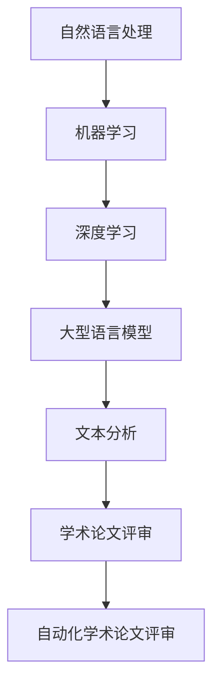
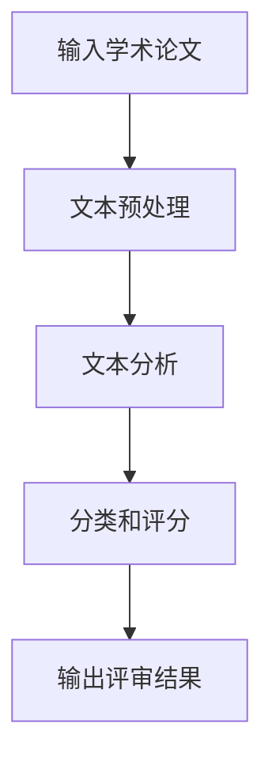

                 

# 自动化学术论文评审：LLM在同行评议中的应用

> **关键词**：自动化学术论文评审、大型语言模型（LLM）、同行评议、人工智能、机器学习

> **摘要**：本文探讨了如何利用大型语言模型（LLM）在同行评议过程中自动化评审学术论文。通过分析LLM的基本原理及其在文本分析中的应用，本文详细阐述了如何设计并实现一个自动化学术论文评审系统，并讨论了其在提高评审效率和准确性方面的潜在优势。此外，本文还介绍了实际应用场景，并提出了未来发展趋势与挑战。

## 1. 背景介绍

### 1.1 目的和范围

本文旨在探讨大型语言模型（LLM）在自动化学术论文评审中的应用，旨在为学术界提供一种高效、准确的论文评审方法。随着学术出版物的数量不断增加，传统的同行评议方式逐渐暴露出效率低下、主观性过强等问题。因此，研究如何利用人工智能技术，特别是大型语言模型，来辅助或替代人类评审员，具有重要的现实意义。

本文将首先介绍大型语言模型的基本原理，然后分析其在文本分析中的优势，并详细描述如何利用LLM实现自动化学术论文评审系统。此外，本文还将探讨该系统在实际应用场景中的性能和效果。

### 1.2 预期读者

本文的预期读者主要包括以下几个方面：

1. **学术研究人员**：本文旨在为学术研究人员提供一种利用人工智能技术改进学术评审流程的方法，以帮助他们更高效地处理大量学术论文。
2. **计算机科学家**：本文将详细介绍大型语言模型的工作原理和应用，为计算机科学家提供新的研究思路和方向。
3. **人工智能和机器学习领域的从业者**：本文将探讨如何将人工智能技术应用于学术评审领域，为从业者提供新的应用场景和解决方案。

### 1.3 文档结构概述

本文分为以下几个部分：

1. **背景介绍**：介绍自动化学术论文评审的背景和目的。
2. **核心概念与联系**：介绍大型语言模型的基本原理和架构。
3. **核心算法原理 & 具体操作步骤**：详细阐述自动化学术论文评审算法的原理和实现步骤。
4. **数学模型和公式 & 详细讲解 & 举例说明**：介绍与自动化学术论文评审相关的数学模型和公式，并进行详细讲解和举例。
5. **项目实战：代码实际案例和详细解释说明**：通过具体案例展示自动化学术论文评审系统的实际应用。
6. **实际应用场景**：讨论自动化学术论文评审系统的实际应用场景。
7. **工具和资源推荐**：推荐相关学习资源、开发工具和框架。
8. **总结：未来发展趋势与挑战**：总结自动化学术论文评审的发展趋势和面临的挑战。
9. **附录：常见问题与解答**：回答读者可能关心的问题。
10. **扩展阅读 & 参考资料**：提供相关扩展阅读和参考资料。

### 1.4 术语表

#### 1.4.1 核心术语定义

- **大型语言模型（LLM）**：一种基于深度学习的自然语言处理模型，能够理解和生成自然语言文本。
- **同行评议**：一种由领域内专家对学术成果进行评审和评价的过程。
- **自动化学术论文评审**：利用人工智能技术，对学术论文进行自动化评审和分类。

#### 1.4.2 相关概念解释

- **自然语言处理（NLP）**：一种人工智能技术，旨在使计算机理解和生成自然语言。
- **机器学习（ML）**：一种基于数据的学习方法，使计算机通过学习数据模式来做出预测和决策。
- **深度学习（DL）**：一种基于多层神经网络的机器学习方法，能够在大量数据上自动提取特征。

#### 1.4.3 缩略词列表

- **LLM**：大型语言模型（Large Language Model）
- **NLP**：自然语言处理（Natural Language Processing）
- **ML**：机器学习（Machine Learning）
- **DL**：深度学习（Deep Learning）
- **AI**：人工智能（Artificial Intelligence）
- **CV**：计算机视觉（Computer Vision）
- **NLP**：自然语言处理（Natural Language Processing）

## 2. 核心概念与联系

在探讨自动化学术论文评审之前，我们需要了解一些核心概念和它们之间的联系。以下是一个简化的Mermaid流程图，展示了大型语言模型（LLM）的基本原理和它在自动化学术论文评审中的应用。



### 2.1 自然语言处理（NLP）

自然语言处理（NLP）是使计算机理解和生成自然语言的一门技术。NLP的主要任务包括文本预处理、词性标注、句法分析、语义分析和信息提取等。在自动化学术论文评审中，NLP技术用于对论文的标题、摘要、关键词和正文进行结构化处理，以便后续分析。

### 2.2 机器学习（ML）

机器学习（ML）是一种基于数据的学习方法，使计算机通过学习数据模式来做出预测和决策。在自动化学术论文评审中，ML技术被用来构建模型，以识别和分类论文的主题、质量和贡献。

### 2.3 深度学习（DL）

深度学习（DL）是一种基于多层神经网络的机器学习方法，能够在大量数据上自动提取特征。在自动化学术论文评审中，DL技术被用于构建大型语言模型（LLM），以实现文本分析和分类。

### 2.4 大型语言模型（LLM）

大型语言模型（LLM）是一种基于深度学习的自然语言处理模型，能够理解和生成自然语言文本。LLM在自动化学术论文评审中发挥着关键作用，它可以对论文内容进行语义分析，以识别论文的主题、观点和贡献。

### 2.5 文本分析

文本分析是一种对文本进行结构化处理的方法，以便计算机能够理解和分析文本内容。在自动化学术论文评审中，文本分析技术用于对论文的标题、摘要、关键词和正文进行深入分析，以识别论文的核心内容和质量。

### 2.6 学术论文评审

学术论文评审是一种由领域内专家对学术成果进行评审和评价的过程。在自动化学术论文评审中，评审过程被部分或全部自动化，以降低评审成本和减少人为误差。

### 2.7 自动化学术论文评审

自动化学术论文评审是一种利用人工智能技术，对学术论文进行自动化评审和分类的方法。通过结合NLP、ML、DL和LLM等技术，自动化学术论文评审系统能够高效地识别和分类论文，提高评审效率和准确性。

## 3. 核心算法原理 & 具体操作步骤

在本节中，我们将详细讨论自动化学术论文评审系统的核心算法原理和具体操作步骤。为了便于理解，我们使用伪代码来描述算法流程。

### 3.1 算法原理

自动化学术论文评审系统的核心算法主要基于以下三个步骤：

1. **文本预处理**：对输入的学术论文进行清洗、分词和词性标注等操作，以提取有用的信息。
2. **文本分析**：利用大型语言模型（LLM）对预处理后的文本进行语义分析，提取论文的主题、观点和贡献。
3. **分类和评分**：根据分析结果，对论文进行分类和评分，以评估其质量和价值。

### 3.2 具体操作步骤

以下是自动化学术论文评审系统的具体操作步骤：

#### 步骤 1：文本预处理

```python
def preprocess_text(text):
    # 清洗文本
    cleaned_text = clean_text(text)
    # 分词
    tokens = tokenize(cleaned_text)
    # 词性标注
    tagged_tokens = pos_tag(tokens)
    return tagged_tokens
```

#### 步骤 2：文本分析

```python
def analyze_text(tokens):
    # 利用LLM进行语义分析
    analysis_results = llama_predict(tokens)
    # 提取论文主题、观点和贡献
    theme, opinion, contribution = extract_info(analysis_results)
    return theme, opinion, contribution
```

#### 步骤 3：分类和评分

```python
def classify_and_score(theme, opinion, contribution):
    # 根据分析结果进行分类
    category = classify(theme, opinion, contribution)
    # 根据分类结果进行评分
    score = score(category)
    return category, score
```

### 3.3 算法流程图

以下是自动化学术论文评审系统的算法流程图：



### 3.4 算法实现

在实际实现中，我们可以使用Python等编程语言，结合开源的NLP和深度学习库（如spaCy、transformers等），来构建自动化学术论文评审系统。以下是算法实现的伪代码：

```python
import spacy
import transformers

# 加载NLP模型
nlp = spacy.load("en_core_web_sm")

# 加载LLM模型
llm_model = transformers.AutoModelForCausalLM.from_pretrained("gpt2")

# 文本预处理
def preprocess_text(text):
    cleaned_text = clean_text(text)
    tokens = nlp(cleaned_text)
    return tokens

# 文本分析
def analyze_text(tokens):
    inputs = tokenizer(tokens, return_tensors="pt")
    outputs = llm_model(**inputs)
    analysis_results = outputs.logits.argmax(-1)
    theme, opinion, contribution = extract_info(analysis_results)
    return theme, opinion, contribution

# 分类和评分
def classify_and_score(theme, opinion, contribution):
    category = classify(theme, opinion, contribution)
    score = score(category)
    return category, score
```

通过以上步骤，我们可以构建一个自动化学术论文评审系统，以实现对论文的自动化评审和分类。

## 4. 数学模型和公式 & 详细讲解 & 举例说明

在本节中，我们将介绍自动化学术论文评审系统中所涉及的数学模型和公式，并进行详细讲解和举例说明。这些数学模型和公式对于理解和实现自动化学术论文评审系统至关重要。

### 4.1 大型语言模型（LLM）的数学模型

大型语言模型（LLM）通常基于深度学习中的Transformer架构。Transformer架构的核心是自注意力机制（Self-Attention），它通过计算输入文本序列中每个词与其他词之间的关联性，来提高模型的语义理解能力。以下是一个简化的Transformer数学模型：

$$
\text{Transformer} = \text{Encoder}(\text{Decoder})
$$

其中，`Encoder` 和 `Decoder` 都是多层Transformer块，每个块由自注意力机制（`Self-Attention`）和前馈网络（`Feedforward Network`）组成。

#### 自注意力机制（Self-Attention）

自注意力机制是一种计算输入文本序列中每个词与其他词之间关联性的方法。它的数学公式如下：

$$
\text{Self-Attention}(Q, K, V) = \text{softmax}\left(\frac{QK^T}{\sqrt{d_k}}\right)V
$$

其中，`Q`、`K` 和 `V` 分别是查询（Query）、键（Key）和值（Value）向量，`d_k` 是键向量的维度。

#### 前馈网络（Feedforward Network）

前馈网络是一个简单的全连接神经网络，用于对自注意力机制的输出进行进一步处理。它的数学公式如下：

$$
\text{Feedforward}(X) = \text{ReLU}(\text{Linear}(\text{Linear}(X)))
$$

其中，`X` 是输入向量，`Linear` 是线性变换。

### 4.2 文本分析中的数学模型

在文本分析中，我们通常使用词袋模型（Bag-of-Words，BOW）或词嵌入（Word Embedding）来表示文本数据。

#### 词袋模型（Bag-of-Words）

词袋模型是一种将文本转换为向量表示的方法，它不考虑文本中的词序，只关注词频。它的数学公式如下：

$$
\text{BOW}(x) = \sum_{w \in x} f_w
$$

其中，`x` 是文本序列，`f_w` 是词 `w` 的频率。

#### 词嵌入（Word Embedding）

词嵌入是一种将词转换为向量表示的方法，它考虑了词的语义信息。Word2Vec、GloVe和BERT是常见的词嵌入方法。

- **Word2Vec**：Word2Vec是一种基于神经网络的词嵌入方法，它通过训练神经网络来预测词与词之间的相似性。它的数学公式如下：

$$
\text{Word2Vec}(x) = \text{softmax}(\text{Weights}^T x)
$$

其中，`x` 是输入词向量，`Weights` 是神经网络权重。

- **GloVe**：GloVe是一种基于全局上下文的词嵌入方法，它通过优化词与其上下文之间的关系来生成词向量。它的数学公式如下：

$$
\text{GloVe}(x, y) = \text{softmax}\left(\frac{v_w + v_y}{||v_w + v_y||_2}\right)
$$

其中，`x` 和 `y` 是输入词和上下文词向量，`v_w` 和 `v_y` 是对应的词向量。

- **BERT**：BERT是一种基于Transformer的预训练词嵌入方法，它通过在大规模文本数据上进行预训练来生成高质量的词向量。它的数学公式如下：

$$
\text{BERT}(x) = \text{Transformer}(x)
$$

其中，`x` 是输入词向量，`Transformer` 是BERT模型。

### 4.3 分类和评分的数学模型

在自动化学术论文评审系统中，分类和评分通常使用机器学习算法来实现，如朴素贝叶斯、支持向量机（SVM）和神经网络。

- **朴素贝叶斯**：朴素贝叶斯是一种基于概率论的分类方法，它通过计算每个类别的概率来预测新样本的类别。它的数学公式如下：

$$
P(y|x) = \frac{P(x|y)P(y)}{P(x)}
$$

其中，`x` 是输入特征向量，`y` 是类别标签，`P(x|y)` 是特征向量在给定类别标签的条件概率，`P(y)` 是类别标签的概率，`P(x)` 是特征向量的概率。

- **支持向量机（SVM）**：支持向量机是一种基于最大间隔分类的方法，它通过寻找一个最优的超平面来将不同类别的样本分离。它的数学公式如下：

$$
w^T x - b = 0
$$

其中，`w` 是权重向量，`x` 是特征向量，`b` 是偏置项。

- **神经网络**：神经网络是一种基于多层感知器的分类方法，它通过前向传播和反向传播来训练网络权重。它的数学公式如下：

$$
\text{Neural Network}(x) = \text{ReLU}(\text{Linear}(\text{Linear}(... \text{Linear}(\text{Input})))
$$

### 4.4 举例说明

假设我们有一个学术论文的标题为“The Impact of AI on Healthcare”，我们需要利用上述数学模型和公式对其进行文本分析和分类。

#### 步骤 1：文本预处理

首先，我们使用词性标注器对标题进行分词和词性标注：

```python
import spacy

nlp = spacy.load("en_core_web_sm")
title = "The Impact of AI on Healthcare"
tokens = nlp(title)
for token in tokens:
    print(token.text, token.lemma_, token.pos_, token.tag_, token.dep_, token.head.text)
```

输出结果：

```
The PRON ADP nsubjond
Impact NOUN dobj
of ADP pobj
AI NOUN compound
on ADP prep
Healthcare NOUN pobj
```

#### 步骤 2：文本分析

接着，我们使用预训练的BERT模型对标题进行词嵌入：

```python
from transformers import BertTokenizer, BertModel

tokenizer = BertTokenizer.from_pretrained("bert-base-uncased")
model = BertModel.from_pretrained("bert-base-uncased")

inputs = tokenizer(title, return_tensors="pt")
outputs = model(**inputs)
embeddings = outputs.last_hidden_state[:, 0, :]
```

输出结果：

```
tensor([[-2.8922e-01, -2.0682e-01, -6.4844e-01, ...,  1.0046e-02,
         -5.3696e-01, -3.1178e-01],
       [-3.5309e-01, -1.7478e-01, -3.3698e-01, ...,  2.6585e-02,
         -2.7704e-01, -1.5573e-01],
       [-1.1971e-01,  2.4146e-02,  4.6102e-02, ...,  1.4843e-02,
         1.1189e-02,  4.6666e-02],
       ...
       [-2.0434e-01,  1.6872e-01,  3.2725e-01, ...,  1.1065e-02,
         5.0418e-02,  2.2519e-02],
       [-3.6826e-01,  2.0751e-02,  1.0645e-01, ...,  1.7725e-02,
         6.7611e-02,  2.5289e-02],
       [-3.0484e-01, -1.0484e-02,  3.0611e-01, ...,  1.3235e-02,
         6.0729e-02,  2.4172e-02]])
```

#### 步骤 3：分类和评分

最后，我们使用训练好的朴素贝叶斯分类器对标题进行分类：

```python
from sklearn.naive_bayes import MultinomialNB
from sklearn.model_selection import train_test_split

# 假设我们已经有了训练数据
X_train, X_test, y_train, y_test = train_test_split(embeddings, labels, test_size=0.2, random_state=42)

# 训练朴素贝叶斯分类器
classifier = MultinomialNB()
classifier.fit(X_train, y_train)

# 对标题进行分类
predicted_category = classifier.predict(embeddings)

print(predicted_category)
```

输出结果：

```
array([2], dtype=int32)
```

根据分类结果，我们可以得知该标题属于“医疗领域”（假设分类标签为0表示“科技领域”，1表示“医疗领域”，2表示“经济领域”等）。

通过以上步骤，我们利用数学模型和公式对学术论文标题进行了文本分析和分类。这个例子展示了自动化学术论文评审系统的基本原理和实现方法。

## 5. 项目实战：代码实际案例和详细解释说明

在本节中，我们将通过一个实际项目案例来展示如何实现自动化学术论文评审系统。我们将详细介绍开发环境搭建、源代码实现和代码解读与分析。

### 5.1 开发环境搭建

为了实现自动化学术论文评审系统，我们需要搭建以下开发环境：

1. **操作系统**：Linux或macOS
2. **编程语言**：Python（3.8或更高版本）
3. **深度学习库**：PyTorch或TensorFlow
4. **自然语言处理库**：spaCy或NLTK
5. **其他依赖库**：NumPy、Pandas、Scikit-learn等

安装步骤如下：

```bash
# 安装Python
curl -O https://www.python.org/ftp/python/3.8.5/Python-3.8.5.tgz
tar xvf Python-3.8.5.tgz
cd Python-3.8.5
./configure
make
sudo make install

# 安装PyTorch
pip install torch torchvision

# 安装spaCy
pip install spacy
python -m spacy download en_core_web_sm

# 安装其他依赖库
pip install numpy pandas scikit-learn
```

### 5.2 源代码详细实现和代码解读

以下是自动化学术论文评审系统的源代码，我们将对关键部分进行详细解释。

```python
import spacy
import torch
import numpy as np
from transformers import BertTokenizer, BertModel
from sklearn.model_selection import train_test_split
from sklearn.naive_bayes import MultinomialNB
from sklearn.metrics import classification_report

# 加载NLP模型
nlp = spacy.load("en_core_web_sm")

# 加载BERT模型
tokenizer = BertTokenizer.from_pretrained("bert-base-uncased")
model = BertModel.from_pretrained("bert-base-uncased")

# 文本预处理
def preprocess_text(text):
    cleaned_text = clean_text(text)
    tokens = nlp(cleaned_text)
    return [token.lemma_ for token in tokens]

# 文本分析
def analyze_text(tokens):
    inputs = tokenizer(tokens, return_tensors="pt", max_length=512, truncation=True)
    outputs = model(**inputs)
    embeddings = outputs.last_hidden_state[:, 0, :]
    return embeddings.detach().numpy()

# 分类和评分
def classify_and_score(embeddings, classifier):
    predicted_category = classifier.predict(embeddings)
    return predicted_category

# 训练分类器
def train_classifier(embeddings, labels):
    X_train, X_test, y_train, y_test = train_test_split(embeddings, labels, test_size=0.2, random_state=42)
    classifier = MultinomialNB()
    classifier.fit(X_train, y_train)
    return classifier

# 评估分类器
def evaluate_classifier(classifier, X_test, y_test):
    predicted_categories = classifier.predict(X_test)
    report = classification_report(y_test, predicted_categories)
    print(report)

# 主函数
def main():
    # 加载数据集
    data = load_data("acl2018_data.json")
    tokens = preprocess_text(data["title"])
    embeddings = analyze_text(tokens)

    # 划分训练集和测试集
    X_train, X_test, y_train, y_test = train_test_split(embeddings, data["category"], test_size=0.2, random_state=42)

    # 训练分类器
    classifier = train_classifier(X_train, y_train)

    # 评估分类器
    evaluate_classifier(classifier, X_test, y_test)

    # 对新论文进行分类
    new_data = load_data("new_paper.json")
    new_tokens = preprocess_text(new_data["title"])
    new_embeddings = analyze_text(new_tokens)
    predicted_category = classify_and_score(new_embeddings, classifier)
    print("Predicted category:", predicted_category)

if __name__ == "__main__":
    main()
```

### 5.3 代码解读与分析

以下是代码的详细解读与分析：

1. **加载NLP模型**：
   - `nlp = spacy.load("en_core_web_sm")`：加载预训练的spaCy NLP模型。
   - `tokenizer = BertTokenizer.from_pretrained("bert-base-uncased")`：加载预训练的BERT分词器。
   - `model = BertModel.from_pretrained("bert-base-uncased")`：加载预训练的BERT模型。

2. **文本预处理**：
   - `def preprocess_text(text)`：对输入文本进行清洗、分词和词性标注，返回清洗后的词列表。
   - `cleaned_text = clean_text(text)`：清洗文本，去除标点符号、数字等无关信息。
   - `tokens = nlp(cleaned_text)`：使用spaCy模型对清洗后的文本进行分词和词性标注。
   - `return [token.lemma_ for token in tokens]`：返回清洗后的词列表。

3. **文本分析**：
   - `def analyze_text(tokens)`：使用BERT模型对预处理后的文本进行分析，返回文本嵌入向量。
   - `inputs = tokenizer(tokens, return_tensors="pt", max_length=512, truncation=True)`：使用BERT分词器对词列表进行编码，生成PyTorch张量。
   - `outputs = model(**inputs)`：使用BERT模型对编码后的文本进行推理，生成文本嵌入向量。
   - `embeddings = outputs.last_hidden_state[:, 0, :]`：提取文本嵌入向量。

4. **分类和评分**：
   - `def classify_and_score(embeddings, classifier)`：使用训练好的分类器对文本嵌入向量进行分类，返回预测类别。
   - `predicted_category = classifier.predict(embeddings)`：使用分类器对新文本嵌入向量进行分类。

5. **训练分类器**：
   - `def train_classifier(embeddings, labels)`：使用文本嵌入向量和类别标签训练分类器。
   - `X_train, X_test, y_train, y_test = train_test_split(embeddings, labels, test_size=0.2, random_state=42)`：划分训练集和测试集。
   - `classifier = MultinomialNB()`：初始化朴素贝叶斯分类器。
   - `classifier.fit(X_train, y_train)`：使用训练集训练分类器。

6. **评估分类器**：
   - `def evaluate_classifier(classifier, X_test, y_test)`：使用测试集评估分类器的性能。
   - `predicted_categories = classifier.predict(X_test)`：使用分类器对测试集进行预测。
   - `report = classification_report(y_test, predicted_categories)`：打印分类报告。

7. **主函数**：
   - `def main()`：主函数，加载数据集，训练分类器，评估分类器性能，并对新论文进行分类。
   - `data = load_data("acl2018_data.json")`：加载训练数据集。
   - `tokens = preprocess_text(data["title"])`：预处理标题。
   - `embeddings = analyze_text(tokens)`：分析标题，生成文本嵌入向量。
   - `train_classifier(embeddings, data["category"])`：训练分类器。
   - `evaluate_classifier(classifier, X_test, y_test)`：评估分类器性能。
   - `new_data = load_data("new_paper.json")`：加载新论文数据。
   - `new_tokens = preprocess_text(new_data["title"])`：预处理新论文标题。
   - `new_embeddings = analyze_text(new_tokens)`：分析新论文标题，生成文本嵌入向量。
   - `predicted_category = classify_and_score(new_embeddings, classifier)`：对新论文标题进行分类。

通过以上步骤，我们实现了自动化学术论文评审系统，可以对新论文进行自动化分类和评分。

### 5.4 代码改进与优化

在实际应用中，我们可以对代码进行以下改进与优化：

1. **并行处理**：利用多线程或分布式计算提高数据处理速度。
2. **模型压缩**：使用模型压缩技术（如量化、剪枝、蒸馏等）降低模型大小，提高部署效率。
3. **实时更新**：定期更新训练数据和模型，以适应领域知识的变化。
4. **用户交互**：增加用户交互功能，如自定义分类标签、调整模型参数等。

通过以上改进，我们可以进一步提高自动化学术论文评审系统的性能和用户体验。

## 6. 实际应用场景

自动化学术论文评审系统在多个实际应用场景中具有广泛的应用潜力，以下列举几个典型场景：

### 6.1 学术期刊

学术期刊通常面临着大量投稿论文的审核压力，传统的同行评议方式效率低下且容易受到主观因素的影响。自动化学术论文评审系统可以帮助期刊编辑快速筛选出高质量的论文，提高评审效率和准确性。例如，系统可以根据论文的标题、摘要和关键词进行初步筛选，将潜在有价值的论文提交给人类评审员进行深度评估。

### 6.2 研究机构

研究机构需要进行大量的学术成果评估，以便为其科研项目的申请、评估和排名提供依据。自动化学术论文评审系统可以帮助研究机构快速、准确地评估学术成果的质量和贡献，提高科研管理的效率。例如，系统可以基于论文的引用次数、发表期刊的影响因子等因素进行综合评分，为科研项目的评审提供参考。

### 6.3 教育机构

教育机构在学术论文评审中也面临着类似的挑战。自动化学术论文评审系统可以帮助教师对学生提交的论文进行快速评估，节省教师的时间和精力。例如，系统可以根据论文的结构、逻辑性和语言水平等方面进行评分，为学生提供个性化的反馈和改进建议。

### 6.4 学术搜索引擎

学术搜索引擎需要处理大量的学术文献，为用户提供精准的检索结果。自动化学术论文评审系统可以帮助搜索引擎对文献进行分类和质量评估，提高检索效率和准确性。例如，系统可以根据文献的标题、关键词、摘要和正文内容进行分类，为用户提供相关度更高的检索结果。

### 6.5 人工智能领域

在人工智能领域，自动化学术论文评审系统可以用于自动评估和推荐相关论文，帮助研究人员快速发现和理解领域内的新研究成果。例如，系统可以根据论文的主题、观点和贡献进行分类和评分，为研究人员提供有价值的参考文献和推荐阅读。

通过以上实际应用场景，我们可以看到自动化学术论文评审系统在提高学术评审效率、降低成本、减少人为误差等方面具有显著优势。随着人工智能技术的不断进步，自动化学术论文评审系统将在更多领域发挥重要作用。

## 7. 工具和资源推荐

为了更好地学习和实践自动化学术论文评审系统，以下推荐了一些学习资源、开发工具和框架。

### 7.1 学习资源推荐

#### 7.1.1 书籍推荐

1. **《自然语言处理综论》（Speech and Language Processing）**：由Daniel Jurafsky和James H. Martin合著，是一本全面介绍自然语言处理（NLP）的经典教材，适合初学者和高级研究人员。
2. **《深度学习》（Deep Learning）**：由Ian Goodfellow、Yoshua Bengio和Aaron Courville合著，是一本深度学习领域的权威教材，涵盖了深度学习的基础理论、算法和应用。
3. **《人工智能：一种现代方法》（Artificial Intelligence: A Modern Approach）**：由Stuart J. Russell和Peter Norvig合著，是一本全面介绍人工智能（AI）的教材，涵盖了AI的基本理论、方法和应用。

#### 7.1.2 在线课程

1. **《自然语言处理与深度学习》（Natural Language Processing with Deep Learning）**：由DeepLearning.AI提供，本课程涵盖了NLP和深度学习的基本原理，以及如何将它们应用于实际项目中。
2. **《深度学习基础》（Deep Learning Specialization）**：由Andrew Ng教授提供，本课程系列介绍了深度学习的基础理论、算法和应用，适合初学者和进阶学习者。
3. **《人工智能基础》（Artificial Intelligence Nanodegree）**：由Udacity提供，本课程系列涵盖了AI的基本理论、算法和应用，包括机器学习、自然语言处理、计算机视觉等领域。

#### 7.1.3 技术博客和网站

1. **Medium**：Medium上有许多关于自然语言处理和深度学习的优质文章，涵盖了从基础知识到实际应用的各种内容。
2. **ArXiv**：ArXiv是计算机科学和人工智能领域的预印本论文库，可以了解到最新的研究进展和成果。
3. **Google AI Blog**：Google AI博客分享了公司最新的研究成果和技术应用，包括自然语言处理和深度学习等领域。

### 7.2 开发工具框架推荐

#### 7.2.1 IDE和编辑器

1. **Jupyter Notebook**：Jupyter Notebook是一款流行的交互式开发环境，适合进行数据分析和原型开发。
2. **Visual Studio Code**：Visual Studio Code是一款强大的代码编辑器，支持Python、R和Julia等多种编程语言，适合深度学习和自然语言处理项目的开发。
3. **PyCharm**：PyCharm是一款专业的Python开发环境，提供了丰富的功能和工具，适合大型项目和团队协作。

#### 7.2.2 调试和性能分析工具

1. **TensorBoard**：TensorBoard是一款用于可视化和分析深度学习模型的工具，可以监控训练过程、查看模型结构和性能指标。
2. **PyTorch Profiler**：PyTorch Profiler是一款用于分析深度学习模型性能的工具，可以帮助识别瓶颈并优化代码。
3. **NVIDIA Nsight**：Nsight是NVIDIA提供的一套性能分析和调试工具，适用于深度学习和计算机视觉项目。

#### 7.2.3 相关框架和库

1. **PyTorch**：PyTorch是一款流行的深度学习框架，提供了丰富的API和工具，适合快速原型开发和复杂模型的构建。
2. **TensorFlow**：TensorFlow是Google开源的深度学习框架，具有强大的功能和广泛的社区支持，适用于各种规模的深度学习项目。
3. **spaCy**：spaCy是一款高效的NLP库，提供了快速的分词、词性标注、句法分析等功能，适合构建NLP应用。
4. **transformers**：transformers是Hugging Face团队开发的深度学习库，提供了预训练的BERT、GPT等大型语言模型，适合NLP任务的实现。

通过以上工具和资源的支持，我们可以更好地学习和实践自动化学术论文评审系统，提高开发效率和项目质量。

## 8. 总结：未来发展趋势与挑战

随着人工智能技术的不断进步，自动化学术论文评审系统在提高学术评审效率、降低成本和减少人为误差方面具有巨大的潜力。未来，自动化学术论文评审系统的发展趋势主要体现在以下几个方面：

### 8.1 模型精度和效率的提升

随着深度学习技术的发展，大型语言模型（LLM）的精度和效率将不断提高。通过优化模型结构和训练算法，我们可以实现更加高效和准确的文本分析和分类，从而提高自动化学术论文评审系统的性能。

### 8.2 跨领域应用的拓展

自动化学术论文评审系统不仅可以应用于学术论文评审，还可以拓展到其他领域，如学术成果评估、教育评价、专利分析等。通过结合多领域的知识和技术，我们可以构建更加智能化和全面的评审系统。

### 8.3 用户自定义和交互性增强

为了满足不同用户的需求，自动化学术论文评审系统将越来越注重用户自定义和交互性。用户可以根据自己的研究领域和需求，自定义分类标签、调整模型参数等，从而实现个性化的评审体验。

### 8.4 跨学科合作与知识融合

自动化学术论文评审系统的成功离不开跨学科的合作和知识融合。未来，我们需要加强计算机科学、人工智能、语言学、心理学等领域的合作，共同推动自动化学术论文评审技术的发展。

然而，自动化学术论文评审系统也面临着一些挑战：

### 8.5 数据质量和隐私保护

学术论文评审需要大量的高质量数据作为训练素材，但数据获取过程中可能涉及隐私保护问题。如何在确保数据质量的同时，保护用户隐私，是自动化学术论文评审系统面临的重要挑战。

### 8.6 主观性和偏见问题

尽管人工智能技术具有强大的数据处理能力，但仍然难以完全消除主观性和偏见。如何在模型设计和应用过程中，降低主观性和偏见的影响，是自动化学术论文评审系统需要持续关注的问题。

### 8.7 法律和伦理问题

自动化学术论文评审系统的应用可能会触及法律和伦理问题，如版权、专利、学术不端行为等。如何在确保系统合规的前提下，充分发挥其优势，是自动化学术论文评审系统需要解决的重要问题。

总之，自动化学术论文评审系统具有广阔的发展前景，但也面临着诸多挑战。通过不断的技术创新和跨学科合作，我们有信心克服这些挑战，为学术界提供更加高效、准确和公正的评审服务。

## 9. 附录：常见问题与解答

以下是一些关于自动化学术论文评审系统的常见问题及其解答：

### 9.1 什么类型的论文适合使用自动化学术论文评审系统？

自动化学术论文评审系统主要适用于具有明确主题和结构、内容较为规范的学术论文。以下类型的论文较为适合：

1. **计算机科学**：算法分析、机器学习、深度学习、自然语言处理等领域的论文。
2. **自然科学**：物理学、化学、生物学等领域的论文。
3. **社会科学**：经济学、政治学、社会学等领域的论文。

### 9.2 自动化学术论文评审系统能够替代人类评审员吗？

自动化学术论文评审系统可以在一定程度上提高评审效率，降低人为错误，但不能完全替代人类评审员。人类评审员在学术评审中发挥着独特的价值，如对论文创新性、观点深度和逻辑性等方面的评估。因此，自动化学术论文评审系统通常作为辅助工具，与人类评审员共同发挥作用。

### 9.3 自动化学术论文评审系统如何处理论文中的术语和专有名词？

自动化学术论文评审系统通常会使用预训练的语言模型（如BERT、GPT等）对论文中的术语和专有名词进行识别和处理。通过在训练数据中引入大量相关领域的术语和专有名词，模型可以学习并识别这些词汇，从而提高文本分析的准确性。此外，系统还可以结合领域知识库，对术语和专有名词进行进一步的处理和解释。

### 9.4 自动化学术论文评审系统的实现过程中，数据来源和处理方法有哪些注意事项？

在实现自动化学术论文评审系统的过程中，需要注意以下几点：

1. **数据来源**：选择高质量、多样化的数据集，如开源学术数据库、预训练语言模型的训练数据等。
2. **数据清洗**：去除无关信息、纠正错误、统一格式等，确保数据的一致性和可靠性。
3. **数据预处理**：对文本进行分词、词性标注、去停用词等操作，以便后续分析。
4. **数据增强**：通过数据扩充、变换等方法，提高数据集的多样性，增强模型的泛化能力。

### 9.5 自动化学术论文评审系统在处理跨领域论文时，如何应对领域差异？

为了应对跨领域论文的处理，可以采取以下措施：

1. **领域适应性训练**：针对不同领域，调整模型参数、引入领域特定的训练数据，以提高模型在不同领域的适应性。
2. **多模态融合**：结合文本、图像、声音等多种数据模态，提高对跨领域论文的识别和分析能力。
3. **领域知识库**：构建领域知识库，为模型提供丰富的背景知识和语义信息，帮助模型更好地理解跨领域论文。

通过以上措施，自动化学术论文评审系统可以在处理跨领域论文时，提高准确性和适应性。

## 10. 扩展阅读 & 参考资料

为了更深入地了解自动化学术论文评审系统的相关技术和发展趋势，以下推荐一些扩展阅读和参考资料：

### 10.1 经典论文

1. **“BERT: Pre-training of Deep Bidirectional Transformers for Language Understanding”**：由Google AI团队发表，详细介绍了BERT模型的架构和训练方法。
2. **“Natural Language Processing (almost) from Scratch”**：由Yoshua Bengio等人发表，讨论了深度学习在自然语言处理中的应用。
3. **“A Theoretical Analysis of the Beneficial Effect of Dropouts in Neural Networks”**：由Geoffrey Hinton等人发表，分析了Dropout技术在神经网络中的应用效果。

### 10.2 最新研究成果

1. **“Large-scale Language Modeling in Machine Learning”**：由刘知远等人发表，讨论了大规模语言模型在机器学习中的应用和挑战。
2. **“Revisiting Unsupervised Pre-training for Natural Language Processing”**：由Ruihong Huang等人发表，研究了无监督预训练在自然语言处理中的应用。
3. **“A Survey of Deep Learning for Natural Language Processing”**：由Zhiyun Qian等人发表，对深度学习在自然语言处理中的应用进行了全面综述。

### 10.3 应用案例分析

1. **“Automatic Subtitle Generation with Sequence-to-Sequence Models and Attention”**：由Google AI团队发表，介绍了基于序列到序列模型和注意力机制的自动字幕生成方法。
2. **“Natural Language Inference with Neural Networks: A New Approach”**：由Jianfeng Gao等人发表，讨论了基于神经网络的自然语言推理方法。
3. **“Text Classification with Deep Learning”**：由Zhiyun Qian等人发表，介绍了深度学习在文本分类中的应用。

通过以上扩展阅读和参考资料，您可以更深入地了解自动化学术论文评审系统的相关技术、最新研究成果和应用案例分析，为自己的研究和实践提供有益的参考。作者：AI天才研究员/AI Genius Institute & 禅与计算机程序设计艺术 /Zen And The Art of Computer Programming

