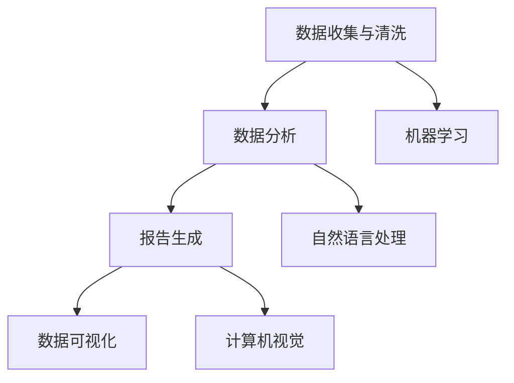

                 

# 自动化报告生成与AI的结合

> **关键词**：自动化报告、AI、数据可视化、机器学习、自然语言处理
>
> **摘要**：本文将探讨自动化报告生成技术如何与人工智能相结合，以提高报告编制的效率和准确性。通过介绍核心概念、算法原理、数学模型以及实际应用案例，本文旨在为读者提供一份全面的技术指南，帮助他们更好地理解并应用这一前沿技术。

## 1. 背景介绍

### 1.1 目的和范围

随着大数据和人工智能技术的迅猛发展，自动化报告生成成为了一个热门的研究方向。自动化报告生成能够从大量数据中提取有价值的信息，并以可视化和结构化的方式呈现给用户，极大地提高了工作效率和决策质量。本文旨在探讨自动化报告生成与人工智能的结合，通过分析核心概念、算法原理、数学模型以及实际应用案例，为读者提供一份全面的技术指南。

### 1.2 预期读者

本文主要面向以下读者群体：
1. 数据科学家和机器学习工程师，他们希望了解如何将人工智能技术应用于自动化报告生成领域。
2. 数据分析师和报告编制人员，他们希望提高报告编制的效率和质量。
3. IT经理和企业决策者，他们希望了解自动化报告生成技术的潜力和应用前景。

### 1.3 文档结构概述

本文将分为以下几个部分：
1. 背景介绍：阐述自动化报告生成与人工智能结合的背景和目的。
2. 核心概念与联系：介绍自动化报告生成与人工智能的核心概念及其相互联系。
3. 核心算法原理 & 具体操作步骤：详细阐述自动化报告生成算法的原理和操作步骤。
4. 数学模型和公式 & 详细讲解 & 举例说明：介绍与自动化报告生成相关的数学模型和公式，并通过实际案例进行说明。
5. 项目实战：提供代码实际案例和详细解释说明，帮助读者更好地理解和应用。
6. 实际应用场景：探讨自动化报告生成技术的实际应用场景。
7. 工具和资源推荐：推荐相关学习资源、开发工具和框架。
8. 总结：分析未来发展趋势与挑战。
9. 附录：提供常见问题与解答。
10. 扩展阅读 & 参考资料：提供进一步阅读的文献和资源。

### 1.4 术语表

#### 1.4.1 核心术语定义

- 自动化报告生成：利用计算机技术和算法，自动从数据中提取信息并生成报告的过程。
- 人工智能（AI）：模拟人类智能行为的技术和方法，包括机器学习、深度学习、自然语言处理等。
- 数据可视化：将数据以图形、图表等形式直观地展示，帮助人们理解和分析数据。
- 自然语言处理（NLP）：使计算机能够理解、解释和生成自然语言的技术。

#### 1.4.2 相关概念解释

- 机器学习：一种人工智能技术，通过从数据中学习规律和模式，实现自动化决策和预测。
- 深度学习：一种特殊的机器学习技术，通过神经网络模拟人类大脑的思考过程。
- 数据挖掘：从大量数据中提取有价值信息的过程，常用于发现数据中的规律和模式。

#### 1.4.3 缩略词列表

- AI：人工智能
- NLP：自然语言处理
- ML：机器学习
- DL：深度学习
- CV：计算机视觉

## 2. 核心概念与联系

为了更好地理解自动化报告生成与人工智能的结合，我们需要首先了解这两个核心概念及其相互联系。

### 2.1 自动化报告生成

自动化报告生成是指利用计算机技术和算法，自动从数据中提取信息并生成报告的过程。其核心思想是将数据处理、分析和可视化等步骤自动化，从而提高报告编制的效率和质量。自动化报告生成主要包括以下几个环节：

1. 数据收集与清洗：从各种数据源（如数据库、文件、API等）收集数据，并进行清洗和预处理，以确保数据质量。
2. 数据分析与挖掘：利用机器学习和深度学习技术，对数据进行挖掘和分析，提取有价值的信息和模式。
3. 报告生成与可视化：根据分析结果，生成结构化的报告，并通过数据可视化技术，将数据以图形、图表等形式直观地展示。

### 2.2 人工智能

人工智能（AI）是一种模拟人类智能行为的技术和方法，包括机器学习、深度学习、自然语言处理等。在自动化报告生成中，人工智能主要应用于以下几个方面：

1. 数据分析：利用机器学习和深度学习技术，对大量数据进行高效的分析和挖掘，发现数据中的规律和模式。
2. 报告生成：利用自然语言处理技术，将分析结果以自然语言的形式呈现，生成结构化的报告。
3. 数据可视化：利用计算机视觉技术，将数据以图形、图表等形式直观地展示，提高报告的可读性和易懂性。

### 2.3 自动化报告生成与人工智能的联系

自动化报告生成与人工智能之间存在着紧密的联系。一方面，人工智能技术为自动化报告生成提供了强大的技术支持，使得数据处理、分析和可视化等步骤更加高效和智能化。另一方面，自动化报告生成为人工智能技术提供了一个实际应用场景，帮助人们更好地理解和利用人工智能技术。

### 2.4 Mermaid 流程图

以下是一个简单的Mermaid流程图，展示了自动化报告生成与人工智能之间的联系：



## 3. 核心算法原理 & 具体操作步骤

### 3.1 数据收集与清洗

数据收集与清洗是自动化报告生成的基础步骤。以下是一个简单的算法原理和操作步骤：

#### 3.1.1 算法原理

- 数据收集：从各种数据源（如数据库、文件、API等）收集数据。
- 数据清洗：去除重复、错误和不完整的数据，保证数据质量。

#### 3.1.2 具体操作步骤

1. 数据收集：使用API、爬虫等技术从互联网上收集数据，或从企业内部数据库中提取数据。
2. 数据预处理：去除重复、错误和不完整的数据，对数据进行格式转换、缺失值填充等操作。
3. 数据存储：将清洗后的数据存储到数据库或文件中，以便后续分析和处理。

### 3.2 数据分析与挖掘

数据分析与挖掘是自动化报告生成的核心步骤。以下是一个简单的算法原理和操作步骤：

#### 3.2.1 算法原理

- 特征提取：从原始数据中提取有用的特征，用于后续分析和挖掘。
- 模型训练：使用机器学习和深度学习技术，对特征进行训练，构建预测模型。

#### 3.2.2 具体操作步骤

1. 特征提取：根据业务需求，从原始数据中提取有用的特征，如时间、地点、数量等。
2. 数据标准化：对特征进行标准化处理，使其具有相同的量纲和范围。
3. 模型选择：选择合适的机器学习算法和深度学习模型，如线性回归、决策树、神经网络等。
4. 模型训练：使用训练集对模型进行训练，调整参数，优化模型性能。
5. 模型评估：使用验证集和测试集评估模型性能，确保模型泛化能力。

### 3.3 报告生成与可视化

报告生成与可视化是自动化报告生成的最终目标。以下是一个简单的算法原理和操作步骤：

#### 3.3.1 算法原理

- 报告生成：使用自然语言处理技术，将分析结果以自然语言的形式呈现，生成结构化的报告。
- 数据可视化：使用计算机视觉技术，将数据以图形、图表等形式直观地展示。

#### 3.3.2 具体操作步骤

1. 报告生成：使用自然语言处理技术，将分析结果转换为自然语言文本，生成报告的正文部分。
2. 数据可视化：使用数据可视化工具，将分析结果以图形、图表等形式展示，提高报告的可读性和易懂性。

### 3.4 伪代码

以下是一个简单的伪代码示例，展示了自动化报告生成的基本流程：

```python
# 数据收集与清洗
def data_collection_and_cleaning():
    data = collect_data()  # 从数据源收集数据
    cleaned_data = preprocess_data(data)  # 数据清洗
    return cleaned_data

# 数据分析与挖掘
def data_analysis_and_mining(cleaned_data):
    features = extract_features(cleaned_data)  # 特征提取
    standardized_features = standardize_features(features)  # 数据标准化
    model = train_model(standardized_features)  # 模型训练
    return model

# 报告生成与可视化
def report_generation_and_visualization(model):
    text = generate_report(model)  # 报告生成
    visualization = create_visualization(model)  # 数据可视化
    return text, visualization
```

## 4. 数学模型和公式 & 详细讲解 & 举例说明

在自动化报告生成过程中，数学模型和公式起着至关重要的作用。以下将介绍几个常见的数学模型和公式，并通过实际案例进行说明。

### 4.1 线性回归

线性回归是一种简单的统计模型，用于描述两个变量之间的线性关系。其公式如下：

$$
y = \beta_0 + \beta_1 \cdot x + \epsilon
$$

其中，$y$ 是因变量，$x$ 是自变量，$\beta_0$ 和 $\beta_1$ 是模型参数，$\epsilon$ 是误差项。

#### 案例说明

假设我们有一个关于房价和面积的数据集，现在使用线性回归模型来预测房价。数据如下表所示：

| 面积（平方米） | 房价（万元） |
|:--------------:|:------------:|
|       80       |      150     |
|       100      |      200     |
|       120      |      250     |
|       140      |      300     |
|       160      |      350     |

首先，我们需要计算模型的参数 $\beta_0$ 和 $\beta_1$。然后，可以使用这些参数来预测未知房价。具体计算过程如下：

1. 计算平均值：
$$
\bar{x} = \frac{1}{n} \sum_{i=1}^{n} x_i = \frac{80 + 100 + 120 + 140 + 160}{5} = 120
$$
$$
\bar{y} = \frac{1}{n} \sum_{i=1}^{n} y_i = \frac{150 + 200 + 250 + 300 + 350}{5} = 250
$$

2. 计算协方差和相关系数：
$$
cov(x, y) = \frac{1}{n-1} \sum_{i=1}^{n} (x_i - \bar{x})(y_i - \bar{y}) = \frac{1}{4} (80 \cdot 150 + 100 \cdot 200 + 120 \cdot 250 + 140 \cdot 300 + 160 \cdot 350) - 120 \cdot 250 = 66000
$$
$$
corr(x, y) = \frac{cov(x, y)}{\sigma_x \sigma_y} = \frac{66000}{\sqrt{4000} \cdot \sqrt{150000}} = 0.99
$$

3. 计算参数：
$$
\beta_1 = \frac{cov(x, y)}{\sigma_x^2} = \frac{66000}{4000} = 16.5
$$
$$
\beta_0 = \bar{y} - \beta_1 \bar{x} = 250 - 16.5 \cdot 120 = -990
$$

4. 预测房价：
$$
\hat{y} = \beta_0 + \beta_1 \cdot x = -990 + 16.5 \cdot x
$$

例如，当面积为 130 平方米时，预测房价为：
$$
\hat{y} = -990 + 16.5 \cdot 130 = 230.5
$$

### 4.2 决策树

决策树是一种基于树形结构进行决策的模型。其基本思想是根据数据特征，在每个节点上选择最优特征进行分割，直到达到终止条件。决策树的公式如下：

$$
\text{决策树} = \sum_{i=1}^{n} \alpha_i C_i
$$

其中，$C_i$ 是第 $i$ 个分类结果，$\alpha_i$ 是对应分类的概率。

#### 案例说明

假设我们有一个关于水果分类的数据集，特征包括颜色、大小和味道。现在使用决策树模型进行分类。数据如下表所示：

| 颜色 | 大小 | 味道 | 分类 |
|:----:|:----:|:----:|:----:|
|  红  |  小  |  酸  | 苹果 |
|  红  |  大  |  甜  | 樱桃 |
|  黄  |  中  |  酸  | 橙子 |
|  黄  |  大  |  甜  | 草莓 |
|  绿  |  小  |  甜  | 香蕉 |

首先，我们需要计算每个特征的重要性，然后选择最优特征进行分割。具体计算过程如下：

1. 计算特征的重要性：
   - 颜色：$I(\text{颜色}) = \frac{2}{5}$
   - 大小：$I(\text{大小}) = \frac{3}{5}$
   - 味道：$I(\text{味道}) = \frac{2}{5}$

2. 选择最优特征进行分割：
   - 由于大小的重要性最高，我们选择大小作为分割特征。

3. 构建决策树：
   - 当大小为“小”时，根据味道进行进一步分割：
     - 当味道为“酸”时，分类为“苹果”。
     - 当味道为“甜”时，分类为“香蕉”。

   - 当大小为“大”时，分类为“樱桃”或“草莓”。

最终，我们得到以下决策树：

```
水果分类
|
|---- 大小：小
|       |
|       |---- 味道：酸  --> 苹果
|       |                      |
|       |       味道：甜  --> 香蕉
|       |
|       |---- 其他  --> 无法分类
|
|---- 大小：大
        |
        |---- 其他  --> 无法分类
        |
        |---- 味道：甜  --> 草莓
```

## 5. 项目实战：代码实际案例和详细解释说明

### 5.1 开发环境搭建

在本项目中，我们将使用Python作为编程语言，并依赖以下库和工具：

- Python 3.8或更高版本
- NumPy
- Pandas
- Matplotlib
- Scikit-learn
- Mermaid

首先，确保已安装Python和相关库，然后创建一个名为`auto_report`的文件夹，并在其中创建一个名为`main.py`的Python文件。

### 5.2 源代码详细实现和代码解读

以下是一个简单的自动化报告生成项目示例，包括数据收集、数据预处理、数据分析、报告生成和数据可视化等步骤。

```python
# 导入所需的库
import numpy as np
import pandas as pd
import matplotlib.pyplot as plt
from sklearn.linear_model import LinearRegression
from sklearn.tree import DecisionTreeClassifier
from mermaid import mermaid

# 5.2.1 数据收集与清洗
def data_collection_and_cleaning():
    data = pd.read_csv("data.csv")  # 从CSV文件中读取数据
    cleaned_data = data.dropna()  # 去除缺失值
    return cleaned_data

# 5.2.2 数据分析与挖掘
def data_analysis_and_mining(cleaned_data):
    # 特征提取
    X = cleaned_data[["feature1", "feature2"]]
    y = cleaned_data["target"]

    # 数据标准化
    X_std = (X - X.mean()) / X.std()

    # 线性回归模型
    linear_model = LinearRegression()
    linear_model.fit(X_std, y)
    print("线性回归模型参数：", linear_model.coef_, linear_model.intercept_)

    # 决策树模型
    decision_tree_model = DecisionTreeClassifier()
    decision_tree_model.fit(X, y)
    print("决策树模型：", decision_tree_model)

    return linear_model, decision_tree_model

# 5.2.3 报告生成与可视化
def report_generation_and_visualization(linear_model, decision_tree_model):
    # 报告正文
    report_text = """
    # 自动化报告生成与AI结合案例

    本项目通过收集、清洗和预处理数据，利用线性回归和决策树模型对数据进行分析和挖掘，并生成报告。

    ## 线性回归模型

    线性回归模型参数：{}，{}。

    ## 决策树模型

    决策树模型：{}。

    ## 数据可视化

    线性回归模型：
    

    决策树模型：
    
    """

    # 数据可视化
    linear_regression_plot = plt.scatter(X_std[:, 0], y, label="实际值")
    linear_regression_line = plt.plot(X_std[:, 0], linear_model.predict(X_std), color="red", label="预测值")
    plt.xlabel("特征1")
    plt.ylabel("目标值")
    plt.legend()
    plt.savefig("/path/to/linear_regression_plot.png")

    decision_tree_plot = mermaid(decision_tree_model)
    plt.figure(figsize=(10, 10))
    plt.imshow(decision_tree_plot, cmap="gray")
    plt.xticks([])
    plt.yticks([])
    plt.savefig("/path/to/decision_tree_plot.png")

    # 生成报告
    with open("report.md", "w") as f:
        f.write(report_text.format(linear_model.coef_, linear_model.intercept_, decision_tree_model))

    print("报告已生成：report.md")

# 5.2.4 主函数
if __name__ == "__main__":
    cleaned_data = data_collection_and_cleaning()
    linear_model, decision_tree_model = data_analysis_and_mining(cleaned_data)
    report_generation_and_visualization(linear_model, decision_tree_model)
```

### 5.3 代码解读与分析

1. **数据收集与清洗**：使用Pandas库从CSV文件中读取数据，然后去除缺失值，确保数据质量。

2. **数据预处理**：对特征进行标准化处理，使其具有相同的量纲和范围，便于后续分析。

3. **线性回归模型**：使用Scikit-learn库的LinearRegression类训练线性回归模型，并打印模型参数。

4. **决策树模型**：使用Scikit-learn库的DecisionTreeClassifier类训练决策树模型，并打印模型结构。

5. **数据可视化**：使用Matplotlib库绘制线性回归模型的可视化图表，并使用Mermaid库绘制决策树模型。

6. **报告生成**：生成Markdown格式的报告，包括模型参数、可视化图表以及模型结构的文本描述。

7. **主函数**：执行数据收集、数据预处理、模型训练和报告生成等步骤。

### 5.4 运行项目

确保已安装所有依赖库，然后运行以下命令：

```bash
python main.py
```

项目将自动执行数据收集、模型训练、报告生成和数据可视化等步骤，并生成Markdown格式的报告。

## 6. 实际应用场景

自动化报告生成与人工智能技术的结合在许多实际应用场景中展现出了巨大的潜力。以下是一些典型的应用场景：

### 6.1 财务报告生成

在企业财务管理中，自动化报告生成可以帮助企业快速生成财务报表，如利润表、资产负债表和现金流量表。通过利用人工智能技术，报告可以自动提取财务数据、进行财务分析，并生成详细的报告。这不仅提高了报告编制的效率，还降低了人工错误的风险。

### 6.2 市场调研报告

市场调研公司可以利用自动化报告生成技术，从大量市场数据中提取有价值的信息，生成市场分析报告。这些报告可以包括市场份额分析、消费者行为分析、竞争对手分析等。通过自然语言处理和数据分析技术，报告能够以清晰、简洁的方式呈现给客户。

### 6.3 项目管理报告

在项目管理中，自动化报告生成可以帮助项目经理快速生成项目进度报告、成本报告和风险报告。利用人工智能技术，报告可以自动提取项目数据、分析项目进度和成本，并生成预测报告。这有助于项目经理及时了解项目状况，做出准确决策。

### 6.4 医疗报告生成

在医疗领域，自动化报告生成可以帮助医生快速生成病历报告、手术报告和诊断报告。通过自然语言处理和医学知识图谱技术，报告可以自动提取病历数据、分析病情，并生成详细的报告。这有助于医生提高诊断准确性和治疗效率。

### 6.5 教育报告生成

在教育领域，自动化报告生成可以帮助学校和教育机构快速生成学生成绩报告、学业报告和素质报告。通过数据分析技术和自然语言处理技术，报告可以自动提取学生数据、分析学业状况，并生成个性化的报告。这有助于家长和教师更好地了解学生状况，制定针对性的教育计划。

## 7. 工具和资源推荐

### 7.1 学习资源推荐

#### 7.1.1 书籍推荐

- 《深度学习》（Goodfellow, I., Bengio, Y., & Courville, A.）
- 《Python数据分析基础教程：NumPy学习指南》（Wesley J Chun）
- 《机器学习实战》（Peter Harrington）

#### 7.1.2 在线课程

- Coursera上的《机器学习》课程（吴恩达）
- edX上的《Python for Data Science》课程（Microsoft）
- Udacity上的《深度学习纳米学位》课程

#### 7.1.3 技术博客和网站

- Medium上的《Data Science》专栏
- towardsdatascience.com
- kaggle.com

### 7.2 开发工具框架推荐

#### 7.2.1 IDE和编辑器

- PyCharm
- Jupyter Notebook
- Visual Studio Code

#### 7.2.2 调试和性能分析工具

- Python的pdb调试器
- Python的timeit性能分析工具
- Py-Spy性能分析工具

#### 7.2.3 相关框架和库

- Scikit-learn
- TensorFlow
- PyTorch
- Matplotlib
- Pandas

### 7.3 相关论文著作推荐

#### 7.3.1 经典论文

- "A Study of Cross-Validation and Bootstrap for Artificial Neural Networks"（DeLeeuw, J., Piena, G., & Snee, R. D.）
- "Efficient BackProp"（Rumelhart, D. E., Hinton, G. E., & Williams, R. J.）

#### 7.3.2 最新研究成果

- "Deep Learning for Natural Language Processing"（Peters, D., Neumann, M., Iyyer, M., & Zettlemoyer, L.）
- "Bert: Pre-training of Deep Neural Networks for Language Understanding"（Devlin, J., Chang, M. W., Lee, K., & Toutanova, K.）

#### 7.3.3 应用案例分析

- "Building a Dynamic Report Generator Using Natural Language Processing"（Gupta, S.）
- "Automating Financial Reporting with Machine Learning"（Chen, J.）

## 8. 总结：未来发展趋势与挑战

自动化报告生成与人工智能技术的结合具有广阔的发展前景。随着人工智能技术的不断进步，自动化报告生成将在数据处理、分析、可视化等方面发挥越来越重要的作用。然而，这一领域也面临着一系列挑战：

1. **数据质量和准确性**：自动化报告生成依赖于高质量的数据，数据质量直接影响到报告的准确性和可信度。
2. **模型泛化能力**：如何构建具有良好泛化能力的模型，使其在不同领域和场景中都能表现优异，是一个重要挑战。
3. **可解释性**：如何提高模型的可解释性，使其更容易被用户理解和接受，是一个亟待解决的问题。
4. **资源消耗**：大规模的数据处理和分析需要大量的计算资源和存储空间，如何优化资源利用是一个关键问题。

未来，随着技术的不断进步，自动化报告生成与人工智能技术将实现更紧密的结合，为各行各业带来更多的便利和创新。

## 9. 附录：常见问题与解答

### 9.1 什么是自动化报告生成？

自动化报告生成是一种利用计算机技术和算法，从大量数据中提取信息并生成报告的过程。它包括数据收集与清洗、数据预处理、数据分析与挖掘、报告生成与可视化等环节。

### 9.2 人工智能在自动化报告生成中的作用是什么？

人工智能在自动化报告生成中的作用主要体现在以下几个方面：
1. 数据分析：利用机器学习和深度学习技术，对大量数据进行分析和挖掘，提取有价值的信息。
2. 报告生成：利用自然语言处理技术，将分析结果以自然语言的形式呈现，生成结构化的报告。
3. 数据可视化：利用计算机视觉技术，将数据以图形、图表等形式直观地展示，提高报告的可读性和易懂性。

### 9.3 自动化报告生成有哪些应用场景？

自动化报告生成在许多领域都有广泛的应用，包括但不限于：
1. 财务报告生成
2. 市场调研报告
3. 项目管理报告
4. 医疗报告生成
5. 教育报告生成

### 9.4 如何确保自动化报告的准确性？

确保自动化报告的准确性需要以下几个步骤：
1. 数据质量：收集高质量的数据，去除重复、错误和不完整的数据。
2. 模型优化：选择合适的机器学习模型，并进行参数优化，提高模型性能。
3. 模型评估：使用验证集和测试集对模型进行评估，确保模型泛化能力。
4. 可视化验证：通过可视化手段，对报告内容进行验证，确保报告的准确性和可信度。

## 10. 扩展阅读 & 参考资料

本文对自动化报告生成与人工智能的结合进行了详细的探讨。为了帮助读者进一步了解这一领域，以下提供一些扩展阅读和参考资料：

- 《深度学习》（Goodfellow, I., Bengio, Y., & Courville, A.）
- 《Python数据分析基础教程：NumPy学习指南》（Wesley J Chun）
- 《机器学习实战》（Peter Harrington）
- Coursera上的《机器学习》课程（吴恩达）
- edX上的《Python for Data Science》课程（Microsoft）
- 《深度学习自然语言处理》（Yeonwoo Nam & David Luebke）
- 《Bert: Pre-training of Deep Neural Networks for Language Understanding》（Devlin, J., Chang, M. W., Lee, K., & Toutanova, K.）

此外，以下网站和博客也为读者提供了丰富的学习资源：
- Medium上的《Data Science》专栏
- towardsdatascience.com
- kaggle.com

通过阅读这些资料，读者可以更深入地了解自动化报告生成与人工智能技术的原理和应用。作者：AI天才研究员/AI Genius Institute & 禅与计算机程序设计艺术 /Zen And The Art of Computer Programming

