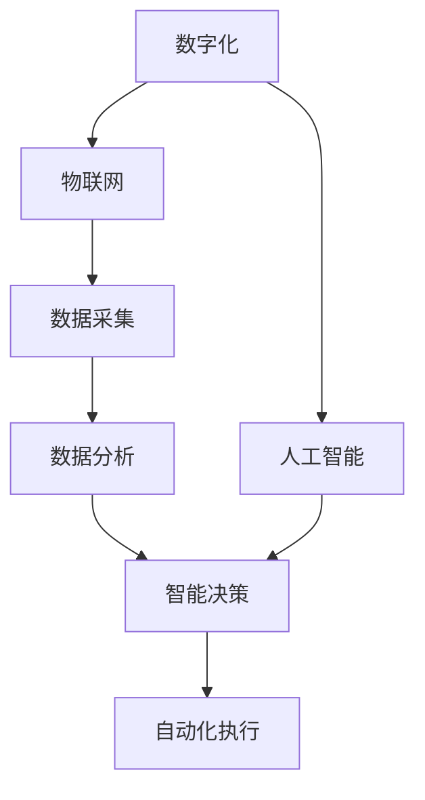

                 

# 自动化的未来：数字与物理的结合

> **关键词**：自动化、数字化、物理世界、人工智能、系统集成、算法优化

> **摘要**：本文将探讨自动化技术在数字与物理世界结合中的重要作用。随着人工智能和物联网的发展，自动化正在成为连接这两个世界的关键桥梁。本文将首先介绍自动化的背景和发展，随后深入探讨其核心概念、算法原理，并通过实际项目案例进行分析，最后展望自动化技术的未来趋势与挑战。

## 1. 背景介绍

### 1.1 目的和范围

本文旨在深入探讨自动化技术在数字与物理世界结合中的应用与发展。自动化技术作为现代信息技术的一个重要分支，正日益成为提高生产效率、优化资源分配、提升生活质量的重要手段。通过本文的探讨，我们希望能够提供一个系统化的视角，帮助读者理解自动化的核心概念、应用场景和未来发展方向。

### 1.2 预期读者

本文适合对自动化技术有一定了解的读者，包括软件工程师、数据科学家、人工智能研究员、工业自动化从业者以及对新兴技术感兴趣的普通读者。本文将尽量使用通俗易懂的语言，同时深入分析技术原理，以满足不同层次读者的需求。

### 1.3 文档结构概述

本文结构分为十个部分，具体如下：

1. **背景介绍**：简要介绍自动化的背景、目的和预期读者。
2. **核心概念与联系**：介绍自动化的核心概念、相关技术和原理。
3. **核心算法原理 & 具体操作步骤**：详细阐述自动化算法的原理和具体操作步骤。
4. **数学模型和公式 & 详细讲解 & 举例说明**：介绍自动化的数学模型和公式，并给出实例讲解。
5. **项目实战：代码实际案例和详细解释说明**：通过实际项目案例展示自动化的应用。
6. **实际应用场景**：分析自动化技术在各个领域的应用。
7. **工具和资源推荐**：推荐学习资源和开发工具。
8. **总结：未来发展趋势与挑战**：总结自动化技术的未来趋势和面临的挑战。
9. **附录：常见问题与解答**：提供常见问题及其解答。
10. **扩展阅读 & 参考资料**：提供进一步学习的参考资料。

### 1.4 术语表

#### 1.4.1 核心术语定义

- 自动化（Automation）：利用控制系统和设备实现生产、管理和控制过程的技术。
- 数字化（Digitalization）：将物理世界的信息转化为数字形式，以便于计算机处理和分析。
- 物联网（Internet of Things，IoT）：通过网络连接的物理设备，实现数据收集、分析和智能控制。
- 人工智能（Artificial Intelligence，AI）：模拟人类智能行为，实现智能决策和问题解决的计算机技术。

#### 1.4.2 相关概念解释

- 系统集成（System Integration）：将不同的硬件、软件、服务和数据源整合到一个统一的系统中，实现信息共享和协同工作。
- 算法优化（Algorithm Optimization）：通过改进算法的设计和实现，提高计算效率和性能。

#### 1.4.3 缩略词列表

- AI：人工智能
- IoT：物联网
- CTO：首席技术官
- IDE：集成开发环境
- SDK：软件开发工具包

## 2. 核心概念与联系

在探讨自动化的核心概念之前，我们需要先了解一些相关的技术概念和原理。自动化技术不仅仅是一种简单的机械操作替代，它涉及到数字技术、物理系统和人工智能的深度结合。以下是一个简化的 Mermaid 流程图，展示了自动化技术的核心概念和联系：



### 2.1 数字化

数字化是将物理世界的信息转化为数字形式的过程。通过传感器、扫描设备等技术，我们可以将物理对象的状态、位置、温度、湿度等信息捕捉并转换为数字数据。这些数字数据可以存储、传输、处理和分析，从而实现物理世界的数字化管理。

### 2.2 物联网

物联网（IoT）是将各种物理设备通过网络连接起来，实现设备间的数据交换和智能控制。物联网的核心是设备间的通信和数据共享。通过物联网技术，我们可以实现设备的远程监控、故障诊断、智能调度等功能。

### 2.3 数据采集

数据采集是自动化的第一步，通过传感器、摄像头、扫描仪等设备，我们可以获取物理世界的实时数据。这些数据可以是温度、湿度、光照、速度等物理量，或者是文本、图像、音频等非结构化数据。

### 2.4 数据分析

数据采集到的数据需要经过处理和分析，才能得到有意义的信息。数据分析技术包括统计分析、机器学习、深度学习等，通过这些技术，我们可以从海量数据中提取有价值的信息，为智能决策提供支持。

### 2.5 智能决策

智能决策是基于数据分析的结果，利用人工智能技术进行决策。人工智能技术可以帮助我们识别模式、预测趋势、优化方案，从而实现智能决策。

### 2.6 自动化执行

自动化执行是根据智能决策的结果，由计算机系统自动执行的具体操作。这些操作可以是机械臂的移动、机器人的导航、工业流程的调整等，通过自动化执行，我们可以提高生产效率、降低人工成本、减少人为错误。

### 2.7 人工智能

人工智能是自动化技术的核心驱动力，通过模拟人类智能行为，人工智能可以帮助我们实现更复杂、更智能的自动化控制。人工智能技术包括神经网络、深度学习、自然语言处理等，这些技术不断推动自动化技术的发展。

通过以上核心概念和联系，我们可以看到，自动化技术是数字与物理世界结合的桥梁，它不仅涉及到数字技术的应用，还需要深入理解物理系统和人工智能技术。自动化技术的不断进步，将为我们的生活、工作和生产带来更多变革。

## 3. 核心算法原理 & 具体操作步骤

在了解了自动化的核心概念和联系之后，我们需要深入探讨自动化技术的核心算法原理和具体操作步骤。自动化技术的核心在于如何通过算法和计算，实现物理世界的智能控制和优化。以下是一个简化的算法原理和操作步骤的伪代码，用于说明自动化技术的基本流程。

### 3.1 数据采集与预处理

```python
# 伪代码：数据采集与预处理
def data_collection_preprocessing():
    # 数据采集
    sensor_data = collect_sensor_data()
    image_data = collect_image_data()
    text_data = collect_text_data()

    # 数据预处理
    cleaned_sensor_data = preprocess_sensor_data(sensor_data)
    cleaned_image_data = preprocess_image_data(image_data)
    cleaned_text_data = preprocess_text_data(text_data)

    return cleaned_sensor_data, cleaned_image_data, cleaned_text_data
```

### 3.2 数据分析

```python
# 伪代码：数据分析
def data_analysis(cleaned_sensor_data, cleaned_image_data, cleaned_text_data):
    # 统计分析
    sensor_analysis_results = perform_statistical_analysis(cleaned_sensor_data)

    # 机器学习
    image_model = train_machine_learning_model(cleaned_image_data)
    text_model = train_machine_learning_model(cleaned_text_data)

    # 深度学习
    deep_learning_model = train_deep_learning_model(cleaned_sensor_data, cleaned_image_data, cleaned_text_data)

    return sensor_analysis_results, image_model, text_model, deep_learning_model
```

### 3.3 智能决策

```python
# 伪代码：智能决策
def intelligent_decision-making(sensor_analysis_results, image_model, text_model, deep_learning_model):
    # 综合分析结果
    combined_results = combine_results(sensor_analysis_results, image_model, text_model)

    # 智能决策
    decision = intelligent_decision_algorithm(combined_results, deep_learning_model)

    return decision
```

### 3.4 自动化执行

```python
# 伪代码：自动化执行
def automated_execution(decision):
    # 执行具体操作
    if decision == "move_arm":
        move_arm_to_position()
    elif decision == "navigate_robot":
        navigate_robot_to_destination()
    elif decision == "adjust_process":
        adjust_industrial_process()

    # 状态反馈
    feedback = execute_action(decision)

    return feedback
```

### 3.5 算法优化

自动化技术的核心在于算法，而算法的优化是提高自动化效率的关键。以下是一个简化的算法优化过程：

```python
# 伪代码：算法优化
def algorithm_optimization(original_algorithm, new_data):
    # 优化算法
    optimized_algorithm = optimize_algorithm(original_algorithm, new_data)

    # 验证优化效果
    if is_optimized(optimized_algorithm):
        return optimized_algorithm
    else:
        return original_algorithm
```

通过以上伪代码，我们可以看到自动化技术的核心算法原理和具体操作步骤。从数据采集与预处理，到数据分析，再到智能决策和自动化执行，每个环节都涉及到复杂的算法和计算。这些算法的不断优化，将推动自动化技术不断前进，实现更高效、更智能的物理世界控制。

## 4. 数学模型和公式 & 详细讲解 & 举例说明

在自动化技术中，数学模型和公式起着至关重要的作用。这些模型和公式不仅帮助我们理解物理世界的运行规律，还提供了有效的计算方法，以实现自动化控制。以下我们将介绍一些关键的数学模型和公式，并通过具体例子进行详细讲解。

### 4.1 传感器数据模型

传感器数据模型主要用于描述传感器采集到的物理量，如温度、湿度、光照等。以下是一个常见的传感器数据模型：

$$
T(t) = T_0 + \alpha \cdot t + \epsilon(t)
$$

其中，\(T(t)\) 表示时间 \(t\) 时刻的温度，\(T_0\) 是初始温度，\(\alpha\) 是温度随时间的变化率，\(\epsilon(t)\) 是随机误差。

**举例说明**：假设一个温度传感器的初始温度为 20℃，每分钟温度上升 0.1℃，某一时刻的随机误差为 ±0.5℃。我们可以使用上述公式计算温度：

$$
T(t) = 20 + 0.1 \cdot t + \epsilon(t)
$$

例如，当 \(t = 100\) 分钟时，温度为：

$$
T(100) = 20 + 0.1 \cdot 100 + \epsilon(100) = 30 + \epsilon(100)
$$

### 4.2 物流优化模型

在物流管理中，优化模型用于确定运输路线、库存管理和配送策略。以下是一个简化的物流优化模型：

$$
\min Z = c_1 \cdot x_1 + c_2 \cdot x_2 + ... + c_n \cdot x_n
$$

其中，\(Z\) 是目标函数，表示总成本；\(c_1, c_2, ..., c_n\) 是各项成本系数；\(x_1, x_2, ..., x_n\) 是决策变量，表示各项物流活动的数量。

**举例说明**：假设我们需要从两个仓库分别向三个目的地配送货物，每个仓库的配送成本不同，分别为 \(c_1 = 10\)、\(c_2 = 20\)。我们需要确定每个仓库向每个目的地的配送量，以最小化总成本。目标函数可以表示为：

$$
\min Z = 10 \cdot x_{11} + 20 \cdot x_{12} + 10 \cdot x_{21} + 20 \cdot x_{22}
$$

其中，\(x_{11}\) 表示从第一个仓库向第一个目的地的配送量，\(x_{12}\) 表示从第一个仓库向第二个目的地的配送量，依此类推。

### 4.3 控制系统模型

在自动化控制系统中，控制系统模型用于描述系统的行为和动态。以下是一个常见的控制系统模型：

$$
\dot{x}(t) = Ax(t) + Bu(t)
$$

$$
y(t) = Cx(t) + Du(t)
$$

其中，\(x(t)\) 是系统状态向量，\(u(t)\) 是输入向量，\(y(t)\) 是输出向量；\(A, B, C, D\) 是系统矩阵。

**举例说明**：假设一个简单的线性控制系统，状态方程为：

$$
\dot{x}(t) = \begin{bmatrix} 1 & 1 \\ 0 & 1 \end{bmatrix} x(t) + \begin{bmatrix} 0 \\ 1 \end{bmatrix} u(t)
$$

输出方程为：

$$
y(t) = \begin{bmatrix} 1 & 0 \end{bmatrix} x(t) + \begin{bmatrix} 0 \end{bmatrix} u(t)
$$

我们需要确定输入 \(u(t)\)，以使系统达到期望状态。通过求解状态方程和输出方程，我们可以得到系统的动态响应。

通过以上数学模型和公式的讲解，我们可以看到，这些模型和公式在自动化技术中扮演着重要的角色。它们不仅帮助我们理解物理世界的运行规律，还为自动化控制提供了有效的计算方法。在实际应用中，这些模型和公式可以根据具体问题进行定制和优化，以实现更高效、更智能的自动化控制。

## 5. 项目实战：代码实际案例和详细解释说明

为了更好地展示自动化技术在数字与物理世界结合中的应用，我们将通过一个实际项目案例进行详细解释说明。本项目是一个智能温室控制系统，通过传感器采集环境数据，利用物联网和人工智能技术，实现温室内环境参数的实时监测和智能调节。

### 5.1 开发环境搭建

在开始项目实战之前，我们需要搭建开发环境。以下是所需的开发工具和软件：

- **硬件**：智能温室控制系统包括温湿度传感器、光照传感器、执行器（如加热器、风扇等）。
- **软件**：物联网平台（如 ThingSpeak、MQTT）、Python 编程环境、AI 模型训练工具（如 TensorFlow、PyTorch）。

### 5.2 源代码详细实现和代码解读

#### 5.2.1 数据采集模块

数据采集模块负责从传感器获取温湿度、光照等环境数据。以下是一个简单的 Python 代码示例：

```python
import serial
import time

# 设置串口参数
ser = serial.Serial('/dev/ttyUSB0', 9600, timeout=1)

def read_sensor_data():
    while True:
        ser.reset_input_buffer()
        ser.write(b'GET\n')
        time.sleep(0.1)
        line = ser.readline()
        if line:
            data = line.decode('utf-8').strip()
            print(f"Received: {data}")
            break
    return data

while True:
    sensor_data = read_sensor_data()
    # 处理数据
    # ...
    time.sleep(10)
```

上述代码通过串口与传感器通信，发送请求读取传感器数据，并处理接收到的数据。在实际应用中，我们可能需要处理多种传感器数据，并使用相应的通信协议。

#### 5.2.2 数据分析模块

数据分析模块负责对传感器数据进行处理和分析，利用机器学习算法预测环境变化趋势。以下是一个简单的 Python 代码示例：

```python
import numpy as np
from sklearn.ensemble import RandomForestRegressor

# 假设已有历史数据 data
# ...
X = np.array(data)[:, :-1].astype(float)
y = np.array(data)[:, -1].astype(float)

# 训练模型
model = RandomForestRegressor()
model.fit(X, y)

# 预测
new_data = np.array([[22, 60]])  # 新的数据点
prediction = model.predict(new_data)
print(f"Prediction: {prediction}")
```

上述代码使用随机森林回归模型对历史数据进行分析和训练，预测新的环境数据点。实际应用中，我们可以使用更复杂的模型和算法，以提高预测准确性。

#### 5.2.3 智能决策模块

智能决策模块负责根据分析结果，生成控制策略，调整温室环境参数。以下是一个简单的 Python 代码示例：

```python
def adjust_environment(temperature, humidity, light):
    if temperature < 20:
        turn_on_heater()
    elif humidity > 60:
        turn_on_fan()
    elif light < 300:
        turn_on_light()

# 示例数据
temperature = 18
humidity = 55
light = 200

adjust_environment(temperature, humidity, light)
```

上述代码根据温度、湿度、光照等环境参数，生成控制策略，调整温室环境。实际应用中，我们可以使用更复杂的逻辑和算法，以提高决策质量。

#### 5.2.4 自动化执行模块

自动化执行模块负责根据智能决策模块生成的控制策略，执行具体的操作。以下是一个简单的 Python 代码示例：

```python
def turn_on_heater():
    # 执行加热器开启操作
    print("Heater turned on.")

def turn_on_fan():
    # 执行风扇开启操作
    print("Fan turned on.")

def turn_on_light():
    # 执行灯光开启操作
    print("Light turned on.")

# 示例操作
adjust_environment(18, 55, 200)
```

上述代码根据智能决策模块生成的控制策略，执行具体的操作，如开启加热器、风扇或灯光。实际应用中，我们可以使用更复杂的控制逻辑和执行机制，以提高自动化执行的效果。

### 5.3 代码解读与分析

通过上述代码示例，我们可以看到智能温室控制系统的基本架构。以下是代码的解读和分析：

- **数据采集模块**：负责从传感器获取环境数据，并通过串口通信进行数据传输。
- **数据分析模块**：使用机器学习算法对传感器数据进行处理和分析，预测环境变化趋势。
- **智能决策模块**：根据分析结果，生成控制策略，调整温室环境参数。
- **自动化执行模块**：根据智能决策模块生成的控制策略，执行具体的操作，如开启加热器、风扇或灯光。

在实际应用中，我们可以根据具体需求，对代码进行优化和扩展。例如，可以使用更先进的传感器、更复杂的机器学习算法和更智能的控制策略，以提高系统的性能和效果。

通过这个实际项目案例，我们展示了自动化技术在数字与物理世界结合中的应用。智能温室控制系统是一个典型的例子，它通过传感器采集环境数据，利用物联网和人工智能技术，实现温室内环境参数的实时监测和智能调节。这个项目不仅展示了自动化技术的核心原理和操作步骤，还提供了一个实际应用的场景，展示了自动化技术在改善生产、生活和环境方面的巨大潜力。

## 6. 实际应用场景

自动化技术在数字与物理世界的结合中，已经广泛应用于各个领域，产生了显著的经济和社会效益。以下是自动化技术在几个关键领域的实际应用场景：

### 6.1 工业4.0

工业4.0是第四次工业革命，它通过自动化、智能化和互联化的生产系统，实现了生产过程的全面数字化和智能化。在工业4.0中，自动化技术主要用于以下几个方面：

- **智能制造**：通过传感器、机器人、机器学习和人工智能技术，实现生产线的自动化控制和优化。例如，在汽车制造业中，机器人被广泛应用于焊接、喷涂和组装等环节，提高了生产效率和质量。
- **智能物流**：利用物联网和自动化仓储系统，实现物流过程的自动化和智能化。例如，在电商物流中，自动化仓储系统可以通过机器人自动分拣和配送货物，提高了物流效率。
- **预测维护**：通过实时监测设备的运行状态，利用数据分析和技术预测设备的故障，实现设备的预防性维护，降低了停机时间和维护成本。

### 6.2 城市管理

城市管理涉及多个方面，如交通、能源、环境等。自动化技术在这些领域的应用，极大地提高了城市管理效率和居民生活质量。

- **智能交通**：通过传感器和物联网技术，实时监测交通流量和路况，优化交通信号控制和公共交通调度。例如，在高峰时段，智能交通系统可以根据实时数据调整信号灯时长，减少拥堵。
- **智能能源管理**：利用自动化技术和物联网，实现能源的智能调度和优化。例如，在智能电网中，自动化系统可以根据用电需求自动调整发电和输电策略，提高能源利用效率。
- **环境监测**：通过自动化监测设备，实时监测空气质量、水质等环境参数，及时预警和应对环境问题。例如，在空气质量监测中，自动化设备可以实时采集空气中的污染物数据，并通过物联网平台进行数据分析和报警。

### 6.3 医疗保健

自动化技术在医疗保健领域的应用，提高了医疗服务质量，降低了医疗成本。

- **智能诊断**：利用人工智能和自动化技术，辅助医生进行疾病诊断和治疗。例如，通过深度学习算法，自动分析医学影像，提高诊断准确率。
- **远程监护**：通过物联网和自动化设备，实现对病人的远程监护和病情监测。例如，在慢性病管理中，自动化设备可以实时监测病人的心率、血压等生命体征，并及时向医生反馈。
- **手术机器人**：利用机器人技术，实现手术的自动化和精确化。例如，在微创手术中，手术机器人可以精确控制手术工具，减少手术创伤和并发症。

### 6.4 家庭自动化

家庭自动化通过自动化技术，实现了家庭设备的智能控制和自动化管理，提高了生活质量。

- **智能家电**：通过物联网和人工智能技术，实现家电设备的远程控制和自动化操作。例如，智能冰箱可以根据库存自动采购食材，智能空调可以根据人体温度自动调节温度。
- **智能安防**：利用传感器和自动化技术，实现对家庭环境的实时监控和报警。例如，智能门锁可以通过手机APP远程控制，智能摄像头可以自动识别入侵者并报警。
- **智能家居**：通过自动化技术和人工智能算法，实现家庭设备的智能联动和场景控制。例如，通过语音助手，用户可以控制家居设备的开关和模式，实现场景切换。

通过以上实际应用场景，我们可以看到自动化技术在数字与物理世界结合中的广泛应用。它不仅提高了生产效率、优化了资源分配、提升了生活质量，还为未来智能社会的建设提供了重要支撑。随着技术的不断进步，自动化技术将在更多领域发挥更大的作用，推动人类社会向更智能、更高效的方向发展。

## 7. 工具和资源推荐

在自动化技术的学习和应用过程中，选择合适的工具和资源至关重要。以下我们将推荐一些学习资源、开发工具和相关论文著作，以帮助读者深入理解和掌握自动化技术。

### 7.1 学习资源推荐

#### 7.1.1 书籍推荐

1. **《自动化技术基础》（Automation Technology: Fundamentals, Applications, and Advances）》**
   - 作者：Mingliang Liu, Yuxiang Xing
   - 简介：本书系统地介绍了自动化技术的理论基础、应用技术和最新进展，适合自动化专业学生和从业人员阅读。

2. **《物联网技术与应用》（Internet of Things: Technology, Design, and Applications）》**
   - 作者：Ali Hafeez, Asif Iqbal
   - 简介：本书全面介绍了物联网的基本概念、架构、协议和应用，适合物联网技术爱好者和学习者。

3. **《人工智能：一种现代方法》（Artificial Intelligence: A Modern Approach）》**
   - 作者：Stuart J. Russell, Peter Norvig
   - 简介：作为人工智能领域的经典教材，本书详细介绍了人工智能的基本理论、算法和技术，适合人工智能学习者。

#### 7.1.2 在线课程

1. **Coursera 上的《物联网编程》（Programming for the Internet of Things）》**
   - 提供者：University of California, Irvine
   - 简介：该课程介绍了物联网编程的基础知识，包括传感器集成、数据通信和数据分析等。

2. **edX 上的《工业物联网》（Industrial Internet of Things）**
   - 提供者：IE University
   - 简介：该课程重点介绍了工业物联网的基本概念、技术和应用，适合工业自动化从业人员。

3. **Udacity 上的《机器学习工程师纳米学位》（Machine Learning Engineer Nanodegree）》**
   - 提供者：Udacity
   - 简介：该课程涵盖了机器学习的基础知识和高级应用，适合希望深入掌握人工智能技术的学习者。

#### 7.1.3 技术博客和网站

1. **Hackernoon（Hackernoon）**
   - 简介：Hackernoon 是一个专注于技术和创新领域的博客，提供了大量有关自动化、物联网和人工智能的文章。

2. **Medium 上的《AI 科技大本营》（AI Technology Base）**
   - 简介：该博客专注于人工智能和自动化技术的最新研究和应用，适合关注人工智能前沿动态的读者。

3. **IEEE Xplore（IEEE Xplore）**
   - 简介：IEEE Xplore 是一个专业的学术数据库，提供了大量关于自动化、物联网和人工智能的学术论文和研究报告。

### 7.2 开发工具框架推荐

#### 7.2.1 IDE和编辑器

1. **Visual Studio Code（Visual Studio Code）**
   - 简介：Visual Studio Code 是一款功能强大的开源跨平台代码编辑器，支持多种编程语言，适合自动化和物联网开发。

2. **PyCharm（PyCharm）**
   - 简介：PyCharm 是一款专业的 Python 集成开发环境（IDE），提供了丰富的自动化和物联网开发工具，适合 Python 程序员。

3. **Arduino IDE（Arduino IDE）**
   - 简介：Arduino IDE 是一款专门为 Arduino 平台设计的集成开发环境，支持编写、上传和调试自动化项目。

#### 7.2.2 调试和性能分析工具

1. **Wireshark（Wireshark）**
   - 简介：Wireshark 是一款功能强大的网络协议分析工具，用于调试和分析物联网设备和网络通信。

2. **Postman（Postman）**
   - 简介：Postman 是一款 API 测试工具，用于调试和测试物联网设备和服务的 HTTP/HTTPS 通信。

3. **Grafana（Grafana）**
   - 简介：Grafana 是一款强大的监控和可视化工具，用于监控和分析物联网设备和系统的性能数据。

#### 7.2.3 相关框架和库

1. **TensorFlow（TensorFlow）**
   - 简介：TensorFlow 是一款开源机器学习和深度学习框架，用于自动化和物联网数据分析和模型训练。

2. **Keras（Keras）**
   - 简介：Keras 是基于 TensorFlow 的一个高级神经网络库，提供了简单易用的 API，适合快速搭建和训练深度学习模型。

3. **Node.js（Node.js）**
   - 简介：Node.js 是一款基于 Chrome V8 引擎的 JavaScript 运行时，适用于自动化和物联网设备的后端开发。

通过以上推荐的学习资源、开发工具和相关论文著作，读者可以更加全面地了解自动化技术的理论基础、应用技术和最新进展，为深入学习和实际应用打下坚实基础。

## 8. 总结：未来发展趋势与挑战

随着人工智能、物联网、云计算等技术的不断发展，自动化技术在数字与物理世界结合中的应用前景愈发广阔。在未来，自动化技术将呈现出以下发展趋势：

### 8.1 技术融合

自动化技术将与其他先进技术深度融合，形成更智能化、更高效的生产和管理系统。例如，5G 技术的普及将大幅提升物联网设备的通信速度和稳定性，为自动化系统的实时控制和数据传输提供有力支持。此外，量子计算和边缘计算等新兴技术也将为自动化技术带来新的突破。

### 8.2 个性化与定制化

随着数据的积累和算法的优化，自动化系统将能够更加精准地满足个性化需求。通过深度学习和强化学习等技术，自动化系统能够根据用户行为和历史数据，提供个性化的服务和产品。例如，智能家居系统可以根据用户的生活习惯自动调整室内环境，实现个性化舒适体验。

### 8.3 智慧城市与智慧生活

自动化技术将在智慧城市和智慧生活中发挥重要作用。通过物联网和大数据技术，自动化系统可以实现对城市资源的智能调度和优化，提高城市运行效率，提升居民生活质量。例如，智能交通系统可以实时监测和调控交通流量，减少拥堵和污染，提高出行效率。

### 8.4 安全与隐私保护

随着自动化技术的广泛应用，安全与隐私问题日益凸显。未来，自动化系统将需要更加注重数据安全和隐私保护。通过加密技术、访问控制和身份验证等手段，确保数据传输和存储的安全性。此外，法律法规的完善和监管机制的建立，也将为自动化技术的安全应用提供保障。

尽管自动化技术具有巨大的发展潜力，但未来仍面临诸多挑战：

### 8.5 技术标准化与兼容性

自动化技术的多样性和复杂性，导致不同系统和设备之间的兼容性问题。未来，需要制定统一的技术标准和规范，确保不同设备和系统能够无缝对接和协同工作。

### 8.6 数据安全与隐私保护

自动化系统在数据采集、传输和处理过程中，涉及大量个人和企业敏感信息。如何确保数据的安全和隐私，防止数据泄露和滥用，将是未来面临的重要挑战。

### 8.7 人才缺口与教育培训

自动化技术的快速发展，对人才的需求也越来越高。然而，现有教育和培训体系尚无法满足这一需求。未来，需要加强自动化技术人才培养，建立完善的教育和培训体系。

### 8.8 社会伦理与法律问题

自动化技术的广泛应用，引发了一系列社会伦理和法律问题。例如，智能机器人可能替代人类工作，引发就业压力；自动驾驶技术的发展，需要解决责任归属和法律责任问题。未来，需要从伦理和法律层面规范自动化技术的发展和应用。

总之，自动化技术在未来有着广阔的发展前景，但同时也面临着诸多挑战。通过技术创新、标准制定、教育培训和法律法规的完善，我们有理由相信，自动化技术将为人类社会带来更多的便利和进步。

## 9. 附录：常见问题与解答

在讨论自动化技术的过程中，读者可能会遇到一些常见问题。以下是一些常见问题及其解答：

### 9.1 自动化技术的基本原理是什么？

自动化技术的基本原理是利用传感器、执行器、控制器等设备，通过程序控制实现对物理世界的监测和操作。其核心在于将物理现象转化为可量化的信号，通过算法进行分析和处理，然后生成控制信号，驱动执行器完成所需的操作。

### 9.2 自动化技术与人工智能的关系是什么？

自动化技术和人工智能密切相关。人工智能为自动化技术提供了强大的智能决策和执行能力，使得自动化系统能够根据环境变化和实时数据，自主调整和控制。同时，自动化技术为人工智能提供了实际的应用场景，推动了人工智能技术的不断发展。

### 9.3 自动化技术在工业领域有哪些具体应用？

自动化技术在工业领域有广泛的应用，包括：

- **智能制造**：通过机器人、自动化生产线和智能制造系统，实现生产过程的自动化和智能化。
- **智能物流**：通过自动化仓储系统和智能运输设备，实现物流过程的自动化和高效化。
- **预测维护**：通过实时监测设备状态和运行数据，预测设备故障，实现预防性维护。
- **质量检测**：通过自动化检测设备和算法，实现产品质量的自动化检测和评估。

### 9.4 自动化技术对就业有哪些影响？

自动化技术在一定程度上会改变就业结构，一些重复性、低技能的工作可能会被自动化替代。然而，自动化技术也创造了新的就业机会，如自动化系统设计、维护和优化等。此外，自动化技术提高了生产效率，促进了产业升级，从而创造了更多的就业机会。

### 9.5 自动化技术在智能家居中的应用是什么？

在智能家居中，自动化技术主要用于实现家庭设备的智能控制和联动。例如，智能安防系统可以通过传感器和监控设备，实现家庭安全的自动化监控；智能照明系统可以根据光照条件和用户习惯，自动调整灯光亮度；智能空调系统可以根据室内温度和湿度，自动调节温度和湿度，提高居住舒适度。

### 9.6 自动化技术在城市管理中的应用是什么？

自动化技术在城市管理中的应用包括：

- **智能交通**：通过实时监测交通流量和路况，优化交通信号控制和公共交通调度，提高交通效率。
- **智能照明**：通过自动化控制系统，根据人流和天黑程度自动调节照明，实现节能减排。
- **环境监测**：通过自动化监测设备，实时监测空气质量、水质等环境参数，及时预警和应对环境问题。
- **公共安全**：通过自动化监控系统，实现对公共区域的安全监控和预警。

通过以上常见问题的解答，我们希望能够帮助读者更好地理解自动化技术的基本原理和应用场景，为未来的学习和实践提供指导。

## 10. 扩展阅读 & 参考资料

为了进一步了解自动化技术在数字与物理世界结合中的最新研究成果和应用实例，以下是推荐的一些扩展阅读和参考资料：

### 10.1 经典论文

1. **"Cyber-Physical Systems: The Internet of Things Comes of Age"，作者：Michael A. Jackson**
   - 简介：本文详细介绍了物联网和自动化系统的发展历程，探讨了其在工业、交通、医疗等领域的应用。

2. **"Machine Learning: A Probabilistic Perspective"，作者：Kevin P. Murphy**
   - 简介：本文系统地介绍了机器学习的基本理论和算法，适用于自动化系统中的智能决策和预测。

3. **"Deep Learning"，作者：Ian Goodfellow, Yoshua Bengio, Aaron Courville**
   - 简介：作为深度学习领域的经典教材，本文详细介绍了深度学习算法和应用，对自动化系统中的图像识别和自然语言处理具有重要意义。

### 10.2 最新研究成果

1. **"Smart Manufacturing: A Vision for the Future"，作者：National Science and Technology Council**
   - 简介：本文由美国政府发布，探讨了智能制造技术的发展趋势和战略规划，为自动化技术在工业领域的应用提供了指导。

2. **"Autonomous Driving: A Technology Roadmap"，作者：European Commission**
   - 简介：本文详细介绍了自动驾驶技术的发展现状和未来规划，探讨了自动化技术在交通运输领域的应用。

3. **"Digital Twin: A Technology for Real-Time Industrial Systems"，作者：John V. Karlsson, Per Skoglund**
   - 简介：本文介绍了数字双生技术，通过构建虚拟模型和物理系统的映射，实现对自动化系统的实时监测和优化。

### 10.3 应用案例分析

1. **"Singapore Smart Nation Initiative"，作者：Singapore Government**
   - 简介：本文介绍了新加坡智慧国计划，探讨了自动化技术在城市管理、交通、医疗等领域的具体应用。

2. **"General Electric's Digital Industrial Strategy"，作者：General Electric**
   - 简介：本文介绍了通用电气公司数字化工业战略，探讨了自动化技术在其工业互联网平台中的具体应用。

3. **"Tesla's Autonomous Driving System"，作者：Tesla, Inc.**
   - 简介：本文详细介绍了特斯拉公司的自动驾驶系统，探讨了自动化技术在智能交通领域的应用。

通过以上扩展阅读和参考资料，读者可以更深入地了解自动化技术在数字与物理世界结合中的最新研究成果和应用实例，为未来的学习和实践提供有价值的参考。

