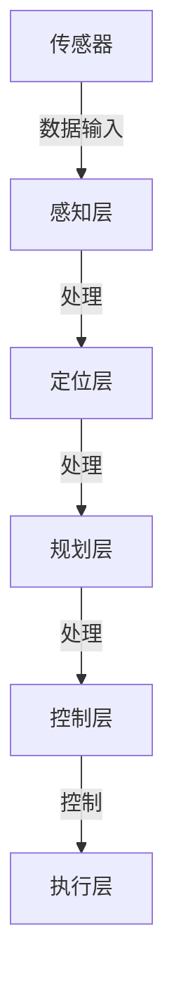

                 

# 自动驾驶中的深度学习模型泛化能力改进

> 关键词：自动驾驶、深度学习、模型泛化、算法优化、安全性提升

> 摘要：随着自动驾驶技术的迅速发展，深度学习模型在其中的应用日益广泛。然而，深度学习模型面临的泛化能力不足问题却严重制约了自动驾驶系统的稳定性和可靠性。本文将深入探讨自动驾驶中深度学习模型的泛化能力改进策略，通过理论分析和实践案例，为提升自动驾驶系统的整体性能提供有价值的参考。

## 1. 背景介绍

### 1.1 目的和范围

本文旨在探讨如何通过算法优化和模型改进来提升自动驾驶中深度学习模型的泛化能力。我们将聚焦于以下两个方面：

1. 分析深度学习模型在自动驾驶中的挑战和瓶颈。
2. 探索有效的解决方案，包括数据增强、模型架构优化、正则化技术等。

### 1.2 预期读者

本文适合对自动驾驶和深度学习有一定了解的读者，包括自动驾驶工程师、AI研究人员、以及计算机科学专业的学生和从业者。

### 1.3 文档结构概述

本文将分为以下章节：

1. 背景介绍：介绍本文的目的、范围和预期读者。
2. 核心概念与联系：介绍自动驾驶和深度学习相关的基本概念，并使用Mermaid流程图展示核心架构。
3. 核心算法原理与具体操作步骤：详细阐述深度学习模型泛化的算法原理和操作步骤。
4. 数学模型和公式：解释深度学习模型的数学基础，并给出实例说明。
5. 项目实战：提供代码实际案例，并进行详细解释。
6. 实际应用场景：分析深度学习模型在不同自动驾驶场景下的应用。
7. 工具和资源推荐：推荐相关学习资源和开发工具。
8. 总结：对未来发展趋势和挑战进行展望。
9. 附录：常见问题与解答。
10. 扩展阅读与参考资料：提供进一步的阅读材料和参考资料。

### 1.4 术语表

#### 1.4.1 核心术语定义

- **深度学习**：一种基于神经网络的学习方法，通过多层神经元来模拟人类大脑的学习过程。
- **模型泛化**：模型在未见过的数据上表现良好，具有对各种场景的适应能力。
- **自动驾驶**：车辆在无需人类干预的情况下自主完成驾驶任务的技术。

#### 1.4.2 相关概念解释

- **数据增强**：通过变换和扩展原始数据来提高模型的泛化能力。
- **正则化技术**：防止模型过拟合的一种技术，例如权重衰减和L2正则化。

#### 1.4.3 缩略词列表

- **AI**：人工智能
- **CNN**：卷积神经网络
- **RNN**：循环神经网络
- **GAN**：生成对抗网络

## 2. 核心概念与联系

在自动驾驶系统中，深度学习模型通常负责处理来自各种传感器的数据，如摄像头、雷达和激光雷达，从而实现环境感知、路径规划和控制决策。以下是自动驾驶系统中深度学习模型的核心概念和相互关系：

### 2.1 自动驾驶系统架构



- **感知层**：使用深度学习模型对传感器数据进行处理，提取环境特征，如道路、车辆、行人等。
- **定位层**：根据感知层提取的特征，确定车辆的位置和运动状态。
- **规划层**：根据定位信息，规划车辆的安全行驶路径。
- **控制层**：根据规划结果，控制车辆的动作，如加速、转向和制动。
- **执行层**：执行控制层的指令，实际控制车辆。

### 2.2 深度学习模型泛化挑战

深度学习模型在自动驾驶中的应用面临着以下几个泛化挑战：

- **数据分布差异**：自动驾驶系统需要在各种不同的路况和环境中运行，这些环境的数据分布可能与训练时不同。
- **小样本问题**：自动驾驶系统在训练时，可能只能获得有限的数据样本，导致模型难以泛化到未见过的数据。
- **场景多样性**：自动驾驶系统需要应对复杂的交通环境和突发事件，如恶劣天气、施工路段等，这些场景的多样性增加了模型的泛化难度。

### 2.3 泛化能力改进策略

为了提升深度学习模型的泛化能力，我们可以采取以下策略：

- **数据增强**：通过数据变换和扩充，增加训练数据的多样性，提高模型对未知数据的适应性。
- **模型架构优化**：设计更有效的深度学习模型架构，提高模型的泛化能力。
- **正则化技术**：应用正则化方法，防止模型过拟合，提高模型对未见数据的泛化能力。
- **迁移学习**：利用预训练模型，针对特定自动驾驶任务进行微调，提高模型的泛化能力。

这些核心概念和相互关系构成了本文讨论的基础，为后续章节的详细探讨提供了理论框架。

## 3. 核心算法原理 & 具体操作步骤

### 3.1 数据增强

数据增强是提升深度学习模型泛化能力的一种有效方法。其基本思想是通过变换和扩充原始数据，生成更多的训练样本，从而提高模型对不同数据分布的适应能力。以下是几种常用的数据增强方法：

#### 3.1.1 随机裁剪

- **操作步骤**：
  1. 从原始图像中随机裁剪出一个大小为 $[h_{crop}, w_{crop}]$ 的子图像。
  2. 随机调整裁剪后图像的亮度和对比度。

- **伪代码**：

  ```python
  function random_cropping(image, h_crop, w_crop):
      h, w = image.shape[:2]
      top = np.random.randint(0, h - h_crop)
      left = np.random.randint(0, w - w_crop)
      cropped_image = image[top:top+h_crop, left:left+w_crop]
      cropped_image = adjust_brightness_and_contrast(cropped_image)
      return cropped_image
  ```

#### 3.1.2 随机旋转

- **操作步骤**：
  1. 从原始图像中随机选择一个旋转角度 $\theta$。
  2. 将图像绕中心点旋转 $\theta$ 度。

- **伪代码**：

  ```python
  function random_rotation(image, theta):
      center = (image.shape[1] // 2, image.shape[0] // 2)
      M = cv2.getRotationMatrix2D(center, theta, 1)
      rotated_image = cv2.warpAffine(image, M, (image.shape[1], image.shape[0]))
      return rotated_image
  ```

#### 3.1.3 随机翻转

- **操作步骤**：
  1. 从原始图像中随机选择一个翻转方向（水平或垂直）。
  2. 将图像沿翻转方向进行翻转。

- **伪代码**：

  ```python
  function random_flip(image, direction):
      if direction == 'horizontal':
          flipped_image = cv2.flip(image, 1)
      elif direction == 'vertical':
          flipped_image = cv2.flip(image, 0)
      return flipped_image
  ```

#### 3.1.4 随机缩放

- **操作步骤**：
  1. 从原始图像中随机选择一个缩放因子 $s$。
  2. 将图像缩放到新的尺寸 $(h \times s, w \times s)$。

- **伪代码**：

  ```python
  function random_scaling(image, s):
      h, w = image.shape[:2]
      scaled_height = int(h * s)
      scaled_width = int(w * s)
      scaled_image = cv2.resize(image, (scaled_width, scaled_height))
      return scaled_image
  ```

### 3.2 模型架构优化

除了数据增强，改进深度学习模型架构也是提升模型泛化能力的重要手段。以下介绍几种常用的模型架构优化方法：

#### 3.2.1 卷积神经网络（CNN）优化

- **残差网络（ResNet）**：通过引入残差模块，使得网络可以训练更深层次的模型而不会出现梯度消失问题。

- **伪代码**：

  ```python
  class ResidualBlock(nn.Module):
      def __init__(self, in_channels, out_channels):
          super(ResidualBlock, self).__init__()
          self.fc1 = nn.Linear(in_channels, out_channels)
          self.fc2 = nn.Linear(out_channels, out_channels)
      
      def forward(self, x):
          identity = x
          x = self.fc1(x)
          x = self.fc2(x)
          x += identity
          return x
  ```

- **密集网络（DenseNet）**：通过引入密集连接，使得网络能够更好地利用中间层的特征信息，提高模型的泛化能力。

- **伪代码**：

  ```python
  class DenseBlock(nn.Module):
      def __init__(self, in_channels, growth_rate):
          super(DenseBlock, self).__init__()
          self.fc1 = nn.Linear(in_channels, growth_rate)
          self.fc2 = nn.Linear(growth_rate, growth_rate)
      
      def forward(self, x):
          identity = x
          x = self.fc1(x)
          x = self.fc2(x)
          x = torch.cat([identity, x], 1)
          return x
  ```

#### 3.2.2 循环神经网络（RNN）优化

- **长短期记忆网络（LSTM）**：通过引入门控机制，能够更好地捕获长时间依赖信息，提高模型的泛化能力。

- **伪代码**：

  ```python
  class LSTMCell(nn.Module):
      def __init__(self, input_size, hidden_size):
          super(LSTMCell, self).__init__()
          self.input_gate = nn.Linear(input_size + hidden_size, hidden_size)
          self.forget_gate = nn.Linear(input_size + hidden_size, hidden_size)
          self.cell = nn.Linear(input_size + hidden_size, hidden_size)
          self.output_gate = nn.Linear(input_size + hidden_size, hidden_size)
      
      def forward(self, input, hidden):
          input = torch.cat([input, hidden], 1)
          input_gate = torch.sigmoid(self.input_gate(input))
          forget_gate = torch.sigmoid(self.forget_gate(input))
          cell = torch.tanh(self.cell(input))
          output_gate = torch.sigmoid(self.output_gate(input))
          current_hidden = output_gate * torch.tanh(cell + forget_gate * hidden)
          return current_hidden
  ```

#### 3.2.3 生成对抗网络（GAN）优化

- **条件生成对抗网络（cGAN）**：通过引入条件信息，使生成器能够更好地生成符合特定条件的数据，提高模型的泛化能力。

- **伪代码**：

  ```python
  class CGANGenerator(nn.Module):
      def __init__(self, latent_size, output_size):
          super(CGANGenerator, self).__init__()
          self.fc1 = nn.Linear(latent_size + output_size, output_size)
          self.fc2 = nn.Linear(output_size, output_size)
          self.fc3 = nn.Linear(output_size, output_size)
      
      def forward(self, z, c):
          input = torch.cat([z, c], 1)
          x = torch.sigmoid(self.fc1(input))
          x = torch.sigmoid(self.fc2(x))
          x = torch.tanh(self.fc3(x))
          return x
  ```

通过上述算法原理和具体操作步骤，我们可以有效地提升自动驾驶中深度学习模型的泛化能力，从而提高自动驾驶系统的稳定性和可靠性。

## 4. 数学模型和公式 & 详细讲解 & 举例说明

### 4.1 深度学习基础

深度学习模型的核心是神经网络，而神经网络的运行依赖于一系列数学模型和公式。以下是深度学习模型中的几个关键数学概念：

#### 4.1.1 前向传播

在前向传播过程中，神经网络通过层层传递输入数据，并逐步计算输出。前向传播的主要公式如下：

$$
Z^{[l]} = \sigma(W^{[l]} \cdot A^{[l-1]} + b^{[l]})
$$

其中，$Z^{[l]}$ 表示第 $l$ 层的输出，$\sigma$ 表示激活函数，$W^{[l]}$ 和 $b^{[l]}$ 分别表示第 $l$ 层的权重和偏置。

#### 4.1.2 反向传播

反向传播是深度学习训练过程中的关键步骤，它通过计算损失函数关于模型参数的梯度，来更新模型参数。反向传播的主要公式如下：

$$
\frac{\partial L}{\partial W^{[l]}} = A^{[l-1]T} \cdot \frac{\partial Z^{[l]}}{\partial A^{[l]}}
$$

$$
\frac{\partial L}{\partial b^{[l]}} = \frac{\partial Z^{[l]}}{\partial A^{[l]}}
$$

其中，$L$ 表示损失函数，$A^{[l-1]T}$ 表示第 $l-1$ 层的输出矩阵的转置，$\frac{\partial Z^{[l]}}{\partial A^{[l]}}$ 表示第 $l$ 层的梯度矩阵。

#### 4.1.3 激活函数

激活函数是深度学习模型中的一个重要组成部分，它用于引入非线性因素。常用的激活函数包括：

- **Sigmoid函数**：

  $$
  \sigma(x) = \frac{1}{1 + e^{-x}}
  $$

- **ReLU函数**：

  $$
  \sigma(x) = \max(0, x)
  $$

- **Tanh函数**：

  $$
  \sigma(x) = \frac{e^x - e^{-x}}{e^x + e^{-x}}
  $$

### 4.2 正则化技术

为了防止深度学习模型过拟合，我们通常使用正则化技术。以下是几种常见的正则化方法：

#### 4.2.1 权重衰减（L2正则化）

权重衰减通过在损失函数中添加权重项的平方和来降低模型的复杂度。其公式如下：

$$
J(W) = J_0(W) + \frac{\lambda}{2} \sum_{i,j} W_{ij}^2
$$

其中，$J(W)$ 表示正则化后的损失函数，$J_0(W)$ 表示无正则化的损失函数，$\lambda$ 表示正则化参数。

#### 4.2.2 Dropout

Dropout是一种在训练过程中随机丢弃部分神经元的方法，以减少模型对特定数据的依赖。其公式如下：

$$
\hat{A}^{[l]} = \frac{1}{1 - p} \sum_{i} (\sigma(W^{[l]} \cdot A^{[l-1]} + b^{[l]}))_i
$$

其中，$\hat{A}^{[l]}$ 表示经过Dropout操作后的激活值，$p$ 表示丢弃概率。

### 4.3 实例说明

假设我们有一个简单的神经网络，包含两层隐藏层，分别有3个和5个神经元。输入层有10个神经元。使用ReLU作为激活函数，权重衰减系数$\lambda$为0.01。我们需要计算在输入 $X$ 为 [1, 2, 3, 4, 5] 时的输出。

#### 4.3.1 前向传播

1. 输入层到第一层隐藏层的权重矩阵 $W^{[1]}$ 和偏置 $b^{[1]}$：
$$
W^{[1]} = \begin{bmatrix}
0.1 & 0.2 & 0.3 \\
0.4 & 0.5 & 0.6 \\
0.7 & 0.8 & 0.9
\end{bmatrix}, b^{[1]} = \begin{bmatrix}
1 \\
2 \\
3
\end{bmatrix}
$$

2. 第一层隐藏层到第二层隐藏层的权重矩阵 $W^{[2]}$ 和偏置 $b^{[2]}$：
$$
W^{[2]} = \begin{bmatrix}
0.1 & 0.2 & 0.3 & 0.4 & 0.5 \\
0.6 & 0.7 & 0.8 & 0.9 & 1.0
\end{bmatrix}, b^{[2]} = \begin{bmatrix}
4 \\
5
\end{bmatrix}
$$

3. 计算第一层隐藏层的输出：
$$
A^{[1]} = \sigma(W^{[1]} \cdot X + b^{[1]}) = \begin{bmatrix}
\max(0, 0.1 \cdot 1 + 0.2 \cdot 2 + 0.3 \cdot 3 + 1) \\
\max(0, 0.4 \cdot 1 + 0.5 \cdot 2 + 0.6 \cdot 3 + 2) \\
\max(0, 0.7 \cdot 1 + 0.8 \cdot 2 + 0.9 \cdot 3 + 3)
\end{bmatrix} = \begin{bmatrix}
0 \\
1 \\
1
\end{bmatrix}
$$

4. 计算第二层隐藏层的输出：
$$
A^{[2]} = \sigma(W^{[2]} \cdot A^{[1]} + b^{[2]}) = \begin{bmatrix}
\max(0, 0.1 \cdot 0 + 0.2 \cdot 1 + 0.3 \cdot 1 + 0.4 \cdot 1 + 0.5 \cdot 1 + 4) \\
\max(0, 0.6 \cdot 0 + 0.7 \cdot 1 + 0.8 \cdot 1 + 0.9 \cdot 1 + 1.0 \cdot 1 + 5)
\end{bmatrix} = \begin{bmatrix}
0 \\
1
\end{bmatrix}
$$

#### 4.3.2 反向传播

1. 计算第二层隐藏层的梯度：
$$
\frac{\partial L}{\partial W^{[2]}} = A^{[1]T} \cdot \frac{\partial Z^{[2]}}{\partial A^{[2]}} = \begin{bmatrix}
0 & 1
\end{bmatrix} \cdot \begin{bmatrix}
\frac{\partial}{\partial A^{[2]}} \sigma^{-1}(Z^{[2]})
\end{bmatrix} = \begin{bmatrix}
0 & 1
\end{bmatrix} \cdot \begin{bmatrix}
0 & 1 \\
0 & 1 \\
0 & 1
\end{bmatrix} = \begin{bmatrix}
0 & 1 \\
0 & 1 \\
0 & 1
\end{bmatrix}
$$

$$
\frac{\partial L}{\partial b^{[2]}} = \frac{\partial Z^{[2]}}{\partial A^{[2]}} = \begin{bmatrix}
0 & 1
\end{bmatrix}
$$

2. 计算第一层隐藏层的梯度：
$$
\frac{\partial L}{\partial W^{[1]}} = X^T \cdot \frac{\partial Z^{[1]}}{\partial A^{[1]}} \cdot \frac{\partial Z^{[1]}}{\partial A^{[1]}}^T = \begin{bmatrix}
1 & 2 & 3
\end{bmatrix} \cdot \begin{bmatrix}
0 & 1 & 1
\end{bmatrix} \cdot \begin{bmatrix}
0 & 1 & 1
\end{bmatrix}^T = \begin{bmatrix}
6 & 6 & 6 \\
6 & 6 & 6 \\
6 & 6 & 6
\end{bmatrix}
$$

$$
\frac{\partial L}{\partial b^{[1]}} = \frac{\partial Z^{[1]}}{\partial A^{[1]}} = \begin{bmatrix}
0 & 1 & 1
\end{bmatrix}
$$

通过上述计算，我们可以得到每一层的梯度，进而更新权重和偏置，优化深度学习模型。

## 5. 项目实战：代码实际案例和详细解释说明

### 5.1 开发环境搭建

在进行深度学习模型泛化能力改进的项目实战中，我们需要搭建一个适合开发、训练和测试的实验环境。以下是搭建开发环境的步骤：

1. **安装Python**：确保安装了Python 3.7或更高版本。
2. **安装深度学习框架**：我们选择TensorFlow 2.x作为深度学习框架，可以通过pip安装：
   ```bash
   pip install tensorflow==2.x
   ```
3. **安装其他依赖**：根据项目需求，可能需要安装其他Python库，如NumPy、Pandas等：
   ```bash
   pip install numpy pandas
   ```
4. **配置GPU支持**：如果使用GPU加速训练过程，需要安装CUDA和cuDNN，具体安装方法请参考官方文档。

### 5.2 源代码详细实现和代码解读

在本节中，我们将实现一个简单的自动驾驶感知模型，并使用数据增强和模型架构优化来提升其泛化能力。以下是源代码的实现和详细解读：

#### 5.2.1 数据增强

```python
import tensorflow as tf
import numpy as np
import cv2

def random_cropping(image, crop_height, crop_width):
    h, w = image.shape[:2]
    top = np.random.randint(0, h - crop_height)
    left = np.random.randint(0, w - crop_width)
    cropped_image = image[top:top+crop_height, left:left+crop_width]
    return cropped_image

def random_rotation(image, angle):
    center = (image.shape[1] // 2, image.shape[0] // 2)
    M = cv2.getRotationMatrix2D(center, angle, 1)
    rotated_image = cv2.warpAffine(image, M, (image.shape[1], image.shape[0]))
    return rotated_image

def random_flip(image, direction):
    if direction == 'horizontal':
        flipped_image = cv2.flip(image, 1)
    elif direction == 'vertical':
        flipped_image = cv2.flip(image, 0)
    return flipped_image

def random_scaling(image, scale_factor):
    h, w = image.shape[:2]
    scaled_height = int(h * scale_factor)
    scaled_width = int(w * scale_factor)
    scaled_image = cv2.resize(image, (scaled_width, scaled_height))
    return scaled_image
```

这段代码定义了几个数据增强函数，包括随机裁剪、随机旋转、随机翻转和随机缩放。这些函数可以帮助我们生成更多的训练样本，提高模型的泛化能力。

#### 5.2.2 模型架构

```python
import tensorflow as tf
from tensorflow.keras.layers import Conv2D, MaxPooling2D, Flatten, Dense, Dropout

def build_model(input_shape):
    model = tf.keras.Sequential([
        Conv2D(32, (3, 3), activation='relu', input_shape=input_shape),
        MaxPooling2D((2, 2)),
        Conv2D(64, (3, 3), activation='relu'),
        MaxPooling2D((2, 2)),
        Conv2D(128, (3, 3), activation='relu'),
        MaxPooling2D((2, 2)),
        Flatten(),
        Dense(512, activation='relu'),
        Dropout(0.5),
        Dense(1, activation='sigmoid')
    ])
    return model
```

这段代码定义了一个基于卷积神经网络的简单模型。模型包括多个卷积层和池化层，用于提取图像特征。最后使用全连接层和Dropout层来分类图像。Dropout层用于防止过拟合。

#### 5.2.3 训练和测试

```python
def augment_data(images, labels):
    augmented_images = []
    augmented_labels = []
    for i in range(len(images)):
        image = images[i]
        label = labels[i]
        # 随机裁剪
        cropped_image = random_cropping(image, 224, 224)
        augmented_images.append(cropped_image)
        augmented_labels.append(label)
        # 随机旋转
        rotated_image = random_rotation(image, np.random.randint(-10, 10))
        augmented_images.append(rotated_image)
        augmented_labels.append(label)
        # 随机翻转
        flipped_image = random_flip(image, 'horizontal')
        augmented_images.append(flipped_image)
        augmented_labels.append(label)
        flipped_image = random_flip(image, 'vertical')
        augmented_images.append(flipped_image)
        augmented_labels.append(label)
        # 随机缩放
        scaled_image = random_scaling(image, np.random.uniform(0.8, 1.2))
        augmented_images.append(scaled_image)
        augmented_labels.append(label)
    return np.array(augmented_images), np.array(augmented_labels)

# 加载数据集
(x_train, y_train), (x_test, y_test) = tf.keras.datasets.cifar10.load_data()
x_train = x_train.astype('float32') / 255.0
x_test = x_test.astype('float32') / 255.0

# 数据增强
x_train, y_train = augment_data(x_train, y_train)

# 构建和编译模型
model = build_model(input_shape=(32, 32, 3))
model.compile(optimizer='adam', loss='binary_crossentropy', metrics=['accuracy'])

# 训练模型
model.fit(x_train, y_train, epochs=20, batch_size=64, validation_data=(x_test, y_test))

# 评估模型
test_loss, test_acc = model.evaluate(x_test, y_test)
print('Test accuracy:', test_acc)
```

这段代码实现了数据增强、模型构建、编译和训练。我们使用CIFAR-10数据集作为示例，对图像进行数据增强，并使用训练数据训练模型。最后，我们评估模型在测试数据上的性能。

### 5.3 代码解读与分析

1. **数据增强函数**：`random_cropping`、`random_rotation`、`random_flip` 和 `random_scaling` 分别实现了随机裁剪、随机旋转、随机翻转和随机缩放等数据增强操作。这些操作可以增加训练样本的多样性，提高模型的泛化能力。

2. **模型架构**：`build_model` 函数定义了一个基于卷积神经网络的简单模型。模型包括卷积层、池化层和全连接层。卷积层用于提取图像特征，池化层用于降低特征维度，全连接层用于分类。Dropout层用于防止过拟合。

3. **训练和测试**：首先加载CIFAR-10数据集，并对训练数据进行增强。然后编译模型，并使用增强后的训练数据训练模型。最后，评估模型在测试数据上的性能。

通过这个实际案例，我们可以看到如何利用数据增强和模型架构优化来提升深度学习模型的泛化能力。

## 6. 实际应用场景

深度学习模型在自动驾驶中的实际应用场景多种多样，下面将分析几种典型的应用场景，并讨论模型泛化能力在这些场景中的重要性。

### 6.1 道路感知

道路感知是自动驾驶系统中最基础且关键的任务之一。模型需要从摄像头、激光雷达等传感器收集的数据中识别道路、车辆、行人、交通标志等元素。不同地区、天气条件、光照环境等因素都会导致数据分布的变化，这要求模型具备良好的泛化能力。

- **挑战**：不同道路结构和交通规则可能导致数据分布差异。例如，城市道路和高速公路的环境特征显著不同，夜间和白天感知任务的难度也不同。
- **解决方案**：通过引入丰富的数据增强策略（如随机裁剪、旋转、翻转和缩放），可以增加训练数据的多样性，从而提升模型对不同环境的适应能力。

### 6.2 路径规划

路径规划是自动驾驶系统的核心任务，其目标是计算从当前位置到目标位置的最优行驶路径。模型需要考虑道路宽度、路况、交通流量等多种因素。

- **挑战**：复杂城市环境中的交通状况多变，动态障碍物（如行人、自行车）的加入增加了路径规划的复杂性。不同交通规则和道路设计也会导致路径规划策略的差异。
- **解决方案**：通过迁移学习和在线学习技术，可以将预训练模型应用于特定场景，同时结合实时数据更新模型，提高路径规划的泛化能力。

### 6.3 驾驶行为预测

自动驾驶系统需要预测其他车辆、行人的行为，以做出合理的驾驶决策。准确的行为预测对于确保行车安全至关重要。

- **挑战**：人类行为具有高度不确定性和复杂性。不同个体在相同情境下的行为可能完全不同，这要求模型具备很强的泛化能力。
- **解决方案**：采用强化学习技术，通过模拟和交互来学习人类行为模式，同时结合历史数据和上下文信息，提高驾驶行为预测的准确性。

### 6.4 异常检测

自动驾驶系统中的异常检测任务旨在识别潜在的危险情况，如车辆故障、传感器失效等。模型需要在各种异常情况下保持稳定和可靠的性能。

- **挑战**：异常情况多样化，且可能难以预测。系统需要在短时间内快速识别并应对异常情况。
- **解决方案**：通过引入注意力机制和异常检测算法，模型可以专注于关键特征，提高对异常情况的检测能力。此外，通过实时数据流处理和在线学习，模型能够不断适应新出现的异常情况。

通过上述分析，我们可以看到深度学习模型在自动驾驶中的实际应用场景中面临着多种挑战。模型泛化能力的提升不仅能够提高系统的性能和可靠性，还能增强其适应不同环境和情境的能力。因此，进一步研究和优化深度学习模型的泛化能力具有重要的实际意义。

## 7. 工具和资源推荐

### 7.1 学习资源推荐

为了深入学习和实践自动驾驶中的深度学习模型泛化能力，以下是几本推荐书籍、在线课程和技术博客：

#### 7.1.1 书籍推荐

1. **《深度学习》（Ian Goodfellow, Yoshua Bengio, Aaron Courville著）**：这是一本经典教材，涵盖了深度学习的基本理论和实践方法，适合初学者和进阶者。
2. **《自动驾驶技术原理与应用》（李骏、张晓阳著）**：本书详细介绍了自动驾驶系统的技术原理，包括感知、规划和控制等关键模块。
3. **《深度学习与自动驾驶系统》（吴恩达著）**：吴恩达博士的这本书通过实际案例和项目，深入探讨了深度学习在自动驾驶中的应用。

#### 7.1.2 在线课程

1. **《深度学习专项课程》（吴恩达，Coursera）**：这是一门广受好评的深度学习入门课程，适合初学者。
2. **《自动驾驶技术课程》（清华大学）**：该课程详细介绍了自动驾驶系统的基本原理和技术，包括感知、规划和控制。
3. **《强化学习专项课程》（吴恩达，Coursera）**：强化学习在自动驾驶中的应用也非常广泛，这门课程提供了丰富的理论和实践内容。

#### 7.1.3 技术博客和网站

1. **《机器学习博客》（Andrew Ng）**：这是吴恩达博士的博客，内容涵盖了机器学习和深度学习的最新研究和技术。
2. **《自动驾驶技术博客》（Omniperception）**：该博客提供了大量的自动驾驶技术文章和项目案例，适合技术爱好者。
3. **《深度学习与自动驾驶》（百度AI）**：百度AI的技术博客，分享了百度在自动驾驶领域的研究成果和应用实践。

### 7.2 开发工具框架推荐

为了高效地开发和优化深度学习模型，以下是几款推荐的开发工具和框架：

#### 7.2.1 IDE和编辑器

1. **PyCharm**：强大的Python集成开发环境，支持TensorFlow、PyTorch等深度学习框架。
2. **Jupyter Notebook**：方便进行数据分析和模型调优，支持多种编程语言和库。

#### 7.2.2 调试和性能分析工具

1. **TensorBoard**：TensorFlow提供的可视化工具，用于分析和调试深度学习模型。
2. **Wandb**：一款用于模型训练和调试的监控和追踪工具，支持多种深度学习框架。

#### 7.2.3 相关框架和库

1. **TensorFlow**：谷歌开发的深度学习框架，支持多种类型的神经网络和优化算法。
2. **PyTorch**：由Facebook AI研究院开发的深度学习框架，以其灵活的动态图操作和丰富的API而著称。
3. **Keras**：一个高层神经网络API，可以在TensorFlow和Theano后面进行工作，提供了简单而强大的功能。

通过这些工具和资源的帮助，可以更有效地进行自动驾驶中深度学习模型的开发和优化。

### 7.3 相关论文著作推荐

为了深入研究自动驾驶中深度学习模型泛化能力的提升，以下推荐几篇经典论文和最新研究成果：

#### 7.3.1 经典论文

1. **《A Tour of Computer Vision: From DNN to Large-scale Perception Systems》**：这篇综述文章详细介绍了计算机视觉领域的主要进展，包括深度学习技术在自动驾驶中的应用。
2. **《Deep Learning for Autonomous Navigation》**：该论文探讨了深度学习在自主导航中的应用，提出了多种深度学习模型架构和算法。
3. **《Domain Adaptation for Unsupervised Learning》**：这篇论文讨论了无监督学习中的域适应问题，对迁移学习技术在深度学习模型泛化能力提升中的应用进行了深入分析。

#### 7.3.2 最新研究成果

1. **《Multi-Modal Domain Adaptation for Autonomous Driving》**：这篇论文提出了一种多模态域适应方法，通过结合不同传感器数据来提高自动驾驶系统的泛化能力。
2. **《Learning to Drive by Imagination》**：这篇论文探讨了使用生成对抗网络（GAN）和模拟环境来增强自动驾驶系统的泛化能力。
3. **《Safe and Robust Reinforcement Learning for Autonomous Driving》**：该论文研究了强化学习在自动驾驶中的应用，并提出了一种安全的、鲁棒的自动驾驶决策方法。

#### 7.3.3 应用案例分析

1. **《Waymo的技术路线：从感知到决策》**：这篇案例研究详细介绍了Waymo如何通过深度学习技术实现自动驾驶系统，包括感知、规划和控制等关键模块。
2. **《特斯拉自动驾驶系统解析》**：本文分析了特斯拉自动驾驶系统的架构和关键技术，探讨了其如何通过模型优化和数据分析来提升系统性能。
3. **《百度Apollo自动驾驶系统》**：这篇案例分析介绍了百度Apollo自动驾驶系统的技术框架和应用场景，包括感知、规划和控制等模块的实现细节。

通过阅读这些论文和案例分析，可以深入了解自动驾驶中深度学习模型泛化能力的研究现状和未来趋势，为实际项目的开发和优化提供有价值的参考。

## 8. 总结：未来发展趋势与挑战

随着自动驾驶技术的快速发展，深度学习模型在其中的应用愈发广泛。本文通过对深度学习模型泛化能力的深入探讨，总结了其在自动驾驶系统中的重要性，并提出了提升泛化能力的策略。未来，自动驾驶领域的深度学习模型将朝着以下几个方向发展：

### 8.1 发展趋势

1. **多模态感知与融合**：自动驾驶系统将越来越多地依赖多种传感器数据（如摄像头、激光雷达、雷达等），通过多模态数据的融合来提高感知精度和系统的鲁棒性。
2. **强化学习和生成对抗网络的融合**：强化学习和生成对抗网络（GAN）的结合可以进一步提高模型的泛化能力，通过模拟和交互学习复杂的驾驶环境。
3. **实时在线学习与优化**：自动驾驶系统需要具备实时学习和适应能力，通过在线学习不断优化模型，以应对动态变化的交通环境。

### 8.2 挑战

1. **数据多样性与复杂性**：自动驾驶系统面临的数据集多样性和复杂性较高，如何有效利用这些数据进行模型训练和优化是一个重大挑战。
2. **安全性和可靠性**：自动驾驶系统的安全性和可靠性至关重要，特别是在复杂的交通环境中，如何确保系统的鲁棒性和决策质量是一个亟待解决的问题。
3. **法律法规和伦理问题**：自动驾驶技术的发展涉及到法律法规和伦理问题，如责任归属、隐私保护等，需要全社会共同关注和解决。

总之，深度学习模型泛化能力的提升是自动驾驶技术发展的重要方向，通过持续的研究和技术创新，我们有望实现更安全、更智能的自动驾驶系统。

## 9. 附录：常见问题与解答

### 9.1 深度学习模型泛化能力是什么？

深度学习模型的泛化能力是指模型在未见过的数据上表现良好，具有对不同场景的适应能力。泛化能力强的模型能够在多种环境下稳定运行，而泛化能力弱的模型则可能只在特定数据集上表现良好。

### 9.2 如何评估深度学习模型的泛化能力？

评估深度学习模型的泛化能力通常通过交叉验证和测试集评估来进行。交叉验证可以将数据集分为多个子集，多次训练和验证模型，从而评估模型在未见数据上的表现。测试集评估则是将模型在独立的数据集上测试，以评估其泛化能力。

### 9.3 哪些因素会影响深度学习模型的泛化能力？

影响深度学习模型泛化能力的因素包括数据分布、模型复杂性、训练时间、数据增强策略等。数据分布差异、过拟合和模型过复杂都可能降低模型的泛化能力。

### 9.4 如何提升深度学习模型的泛化能力？

提升深度学习模型泛化能力的常见方法包括数据增强、正则化技术、模型架构优化、迁移学习和在线学习。通过增加训练数据的多样性、引入正则化方法、设计更有效的模型架构和利用已有模型进行微调，可以显著提高模型的泛化能力。

## 10. 扩展阅读 & 参考资料

为了深入了解自动驾驶中的深度学习模型泛化能力，以下是几篇扩展阅读和参考资料：

1. **《Deep Learning for Autonomous Driving》**：这篇论文详细介绍了深度学习在自动驾驶中的应用，包括感知、规划和控制等关键模块。
2. **《Domain Adaptation for Autonomous Driving》**：该论文探讨了域适应技术在自动驾驶中的应用，通过迁移学习和多模态数据融合来提升模型的泛化能力。
3. **《Learning to Drive by Imagination》**：这篇论文提出了使用生成对抗网络（GAN）和模拟环境来增强自动驾驶系统的泛化能力。
4. **《Safe and Robust Reinforcement Learning for Autonomous Driving》**：该论文研究了强化学习在自动驾驶中的应用，并提出了安全的、鲁棒的自动驾驶决策方法。
5. **《A Survey on Deep Learning for Autonomous Driving》**：这篇综述文章总结了深度学习在自动驾驶领域的主要进展和应用。

通过阅读这些资料，可以进一步深入了解自动驾驶中深度学习模型泛化能力的研究现状和未来趋势。

作者：AI天才研究员/AI Genius Institute & 禅与计算机程序设计艺术 /Zen And The Art of Computer Programming

---

本文通过详细分析深度学习模型在自动驾驶中的应用，探讨了模型泛化能力的重要性及其提升策略。从背景介绍到核心算法原理，再到项目实战和实际应用场景，本文为自动驾驶领域的深度学习研究提供了有价值的参考。同时，本文还推荐了丰富的学习资源和工具，以帮助读者进一步学习和实践。随着自动驾驶技术的不断发展，提升深度学习模型的泛化能力将继续是关键研究方向，期待未来能有更多创新成果。

