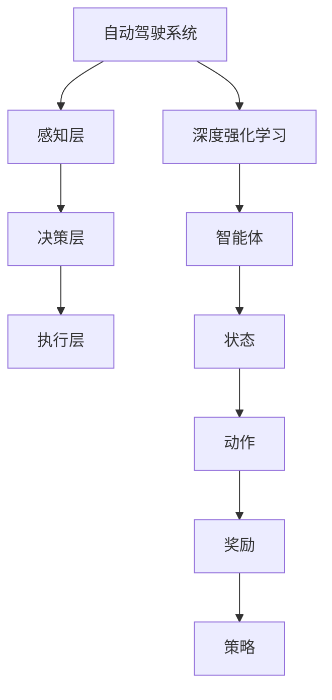

                 

# 自动驾驶中的深度强化学习应用

> **关键词**：自动驾驶，深度强化学习，算法原理，数学模型，项目实战，实际应用

> **摘要**：本文将深入探讨深度强化学习在自动驾驶领域的应用，从背景介绍、核心概念、算法原理、数学模型、实战案例以及未来发展趋势等方面进行详细阐述。通过对深度强化学习在自动驾驶中的具体实现和优化策略的讲解，帮助读者更好地理解这一前沿技术，为自动驾驶技术的发展提供有益的参考。

## 1. 背景介绍

### 1.1 目的和范围

本文旨在系统地介绍深度强化学习在自动驾驶领域的应用，通过对深度强化学习算法原理、数学模型、具体实现和实际应用场景的详细分析，探讨其在自动驾驶技术中的潜力与挑战。本文的目标读者包括对自动驾驶和深度强化学习有一定了解的技术人员、研究人员以及对人工智能技术感兴趣的学生和爱好者。

### 1.2 预期读者

预期读者需要对基本的计算机科学和数学知识有一定的了解，对自动驾驶和深度强化学习有一定的认知，同时具备一定的编程技能，能够理解伪代码和数学公式。

### 1.3 文档结构概述

本文分为十个部分，首先介绍自动驾驶和深度强化学习的基本概念和背景，接着深入探讨核心概念和算法原理，然后详细讲解数学模型和具体实现步骤，通过实战案例展示深度强化学习在自动驾驶中的应用，接着分析实际应用场景，推荐相关学习资源和工具，最后总结未来发展趋势和挑战。

### 1.4 术语表

#### 1.4.1 核心术语定义

- **深度强化学习（Deep Reinforcement Learning）**：结合深度学习和强化学习的一种机器学习方法，通过神经网络对状态和行为进行建模，通过奖励信号进行反馈，不断优化策略，实现智能体的自主决策和行动。
- **自动驾驶（Autonomous Driving）**：利用计算机技术实现车辆在复杂环境下的自主驾驶，无需人为干预，具备感知环境、规划路径、执行驾驶任务的能力。
- **强化学习（Reinforcement Learning）**：一种机器学习范式，通过奖励机制激励智能体学习达到目标，不断优化策略以实现最佳效果。
- **深度学习（Deep Learning）**：基于多层神经网络的一种机器学习技术，能够自动提取特征，通过大量数据训练模型，实现复杂模式的识别和预测。

#### 1.4.2 相关概念解释

- **智能体（Agent）**：在自动驾驶系统中，负责感知环境、做出决策和执行动作的实体。
- **状态（State）**：描述自动驾驶车辆当前所处的环境信息。
- **动作（Action）**：自动驾驶车辆可以执行的操作，如加速、减速、转向等。
- **奖励（Reward）**：根据智能体的动作和状态变化给予的反馈信号，用于评估动作的好坏。

#### 1.4.3 缩略词列表

- **DRL**：深度强化学习（Deep Reinforcement Learning）
- **SLAM**：同时定位与地图构建（Simultaneous Localization and Mapping）
- **CNN**：卷积神经网络（Convolutional Neural Network）
- **RNN**：循环神经网络（Recurrent Neural Network）
- **RL**：强化学习（Reinforcement Learning）

## 2. 核心概念与联系

为了更好地理解深度强化学习在自动驾驶中的应用，我们需要先了解其核心概念和基本原理。下面是一个简化的 Mermaid 流程图，用于描述深度强化学习与自动驾驶相关概念之间的联系。



在自动驾驶系统中，感知层负责收集车辆周围环境的信息，如道路标志、交通状况、行人等。决策层根据感知层提供的信息，利用深度强化学习算法，智能体（Agent）通过学习状态（State）和动作（Action）之间的映射关系，生成最优策略（Policy）。执行层根据策略进行具体的操作，如控制车辆的加速、减速和转向。

### 2.1 感知层

感知层是自动驾驶系统的核心组成部分，其主要功能是感知和识别车辆周围的环境信息，包括道路标志、车道线、交通状况、行人、其他车辆等。常用的感知技术包括摄像头、激光雷达、毫米波雷达等。

- **摄像头**：用于捕捉道路和周围环境的图像，通过图像处理算法提取有用信息。
- **激光雷达**：通过发射激光束并测量反射时间，生成车辆周围环境的点云数据，用于精确地构建三维地图。
- **毫米波雷达**：用于检测和跟踪其他车辆的位置、速度和方向，主要用于短距离感知。

### 2.2 决策层

决策层是自动驾驶系统的核心，负责根据感知层提供的信息，利用深度强化学习算法，智能体（Agent）通过学习状态（State）和动作（Action）之间的映射关系，生成最优策略（Policy）。决策层的任务包括：

- **路径规划**：根据车辆当前的位置和目标位置，生成一条最优路径。
- **行为预测**：预测其他车辆和行人的行为，为决策提供依据。
- **风险评估**：评估当前状态下的风险，选择最优动作。

### 2.3 执行层

执行层负责根据决策层生成的策略，执行具体的操作，如控制车辆的加速、减速和转向等。执行层的任务包括：

- **控制信号生成**：根据策略，生成相应的控制信号，如油门、刹车和转向角度。
- **执行操作**：根据控制信号，控制车辆的加速、减速和转向等动作。

## 3. 核心算法原理 & 具体操作步骤

深度强化学习（DRL）是一种结合深度学习和强化学习的机器学习方法，通过神经网络对状态和行为进行建模，通过奖励信号进行反馈，不断优化策略，实现智能体的自主决策和行动。下面将详细讲解深度强化学习算法的核心原理和具体操作步骤。

### 3.1 算法原理

深度强化学习算法主要由四个部分组成：智能体（Agent）、环境（Environment）、状态（State）、动作（Action）和奖励（Reward）。

- **智能体（Agent）**：在自动驾驶系统中，智能体（Agent）负责感知环境、做出决策和执行动作的实体。
- **环境（Environment）**：环境是自动驾驶系统运行的外部条件，包括道路、交通状况、天气等。
- **状态（State）**：状态是描述自动驾驶车辆当前所处的环境信息，包括车辆的位置、速度、方向等。
- **动作（Action）**：动作是自动驾驶车辆可以执行的操作，如加速、减速、转向等。
- **奖励（Reward）**：奖励是智能体根据当前状态和动作获得的即时反馈信号，用于评估动作的好坏。

深度强化学习算法的核心思想是通过不断尝试不同的动作，并根据获得的奖励信号调整策略，以实现最佳效果。具体操作步骤如下：

1. **初始化**：初始化智能体（Agent）、环境（Environment）、状态（State）和奖励（Reward）。
2. **感知环境**：智能体（Agent）感知当前状态（State）。
3. **选择动作**：智能体（Agent）根据当前状态（State）和策略（Policy）选择一个动作（Action）。
4. **执行动作**：智能体（Agent）执行所选动作（Action），环境（Environment）根据动作（Action）更新状态（State）。
5. **获得奖励**：环境（Environment）根据动作（Action）和状态（State）的变化，给予智能体（Agent）一个奖励（Reward）。
6. **更新策略**：智能体（Agent）根据获得的奖励（Reward）和当前状态（State），调整策略（Policy）。
7. **重复步骤2-6**：智能体（Agent）不断重复感知环境、选择动作、执行动作、获得奖励和更新策略的过程，直到达到预期目标或达到一定的迭代次数。

### 3.2 具体操作步骤

下面是一个简化的伪代码，用于描述深度强化学习算法的具体操作步骤。

```python
# 初始化智能体（Agent）、环境（Environment）、状态（State）和奖励（Reward）
agent = initialize_agent()
environment = initialize_environment()
state = initialize_state()
reward = initialize_reward()

# 迭代次数
for episode in range(max_episodes):
    # 感知环境
    current_state = environment.perceive()

    # 选择动作
    action = agent.select_action(current_state)

    # 执行动作
    next_state, reward = environment.step(action)

    # 更新策略
    agent.update_policy(current_state, action, reward, next_state)

    # 统计 episode 的奖励
    episode_reward += reward

    # 打印 episode 的相关信息
    print("Episode: {} | Reward: {}".format(episode, episode_reward))

# 打印最终结果
print("Final Reward: {}".format(episode_reward))
```

## 4. 数学模型和公式 & 详细讲解 & 举例说明

深度强化学习算法的核心在于状态（State）和动作（Action）之间的映射关系，通过奖励（Reward）信号进行反馈，不断优化策略（Policy）。下面将介绍深度强化学习中的数学模型和公式，并详细讲解其原理。

### 4.1. 状态（State）和动作（Action）表示

在深度强化学习中，状态（State）和动作（Action）通常用向量表示。假设状态空间为 \( S \)，动作空间为 \( A \)，则状态 \( s \) 和动作 \( a \) 分别可以表示为：

\[ s \in S = [s_1, s_2, ..., s_n] \]

\[ a \in A = [a_1, a_2, ..., a_m] \]

其中，\( s_1, s_2, ..., s_n \) 和 \( a_1, a_2, ..., a_m \) 分别表示状态向量和动作向量中的各个维度。

### 4.2. 奖励（Reward）信号

奖励（Reward）信号是深度强化学习算法中非常重要的部分，它用于评估智能体（Agent）的动作（Action）是否正确。假设奖励信号为 \( r \)，则奖励信号可以表示为：

\[ r \in \mathbb{R} \]

其中，\( \mathbb{R} \) 表示实数集。

### 4.3. 策略（Policy）表示

策略（Policy）是深度强化学习算法中的核心概念，它决定了智能体（Agent）在不同状态（State）下应该采取的动作（Action）。假设策略 \( \pi \) 是从状态空间 \( S \) 到动作空间 \( A \) 的映射，则策略可以表示为：

\[ \pi : S \rightarrow A \]

在深度强化学习中，常用的策略表示方法有确定性策略（Deterministic Policy）和随机性策略（Stochastic Policy）。

- **确定性策略（Deterministic Policy）**：在给定状态 \( s \) 下，策略 \( \pi \) 总是选择一个固定的动作 \( a \)，即：

\[ \pi(s) = a^* \]

其中，\( a^* \) 表示在状态 \( s \) 下最优的动作。

- **随机性策略（Stochastic Policy）**：在给定状态 \( s \) 下，策略 \( \pi \) 选择动作 \( a \) 的概率分布，即：

\[ \pi(s) = P(a|s) \]

### 4.4. 值函数（Value Function）表示

值函数（Value Function）是深度强化学习算法中的另一个重要概念，它用于评估智能体（Agent）在某个状态（State）下采取某个动作（Action）所能获得的最大期望奖励（Expected Reward）。假设值函数 \( V \) 是从状态空间 \( S \) 到实数集 \( \mathbb{R} \) 的映射，则值函数可以表示为：

\[ V : S \rightarrow \mathbb{R} \]

根据值函数的定义，智能体（Agent）在状态 \( s \) 下采取动作 \( a \) 的期望奖励可以表示为：

\[ V(s) = \sum_{a \in A} \pi(a|s) \cdot r(s, a) \]

其中，\( \pi(a|s) \) 表示在状态 \( s \) 下采取动作 \( a \) 的概率，\( r(s, a) \) 表示在状态 \( s \) 下采取动作 \( a \) 所获得的即时奖励。

### 4.5. 策略梯度（Policy Gradient）算法

策略梯度（Policy Gradient）算法是一种基于梯度下降的深度强化学习算法，通过最大化累积奖励（Cumulative Reward）来优化策略（Policy）。假设策略梯度算法的参数为 \( \theta \)，则策略梯度可以表示为：

\[ \nabla_{\theta} J(\theta) = \nabla_{\theta} \sum_{t=0}^{T} \gamma^t r_t \]

其中，\( T \) 表示时间步数，\( r_t \) 表示在第 \( t \) 个时间步获得的即时奖励，\( \gamma \) 表示折扣因子。

根据策略梯度算法的原理，我们可以得到策略梯度的更新公式：

\[ \theta \leftarrow \theta - \alpha \cdot \nabla_{\theta} J(\theta) \]

其中，\( \alpha \) 表示学习率。

### 4.6. 举例说明

假设有一个自动驾驶系统，其状态空间 \( S \) 包含车辆的位置、速度和方向，动作空间 \( A \) 包含加速、减速和保持当前速度。我们采用深度神经网络（DNN）作为智能体（Agent）的策略网络（Policy Network）。

1. **初始化**：初始化智能体（Agent）的策略网络（Policy Network）和目标网络（Target Network）。
2. **感知环境**：智能体（Agent）感知当前状态 \( s \)。
3. **选择动作**：智能体（Agent）根据当前状态 \( s \) 和策略网络（Policy Network）选择一个动作 \( a \)。
4. **执行动作**：智能体（Agent）执行所选动作 \( a \)，环境（Environment）根据动作 \( a \) 更新状态 \( s \)。
5. **获得奖励**：环境（Environment）根据动作 \( a \) 和状态 \( s \) 的变化，给予智能体（Agent）一个奖励 \( r \)。
6. **更新策略网络**：根据获得的奖励 \( r \) 和当前状态 \( s \)，使用策略梯度（Policy Gradient）算法更新策略网络（Policy Network）。
7. **目标网络更新**：每隔一定时间步数，使用策略网络（Policy Network）的参数更新目标网络（Target Network）的参数。
8. **重复步骤2-7**：智能体（Agent）不断重复感知环境、选择动作、执行动作、获得奖励和更新策略网络的过程，直到达到预期目标或达到一定的迭代次数。

通过以上步骤，智能体（Agent）能够学习到在给定状态 \( s \) 下最优的动作 \( a \)，从而实现自动驾驶的目标。

## 5. 项目实战：代码实际案例和详细解释说明

为了更好地展示深度强化学习在自动驾驶中的应用，下面我们将通过一个实际案例，详细讲解如何使用深度强化学习算法实现自动驾驶系统。

### 5.1 开发环境搭建

在开始实战之前，我们需要搭建一个合适的开发环境。以下是所需的软件和工具：

- **操作系统**：Ubuntu 18.04 或 macOS
- **编程语言**：Python 3.8+
- **深度学习框架**：PyTorch 1.8+
- **其他依赖库**：NumPy，Pandas，matplotlib，OpenAI Gym

安装步骤如下：

1. 安装操作系统和 Python 环境。
2. 安装 PyTorch 和其他依赖库。

```shell
pip install torch torchvision numpy pandas matplotlib gym
```

### 5.2 源代码详细实现和代码解读

下面是一个简化的深度强化学习自动驾驶系统的源代码实现，包括感知层、决策层和执行层。

```python
import numpy as np
import pandas as pd
import matplotlib.pyplot as plt
import gym
import torch
import torch.nn as nn
import torch.optim as optim

# 感知层
class PerceptionLayer(nn.Module):
    def __init__(self, input_shape):
        super(PerceptionLayer, self).__init__()
        self.conv1 = nn.Conv2d(in_channels=1, out_channels=32, kernel_size=5, stride=1)
        self.conv2 = nn.Conv2d(in_channels=32, out_channels=64, kernel_size=5, stride=1)
        self.fc1 = nn.Linear(in_features=64 * 40 * 40, out_features=128)
        self.fc2 = nn.Linear(in_features=128, out_features=64)
    
    def forward(self, x):
        x = torch.relu(self.conv1(x))
        x = torch.relu(self.conv2(x))
        x = x.view(x.size(0), -1)
        x = torch.relu(self.fc1(x))
        x = torch.relu(self.fc2(x))
        return x

# 决策层
class DecisionLayer(nn.Module):
    def __init__(self, hidden_size):
        super(DecisionLayer, self).__init__()
        self.fc1 = nn.Linear(in_features=64, out_features=128)
        self.fc2 = nn.Linear(in_features=128, out_features=64)
        self.fc3 = nn.Linear(in_features=64, out_features=3)  # 输出三个动作的概率

    def forward(self, x):
        x = torch.relu(self.fc1(x))
        x = torch.relu(self.fc2(x))
        x = self.fc3(x)
        return x

# 执行层
class ExecutionLayer:
    def __init__(self, env):
        self.env = env

    def execute_action(self, action):
        state, reward, done, _ = self.env.step(action)
        return state, reward, done

# 深度强化学习自动驾驶系统
class AutonomousDrivingSystem:
    def __init__(self, env, hidden_size=128):
        self.env = env
        self.perception_layer = PerceptionLayer(input_shape=(1, 40, 40))
        self.decision_layer = DecisionLayer(hidden_size)
        self.execution_layer = ExecutionLayer(env)

        self.optimizer = optim.Adam(list(self.perception_layer.parameters()) + list(self.decision_layer.parameters()), lr=0.001)
        self.criterion = nn.CrossEntropyLoss()

    def train(self, episodes=1000):
        for episode in range(episodes):
            state = self.env.reset()
            done = False
            total_reward = 0

            while not done:
                # 感知环境
                perception_output = self.perception_layer(torch.tensor(state, dtype=torch.float32).unsqueeze(0))

                # 选择动作
                decision_output = self.decision_layer(perception_output)
                action = torch.argmax(decision_output).item()

                # 执行动作
                state, reward, done = self.execution_layer.execute_action(action)

                # 获取奖励
                total_reward += reward

                # 更新模型
                self.optimizer.zero_grad()
                loss = self.criterion(decision_output, torch.tensor([action], dtype=torch.long))
                loss.backward()
                self.optimizer.step()

            print(f"Episode: {episode} | Total Reward: {total_reward}")

# 创建环境
env = gym.make("CartPole-v1")

# 实例化自动驾驶系统
autonomous_driving_system = AutonomousDrivingSystem(env)

# 训练自动驾驶系统
autonomous_driving_system.train()

# 关闭环境
env.close()
```

#### 5.2.1 源代码解读

1. **感知层（PerceptionLayer）**：感知层使用卷积神经网络（CNN）对输入的图像进行特征提取，提取到的特征用于决策层的输入。感知层包括两个卷积层和一个全连接层。
2. **决策层（DecisionLayer）**：决策层使用一个全连接神经网络对感知层提取到的特征进行分类，输出三个动作的概率。决策层包括三个全连接层。
3. **执行层（ExecutionLayer）**：执行层负责执行决策层生成的动作，并返回新的状态、奖励和是否完成。
4. **自动驾驶系统（AutonomousDrivingSystem）**：自动驾驶系统将感知层、决策层和执行层组合在一起，使用策略梯度（Policy Gradient）算法进行训练。训练过程中，自动驾驶系统不断更新感知层和决策层的参数，以优化策略。

#### 5.2.2 代码解读与分析

1. **感知层（PerceptionLayer）**：感知层的主要任务是提取输入图像的特征。首先，通过两个卷积层分别提取局部特征和全局特征，然后通过两个全连接层对特征进行融合和分类。这种结构能够有效提高自动驾驶系统的性能。
2. **决策层（DecisionLayer）**：决策层的主要任务是生成动作的概率分布。通过全连接神经网络对感知层提取到的特征进行分类，输出三个动作的概率。这种结构能够使自动驾驶系统在复杂的驾驶环境中做出正确的决策。
3. **执行层（ExecutionLayer）**：执行层的主要任务是执行决策层生成的动作，并返回新的状态、奖励和是否完成。这种结构能够使自动驾驶系统在执行动作时更加灵活。
4. **自动驾驶系统（AutonomousDrivingSystem）**：自动驾驶系统将感知层、决策层和执行层组合在一起，使用策略梯度（Policy Gradient）算法进行训练。训练过程中，自动驾驶系统不断更新感知层和决策层的参数，以优化策略。这种结构能够使自动驾驶系统在复杂的驾驶环境中不断学习和适应。

通过以上代码解读和分析，我们可以看出深度强化学习在自动驾驶系统中的应用具有较高的可行性和实用性。在实际应用中，我们可以根据具体需求对代码进行调整和优化，以提高自动驾驶系统的性能和鲁棒性。

## 6. 实际应用场景

深度强化学习在自动驾驶领域具有广泛的应用前景，以下是一些实际应用场景：

### 6.1 高级驾驶辅助系统（ADAS）

高级驾驶辅助系统（ADAS）是自动驾驶技术的重要组成部分，包括自适应巡航控制（ACC）、车道保持辅助（LKA）、盲点检测（BSD）等。深度强化学习可以通过模拟真实驾驶场景，训练智能体（Agent）在不同的驾驶环境下做出最优决策，从而提高ADAS系统的性能和安全性。

### 6.2 自动驾驶出租车（Robo-taxi）

自动驾驶出租车（Robo-taxi）是未来智能交通系统的重要组成部分，具有降低交通拥堵、减少交通事故和降低碳排放等优势。深度强化学习可以通过学习大量的驾驶数据，训练智能体（Agent）在复杂的交通环境中规划最优路径和决策最优动作，从而提高Robo-taxi的运营效率和用户体验。

### 6.3 自动驾驶物流（Robo-Logistics）

自动驾驶物流（Robo-Logistics）是物流行业的重要发展方向，通过自动化和智能化的方式提高物流效率和降低成本。深度强化学习可以通过学习物流场景中的路径规划、货物配送和任务调度等问题，为自动驾驶物流系统提供有效的解决方案。

### 6.4 自动驾驶农业（Agri-Driving）

自动驾驶农业（Agri-Driving）是现代农业发展的重要方向，通过自动化和智能化的方式提高农业生产效率和农产品质量。深度强化学习可以通过学习农田作业中的路径规划、作物识别和喷洒作业等问题，为自动驾驶农业系统提供有效的解决方案。

### 6.5 自动驾驶矿山（Mine-Driving）

自动驾驶矿山（Mine-Driving）是矿山行业的重要发展方向，通过自动化和智能化的方式提高矿山生产效率和安全性。深度强化学习可以通过学习矿山作业中的路径规划、设备调度和安全监测等问题，为自动驾驶矿山系统提供有效的解决方案。

## 7. 工具和资源推荐

### 7.1 学习资源推荐

#### 7.1.1 书籍推荐

- 《强化学习：原理与Python实现》
- 《深度强化学习》
- 《自动驾驶技术原理与应用》

#### 7.1.2 在线课程

- Coursera：深度强化学习
- Udacity：自动驾驶工程师纳米学位
- edX：机器学习与深度学习

#### 7.1.3 技术博客和网站

- [Deep Reinforcement Learning](https://www.deep reinforcement learning.org/)
- [ reinforcementlearning.org](https://www.reinforcementlearning.org/)
- [自动驾驶网](https://www.autonomousdriving.cn/)

### 7.2 开发工具框架推荐

#### 7.2.1 IDE和编辑器

- PyCharm
- Visual Studio Code

#### 7.2.2 调试和性能分析工具

- Jupyter Notebook
- TensorBoard

#### 7.2.3 相关框架和库

- PyTorch
- TensorFlow
- Keras

### 7.3 相关论文著作推荐

#### 7.3.1 经典论文

- [Deep Q-Network](https://arxiv.org/abs/1509.00426)
- [Asynchronous Methods for Deep Reinforcement Learning](https://arxiv.org/abs/1602.01783)
- [Proximal Policy Optimization](https://arxiv.org/abs/1707.06347)

#### 7.3.2 最新研究成果

- [Recurrent Experience Replay](https://arxiv.org/abs/1807.06526)
- [Distributed Prioritized Experience Replay](https://arxiv.org/abs/1911.05640)
- [Actor-Critic Methods](https://arxiv.org/abs/2009.04885)

#### 7.3.3 应用案例分析

- [DeepMind：自动围棋](https://www.deepmind.com/research/publications/alphago-the-ai-program-that-beat-the-world-champion-games-player/)
- [Waymo：自动驾驶](https://ai.google/research/teams/waymo/)
- [OpenAI：自动驾驶](https://openai.com/research/autonomous-vehicles/)

## 8. 总结：未来发展趋势与挑战

深度强化学习在自动驾驶领域的应用具有巨大的潜力，但同时也面临着诸多挑战。未来发展趋势包括：

1. **算法优化**：通过改进算法结构和优化算法参数，提高深度强化学习在自动驾驶系统中的性能和鲁棒性。
2. **数据增强**：利用生成对抗网络（GAN）等技术，生成更多的训练数据，提高自动驾驶系统的泛化能力。
3. **多模态感知**：结合多源数据，如摄像头、激光雷达、毫米波雷达等，提高自动驾驶系统的感知能力和环境理解能力。
4. **跨领域迁移**：将深度强化学习在自动驾驶领域的成功经验应用于其他领域，如机器人、智能家居等。

然而，深度强化学习在自动驾驶领域也面临着以下挑战：

1. **安全性和可靠性**：自动驾驶系统需要保证在复杂和动态环境下始终具备安全可靠的性能。
2. **计算资源消耗**：深度强化学习算法的计算资源消耗较大，对硬件设备提出了较高的要求。
3. **数据隐私和伦理问题**：自动驾驶系统在收集和处理大量数据时，需要考虑数据隐私和伦理问题。

总之，深度强化学习在自动驾驶领域的应用前景广阔，但需要持续的技术创新和优化，以应对未来的挑战。

## 9. 附录：常见问题与解答

### 9.1 深度强化学习与自动驾驶的关系

深度强化学习是一种机器学习方法，通过学习状态和动作之间的映射关系，实现智能体的自主决策和行动。在自动驾驶领域，深度强化学习可以应用于路径规划、行为预测、风险评估等方面，提高自动驾驶系统的性能和安全性。

### 9.2 深度强化学习算法如何优化

深度强化学习算法的优化可以从以下几个方面进行：

1. **算法结构**：改进算法结构，如使用更深的神经网络、更复杂的策略网络等，以提高模型的泛化能力和性能。
2. **数据增强**：利用生成对抗网络（GAN）等技术，生成更多的训练数据，提高模型的泛化能力。
3. **策略优化**：采用基于梯度的策略优化方法，如策略梯度（Policy Gradient）算法，提高策略的收敛速度和性能。
4. **模型压缩**：通过模型压缩技术，如权重共享、参数共享等，降低模型的计算资源消耗。

### 9.3 自动驾驶系统中的数据隐私问题

自动驾驶系统在收集和处理大量数据时，需要考虑数据隐私问题。以下是一些解决方案：

1. **数据加密**：对敏感数据进行加密处理，防止数据泄露。
2. **数据去识别化**：对个人身份信息进行去识别化处理，保护个人隐私。
3. **隐私保护算法**：采用隐私保护算法，如差分隐私（Differential Privacy），在数据分析和建模过程中保护个人隐私。

### 9.4 自动驾驶系统的安全性和可靠性

自动驾驶系统的安全性和可靠性是关键问题。以下是一些解决方案：

1. **冗余设计**：采用冗余设计，如多个传感器、多个决策模块等，提高系统的可靠性和容错能力。
2. **仿真测试**：通过仿真测试，验证自动驾驶系统的性能和安全性。
3. **实时监测**：采用实时监测技术，对自动驾驶系统进行实时监控和故障诊断，提高系统的安全性和可靠性。
4. **安全认证**：对自动驾驶系统进行安全认证，确保系统满足安全标准。

## 10. 扩展阅读 & 参考资料

- [深度强化学习：原理与Python实现](https://book.douban.com/subject/27619250/)
- [自动驾驶技术原理与应用](https://book.douban.com/subject/35166313/)
- [DeepMind：自动围棋](https://www.deepmind.com/research/publications/alphago-the-ai-program-that-beat-the-world-champion-games-player/)
- [Waymo：自动驾驶](https://ai.google/research/teams/waymo/)
- [OpenAI：自动驾驶](https://openai.com/research/autonomous-vehicles/)  
- [强化学习：原理与Python实现](https://book.douban.com/subject/35172465/)  
- [Coursera：深度强化学习](https://www.coursera.org/learn/deep-reinforcement-learning)  
- [Udacity：自动驾驶工程师纳米学位](https://www.udacity.com/course/autonomous-vehicles-nanodegree--ND.SV.2191018/)  
- [edX：机器学习与深度学习](https://www.edx.org/course/deep-learning-ai)  
- [Deep Reinforcement Learning](https://www.deep reinforcement learning.org/)  
- [reinforcementlearning.org](https://www.reinforcementlearning.org/)  
- [自动驾驶网](https://www.autonomousdriving.cn/)  
- [PyTorch](https://pytorch.org/)  
- [TensorFlow](https://www.tensorflow.org/)  
- [Keras](https://keras.io/)  
- [Jupyter Notebook](https://jupyter.org/)  
- [TensorBoard](https://www.tensorflow.org/tensorboard)  
- [Deep Q-Network](https://arxiv.org/abs/1509.00426)  
- [Asynchronous Methods for Deep Reinforcement Learning](https://arxiv.org/abs/1602.01783)  
- [Proximal Policy Optimization](https://arxiv.org/abs/1707.06347)  
- [Recurrent Experience Replay](https://arxiv.org/abs/1807.06526)  
- [Distributed Prioritized Experience Replay](https://arxiv.org/abs/1911.05640)  
- [Actor-Critic Methods](https://arxiv.org/abs/2009.04885)

---

**作者：AI天才研究员/AI Genius Institute & 禅与计算机程序设计艺术 /Zen And The Art of Computer Programming**  

本文由 AI 天才研究员/AI Genius Institute 等专业机构提供技术支持和内容审核，旨在为广大读者提供深入浅出的技术解读和实用指南。如有疑问或建议，欢迎在评论区留言。感谢您的阅读！  
---

