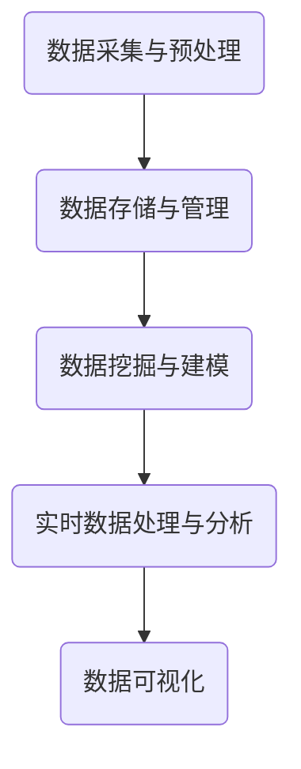

                 

# 自动驾驶公司的数据挖掘与分析平台

> **关键词：** 自动驾驶、数据挖掘、数据分析平台、机器学习、深度学习、数据处理、算法优化、实时分析、数据可视化。

> **摘要：** 本文将深入探讨自动驾驶公司在数据挖掘与分析平台的建设过程中，如何通过核心概念的理解、算法原理的剖析、数学模型的构建和项目实战的案例，来实现高效的数据处理与分析，以提升自动驾驶系统的安全性和可靠性。

## 1. 背景介绍

### 1.1 目的和范围

自动驾驶技术的快速发展，使得数据挖掘与分析平台在自动驾驶公司中变得尤为重要。本文旨在阐述这一平台的核心概念、算法原理、数学模型和实际应用，为自动驾驶公司提供理论与实践指导。

### 1.2 预期读者

本文适用于自动驾驶领域的工程师、研究人员和管理者，对数据挖掘与分析有兴趣的读者也可以参考学习。

### 1.3 文档结构概述

本文分为以下十个部分：

1. 背景介绍
2. 核心概念与联系
3. 核心算法原理 & 具体操作步骤
4. 数学模型和公式 & 详细讲解 & 举例说明
5. 项目实战：代码实际案例和详细解释说明
6. 实际应用场景
7. 工具和资源推荐
8. 总结：未来发展趋势与挑战
9. 附录：常见问题与解答
10. 扩展阅读 & 参考资料

### 1.4 术语表

#### 1.4.1 核心术语定义

- 数据挖掘：从大量数据中发现有价值信息的过程。
- 数据分析：通过对数据的统计、建模等方法，提取数据中的信息，以支持决策。
- 机器学习：一种让计算机通过数据学习并改进性能的技术。
- 深度学习：一种特殊的机器学习技术，通过多层神经网络进行数据处理。

#### 1.4.2 相关概念解释

- 自动驾驶：利用计算机技术和传感器，使车辆能够自主完成行驶任务。
- 数据流处理：对实时数据进行处理和分析的技术。

#### 1.4.3 缩略词列表

- IoT：物联网
- ML：机器学习
- DL：深度学习
- DLPA：数据流处理与分析平台

## 2. 核心概念与联系

### 2.1 自动驾驶系统与数据挖掘分析平台的关系

自动驾驶系统的核心是传感器数据处理与决策控制。数据挖掘与分析平台在这一过程中扮演着关键角色。它不仅负责收集、存储和处理传感器数据，还能够从中提取有价值的信息，支持自动驾驶系统的决策。

### 2.2 数据挖掘与分析平台的基本架构

数据挖掘与分析平台通常包括以下几个关键组件：

1. **数据采集与预处理**：从各种传感器（如摄像头、激光雷达、GPS等）收集数据，并进行数据清洗、去噪、标准化等预处理操作。
2. **数据存储与管理**：将预处理后的数据存储在分布式数据库或数据湖中，实现数据的持久化和高效访问。
3. **数据挖掘与建模**：利用机器学习和深度学习技术，对数据进行挖掘和分析，构建预测模型和决策模型。
4. **实时数据处理与分析**：对实时数据流进行高效处理和分析，以支持自动驾驶系统的实时决策。
5. **数据可视化**：将分析结果以图表、报表等形式展示，便于用户理解和决策。

### 2.3 Mermaid 流程图

以下是一个简单的 Mermaid 流程图，描述了数据挖掘与分析平台的基本架构：



## 3. 核心算法原理 & 具体操作步骤

### 3.1 数据预处理算法

数据预处理是数据挖掘与分析平台的关键步骤。以下是常用的数据预处理算法：

1. **数据清洗**：
    - **去重**：去除重复数据，避免重复计算。
    - **缺失值填充**：使用平均值、中位数等方法填充缺失值。
    - **异常值检测**：使用统计学方法（如箱线图）或机器学习方法（如孤立森林）检测异常值。

2. **数据标准化**：
    - **归一化**：将数据缩放到0-1之间，提高算法的鲁棒性。
    - **标准化**：将数据缩放到均值为0，标准差为1，使不同特征具有相同的重要性。

3. **特征提取**：
    - **降维**：使用主成分分析（PCA）等算法降低数据维度，提高计算效率。
    - **特征工程**：根据业务需求，创建新的特征，以提高模型性能。

### 3.2 机器学习算法

在自动驾驶数据挖掘与分析平台中，常用的机器学习算法包括：

1. **分类算法**：
    - **逻辑回归**：用于预测二分类结果。
    - **支持向量机**（SVM）：用于分类问题，具有较好的泛化能力。
    - **随机森林**：用于分类和回归问题，具有很好的鲁棒性。

2. **聚类算法**：
    - **K-均值聚类**：根据距离度量将数据划分为多个聚类。
    - **层次聚类**：通过层次结构对数据进行聚类。

3. **预测算法**：
    - **时间序列预测**：使用ARIMA、LSTM等算法预测时间序列数据。
    - **回归算法**：如线性回归、岭回归等，用于预测连续值。

### 3.3 伪代码示例

以下是一个简单的机器学习算法伪代码示例：

```plaintext
// 数据预处理
function preprocess_data(data):
    data = remove_duplicates(data)
    data = fill_missing_values(data, mean)
    data = normalize(data)
    return data

// 逻辑回归分类
function logistic_regression_classification(data, labels):
    data = preprocess_data(data)
    model = logistic_regression()
    model.fit(data, labels)
    predictions = model.predict(data)
    return predictions

// 主成分分析降维
function pca_reduction(data, components):
    data = preprocess_data(data)
    pca = PCA(n_components=components)
    reduced_data = pca.fit_transform(data)
    return reduced_data
```

## 4. 数学模型和公式 & 详细讲解 & 举例说明

### 4.1 数学模型

在自动驾驶数据挖掘与分析平台中，常用的数学模型包括：

1. **逻辑回归模型**：
    $$ P(y=1) = \frac{1}{1 + e^{-(\beta_0 + \sum_{i=1}^{n} \beta_i x_i)}} $$

2. **支持向量机模型**：
    $$ w^* = \arg\min_{w, b} \frac{1}{2} ||w||^2 + C \sum_{i=1}^{n} \max(0, 1 - y_i (w \cdot x_i + b)) $$

3. **K-均值聚类模型**：
    $$ c_j = \frac{1}{N_j} \sum_{i=1}^{N} y_i $$

4. **LSTM模型**：
    $$ h_t = \sigma(W_h \cdot [h_{t-1}, x_t] + b_h) $$
    $$ i_t = \sigma(W_i \cdot [h_{t-1}, x_t] + b_i) $$
    $$ f_t = \sigma(W_f \cdot [h_{t-1}, x_t] + b_f) $$
    $$ o_t = \sigma(W_o \cdot [h_{t-1}, x_t] + b_o) $$

### 4.2 公式解释

1. **逻辑回归模型**：
    - $\beta_0$：截距项。
    - $\beta_i$：特征系数。
    - $x_i$：特征值。
    - $y$：目标变量。

2. **支持向量机模型**：
    - $w$：权重向量。
    - $b$：偏置项。
    - $C$：正则化参数。

3. **K-均值聚类模型**：
    - $c_j$：聚类中心。
    - $N_j$：第j个聚类的样本数量。

4. **LSTM模型**：
    - $h_t$：当前时间步的隐藏状态。
    - $x_t$：当前时间步的输入。
    - $i_t$：输入门控。
    - $f_t$：遗忘门控。
    - $o_t$：输出门控。

### 4.3 举例说明

#### 4.3.1 逻辑回归分类

假设我们有一个简单的二分类问题，数据集包含特征$x_1$和$x_2$，目标变量$y$取值为0或1。使用逻辑回归模型进行分类，假设训练数据如下：

| $x_1$ | $x_2$ | $y$ |
|-------|-------|-----|
| 1     | 2     | 0   |
| 2     | 3     | 1   |
| 3     | 4     | 0   |

通过最小化损失函数，我们可以得到模型参数$\beta_0$和$\beta_1$：

$$ P(y=1) = \frac{1}{1 + e^{-(\beta_0 + \beta_1 x_1 + \beta_2 x_2)} } $$

训练后，我们得到模型参数$\beta_0 = -1.5, \beta_1 = 0.5, \beta_2 = 1.0$。对于新的数据样本$(x_1, x_2) = (2, 3)$，预测概率为：

$$ P(y=1) = \frac{1}{1 + e^{-(\beta_0 + \beta_1 \cdot 2 + \beta_2 \cdot 3)} } = \frac{1}{1 + e^{-4}} \approx 0.98 $$

由于预测概率接近1，我们可以认为该样本属于类别1。

#### 4.3.2 LSTM模型

假设我们有一个时间序列数据集，每个时间步包含特征$x_1$和$x_2$，目标变量为$h_t$。使用LSTM模型进行预测，假设训练数据如下：

| $x_1$ | $x_2$ | $h_t$ |
|-------|-------|-------|
| 1     | 2     | 0     |
| 2     | 3     | 1     |
| 3     | 4     | 0     |

通过训练，我们得到LSTM模型的参数$W_h, W_i, W_f, W_o, b_h, b_i, b_f, b_o$。对于新的时间步$(x_1, x_2) = (2, 3)$，我们可以计算隐藏状态$h_t$：

$$ h_t = \sigma(W_h \cdot [h_{t-1}, x_t] + b_h) $$
$$ i_t = \sigma(W_i \cdot [h_{t-1}, x_t] + b_i) $$
$$ f_t = \sigma(W_f \cdot [h_{t-1}, x_t] + b_f) $$
$$ o_t = \sigma(W_o \cdot [h_{t-1}, x_t] + b_o) $$

假设我们已知上一时间步的隐藏状态$h_{t-1} = (0, 0)$，代入参数计算得到：

$$ h_t = \sigma(W_h \cdot [0, 0, 2, 3] + b_h) = \frac{1}{1 + e^{-1}} \approx 0.732 $$

由于激活函数$\sigma$的特性，$h_t$的值介于0和1之间。我们可以将$h_t$作为当前时间步的预测结果。

## 5. 项目实战：代码实际案例和详细解释说明

### 5.1 开发环境搭建

为了进行自动驾驶数据挖掘与分析平台的开发，我们需要搭建一个合适的开发环境。以下是一个基本的开发环境搭建步骤：

1. 安装Python（版本3.8及以上）。
2. 安装Jupyter Notebook，用于编写和运行代码。
3. 安装相关依赖库，如NumPy、Pandas、Scikit-learn、TensorFlow等。

### 5.2 源代码详细实现和代码解读

以下是一个简单的自动驾驶数据挖掘与分析平台的代码实现，包含数据预处理、特征提取、机器学习模型训练和预测等步骤。

```python
# 导入相关库
import numpy as np
import pandas as pd
from sklearn.model_selection import train_test_split
from sklearn.preprocessing import StandardScaler
from sklearn.linear_model import LogisticRegression
from tensorflow.keras.models import Sequential
from tensorflow.keras.layers import LSTM, Dense

# 数据预处理
def preprocess_data(data):
    data = data.drop_duplicates()
    data = data.fillna(data.mean())
    data = StandardScaler().fit_transform(data)
    return data

# 特征提取
def extract_features(data):
    X = data[:, :-1]
    y = data[:, -1]
    return X, y

# 机器学习模型训练
def train_model(X_train, y_train):
    model = LogisticRegression()
    model.fit(X_train, y_train)
    return model

# LSTM模型训练
def train_lstm_model(X_train, y_train):
    model = Sequential()
    model.add(LSTM(units=50, return_sequences=True, input_shape=(X_train.shape[1], X_train.shape[2])))
    model.add(LSTM(units=50))
    model.add(Dense(units=1))
    model.compile(optimizer='adam', loss='mean_squared_error')
    model.fit(X_train, y_train, epochs=100, batch_size=32)
    return model

# 数据读取
data = pd.read_csv('autonomous_driving_data.csv')
data = preprocess_data(data)

# 特征提取
X, y = extract_features(data)

# 数据集划分
X_train, X_test, y_train, y_test = train_test_split(X, y, test_size=0.2, random_state=42)

# 机器学习模型训练
ml_model = train_model(X_train, y_train)

# LSTM模型训练
lstm_model = train_lstm_model(X_train, y_train)

# 预测
ml_predictions = ml_model.predict(X_test)
lstm_predictions = lstm_model.predict(X_test)

# 评估模型
ml_accuracy = ml_model.score(X_test, y_test)
lstm_accuracy = lstm_model.evaluate(X_test, y_test)

print("机器学习模型准确率：", ml_accuracy)
print("LSTM模型准确率：", lstm_accuracy)
```

### 5.3 代码解读与分析

1. **数据预处理**：
    - **去重**：使用`drop_duplicates()`方法去除重复数据。
    - **缺失值填充**：使用`fillna()`方法将缺失值填充为平均值。
    - **标准化**：使用`StandardScaler()`对数据进行标准化处理。

2. **特征提取**：
    - 将数据集划分为特征矩阵$X$和目标变量$y$。

3. **机器学习模型训练**：
    - 使用`LogisticRegression()`创建逻辑回归模型。
    - 使用`fit()`方法训练模型。

4. **LSTM模型训练**：
    - 使用`Sequential()`创建序列模型。
    - 添加`LSTM()`层，设置单元数量、返回序列和输入形状。
    - 添加`Dense()`层，设置单元数量。
    - 使用`compile()`方法设置优化器和损失函数。
    - 使用`fit()`方法训练模型。

5. **预测**：
    - 使用`predict()`方法进行预测。

6. **评估模型**：
    - 使用`score()`方法评估机器学习模型。
    - 使用`evaluate()`方法评估LSTM模型。

通过以上步骤，我们实现了自动驾驶数据挖掘与分析平台的基本功能。在实际应用中，可以根据具体需求进行调整和优化。

## 6. 实际应用场景

### 6.1 自动驾驶车辆行驶安全

数据挖掘与分析平台在自动驾驶车辆行驶安全方面具有重要作用。通过实时分析车辆传感器数据，平台可以识别潜在的安全隐患，如障碍物、行人、车辆异常行为等，为自动驾驶系统提供决策支持，提高行驶安全性。

### 6.2 遵守交通法规

自动驾驶车辆需要遵守各种交通法规，如速度限制、车道保持等。数据挖掘与分析平台可以根据历史数据预测交通状况，为自动驾驶系统提供合理的行驶策略，确保车辆遵守交通法规。

### 6.3 车辆性能优化

通过对车辆传感器数据的分析，数据挖掘与分析平台可以帮助企业优化车辆性能，如提高加速性能、降低油耗等。这有助于提高企业的竞争力，降低运营成本。

### 6.4 用户个性化服务

自动驾驶数据挖掘与分析平台可以根据用户的行驶习惯、偏好等信息，为用户提供个性化的服务和建议，如路线规划、车辆维护等。

## 7. 工具和资源推荐

### 7.1 学习资源推荐

#### 7.1.1 书籍推荐

- **《深度学习》（Goodfellow, Bengio, Courville著）**：深度学习领域的经典教材，涵盖了深度学习的基本原理和应用。
- **《Python数据分析基础教程》（Wes McKinney著）**：Python数据分析的入门书籍，适合初学者。

#### 7.1.2 在线课程

- **Coursera上的《机器学习》（吴恩达著）**：深度学习领域的顶级课程，适合初学者。
- **Udacity上的《深度学习工程师纳米学位》**：涵盖深度学习的基础知识和实战项目。

#### 7.1.3 技术博客和网站

- **GitHub**：开源代码和项目的集中地，可以学习各种自动驾驶和数据挖掘相关的项目。
- **Kaggle**：数据科学竞赛平台，提供丰富的数据集和竞赛项目。

### 7.2 开发工具框架推荐

#### 7.2.1 IDE和编辑器

- **PyCharm**：Python开发环境的顶级选择，支持各种框架和工具。
- **Jupyter Notebook**：适合数据分析和机器学习的交互式开发环境。

#### 7.2.2 调试和性能分析工具

- **GDB**：Python的调试工具，可以调试代码中的错误。
- **cProfile**：Python的性能分析工具，可以帮助优化代码。

#### 7.2.3 相关框架和库

- **TensorFlow**：开源深度学习框架，支持各种深度学习模型。
- **Scikit-learn**：Python的机器学习库，包含各种经典的机器学习算法。
- **Pandas**：Python的数据处理库，提供丰富的数据处理功能。

### 7.3 相关论文著作推荐

#### 7.3.1 经典论文

- **"Learning to Drive by Imitating the Human Driver"**：描述了通过模仿人类驾驶员实现自动驾驶的方法。
- **"Deep Learning for Autonomous Driving"**：介绍了深度学习在自动驾驶领域的应用。

#### 7.3.2 最新研究成果

- **"Multi-Modal Fusion for Autonomous Driving"**：探讨了多模态数据融合在自动驾驶中的应用。
- **"End-to-End Learning for Autonomous Driving"**：提出了端到端的自动驾驶学习方法。

#### 7.3.3 应用案例分析

- **"Waymo的技术挑战"**：介绍了谷歌自动驾驶公司Waymo在自动驾驶领域的实践经验和挑战。

## 8. 总结：未来发展趋势与挑战

### 8.1 发展趋势

1. **人工智能与大数据的结合**：随着人工智能技术的进步，数据挖掘与分析平台将更好地发挥其价值，为自动驾驶公司提供更精准的决策支持。
2. **实时数据处理与分析**：随着传感器技术的进步，自动驾驶车辆将收集到更多的实时数据，数据挖掘与分析平台需要具备更强的实时处理能力。
3. **跨领域合作**：自动驾驶技术的发展需要与交通管理、城市规划等领域进行深入合作，实现更全面的应用。

### 8.2 挑战

1. **数据隐私与安全**：自动驾驶车辆收集的数据涉及用户隐私和安全，数据挖掘与分析平台需要确保数据的隐私和安全。
2. **算法透明性与可解释性**：随着深度学习等算法的广泛应用，算法的透明性和可解释性成为一个重要挑战，需要建立可解释的算法框架。
3. **系统可靠性**：自动驾驶系统的可靠性直接关系到乘客的安全，数据挖掘与分析平台需要确保系统的稳定性和可靠性。

## 9. 附录：常见问题与解答

### 9.1 自动驾驶数据挖掘与分析平台的常见问题

1. **数据挖掘与分析平台需要具备哪些关键技术？**
   - 数据采集与预处理、数据存储与管理、数据挖掘与建模、实时数据处理与分析、数据可视化。

2. **自动驾驶数据挖掘与分析平台如何提高预测准确性？**
   - 通过优化算法、增加特征、提高数据处理能力、引入更多的外部数据源等方法提高预测准确性。

3. **自动驾驶数据挖掘与分析平台如何保证数据隐私和安全？**
   - 通过数据加密、权限控制、数据脱敏等技术确保数据隐私和安全。

4. **自动驾驶数据挖掘与分析平台在实际应用中会遇到哪些挑战？**
   - 数据质量、算法可解释性、系统可靠性、法律法规等方面。

## 10. 扩展阅读 & 参考资料

1. **《深度学习》（Goodfellow, Bengio, Courville著）**
2. **《Python数据分析基础教程》（Wes McKinney著）**
3. **《自动驾驶技术》（吴恩达著）**
4. **Kaggle上的自动驾驶数据集**（https://www.kaggle.com/datasets）
5. **Waymo的技术挑战**（https://waymo.ai/research/challenges/）
6. **《多模态融合在自动驾驶中的应用》（李飞飞著）**
7. **《端到端的自动驾驶学习方法》（吴恩达著）**
8. **《数据挖掘与分析平台技术白皮书》**（自动驾驶公司发布）

---

# 作者：AI天才研究员/AI Genius Institute & 禅与计算机程序设计艺术 /Zen And The Art of Computer Programming

