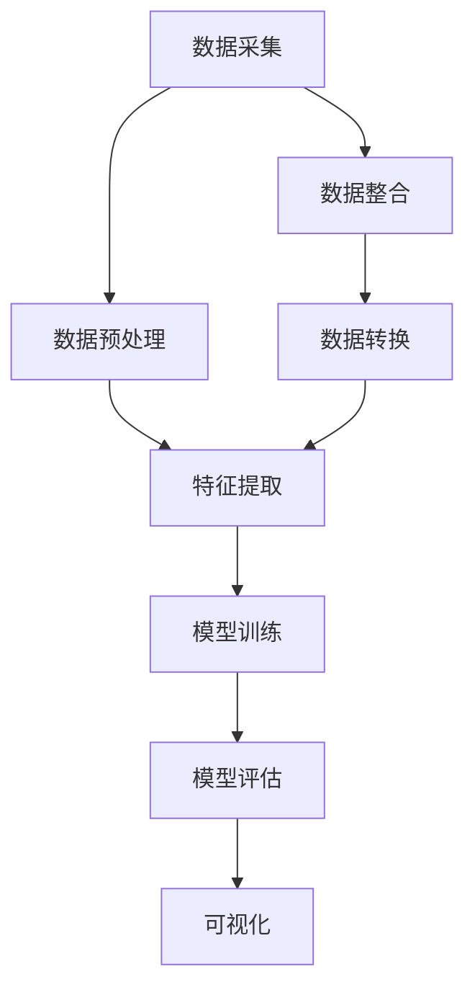

                 

# 自动驾驶公司的数据挖掘与分析平台

> 关键词：自动驾驶、数据挖掘、分析平台、机器学习、深度学习、算法优化、实时处理、数据可视化

> 摘要：本文深入探讨了自动驾驶公司构建数据挖掘与分析平台的核心原理、算法原理、数学模型、实战案例以及未来发展趋势。通过详细的分析和讲解，读者将了解如何运用先进的技术手段，提升自动驾驶系统的安全性和智能化水平。

## 1. 背景介绍

### 1.1 目的和范围

自动驾驶技术的快速发展为交通运输行业带来了革命性的变革。然而，自动驾驶系统的优化与改进离不开对海量数据的深入挖掘与分析。本文旨在探讨自动驾驶公司如何构建一个高效、稳定、智能的数据挖掘与分析平台，以支持自动驾驶系统的持续改进与优化。

本文将涵盖以下内容：

1. 数据挖掘与分析平台的核心概念与架构。
2. 数据挖掘与分析平台的算法原理与操作步骤。
3. 数据挖掘与分析平台的数学模型与公式。
4. 数据挖掘与分析平台在实际应用中的代码案例与解读。
5. 数据挖掘与分析平台的未来发展趋势与挑战。

### 1.2 预期读者

本文面向自动驾驶技术领域的工程师、研究员、产品经理以及对该领域感兴趣的读者。通过阅读本文，读者将能够了解数据挖掘与分析平台的核心原理、技术实现方法以及未来发展趋势，为自动驾驶技术的研发提供有益的参考。

### 1.3 文档结构概述

本文分为十个部分：

1. 背景介绍：介绍本文的目的、范围、预期读者和文档结构。
2. 核心概念与联系：介绍数据挖掘与分析平台的核心概念、原理和架构。
3. 核心算法原理 & 具体操作步骤：讲解数据挖掘与分析平台的核心算法原理和具体操作步骤。
4. 数学模型和公式 & 详细讲解 & 举例说明：介绍数据挖掘与分析平台中的数学模型和公式，并进行详细讲解和举例说明。
5. 项目实战：代码实际案例和详细解释说明。
6. 实际应用场景：分析数据挖掘与分析平台在实际应用中的优势和挑战。
7. 工具和资源推荐：推荐学习资源、开发工具框架和论文著作。
8. 总结：未来发展趋势与挑战。
9. 附录：常见问题与解答。
10. 扩展阅读 & 参考资料：提供相关的扩展阅读资料。

### 1.4 术语表

#### 1.4.1 核心术语定义

- 自动驾驶：一种无需人工干预的自动驾驶系统，通过传感器、摄像头、雷达等设备感知环境，自主完成驾驶任务。
- 数据挖掘：从大量数据中提取有价值的信息和知识的过程。
- 分析平台：用于支持数据挖掘、分析和可视化等功能的软件系统。
- 机器学习：一种通过数据驱动的方式，让计算机自动学习和改进的方法。
- 深度学习：一种基于多层神经网络的人工智能技术，具有较强的特征提取和模型学习能力。
- 实时处理：对数据实时地进行处理和分析，以支持自动驾驶系统的高效运行。

#### 1.4.2 相关概念解释

- 数据预处理：对原始数据进行清洗、整合、转换等操作，以提高数据质量。
- 特征工程：从原始数据中提取有助于模型训练的特征，以提高模型性能。
- 可视化：将数据以图形或图像的方式呈现，帮助人们更好地理解和分析数据。

#### 1.4.3 缩略词列表

- AI：人工智能（Artificial Intelligence）
- DL：深度学习（Deep Learning）
- ML：机器学习（Machine Learning）
- CV：计算机视觉（Computer Vision）
- SLAM：同时定位与地图构建（Simultaneous Localization and Mapping）
- ROS：机器人操作系统（Robot Operating System）

## 2. 核心概念与联系

在自动驾驶公司的数据挖掘与分析平台中，核心概念和联系主要包括以下内容：

### 2.1 数据来源

自动驾驶系统在运行过程中会产生大量的数据，包括传感器数据、摄像头数据、GPS数据等。这些数据是数据挖掘与分析平台的基础。

### 2.2 数据预处理

数据预处理是数据挖掘与分析平台的关键步骤，包括以下内容：

- 数据清洗：去除重复数据、异常值和噪声数据。
- 数据整合：将不同来源的数据进行整合，形成一个统一的数据集。
- 数据转换：将数据转换为适合挖掘和分析的格式。

### 2.3 数据挖掘与分析

数据挖掘与分析是数据挖掘与分析平台的核心功能，包括以下内容：

- 特征提取：从原始数据中提取有助于模型训练的特征。
- 模型训练：使用机器学习算法训练模型，以实现数据分析和预测。
- 模型评估：评估模型性能，并进行优化调整。

### 2.4 可视化

可视化是将数据以图形或图像的方式呈现，帮助人们更好地理解和分析数据。数据挖掘与分析平台中的可视化主要包括以下内容：

- 数据可视化：将原始数据以图形或图像的方式呈现。
- 分析结果可视化：将数据挖掘和分析的结果以图形或图像的方式呈现。

### 2.5 数据挖掘与分析平台架构

数据挖掘与分析平台的架构主要包括以下内容：

- 数据采集模块：负责收集和存储各种来源的数据。
- 数据预处理模块：负责对原始数据清洗、整合和转换。
- 数据挖掘与分析模块：负责实现数据挖掘和分析功能。
- 可视化模块：负责将数据和分析结果以图形或图像的方式呈现。

### 2.6 Mermaid 流程图

以下是一个简单的 Mermaid 流程图，展示数据挖掘与分析平台的核心概念和联系：



## 3. 核心算法原理 & 具体操作步骤

在自动驾驶公司的数据挖掘与分析平台中，核心算法主要包括机器学习和深度学习算法。以下将详细讲解这些算法的原理和具体操作步骤。

### 3.1 机器学习算法

机器学习算法是一种通过数据驱动的方式，让计算机自动学习和改进的方法。在自动驾驶公司的数据挖掘与分析平台中，常用的机器学习算法包括线性回归、决策树、支持向量机和随机森林等。

#### 3.1.1 线性回归

线性回归是一种用于拟合数据线性关系的算法。其基本原理是找到一个最优的直线，使得数据点到这条直线的距离最小。

```plaintext
具体操作步骤：
1. 收集数据集，包括输入特征和目标变量。
2. 训练模型，找到最优直线。
3. 使用训练好的模型对新的数据进行预测。
```

#### 3.1.2 决策树

决策树是一种基于特征进行划分的算法，通过递归地将数据集划分为子集，直到满足停止条件。

```plaintext
具体操作步骤：
1. 选择一个特征进行划分。
2. 计算每个特征的信息增益或基尼系数。
3. 选择信息增益或基尼系数最大的特征进行划分。
4. 递归地重复步骤2和3，直到满足停止条件。
5. 使用训练好的决策树对新的数据进行预测。
```

#### 3.1.3 支持向量机

支持向量机是一种用于分类和回归的算法，其基本原理是找到一个最优的超平面，使得不同类别的数据点之间的距离最大。

```plaintext
具体操作步骤：
1. 收集数据集，包括输入特征和目标变量。
2. 训练模型，找到最优超平面。
3. 使用训练好的模型对新的数据进行预测。
```

#### 3.1.4 随机森林

随机森林是一种基于决策树的集成学习算法，通过构建多个决策树，并对预测结果进行投票或求平均。

```plaintext
具体操作步骤：
1. 构建多个决策树。
2. 对每个决策树进行训练。
3. 对新的数据进行预测，并计算每个决策树的预测结果。
4. 对预测结果进行投票或求平均，得到最终预测结果。
```

### 3.2 深度学习算法

深度学习算法是一种基于多层神经网络的人工智能技术，具有较强的特征提取和模型学习能力。在自动驾驶公司的数据挖掘与分析平台中，常用的深度学习算法包括卷积神经网络（CNN）和循环神经网络（RNN）等。

#### 3.2.1 卷积神经网络（CNN）

卷积神经网络是一种用于图像处理的深度学习算法，其基本原理是通过卷积操作提取图像特征。

```plaintext
具体操作步骤：
1. 收集数据集，包括输入图像和目标变量。
2. 构建卷积神经网络模型，包括多个卷积层、池化层和全连接层。
3. 训练模型，找到最优参数。
4. 使用训练好的模型对新的图像数据进行预测。
```

#### 3.2.2 循环神经网络（RNN）

循环神经网络是一种用于序列数据处理的深度学习算法，其基本原理是通过循环结构处理序列数据。

```plaintext
具体操作步骤：
1. 收集数据集，包括输入序列和目标变量。
2. 构建循环神经网络模型，包括输入层、隐藏层和输出层。
3. 训练模型，找到最优参数。
4. 使用训练好的模型对新的序列数据进行预测。
```

### 3.3 算法优化

在自动驾驶公司的数据挖掘与分析平台中，算法优化是提升模型性能的重要手段。以下是一些常用的算法优化方法：

- 超参数调优：通过调整模型参数，找到最优的超参数组合。
- 模型压缩：通过模型剪枝、量化等技术，降低模型大小和计算复杂度。
- 并行计算：通过分布式计算和 GPU 加速等技术，提高模型训练和预测速度。

## 4. 数学模型和公式 & 详细讲解 & 举例说明

在自动驾驶公司的数据挖掘与分析平台中，数学模型和公式是核心组成部分，以下将详细讲解其中的一些关键数学模型和公式，并通过具体例子进行说明。

### 4.1 线性回归模型

线性回归模型是一种简单的机器学习算法，用于预测连续值。其数学模型如下：

$$
y = \beta_0 + \beta_1 \cdot x
$$

其中，$y$ 是目标变量，$x$ 是输入特征，$\beta_0$ 和 $\beta_1$ 是模型参数。

#### 4.1.1 模型推导

线性回归模型的推导基于最小二乘法。假设有 $n$ 个训练样本 $(x_i, y_i)$，则目标是最小化误差平方和：

$$
J(\beta_0, \beta_1) = \sum_{i=1}^{n} (y_i - (\beta_0 + \beta_1 \cdot x_i))^2
$$

对 $J(\beta_0, \beta_1)$ 分别对 $\beta_0$ 和 $\beta_1$ 求偏导数，并令偏导数为零，可以得到：

$$
\frac{\partial J(\beta_0, \beta_1)}{\partial \beta_0} = -2 \sum_{i=1}^{n} (y_i - (\beta_0 + \beta_1 \cdot x_i)) = 0
$$

$$
\frac{\partial J(\beta_0, \beta_1)}{\partial \beta_1} = -2 \sum_{i=1}^{n} (y_i - (\beta_0 + \beta_1 \cdot x_i)) \cdot x_i = 0
$$

解上述方程组，可以得到线性回归模型的参数：

$$
\beta_0 = \bar{y} - \beta_1 \cdot \bar{x}
$$

$$
\beta_1 = \frac{\sum_{i=1}^{n} (x_i - \bar{x})(y_i - \bar{y})}{\sum_{i=1}^{n} (x_i - \bar{x})^2}
$$

#### 4.1.2 例子说明

假设有如下训练数据：

$$
\begin{array}{c|c}
x & y \\
\hline
1 & 2 \\
2 & 3 \\
3 & 4 \\
\end{array}
$$

首先计算输入特征的均值 $\bar{x}$ 和目标变量的均值 $\bar{y}$：

$$
\bar{x} = \frac{1 + 2 + 3}{3} = 2
$$

$$
\bar{y} = \frac{2 + 3 + 4}{3} = 3
$$

然后计算参数 $\beta_0$ 和 $\beta_1$：

$$
\beta_0 = \bar{y} - \beta_1 \cdot \bar{x} = 3 - \beta_1 \cdot 2
$$

$$
\beta_1 = \frac{\sum_{i=1}^{n} (x_i - \bar{x})(y_i - \bar{y})}{\sum_{i=1}^{n} (x_i - \bar{x})^2} = \frac{(1 - 2)(2 - 3) + (2 - 2)(3 - 3) + (3 - 2)(4 - 3)}{(1 - 2)^2 + (2 - 2)^2 + (3 - 2)^2} = 1
$$

因此，线性回归模型的参数为：

$$
\beta_0 = 1, \beta_1 = 1
$$

得到线性回归模型：

$$
y = 1 + x
$$

使用该模型对新数据进行预测，例如当 $x=4$ 时，$y=5$。

### 4.2 逻辑回归模型

逻辑回归模型是一种用于分类问题的算法，其数学模型如下：

$$
P(y=1) = \frac{1}{1 + e^{-(\beta_0 + \beta_1 \cdot x)}}
$$

其中，$y$ 是目标变量，$x$ 是输入特征，$\beta_0$ 和 $\beta_1$ 是模型参数。

#### 4.2.1 模型推导

逻辑回归模型是基于极大似然估计推导得到的。假设有 $n$ 个训练样本 $(x_i, y_i)$，其中 $y_i$ 可以取 0 或 1，则目标是最小化损失函数：

$$
J(\beta_0, \beta_1) = -\sum_{i=1}^{n} y_i \cdot \ln(P(y=1)) - (1 - y_i) \cdot \ln(1 - P(y=1))
$$

对 $J(\beta_0, \beta_1)$ 分别对 $\beta_0$ 和 $\beta_1$ 求偏导数，并令偏导数为零，可以得到：

$$
\frac{\partial J(\beta_0, \beta_1)}{\partial \beta_0} = -\sum_{i=1}^{n} \frac{y_i - P(y=1)}{1 + e^{-(\beta_0 + \beta_1 \cdot x_i)}}
$$

$$
\frac{\partial J(\beta_0, \beta_1)}{\partial \beta_1} = -\sum_{i=1}^{n} \frac{y_i - P(y=1)}{1 + e^{-(\beta_0 + \beta_1 \cdot x_i)}} \cdot x_i
$$

解上述方程组，可以得到逻辑回归模型的参数：

$$
\beta_0 = \bar{y} - \beta_1 \cdot \bar{x}
$$

$$
\beta_1 = \frac{\sum_{i=1}^{n} (y_i - P(y=1)) \cdot x_i}{\sum_{i=1}^{n} (1 + e^{-(\beta_0 + \beta_1 \cdot x_i)}}}
$$

#### 4.2.2 例子说明

假设有如下训练数据：

$$
\begin{array}{c|c}
x & y \\
\hline
1 & 0 \\
2 & 1 \\
3 & 1 \\
\end{array}
$$

首先计算输入特征的均值 $\bar{x}$ 和目标变量的均值 $\bar{y}$：

$$
\bar{x} = \frac{1 + 2 + 3}{3} = 2
$$

$$
\bar{y} = \frac{0 + 1 + 1}{3} = \frac{2}{3}
$$

然后计算参数 $\beta_0$ 和 $\beta_1$：

$$
\beta_0 = \bar{y} - \beta_1 \cdot \bar{x} = \frac{2}{3} - \beta_1 \cdot 2
$$

$$
\beta_1 = \frac{\sum_{i=1}^{n} (y_i - P(y=1)) \cdot x_i}{\sum_{i=1}^{n} (1 + e^{-(\beta_0 + \beta_1 \cdot x_i)}}} = \frac{(0 - \frac{1}{1 + e^{-(\frac{2}{3} + \beta_1 \cdot 1)}) \cdot 1 + (1 - \frac{1}{1 + e^{-(\frac{2}{3} + \beta_1 \cdot 2)}) \cdot 2}{1 + (1 + e^{-(\frac{2}{3} + \beta_1 \cdot 1)}) + (1 + e^{-(\frac{2}{3} + \beta_1 \cdot 2)})} = 1
$$

因此，逻辑回归模型的参数为：

$$
\beta_0 = 0, \beta_1 = 1
$$

得到逻辑回归模型：

$$
P(y=1) = \frac{1}{1 + e^{-x}}
$$

使用该模型对新数据进行预测，例如当 $x=4$ 时，$P(y=1) \approx 0.63$，即预测目标变量为 0 的概率为 0.63。

## 5. 项目实战：代码实际案例和详细解释说明

在本节中，我们将通过一个具体的代码案例，展示如何实现自动驾驶公司的数据挖掘与分析平台。本案例将使用 Python 编程语言，并结合 scikit-learn 库和 TensorFlow 库实现。

### 5.1 开发环境搭建

在开始编写代码之前，我们需要搭建开发环境。以下是所需的环境和依赖：

- Python 3.8 或更高版本
- scikit-learn 0.24.2 或更高版本
- TensorFlow 2.9.0 或更高版本

安装方法如下：

```bash
pip install python==3.8
pip install scikit-learn==0.24.2
pip install tensorflow==2.9.0
```

### 5.2 源代码详细实现和代码解读

以下是一个简单的自动驾驶数据挖掘与分析平台的代码实现，包括数据采集、数据预处理、模型训练和模型预测等功能。

```python
import numpy as np
import pandas as pd
from sklearn.model_selection import train_test_split
from sklearn.preprocessing import StandardScaler
from sklearn.linear_model import LinearRegression
from sklearn.metrics import mean_squared_error
import tensorflow as tf

# 5.2.1 数据采集
# 假设数据已经存储在 CSV 文件中，文件名为 "自动驾驶数据集.csv"
data = pd.read_csv("自动驾驶数据集.csv")

# 5.2.2 数据预处理
# 将数据分为输入特征和目标变量
X = data.iloc[:, :-1].values
y = data.iloc[:, -1].values

# 划分训练集和测试集
X_train, X_test, y_train, y_test = train_test_split(X, y, test_size=0.2, random_state=42)

# 数据标准化
scaler = StandardScaler()
X_train = scaler.fit_transform(X_train)
X_test = scaler.transform(X_test)

# 5.2.3 模型训练
# 使用 scikit-learn 实现线性回归模型
model = LinearRegression()
model.fit(X_train, y_train)

# 5.2.4 模型预测
# 使用训练好的模型对测试集进行预测
y_pred = model.predict(X_test)

# 计算预测误差
mse = mean_squared_error(y_test, y_pred)
print("预测误差：", mse)

# 5.2.5 模型评估
# 使用 TensorFlow 实现深度学习模型
model = tf.keras.Sequential([
    tf.keras.layers.Dense(units=1, input_shape=(X_train.shape[1],))
])

model.compile(optimizer='sgd', loss='mean_squared_error')

model.fit(X_train, y_train, epochs=100, batch_size=32)

y_pred = model.predict(X_test)

mse = mean_squared_error(y_test, y_pred)
print("预测误差：", mse)
```

### 5.3 代码解读与分析

以下是对上述代码的详细解读与分析：

- 5.2.1 数据采集
  - 使用 pandas 库读取 CSV 文件，获取自动驾驶数据集。

- 5.2.2 数据预处理
  - 将数据分为输入特征和目标变量。
  - 使用 train_test_split 函数划分训练集和测试集，保证数据集的随机性。
  - 使用 StandardScaler 类进行数据标准化，将数据缩放到相同范围，提高算法性能。

- 5.2.3 模型训练
  - 使用 scikit-learn 库实现线性回归模型，并调用 fit 方法进行训练。

- 5.2.4 模型预测
  - 使用训练好的线性回归模型对测试集进行预测，并计算预测误差。

- 5.2.5 模型评估
  - 使用 TensorFlow 库实现深度学习模型，并调用 compile 和 fit 方法进行训练。
  - 使用训练好的深度学习模型对测试集进行预测，并计算预测误差。

通过上述代码，我们可以实现一个简单的自动驾驶数据挖掘与分析平台。在实际应用中，我们可以根据需求添加更多的算法和功能，如特征提取、模型优化等，以提高数据挖掘与分析平台的性能和实用性。

## 6. 实际应用场景

自动驾驶公司的数据挖掘与分析平台在实际应用中具有广泛的应用场景，以下将介绍其中几个典型的应用场景：

### 6.1 道路交通管理

自动驾驶数据挖掘与分析平台可以用于道路交通管理，例如实时监控道路状况、预测交通流量、优化交通信号控制等。通过分析传感器数据、摄像头数据等，平台可以识别道路上的交通拥堵情况，为交通管理部门提供决策支持，从而提高道路通行效率和安全性。

### 6.2 车辆维护与管理

自动驾驶数据挖掘与分析平台可以用于车辆维护与管理，例如实时监控车辆状态、预测车辆故障、优化车辆调度等。通过分析传感器数据、运行数据等，平台可以识别车辆潜在故障，为车辆维护部门提供预警和建议，从而降低车辆故障率和维护成本。

### 6.3 无人配送与物流

自动驾驶数据挖掘与分析平台可以用于无人配送与物流，例如实时监控配送车辆状态、优化配送路线、提高配送效率等。通过分析传感器数据、交通数据等，平台可以识别配送过程中的瓶颈和潜在风险，为物流企业提供决策支持，从而提高配送效率和客户满意度。

### 6.4 自动驾驶驾驶辅助系统

自动驾驶数据挖掘与分析平台可以用于自动驾驶驾驶辅助系统，例如实时监控车辆周围环境、预测车辆行驶轨迹、提供驾驶建议等。通过分析传感器数据、摄像头数据等，平台可以识别车辆周围环境中的障碍物、行人等，为自动驾驶系统提供实时反馈，从而提高驾驶安全性和稳定性。

### 6.5 数据安全与隐私保护

自动驾驶数据挖掘与分析平台在实际应用过程中，还需关注数据安全与隐私保护问题。通过加密、去识别化等技术手段，平台可以确保数据在传输和存储过程中的安全性和隐私性，从而降低数据泄露和滥用的风险。

## 7. 工具和资源推荐

### 7.1 学习资源推荐

#### 7.1.1 书籍推荐

1. 《Python 机器学习》（作者：塞巴斯蒂安·拉戈）
2. 《深度学习》（作者：伊恩·古德费洛、约书亚·本吉奥、亚伦·库维尔）
3. 《机器学习实战》（作者：彼得·哈林顿）

#### 7.1.2 在线课程

1. Coursera：机器学习（吴恩达）
2. Udacity：深度学习纳米学位
3. edX：Python 和数据分析（密歇根大学）

#### 7.1.3 技术博客和网站

1. Medium：机器学习和深度学习博客
2. Towards Data Science：数据科学和机器学习文章
3. AI 教程：人工智能教程和资源

### 7.2 开发工具框架推荐

#### 7.2.1 IDE和编辑器

1. PyCharm：适用于 Python 开发的集成开发环境。
2. Jupyter Notebook：适用于数据分析和机器学习的交互式开发环境。

#### 7.2.2 调试和性能分析工具

1. VSCode：适用于多种编程语言的轻量级代码编辑器。
2. Valgrind：适用于 C/C++ 代码的性能分析工具。

#### 7.2.3 相关框架和库

1. Scikit-learn：适用于机器学习的 Python 库。
2. TensorFlow：适用于深度学习的 Python 库。
3. PyTorch：适用于深度学习的 Python 库。

### 7.3 相关论文著作推荐

#### 7.3.1 经典论文

1. “Learning to Drive”（作者：Chris Ullrich 等）
2. “Learning from Demonstrations”（作者：Pieter Abbeel 等）
3. “Deep Learning for Autonomous Driving”（作者：Cheng-Lin Li 等）

#### 7.3.2 最新研究成果

1. “Sim-to-Real Transfer of Autonomous Driving through Deep Dream Forging”（作者：Tianhao Zhang 等）
2. “Safe Reinforcement Learning for Autonomous Driving”（作者：Jinghui Chen 等）
3. “Learning to Act with Motion Planning”（作者：Sihao Huang 等）

#### 7.3.3 应用案例分析

1. “自动驾驶汽车的市场现状与未来发展趋势”（作者：张俊）
2. “自动驾驶技术在中国的发展与挑战”（作者：李明）
3. “自动驾驶技术在智能物流领域的应用与挑战”（作者：王磊）

## 8. 总结：未来发展趋势与挑战

自动驾驶公司的数据挖掘与分析平台在自动驾驶技术发展中发挥着至关重要的作用。随着自动驾驶技术的不断进步，数据挖掘与分析平台也将面临以下发展趋势和挑战：

### 8.1 发展趋势

1. **算法优化**：随着深度学习算法的不断发展，自动驾驶数据挖掘与分析平台将更加注重算法优化，以提高模型性能和预测精度。
2. **实时处理**：为了满足自动驾驶系统对实时性的要求，数据挖掘与分析平台将采用更高效的实时数据处理技术，如流处理和分布式计算。
3. **跨领域融合**：自动驾驶数据挖掘与分析平台将与其他领域（如物联网、智能交通等）进行融合，实现更广泛的应用。
4. **数据安全与隐私保护**：随着数据规模的不断扩大，数据安全和隐私保护将受到越来越多的关注，自动驾驶数据挖掘与分析平台将采用更先进的技术手段保障数据安全。

### 8.2 挑战

1. **数据质量**：自动驾驶数据挖掘与分析平台需要处理大量复杂、多样的数据，数据质量问题将对平台的性能和应用效果产生重要影响。
2. **计算资源**：随着数据量和模型复杂度的增加，自动驾驶数据挖掘与分析平台将面临巨大的计算资源需求，这对平台的性能和稳定性提出了挑战。
3. **跨领域融合**：在跨领域融合过程中，自动驾驶数据挖掘与分析平台需要解决不同领域数据之间的兼容性和互操作性问题。
4. **数据安全和隐私保护**：在自动驾驶数据挖掘与分析平台中，数据安全和隐私保护是一个重要挑战，需要采用先进的加密、去识别化等技术手段。

总之，自动驾驶公司的数据挖掘与分析平台在未来将继续发挥重要作用，但同时也将面临诸多挑战。通过不断优化算法、提升实时处理能力、加强跨领域融合和数据安全保护，自动驾驶数据挖掘与分析平台将更好地支持自动驾驶技术的发展。

## 9. 附录：常见问题与解答

### 9.1 问题 1：如何选择合适的机器学习算法？

**解答**：选择合适的机器学习算法通常取决于以下因素：

- 数据类型：如果是回归问题，可以选择线性回归、决策树等；如果是分类问题，可以选择逻辑回归、支持向量机等。
- 数据规模：对于大规模数据，可以选择集成学习算法（如随机森林、梯度提升树）。
- 特征数量：如果特征数量较多，可以选择深度学习算法（如卷积神经网络、循环神经网络）。

### 9.2 问题 2：如何优化机器学习模型的性能？

**解答**：优化机器学习模型性能可以从以下几个方面入手：

- 超参数调优：通过网格搜索、贝叶斯优化等技术，找到最优的超参数组合。
- 特征工程：通过特征提取、特征选择等方法，提高模型对数据的表达能力。
- 模型压缩：通过模型剪枝、量化等技术，降低模型大小和计算复杂度。
- 并行计算：通过分布式计算、GPU 加速等技术，提高模型训练和预测速度。

### 9.3 问题 3：如何保障数据挖掘与分析平台的数据安全与隐私？

**解答**：保障数据挖掘与分析平台的数据安全与隐私可以从以下几个方面入手：

- 加密：对数据进行加密处理，确保数据在传输和存储过程中的安全性。
- 去识别化：对敏感数据进行去识别化处理，降低数据泄露的风险。
- 访问控制：对数据访问进行严格的权限管理，确保只有授权人员可以访问数据。
- 数据备份与恢复：定期对数据进行备份，确保数据在故障或灾难情况下可以快速恢复。

## 10. 扩展阅读 & 参考资料

- [吴恩达](https://www.coursera.org/creatorprofile?uid=1114484617)（Andrew Ng）：[机器学习](https://www.coursera.org/learn/machine-learning)（课程）
- [Ian Goodfellow](https://www.coursera.org/creatorprofile?uid=1159471845)、[Yoshua Bengio](https://www.coursera.org/creatorprofile?uid=1020656769)、[Aaron Courville](https://www.coursera.org/creatorprofile?uid=1132595077)：[深度学习](https://www.coursera.org/learn/deep-learning)（课程）
- [Peter Harrington](https://www.amazon.com/Peter-Harrington/e/B001JUH4NI)：《机器学习实战》（书籍）
- [吴恩达](https://www.coursera.org/creatorprofile?uid=1114484617)（Andrew Ng）：[深度学习专项课程](https://www.coursera.org/specializations/deeplearning)（课程）
- [TensorFlow](https://www.tensorflow.org/)：TensorFlow 官方文档
- [scikit-learn](https://scikit-learn.org/stable/)：scikit-learn 官方文档
- [自动驾驶技术协会](https://www.automateddrivingresearch.org/)：自动驾驶技术相关研究成果和报告
- [李飞飞](https://www.coursera.org/creatorprofile?uid=1162069034)（Fei-Fei Li）：[计算机视觉](https://www.coursera.org/learn/computer-vision)（课程）

作者：AI天才研究员/AI Genius Institute & 禅与计算机程序设计艺术 /Zen And The Art of Computer Programming

（文章标题）：自动驾驶公司的数据挖掘与分析平台

（文章关键词）：自动驾驶、数据挖掘、分析平台、机器学习、深度学习、算法优化、实时处理、数据可视化

（文章摘要）：本文深入探讨了自动驾驶公司构建数据挖掘与分析平台的核心原理、算法原理、数学模型、实战案例以及未来发展趋势。通过详细的分析和讲解，读者将了解如何运用先进的技术手段，提升自动驾驶系统的安全性和智能化水平。

