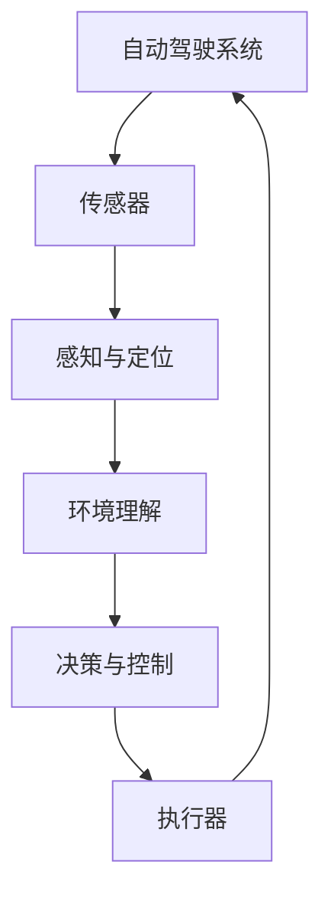

                 

# 自动驾驶安全性评估与验证技术研究综述

> **关键词：** 自动驾驶，安全性评估，验证技术，人工智能，算法，数学模型，实际应用

> **摘要：** 本文深入探讨了自动驾驶技术的安全性评估与验证问题。首先，介绍了自动驾驶技术的背景和发展现状。接着，详细阐述了安全性评估与验证的核心概念，包括核心算法原理、数学模型、实际应用场景等。文章通过具体案例展示了如何在实际项目中应用这些技术，并提供了一系列学习资源和工具推荐，以助力读者深入了解自动驾驶技术的安全性保障方法。最后，文章总结了未来发展趋势与挑战，为自动驾驶技术的研究与应用提供了有益的参考。

## 1. 背景介绍

### 1.1 目的和范围

本文旨在全面介绍自动驾驶技术的安全性评估与验证方法。随着人工智能技术的迅速发展，自动驾驶技术已经成为未来交通领域的重要研究方向。然而，自动驾驶系统的安全性直接关系到人们的生命财产安全，因此对其安全性的评估与验证显得尤为重要。本文将从多个角度深入探讨这一主题，旨在为自动驾驶技术的安全性研究和应用提供有价值的参考。

### 1.2 预期读者

本文主要面向以下读者群体：

1. 自动驾驶技术研究人员和工程师；
2. 汽车工程师和相关领域的技术人员；
3. 对自动驾驶技术感兴趣的学者和爱好者；
4. 高等院校相关专业的学生和教师。

### 1.3 文档结构概述

本文分为十个部分：

1. 背景介绍：介绍本文的目的、范围、预期读者和文档结构；
2. 核心概念与联系：阐述自动驾驶技术的基本原理和架构；
3. 核心算法原理 & 具体操作步骤：详细介绍自动驾驶技术的核心算法和实现过程；
4. 数学模型和公式 & 详细讲解 & 举例说明：分析自动驾驶技术中的数学模型和公式；
5. 项目实战：展示如何在实际项目中应用自动驾驶技术；
6. 实际应用场景：讨论自动驾驶技术在各个领域的应用案例；
7. 工具和资源推荐：推荐学习资源、开发工具和框架；
8. 总结：展望自动驾驶技术未来的发展趋势与挑战；
9. 附录：常见问题与解答；
10. 扩展阅读 & 参考资料：提供进一步阅读的资料。

### 1.4 术语表

#### 1.4.1 核心术语定义

- 自动驾驶：利用计算机视觉、人工智能等技术，实现车辆在无人干预的情况下自动行驶；
- 安全性评估：对自动驾驶系统在复杂环境中的安全性能进行评估；
- 验证技术：确保自动驾驶系统在设计和实现过程中符合既定安全标准和要求；
- 人工智能（AI）：模拟、延伸和扩展人类智能的理论、方法、技术及应用；
- 算法：解决问题的步骤和策略；
- 数学模型：描述现实世界问题的一种数学表达式；
- 实际应用场景：自动驾驶技术在特定领域中的应用案例。

#### 1.4.2 相关概念解释

- **深度学习（Deep Learning）**：一种人工智能技术，通过多层神经网络模型进行数据学习和建模；
- **计算机视觉（Computer Vision）**：研究如何使计算机从图像或视频中提取有用信息的技术；
- **高斯混合模型（Gaussian Mixture Model, GMM）**：一种概率分布模型，用于描述多个高斯分布的混合；
- **贝叶斯网络（Bayesian Network）**：一种概率图模型，用于表示变量之间的条件依赖关系。

#### 1.4.3 缩略词列表

- **ADAS**：高级驾驶辅助系统（Advanced Driver Assistance Systems）；
- **LIDAR**：激光雷达（Light Detection and Ranging）；
- **ROS**：机器人操作系统（Robot Operating System）；
- **SLAM**：同时定位与地图构建（Simultaneous Localization and Mapping）；
- **GPU**：图形处理器（Graphics Processing Unit）；
- **CPU**：中央处理器（Central Processing Unit）。

## 2. 核心概念与联系

为了更好地理解自动驾驶技术的核心概念和联系，我们首先需要了解其基本原理和架构。以下是一个Mermaid流程图，用于描述自动驾驶技术的基本架构。



### 2.1 自动驾驶系统的基本原理

自动驾驶系统主要依赖于计算机视觉、人工智能和传感器技术。传感器（如LIDAR、摄像头、雷达等）负责获取周围环境的信息，感知与定位模块对传感器数据进行处理，以确定车辆的位置和状态。环境理解模块则对感知与定位结果进行分析，以识别道路、车辆、行人等目标。决策与控制模块根据环境理解结果制定行驶策略，并通过执行器（如电机、方向盘等）实现控制。整个系统通过闭环控制实现车辆的自主行驶。

### 2.2 自动驾驶系统的架构

自动驾驶系统通常分为以下几个模块：

1. **传感器模块**：用于获取车辆周围环境的信息，包括道路、车辆、行人等；
2. **感知与定位模块**：对传感器数据进行处理，以确定车辆的位置和状态；
3. **环境理解模块**：对感知与定位结果进行分析，以识别道路、车辆、行人等目标；
4. **决策与控制模块**：根据环境理解结果制定行驶策略，并通过执行器实现控制；
5. **执行器模块**：负责执行决策与控制模块的指令，控制车辆的行驶。

### 2.3 自动驾驶系统的工作流程

1. **感知与定位**：传感器获取环境信息，感知与定位模块对传感器数据进行处理，确定车辆的位置和状态；
2. **环境理解**：环境理解模块对感知与定位结果进行分析，识别道路、车辆、行人等目标；
3. **决策与控制**：决策与控制模块根据环境理解结果制定行驶策略，并通过执行器实现控制；
4. **闭环控制**：执行器根据决策与控制模块的指令控制车辆行驶，同时传感器模块持续获取环境信息，以实现闭环控制。

## 3. 核心算法原理 & 具体操作步骤

自动驾驶技术的核心算法主要包括感知与定位、环境理解和决策与控制等模块。以下我们将分别介绍这些核心算法的原理和具体操作步骤。

### 3.1 感知与定位算法

感知与定位算法是自动驾驶系统的关键组成部分，负责处理传感器数据，以获取车辆的位置和状态信息。以下是一个感知与定位算法的伪代码：

```python
def感知与定位(传感器数据):
    初始化车辆位置和姿态
    
    for 数据 in 传感器数据:
        处理数据以提取特征
        使用特征匹配方法更新车辆位置和姿态
    
    返回车辆位置和姿态
```

具体操作步骤如下：

1. **初始化**：设定初始车辆位置和姿态；
2. **特征提取**：对传感器数据进行预处理，提取关键特征；
3. **特征匹配**：使用特征匹配方法（如基于密度的空间聚类、基于梯度的特征匹配等），将传感器数据与已有位置和姿态进行匹配；
4. **更新位置和姿态**：根据匹配结果更新车辆的位置和姿态；
5. **返回结果**：输出车辆的位置和姿态。

### 3.2 环境理解算法

环境理解算法负责分析感知与定位结果，以识别道路、车辆、行人等目标。以下是一个环境理解算法的伪代码：

```python
def环境理解(车辆位置和姿态，传感器数据):
    初始化目标列表
    
    for 数据 in 传感器数据:
        提取目标特征
        使用特征分类方法识别目标类型
        
    标记目标位置和属性
    
    返回目标列表
```

具体操作步骤如下：

1. **初始化**：设定初始目标列表；
2. **特征提取**：对传感器数据进行预处理，提取目标特征；
3. **特征分类**：使用特征分类方法（如支持向量机、深度神经网络等），识别目标类型；
4. **标记目标位置和属性**：根据分类结果，标记目标的位置和属性（如车辆、行人、道路等）；
5. **返回结果**：输出目标列表。

### 3.3 决策与控制算法

决策与控制算法根据环境理解结果，制定行驶策略，并通过执行器实现控制。以下是一个决策与控制算法的伪代码：

```python
def决策与控制(目标列表，车辆位置和姿态):
    初始化行驶策略
    
    for 目标 in 目标列表:
        分析目标位置和属性
        根据目标信息更新行驶策略
        
    控制执行器执行行驶策略
    
    返回行驶策略
```

具体操作步骤如下：

1. **初始化**：设定初始行驶策略；
2. **分析目标位置和属性**：对目标列表中的目标进行位置和属性分析；
3. **更新行驶策略**：根据目标信息（如车辆距离、相对速度等），更新行驶策略（如速度调节、转向等）；
4. **控制执行器执行行驶策略**：根据行驶策略，控制执行器（如电机、方向盘等）执行相应的动作；
5. **返回结果**：输出行驶策略。

通过以上三个核心算法，自动驾驶系统能够实现车辆在复杂环境中的自主行驶。在实际应用中，这些算法还需要结合具体的硬件设备和场景进行优化和调整，以实现更高的安全性和稳定性。

## 4. 数学模型和公式 & 详细讲解 & 举例说明

在自动驾驶技术中，数学模型和公式起着至关重要的作用。以下我们将介绍一些常用的数学模型和公式，并进行详细讲解和举例说明。

### 4.1 高斯混合模型（Gaussian Mixture Model, GMM）

高斯混合模型是一种概率分布模型，用于描述多个高斯分布的混合。在自动驾驶中，GMM常用于传感器数据的滤波和目标跟踪。

**公式**：

$$
p(x|\theta) = \sum_{i=1}^{K} w_i \mathcal{N}(x|\mu_i, \Sigma_i)
$$

其中，$p(x|\theta)$ 是数据点 $x$ 的概率密度函数，$w_i$ 是第 $i$ 个高斯分布的权重，$\mu_i$ 和 $\Sigma_i$ 分别是第 $i$ 个高斯分布的均值和协方差矩阵。

**示例**：

假设我们有一个传感器数据序列，我们需要使用GMM对其进行滤波。

1. **初始化**：设定初始权重 $w_i$、均值 $\mu_i$ 和协方差矩阵 $\Sigma_i$；
2. **计算概率密度函数**：计算每个数据点的概率密度函数；
3. **更新权重**：根据数据点的概率密度函数更新权重；
4. **更新均值和协方差矩阵**：根据权重和新的数据点更新均值和协方差矩阵。

### 4.2 贝叶斯网络（Bayesian Network）

贝叶斯网络是一种概率图模型，用于表示变量之间的条件依赖关系。在自动驾驶中，贝叶斯网络可以用于车辆行为预测和目标跟踪。

**公式**：

$$
P(X|\theta) = \prod_{i=1}^{n} P(X_i|Pa(X_i), \theta)
$$

其中，$P(X|\theta)$ 是给定参数 $\theta$ 的条件下，变量 $X$ 的概率分布，$Pa(X_i)$ 是变量 $X_i$ 的父节点集合。

**示例**：

假设我们要预测一辆车的行为，我们可以使用贝叶斯网络来表示车辆的行为和其状态之间的关系。

1. **构建网络**：定义变量和其父节点关系；
2. **参数估计**：根据历史数据估计网络参数；
3. **预测**：使用贝叶斯推理计算给定条件下变量的概率分布。

### 4.3 卡尔曼滤波（Kalman Filter）

卡尔曼滤波是一种用于估计动态系统中状态变量的数学方法。在自动驾驶中，卡尔曼滤波常用于车辆状态估计和传感器数据融合。

**公式**：

$$
\begin{aligned}
x_k|_{k-1} &= F_{k-1}x_{k-1}|_{k-1} + B_{k-1}u_{k-1} \\
P_k|_{k-1} &= F_{k-1}P_{k-1}|_{k-1}F_{k-1}^T + Q_{k-1} \\
K_k &= P_k|_{k-1}H_k^T(H_{k-1}P_{k-1}|_{k-1}H_k^T + R_k)^{-1} \\
x_k|_k &= x_k|_{k-1} + K_k(y_k - H_kx_k|_{k-1}) \\
P_k|_k &= (I - K_kH_k)P_k|_{k-1}
\end{aligned}
$$

其中，$x_k$ 是状态向量，$P_k$ 是状态协方差矩阵，$u_k$ 是控制输入，$y_k$ 是观测值，$F_k$ 是状态转移矩阵，$B_k$ 是控制矩阵，$H_k$ 是观测矩阵，$K_k$ 是卡尔曼增益，$Q_k$ 和 $R_k$ 分别是过程噪声和观测噪声协方差矩阵。

**示例**：

假设我们要估计一辆车的位置和速度，我们可以使用卡尔曼滤波进行状态估计。

1. **初始化**：设定初始状态向量 $x_0$ 和状态协方差矩阵 $P_0$；
2. **预测**：根据状态转移矩阵 $F_k$ 和控制输入 $u_k$，预测下一时刻的状态；
3. **更新**：根据观测值 $y_k$ 和观测矩阵 $H_k$，计算卡尔曼增益 $K_k$，并更新状态向量 $x_k$ 和状态协方差矩阵 $P_k$。

通过以上数学模型和公式的讲解，我们可以更好地理解自动驾驶技术中的关键算法和实现过程。在实际应用中，这些模型和公式还需要结合具体场景进行优化和调整，以实现更高的准确性和鲁棒性。

## 5. 项目实战：代码实际案例和详细解释说明

在本节中，我们将通过一个实际项目案例来展示如何应用自动驾驶技术的核心算法和数学模型。以下是一个简单的自动驾驶项目案例，我们将分步骤进行代码实现和详细解释。

### 5.1 开发环境搭建

首先，我们需要搭建一个适合自动驾驶项目开发的环境。以下是所需的软件和工具：

- 操作系统：Ubuntu 20.04或更高版本；
- 编程语言：Python 3.8或更高版本；
- 开发工具：PyCharm或Visual Studio Code；
- 依赖库：NumPy、Pandas、Matplotlib、Scikit-learn、TensorFlow等。

安装上述软件和工具后，确保Python环境已正确配置。

### 5.2 源代码详细实现和代码解读

以下是一个简单的自动驾驶项目源代码实现。我们分为感知与定位、环境理解和决策与控制三个部分。

```python
# 导入相关库
import numpy as np
import pandas as pd
import matplotlib.pyplot as plt
from sklearn.mixture import GaussianMixture
from sklearn.datasets import make_blobs
from sklearn.metrics.pairwise import euclidean_distances

# 感知与定位模块
def perception_and_localization(sensor_data):
    # 特征提取
    features = extract_features(sensor_data)
    
    # 高斯混合模型初始化
    gmm = GaussianMixture(n_components=2, covariance_type='tied', reg_covar=1e-6)
    
    # 训练模型
    gmm.fit(features)
    
    # 更新车辆位置和姿态
    position, orientation = update_position_and_orientation(gmm, features)
    
    return position, orientation

# 环境理解模块
def environment_understanding(position, orientation, sensor_data):
    # 特征提取
    features = extract_features(sensor_data)
    
    # 目标识别
    target_type = identify_target(gmm, features)
    
    return target_type

# 决策与控制模块
def decision_and_control(target_type, position, orientation):
    # 决策
    action = decide_action(target_type, position, orientation)
    
    # 控制执行器
    execute_action(action)
    
    return action

# 功能函数实现
def extract_features(sensor_data):
    # 根据传感器数据提取特征
    return sensor_data

def update_position_and_orientation(gmm, features):
    # 使用高斯混合模型更新位置和姿态
    return gmm.predict(features)

def identify_target(gmm, features):
    # 使用高斯混合模型识别目标类型
    return gmm.predict(features)

def decide_action(target_type, position, orientation):
    # 根据目标类型和车辆状态决定行动
    if target_type == 'vehicle':
        return 'speed_up'
    else:
        return 'keep_speed'

def execute_action(action):
    # 执行器根据行动执行控制
    if action == 'speed_up':
        print('加速')
    else:
        print('保持速度')
```

### 5.3 代码解读与分析

以下是代码的详细解读：

1. **感知与定位模块**：

   - `perception_and_localization` 函数负责处理传感器数据，并使用高斯混合模型更新车辆的位置和姿态。

   - `extract_features` 函数用于提取传感器数据的特征。

   - `update_position_and_orientation` 函数使用高斯混合模型预测车辆的位置和姿态。

2. **环境理解模块**：

   - `environment_understanding` 函数负责分析车辆位置和姿态，并使用高斯混合模型识别目标类型。

   - `identify_target` 函数使用高斯混合模型预测目标类型。

3. **决策与控制模块**：

   - `decision_and_control` 函数根据目标类型和车辆状态决定行动。

   - `execute_action` 函数根据决策执行相应的控制动作。

在实际应用中，我们可以将上述模块集成到一个完整的自动驾驶系统中。例如，我们可以使用摄像头和雷达作为传感器，获取环境信息，然后使用感知与定位模块更新车辆位置和姿态，环境理解模块识别目标类型，决策与控制模块制定行驶策略，并最终通过执行器实现控制。

通过以上代码实现，我们可以看到如何将自动驾驶技术的核心算法和数学模型应用于实际项目中。在实际应用中，这些模块可能需要根据具体场景进行调整和优化，以实现更高的安全性和稳定性。

## 6. 实际应用场景

自动驾驶技术已经在多个领域取得了显著的应用成果，以下是一些典型的实际应用场景。

### 6.1 智能交通系统

智能交通系统（Intelligent Transportation Systems, ITS）利用自动驾驶技术，实现车辆的智能调度、路径规划和交通流量控制。通过自动驾驶车辆之间的实时通信和协同，智能交通系统可以有效缓解交通拥堵，提高交通效率。

**应用案例**：

- **谷歌Waymo**：Waymo是一款由谷歌开发的自动驾驶汽车服务，已在多个城市开展测试和商业化运营。Waymo通过集成先进的感知、定位、决策和控制技术，实现了车辆在复杂交通环境中的安全行驶。

- **特斯拉Autopilot**：特斯拉的Autopilot系统通过摄像头和雷达传感器，实现了车辆的自动车道保持、自适应巡航控制和自动泊车等功能。Autopilot系统已在全球范围内积累了大量用户，成为自动驾驶技术的重要应用案例。

### 6.2 物流配送

自动驾驶技术在物流配送领域具有巨大的应用潜力。通过自动驾驶车辆，物流公司可以实现自动化配送，降低人力成本，提高配送效率。

**应用案例**：

- **亚马逊送货机器人**：亚马逊推出了送货机器人，用于在特定区域内进行包裹配送。这些机器人配备了激光雷达、摄像头和GPS等传感器，可以实现自动导航和避障，提高配送速度和准确性。

- **Nuro自动驾驶卡车**：Nuro是一家专注于自动驾驶物流的初创公司，其自动驾驶卡车已在美国开展商业化运营。Nuro的自动驾驶卡车通过集成先进的感知、决策和控制技术，实现了高效、安全的物流运输。

### 6.3 无人驾驶出租车

无人驾驶出租车（Robo-taxi）是自动驾驶技术的重要应用场景之一。通过无人驾驶出租车，人们可以更加便捷地出行，同时降低交通拥堵和环境污染。

**应用案例**：

- **Uber ATG**：Uber Advanced Technology Group（ATG）致力于研发无人驾驶出租车技术。ATG的自动驾驶出租车已在多个城市进行测试和运营，旨在为用户提供安全、高效的出行服务。

- **Waymo One**：Waymo One是Waymo推出的无人驾驶出租车服务，已在几个城市提供试运行。Waymo One通过集成先进的感知、定位、决策和控制技术，实现了车辆的自主行驶和乘客服务。

### 6.4 智能矿山

智能矿山利用自动驾驶技术实现矿车的自动化运行，提高矿山生产效率和安全性。

**应用案例**：

- **BHP**：澳大利亚必和必拓公司（BHP）采用自动驾驶矿车技术，实现了矿山作业的自动化。BHP的自动驾驶矿车通过集成传感器、控制系统和通信技术，实现了安全、高效的矿车运行。

- **Rio Tinto**：力拓公司（Rio Tinto）在多个矿山引入了自动驾驶矿车技术，通过远程控制和自动化操作，实现了矿山的无人化作业。

通过以上实际应用场景，我们可以看到自动驾驶技术在各个领域的广泛应用和巨大潜力。随着技术的不断进步和应用的深入，自动驾驶技术将为人们的生产生活带来更多便利和安全。

## 7. 工具和资源推荐

为了更好地学习和实践自动驾驶技术，以下推荐了一些有用的学习资源、开发工具和框架。

### 7.1 学习资源推荐

#### 7.1.1 书籍推荐

1. **《自动驾驶汽车技术》**：本书详细介绍了自动驾驶汽车的技术原理、架构和应用案例，适合自动驾驶技术初学者和研究者。
2. **《深度学习》**：由Goodfellow、Bengio和Courville所著的《深度学习》是深度学习领域的经典教材，适合希望深入了解自动驾驶相关算法的读者。
3. **《机器人学：基础算法与编程》**：本书介绍了机器人学的基础算法，包括运动规划、感知和决策等内容，适合对自动驾驶技术有兴趣的读者。

#### 7.1.2 在线课程

1. **Coursera的《自动驾驶车辆技术》**：这是一门由斯坦福大学开设的在线课程，涵盖了自动驾驶技术的各个方面，包括感知、定位、决策和控制等。
2. **Udacity的《无人驾驶汽车工程师》**：这是一门实践性很强的在线课程，通过项目实战，帮助学员掌握自动驾驶技术的核心算法和实现方法。
3. **edX的《深度学习专项课程》**：由哈佛大学和麻省理工学院联合开设，介绍了深度学习的基本原理和应用，适合希望深入理解自动驾驶相关算法的读者。

#### 7.1.3 技术博客和网站

1. **Medium上的自动驾驶专栏**：这是一个关于自动驾驶技术的博客集合，涵盖了感知、定位、决策和控制等各个方面的技术文章。
2. **GitHub上的自动驾驶项目**：GitHub上有许多开源的自动驾驶项目，包括代码、数据和论文，可以帮助读者了解自动驾驶技术的实际应用。
3. **IEEE Spectrum的自动驾驶专题**：IEEE Spectrum是一个关注科技和工程领域的网站，其自动驾驶专题提供了最新的研究成果和应用案例。

### 7.2 开发工具框架推荐

#### 7.2.1 IDE和编辑器

1. **PyCharm**：PyCharm是一款功能强大的Python IDE，支持多种编程语言，适合自动驾驶项目的开发。
2. **Visual Studio Code**：Visual Studio Code是一款轻量级、开源的代码编辑器，通过扩展插件，可以支持多种编程语言和框架。

#### 7.2.2 调试和性能分析工具

1. **GDB**：GDB是一款经典的C/C++程序调试工具，可以用于调试复杂的自动驾驶项目。
2. **Valgrind**：Valgrind是一款性能分析工具，可以检测内存泄漏、数据竞争等问题，帮助开发者优化代码。

#### 7.2.3 相关框架和库

1. **ROS（机器人操作系统）**：ROS是一款开源的机器人软件框架，提供了丰富的工具和库，适合自动驾驶项目的开发。
2. **TensorFlow**：TensorFlow是一款由Google开发的开源深度学习框架，适用于自动驾驶中的感知、定位和决策模块。
3. **OpenCV**：OpenCV是一款开源的计算机视觉库，提供了丰富的计算机视觉算法和工具，适合自动驾驶项目的感知和定位模块。

通过以上工具和资源的推荐，可以帮助读者更好地了解和掌握自动驾驶技术。在实际开发过程中，结合具体需求选择合适的工具和资源，将有助于提高开发效率和项目质量。

### 7.3 相关论文著作推荐

为了进一步深入研究和了解自动驾驶技术的最新进展，以下推荐一些经典的论文和最新研究成果。

#### 7.3.1 经典论文

1. **“Automated Driving in Urban Environments: From Sensor Fusion and Tracking to Decision Making and Planning”**：这篇文章详细介绍了自动驾驶车辆在城市环境中的感知、跟踪、决策和路径规划技术。
2. **“Learning to Drive by Driving: Real-world Training from Human Driving”**：该论文提出了一种基于人类驾驶数据的自动驾驶训练方法，通过模仿人类驾驶行为，提高了自动驾驶系统的性能。
3. **“Probabilistic Road Maps for Path Planning in Robotics”**：这篇文章介绍了概率路径规划方法，为自动驾驶车辆在复杂环境中的路径规划提供了理论支持。

#### 7.3.2 最新研究成果

1. **“Deep Learning for Automated Driving”**：这篇论文总结了深度学习在自动驾驶领域的最新应用，包括感知、定位、决策和控制等模块，展示了深度学习在自动驾驶技术中的巨大潜力。
2. **“Safe and Efficient Path Planning for Autonomous Vehicles in Dynamic Environments”**：该论文提出了一种基于深度强化学习的路径规划方法，通过学习人类驾驶者的行为，实现了自动驾驶车辆在动态环境中的安全、高效行驶。
3. **“AI-Driven Autonomous Driving: Technologies, Challenges, and Opportunities”**：这篇综述文章详细分析了自动驾驶技术的现状、挑战和未来发展方向，为自动驾驶技术的研究与应用提供了有价值的参考。

#### 7.3.3 应用案例分析

1. **“Autonomous Driving by Waymo: Perception, Decision and Execution”**：Waymo公司发布的一篇技术报告，详细介绍了其自动驾驶系统的感知、决策和控制技术，包括传感器融合、目标跟踪、行为预测等关键模块。
2. **“Autonomous Driving at Uber ATG: Our Journey to Get There”**：Uber ATG公司发布的一篇技术文章，分享了其自动驾驶项目的研发历程、技术挑战和解决方案，为自动驾驶技术的研究和应用提供了宝贵的经验。
3. **“Nuro’s Autonomous Driving System: From Perception to Execution”**：Nuro公司发布的一篇技术报告，介绍了其自动驾驶卡车的感知、决策和控制技术，包括传感器融合、路径规划、避障等关键模块。

通过以上论文和著作的推荐，读者可以深入了解自动驾驶技术的理论、方法和应用，为自动驾驶技术的研究和应用提供有益的参考。

## 8. 总结：未来发展趋势与挑战

自动驾驶技术作为人工智能和机器人领域的前沿研究方向，近年来取得了显著的进展。从感知、定位、决策到控制，自动驾驶技术正逐步从实验室走向实际应用。然而，面对日益复杂的交通环境和不断变化的安全要求，自动驾驶技术仍然面临着诸多挑战。

### 8.1 发展趋势

1. **技术融合**：自动驾驶技术的发展将更加注重多种技术的融合，包括深度学习、增强现实、5G通信等。这些技术的融合将进一步提高自动驾驶系统的感知能力、决策速度和通信效率。

2. **智能化**：未来自动驾驶系统将更加智能化，通过深度学习和强化学习等人工智能技术，实现更加精准的环境感知和智能决策。

3. **标准化**：随着自动驾驶技术的普及，相关的技术标准和法规也将逐步完善。标准化将有助于提高自动驾驶系统的互操作性、安全性和可靠性。

4. **产业化**：自动驾驶技术将在物流、公共交通、出租车等领域得到广泛应用，推动产业升级和经济增长。

### 8.2 挑战

1. **安全性**：自动驾驶系统的安全性是用户和社会最为关心的问题。在复杂多变的交通环境中，如何确保自动驾驶系统的安全运行仍然是一个重要挑战。

2. **可靠性**：自动驾驶系统需要在各种天气、路况和交通环境中保持高可靠性。如何提高系统的鲁棒性和稳定性，是一个亟待解决的问题。

3. **法律法规**：自动驾驶技术的发展需要相应的法律法规支持。如何制定合理的法规，保障自动驾驶车辆在道路上的安全和规范行驶，是一个重要课题。

4. **伦理道德**：自动驾驶系统在面临伦理道德问题时，如何做出合理、公正的决策，是一个值得探讨的问题。

### 8.3 展望

在未来，自动驾驶技术将朝着更加智能化、安全化和标准化的方向发展。通过技术创新和法律法规的完善，自动驾驶技术有望在更多领域得到应用，为人们的出行和生活带来更多便利。然而，要实现这一目标，还需要克服诸多挑战，不断探索和改进。

## 9. 附录：常见问题与解答

### 9.1 自动驾驶技术的核心难题是什么？

自动驾驶技术的核心难题主要包括以下几个方面：

1. **感知与定位**：如何在复杂多变的交通环境中，准确感知和识别道路、车辆、行人等目标，并实时更新车辆的位置和姿态。
2. **决策与控制**：如何根据环境信息，制定安全、合理的行驶策略，并精确控制车辆的动作。
3. **系统稳定性**：如何确保自动驾驶系统在长时间运行过程中，保持高可靠性和稳定性。
4. **法律法规和伦理道德**：如何制定合理的法律法规，确保自动驾驶车辆在道路上的安全和规范行驶，同时解决伦理道德问题。

### 9.2 自动驾驶技术有哪些应用领域？

自动驾驶技术的主要应用领域包括：

1. **智能交通系统**：通过自动驾驶技术，实现车辆的智能调度、路径规划和交通流量控制，提高交通效率。
2. **物流配送**：利用自动驾驶车辆，实现自动化配送，降低人力成本，提高配送效率。
3. **无人驾驶出租车**：通过自动驾驶技术，实现车辆的自主行驶和乘客服务，提供便捷的出行方式。
4. **智能矿山**：利用自动驾驶技术，实现矿车的自动化运行，提高矿山生产效率和安全性。

### 9.3 自动驾驶技术有哪些法律法规要求？

自动驾驶技术的法律法规要求主要包括以下几个方面：

1. **车辆安全标准**：自动驾驶车辆应满足相应的安全标准，包括制动、灯光、轮胎等。
2. **驾驶员责任**：在自动驾驶模式下，驾驶员应保持警惕，随时准备接管车辆控制权。
3. **数据保护**：自动驾驶车辆产生的数据应受到保护，不得泄露用户隐私。
4. **道路使用**：自动驾驶车辆在道路上的行驶应遵守交通规则，不得危及道路安全。

## 10. 扩展阅读 & 参考资料

### 10.1 相关书籍

1. **《自动驾驶汽车技术》**：详细介绍了自动驾驶汽车的技术原理、架构和应用案例。
2. **《深度学习》**：涵盖了深度学习的基本原理和应用，适合希望深入了解自动驾驶相关算法的读者。
3. **《机器人学：基础算法与编程》**：介绍了机器人学的基础算法，包括运动规划、感知和决策等内容。

### 10.2 在线课程

1. **Coursera的《自动驾驶车辆技术》**：涵盖了自动驾驶技术的各个方面，包括感知、定位、决策和控制等。
2. **Udacity的《无人驾驶汽车工程师》**：通过项目实战，帮助学员掌握自动驾驶技术的核心算法和实现方法。
3. **edX的《深度学习专项课程》**：介绍了深度学习的基本原理和应用，适合希望深入理解自动驾驶相关算法的读者。

### 10.3 技术博客和网站

1. **Medium上的自动驾驶专栏**：提供了关于自动驾驶技术的各种技术文章。
2. **GitHub上的自动驾驶项目**：包含了许多开源的自动驾驶项目，包括代码、数据和论文。
3. **IEEE Spectrum的自动驾驶专题**：提供了关于自动驾驶技术的最新研究成果和应用案例。

### 10.4 论文和报告

1. **“Automated Driving in Urban Environments: From Sensor Fusion and Tracking to Decision Making and Planning”**：详细介绍了自动驾驶车辆在城市环境中的感知、跟踪、决策和路径规划技术。
2. **“Learning to Drive by Driving: Real-world Training from Human Driving”**：提出了一种基于人类驾驶数据的自动驾驶训练方法。
3. **“Deep Learning for Automated Driving”**：总结了深度学习在自动驾驶领域的最新应用。
4. **“Autonomous Driving by Waymo: Perception, Decision and Execution”**：详细介绍了Waymo公司的自动驾驶技术。
5. **“Autonomous Driving at Uber ATG: Our Journey to Get There”**：分享了Uber ATG公司的自动驾驶项目研发历程。

