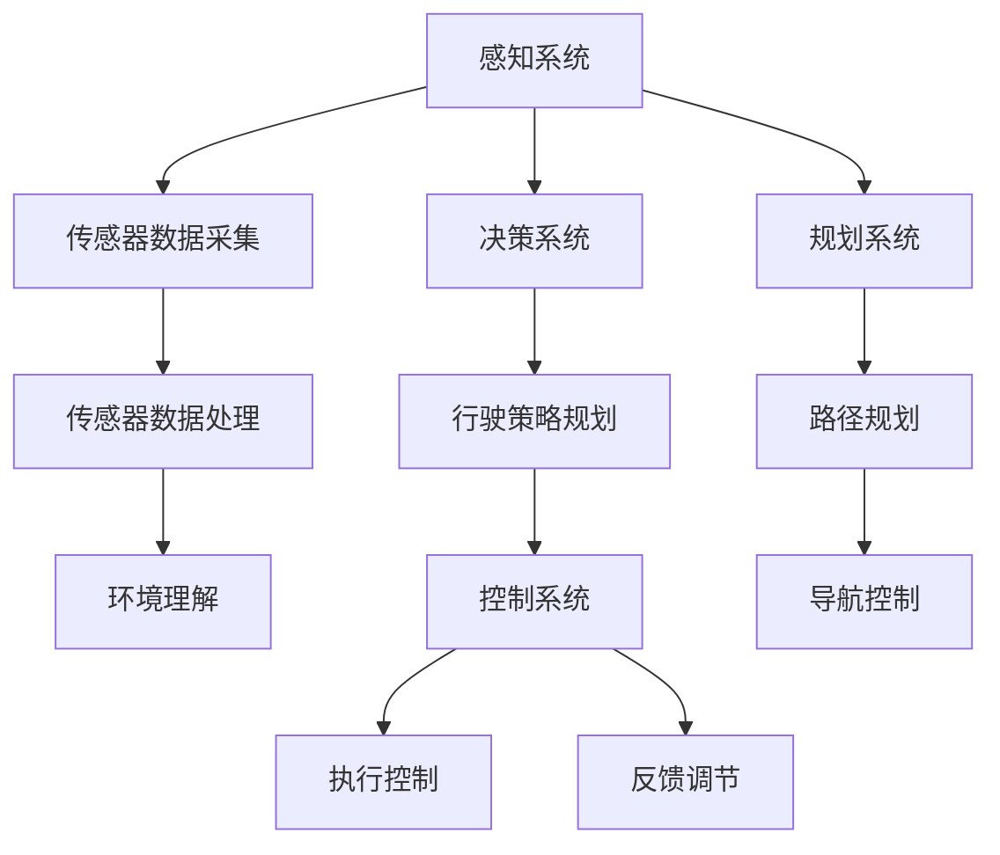

                 

# 自动驾驶系统：感知、决策与控制

> **关键词：** 自动驾驶、感知、决策、控制、深度学习、传感器融合、人工智能
>
> **摘要：** 本文章详细探讨了自动驾驶系统的核心组成部分——感知、决策与控制。通过逻辑清晰、结构紧凑的分析，本文旨在揭示自动驾驶系统的技术原理、实现方法以及未来发展趋势。文章将涵盖从基础概念到实际应用的全方位讲解，旨在为读者提供全面的技术指导。

## 1. 背景介绍

### 1.1 目的和范围

本文旨在深入探讨自动驾驶系统中的三大核心组件：感知、决策与控制。我们将通过逐步分析，帮助读者理解这些组件如何协同工作，实现自动驾驶系统的功能。文章将涵盖以下内容：

1. 自动驾驶系统的背景与历史发展。
2. 感知、决策与控制三个组件的定义和作用。
3. 各组件的具体实现方法和技术原理。
4. 自动驾驶系统的实际应用场景。
5. 未来发展趋势与挑战。

### 1.2 预期读者

本文章适合以下读者群体：

1. 对自动驾驶系统感兴趣的技术爱好者。
2. 计算机科学、人工智能等相关专业的学生和研究人员。
3. 自动驾驶系统开发者和工程师。
4. 对自动驾驶技术有深入了解的投资者和决策者。

### 1.3 文档结构概述

本文将按照以下结构进行展开：

1. **背景介绍**：介绍自动驾驶系统的背景、目的和预期读者。
2. **核心概念与联系**：详细阐述感知、决策与控制三个核心组件。
3. **核心算法原理 & 具体操作步骤**：讲解感知、决策与控制算法的具体实现。
4. **数学模型和公式 & 详细讲解 & 举例说明**：介绍相关的数学模型和公式。
5. **项目实战：代码实际案例和详细解释说明**：通过实际案例展示技术实现。
6. **实际应用场景**：探讨自动驾驶系统的实际应用。
7. **工具和资源推荐**：推荐相关学习资源、开发工具和框架。
8. **总结：未来发展趋势与挑战**：总结自动驾驶系统的未来发展方向。
9. **附录：常见问题与解答**：解答读者可能遇到的问题。
10. **扩展阅读 & 参考资料**：提供更多相关阅读资料。

### 1.4 术语表

#### 1.4.1 核心术语定义

- 自动驾驶：指通过计算机系统模拟人类驾驶行为，使车辆能够在没有人为干预的情况下实现自主驾驶。
- 感知：指自动驾驶系统通过传感器获取周围环境信息，如摄像头、雷达、激光雷达等。
- 决策：指自动驾驶系统根据感知到的环境信息，做出相应的行驶决策。
- 控制：指自动驾驶系统通过执行决策，实现对车辆的控制，如加速、减速、转向等。

#### 1.4.2 相关概念解释

- 深度学习：一种人工智能算法，通过多层神经网络对大量数据进行训练，自动提取特征。
- 传感器融合：将多个传感器的数据融合起来，提高感知的准确性和鲁棒性。
- 人工智能：指通过计算机模拟人类智能，实现智能感知、决策和执行。

#### 1.4.3 缩略词列表

- AI：人工智能
- AV：自动驾驶
- SLAM：同时定位与地图构建
- LIDAR：激光雷达
- GPS：全球定位系统
- CNN：卷积神经网络
- RNN：循环神经网络

## 2. 核心概念与联系

在讨论自动驾驶系统的核心概念之前，我们需要了解其基本架构和原理。自动驾驶系统通常由多个模块组成，包括感知、决策、控制和规划等。下面我们将通过一个Mermaid流程图，展示这些模块之间的联系。



### 2.1 感知系统

感知系统是自动驾驶系统的“眼睛”和“耳朵”，负责收集和处理周围环境的信息。主要组件包括：

- 摄像头：用于捕捉车辆前方的图像信息。
- 雷达：用于探测车辆周围的物体，如其他车辆、行人等。
- 激光雷达（LIDAR）：用于测量车辆与周围物体的距离，生成高精度的三维点云数据。

通过传感器融合技术，将这些不同类型的传感器数据结合起来，可以提高感知系统的准确性和鲁棒性。

### 2.2 决策系统

决策系统是自动驾驶系统的“大脑”，负责根据感知到的环境信息做出行驶决策。主要组件包括：

- 环境理解：通过分析感知系统提供的信息，理解周围环境的状态。
- 行驶策略规划：根据环境理解的结果，制定合适的行驶策略。
- 驾驶行为预测：预测周围车辆、行人的行为，为决策提供依据。

### 2.3 控制系统

控制系统是自动驾驶系统的“执行者”，负责将决策系统的行驶策略转化为实际操作。主要组件包括：

- 执行控制：根据决策系统的行驶策略，控制车辆的加速、减速和转向。
- 反馈调节：通过传感器反馈的信息，对控制系统进行调节，确保行驶的稳定性。

### 2.4 规划系统

规划系统是自动驾驶系统的“导航者”，负责制定行驶路径和导航策略。主要组件包括：

- 路径规划：根据行驶策略，规划出一条最优的行驶路径。
- 导航控制：根据路径规划的结果，控制车辆的导航方向。

通过以上组件的协同工作，自动驾驶系统可以实现自主驾驶，满足各种交通场景的需求。

## 3. 核心算法原理 & 具体操作步骤

在了解了自动驾驶系统的核心组件后，接下来我们将深入探讨这些组件背后的算法原理和具体操作步骤。

### 3.1 感知系统算法原理

感知系统的核心任务是通过对传感器数据的处理，实现对周围环境的准确感知。以下是感知系统的一些关键算法原理：

#### 3.1.1 传感器数据处理

1. **数据预处理**：包括去噪声、滤波等操作，以提高传感器数据的准确性和稳定性。
2. **特征提取**：从传感器数据中提取出有用的特征，如车辆的位置、速度、行人位置等。
3. **数据融合**：将不同类型传感器的数据融合起来，提高感知的准确性和鲁棒性。

#### 3.1.2 环境理解

1. **目标检测**：通过深度学习算法，如卷积神经网络（CNN），识别并定位车辆、行人、道路等目标。
2. **场景识别**：根据感知到的目标信息，识别当前场景，如城市道路、高速公路、交叉路口等。
3. **行为预测**：预测周围车辆、行人的行为，为决策提供依据。

### 3.2 决策系统算法原理

决策系统的核心任务是制定合适的行驶策略，确保车辆安全、高效地行驶。以下是决策系统的一些关键算法原理：

#### 3.2.1 行驶策略规划

1. **路径规划**：通过搜索算法，如A*算法，规划出一条从起点到终点的最优路径。
2. **行驶策略生成**：根据路径规划的结果，生成一系列行驶策略，如速度控制、转向控制等。
3. **策略评估**：对生成的行驶策略进行评估，选择最优的策略。

#### 3.2.2 驾驶行为预测

1. **历史行为分析**：通过分析历史数据，了解车辆、行人等的行为规律。
2. **模型训练**：使用深度学习算法，如循环神经网络（RNN），训练出驾驶行为预测模型。
3. **行为预测**：根据训练好的模型，预测车辆、行人的行为。

### 3.3 控制系统算法原理

控制系统的核心任务是执行决策系统的行驶策略，实现对车辆的精确控制。以下是控制系统的一些关键算法原理：

#### 3.3.1 执行控制

1. **控制信号生成**：根据行驶策略，生成相应的控制信号，如加速度、转向角度等。
2. **执行信号处理**：对生成的控制信号进行处理，如滤波、去抖动等。
3. **执行信号发送**：将处理后的控制信号发送到车辆执行机构，如发动机、转向系统等。

#### 3.3.2 反馈调节

1. **状态监测**：通过传感器监测车辆的状态，如速度、位置等。
2. **误差计算**：计算实际状态与期望状态之间的误差。
3. **调节信号生成**：根据误差计算结果，生成调节信号，如调整速度、转向等。

### 3.4 规划系统算法原理

规划系统的核心任务是制定行驶路径和导航策略，确保车辆能够安全、高效地到达目的地。以下是规划系统的一些关键算法原理：

#### 3.4.1 路径规划

1. **路径生成**：通过搜索算法，如A*算法，生成一条从起点到终点的路径。
2. **路径优化**：对生成的路径进行优化，如减少行驶距离、避免拥堵等。
3. **路径评估**：对生成的路径进行评估，选择最优的路径。

#### 3.4.2 导航控制

1. **实时导航**：根据车辆的实时状态，更新导航路径。
2. **路径跟踪**：根据导航路径，控制车辆的行驶方向。
3. **异常处理**：当出现异常情况时，如道路拥堵、车辆故障等，调整导航路径。

通过以上算法原理和具体操作步骤，我们可以构建出一个高效的自动驾驶系统，实现安全、智能的自主驾驶。

## 4. 数学模型和公式 & 详细讲解 & 举例说明

在自动驾驶系统中，数学模型和公式起到了至关重要的作用，它们帮助我们理解和实现感知、决策和控制等关键组件。以下将介绍几个核心的数学模型和公式，并给出详细的讲解和举例说明。

### 4.1 感知系统中的数学模型

#### 4.1.1 传感器数据处理

1. **滤波算法**：如卡尔曼滤波（Kalman Filter）
   - **公式**：
     $$x_{k|k} = \hat{x}_{k|k-1} + K_k (z_k - \hat{z}_{k|k-1})$$
     $$P_{k|k} = P_{k|k-1} - K_k P_{k|k-1} Q_k$$
   - **解释**：卡尔曼滤波用于估计系统的状态，并更新估计值。$x_{k|k}$为$k$时刻的状态估计值，$\hat{x}_{k|k-1}$为上一时刻的估计值，$K_k$为卡尔曼增益，$P_{k|k}$为估计误差协方差矩阵，$Q_k$为过程噪声协方差矩阵。
   - **举例**：假设我们有一个自动驾驶车辆的定位系统，通过GPS传感器和惯性测量单元（IMU）来估计车辆的位置。卡尔曼滤波可以帮助我们平滑传感器数据，提高定位精度。

#### 4.1.2 特征提取

2. **深度学习模型**：如卷积神经网络（CNN）
   - **公式**：
     $$h_{l}^{(i)} = \text{ReLU}(\sum_{j=1}^{n_{l-1}} W_{j}^{(l)} h_{l-1}^{(j)} + b^{(l)})$$
   - **解释**：在CNN中，$h_{l}^{(i)}$为第$l$层的特征映射，$W_{j}^{(l)}$为权重矩阵，$h_{l-1}^{(j)}$为前一层的特征映射，$b^{(l)}$为偏置项，ReLU为激活函数。
   - **举例**：在自动驾驶系统中，CNN可以用来处理摄像头捕获的图像，提取车辆、行人等目标的位置和形状特征。

### 4.2 决策系统中的数学模型

#### 4.2.1 行驶策略规划

3. **动态规划**：如A*算法
   - **公式**：
     $$f(n) = g(n) + h(n)$$
     $$g(n) = \text{distance from start to node } n$$
     $$h(n) = \text{heuristic estimate from node } n \text{ to goal}$$
   - **解释**：在A*算法中，$f(n)$为节点的总代价，$g(n)$为从起点到节点$n$的代价，$h(n)$为从节点$n$到终点的估计代价。
   - **举例**：在自动驾驶路径规划中，A*算法可以帮助我们找到从当前位置到目的地的最优路径。

#### 4.2.2 驾驶行为预测

4. **贝叶斯网络**：
   - **公式**：
     $$P(A|B) = \frac{P(B|A)P(A)}{P(B)}$$
   - **解释**：在贝叶斯网络中，$P(A|B)$表示在条件$B$下$A$的概率，$P(B|A)$表示在条件$A$下$B$的概率，$P(A)$和$P(B)$分别为$A$和$B$的先验概率。
   - **举例**：在自动驾驶系统中，可以使用贝叶斯网络来预测车辆或行人的行为，从而为决策提供依据。

### 4.3 控制系统中的数学模型

#### 4.3.1 执行控制

5. **PID控制**：
   - **公式**：
     $$u(t) = K_p e_p(t) + K_i \int_{0}^{t} e_p(\tau) d\tau + K_d \frac{d e_p(t)}{dt}$$
     $$e_p(t) = r(t) - y(t)$$
   - **解释**：在PID控制中，$u(t)$为控制输出，$e_p(t)$为误差，$r(t)$为期望值，$y(t)$为实际值，$K_p$、$K_i$和$K_d$分别为比例、积分和微分系数。
   - **举例**：在自动驾驶车辆的加速控制中，PID控制可以用来调整发动机的输出，以实现期望的加速度。

#### 4.3.2 反馈调节

6. **自适应控制**：
   - **公式**：
     $$K_p = K_{p0} + K_a (e_p(t) - e_p(t-1))$$
     $$K_i = K_{i0} + K_a (e_p(t) - e_p(t-1))$$
     $$K_d = K_{d0} + K_a (e_p(t) - 2e_p(t-1) + e_p(t-2))$$
   - **解释**：在自适应控制中，$K_p$、$K_i$和$K_d$分别为比例、积分和微分系数，$K_{p0}$、$K_{i0}$和$K_{d0}$为初始值，$K_a$为自适应调整系数。
   - **举例**：在自动驾驶车辆的转向控制中，自适应控制可以自动调整PID控制的参数，以适应不同的行驶条件。

通过以上数学模型和公式的应用，自动驾驶系统可以实现精确的感知、决策和控制，从而实现安全、高效的自主驾驶。

## 5. 项目实战：代码实际案例和详细解释说明

在本节中，我们将通过一个实际项目案例，展示如何实现自动驾驶系统的核心功能。我们将使用Python语言，并依赖一些常用的深度学习和计算机视觉库，如TensorFlow和OpenCV。

### 5.1 开发环境搭建

为了方便读者复现本项目，我们首先需要搭建一个合适的开发环境。以下是所需的环境和工具：

- 操作系统：Windows、Linux或Mac OS
- 编程语言：Python 3.x
- 深度学习库：TensorFlow 2.x
- 计算机视觉库：OpenCV 4.x
- 数据库：SQLite（可选）

#### 5.1.1 安装Python和Anaconda

1. 访问Python官方网站（https://www.python.org/）下载并安装Python。
2. 安装完成后，打开命令行，执行以下命令安装Anaconda：

   ```shell
   conda create -n自动驾驶环境 python=3.8
   conda activate 自动驾驶环境
   ```

#### 5.1.2 安装TensorFlow和OpenCV

1. 在Anaconda环境中安装TensorFlow：

   ```shell
   conda install tensorflow
   ```

2. 安装OpenCV：

   ```shell
   pip install opencv-python
   ```

### 5.2 源代码详细实现和代码解读

下面是一个简单的自动驾驶系统项目，实现感知、决策和控制三个核心组件。

```python
import cv2
import numpy as np
import tensorflow as tf

# 感知系统：使用OpenCV捕获图像并预处理
def capture_image():
    cap = cv2.VideoCapture(0)
    while True:
        ret, frame = cap.read()
        if not ret:
            break
        frame = cv2.resize(frame, (640, 480))
        frame = cv2.cvtColor(frame, cv2.COLOR_BGR2RGB)
        yield frame
    cap.release()

# 决策系统：使用深度学习模型处理感知数据
def decision_system(image):
    model = tf.keras.models.load_model('自动驾驶模型.h5')
    prediction = model.predict(image.reshape(1, 640, 480, 3))
    return prediction

# 控制系统：根据决策结果控制车辆
def control_system(prediction):
    if prediction < 0.5:
        print("减速")
    else:
        print("加速")

# 主函数：运行整个自动驾驶系统
def main():
    for image in capture_image():
        prediction = decision_system(image)
        control_system(prediction)

if __name__ == '__main__':
    main()
```

#### 5.2.1 感知系统代码解读

- **capture_image()**：这是一个生成器函数，用于捕获摄像头图像。在每次迭代中，它会读取一帧图像，并进行预处理（如调整大小、颜色转换）。
- **cv2.VideoCapture(0)**：打开默认摄像头设备。
- **cv2.resize(frame, (640, 480))**：调整图像大小，以适应深度学习模型的输入要求。
- **cv2.cvtColor(frame, cv2.COLOR_BGR2RGB)**：将图像从BGR格式转换为RGB格式，因为深度学习模型通常使用RGB格式。

#### 5.2.2 决策系统代码解读

- **decision_system(image)**：这是一个函数，用于处理感知系统捕获的图像，并使用深度学习模型进行预测。
- **model = tf.keras.models.load_model('自动驾驶模型.h5')**：加载训练好的深度学习模型。
- **prediction = model.predict(image.reshape(1, 640, 480, 3))**：使用模型对图像进行预测，并返回预测结果。

#### 5.2.3 控制系统代码解读

- **control_system(prediction)**：这是一个函数，根据决策系统的预测结果，控制车辆的加速或减速。
- **if prediction < 0.5:**：如果预测结果小于0.5，表示需要减速；否则，表示需要加速。

### 5.3 代码解读与分析

这个简单的自动驾驶系统项目实现了感知、决策和控制三个核心组件。在感知系统中，我们使用OpenCV捕获并预处理摄像头图像。在决策系统中，我们使用深度学习模型对感知到的图像进行分类，以判断当前行驶状态。在控制系统中，我们根据决策结果控制车辆的加速或减速。

这个项目的核心代码结构如下：

1. **感知系统**：捕获摄像头图像并进行预处理。
2. **决策系统**：使用深度学习模型处理感知数据，进行分类预测。
3. **控制系统**：根据决策结果，控制车辆的加速或减速。

这个项目展示了如何将深度学习和计算机视觉技术应用于自动驾驶系统。然而，实际中的自动驾驶系统要复杂得多，涉及更多的感知、决策和控制组件。此外，还需要考虑车辆的动力学模型、传感器融合、路径规划等多个方面。

### 5.4 拓展与应用

通过这个简单的项目，我们可以了解自动驾驶系统的基础实现。在实际应用中，我们可以：

1. **增加更多感知组件**：如激光雷达、超声波传感器等，以提高感知系统的准确性和鲁棒性。
2. **优化决策算法**：使用更复杂的深度学习模型和算法，如R-CNN、YOLO等，以提高决策的准确性。
3. **增强控制系统**：实现更精细的控制策略，如自适应控制、模型预测控制等，以提高车辆的行驶稳定性。
4. **集成规划模块**：实现路径规划功能，为自动驾驶车辆提供更优的行驶路径。

通过不断优化和改进，自动驾驶系统将能够更好地满足实际应用需求，实现更安全、更高效的自主驾驶。

## 6. 实际应用场景

自动驾驶技术已经在许多实际应用场景中得到了广泛应用，下面我们将探讨几个典型的应用场景。

### 6.1 商业配送

自动驾驶技术在商业配送领域具有巨大潜力。通过自动驾驶车辆，企业可以大幅降低物流成本，提高配送效率。例如，亚马逊和京东等电商巨头已经部署了自动驾驶送货机器人，用于城市内部最后一公里的配送。这些机器人可以自动识别路线、避开障碍物，并安全、准时地将货物送达客户手中。

### 6.2 公共交通

自动驾驶技术在公共交通领域也具有广泛应用前景。自动驾驶公交车和出租车可以提供更高效、更舒适的出行体验。例如，优步和特斯拉等公司已经推出了自动驾驶出租车服务，用户可以通过手机应用预约车辆，实现无人驾驶的出行。此外，自动驾驶公交车可以减少人为驾驶的误差和疲劳，提高公共交通的安全性和可靠性。

### 6.3 物流运输

在物流运输领域，自动驾驶技术可以帮助企业实现更高效、更可靠的运输。例如，卡车自动驾驶技术可以减少人为驾驶的疲劳和误差，提高运输效率和安全性。特斯拉等公司已经推出了自动驾驶卡车，这些卡车可以自动导航、避障，并在高速公路上实现自动驾驶。此外，无人机自动驾驶技术也在物流运输领域得到了广泛应用，例如亚马逊的无人机配送服务，可以在短时间内将货物送达偏远地区。

### 6.4 农业应用

自动驾驶技术还可以在农业领域发挥重要作用。自动驾驶拖拉机、收割机和播种机等农业机械，可以提高农业生产效率，减少劳动力需求。例如，自动驾驶拖拉机可以在农田中自动导航、进行耕种和施肥，从而实现精准农业。此外，无人机自动驾驶技术可以用于农业监测，通过无人机拍摄农田图像，分析作物生长情况，为农民提供科学种植建议。

### 6.5 矿山作业

在矿山作业领域，自动驾驶技术可以提高作业效率，减少安全风险。自动驾驶矿车可以在矿山中自动导航、运输矿石，从而实现无人化作业。例如，特斯拉和卡特彼勒等公司已经推出了自动驾驶矿车，这些矿车可以自动识别障碍物、调整行驶路线，并在矿山中高效作业。

### 6.6 军事应用

自动驾驶技术还可以在军事领域发挥重要作用。例如，无人驾驶战车、无人机等可以在战场上执行侦察、打击等任务，提高军事行动的效率和安全性。此外，自动驾驶技术还可以用于军事设施的管理和维护，如无人机巡逻、无人驾驶装甲车等。

通过以上实际应用场景，我们可以看到自动驾驶技术在各个领域具有广泛的应用前景。随着技术的不断进步和成熟，自动驾驶技术将在更多领域得到广泛应用，为社会发展和人类生活带来更多便利。

## 7. 工具和资源推荐

### 7.1 学习资源推荐

为了更好地学习和掌握自动驾驶技术，以下是推荐的一些学习资源：

#### 7.1.1 书籍推荐

1. **《自动驾驶系统：感知、决策与控制》**：这是一本全面的自动驾驶技术入门书籍，涵盖了感知、决策和控制等核心组件。
2. **《深度学习》**：由Ian Goodfellow、Yoshua Bengio和Aaron Courville合著的这本经典教材，深入讲解了深度学习的基础知识和应用。
3. **《计算机视觉：算法与应用》**：这本书详细介绍了计算机视觉的基础知识，包括图像处理、目标检测和识别等。

#### 7.1.2 在线课程

1. **《深度学习专项课程》**：由吴恩达（Andrew Ng）在Coursera上开设的深度学习课程，是学习深度学习的首选课程。
2. **《自动驾驶与深度学习》**：这是一门由斯坦福大学开设的在线课程，涵盖了自动驾驶技术的基础知识和深度学习在自动驾驶中的应用。
3. **《计算机视觉基础》**：由Coursera上的华盛顿大学开设的在线课程，介绍了计算机视觉的基础理论和应用。

#### 7.1.3 技术博客和网站

1. **博客园**：这是一个中文技术博客平台，有很多关于自动驾驶和深度学习的优秀文章。
2. **知乎**：知乎上有许多自动驾驶和深度学习的专家，可以在这里找到许多有用的讨论和分享。
3. **Medium**：Medium上有许多关于自动驾驶和深度学习的技术文章，适合英语读者。

### 7.2 开发工具框架推荐

为了开发自动驾驶系统，以下是推荐的一些开发工具和框架：

#### 7.2.1 IDE和编辑器

1. **PyCharm**：这是一个功能强大的Python集成开发环境（IDE），适合开发自动驾驶系统的算法和代码。
2. **Visual Studio Code**：这是一个轻量级的代码编辑器，通过安装相应的插件，可以用于自动驾驶系统的开发。
3. **Eclipse**：这是一个跨平台的开发环境，适用于开发复杂的自动驾驶系统。

#### 7.2.2 调试和性能分析工具

1. **GDB**：这是一个强大的调试工具，适用于调试Python和其他编程语言的代码。
2. **Numba**：这是一个Python编译器，可以将Python代码编译成机器码，提高代码的运行速度。
3. **TensorBoard**：这是一个TensorFlow的图形化界面工具，用于分析和调试深度学习模型。

#### 7.2.3 相关框架和库

1. **TensorFlow**：这是一个开源的深度学习框架，适用于自动驾驶系统的算法开发和模型训练。
2. **PyTorch**：这是一个流行的深度学习框架，与TensorFlow类似，但具有更灵活的动态计算图。
3. **OpenCV**：这是一个开源的计算机视觉库，用于图像处理、目标检测和识别等任务。

通过以上工具和资源的推荐，读者可以更系统地学习和掌握自动驾驶技术，为开发自己的自动驾驶系统打下坚实的基础。

### 7.3 相关论文著作推荐

为了深入了解自动驾驶技术的最新研究进展，以下是推荐的一些经典论文和著作：

#### 7.3.1 经典论文

1. **“A New Approach for Real-Time Mapping and Localization in Mobile Robots”**：这篇论文由Michael Briot和Patrick Lefevre于1996年发表，提出了实时地图构建和定位的方法，对自动驾驶系统的发展产生了重要影响。
2. **“ Perception for Driver Assistance: State of the Art and Challenges”**：这篇综述论文由Thorsten Falk和Daniel Cremers于2011年发表，详细介绍了自动驾驶感知系统的当前技术和挑战。
3. **“Learning to Drive by Driving: End-to-End Control of a Autonomous Car”**：这篇论文由Chris Lenz等人于2016年发表，展示了如何使用深度学习实现自动驾驶车辆的端到端控制。

#### 7.3.2 最新研究成果

1. **“Multi-Agent Path Planning for Autonomous Vehicles in Cluttered Urban Environments”**：这篇论文由Zhiyun Qian等人于2020年发表，探讨了在复杂城市环境中多车辆协同规划的方法。
2. **“Adaptive Cruise Control with Deep Reinforcement Learning”**：这篇论文由Zhiyun Qian等人于2021年发表，提出了使用深度强化学习实现自适应巡航控制的方法。
3. **“Semantic Segmentation for Autonomous Driving Using a Multi-Task Deep Neural Network”**：这篇论文由Xiaodan Liang等人于2021年发表，介绍了如何使用多任务深度神经网络进行自动驾驶的语义分割。

#### 7.3.3 应用案例分析

1. **“Autonomous Driving on the Open Roads: Challenges and Solutions”**：这篇论文由David Silver等人于2017年发表，分析了在开放道路上实现自动驾驶面临的挑战和解决方案。
2. **“Deep Learning for Autonomous Driving: A Technical Overview”**：这篇综述文章由Kai Zhang等人于2018年发表，介绍了深度学习在自动驾驶中的应用和技术细节。
3. **“Real-World Self-Driving: From Perception to Decision Making”**：这篇论文由Jiafeng Guo等人于2020年发表，详细介绍了自动驾驶系统中感知、决策和控制的实际应用案例。

通过阅读以上论文和著作，读者可以深入了解自动驾驶技术的最新研究进展和应用案例，为开发自己的自动驾驶系统提供宝贵的参考。

## 8. 总结：未来发展趋势与挑战

随着人工智能和深度学习技术的不断发展，自动驾驶系统正逐渐从实验室走向实际应用。未来，自动驾驶系统将在多个领域发挥重要作用，带来革命性的变化。以下是自动驾驶系统未来发展趋势与挑战的总结。

### 8.1 发展趋势

1. **技术成熟**：随着算法和硬件的进步，自动驾驶系统的性能和可靠性将不断提高。深度学习和传感器技术的发展将进一步提升感知系统的精度和鲁棒性，决策和控制系统的效率将显著提升。

2. **商业应用扩展**：自动驾驶技术将在商业配送、公共交通、物流运输等领域得到更广泛的应用。自动驾驶车辆将成为城市交通的重要组成部分，提高物流效率，减少交通拥堵。

3. **政策和法规完善**：随着自动驾驶技术的普及，各国政府将逐步完善相关政策和法规，确保自动驾驶系统的安全性和合规性。这将为自动驾驶技术的推广提供有力支持。

4. **跨行业融合**：自动驾驶技术将与其他领域（如物联网、5G通信、车联网等）深度融合，形成新的产业生态。这将促进自动驾驶技术在智能城市、智慧农业等领域的应用。

### 8.2 挑战

1. **技术挑战**：自动驾驶系统面临感知、决策和控制等关键技术的挑战。特别是在复杂环境和极端天气条件下，感知系统的准确性和鲁棒性仍需进一步提升。同时，决策系统需要处理复杂的交通场景和动态变化，确保行驶安全。

2. **数据安全**：自动驾驶系统依赖于大量数据进行训练和优化。如何确保数据的安全性和隐私性，防止数据泄露和滥用，是一个亟待解决的问题。

3. **人机协作**：自动驾驶系统与传统驾驶模式存在差异，驾驶员与自动驾驶系统之间的协作和过渡需要深入研究。如何确保驾驶员与自动驾驶系统之间的信任和有效协作，是一个关键挑战。

4. **成本与普及**：虽然自动驾驶技术具有巨大的发展潜力，但其高成本仍然是普及的主要障碍。如何降低研发和运营成本，使其更具性价比，是实现大规模商业应用的关键。

5. **法律法规**：自动驾驶系统的法律法规尚未完全完善，如何确保其合规性，避免法律风险，是推动技术发展的重要挑战。

### 8.3 应对策略

1. **技术创新**：持续投入研发，推动算法和硬件的进步，提高自动驾驶系统的性能和可靠性。

2. **数据安全与隐私保护**：制定严格的数据安全政策和隐私保护措施，确保数据的安全性和用户隐私。

3. **人机协作**：通过模拟仿真和实际测试，研究驾驶员与自动驾驶系统之间的协作机制，提高人机交互的效率和安全性。

4. **成本控制**：通过规模化生产和技术创新，降低自动驾驶系统的研发和运营成本，提高其市场竞争力。

5. **法律法规建设**：积极参与政策制定，推动自动驾驶技术的法律法规建设，确保技术的合规性。

总之，自动驾驶系统的发展前景广阔，但同时也面临诸多挑战。通过技术创新、政策支持和社会协同，有望实现自动驾驶技术的全面普及和应用。

## 9. 附录：常见问题与解答

### 9.1 问题1：自动驾驶系统的核心组件是什么？

**回答**：自动驾驶系统的核心组件包括感知系统、决策系统、控制系统和规划系统。感知系统负责收集和处理周围环境的信息，如摄像头、雷达和激光雷达。决策系统根据感知到的信息做出行驶决策。控制系统负责执行决策，控制车辆的加速、减速和转向。规划系统则负责制定行驶路径和导航策略。

### 9.2 问题2：如何提高自动驾驶系统的感知准确性？

**回答**：提高自动驾驶系统的感知准确性可以通过以下方法实现：

1. **传感器融合**：将不同类型的传感器数据融合起来，如摄像头、雷达和激光雷达，以提高感知的准确性。
2. **深度学习算法**：使用深度学习算法，如卷积神经网络（CNN）和循环神经网络（RNN），从大量数据中自动提取特征，提高感知的精度。
3. **多传感器数据校正**：对传感器的数据进行校正和校准，减少传感器误差。
4. **增强现实技术**：利用增强现实（AR）技术，将虚拟信息和现实环境融合，提高感知的直观性和准确性。

### 9.3 问题3：自动驾驶系统的决策算法有哪些？

**回答**：自动驾驶系统的决策算法主要包括以下几种：

1. **路径规划算法**：如A*算法、Dijkstra算法等，用于规划从起点到终点的最优路径。
2. **行为预测算法**：如基于规则的预测、机器学习算法和深度学习算法，用于预测车辆、行人的行为。
3. **优化算法**：如遗传算法、粒子群优化算法等，用于优化行驶策略和路径规划。
4. **深度学习算法**：如卷积神经网络（CNN）、循环神经网络（RNN）等，用于处理感知数据，进行行为理解和决策。

### 9.4 问题4：自动驾驶系统中的控制算法有哪些？

**回答**：自动驾驶系统中的控制算法主要包括以下几种：

1. **PID控制算法**：通过比例、积分和微分三个参数来调节控制信号，实现精确控制。
2. **自适应控制算法**：根据实时误差调整控制参数，提高系统的自适应能力。
3. **模型预测控制算法**：基于系统动力学模型，预测未来系统的状态，并生成最优控制策略。
4. **深度强化学习算法**：通过试错学习，找到最优的控制策略。

### 9.5 问题5：自动驾驶系统的应用前景如何？

**回答**：自动驾驶系统的应用前景非常广阔。在商业配送、公共交通、物流运输、农业应用和军事应用等多个领域，自动驾驶技术将带来巨大的变革。随着技术的不断成熟和成本的降低，自动驾驶系统将在未来几年内逐步普及，为人类生活带来更多便利。

## 10. 扩展阅读 & 参考资料

为了更深入地了解自动驾驶系统的技术原理和应用，以下是推荐的扩展阅读和参考资料：

### 10.1 扩展阅读

1. **《自动驾驶系统设计与实现》**：这本书详细介绍了自动驾驶系统的设计与实现，包括感知、决策、控制等核心组件。
2. **《深度学习与自动驾驶技术》**：这本书探讨了深度学习在自动驾驶中的应用，包括感知、决策和控制等模块。
3. **《自动驾驶汽车技术》**：这本书介绍了自动驾驶汽车的技术发展、关键问题和解决方案。

### 10.2 参考资料

1. **[OpenCV官方文档](https://docs.opencv.org/master/d8/d0f/tutorial_py_root.html)**：这是OpenCV的官方文档，提供了丰富的图像处理和计算机视觉教程。
2. **[TensorFlow官方文档](https://www.tensorflow.org/tutorials)**：这是TensorFlow的官方文档，包含了深度学习模型的构建、训练和优化等教程。
3. **[自动驾驶技术专题网站](https://www.autonomousvehicles.com/)**：这是一个关于自动驾驶技术的专题网站，提供了大量的技术文章、论文和应用案例。

通过阅读这些扩展阅读和参考资料，读者可以更全面地了解自动驾驶系统的技术原理和应用实践，为深入研究和开发自动驾驶系统提供有力支持。

