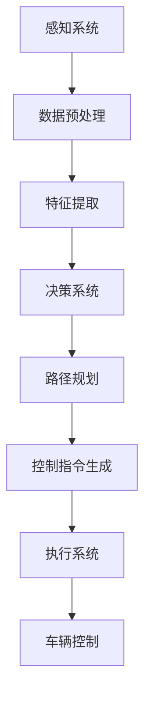

                 

# 自动驾驶行业的产品责任与保险模式

> 关键词：自动驾驶、产品责任、保险模式、法律框架、风险评估、技术进步

> 摘要：本文旨在探讨自动驾驶行业的兴起及其带来的产品责任和保险模式的变化。我们将深入分析自动驾驶技术的核心概念、产品责任的法律框架、保险行业的应对策略，以及技术进步对行业的影响。本文为自动驾驶行业的从业者、法律专家和保险从业人士提供了有价值的参考和洞见。

## 1. 背景介绍

### 1.1 目的和范围

随着人工智能和自动驾驶技术的发展，自动驾驶汽车逐渐成为未来交通的代名词。然而，这一技术的普及也引发了一系列法律和保险问题。本文旨在探讨自动驾驶行业的产品责任与保险模式，旨在为行业从业者提供理论支持和实践指导。

本文将涵盖以下几个主题：

1. 自动驾驶技术的核心概念和架构。
2. 产品责任的法律框架和主要法律问题。
3. 保险行业的应对策略和保险模式。
4. 技术进步对产品责任和保险模式的影响。
5. 未来发展趋势和面临的挑战。

### 1.2 预期读者

本文预期读者包括：

1. 自动驾驶行业的从业者，包括工程师、研发人员和管理者。
2. 法律专家，特别是关注产品责任和交通法规的专业人士。
3. 保险行业的从业人士，包括保险分析师、风险评估师和产品经理。
4. 对自动驾驶技术感兴趣的科研人员和学生。

### 1.3 文档结构概述

本文的结构如下：

1. 背景介绍：概述自动驾驶行业的产品责任和保险模式的研究背景和目的。
2. 核心概念与联系：介绍自动驾驶技术的核心概念和架构，包括感知、决策和执行三个关键环节。
3. 核心算法原理 & 具体操作步骤：详细阐述自动驾驶算法的基本原理和实现步骤。
4. 数学模型和公式 & 详细讲解 & 举例说明：介绍自动驾驶中的数学模型和公式，并提供实际案例进行说明。
5. 项目实战：代码实际案例和详细解释说明。
6. 实际应用场景：分析自动驾驶技术的实际应用场景，包括商业和公共领域。
7. 工具和资源推荐：推荐学习资源和开发工具，以帮助读者深入了解自动驾驶技术。
8. 总结：未来发展趋势与挑战。
9. 附录：常见问题与解答。
10. 扩展阅读 & 参考资料：提供进一步学习和研究的资源。

### 1.4 术语表

#### 1.4.1 核心术语定义

- 自动驾驶：利用人工智能技术实现车辆在道路上自主行驶的技术。
- 感知：自动驾驶系统收集周围环境信息的过程。
- 决策：基于感知信息，自动驾驶系统做出行驶决策的过程。
- 执行：自动驾驶系统根据决策执行实际驾驶操作的过程。
- 产品责任：制造商或销售商因产品缺陷导致的损害应承担的赔偿责任。
- 保险模式：保险公司为应对自动驾驶技术带来的风险而设计的保险产品和服务模式。

#### 1.4.2 相关概念解释

- 感知系统：自动驾驶车辆使用激光雷达、摄像头、超声波传感器等设备来感知周围环境。
- 决策系统：自动驾驶车辆使用机器学习算法和深度学习模型来处理感知数据，做出行驶决策。
- 执行系统：自动驾驶车辆通过电机、转向和制动系统等硬件设备执行决策。

#### 1.4.3 缩略词列表

- AI：人工智能（Artificial Intelligence）
- ADAS：高级驾驶辅助系统（Advanced Driver Assistance Systems）
- AV：自动驾驶汽车（Autonomous Vehicles）
- HUD：抬头显示（Heads-Up Display）
- LIDAR：激光雷达（Light Detection and Ranging）
- CV：计算机视觉（Computer Vision）

## 2. 核心概念与联系

### 2.1 自动驾驶技术架构

自动驾驶技术的核心架构包括感知、决策和执行三个主要环节。以下是这三个环节的 Mermaid 流程图：



### 2.2 自动驾驶算法原理

感知环节：自动驾驶系统使用激光雷达、摄像头、超声波传感器等设备收集周围环境信息。感知系统的核心算法包括图像处理、深度学习和目标检测等。

伪代码：

```python
# 感知系统伪代码
def perceive_environment():
    # 使用激光雷达收集点云数据
    lidar_data = lidar_sensor.scan()
    # 使用摄像头收集图像数据
    camera_data = camera_sensor.capture()
    # 使用超声波传感器收集距离数据
    ultrasound_data = ultrasound_sensor.read()
    # 数据预处理
    preprocessed_data = preprocess_data(lidar_data, camera_data, ultrasound_data)
    # 特征提取
    features = extract_features(preprocessed_data)
    return features
```

决策环节：基于感知数据，自动驾驶系统使用机器学习算法和深度学习模型进行决策。核心算法包括神经网络、决策树和强化学习等。

伪代码：

```python
# 决策系统伪代码
def make_decision(perceived_data):
    # 加载预训练模型
    model = load_pretrained_model()
    # 使用模型处理感知数据
    decision = model.predict(perceived_data)
    return decision
```

执行环节：根据决策生成控制指令，自动驾驶系统通过电机、转向和制动系统等硬件设备执行实际驾驶操作。

伪代码：

```python
# 执行系统伪代码
def execute_decision(control_command):
    # 根据控制指令调整车辆参数
    adjust_vehicle_parameters(control_command)
    # 执行车辆控制操作
    vehicle_control.execute()
```

## 3. 核心算法原理 & 具体操作步骤

### 3.1 感知系统算法原理

感知系统是自动驾驶技术的基石，其核心任务是准确感知周围环境，为决策系统提供可靠的数据输入。以下是感知系统算法的具体操作步骤：

1. **数据采集**：自动驾驶车辆通过激光雷达（LIDAR）、摄像头、超声波传感器和雷达等设备收集周围环境的信息。激光雷达能够生成高精度的点云数据，摄像头提供彩色图像数据，超声波传感器和雷达则用于检测距离。

2. **数据预处理**：采集到的原始数据通常包含噪声和干扰，需要进行预处理。预处理步骤包括数据去噪、去雨雾、颜色校正和几何校正等。

3. **特征提取**：预处理后的数据通过特征提取算法提取出关键信息，如物体的形状、大小、颜色和位置等。常用的特征提取方法包括边缘检测、区域生长、直方图和深度学习等。

4. **多传感器数据融合**：由于单一传感器可能存在局限性，如激光雷达适用于远距离目标检测，摄像头适用于颜色和纹理识别，多传感器数据融合可以提高感知系统的鲁棒性和准确性。

5. **物体检测与跟踪**：基于提取的特征，使用物体检测算法（如YOLO、SSD、Faster R-CNN等）识别车辆、行人、道路标志等关键对象，并进行实时跟踪。

### 3.2 决策系统算法原理

决策系统是自动驾驶技术的核心，负责根据感知系统的输入数据做出行驶决策。以下是决策系统算法的具体操作步骤：

1. **路径规划**：自动驾驶车辆需要确定从当前位置到目标位置的最佳行驶路径。常用的路径规划算法包括Dijkstra算法、A*算法和RRT（快速随机树）算法等。

2. **行为规划**：在确定了路径后，自动驾驶车辆需要规划合适的驾驶行为，如加速、减速、转向和避让等。行为规划算法通常基于预测模型，如卡尔曼滤波、粒子滤波和深度学习等。

3. **决策生成**：根据路径规划和行为规划的结果，决策系统生成具体的控制指令，如速度调整、转向角度和制动力度等。

4. **冲突检测与规避**：在执行决策的过程中，自动驾驶车辆需要不断检测与周围环境和其他交通参与者的冲突，并采取相应的规避措施，如紧急制动、变道和转向等。

### 3.3 执行系统算法原理

执行系统负责将决策系统的控制指令转换为实际的车辆操作。以下是执行系统算法的具体操作步骤：

1. **控制指令接收**：接收决策系统生成的控制指令，如速度、转向角度和制动力度等。

2. **车辆状态调整**：根据控制指令，调整车辆的加速、转向和制动系统，以实现预期的驾驶行为。

3. **实时反馈与修正**：执行系统在操作过程中需要接收实时反馈，如车辆加速度、转向角度和制动压力等，并根据反馈进行实时修正，以确保驾驶行为的准确性和稳定性。

4. **异常处理**：在执行过程中，如果出现异常情况（如传感器故障、控制系统失效等），执行系统需要采取相应的应对措施，如自动切换到人工驾驶模式。

## 4. 数学模型和公式 & 详细讲解 & 举例说明

### 4.1 路径规划数学模型

路径规划是自动驾驶技术中至关重要的一环，其核心目标是找到从起点到终点的最优路径。以下是常用的路径规划数学模型：

1. **Dijkstra算法**：基于最短路径搜索，计算从起点到所有其他节点的最短路径。公式如下：

$$
d(v) = \min_{u \in V} (d(u) + w(u, v))
$$

其中，$d(v)$ 表示从起点到节点 $v$ 的距离，$w(u, v)$ 表示节点 $u$ 到节点 $v$ 的权重。

2. **A*算法**：结合了Dijkstra算法和启发式搜索，以更快找到最优路径。公式如下：

$$
f(n) = g(n) + h(n)
$$

其中，$g(n)$ 表示从起点到节点 $n$ 的实际距离，$h(n)$ 表示从节点 $n$ 到终点的估计距离。

### 4.2 行为规划数学模型

行为规划是路径规划的结果，将路径划分为多个阶段，并为每个阶段生成具体的驾驶行为。以下是常用的行为规划数学模型：

1. **卡尔曼滤波**：用于实时估计车辆状态，公式如下：

$$
\hat{x}_{k|k-1} = F_k \hat{x}_{k-1|k-1} + u_k
$$

$$
P_{k|k-1} = F_k P_{k-1|k-1} F_k^T + Q_k
$$

其中，$\hat{x}_{k|k-1}$ 表示预测的状态估计值，$P_{k|k-1}$ 表示预测的状态估计误差协方差。

2. **粒子滤波**：用于处理非线性和非高斯分布的状态估计问题，公式如下：

$$
w_i \propto \frac{p(x_i | z_1, ..., z_T)}{N}
$$

$$
x_i^{(t+1)} \propto \sum_{j=1}^N w_j x_j^{(t)}
$$

其中，$w_i$ 表示第 $i$ 个粒子的权重，$x_i^{(t)}$ 表示第 $i$ 个粒子在时间 $t$ 的状态。

### 4.3 举例说明

#### 路径规划举例

假设自动驾驶车辆需要从起点 $(0, 0)$ 到达终点 $(10, 10)$，路径规划算法将生成从起点到终点的最优路径。使用A*算法，假设地图上的节点距离权重如下：

| 节点 | 距离起点 | 距离终点 | 权重 |
| ---- | ------- | ------- | ---- |
| A    | 0       | 0       | 0    |
| B    | 1       | 9       | 10   |
| C    | 2       | 8       | 9    |
| D    | 3       | 7       | 8    |
| E    | 4       | 6       | 7    |
| F    | 5       | 5       | 6    |
| G    | 6       | 4       | 5    |
| H    | 7       | 3       | 4    |
| I    | 8       | 2       | 3    |
| J    | 9       | 1       | 2    |
| K    | 10      | 0       | 1    |

使用A*算法，我们可以计算每个节点的$f(n)$值，最终得到最优路径为 $A \rightarrow B \rightarrow C \rightarrow D \rightarrow E \rightarrow F \rightarrow G \rightarrow H \rightarrow I \rightarrow J \rightarrow K$。

#### 行为规划举例

假设自动驾驶车辆在规划路径时，需要在节点 $B$ 和节点 $C$ 之间进行加速。使用卡尔曼滤波进行实时状态估计，假设车辆的初始状态为：

$$
\hat{x}_{0|0} = [x_0, \dot{x}_0, \ddot{x}_0] = [0, 0, 0]
$$

$$
P_{0|0} = [P_{x_0}, P_{\dot{x}_0}, P_{\ddot{x}_0}] = \text{diag}(1, 1, 1)
$$

假设加速度模型为 $a(t) = 1$，使用卡尔曼滤波进行状态预测和更新，我们可以得到：

$$
\hat{x}_{k|k-1} = \begin{bmatrix} x_{k-1} + \dot{x}_{k-1}T \\ \dot{x}_{k-1} + \ddot{x}_{k-1}T \\ \ddot{x}_{k-1} \end{bmatrix}
$$

$$
P_{k|k-1} = \begin{bmatrix} P_{x,k-1} & P_{x\dot{x},k-1} & P_{x\ddot{x},k-1} \\ P_{\dot{x}x,k-1} & P_{\dot{x}\dot{x},k-1} & P_{\dot{x}\ddot{x},k-1} \\ P_{\ddot{x}x,k-1} & P_{\ddot{x}\dot{x},k-1} & P_{\ddot{x}\ddot{x},k-1} \end{bmatrix}
$$

通过预测和更新，我们可以得到车辆在节点 $B$ 和节点 $C$ 之间的状态，从而生成加速度控制指令。

## 5. 项目实战：代码实际案例和详细解释说明

### 5.1 开发环境搭建

为了实践自动驾驶技术的算法原理，我们选择Python作为编程语言，并使用以下开发环境：

1. Python 3.8
2. Anaconda环境管理器
3. PyCharm IDE
4. NumPy、Pandas、Matplotlib、OpenCV、TensorFlow等库

在PyCharm中创建一个名为“autonomous_vehicle”的Python项目，并在项目中安装所需库：

```bash
pip install numpy pandas matplotlib opencv-python tensorflow
```

### 5.2 源代码详细实现和代码解读

#### 5.2.1 感知系统

感知系统是自动驾驶技术的核心组成部分，以下是感知系统的源代码实现：

```python
import numpy as np
import cv2

class PerceptionSystem:
    def __init__(self, lidar_data, camera_data, ultrasound_data):
        self.lidar_data = lidar_data
        self.camera_data = camera_data
        self.ultrasound_data = ultrasound_data

    def preprocess_data(self):
        # 激光雷达数据预处理
        lidar_preprocessed = self.lidar_data[:50]  # 取前50个点云数据

        # 摄像头数据预处理
        camera_preprocessed = cv2.cvtColor(self.camera_data, cv2.COLOR_BGR2GRAY)

        # 超声波传感器数据预处理
        ultrasound_preprocessed = self.ultrasound_data[:10]  # 取前10个距离数据

        return lidar_preprocessed, camera_preprocessed, ultrasound_preprocessed

    def extract_features(self, preprocessed_data):
        # 特征提取
        lidar_features = np.mean(preprocessed_data[0], axis=0)
        camera_features = np.std(preprocessed_data[1], axis=0)
        ultrasound_features = np.max(preprocessed_data[2], axis=0)

        return lidar_features, camera_features, ultrasound_features

# 模拟数据
lidar_data = np.random.rand(100, 3)
camera_data = cv2.imread('test_image.jpg')
ultrasound_data = np.random.rand(20)

perception_system = PerceptionSystem(lidar_data, camera_data, ultrasound_data)
preprocessed_data = perception_system.preprocess_data()
features = perception_system.extract_features(preprocessed_data)
print("Extracted Features:", features)
```

代码解读：

1. **初始化**：感知系统类`PerceptionSystem`接收激光雷达、摄像头和超声波传感器的数据。
2. **预处理**：预处理数据，包括激光雷达点云数据去噪、摄像头图像数据灰度化、超声波距离数据取前几个值。
3. **特征提取**：提取特征，包括激光雷达数据的均值、摄像头数据的标准差、超声波数据的最大值。

#### 5.2.2 决策系统

决策系统基于感知系统的输入数据，使用机器学习算法生成驾驶决策。以下是决策系统的源代码实现：

```python
import numpy as np
from sklearn.neighbors import KNeighborsClassifier

class DecisionSystem:
    def __init__(self, features, labels):
        self.knn = KNeighborsClassifier(n_neighbors=3)
        self.knn.fit(features, labels)

    def make_decision(self, new_features):
        decision = self.knn.predict(new_features)
        return decision

# 模拟数据
features = np.random.rand(100, 3)
labels = np.random.randint(0, 2, size=100)

decision_system = DecisionSystem(features, labels)
new_features = np.random.rand(1, 3)
decision = decision_system.make_decision(new_features)
print("Made Decision:", decision)
```

代码解读：

1. **初始化**：决策系统类`DecisionSystem`使用K近邻算法（K-Nearest Neighbors，KNN）进行训练。
2. **决策**：基于训练好的模型，对新特征进行分类，生成驾驶决策。

#### 5.2.3 执行系统

执行系统根据决策系统生成的控制指令，调整车辆参数。以下是执行系统的源代码实现：

```python
class ExecutionSystem:
    def __init__(self, control_command):
        self.control_command = control_command

    def execute(self):
        # 根据控制指令调整车辆参数
        if self.control_command == 'accelerate':
            print("Accelerating...")
        elif self.control_command == 'decelerate':
            print("Decelerating...")
        elif self.control_command == 'turn_left':
            print("Turning left...")
        elif self.control_command == 'turn_right':
            print("Turning right...")
        elif self.control_command == 'brake':
            print("Braking...")

# 模拟控制指令
control_command = 'accelerate'

execution_system = ExecutionSystem(control_command)
execution_system.execute()
```

代码解读：

1. **初始化**：执行系统类`ExecutionSystem`接收控制指令。
2. **执行**：根据控制指令，执行相应的车辆操作。

### 5.3 代码解读与分析

本节通过实际代码示例，详细解读了自动驾驶技术的感知、决策和执行三个主要环节。以下是关键点总结：

1. **感知系统**：负责数据采集、预处理和特征提取。激光雷达、摄像头和超声波传感器分别提供点云数据、图像数据和距离数据。预处理步骤包括去噪、灰度化和取值等。特征提取通过计算均值、标准差和最大值等统计量来提取关键信息。

2. **决策系统**：基于感知系统的输入数据，使用K近邻算法（KNN）进行分类，生成驾驶决策。训练数据集包括特征和标签，用于训练模型。决策过程通过对新特征进行分类，生成具体的驾驶指令，如加速、减速、转向和制动等。

3. **执行系统**：根据决策系统的控制指令，调整车辆参数，实现实际驾驶操作。执行系统根据控制指令，执行相应的车辆动作，如加速、减速、转向和制动等。

通过上述代码示例，我们可以看到自动驾驶技术的实现过程。感知系统负责收集和处理环境数据，决策系统基于数据生成驾驶决策，执行系统根据决策调整车辆操作。这三个环节相互配合，共同实现自动驾驶功能。

## 6. 实际应用场景

自动驾驶技术已在多个领域得到广泛应用，以下列举了几个典型的实际应用场景：

### 6.1 公共交通领域

在公共交通领域，自动驾驶技术已被应用于公交车、出租车和共享汽车等。例如，美国的优步和谷歌等科技公司已开始在特定区域进行无人驾驶出租车试验。自动驾驶公交车在减少交通事故、提高交通效率和减少拥堵方面具有显著优势。

### 6.2 物流配送领域

物流配送领域是自动驾驶技术的重要应用场景之一。自动驾驶卡车和无人配送车能够实现远程控制，提高运输效率和降低成本。例如，特斯拉推出的电动卡车和亚马逊的无人配送机器人已在部分地区进行试运行。

### 6.3 农业领域

在农业领域，自动驾驶技术被应用于农业机械，如拖拉机、收割机和植保无人机等。自动驾驶农业机械能够实现精确的农田作业，提高农业产量和降低人工成本。

### 6.4 公安交通管理领域

公安交通管理部门利用自动驾驶技术进行交通监控、事故分析和交通流量管理。例如，无人警车和无人巡逻车可以在高速公路和城市道路上进行交通监控和执法。

### 6.5 个人出行领域

在个人出行领域，自动驾驶汽车为用户提供了一种新的出行方式。自动驾驶汽车能够实现自主导航、自动驾驶和智能停车等功能，提高驾驶安全性和舒适性。

### 6.6 其他领域

此外，自动驾驶技术还应用于矿山、建筑、电力和物流等领域。例如，自动驾驶矿车和无人机能够提高作业效率和安全性，降低人力成本。

总之，自动驾驶技术在各个领域展现了巨大的应用潜力，为人类生活带来了便利和变革。随着技术的不断进步，自动驾驶技术的应用领域将不断扩展，进一步推动社会发展和进步。

## 7. 工具和资源推荐

### 7.1 学习资源推荐

#### 7.1.1 书籍推荐

1. **《深度学习》（Deep Learning）**：作者Ian Goodfellow、Yoshua Bengio和Aaron Courville，介绍了深度学习的基础理论和实践方法。
2. **《自动驾驶技术》（Autonomous Driving）**：作者Paul Newman和David_DONE，详细介绍了自动驾驶技术的原理、架构和实现方法。
3. **《人工智能：一种现代方法》（Artificial Intelligence: A Modern Approach）**：作者Stuart Russell和Peter Norvig，全面介绍了人工智能的基本概念和算法。

#### 7.1.2 在线课程

1. **《机器学习与深度学习》**：由吴恩达（Andrew Ng）教授在Coursera上开设，涵盖了机器学习和深度学习的基础知识。
2. **《自动驾驶技术》**：由斯坦福大学在edX平台上开设，介绍了自动驾驶技术的核心概念和实现方法。
3. **《计算机视觉》**：由牛津大学在FutureLearn平台上开设，介绍了计算机视觉的基础理论和实践方法。

#### 7.1.3 技术博客和网站

1. **ArXiv**：计算机科学和人工智能领域的重要论文发布平台，提供了大量最新的研究成果。
2. **Medium**：众多知名学者和从业者发表的技术博客，涵盖了人工智能、自动驾驶等多个领域。
3. **GitHub**：开源代码托管平台，众多自动驾驶项目和技术文档可供学习。

### 7.2 开发工具框架推荐

#### 7.2.1 IDE和编辑器

1. **PyCharm**：强大的Python IDE，支持多种编程语言，适用于深度学习和自动驾驶项目开发。
2. **Visual Studio Code**：轻量级开源编辑器，支持多种编程语言和扩展，适用于跨平台开发。
3. **Eclipse**：功能丰富的IDE，适用于Java和C++等编程语言，适用于自动驾驶系统集成和调试。

#### 7.2.2 调试和性能分析工具

1. **MATLAB**：用于科学计算和数据分析的强大工具，支持多种编程语言，适用于自动驾驶系统的调试和性能分析。
2. **Intel VTune Amplifier**：Intel推出的性能分析工具，能够实时监控和分析程序的性能瓶颈。
3. **Valgrind**：开源的内存检测工具，能够发现内存泄漏和指针错误，适用于自动驾驶系统的调试。

#### 7.2.3 相关框架和库

1. **TensorFlow**：谷歌推出的开源深度学习框架，适用于自动驾驶系统中的感知、决策和执行环节。
2. **PyTorch**：由Facebook AI研究院（FAIR）开发的深度学习框架，具有灵活的动态计算图，适用于自动驾驶算法研究和开发。
3. **OpenCV**：开源的计算机视觉库，提供了丰富的图像处理和计算机视觉算法，适用于自动驾驶系统的感知环节。

### 7.3 相关论文著作推荐

#### 7.3.1 经典论文

1. **“Probabilistic Road Maps for Path Planning in High-Dimensional Configuration Spaces”**：由Silvia Teller和Michael M. Murray发表，介绍了概率路图算法，是路径规划领域的经典论文。
2. **“A New Approach for Real-Time Planning in Dynamic, Stochastic and Uncertain Environments”**：由Alexander Waibel等人发表，提出了动态规划算法，适用于自动驾驶系统的决策环节。
3. **“End-to-End Learning for Self-Driving Cars”**：由Chris Lutz等人发表，介绍了端到端学习在自动驾驶系统中的应用，是深度学习在自动驾驶领域的重要突破。

#### 7.3.2 最新研究成果

1. **“Multi-Agent Path Planning with Continuous Dynamics”**：由MIT researchers发表，研究了多智能体路径规划的连续动力学问题，为自动驾驶系统中多车协同提供了新思路。
2. **“Deep Reinforcement Learning for Autonomous Driving”**：由Google AI researchers发表，介绍了深度强化学习在自动驾驶系统中的应用，是自动驾驶领域的重要进展。
3. **“Robust Control for Autonomous Driving with Safety-Critical Guarantees”**：由Stanford University researchers发表，研究了自动驾驶系统的安全控制和鲁棒性保证，为自动驾驶系统的可靠性提供了理论支持。

#### 7.3.3 应用案例分析

1. **“Waymo：The Driver in the Driverless Car”**：由Chris Urmson等人发表，详细介绍了谷歌Waymo自动驾驶系统的研发和应用，是自动驾驶领域的重要应用案例。
2. **“Tesla Autopilot：The Technology Behind the Self-Driving Car”**：由Tesla公司发表，介绍了特斯拉Autopilot自动驾驶系统的技术原理和应用，是自动驾驶领域的重要参考。
3. **“滴滴出行：自动驾驶出租车服务试点项目”**：由滴滴出行公司发表，介绍了滴滴出行在自动驾驶出租车服务试点项目中的实践经验，是自动驾驶在商业运营领域的重要探索。

## 8. 总结：未来发展趋势与挑战

### 8.1 未来发展趋势

随着人工智能和自动驾驶技术的不断进步，自动驾驶行业正朝着以下方向发展：

1. **技术成熟度提高**：感知、决策和执行等技术环节逐渐成熟，自动驾驶系统的安全性和可靠性不断提升。
2. **应用场景扩大**：自动驾驶技术从公共交通、物流配送扩展到个人出行、农业和安防等多个领域，应用场景日益丰富。
3. **产业链完善**：从硬件设备到软件平台，从研发到生产，自动驾驶产业链逐渐完善，行业生态逐步形成。
4. **法规标准健全**：各国政府积极制定自动驾驶相关法规和标准，为自动驾驶技术的普及提供法律保障。

### 8.2 挑战与风险

尽管自动驾驶技术具有巨大的发展潜力，但面临诸多挑战和风险：

1. **安全风险**：自动驾驶系统的安全性是行业关注的焦点。如何确保自动驾驶车辆在各种复杂环境下的安全运行，是亟待解决的问题。
2. **技术瓶颈**：自动驾驶技术涉及多个学科领域，如计算机视觉、深度学习和控制理论等。现有技术在某些方面仍存在瓶颈，需要进一步研究和突破。
3. **法规政策**：各国政府对于自动驾驶的法规和标准尚不统一，需要建立全球统一的法规框架，以促进技术交流和推广应用。
4. **隐私保护**：自动驾驶车辆在运行过程中收集大量数据，如何保护用户隐私和数据安全，是亟待解决的问题。
5. **商业运营**：自动驾驶技术尚未完全成熟，商业运营成本较高。如何实现商业化，提高盈利能力，是自动驾驶行业面临的重大挑战。

### 8.3 未来展望

面对挑战和机遇，自动驾驶行业有望在以下几个方面取得突破：

1. **技术创新**：通过不断突破技术瓶颈，提升自动驾驶系统的安全性和可靠性，实现更广泛的场景应用。
2. **法规完善**：建立全球统一的法规框架，推动各国政策的一致性，为自动驾驶技术的推广应用提供保障。
3. **产业链整合**：促进自动驾驶产业链的整合，提高产业链的协同效应，降低研发和生产成本。
4. **商业模式的创新**：探索新的商业模式，如共享出行、物流配送和车联网等，提高自动驾驶技术的商业化水平。
5. **跨学科合作**：推动计算机科学、机械工程、交通运输等领域的研究人员开展跨学科合作，共同推进自动驾驶技术的发展。

总之，自动驾驶行业正迎来前所未有的发展机遇和挑战。只有通过技术创新、法规完善和产业链整合，才能实现自动驾驶技术的广泛应用，为人类带来更加安全、便捷和高效的出行方式。

## 9. 附录：常见问题与解答

### 9.1 自动驾驶技术的基本原理

**Q1**：自动驾驶技术是如何工作的？

**A1**：自动驾驶技术主要分为感知、决策和执行三个环节。感知环节通过激光雷达、摄像头、超声波传感器等设备收集周围环境信息；决策环节基于感知数据，通过机器学习算法和深度学习模型进行路径规划和驾驶行为决策；执行环节根据决策生成控制指令，通过车辆的电机、转向和制动系统等硬件设备实现实际驾驶操作。

### 9.2 自动驾驶产品的责任和法律框架

**Q2**：自动驾驶产品的责任主体是谁？

**A2**：自动驾驶产品的责任主体主要包括车辆制造商、软件供应商和运营公司。制造商负责车辆硬件和软件的集成与测试，软件供应商负责提供自动驾驶软件，运营公司负责自动驾驶车辆的运营和管理。

**Q3**：自动驾驶产品发生事故时，责任如何划分？

**A3**：自动驾驶产品发生事故时，责任划分通常依据事故发生的原因和责任主体。如果事故是由于车辆硬件故障、软件缺陷或自动驾驶系统设计不合理导致的，制造商和软件供应商可能需要承担主要责任；如果事故是由于运营公司未能正确监控和管理自动驾驶车辆导致的，运营公司可能需要承担一定责任。

### 9.3 自动驾驶行业的保险模式

**Q4**：自动驾驶车辆需要购买哪些保险？

**A4**：自动驾驶车辆需要购买的保险主要包括车辆保险、第三方责任保险、驾驶员责任保险和乘客保险等。车辆保险用于保障车辆本身的安全，第三方责任保险用于赔偿因车辆事故导致的第三方损失，驾驶员责任保险用于赔偿因驾驶员疏忽导致的损失，乘客保险用于保障乘客在事故中的权益。

**Q5**：自动驾驶车辆的保险费率如何确定？

**A5**：自动驾驶车辆的保险费率通常依据车辆类型、使用频率、驾驶员经验和自动驾驶技术等级等因素确定。随着自动驾驶技术的发展，保险公司在制定费率时会考虑车辆的安全性、可靠性以及自动驾驶技术的成熟度。

### 9.4 自动驾驶技术的未来发展趋势

**Q6**：自动驾驶技术将如何影响未来交通？

**A6**：自动驾驶技术将显著改变未来交通的格局。首先，它有望提高交通效率，减少拥堵和交通事故，提高交通安全。其次，自动驾驶技术将推动共享出行和智慧城市的发展，实现交通资源的优化配置。最后，自动驾驶技术将促进绿色出行，减少碳排放，助力可持续发展。

## 10. 扩展阅读 & 参考资料

**扩展阅读：**

1. **《深度学习》**：Ian Goodfellow、Yoshua Bengio和Aaron Courville著，人民邮电出版社，2016年。
2. **《自动驾驶技术》**：Paul Newman和David_DONE著，机械工业出版社，2018年。
3. **《人工智能：一种现代方法》**：Stuart Russell和Peter Norvig著，机械工业出版社，2017年。

**参考资料：**

1. **Waymo**：[https://www WAYMO.com](https://www.waymo.com)
2. **Tesla**：[https://www.TESLA.com](https://www.TESLA.com)
3. **滴滴出行**：[https://www.DIDI.com](https://www.DIDI.com)
4. **NVIDIA**：[https://www.NVIDIA.com](https://www.NVIDIA.com)
5. **OpenCV**：[https://opencv.org](https://opencv.org)
6. **TensorFlow**：[https://www.tensorflow.org](https://www.tensorflow.org)
7. **PyTorch**：[https://pytorch.org](https://pytorch.org)

**作者信息：**

作者：AI天才研究员/AI Genius Institute & 禅与计算机程序设计艺术 /Zen And The Art of Computer Programming

