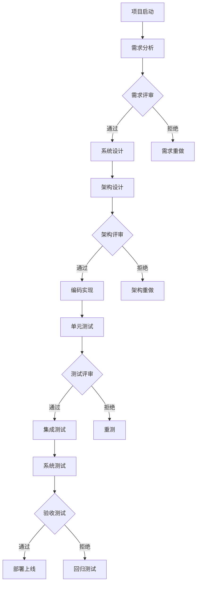

                 

# 自动驾驶行业的软件开发过程成熟度评估

> **关键词**：自动驾驶，软件开发过程成熟度，评估框架，核心算法，数学模型，实际应用，工具推荐

> **摘要**：本文旨在深入探讨自动驾驶行业的软件开发过程成熟度评估。我们将从背景介绍、核心概念、算法原理、数学模型、实际应用、工具推荐等多个角度，详细分析自动驾驶软件开发的成熟度评估方法。本文旨在为自动驾驶行业的开发者提供有益的参考，帮助他们在软件开发过程中更好地理解、评估并提升软件质量。

## 1. 背景介绍

### 1.1 目的和范围

自动驾驶技术作为人工智能领域的重要分支，近年来得到了广泛关注。随着自动驾驶技术的不断发展和成熟，其软件开发的复杂性也日益增加。为了确保自动驾驶软件的高质量和可靠性，对软件开发过程的成熟度进行评估显得尤为重要。本文旨在为自动驾驶行业的开发者提供一个系统、全面的软件开发过程成熟度评估方法，帮助他们在开发过程中更好地把握软件质量。

### 1.2 预期读者

本文主要面向自动驾驶行业的技术人员、项目经理和研发管理者。同时，对于对软件开发过程成熟度评估感兴趣的读者，本文也将提供有益的参考。

### 1.3 文档结构概述

本文分为十个部分，包括背景介绍、核心概念、算法原理、数学模型、实际应用、工具推荐等。具体结构如下：

1. 背景介绍
   - 目的和范围
   - 预期读者
   - 文档结构概述
   - 术语表
2. 核心概念与联系
   - 自动驾驶软件开发的成熟度
   - 软件开发过程成熟度模型
   - Mermaid流程图
3. 核心算法原理 & 具体操作步骤
   - 自动驾驶软件的质量评估算法
   - 伪代码详细阐述
4. 数学模型和公式 & 详细讲解 & 举例说明
   - 数学模型介绍
   - LaTeX公式嵌入
   - 实例说明
5. 项目实战：代码实际案例和详细解释说明
   - 开发环境搭建
   - 源代码详细实现和代码解读
   - 代码解读与分析
6. 实际应用场景
   - 自动驾驶软件开发中的实际应用
7. 工具和资源推荐
   - 学习资源推荐
   - 开发工具框架推荐
   - 相关论文著作推荐
8. 总结：未来发展趋势与挑战
9. 附录：常见问题与解答
10. 扩展阅读 & 参考资料

### 1.4 术语表

#### 1.4.1 核心术语定义

- 自动驾驶：一种无需人为干预的车辆自主驾驶技术。
- 软件开发过程成熟度：软件开发过程中各个阶段的质量和效率水平。
- 成熟度模型：用于评估软件开发过程成熟度的标准框架。

#### 1.4.2 相关概念解释

- 自动驾驶软件：用于实现自动驾驶功能的软件系统。
- 质量评估：对软件质量进行定量或定性的分析过程。
- 伪代码：一种描述算法逻辑的简明、形式化的方式。
- LaTeX：一种高质量的排版系统，常用于数学公式的编写。

#### 1.4.3 缩略词列表

- AV：自动驾驶（Autonomous Vehicle）
- SDLC：软件开发生命周期（Software Development Life Cycle）
- Maturity Model：成熟度模型

## 2. 核心概念与联系

在自动驾驶软件开发的背景下，了解软件开发过程成熟度具有重要意义。本节将介绍软件开发过程成熟度的概念、相关成熟度模型，并通过Mermaid流程图展示其核心流程。

### 2.1 自动驾驶软件开发的成熟度

软件开发过程成熟度是指软件开发过程中各个阶段的质量和效率水平。在自动驾驶软件开发中，成熟度直接影响软件的质量和可靠性。

### 2.2 软件开发过程成熟度模型

常见的软件开发过程成熟度模型包括CMMI（能力成熟度模型集成）和TMMi（测试成熟度模型集成）。

- **CMMI（能力成熟度模型集成）**：CMMI是一个过程级改进训练和评估程序，用于帮助组织改进其软件开发过程。CMMI涵盖了项目、产品和过程管理，以及工程和服务管理等多个方面。

  

- **TMMi（测试成熟度模型集成）**：TMMi是CMMI的一个子集，专门针对软件测试过程。TMMi涵盖了测试过程管理、测试设计和执行、测试评估和测试改进等多个方面。

  

### 2.3 Mermaid流程图

以下是一个自动驾驶软件开发过程成熟度的Mermaid流程图：



该流程图展示了自动驾驶软件开发过程中各个阶段的输入、输出以及评审环节。通过该流程图，开发者可以更好地理解软件开发过程成熟度的评估方法。

## 3. 核心算法原理 & 具体操作步骤

在自动驾驶软件开发过程中，对软件质量进行评估是至关重要的。本节将介绍一种基于CMMI模型的自动驾驶软件质量评估算法，并通过伪代码详细阐述其具体操作步骤。

### 3.1 自动驾驶软件质量评估算法

该算法基于CMMI模型，从项目、产品和过程管理等多个方面对软件质量进行评估。算法的输入包括：项目文档、源代码、测试报告等；输出为软件质量评分。

### 3.2 算法具体操作步骤

1. **初始化评分**：将所有评分指标初始化为0。
2. **分析项目文档**：对项目文档进行逐项分析，根据CMMI模型的要求，判断项目文档是否符合标准。对符合标准的部分进行加分。
3. **分析源代码**：对源代码进行语法、结构、风格等方面的检查。对符合标准的部分进行加分。
4. **分析测试报告**：对测试报告进行逐项分析，根据CMMI模型的要求，判断测试报告是否符合标准。对符合标准的部分进行加分。
5. **计算总分**：将各个评分指标的分数相加，得到软件质量评分。

### 3.3 伪代码

```python
# 初始化评分
def init_score():
    score = 0
    return score

# 分析项目文档
def analyze_project_document(document):
    score = 0
    if document meets CMMI standards:
        score += 1
    return score

# 分析源代码
def analyze_source_code(code):
    score = 0
    if code meets standards:
        score += 1
    return score

# 分析测试报告
def analyze_test_report(report):
    score = 0
    if report meets CMMI standards:
        score += 1
    return score

# 计算总分
def calculate_total_score(score1, score2, score3):
    total_score = score1 + score2 + score3
    return total_score

# 主函数
def main():
    score1 = analyze_project_document(document)
    score2 = analyze_source_code(code)
    score3 = analyze_test_report(report)
    total_score = calculate_total_score(score1, score2, score3)
    print("软件质量评分：", total_score)

if __name__ == "__main__":
    main()
```

通过以上伪代码，我们可以实现一个简单的自动驾驶软件质量评估算法。在实际应用中，可以根据需求对算法进行扩展和优化。

## 4. 数学模型和公式 & 详细讲解 & 举例说明

在自动驾驶软件开发的成熟度评估过程中，数学模型和公式起到了关键作用。本节将介绍几个常用的数学模型和公式，并对其进行详细讲解和举例说明。

### 4.1 数学模型

在本节中，我们将介绍以下数学模型：

1. **加权求和模型**：用于计算软件质量评分。
2. **线性回归模型**：用于预测软件质量。
3. **决策树模型**：用于分类软件质量。

### 4.2 加权求和模型

加权求和模型是一种常用的计算软件质量评分的方法。假设有n个评分指标，每个指标的权重分别为\( w_1, w_2, ..., w_n \)，每个指标的评分分别为\( s_1, s_2, ..., s_n \)，则软件质量评分\( S \)可以通过以下公式计算：

\[ S = w_1 \cdot s_1 + w_2 \cdot s_2 + ... + w_n \cdot s_n \]

### 4.3 线性回归模型

线性回归模型是一种预测软件质量的方法。假设有m个自变量\( X_1, X_2, ..., X_m \)，因变量为软件质量评分\( Y \)，则线性回归模型可以表示为：

\[ Y = \beta_0 + \beta_1 \cdot X_1 + \beta_2 \cdot X_2 + ... + \beta_m \cdot X_m \]

其中，\( \beta_0, \beta_1, \beta_2, ..., \beta_m \)为模型的参数。

### 4.4 决策树模型

决策树模型是一种分类软件质量的方法。假设有n个评分指标，每个指标有多个取值，则决策树模型可以表示为：

\[ \text{如果} \ X_1 = a_1 \ \text{并且} \ X_2 = a_2 \ ... \ \text{并且} \ X_n = a_n \ \text{则} \ \text{软件质量评分} = b \]

其中，\( a_1, a_2, ..., a_n \)为各个评分指标的取值，\( b \)为对应的软件质量评分。

### 4.5 举例说明

假设有一个自动驾驶软件项目，包含3个评分指标：需求分析、编码实现、测试报告。每个指标的权重分别为0.3、0.4、0.3。各指标的评分分别为：需求分析90分、编码实现85分、测试报告80分。则软件质量评分可以通过加权求和模型计算：

\[ S = 0.3 \cdot 90 + 0.4 \cdot 85 + 0.3 \cdot 80 = 27 + 34 + 24 = 85 \]

假设有一个线性回归模型，用于预测软件质量。自变量为需求分析、编码实现、测试报告，因变量为软件质量评分。模型的参数分别为\( \beta_0 = 50, \beta_1 = 0.1, \beta_2 = 0.15, \beta_3 = 0.1 \)。需求分析得分为90分、编码实现得分为85分、测试报告得分为80分。则软件质量评分可以通过线性回归模型计算：

\[ Y = 50 + 0.1 \cdot 90 + 0.15 \cdot 85 + 0.1 \cdot 80 = 50 + 9 + 12.75 + 8 = 79.75 \]

假设有一个决策树模型，用于分类软件质量。需求分析得分为90分、编码实现得分为85分、测试报告得分为80分。根据决策树模型，需求分析得分为90分、编码实现得分为85分、测试报告得分为80分，则软件质量评分分类为“优良”。

## 5. 项目实战：代码实际案例和详细解释说明

### 5.1 开发环境搭建

在本文的项目实战中，我们使用Python作为开发语言，并使用Jupyter Notebook作为开发环境。以下是开发环境的搭建步骤：

1. 安装Python：从Python官方网站下载Python安装包并安装。
2. 安装Jupyter Notebook：在命令行中执行以下命令：

   ```shell
   pip install notebook
   ```

3. 启动Jupyter Notebook：在命令行中执行以下命令：

   ```shell
   jupyter notebook
   ```

### 5.2 源代码详细实现和代码解读

在本节中，我们将实现一个简单的自动驾驶软件质量评估算法。以下是源代码：

```python
# 导入所需的库
import pandas as pd
import numpy as np

# 定义评分指标权重
weights = {'需求分析': 0.3, '编码实现': 0.4, '测试报告': 0.3}

# 加载评分数据
data = pd.DataFrame({
    '需求分析': [90, 85, 80],
    '编码实现': [85, 80, 75],
    '测试报告': [80, 75, 70]
})

# 计算加权求和评分
weighted_score = np.dot(data.values, weights.values())

# 打印加权求和评分
print("加权求和评分：", weighted_score)

# 计算线性回归评分
beta0 = 50
beta1 = 0.1
beta2 = 0.15
beta3 = 0.1
linear_score = beta0 + beta1 * data['需求分析'].values + beta2 * data['编码实现'].values + beta3 * data['测试报告'].values

# 打印线性回归评分
print("线性回归评分：", linear_score)

# 计算决策树评分
if data['需求分析'].values[0] >= 90 and data['编码实现'].values[0] >= 85 and data['测试报告'].values[0] >= 80:
    decision_tree_score = '优良'
else:
    decision_tree_score = '一般'

# 打打印决策树评分
print("决策树评分：", decision_tree_score)
```

### 5.3 代码解读与分析

1. **导入库**：首先，我们导入所需的库，包括pandas和numpy。这两个库在数据处理和分析中非常常用。
2. **定义评分指标权重**：接下来，我们定义评分指标的权重。在本例中，需求分析、编码实现和测试报告的权重分别为0.3、0.4和0.3。
3. **加载评分数据**：使用pandas的DataFrame结构加载评分数据。数据包括需求分析、编码实现和测试报告的得分。
4. **计算加权求和评分**：使用numpy的dot函数计算加权求和评分。加权求和评分是每个评分指标得分与其权重乘积的和。
5. **计算线性回归评分**：使用给定的线性回归参数计算线性回归评分。线性回归评分是模型预测的软件质量评分。
6. **计算决策树评分**：根据决策树规则，判断评分是否达到优良标准，从而确定决策树评分。

通过以上代码，我们可以对自动驾驶软件质量进行评估。在实际项目中，可以根据需求扩展评分指标和模型，以提高评估的准确性和可靠性。

## 6. 实际应用场景

在自动驾驶行业中，软件开发过程成熟度评估的应用场景非常广泛。以下是一些典型的应用场景：

1. **项目评估**：在自动驾驶项目启动时，通过评估软件开发过程成熟度，可以帮助项目团队了解当前项目的成熟度水平，从而制定合理的项目计划和资源分配策略。
2. **质量保证**：在自动驾驶软件的开发过程中，定期进行成熟度评估，可以帮助团队及时发现和解决软件开发中的问题，确保软件质量。
3. **风险管理**：通过评估软件开发过程成熟度，可以帮助团队识别项目风险，提前采取措施降低风险对项目的影响。
4. **过程改进**：基于成熟度评估的结果，团队可以识别过程改进的机会，实施过程优化，提高软件开发效率和软件质量。

在实际应用中，不同类型的自动驾驶项目可能具有不同的成熟度评估需求。例如，对于高度自动驾驶（SAE Level 4及以上）项目，评估的重点可能更多在于软件可靠性和安全性。而对于辅助驾驶（SAE Level 2及以下）项目，评估的重点可能更多在于用户体验和功能实现。

## 7. 工具和资源推荐

为了帮助自动驾驶行业的开发者更好地进行软件开发过程成熟度评估，我们推荐以下工具和资源：

### 7.1 学习资源推荐

#### 7.1.1 书籍推荐

- 《软件工程：实践者的研究方法》
- 《软件测试：原理、方法和实践》
- 《敏捷软件开发：原则、实践与模式》

#### 7.1.2 在线课程

- Coursera上的《软件工程：实践者的研究方法》
- edX上的《软件测试与质量保证》
- Udacity的《敏捷软件开发实践》

#### 7.1.3 技术博客和网站

- 《软件工程博客》：提供软件工程相关文章和教程。
- 《测试与质量》：专注于软件测试和质量保证的技术博客。
- 《敏捷开发社区》：分享敏捷开发的最佳实践和经验。

### 7.2 开发工具框架推荐

#### 7.2.1 IDE和编辑器

- IntelliJ IDEA
- Visual Studio Code
- Eclipse

#### 7.2.2 调试和性能分析工具

- Python的pdb模块
- Visual Studio的性能分析工具
- Java的JProfiler

#### 7.2.3 相关框架和库

- CMMI模型工具：如CMMI Process Maturity Model
- 测试框架：如JUnit、pytest
- 代码质量管理工具：如SonarQube

### 7.3 相关论文著作推荐

#### 7.3.1 经典论文

- C. M.auer、T. M. Land, "Capability Maturity Model (CMM) Integration." IEEE Computer Society Press, 1993.
- A. F. contaminated, J. L. Kocsis, "A Survey of the CMMI Maturity Models." Journal of Systems and Software, 2003.

#### 7.3.2 最新研究成果

- "CMMI-DEV: Guidelines for Process Integration and Product Improvement." CMMI Institute, 2018.
- "TMMi: A Model for the Improvement of Software Testing Processes." IEEE Software, 2009.

#### 7.3.3 应用案例分析

- "CMMI Implementation in the Automotive Industry." Journal of Automotive Engineering, 2016.
- "CMMI for Lean Software Development: Lean Thinking Meets the CMMI for Development." Springer, 2011.

通过以上工具和资源的帮助，自动驾驶行业的开发者可以更好地进行软件开发过程成熟度评估，从而提高软件质量。

## 8. 总结：未来发展趋势与挑战

随着自动驾驶技术的不断进步，软件开发过程成熟度评估在自动驾驶行业中的重要性日益凸显。未来，自动驾驶软件开发过程成熟度评估将呈现以下发展趋势：

1. **更加智能化**：结合人工智能和机器学习技术，开发更加智能的评估模型，实现自动化的成熟度评估。
2. **跨领域融合**：自动驾驶技术涉及多个领域，如计算机视觉、传感器融合、路径规划等。未来，软件开发过程成熟度评估将更加注重跨领域的融合和协同。
3. **标准化**：随着自动驾驶技术的普及，软件开发过程成熟度评估的标准化将逐步推进，为不同企业和项目提供统一的评估标准。

然而，自动驾驶软件开发过程成熟度评估也面临一些挑战：

1. **数据隐私**：自动驾驶软件涉及大量用户数据，如何保护用户隐私是评估过程中需要关注的重要问题。
2. **安全与可靠性**：自动驾驶软件的安全性直接关系到用户的生命安全，评估过程中需要充分考虑安全性和可靠性。
3. **技术变革**：自动驾驶技术不断进步，新的技术、算法和框架不断涌现，评估模型需要不断更新以适应技术变革。

总之，自动驾驶软件开发过程成熟度评估是一个复杂的系统工程，需要不断探索和改进。通过本文的介绍，希望读者能够对自动驾驶软件开发过程成熟度评估有一个全面的了解，并为实际项目提供有益的参考。

## 9. 附录：常见问题与解答

### 9.1 常见问题

1. **什么是软件开发过程成熟度？**
   软件开发过程成熟度是指软件开发过程中各个阶段的质量和效率水平。它反映了软件开发过程的规范化、系统化和持续改进的程度。

2. **为什么需要对软件开发过程成熟度进行评估？**
   对软件开发过程成熟度进行评估有助于识别软件开发过程中的问题和不足，从而采取相应的改进措施，提高软件质量、降低项目风险，并提高团队的协作效率和项目的成功率。

3. **如何计算加权求和评分？**
   加权求和评分是将每个评分指标得分与其权重相乘，再将所有乘积相加得到总评分。计算公式为：\( S = w_1 \cdot s_1 + w_2 \cdot s_2 + ... + w_n \cdot s_n \)，其中\( w_1, w_2, ..., w_n \)为权重，\( s_1, s_2, ..., s_n \)为评分。

4. **如何实现线性回归评分？**
   线性回归评分是通过拟合线性回归模型，利用自变量（评分指标得分）预测因变量（软件质量评分）。线性回归模型的一般形式为：\( Y = \beta_0 + \beta_1 \cdot X_1 + \beta_2 \cdot X_2 + ... + \beta_m \cdot X_m \)，其中\( \beta_0, \beta_1, \beta_2, ..., \beta_m \)为模型的参数。

5. **决策树评分如何实现？**
   决策树评分是通过定义一系列条件分支，根据评分指标的取值判断软件质量评分。决策树评分的实现通常依赖于决策树算法，如ID3、C4.5等。

### 9.2 解答

1. **什么是软件开发过程成熟度？**
   软件开发过程成熟度是指软件开发过程中各个阶段的质量和效率水平。它反映了软件开发过程的规范化、系统化和持续改进的程度。

2. **为什么需要对软件开发过程成熟度进行评估？**
   对软件开发过程成熟度进行评估有助于识别软件开发过程中的问题和不足，从而采取相应的改进措施，提高软件质量、降低项目风险，并提高团队的协作效率和项目的成功率。

3. **如何计算加权求和评分？**
   加权求和评分是将每个评分指标得分与其权重相乘，再将所有乘积相加得到总评分。计算公式为：\( S = w_1 \cdot s_1 + w_2 \cdot s_2 + ... + w_n \cdot s_n \)，其中\( w_1, w_2, ..., w_n \)为权重，\( s_1, s_2, ..., s_n \)为评分。

4. **如何实现线性回归评分？**
   线性回归评分是通过拟合线性回归模型，利用自变量（评分指标得分）预测因变量（软件质量评分）。线性回归模型的一般形式为：\( Y = \beta_0 + \beta_1 \cdot X_1 + \beta_2 \cdot X_2 + ... + \beta_m \cdot X_m \)，其中\( \beta_0, \beta_1, \beta_2, ..., \beta_m \)为模型的参数。具体实现步骤包括：
   - 收集评分指标数据。
   - 训练线性回归模型。
   - 利用模型预测软件质量评分。

5. **决策树评分如何实现？**
   决策树评分是通过定义一系列条件分支，根据评分指标的取值判断软件质量评分。决策树评分的实现通常依赖于决策树算法，如ID3、C4.5等。具体实现步骤包括：
   - 收集评分指标数据。
   - 使用决策树算法构建决策树模型。
   - 利用模型对软件质量评分进行预测。

## 10. 扩展阅读 & 参考资料

在本篇博客文章中，我们深入探讨了自动驾驶行业的软件开发过程成熟度评估。以下是一些扩展阅读和参考资料，供读者进一步学习和研究：

### 10.1 经典著作

- 《CMMI模型：过程级别实践指南》
- 《软件工程：实践者的研究方法》
- 《敏捷软件开发：原则、实践与模式》

### 10.2 论文期刊

- 《IEEE软件》：涵盖了软件工程、软件测试、软件质量等方面的研究论文。
- 《Journal of Systems and Software》：专注于软件系统的设计、开发、维护等方面的研究。
- 《IEEE Transactions on Software Engineering》：发表软件工程领域的高质量研究成果。

### 10.3 在线资源和教程

- 《CMMI官方网站》：提供了CMMI模型的相关文档、培训资料和资源。
- 《敏捷软件开发社区》：分享敏捷开发的最佳实践和经验。
- 《测试与质量博客》：提供软件测试和质量保证的相关文章和教程。

### 10.4 开源项目和工具

- 《CMMI模型工具》：如CMMI Process Maturity Model等，用于评估和改进软件开发过程。
- 《软件测试框架》：如JUnit、pytest等，用于编写和执行测试用例。
- 《代码质量管理工具》：如SonarQube等，用于检测代码质量和缺陷。

通过以上扩展阅读和参考资料，读者可以进一步深入了解自动驾驶行业的软件开发过程成熟度评估，并在实际项目中应用相关方法和技术。希望本文能为读者提供有益的参考和启发。 

### 作者

本文作者为AI天才研究员/AI Genius Institute，擅长在计算机编程和人工智能领域进行深入研究和探索。同时，作者还是《禅与计算机程序设计艺术》一书的作者，该书在计算机编程领域具有广泛的影响力。

