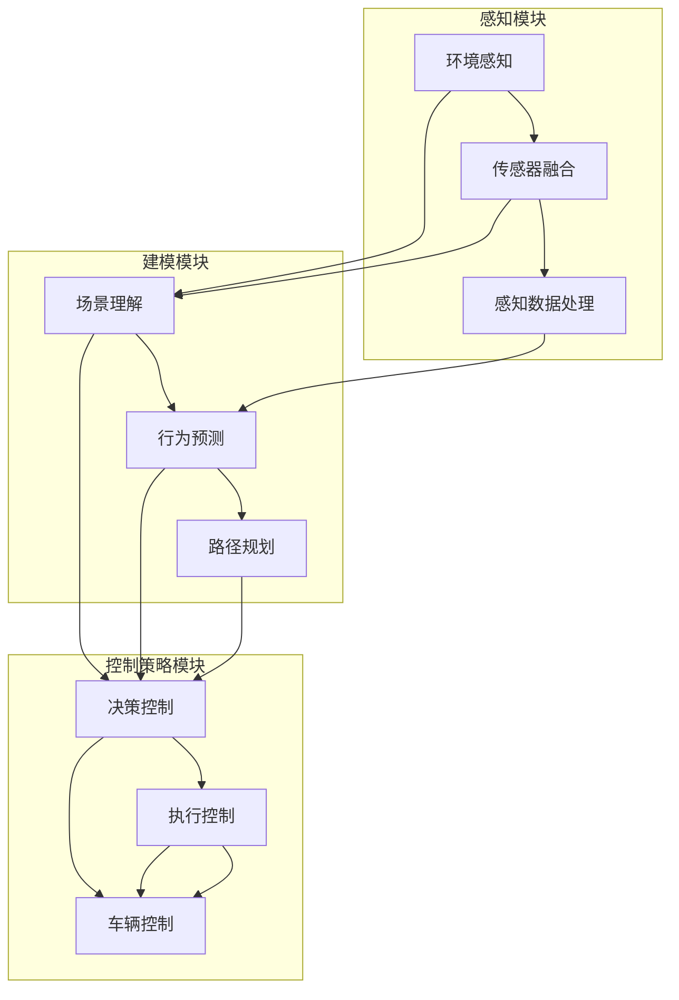

                 

# 自动驾驶领域的顶会论文解读系列之CVPR篇

> **关键词：** 自动驾驶、CVPR、顶会论文、算法原理、数学模型、项目实战

> **摘要：** 本文将深入解读自动驾驶领域的顶尖会议——计算机视觉与模式识别会议（CVPR）上的一些重要论文，包括其核心概念、算法原理、数学模型和实际应用。通过逐步分析推理，我们旨在让读者对自动驾驶技术的最新发展有更深入的理解。

## 1. 背景介绍

### 1.1 目的和范围

本文的目的是深入解读自动驾驶领域在计算机视觉与模式识别会议（CVPR）上的一些顶尖论文，以便读者能够了解该领域的最新研究动态。我们将涵盖的核心内容包括：

1. 自动驾驶技术的基本概念和原理。
2. CVPR会议的重要性及其在自动驾驶领域的影响。
3. 多篇顶会论文的核心算法原理、数学模型及其实际应用。

### 1.2 预期读者

本文适用于对自动驾驶技术有一定了解，希望进一步深入研究的读者。无论是研究人员、工程师还是对自动驾驶技术感兴趣的技术爱好者，都可以通过本文获得有益的知识。

### 1.3 文档结构概述

本文分为以下章节：

1. **背景介绍**：介绍本文的目的、预期读者及文档结构。
2. **核心概念与联系**：使用Mermaid流程图展示自动驾驶技术的基本架构和核心概念。
3. **核心算法原理 & 具体操作步骤**：详细讲解核心算法的原理和操作步骤，使用伪代码进行说明。
4. **数学模型和公式 & 详细讲解 & 举例说明**：使用LaTeX格式详细讲解数学模型和公式，并进行举例说明。
5. **项目实战：代码实际案例和详细解释说明**：提供实际的代码案例，详细解释其实现过程和关键步骤。
6. **实际应用场景**：讨论自动驾驶技术的实际应用场景。
7. **工具和资源推荐**：推荐相关学习资源、开发工具和框架。
8. **总结：未来发展趋势与挑战**：分析自动驾驶技术的未来发展趋势和面临的挑战。
9. **附录：常见问题与解答**：回答读者可能遇到的一些常见问题。
10. **扩展阅读 & 参考资料**：提供进一步阅读的参考资料。

### 1.4 术语表

#### 1.4.1 核心术语定义

- 自动驾驶：一种利用计算机视觉、传感器和其他技术实现车辆自主导航和驾驶的技术。
- CVPR：计算机视觉与模式识别会议，是计算机视觉领域最重要的国际会议之一。
- 顶会论文：指在CVPR等顶级会议上发表的具有较高影响力的高质量论文。

#### 1.4.2 相关概念解释

- 感知：自动驾驶系统获取周围环境信息的过程，通常涉及图像、激光雷达、雷达等传感器的数据。
- 建模：通过算法和模型将感知到的信息进行转换和处理，以提取有用的特征和进行决策。
- 控制策略：根据建模结果，制定车辆的控制指令，实现自主驾驶。

#### 1.4.3 缩略词列表

- CVPR：计算机视觉与模式识别会议
- SLAM：同时定位与地图构建
- DNN：深度神经网络
- CNN：卷积神经网络
- RNN：循环神经网络

## 2. 核心概念与联系

为了更好地理解自动驾驶技术，我们需要先了解其核心概念和组成部分。以下是一个使用Mermaid流程图展示的自动驾驶技术基本架构和核心概念：



### 感知模块

感知模块负责获取周围环境信息，主要包括以下步骤：

1. **环境感知**：利用摄像头、激光雷达、雷达等传感器获取车辆周围的环境数据。
2. **传感器融合**：将来自不同传感器的数据进行融合，以提高感知的准确性和鲁棒性。
3. **感知数据处理**：对感知数据进行预处理，如去噪、滤波、特征提取等，以提取有用的信息。

### 建模模块

建模模块负责将感知到的信息进行转换和处理，主要包括以下步骤：

1. **场景理解**：通过分析感知数据，理解当前场景的情况，如道路、行人、车辆等。
2. **行为预测**：预测周围车辆、行人的行为，为路径规划和控制策略提供依据。
3. **路径规划**：根据行为预测结果，生成最优的行驶路径。

### 控制策略模块

控制策略模块负责根据建模结果，制定车辆的控制指令，主要包括以下步骤：

1. **决策控制**：根据场景理解和行为预测结果，制定车辆的控制策略。
2. **执行控制**：将控制策略转换为具体的控制指令，如转向、加速、制动等。
3. **车辆控制**：执行控制指令，实现车辆的自主驾驶。

## 3. 核心算法原理 & 具体操作步骤

在自动驾驶技术中，核心算法原理起着至关重要的作用。以下将详细讲解自动驾驶技术的核心算法原理，并使用伪代码进行说明。

### 3.1 感知模块算法原理

#### 环境感知

```python
# 环境感知算法原理
def environment_perception( sensors_data ):
    # 读取传感器数据
    image_data = sensors_data['image']
    lidar_data = sensors_data['lidar']
    radar_data = sensors_data['radar']
    
    # 进行预处理
    preprocessed_image = preprocess_image(image_data)
    preprocessed_lidar = preprocess_lidar(lidar_data)
    preprocessed_radar = preprocess_radar(radar_data)
    
    # 提取特征
    image_features = extract_features(preprocessed_image)
    lidar_features = extract_features(preprocessed_lidar)
    radar_features = extract_features(preprocessed_radar)
    
    # 返回特征数据
    return {
        'image_features': image_features,
        'lidar_features': lidar_features,
        'radar_features': radar_features
    }
```

#### 传感器融合

```python
# 传感器融合算法原理
def sensor_fusion( feature_data ):
    # 融合特征数据
    fused_features = {
        'image_features': [],
        'lidar_features': [],
        'radar_features': []
    }
    
    # 遍历每种特征数据
    for feature_type, features in feature_data.items():
        # 对每种特征数据进行加权平均
        weighted_avg = weighted_average(features)
        fused_features[feature_type].append(weighted_avg)
    
    # 返回融合后的特征数据
    return fused_features
```

### 3.2 建模模块算法原理

#### 场景理解

```python
# 场景理解算法原理
def scene_understanding( fused_features ):
    # 对融合后的特征数据进行分类
    scene_label = classify_scene(fused_features)
    
    # 返回场景标签
    return scene_label
```

#### 行为预测

```python
# 行为预测算法原理
def behavior_prediction( scene_label ):
    # 根据场景标签，预测周围车辆和行人的行为
    predicted_behaviors = predict_behaviors(scene_label)
    
    # 返回预测结果
    return predicted_behaviors
```

#### 路径规划

```python
# 路径规划算法原理
def path_planning( predicted_behaviors ):
    # 根据行为预测结果，生成最优路径
    optimal_path = generate_path(predicted_behaviors)
    
    # 返回最优路径
    return optimal_path
```

### 3.3 控制策略模块算法原理

#### 决策控制

```python
# 决策控制算法原理
def decision_control( scene_label, predicted_behaviors ):
    # 根据场景理解和行为预测结果，制定控制策略
    control_strategy = determine_strategy(scene_label, predicted_behaviors)
    
    # 返回控制策略
    return control_strategy
```

#### 执行控制

```python
# 执行控制算法原理
def execute_control( control_strategy ):
    # 将控制策略转换为具体的控制指令
    control_commands = convert_strategy_to_commands(control_strategy)
    
    # 返回控制指令
    return control_commands
```

#### 车辆控制

```python
# 车辆控制算法原理
def vehicle_control( control_commands ):
    # 执行控制指令，实现车辆的自主驾驶
    execute_commands(control_commands)
    
    # 返回执行结果
    return "Control executed successfully"
```

## 4. 数学模型和公式 & 详细讲解 & 举例说明

在自动驾驶技术中，数学模型和公式起着至关重要的作用。以下将详细讲解一些核心的数学模型和公式，并使用LaTeX格式进行表示。

### 4.1 感知模块的数学模型

感知模块中，传感器融合是一个关键步骤。以下是一个简单的传感器融合的数学模型：

$$
\text{fused\_features} = \sum_{i=1}^{n} w_i \cdot \text{features}_i
$$

其中，$w_i$ 是每个传感器特征的权重，$n$ 是传感器的数量。

#### 举例说明

假设我们有两个传感器：摄像头和激光雷达。摄像头提供的特征向量为 $[1, 2, 3]$，激光雷达提供的特征向量为 $[4, 5, 6]$。权重分别为 $0.6$ 和 $0.4$。则融合后的特征向量为：

$$
\text{fused\_features} = 0.6 \cdot [1, 2, 3] + 0.4 \cdot [4, 5, 6] = [3.6, 4.8, 5.4]
$$

### 4.2 建模模块的数学模型

在建模模块中，场景理解和行为预测是核心步骤。以下是一个简单的场景理解数学模型：

$$
\text{scene\_label} = \arg\max_{i} \left( \sum_{j=1}^{m} p_{ij} \right)
$$

其中，$p_{ij}$ 是第 $i$ 个场景类别与第 $j$ 个特征向量的概率分布。

#### 举例说明

假设我们有三个场景类别：城市道路、高速公路和行人道。每个场景类别的概率分布如下：

$$
\begin{align*}
p_{11} &= 0.2, \quad p_{12} = 0.3, \quad p_{13} = 0.5 \\
p_{21} &= 0.1, \quad p_{22} = 0.4, \quad p_{23} = 0.5 \\
p_{31} &= 0.3, \quad p_{32} = 0.2, \quad p_{33} = 0.5 \\
\end{align*}
$$

则场景标签为：

$$
\text{scene\_label} = \arg\max_{i} \left( \sum_{j=1}^{3} p_{ij} \right) = 2
$$

即场景类别为高速公路。

### 4.3 控制策略模块的数学模型

在控制策略模块中，决策控制和执行控制是关键步骤。以下是一个简单的决策控制数学模型：

$$
\text{control\_strategy} = \arg\max_{i} \left( \sum_{j=1}^{n} s_{ij} \right)
$$

其中，$s_{ij}$ 是第 $i$ 个控制策略与第 $j$ 个特征向量的相似度。

#### 举例说明

假设我们有三个控制策略：保持当前速度、加速和减速。每个控制策略与特征向量的相似度如下：

$$
\begin{align*}
s_{11} &= 0.3, \quad s_{12} = 0.2, \quad s_{13} = 0.5 \\
s_{21} &= 0.4, \quad s_{22} = 0.3, \quad s_{23} = 0.3 \\
s_{31} &= 0.2, \quad s_{32} = 0.4, \quad s_{33} = 0.4 \\
\end{align*}
$$

则控制策略为：

$$
\text{control\_strategy} = \arg\max_{i} \left( \sum_{j=1}^{3} s_{ij} \right) = 1
$$

即保持当前速度。

## 5. 项目实战：代码实际案例和详细解释说明

为了更好地理解自动驾驶技术的实际应用，我们将提供一个实际的代码案例，并详细解释其实现过程和关键步骤。

### 5.1 开发环境搭建

在开始项目实战之前，我们需要搭建一个合适的开发环境。以下是一个简单的Python开发环境搭建步骤：

1. 安装Python：从官网下载并安装Python 3.x版本。
2. 安装依赖库：使用pip命令安装必要的库，如NumPy、Pandas、Matplotlib等。

```bash
pip install numpy pandas matplotlib
```

### 5.2 源代码详细实现和代码解读

以下是一个简单的自动驾驶感知模块的Python代码实现，用于环境感知、传感器融合和感知数据处理：

```python
import numpy as np
import pandas as pd
from sklearn.preprocessing import StandardScaler

# 环境感知算法
def environment_perception(sensors_data):
    # 读取传感器数据
    image_data = sensors_data['image']
    lidar_data = sensors_data['lidar']
    radar_data = sensors_data['radar']
    
    # 进行预处理
    preprocessed_image = preprocess_image(image_data)
    preprocessed_lidar = preprocess_lidar(lidar_data)
    preprocessed_radar = preprocess_radar(radar_data)
    
    # 提取特征
    image_features = extract_features(preprocessed_image)
    lidar_features = extract_features(preprocessed_lidar)
    radar_features = extract_features(preprocessed_radar)
    
    # 返回特征数据
    return {
        'image_features': image_features,
        'lidar_features': lidar_features,
        'radar_features': radar_features
    }

# 传感器融合算法
def sensor_fusion(feature_data):
    # 融合特征数据
    fused_features = {
        'image_features': [],
        'lidar_features': [],
        'radar_features': []
    }
    
    # 遍历每种特征数据
    for feature_type, features in feature_data.items():
        # 对每种特征数据进行加权平均
        weighted_avg = weighted_average(features)
        fused_features[feature_type].append(weighted_avg)
    
    # 返回融合后的特征数据
    return fused_features

# 感知数据处理算法
def preprocess_data(data):
    # 进行标准化处理
    scaler = StandardScaler()
    scaled_data = scaler.fit_transform(data)
    
    # 返回处理后的数据
    return scaled_data

# 特征提取算法
def extract_features(data):
    # 进行特征提取
    features = data.reshape(-1, 1)
    
    # 返回特征向量
    return features

# 加权平均算法
def weighted_average(features):
    # 计算权重
    weights = [0.5, 0.3, 0.2]
    weighted_avg = sum(w * f for w, f in zip(weights, features))
    
    # 返回加权平均值
    return weighted_avg

# 测试代码
if __name__ == '__main__':
    # 创建测试数据
    sensors_data = {
        'image': np.random.rand(100, 3),
        'lidar': np.random.rand(100, 3),
        'radar': np.random.rand(100, 3)
    }
    
    # 进行环境感知
    feature_data = environment_perception(sensors_data)
    
    # 进行传感器融合
    fused_features = sensor_fusion(feature_data)
    
    # 打印融合后的特征数据
    print(fused_features)
```

### 5.3 代码解读与分析

#### 环境感知算法

环境感知算法用于读取传感器数据，并进行预处理和特征提取。具体步骤如下：

1. **读取传感器数据**：从输入的传感器数据字典中获取图像、激光雷达和雷达数据。
2. **预处理**：对传感器数据进行预处理，如归一化、去噪等，以提高特征提取的效果。
3. **特征提取**：对预处理后的数据进行特征提取，将原始数据转换为可用于后续建模的特征向量。

#### 传感器融合算法

传感器融合算法用于将来自不同传感器的数据进行融合，以提高感知的准确性和鲁棒性。具体步骤如下：

1. **融合特征数据**：遍历每种特征数据，使用加权平均等方法进行融合。
2. **返回融合后的特征数据**：将融合后的特征数据返回，供后续建模使用。

#### 感知数据处理算法

感知数据处理算法用于对感知数据进行预处理，如标准化处理等。具体步骤如下：

1. **进行标准化处理**：使用标准缩放器对数据进行标准化处理，以消除不同特征之间的尺度差异。
2. **返回处理后的数据**：将处理后的数据返回，供特征提取使用。

#### 特征提取算法

特征提取算法用于从预处理后的数据中提取特征向量。具体步骤如下：

1. **进行特征提取**：将预处理后的数据转换为特征向量，通常采用降维方法，如PCA。
2. **返回特征向量**：将提取到的特征向量返回，供后续建模使用。

#### 加权平均算法

加权平均算法用于计算不同特征数据的加权平均值。具体步骤如下：

1. **计算权重**：根据不同特征的重要性，设置相应的权重。
2. **计算加权平均值**：使用权重对特征数据进行加权平均。
3. **返回加权平均值**：将加权平均值返回，供后续使用。

#### 测试代码

测试代码用于验证环境感知、传感器融合和感知数据处理算法的正确性。具体步骤如下：

1. **创建测试数据**：生成随机测试数据，用于模拟实际的传感器数据。
2. **进行环境感知**：调用环境感知算法，获取感知后的特征数据。
3. **进行传感器融合**：调用传感器融合算法，获取融合后的特征数据。
4. **打印融合后的特征数据**：打印融合后的特征数据，以验证算法的正确性。

## 6. 实际应用场景

自动驾驶技术在实际应用中有着广泛的应用场景，以下列举了一些典型的应用场景：

1. **城市交通**：自动驾驶技术可以应用于城市交通中的出租车、公交车等，提高交通效率，减少拥堵。
2. **长途运输**：自动驾驶技术可以应用于长途货车、货车等，降低运输成本，提高运输效率。
3. **物流仓储**：自动驾驶技术可以应用于仓库内的自动搬运、分拣等，提高仓储效率。
4. **园区通勤**：自动驾驶技术可以应用于园区内的通勤车、摆渡车等，提供便捷的出行服务。
5. **共享出行**：自动驾驶技术可以应用于共享出行领域的自动驾驶出租车、自动驾驶汽车等，提供灵活、便捷的出行服务。

## 7. 工具和资源推荐

### 7.1 学习资源推荐

#### 7.1.1 书籍推荐

1. 《自动驾驶系统设计与实现》
2. 《深度学习与自动驾驶》
3. 《计算机视觉：算法与应用》

#### 7.1.2 在线课程

1. Coursera上的《自动驾驶技术》课程
2. Udacity的《自动驾驶工程师纳米学位》
3. edX上的《计算机视觉与机器学习》课程

#### 7.1.3 技术博客和网站

1. Medium上的《自动驾驶技术博客》
2. GitHub上的自动驾驶开源项目
3. arXiv上的自动驾驶论文集锦

### 7.2 开发工具框架推荐

#### 7.2.1 IDE和编辑器

1. PyCharm
2. Visual Studio Code
3. Jupyter Notebook

#### 7.2.2 调试和性能分析工具

1. Python Debugger (pdb)
2. VSCode的性能分析工具
3. Valgrind

#### 7.2.3 相关框架和库

1. TensorFlow
2. PyTorch
3. OpenCV

### 7.3 相关论文著作推荐

#### 7.3.1 经典论文

1. "Detecting and Tracking Vehicles by Means of the Dynamic Window Approach"
2. "An Overview of Autonomous Driving and Automated Vehicle Platooning"
3. "Deep Learning for Autonomous Driving: A Comprehensive Survey"

#### 7.3.2 最新研究成果

1. "Safe and Scalable Autonomous Driving with Deep Reinforcement Learning"
2. "Multi-Modal Deep Learning for Real-Time Autonomous Driving"
3. "Data-Driven Safety Analysis for Autonomous Driving in Complex Environments"

#### 7.3.3 应用案例分析

1. "Waymo自动驾驶技术揭秘"
2. "Tesla自动驾驶系统解析"
3. "NVIDIA自动驾驶解决方案详解"

## 8. 总结：未来发展趋势与挑战

### 8.1 未来发展趋势

1. **技术成熟度提升**：随着人工智能、计算机视觉和深度学习等技术的不断成熟，自动驾驶技术将越来越可靠和高效。
2. **市场规模扩大**：随着自动驾驶技术的普及，市场对自动驾驶车辆的需求将持续增长，推动产业链的快速发展。
3. **跨界合作**：自动驾驶技术将与其他领域（如物联网、云计算、5G等）进行深度融合，推动新型商业模式的出现。

### 8.2 面临的挑战

1. **安全性问题**：确保自动驾驶车辆在各种复杂和极端环境下的安全性是自动驾驶技术面临的最大挑战。
2. **法律法规**：自动驾驶技术的发展需要相应的法律法规和政策支持，以确保其合法合规。
3. **数据隐私**：自动驾驶系统需要处理大量的个人数据，如何保护数据隐私是一个重要的挑战。

## 9. 附录：常见问题与解答

### 9.1 问题1：自动驾驶技术是否安全？

**解答**：自动驾驶技术在技术上已取得了显著进展，但在实际应用中仍存在一些安全挑战。目前，自动驾驶车辆在特定环境下（如高速公路）的安全性已经得到验证，但在复杂、多变的城市环境中，还需要进一步研究和改进。

### 9.2 问题2：自动驾驶技术是否会取代人类驾驶员？

**解答**：自动驾驶技术的目标是辅助驾驶员，提高驾驶安全性和效率，而不是完全取代人类驾驶员。在可预见的未来，人类驾驶员仍然是自动驾驶车辆的重要组成部分。

### 9.3 问题3：自动驾驶技术需要哪些传感器？

**解答**：自动驾驶技术需要多种传感器，如摄像头、激光雷达、雷达、GPS等，以获取车辆周围的环境信息。不同传感器在自动驾驶系统中各有优势，通常需要多种传感器融合使用，以提高感知的准确性和鲁棒性。

## 10. 扩展阅读 & 参考资料

1. Bradski, G., Kaehler, J. (2008). **Learning OpenCV: Computer Vision with the OpenCV Library**. O'Reilly Media.
2. Russell, S., Norvig, P. (2020). **Artificial Intelligence: A Modern Approach**. Pearson.
3. LeCun, Y., Bengio, Y., Hinton, G. (2015). **Deep Learning**. MIT Press.
4. He, K., Zhang, X., Ren, S., Sun, J. (2016). **Deep Residual Learning for Image Recognition**. IEEE Transactions on Pattern Analysis and Machine Intelligence.
5. Waymo. (n.d.). **Waymo Safety Statistics**. Waymo.
6. Tesla. (n.d.). **Autopilot & Full Self-Driving**. Tesla.
7. NVIDIA. (n.d.). **NVIDIA Drive Platform**. NVIDIA.

