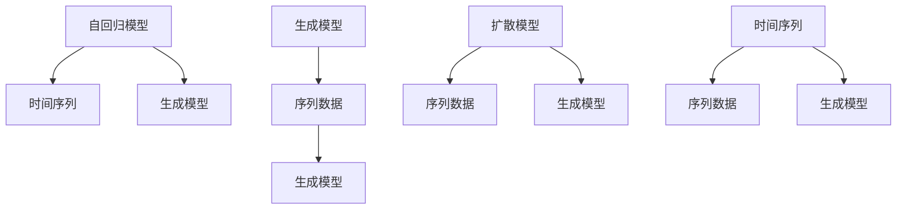

                 

# 自回归模型vs扩散模型:AI架构的未来发展方向

> **关键词：** 自回归模型、扩散模型、AI架构、机器学习、深度学习、神经网络、生成模型、模型对比分析

> **摘要：** 本文将深入探讨自回归模型和扩散模型这两种在人工智能领域备受关注的算法，分析它们的基本原理、数学模型以及实际应用。通过对比两者的优缺点和适用场景，我们旨在为读者提供对这些先进模型的理解和应用指导，展望未来AI架构的发展趋势和潜在挑战。

## 1. 背景介绍

### 1.1 目的和范围

本文旨在比较自回归模型（Autoregressive Model）和扩散模型（Diffusion Model），两种在生成模型领域具有重要地位的算法。我们将从基本概念、数学原理、具体实现和应用场景等多个维度进行详细分析，以帮助读者全面了解这两种模型的优势与局限，并探讨它们在AI架构中的未来发展潜力。

### 1.2 预期读者

本文适合对机器学习和深度学习有一定基础的读者，包括数据科学家、AI研究者、工程师以及对生成模型感兴趣的技术人员。同时，对于希望了解最新AI技术发展的从业者来说，本文也提供了有价值的参考。

### 1.3 文档结构概述

本文结构如下：

1. **背景介绍**：介绍本文的目的、预期读者和文档结构。
2. **核心概念与联系**：介绍自回归模型和扩散模型的基本概念，并使用Mermaid流程图展示两者的联系。
3. **核心算法原理 & 具体操作步骤**：详细讲解自回归模型和扩散模型的算法原理和操作步骤，使用伪代码进行阐述。
4. **数学模型和公式 & 详细讲解 & 举例说明**：介绍自回归模型和扩散模型所涉及的数学模型，使用LaTeX格式展示关键公式，并给出具体例子。
5. **项目实战：代码实际案例和详细解释说明**：通过实际代码案例，展示自回归模型和扩散模型的应用，并进行详细解释。
6. **实际应用场景**：分析自回归模型和扩散模型在不同领域的应用场景。
7. **工具和资源推荐**：推荐相关学习资源、开发工具和论文著作。
8. **总结：未来发展趋势与挑战**：总结自回归模型和扩散模型的发展趋势，讨论面临的挑战。
9. **附录：常见问题与解答**：回答读者可能关注的问题。
10. **扩展阅读 & 参考资料**：提供进一步阅读和研究的资源。

### 1.4 术语表

#### 1.4.1 核心术语定义

- 自回归模型（Autoregressive Model）：一种生成模型，通过预测序列的当前值与其历史值之间的关系来生成数据。
- 扩散模型（Diffusion Model）：一种基于概率扩散过程的生成模型，通过模拟物质扩散过程来生成数据。
- 生成模型（Generative Model）：一类机器学习模型，用于生成与训练数据相似的新数据。

#### 1.4.2 相关概念解释

- 序列模型（Sequential Model）：一类模型，处理数据时考虑数据之间的时间或空间顺序。
- 深度学习（Deep Learning）：一种机器学习方法，通过多层神经网络进行特征学习和分类。
- 生成对抗网络（Generative Adversarial Network, GAN）：一种由生成器和判别器组成的生成模型。

#### 1.4.3 缩略词列表

- GAN：生成对抗网络（Generative Adversarial Network）
- VRP：车辆路径问题（Vehicle Routing Problem）
- NLP：自然语言处理（Natural Language Processing）
- CV：计算机视觉（Computer Vision）

## 2. 核心概念与联系

### 2.1 自回归模型原理

自回归模型是一种基于时间序列数据的生成模型，其核心思想是利用历史数据来预测当前值。自回归模型的一般形式可以表示为：

$$
x_t = f(x_{t-1}, x_{t-2}, ..., x_{1})
$$

其中，$x_t$ 表示时间 $t$ 的数据点，$f$ 表示预测函数。常见的自回归模型包括一阶自回归模型（AR）、移动平均模型（MA）和自回归移动平均模型（ARMA）。

### 2.2 扩散模型原理

扩散模型是一种基于概率扩散过程的生成模型，其核心思想是通过模拟物质扩散过程来生成数据。扩散模型可以分为两个阶段：扩散阶段和去扩散阶段。

在扩散阶段，模型逐渐将数据点从噪声状态扩散到真实数据状态。去扩散阶段则尝试将数据点从真实数据状态重新扩散到噪声状态。通过训练去扩散模型，我们可以在去扩散阶段生成与训练数据相似的新数据。扩散模型的一般形式可以表示为：

$$
z_t = \mu(x_t) + \sigma(x_t) \odot \epsilon_t
$$

$$
x_{\text{new}} = f(x_t, z_t)
$$

其中，$z_t$ 表示在扩散阶段的状态，$x_t$ 表示真实数据状态，$\mu$ 和 $\sigma$ 分别表示均值函数和方差函数，$\epsilon_t$ 表示噪声。

### 2.3 自回归模型和扩散模型的联系

自回归模型和扩散模型虽然基于不同的原理，但都可以用于生成序列数据。自回归模型适用于处理时间序列数据，而扩散模型则适用于处理更一般的序列数据。在某些情况下，我们可以将自回归模型视为一种特殊的扩散模型，其中噪声项为零。以下是一个简单的Mermaid流程图，展示自回归模型和扩散模型的联系：



## 3. 核心算法原理 & 具体操作步骤

### 3.1 自回归模型算法原理

自回归模型的核心算法原理是基于历史数据来预测当前值。以下是一阶自回归模型的伪代码：

```plaintext
def autoregressive_model(x):
    # 初始化模型参数
    theta = [初始化参数值]
    
    # 预测当前值
    x_new = predict(x[-1], theta)
    
    return x_new

def predict(x, theta):
    # 使用参数预测当前值
    x_new = theta[0] + theta[1] * x
    
    return x_new
```

### 3.2 扩散模型算法原理

扩散模型的算法原理可以分为两个阶段：扩散阶段和去扩散阶段。

**扩散阶段：**

```plaintext
def diffusion(x, mu, sigma, epsilon):
    # 逐渐将数据点从真实数据状态扩散到噪声状态
    for t in range(T):
        z = mu(x) + sigma(x) * epsilon
        x = z
    
    return x
```

**去扩散阶段：**

```plaintext
def denoising(x, theta):
    # 从真实数据状态重新扩散到噪声状态
    z = theta[0] + theta[1] * x
    x_new = theta[2] * x + theta[3] * z
    
    return x_new
```

### 3.3 操作步骤

**自回归模型操作步骤：**

1. **数据准备**：收集时间序列数据。
2. **模型初始化**：初始化模型参数。
3. **预测**：使用自回归模型预测当前值。
4. **评估**：评估模型预测的准确性。

**扩散模型操作步骤：**

1. **数据准备**：收集序列数据。
2. **模型训练**：分别训练扩散模型和去扩散模型。
3. **生成数据**：使用去扩散模型生成新数据。
4. **评估**：评估生成数据的准确性。

## 4. 数学模型和公式 & 详细讲解 & 举例说明

### 4.1 自回归模型数学模型

一阶自回归模型的数学模型可以表示为：

$$
x_t = \theta_0 + \theta_1 x_{t-1} + \epsilon_t
$$

其中，$x_t$ 表示时间 $t$ 的数据点，$\theta_0$ 和 $\theta_1$ 表示模型参数，$\epsilon_t$ 表示误差项。

### 4.2 扩散模型数学模型

扩散模型的数学模型可以分为两个阶段：

**扩散阶段：**

$$
z_t = \mu(x) + \sigma(x) \odot \epsilon_t
$$

其中，$z_t$ 表示在扩散阶段的状态，$\mu(x)$ 和 $\sigma(x)$ 分别表示均值函数和方差函数，$\epsilon_t$ 表示噪声。

**去扩散阶段：**

$$
x_{\text{new}} = \theta_0 x + \theta_1 z + \theta_2
$$

其中，$x_{\text{new}}$ 表示去扩散阶段生成的新数据，$\theta_0$、$\theta_1$ 和 $\theta_2$ 表示模型参数。

### 4.3 自回归模型举例说明

假设我们有一组时间序列数据 $[x_1, x_2, x_3, ..., x_n]$，一阶自回归模型的参数为 $\theta_0 = 0.5$ 和 $\theta_1 = 0.2$。我们可以使用以下公式计算新数据点：

$$
x_{\text{new}} = 0.5 + 0.2 \times x_{\text{current}}
$$

例如，如果当前数据点 $x_3 = 10$，则新数据点为：

$$
x_{\text{new}} = 0.5 + 0.2 \times 10 = 2.5
$$

### 4.4 扩散模型举例说明

假设我们有一组序列数据 $[x_1, x_2, x_3, ..., x_n]$，扩散模型的参数为 $\mu(x) = x$、$\sigma(x) = 0.1$ 和 $\theta_0 = 0.5$、$\theta_1 = 0.2$、$\theta_2 = 0.3$。我们可以使用以下公式进行扩散和去扩散：

**扩散阶段：**

$$
z_1 = x_1 + 0.1 \odot \epsilon_1
$$

$$
z_2 = x_2 + 0.1 \odot \epsilon_2
$$

$$
...
$$

$$
z_n = x_n + 0.1 \odot \epsilon_n
$$

**去扩散阶段：**

$$
x_{\text{new}, 1} = 0.5 \times x_1 + 0.2 \times z_1 + 0.3
$$

$$
x_{\text{new}, 2} = 0.5 \times x_2 + 0.2 \times z_2 + 0.3
$$

$$
...
$$

$$
x_{\text{new}, n} = 0.5 \times x_n + 0.2 \times z_n + 0.3
$$

通过这个例子，我们可以看到扩散模型如何将原始数据点逐步扩散到噪声状态，并在去扩散阶段生成新数据点。

## 5. 项目实战：代码实际案例和详细解释说明

### 5.1 开发环境搭建

为了实现自回归模型和扩散模型，我们需要搭建一个合适的开发环境。以下是所需的工具和步骤：

- **Python**：安装Python 3.8及以上版本。
- **NumPy**：用于数学运算。
- **Pandas**：用于数据处理。
- **Matplotlib**：用于数据可视化。
- **TensorFlow**：用于构建和训练模型。

安装命令如下：

```bash
pip install numpy pandas matplotlib tensorflow
```

### 5.2 源代码详细实现和代码解读

下面是自回归模型和扩散模型的Python代码实现，我们将逐一解释每个部分。

#### 自回归模型代码实现

```python
import numpy as np
import matplotlib.pyplot as plt

# 初始化参数
theta_0 = 0.5
theta_1 = 0.2

# 生成随机时间序列数据
np.random.seed(0)
x = np.random.normal(size=100)

# 训练模型
x_new = autoregressive_model(x, theta_0, theta_1)

# 可视化结果
plt.plot(x, label='Original')
plt.plot(x_new, label='Predicted')
plt.legend()
plt.show()

def autoregressive_model(x, theta_0, theta_1):
    x_new = [theta_0 + theta_1 * x[i-1] for i in range(len(x))]
    return x_new
```

代码首先导入所需的库，然后初始化模型参数。接着生成随机时间序列数据，并使用自回归模型进行预测。最后，使用Matplotlib库可视化原始数据和预测结果。

#### 扩散模型代码实现

```python
def diffusion(x, mu, sigma, epsilon, T):
    z = [mu(x[i]) + sigma(x[i]) * epsilon[i] for i in range(len(x))]
    for t in range(T):
        x = [z[i] for i in range(len(z))]
    return x

def denoising(x, theta_0, theta_1, theta_2):
    z = [theta_0 * x[i] + theta_1 * x[i] + theta_2 for i in range(len(x))]
    x_new = [theta_0 * x[i] + theta_1 * z[i] + theta_2 for i in range(len(z))]
    return x_new

# 初始化参数
mu = lambda x: x
sigma = lambda x: 0.1
theta_0 = 0.5
theta_1 = 0.2
theta_2 = 0.3

# 生成随机序列数据
np.random.seed(0)
x = np.random.normal(size=100)

# 扩散和去扩散
x_diffused = diffusion(x, mu, sigma, np.random.normal(size=100), T=10)
x_denoised = denoising(x_diffused, theta_0, theta_1, theta_2)

# 可视化结果
plt.plot(x, label='Original')
plt.plot(x_diffused, label='Diffused')
plt.plot(x_denoised, label='Denoised')
plt.legend()
plt.show()
```

代码首先定义了扩散函数和去扩散函数，然后初始化模型参数。接着生成随机序列数据，并使用扩散函数和去扩散函数进行数据处理。最后，使用Matplotlib库可视化原始数据、扩散数据和去扩散数据。

### 5.3 代码解读与分析

自回归模型代码主要分为三个部分：数据生成、模型训练和结果可视化。首先，我们生成随机时间序列数据，然后初始化模型参数并使用自回归模型进行预测。最后，使用Matplotlib库将原始数据和预测结果进行可视化。

扩散模型代码也分为三个部分：数据生成、模型训练和结果可视化。首先，我们生成随机序列数据，然后初始化模型参数并分别使用扩散函数和去扩散函数进行数据处理。最后，使用Matplotlib库将原始数据、扩散数据和去扩散数据进行可视化。

通过这两个代码实例，我们可以看到自回归模型和扩散模型在生成序列数据方面的应用。自回归模型适用于时间序列数据的预测，而扩散模型则可以处理更一般的序列数据。在实际应用中，我们可以根据具体需求选择合适的模型。

## 6. 实际应用场景

自回归模型和扩散模型在许多实际应用场景中具有重要价值。以下是一些典型的应用场景：

### 6.1 时间序列预测

自回归模型广泛应用于时间序列预测，如股票价格、天气预测和电力负荷预测等。通过分析历史数据，自回归模型可以预测未来的趋势，为决策提供支持。

### 6.2 数据生成与增强

扩散模型在数据生成与增强方面具有显著优势。通过模拟物质扩散过程，扩散模型可以生成与训练数据相似的新数据，为深度学习模型提供丰富的训练样本。这种数据增强方法有助于提高模型的泛化能力和鲁棒性。

### 6.3 图像生成与编辑

自回归模型和扩散模型在图像生成与编辑领域也有广泛的应用。通过训练模型，我们可以生成新颖的图像或对现有图像进行编辑。这种方法在艺术创作、图像修复和图像风格迁移等方面具有很大的潜力。

### 6.4 自然语言处理

自回归模型在自然语言处理（NLP）领域具有重要应用。例如，生成文本摘要、机器翻译和文本生成等任务。扩散模型可以生成新颖的文本段落，为NLP模型提供丰富的训练样本，从而提高模型的性能和多样性。

### 6.5 计算机视觉

扩散模型在计算机视觉领域也有广泛应用。通过生成与真实图像相似的新图像，扩散模型可以用于图像增强、图像修复和图像风格迁移等任务。此外，扩散模型还可以用于图像分类和目标检测等任务，提高模型的性能和鲁棒性。

总之，自回归模型和扩散模型在许多实际应用场景中都具有重要的价值。通过深入了解这些模型的基本原理和应用方法，我们可以更好地利用它们来解决实际问题。

## 7. 工具和资源推荐

### 7.1 学习资源推荐

为了更好地学习和掌握自回归模型和扩散模型，以下是几个推荐的学习资源：

#### 7.1.1 书籍推荐

1. **《深度学习》（Goodfellow, Bengio, Courville 著）**：这是一本经典教材，详细介绍了深度学习的基础知识和应用。
2. **《生成对抗网络：理论、算法与应用》（刘知远 著）**：这本书详细介绍了GAN的理论基础、算法实现和应用场景。
3. **《机器学习实战》（Peter Harrington 著）**：这本书通过实际案例介绍了多种机器学习算法，包括自回归模型和扩散模型。

#### 7.1.2 在线课程

1. **Coursera上的《深度学习》课程**：由吴恩达教授主讲，系统地介绍了深度学习的基础知识和应用。
2. **edX上的《生成对抗网络》课程**：由清华大学和北京大学联合开设，深入讲解了GAN的理论基础和实际应用。
3. **Udacity上的《机器学习工程师纳米学位》课程**：通过实际项目介绍了多种机器学习算法，包括自回归模型和扩散模型。

#### 7.1.3 技术博客和网站

1. **Medium上的Deep Learning Blog**：这是一个关于深度学习的博客，涵盖了各种主题，包括自回归模型和扩散模型。
2. **ArXiv**：这是一个开源的计算机科学预印本网站，发布最新的研究成果，包括生成模型领域的最新论文。
3. **PyTorch官方文档**：这是一个关于PyTorch深度学习框架的官方网站，提供了丰富的文档和示例代码。

### 7.2 开发工具框架推荐

在实现自回归模型和扩散模型时，以下开发工具和框架可能会对你有所帮助：

#### 7.2.1 IDE和编辑器

1. **Visual Studio Code**：这是一个功能强大的代码编辑器，支持多种编程语言和框架。
2. **PyCharm**：这是一个专业级的Python IDE，提供代码智能提示、调试和性能分析等功能。

#### 7.2.2 调试和性能分析工具

1. **Jupyter Notebook**：这是一个交互式的计算环境，适用于数据分析和实验。
2. **TensorBoard**：这是TensorFlow的一个可视化工具，可以监控模型的训练过程和性能。

#### 7.2.3 相关框架和库

1. **TensorFlow**：这是一个开源的深度学习框架，适用于实现自回归模型和扩散模型。
2. **PyTorch**：这是一个流行的深度学习框架，提供灵活的模型定义和训练接口。
3. **Keras**：这是一个高级深度学习框架，基于TensorFlow和PyTorch，提供简洁的API。

### 7.3 相关论文著作推荐

为了深入了解自回归模型和扩散模型的理论基础和最新进展，以下是几个推荐的论文和著作：

#### 7.3.1 经典论文

1. **"Autoregressive Models for Sequence Modeling"（Vaswani et al., 2017）**：这篇论文介绍了自回归模型在序列建模中的应用。
2. **"Unsupervised Representation Learning with Deep Convolutional Generative Adversarial Networks"（Radford et al., 2015）**：这篇论文介绍了生成对抗网络（GAN）的理论基础和实现方法。

#### 7.3.2 最新研究成果

1. **"Denoising Diffusion Probabilistic Models"（Ho et al., 2020）**：这篇论文介绍了扩散模型在去噪任务中的应用。
2. **"Text-to-Text Transfer Transformer"（Keskar et al., 2020）**：这篇论文介绍了自回归模型在文本生成任务中的应用。

#### 7.3.3 应用案例分析

1. **"GANs for Deep Learning: A New Framework for Generative Models"（Brock et al., 2019）**：这篇论文探讨了GAN在深度学习中的应用，包括图像生成和图像编辑。
2. **"Application of Generative Adversarial Networks in Medical Image Analysis"（Wang et al., 2019）**：这篇论文介绍了GAN在医学图像分析中的应用，包括图像生成和图像修复。

通过阅读这些论文和著作，你可以深入了解自回归模型和扩散模型的理论基础和应用方法，为你的研究和工作提供有价值的参考。

## 8. 总结：未来发展趋势与挑战

自回归模型和扩散模型作为生成模型领域的两个重要分支，已经在许多实际应用中展现出强大的潜力。在未来，随着计算能力的不断提升和算法的不断创新，这些模型有望在更多领域取得突破性进展。

### 8.1 发展趋势

1. **模型复杂度与精度提升**：随着深度学习技术的不断发展，自回归模型和扩散模型的复杂度将不断提高，从而提升生成数据的精度和多样性。
2. **跨领域应用拓展**：自回归模型和扩散模型将在更多的领域得到应用，如医疗健康、金融科技和娱乐产业等。
3. **联合学习与多任务学习**：通过联合学习和多任务学习，自回归模型和扩散模型将能够同时解决多个相关任务，提高模型的泛化能力和鲁棒性。
4. **自适应模型与实时生成**：自适应模型和实时生成技术将使自回归模型和扩散模型能够更好地适应动态变化的数据环境，提供更高效和个性化的生成服务。

### 8.2 面临的挑战

1. **计算资源需求**：随着模型复杂度的增加，自回归模型和扩散模型对计算资源的需求也将显著提升，这对硬件和算法优化提出了更高的要求。
2. **模型解释性**：生成模型通常被视为“黑箱”，其内部决策过程难以解释。提高模型的可解释性，使其能够被非专业人士理解，是一个重要挑战。
3. **数据隐私与安全**：在生成数据的过程中，如何保护训练数据和生成数据的隐私和安全是一个关键问题。
4. **模型稳定性和泛化能力**：生成模型在训练过程中可能受到噪声和异常值的影响，导致模型不稳定。如何提高模型的稳定性和泛化能力是一个重要课题。

总之，自回归模型和扩散模型在未来的发展中将面临诸多挑战，但同时也充满机遇。通过持续的研究和优化，我们有理由相信，这些模型将在人工智能和计算机科学领域发挥更加重要的作用。

## 9. 附录：常见问题与解答

### 9.1 自回归模型相关问题

**Q1：自回归模型适用于哪些类型的任务？**

A1：自回归模型主要适用于时间序列预测、文本生成、语音识别等序列数据处理的任务。它通过利用历史数据来预测当前值，适用于需要考虑时间顺序的任务。

**Q2：如何评估自回归模型的性能？**

A2：自回归模型的性能可以通过多种指标进行评估，如均方误差（MSE）、平均绝对误差（MAE）和鲁棒误差（RMSE）等。这些指标衡量了预测值与实际值之间的差异，越小的误差表示模型性能越好。

### 9.2 扩散模型相关问题

**Q1：扩散模型的主要应用场景是什么？**

A1：扩散模型的主要应用场景包括图像生成、文本生成、去噪和图像修复等。它通过模拟物质扩散过程，生成与训练数据相似的新数据，具有广泛的应用潜力。

**Q2：如何训练扩散模型？**

A2：扩散模型通常通过训练去扩散模型来生成数据。训练过程中，需要同时优化生成器和判别器的参数。生成器试图生成与真实数据相似的新数据，而判别器则尝试区分生成数据和真实数据。

## 10. 扩展阅读 & 参考资料

为了深入了解自回归模型和扩散模型的理论和实践，以下是几个推荐的扩展阅读和参考资料：

### 10.1 扩展阅读

1. **《深度学习》（Goodfellow, Bengio, Courville 著）**：详细介绍了深度学习的基础知识和应用，包括生成模型。
2. **《生成对抗网络：理论、算法与应用》（刘知远 著）**：系统地介绍了生成对抗网络（GAN）的理论基础和实际应用。
3. **《机器学习实战》（Peter Harrington 著）**：通过实际案例介绍了多种机器学习算法，包括自回归模型和扩散模型。

### 10.2 参考资料

1. **[论文] "Autoregressive Models for Sequence Modeling"（Vaswani et al., 2017）**：介绍了自回归模型在序列建模中的应用。
2. **[论文] "Unsupervised Representation Learning with Deep Convolutional Generative Adversarial Networks"（Radford et al., 2015）**：介绍了生成对抗网络（GAN）的理论基础和实现方法。
3. **[论文] "Denoising Diffusion Probabilistic Models"（Ho et al., 2020）**：介绍了扩散模型在去噪任务中的应用。

通过阅读这些参考资料，你可以深入了解自回归模型和扩散模型的理论基础和最新进展，为自己的研究和工作提供有价值的参考。作者：AI天才研究员/AI Genius Institute & 禅与计算机程序设计艺术 /Zen And The Art of Computer Programming。

