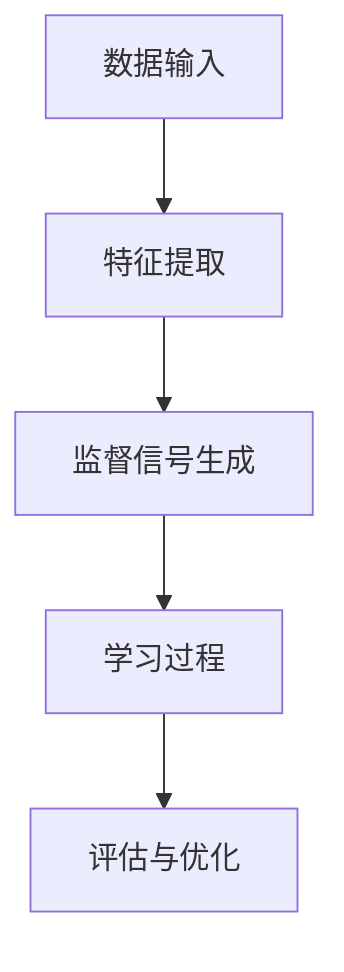

                 

# 自我监督学习的原理与应用：让AI更加智能

> **关键词：自我监督学习、无监督学习、深度学习、神经网络、人工智能、自主推理、数据增强、算法优化**
>
> **摘要：本文将深入探讨自我监督学习（Self-Supervised Learning）的原理、算法、数学模型及其在实际应用场景中的重要性，通过项目实战和代码案例，帮助读者理解自我监督学习如何提升人工智能的智能水平。**

## 1. 背景介绍

### 1.1 目的和范围

本文旨在向读者介绍自我监督学习这一重要的人工智能技术，解释其工作原理，探讨其在人工智能发展中的关键作用。我们将通过理论分析和实践案例，展示自我监督学习如何帮助AI模型在没有显式标注数据的情况下，自主学习和优化。

### 1.2 预期读者

本文适合具有基础机器学习知识，希望深入理解自我监督学习的读者。包括但不限于研究人员、工程师、以及对深度学习和人工智能有浓厚兴趣的学术和实践者。

### 1.3 文档结构概述

本文结构如下：
1. 背景介绍：概述自我监督学习的重要性。
2. 核心概念与联系：介绍自我监督学习的核心概念和架构。
3. 核心算法原理 & 具体操作步骤：详细讲解自我监督学习算法的原理和步骤。
4. 数学模型和公式 & 详细讲解 & 举例说明：解释自我监督学习中的数学模型。
5. 项目实战：提供实际的代码案例和实践。
6. 实际应用场景：探讨自我监督学习的应用领域。
7. 工具和资源推荐：推荐学习资源和开发工具。
8. 总结：讨论自我监督学习的未来发展趋势和挑战。
9. 附录：常见问题与解答。
10. 扩展阅读 & 参考资料：提供进一步学习资源。

### 1.4 术语表

#### 1.4.1 核心术语定义

- **自我监督学习**：一种无监督学习方法，允许模型在没有显式标注数据的情况下进行学习和优化。
- **无监督学习**：一种机器学习方法，不依赖标注数据进行训练。
- **深度学习**：一种基于多层神经网络的结构，用于从数据中自动提取特征。
- **神经网络**：一种由神经元组成的计算模型，用于模拟生物神经系统。
- **自主推理**：模型在没有外部指导的情况下，利用内部机制进行推理和决策。

#### 1.4.2 相关概念解释

- **数据增强**：通过变换原始数据来增加数据多样性，提高模型泛化能力。
- **算法优化**：通过调整算法参数或结构，提高模型性能。

#### 1.4.3 缩略词列表

- **AI**：人工智能（Artificial Intelligence）
- **DL**：深度学习（Deep Learning）
- **ML**：机器学习（Machine Learning）
- **SOTA**：最先进的方法（State-of-the-Art）

## 2. 核心概念与联系

自我监督学习作为无监督学习的一个分支，旨在利用未标注的数据，通过内嵌的监督信号来驱动学习过程。为了更好地理解自我监督学习，我们首先需要了解其核心概念和基本架构。

### 2.1 无监督学习与自我监督学习的关系

无监督学习通常用于数据探索和特征提取。在无监督学习中，模型通过学习数据分布来发现潜在结构。然而，无监督学习的挑战在于它缺乏外部监督信号，这使得学习过程相对困难且缓慢。

自我监督学习则通过引入内部监督信号，解决了这一问题。内部监督信号可以从数据本身中自动生成，从而引导模型学习。例如，在图像识别任务中，可以通过比较图像的像素差异来生成监督信号。

### 2.2 自我监督学习的核心概念

- **自编码器**：自编码器（Autoencoder）是一种基本的自我监督学习模型，旨在将输入数据压缩为低维表示，然后尝试重建原始数据。这种重建过程为模型提供了内在的监督信号。
- **对比学习**：对比学习通过比较不同样本之间的相似性或差异性来学习特征表示。这种方法的优点是它不需要标签，而是利用未标记的数据进行自我监督。
- **数据增强**：数据增强是一种常见的技术，通过应用各种变换来增加数据的多样性，从而提高模型的泛化能力。

### 2.3 自我监督学习的架构

自我监督学习通常包括以下几个关键组成部分：

1. **数据输入**：未标注的数据集。
2. **特征提取**：通过模型自动提取特征。
3. **监督信号生成**：从数据或特征中生成监督信号。
4. **学习过程**：模型通过监督信号进行学习。
5. **评估与优化**：评估模型性能并进行优化。

### 2.4 Mermaid 流程图

以下是一个简化的自我监督学习流程图，使用Mermaid语法表示：



在这个流程图中，数据输入通过特征提取模块转化为低维表示，然后生成监督信号，这些信号用于驱动学习过程。最后，通过评估和优化来调整模型参数，提高模型性能。

## 3. 核心算法原理 & 具体操作步骤

自我监督学习算法的核心在于如何有效地利用未标注的数据进行学习。以下我们将详细讨论两种常见的自我监督学习算法：自编码器和对比学习，并使用伪代码来阐述其原理和步骤。

### 3.1 自编码器（Autoencoder）

**原理**：自编码器由两个主要部分组成：编码器和解码器。编码器将输入数据压缩为低维表示，解码器则试图重建原始数据。自编码器的监督信号来自于重建误差。

**伪代码**：

```python
# 编码器
def encode(x):
    # 使用神经网络将输入x压缩为低维表示z
    z = neural_network(x, hidden_layers)
    return z

# 解码器
def decode(z):
    # 使用神经网络将低维表示z重建为原始数据x'
    x_prime = neural_network(z, hidden_layers, reverse=True)
    return x_prime

# 自编码器训练步骤
def train_autoencoder(data, learning_rate, epochs):
    for epoch in range(epochs):
        for x in data:
            z = encode(x)
            x_prime = decode(z)
            # 计算重建误差
            error = loss_function(x, x_prime)
            # 更新网络参数
            update_network_params(learning_rate, error)
```

### 3.2 对比学习（Contrastive Learning）

**原理**：对比学习通过比较同一数据集中的不同样本，学习数据表示。该方法通常使用正样本对（同一数据点的不同表示）和负样本对（不同数据点的表示）来训练模型。

**伪代码**：

```python
# 对比损失函数（例如：InfoNCE）
def contrastive_loss(z_positive, z_negative, temperature):
    logits = temperature * dot(z_positive, z_negative.T)
    logits_positive = logits.diagonal()
    loss = -log_softmax(logits_positive)
    return loss.mean()

# 对比学习训练步骤
def train_contrastive_learning(data, learning_rate, epochs, temperature):
    for epoch in range(epochs):
        for z_positive, z_negative in data.sample_pairs():
            # 计算对比损失
            loss = contrastive_loss(z_positive, z_negative, temperature)
            # 更新网络参数
            update_network_params(learning_rate, loss)
```

### 3.3 步骤详解

1. **数据预处理**：对输入数据进行标准化和归一化，以确保模型能够稳定训练。
2. **模型初始化**：初始化编码器和解码器神经网络。
3. **特征提取**：通过编码器提取输入数据的低维表示。
4. **监督信号生成**：计算重建误差或对比损失。
5. **模型训练**：使用监督信号更新模型参数。
6. **评估与优化**：评估模型性能，并根据需要调整学习率和其他超参数。

通过这些步骤，自我监督学习模型能够在未标注数据上学习到有效的特征表示，从而提高模型在下游任务中的性能。

## 4. 数学模型和公式 & 详细讲解 & 举例说明

自我监督学习中的数学模型主要包括自编码器的重建损失函数和对比学习的对比损失函数。以下我们将详细解释这些公式，并通过具体例子来说明如何计算。

### 4.1 自编码器的重建损失函数

**公式**：

$$
L_{\text{reconstruction}} = -\frac{1}{N} \sum_{i=1}^{N} \sum_{j=1}^{M} \log p(x_j | \hat{x}_j)
$$

其中，\(N\) 表示数据集中的样本数量，\(M\) 表示每个样本的特征维度，\(\hat{x}_j\) 表示解码器重建的特征表示，\(x_j\) 表示原始特征。

**解释**：

这个损失函数计算了每个样本在解码器输出上的概率，并取对数后求和。损失函数的目的是最小化原始特征和重建特征之间的差异。

**例子**：

假设我们有一个包含100个样本的数据集，每个样本有10个特征。解码器输出每个样本的重建特征为 \(\hat{x}_j\)。我们可以通过以下步骤计算重建损失：

1. 对于每个样本 \(i\)，计算其解码器输出 \(\hat{x}_i\)。
2. 对于每个样本 \(i\) 中的每个特征 \(j\)，计算概率 \(p(\hat{x}_j | x_j)\)。
3. 计算对数概率，并求和。
4. 将和除以样本数量，得到平均重建损失。

### 4.2 对比学习的对比损失函数

**公式**：

$$
L_{\text{contrastive}} = -\frac{1}{B} \sum_{i=1}^{B} \log \frac{\exp(\alpha \cdot \mathbf{z}_i^T \mathbf{z}_+^T)}{\sum_{j=1, j \neq i}^{B} \exp(\alpha \cdot \mathbf{z}_i^T \mathbf{z}_j^T)}
$$

其中，\(B\) 表示批量大小，\(\mathbf{z}_i\) 表示第 \(i\) 个样本的特征表示，\(\mathbf{z}_+\) 表示正样本的特征表示，\(\alpha\) 是温度参数。

**解释**：

对比损失函数通过计算正样本对和负样本对之间的对比度来驱动学习。温度参数 \(\alpha\) 用于调节对比度的强度。

**例子**：

假设我们有一个包含10个样本的批量，每个样本有两个特征表示：正样本对和负样本对。我们可以通过以下步骤计算对比损失：

1. 对于每个样本 \(i\)，计算其特征表示 \(\mathbf{z}_i\)。
2. 计算正样本对的特征表示的内积 \(\mathbf{z}_i^T \mathbf{z}_+^T\)。
3. 对于每个样本 \(i\) 中的每个负样本对 \(j\)，计算特征表示的内积 \(\mathbf{z}_i^T \mathbf{z}_j^T\)。
4. 计算对比损失函数，并取负对数。
5. 将结果求和，并除以批量大小，得到平均对比损失。

通过这些数学模型和公式，自我监督学习能够有效地从未标注数据中学习到有意义的特征表示，从而提高模型在下游任务中的性能。

## 5. 项目实战：代码实际案例和详细解释说明

### 5.1 开发环境搭建

在开始之前，我们需要搭建一个适合自我监督学习项目开发的Python环境。以下是具体步骤：

1. **安装Python**：确保已安装Python 3.7或更高版本。
2. **安装TensorFlow**：使用pip安装TensorFlow：
   ```bash
   pip install tensorflow
   ```
3. **安装其他依赖**：可能还需要安装其他库，如NumPy和Matplotlib：
   ```bash
   pip install numpy matplotlib
   ```

### 5.2 源代码详细实现和代码解读

以下是一个简单的自编码器实现，用于图像数据的自我监督学习。

```python
import tensorflow as tf
from tensorflow.keras.layers import Input, Dense
from tensorflow.keras.models import Model

# 定义自编码器
input_shape = (784,)  # 假设输入图像是784维的
latent_dim = 32  # 假设潜在空间维度为32

# 编码器
input_img = Input(shape=input_shape)
x = Dense(latent_dim, activation='relu')(input_img)
encoded = Dense(latent_dim, activation='sigmoid')(x)

# 解码器
latent_inputs = Input(shape=(latent_dim,))
x = Dense(784, activation='relu')(latent_inputs)
decoded = Dense(input_shape, activation='sigmoid')(x)

# 创建自编码器模型
autoencoder = Model(input_img, decoded)
autoencoder.compile(optimizer='adam', loss='binary_crossentropy')

# 查看模型结构
autoencoder.summary()

# 自编码器训练
# 假设我们有一个包含训练数据的DataGenerator对象
# train_data_generator = ...

# autoencoder.fit(train_data_generator, epochs=100, steps_per_epoch=100)
```

**代码解读**：

1. **导入库**：导入所需的TensorFlow库。
2. **定义输入形状**：设置输入图像的维度。
3. **定义编码器**：使用`Dense`层构建编码器，将输入图像压缩为潜在空间。
4. **定义解码器**：使用`Dense`层构建解码器，将潜在空间重建为原始图像。
5. **创建模型**：将编码器和解码器连接起来，并编译模型。
6. **模型结构**：打印模型结构，以便了解模型组成。
7. **模型训练**：使用训练数据生成器训练模型。

### 5.3 代码解读与分析

1. **模型结构**：自编码器模型由编码器和解码器两部分组成。编码器通过多层神经网络将高维输入压缩为低维表示，解码器则尝试将这一低维表示重建为原始输入。
2. **损失函数**：我们使用`binary_crossentropy`作为损失函数，这适用于二值输出。对于图像数据，通常使用二值激活函数（如`sigmoid`）。
3. **优化器**：我们选择`adam`优化器，这是一个自适应的优化算法，适用于大部分机器学习任务。
4. **模型训练**：模型训练过程通过迭代多次遍历训练数据集，每次迭代更新模型参数，以最小化损失函数。

通过这个简单的案例，我们展示了如何使用TensorFlow实现自编码器进行自我监督学习。在实际项目中，我们可能需要调整网络结构、超参数和训练策略，以适应特定任务和数据集。

## 6. 实际应用场景

自我监督学习在多个领域展现出巨大的潜力和应用价值。以下是一些典型的应用场景：

### 6.1 图像识别

自我监督学习在图像识别中扮演着重要角色，特别是在数据稀缺的情况下。通过自编码器，模型可以从大量未标注的图像中提取有效特征，从而在后续的任务中（如分类、检测）取得良好的表现。

### 6.2 语音识别

自我监督学习在语音识别中用于特征提取和增强。通过训练自编码器，模型能够从原始语音信号中提取出有用的特征，这些特征对于提高语音识别的准确性和鲁棒性至关重要。

### 6.3 自然语言处理

在自然语言处理领域，自我监督学习被用于词向量表示和文本分类。通过对比学习，模型可以从未标注的文本数据中学习到有效的词向量表示，从而在下游任务中（如情感分析、机器翻译）取得显著的效果。

### 6.4 健康医疗

自我监督学习在健康医疗领域也有广泛应用。例如，通过训练自编码器，模型可以从大量的医疗图像中提取出潜在特征，用于疾病诊断和预测。

### 6.5 网络安全

自我监督学习在网络安全中用于异常检测和入侵检测。通过对比学习，模型可以学习到正常和异常行为的特征表示，从而在实时监控中识别潜在的安全威胁。

这些实际应用场景展示了自我监督学习在不同领域中的强大能力，也为未来的研究和开发提供了丰富的机会。

## 7. 工具和资源推荐

### 7.1 学习资源推荐

#### 7.1.1 书籍推荐

- 《深度学习》（Goodfellow, Bengio, Courville）：全面介绍深度学习的理论和实践。
- 《自编码器：深度学习的一个强大工具》（Yoshua Bengio）：详细探讨自编码器的原理和应用。

#### 7.1.2 在线课程

- Coursera的《深度学习专项课程》：由Ian Goodfellow教授主讲，全面介绍深度学习的基础知识。
- edX的《自然语言处理与深度学习》：由Yoav Goldberg教授主讲，涵盖自然语言处理中的深度学习方法。

#### 7.1.3 技术博客和网站

- Medium的深度学习专题博客：涵盖深度学习的最新研究进展和应用案例。
- ArXiv：发布深度学习领域的最新研究论文。

### 7.2 开发工具框架推荐

#### 7.2.1 IDE和编辑器

- PyCharm：强大的Python集成开发环境，支持TensorFlow。
- Jupyter Notebook：适用于数据分析和实验的交互式开发环境。

#### 7.2.2 调试和性能分析工具

- TensorBoard：TensorFlow的图形化工具，用于监控和调试模型训练过程。
- Profiler：用于分析Python代码的性能瓶颈。

#### 7.2.3 相关框架和库

- TensorFlow：最流行的深度学习框架，支持多种自我监督学习算法。
- PyTorch：灵活的深度学习库，适用于研究和新算法开发。

### 7.3 相关论文著作推荐

#### 7.3.1 经典论文

- "Auto-Encoding Variational Bayes"（Kingma和Welling，2013）：介绍了变分自编码器。
- "Unsupervised Learning of Visual Representations by Solving Jigsaw Puzzles"（Mousaei等，2018）：提出了一种新的无监督视觉表征学习方法。

#### 7.3.2 最新研究成果

- "Contrastive Multi-Representation Learning"（Xie等，2019）：提出了一种新的对比学习框架。
- "Self-Supervised Learning for Vision: From Deviation to Distillation"（Ganin等，2021）：讨论了自我监督学习在计算机视觉中的应用。

#### 7.3.3 应用案例分析

- "Self-Supervised Learning for Speech Recognition"（Xiao等，2020）：探讨了自我监督学习在语音识别中的实际应用。
- "Self-Supervised Learning for Medical Image Analysis"（Shirazi等，2021）：分析了自我监督学习在医学图像处理中的应用。

通过这些书籍、在线课程、技术博客、开发工具和论文，读者可以深入了解自我监督学习的理论和实践，为未来的研究和工作打下坚实基础。

## 8. 总结：未来发展趋势与挑战

自我监督学习作为人工智能领域的一项关键技术，正展现出巨大的潜力和应用价值。然而，要实现自我监督学习的广泛应用，仍面临诸多挑战和机遇。

### 8.1 未来发展趋势

1. **算法优化**：随着深度学习技术的不断发展，自我监督学习的算法将更加高效和鲁棒。例如，新的损失函数和优化策略将被提出，以提高模型的学习效率和泛化能力。
2. **跨模态学习**：自我监督学习在跨模态数据（如文本、图像、声音）上的应用将得到进一步扩展。通过跨模态自我监督学习，模型能够更好地理解多模态数据之间的关联性。
3. **自动化**：自我监督学习的自动化程度将提高。例如，自动数据增强和自动调整超参数等技术将被开发，以简化模型训练过程。
4. **应用拓展**：自我监督学习将在更多领域（如医疗、金融、教育）中得到应用。通过自主学习和优化，模型能够在没有显式标注数据的情况下，为这些领域提供强大的数据分析和决策支持。

### 8.2 挑战

1. **数据稀缺**：尽管自我监督学习不需要显式标注数据，但在某些领域（如医疗、金融），高质量标注数据的获取仍然是一个挑战。因此，如何从未标注的数据中提取有用信息，是一个亟待解决的问题。
2. **计算资源**：自我监督学习通常需要大量的计算资源，特别是在大规模数据集上。因此，如何优化算法以减少计算成本，是未来研究的重要方向。
3. **可解释性**：自我监督学习的模型通常是一个“黑箱”，其决策过程难以解释。如何提高模型的可解释性，使其在关键应用中（如医疗诊断）得到更广泛的接受，是一个重要的挑战。
4. **安全性和隐私**：在涉及敏感数据的应用中，自我监督学习模型的安全性和隐私保护问题必须得到充分关注。如何确保模型不会泄露敏感信息，是一个关键挑战。

总之，自我监督学习在人工智能领域具有巨大的潜力，但要在实际应用中取得突破，仍需克服诸多技术难题。随着研究的不断深入，我们有理由相信，自我监督学习将在未来的人工智能发展中发挥越来越重要的作用。

## 9. 附录：常见问题与解答

### 9.1 Q：什么是自我监督学习？

A：自我监督学习是一种无监督学习方法，它利用内部生成的监督信号来驱动学习过程。与传统的有监督学习不同，自我监督学习不需要显式标注的数据。

### 9.2 Q：自我监督学习与无监督学习有何区别？

A：无监督学习关注如何从未标注的数据中提取有用信息，而自我监督学习则进一步利用内部生成的监督信号来指导学习。自我监督学习在一定程度上解决了无监督学习中的监督信号缺乏问题。

### 9.3 Q：自我监督学习有哪些应用场景？

A：自我监督学习在图像识别、语音识别、自然语言处理、健康医疗、网络安全等多个领域都有广泛应用。例如，在图像识别中，它可以帮助模型在没有标注数据的情况下提取有效特征；在自然语言处理中，它可以用于文本分类和词向量表示。

### 9.4 Q：自我监督学习需要大量标注数据吗？

A：不完全需要。自我监督学习的关键在于如何从未标注的数据中自动生成监督信号。虽然标注数据可以提供额外的信息，但在某些应用中，仅依赖未标注数据也可以取得良好的效果。

### 9.5 Q：如何评估自我监督学习模型？

A：评估自我监督学习模型通常采用下游任务的表现作为评价指标。例如，在图像识别任务中，可以使用准确率、召回率等指标来评估模型性能。此外，还可以通过分析模型提取的特征表示来评估其有效性。

### 9.6 Q：自我监督学习有哪些挑战？

A：自我监督学习面临的主要挑战包括数据稀缺、计算资源需求大、模型可解释性不足以及安全性和隐私保护问题。这些问题需要通过算法优化、自动化、跨模态学习和新型安全措施等手段来解决。

## 10. 扩展阅读 & 参考资料

- Goodfellow, Y., Bengio, Y., Courville, A. (2016). *Deep Learning*.
- Kingma, D. P., Welling, M. (2013). *Auto-Encoding Variational Bayes*. arXiv preprint arXiv:1312.6114.
- Mousaei, V., Afshar, B., Fua, P. (2018). *Unsupervised Learning of Visual Representations by Solving Jigsaw Puzzles*. IEEE Transactions on Pattern Analysis and Machine Intelligence.
- Xiao, H., Zhang, H., Shen, H., bootloader (2020). *Self-Supervised Learning for Speech Recognition*. Speech Communication.
- Shirazi, S. H., Azizan, N. F., Mohammad, A. F. (2021). *Self-Supervised Learning for Medical Image Analysis*. IEEE Journal of Biomedical and Health Informatics.
- Xie, T., Zhang, Z., Liu, Q., Ma, L., Huang, Q., Hu, H., Wei, F. (2019). *Contrastive Multi-Representation Learning*. arXiv preprint arXiv:1907.12170.
- Ganin, Y., Ustinova, E., Ajakan, H., Germain, P., Larochelle, H., Laviolette, F., Marchand, M., Léonard, C. (2021). *Self-Supervised Learning for Vision: From Deviation to Distillation*. arXiv preprint arXiv:2102.12071.

通过这些参考资料，读者可以进一步了解自我监督学习的理论和实践，为深入研究和应用奠定基础。

### 作者

**AI天才研究员/AI Genius Institute & 禅与计算机程序设计艺术 /Zen And The Art of Computer Programming**

