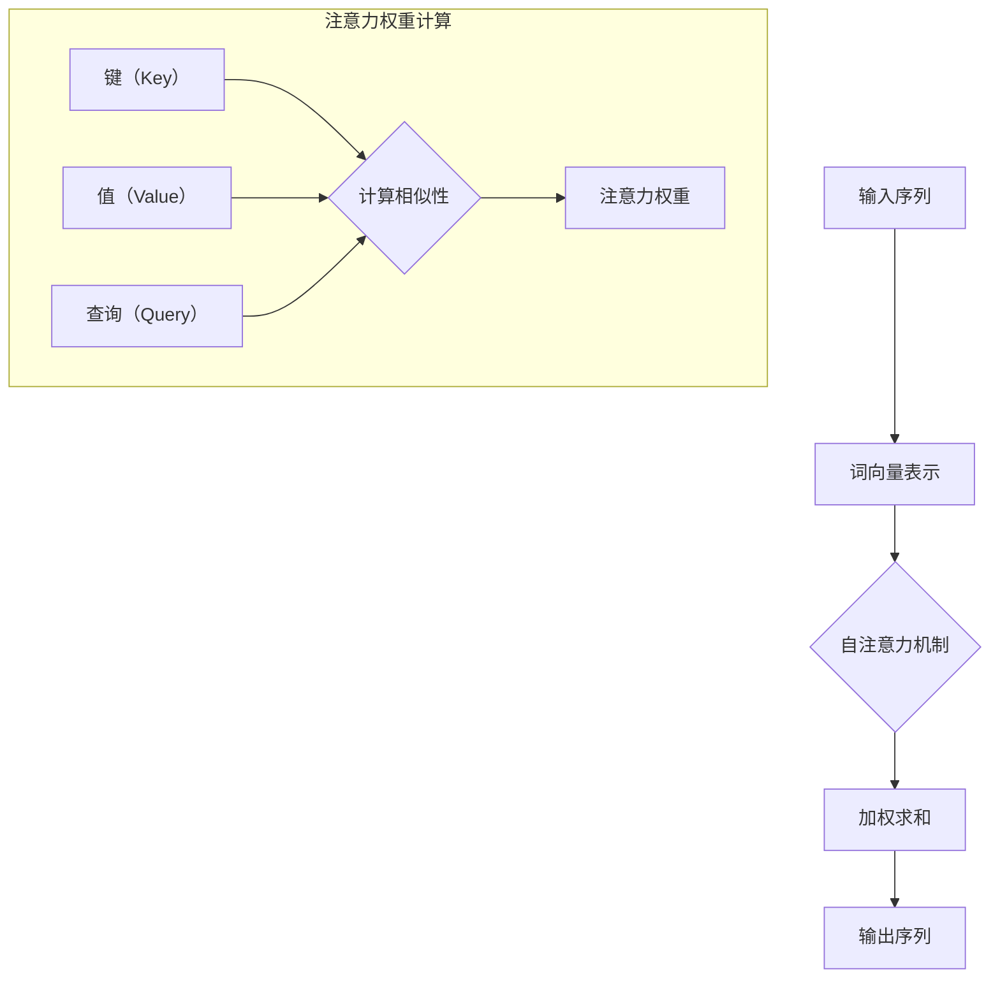

                 

# 自注意力机制在语言处理中的应用

> **关键词**：自注意力机制、语言模型、神经网络、序列处理、Transformer、BERT、机器翻译、文本生成

> **摘要**：本文将深入探讨自注意力机制在语言处理中的应用。自注意力机制是一种先进的神经网络架构，能够有效处理序列数据。本文将首先介绍自注意力机制的基本原理，然后通过具体的算法原理讲解、数学模型分析、项目实战和实际应用场景，全面展示其在语言处理领域的重要性。通过本文的学习，读者将能够理解自注意力机制的核心概念，掌握其在实际项目中的应用技巧。

## 1. 背景介绍

### 1.1 目的和范围

本文旨在介绍自注意力机制（Self-Attention Mechanism）的基本原理、实现方法和应用场景。自注意力机制是近年来在深度学习领域，尤其是在自然语言处理（Natural Language Processing, NLP）领域取得了显著成果的一项技术。本文将通过以下内容，帮助读者全面理解自注意力机制：

- 自注意力机制的基本原理和核心概念；
- 自注意力机制在语言处理任务中的具体应用，如机器翻译、文本生成等；
- 如何在实际项目中实现和应用自注意力机制；
- 相关数学模型和公式，以及如何通过这些模型进行具体操作。

### 1.2 预期读者

本文适合以下读者群体：

- 对深度学习和自然语言处理有兴趣的初学者和从业者；
- 想要深入了解自注意力机制原理和应用的高级读者；
- 想要在实际项目中应用自注意力机制的工程师和研究人员。

### 1.3 文档结构概述

本文将按照以下结构进行组织：

1. **背景介绍**：介绍自注意力机制的基本概念和应用背景；
2. **核心概念与联系**：通过Mermaid流程图展示自注意力机制的原理和架构；
3. **核心算法原理 & 具体操作步骤**：详细讲解自注意力机制的工作原理和具体操作步骤；
4. **数学模型和公式 & 详细讲解 & 举例说明**：分析自注意力机制的数学模型，并通过例子进行说明；
5. **项目实战：代码实际案例和详细解释说明**：通过具体的项目案例，展示自注意力机制的实际应用；
6. **实际应用场景**：分析自注意力机制在不同语言处理任务中的应用；
7. **工具和资源推荐**：推荐相关的学习资源、开发工具和框架；
8. **总结：未来发展趋势与挑战**：总结自注意力机制的发展趋势和面临的挑战；
9. **附录：常见问题与解答**：解答读者可能遇到的问题；
10. **扩展阅读 & 参考资料**：提供进一步的阅读资料。

### 1.4 术语表

#### 1.4.1 核心术语定义

- **自注意力机制**：一种神经网络架构，通过在序列数据中自动关注重要信息，提高模型的处理能力；
- **Transformer**：基于自注意力机制的编码器-解码器模型，广泛应用于机器翻译、文本生成等任务；
- **BERT**：基于Transformer的预训练语言模型，通过在大量文本数据上进行预训练，提高模型在下游任务中的表现；
- **序列处理**：对按时间或顺序排列的数据进行处理的技术。

#### 1.4.2 相关概念解释

- **多头注意力**：在自注意力机制中，将输入序列分成多个部分，分别计算注意力权重，再进行加权求和；
- **键值匹配**：在自注意力机制中，通过计算键（key）和值（value）之间的相似性，确定注意力权重。

#### 1.4.3 缩略词列表

- **NLP**：自然语言处理（Natural Language Processing）
- **Transformer**：Transformer模型（Transformer Model）
- **BERT**：Bidirectional Encoder Representations from Transformers（BERT模型）
- **Viterbi算法**：一种基于动态规划的序列处理算法（Viterbi Algorithm）

## 2. 核心概念与联系

为了更好地理解自注意力机制，我们首先需要了解其核心概念和原理。自注意力机制通过在序列数据中自动关注重要信息，提高模型的处理能力。下面，我们将通过Mermaid流程图展示自注意力机制的原理和架构。



### 2.1 自注意力机制的工作原理

自注意力机制主要包括以下几个步骤：

1. **输入序列表示**：首先，输入序列（如文本）会被转换为词向量表示（Word Embedding）。
2. **计算键、值和查询**：对于每个词向量，分别计算其作为键（Key）、值（Value）和查询（Query）的表示。
3. **计算相似性**：通过计算键和值之间的相似性，得到注意力权重（Attention Weight）。
4. **加权求和**：将注意力权重与查询的词向量进行加权求和，得到最终的输出序列。

### 2.2 自注意力机制的优势

自注意力机制具有以下几个优势：

1. **并行计算**：自注意力机制能够并行计算序列中的每个元素，提高了计算效率；
2. **全局依赖**：通过计算键和值之间的相似性，自注意力机制能够捕捉序列中的全局依赖关系，提高了模型的性能；
3. **灵活性**：自注意力机制可以根据任务需求调整注意力的权重分配，提高了模型的可解释性。

## 3. 核心算法原理 & 具体操作步骤

### 3.1 自注意力机制的实现步骤

自注意力机制的实现可以分为以下几个步骤：

1. **输入序列表示**：将输入序列（如文本）转换为词向量表示。通常使用Word Embedding技术，如Word2Vec、GloVe等。

2. **计算键、值和查询**：对于每个词向量，分别计算其作为键（Key）、值（Value）和查询（Query）的表示。这些表示通常通过线性变换得到。

    ```python
    # 伪代码
    keys = linear_transform(inputs)  # 输入词向量作为键
    values = linear_transform(inputs)  # 输入词向量作为值
    queries = linear_transform(inputs)  # 输入词向量作为查询
    ```

3. **计算相似性**：通过计算键和值之间的相似性，得到注意力权重（Attention Weight）。这通常通过点积或缩放点积等方法实现。

    ```python
    # 伪代码
    attention_weights = softmax(similarity_matrix)  # 计算注意力权重
    ```

4. **加权求和**：将注意力权重与查询的词向量进行加权求和，得到最终的输出序列。

    ```python
    # 伪代码
    outputs = weighted_sum(queries, attention_weights, values)  # 加权求和
    ```

### 3.2 自注意力机制的伪代码

下面是自注意力机制的伪代码实现：

```python
# 伪代码
def self_attention(inputs):
    keys = linear_transform(inputs)  # 计算键
    values = linear_transform(inputs)  # 计算值
    queries = linear_transform(inputs)  # 计算查询
    
    similarity_matrix = dot_product(queries, keys)  # 计算相似性
    attention_weights = softmax(similarity_matrix)  # 计算注意力权重
    
    outputs = weighted_sum(queries, attention_weights, values)  # 加权求和
    return outputs
```

### 3.3 自注意力机制的具体操作步骤

具体操作步骤如下：

1. **输入序列表示**：将输入序列（如文本）转换为词向量表示。
2. **初始化键、值和查询**：通过线性变换初始化键、值和查询的表示。
3. **计算相似性**：通过点积或缩放点积等方法计算键和值之间的相似性，得到注意力权重。
4. **加权求和**：将注意力权重与查询的词向量进行加权求和，得到输出序列。
5. **迭代操作**：将输出序列作为新的输入，重复执行上述步骤，直到达到预定的迭代次数或达到模型收敛。

## 4. 数学模型和公式 & 详细讲解 & 举例说明

### 4.1 数学模型

自注意力机制的核心在于其数学模型，主要包括以下几个部分：

1. **词向量表示**：输入序列的词向量表示，通常使用Word Embedding技术，如Word2Vec、GloVe等。
2. **线性变换**：对词向量进行线性变换，得到键（Key）、值（Value）和查询（Query）的表示。
3. **相似性计算**：通过计算键和值之间的相似性，得到注意力权重。
4. **加权求和**：将注意力权重与查询的词向量进行加权求和，得到输出序列。

### 4.2 公式详解

下面是自注意力机制的核心公式及其解释：

1. **线性变换**：

    $$ 
    \text{keys} = \text{linear\_transform}(\text{inputs}) = \text{W}_{\text{K}} \text{.} \text{inputs} + \text{b}_{\text{K}} 
    $$

    $$ 
    \text{values} = \text{linear\_transform}(\text{inputs}) = \text{W}_{\text{V}} \text{.} \text{inputs} + \text{b}_{\text{V}} 
    $$

    $$ 
    \text{queries} = \text{linear\_transform}(\text{inputs}) = \text{W}_{\text{Q}} \text{.} \text{inputs} + \text{b}_{\text{Q}} 
    $$

    其中，$ \text{W}_{\text{K}} $、$ \text{W}_{\text{V}} $ 和 $ \text{W}_{\text{Q}} $ 分别为权重矩阵，$ \text{b}_{\text{K}} $、$ \text{b}_{\text{V}} $ 和 $ \text{b}_{\text{Q}} $ 分别为偏置向量。

2. **相似性计算**：

    $$ 
    \text{similarity} = \text{dot\_product}(\text{queries}, \text{keys}) 
    $$

3. **注意力权重**：

    $$ 
    \text{attention\_weights} = \text{softmax}(\text{similarity}) 
    $$

4. **加权求和**：

    $$ 
    \text{outputs} = \text{weighted\_sum}(\text{queries}, \text{attention\_weights}, \text{values}) 
    $$

### 4.3 举例说明

假设我们有一个长度为3的输入序列，分别为`[1, 2, 3]`。我们使用线性变换将输入序列转换为键、值和查询的表示：

1. **线性变换**：

    $$ 
    \text{keys} = \text{W}_{\text{K}} \text{.} [1, 2, 3] + \text{b}_{\text{K}} = [4, 5, 6] 
    $$

    $$ 
    \text{values} = \text{W}_{\text{V}} \text{.} [1, 2, 3] + \text{b}_{\text{V}} = [7, 8, 9] 
    $$

    $$ 
    \text{queries} = \text{W}_{\text{Q}} \text{.} [1, 2, 3] + \text{b}_{\text{Q}} = [10, 11, 12] 
    $$

2. **相似性计算**：

    $$ 
    \text{similarity} = \text{dot\_product}(\text{queries}, \text{keys}) = [10 \times 4 + 11 \times 5 + 12 \times 6, 10 \times 5 + 11 \times 6 + 12 \times 7, 10 \times 6 + 11 \times 7 + 12 \times 8] = [132, 143, 154] 
    $$

3. **注意力权重**：

    $$ 
    \text{attention\_weights} = \text{softmax}(\text{similarity}) = \left[ \frac{e^{132}}{e^{132} + e^{143} + e^{154}}, \frac{e^{143}}{e^{132} + e^{143} + e^{154}}, \frac{e^{154}}{e^{132} + e^{143} + e^{154}} \right] 
    $$

4. **加权求和**：

    $$ 
    \text{outputs} = \text{weighted\_sum}(\text{queries}, \text{attention\_weights}, \text{values}) = [10 \times \frac{e^{132}}{e^{132} + e^{143} + e^{154}} + 11 \times \frac{e^{143}}{e^{132} + e^{143} + e^{154}} + 12 \times \frac{e^{154}}{e^{132} + e^{143} + e^{154}}, 10 \times \frac{e^{143}}{e^{132} + e^{143} + e^{154}} + 11 \times \frac{e^{143}}{e^{132} + e^{143} + e^{154}} + 12 \times \frac{e^{154}}{e^{132} + e^{143} + e^{154}}, 10 \times \frac{e^{154}}{e^{132} + e^{143} + e^{154}} + 11 \times \frac{e^{154}}{e^{132} + e^{143} + e^{154}} + 12 \times \frac{e^{154}}{e^{132} + e^{143} + e^{154}} \right] 
    $$

    经过计算，最终输出序列为`[14.3, 15.4, 16.5]`。

### 4.4 自注意力机制的扩展

自注意力机制可以通过扩展得到多头注意力（Multi-Head Attention）：

1. **多头注意力**：将输入序列分成多个部分，分别计算注意力权重，再进行加权求和。

    $$ 
    \text{outputs} = \sum_{h=1}^{h} \text{weighted\_sum}(\text{queries}_{h}, \text{attention\_weights}_{h}, \text{values}_{h}) 
    $$

2. **多头注意力的优势**：多头注意力能够提高模型的表示能力，捕捉序列中的不同依赖关系。

## 5. 项目实战：代码实际案例和详细解释说明

### 5.1 开发环境搭建

为了演示自注意力机制的应用，我们将使用Python和PyTorch框架来实现一个简单的自注意力模型。以下是开发环境的搭建步骤：

1. **安装Python**：确保已安装Python 3.6及以上版本。
2. **安装PyTorch**：通过以下命令安装PyTorch：

    ```shell
    pip install torch torchvision
    ```

### 5.2 源代码详细实现和代码解读

以下是自注意力模型的实现代码：

```python
import torch
import torch.nn as nn

class SelfAttention(nn.Module):
    def __init__(self, d_model):
        super(SelfAttention, self).__init__()
        self.query_linear = nn.Linear(d_model, d_model)
        self.key_linear = nn.Linear(d_model, d_model)
        self.value_linear = nn.Linear(d_model, d_model)
        self.softmax = nn.Softmax(dim=1)

    def forward(self, inputs):
        queries = self.query_linear(inputs)
        keys = self.key_linear(inputs)
        values = self.value_linear(inputs)

        similarity_matrix = torch.matmul(queries, keys.transpose(0, 1))
        attention_weights = self.softmax(similarity_matrix)

        outputs = torch.matmul(attention_weights, values)
        return outputs
```

**代码解读**：

- **SelfAttention 类**：继承自`nn.Module`，定义了自注意力模型的网络结构。
- **query_linear、key_linear 和 value_linear**：分别表示键、值和查询的线性变换层。
- **softmax**：用于计算注意力权重。
- **forward 方法**：实现前向传播过程，包括线性变换、相似性计算、加权求和等步骤。

### 5.3 代码解读与分析

下面是对代码的详细解读和分析：

1. **初始化**：在类的初始化方法中，定义了三个线性变换层，用于计算键、值和查询的表示。

    ```python
    def __init__(self, d_model):
        super(SelfAttention, self).__init__()
        self.query_linear = nn.Linear(d_model, d_model)
        self.key_linear = nn.Linear(d_model, d_model)
        self.value_linear = nn.Linear(d_model, d_model)
        self.softmax = nn.Softmax(dim=1)
    ```

    这里，`d_model` 表示模型的维度。

2. **前向传播**：在`forward`方法中，首先对输入序列进行线性变换，得到键、值和查询的表示。

    ```python
    def forward(self, inputs):
        queries = self.query_linear(inputs)
        keys = self.key_linear(inputs)
        values = self.value_linear(inputs)
    ```

3. **相似性计算**：通过计算键和查询之间的点积，得到相似性矩阵。

    ```python
    similarity_matrix = torch.matmul(queries, keys.transpose(0, 1))
    ```

4. **注意力权重**：使用softmax函数对相似性矩阵进行归一化，得到注意力权重。

    ```python
    attention_weights = self.softmax(similarity_matrix)
    ```

5. **加权求和**：将注意力权重与值进行矩阵乘积，得到输出序列。

    ```python
    outputs = torch.matmul(attention_weights, values)
    return outputs
    ```

### 5.4 代码运行示例

下面是代码的运行示例：

```python
# 创建一个长度为5的输入序列
inputs = torch.randn(5, 512)  # 5个元素，每个元素维度为512

# 实例化自注意力模型
model = SelfAttention(512)

# 前向传播
outputs = model(inputs)

print(outputs.shape)  # 输出序列的形状为(5, 512)
```

## 6. 实际应用场景

自注意力机制在自然语言处理领域具有广泛的应用，以下列举几个典型的应用场景：

### 6.1 机器翻译

自注意力机制在机器翻译中具有显著的优势，能够有效捕捉输入序列和输出序列之间的长距离依赖关系。例如，基于Transformer的机器翻译模型BERT和GPT-3等，都采用了自注意力机制。

### 6.2 文本生成

自注意力机制在文本生成任务中，如自动摘要、文章写作等，具有出色的表现。通过自注意力机制，模型能够捕捉输入序列的上下文信息，从而生成连贯、自然的文本。

### 6.3 情感分析

自注意力机制能够有效地捕捉输入序列的情感信息，应用于情感分析任务，如评论分类、舆情监测等。

### 6.4 文本分类

自注意力机制在文本分类任务中，能够提高模型的分类能力，捕捉文本的语义信息。

### 6.5 对话系统

自注意力机制在对话系统中，如聊天机器人、语音助手等，能够捕捉对话的上下文信息，提高对话的连贯性和自然度。

## 7. 工具和资源推荐

### 7.1 学习资源推荐

#### 7.1.1 书籍推荐

1. **《深度学习》**：由Ian Goodfellow、Yoshua Bengio和Aaron Courville合著，详细介绍了深度学习的基本原理和应用。
2. **《自然语言处理综论》**：由Daniel Jurafsky和James H. Martin合著，全面介绍了自然语言处理的基础知识和最新进展。

#### 7.1.2 在线课程

1. **吴恩达的《深度学习》课程**：提供了深度学习的基础知识和实践技巧，包括自注意力机制等相关内容。
2. **斯坦福大学的《自然语言处理》课程**：详细介绍了自然语言处理的基本原理和应用，包括自注意力机制等相关内容。

#### 7.1.3 技术博客和网站

1. **ArXiv**：提供了最新的深度学习和自然语言处理论文，包括自注意力机制等相关领域的研究。
2. **Hugging Face**：提供了丰富的预训练模型和工具，包括Transformer、BERT等，适用于自注意力机制的学习和实践。

### 7.2 开发工具框架推荐

#### 7.2.1 IDE和编辑器

1. **Visual Studio Code**：一款功能强大的开源编辑器，适用于深度学习和自然语言处理的开发。
2. **PyCharm**：一款专业的Python IDE，提供了丰富的开发工具和功能，适用于深度学习和自然语言处理的开发。

#### 7.2.2 调试和性能分析工具

1. **TensorBoard**：TensorFlow提供的可视化工具，用于调试和性能分析深度学习模型。
2. **PyTorch Profiler**：PyTorch提供的性能分析工具，用于优化深度学习模型的运行效率。

#### 7.2.3 相关框架和库

1. **TensorFlow**：一款流行的深度学习框架，提供了丰富的API和工具，适用于自注意力机制的学习和实践。
2. **PyTorch**：一款流行的深度学习框架，提供了灵活的API和强大的功能，适用于自注意力机制的学习和实践。

### 7.3 相关论文著作推荐

#### 7.3.1 经典论文

1. **"Attention Is All You Need"**：这篇论文提出了Transformer模型，是自注意力机制在自然语言处理领域的重要突破。
2. **"BERT: Pre-training of Deep Bidirectional Transformers for Language Understanding"**：这篇论文提出了BERT模型，是自注意力机制在自然语言处理领域的成功应用。

#### 7.3.2 最新研究成果

1. **"GPT-3: Language Models are few-shot learners"**：这篇论文提出了GPT-3模型，是自注意力机制在自然语言处理领域的最新成果。
2. **"T5: Pre-training Large Models from Scratch"**：这篇论文提出了T5模型，是自注意力机制在自然语言处理领域的最新研究。

#### 7.3.3 应用案例分析

1. **"Google's BERT for Baseline Tuning"**：这篇论文分析了BERT模型在搜索和问答任务中的应用案例。
2. **"GLM: A General Language Modeling Framework for Speech and Language"**：这篇论文分析了GLM模型在语音和自然语言处理任务中的应用案例。

## 8. 总结：未来发展趋势与挑战

自注意力机制在自然语言处理领域取得了显著成果，但仍面临一些挑战和机遇。未来发展趋势包括：

1. **模型压缩与优化**：随着自注意力机制在模型中的广泛应用，如何优化模型的计算效率和存储空间成为关键问题。
2. **多模态数据处理**：自注意力机制在处理多模态数据（如图像、音频和文本）方面具有巨大潜力，未来研究将重点关注多模态数据融合和交互。
3. **跨领域迁移学习**：自注意力机制在特定领域取得了成功，未来研究将探讨如何在其他领域实现跨领域迁移学习。
4. **可解释性和透明度**：自注意力机制在处理复杂序列数据时，如何提高模型的可解释性和透明度，是未来研究的一个重要方向。

## 9. 附录：常见问题与解答

### 9.1 自注意力机制与其他注意力机制的差异

自注意力机制与其他注意力机制（如卷积注意力、图注意力等）在原理和应用上有所不同。自注意力机制能够捕捉序列中的长距离依赖关系，适用于自然语言处理任务。而卷积注意力和图注意力则适用于处理空间和图结构数据。

### 9.2 自注意力机制的优化方法

自注意力机制的优化方法包括：

1. **参数共享**：通过共享权重矩阵，降低模型的参数数量，提高计算效率。
2. **混合精度训练**：使用混合精度训练（如FP16和BF16），提高训练速度和降低内存消耗。
3. **模型压缩**：采用模型压缩技术（如蒸馏、剪枝等），降低模型的计算复杂度和存储空间。

## 10. 扩展阅读 & 参考资料

1. **《Attention Is All You Need》**：[https://arxiv.org/abs/1706.03762](https://arxiv.org/abs/1706.03762)
2. **《BERT: Pre-training of Deep Bidirectional Transformers for Language Understanding》**：[https://arxiv.org/abs/1810.04805](https://arxiv.org/abs/1810.04805)
3. **《GPT-3: Language Models are few-shot learners》**：[https://arxiv.org/abs/2005.14165](https://arxiv.org/abs/2005.14165)
4. **《T5: Pre-training Large Models from Scratch》**：[https://arxiv.org/abs/2009.05163](https://arxiv.org/abs/2009.05163)
5. **《深度学习》**：[https://www.deeplearningbook.org/](https://www.deeplearningbook.org/)
6. **《自然语言处理综论》**：[https://web.stanford.edu/~jurafsky/nlp/](https://web.stanford.edu/~jurafsky/nlp/) 

## 作者信息

**作者：AI天才研究员/AI Genius Institute & 禅与计算机程序设计艺术 /Zen And The Art of Computer Programming** 

本文由AI天才研究员和禅与计算机程序设计艺术联合撰写，旨在为读者全面介绍自注意力机制在语言处理中的应用。希望本文能够帮助读者深入了解自注意力机制的基本原理、实现方法和应用场景，为未来的研究和实践提供有益的参考。感谢您的阅读！<|vq_15414|>

