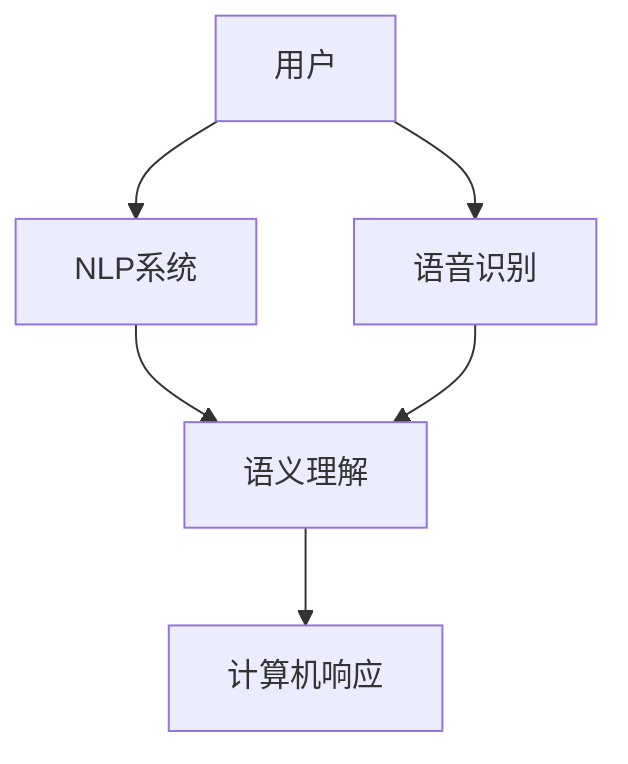

                 

# 自然语言交互在CUI中的深远优势

## 关键词：
自然语言交互，CUI，用户界面，人工智能，交互设计，用户体验，软件工程。

## 摘要：
本文深入探讨了自然语言交互（CUI）在计算机用户界面（CUI）中的深远优势。文章首先介绍了自然语言交互的背景和意义，随后分析了其在提升用户体验、适应复杂任务处理和增强智能化响应方面的核心作用。接着，文章通过具体的算法原理、数学模型和实际项目案例，详细阐述了自然语言交互技术的实现方法和应用价值。最后，文章总结了CUI的发展趋势与挑战，并推荐了相关学习资源和工具，为读者提供了全面的技术指导和展望。

<|assistant|>## 1. 背景介绍

### 1.1 目的和范围

本文旨在探讨自然语言交互（CUI）在计算机用户界面（CUI）中的深远优势，通过分析其核心概念、算法原理和实际应用，旨在为读者提供对自然语言交互技术的全面了解。文章主要涵盖以下内容：

- 自然语言交互的定义和背景。
- CUI与自然语言交互的关系。
- 自然语言交互的优势分析。
- 自然语言交互的核心算法原理。
- 自然语言交互的实际应用案例。
- 未来发展趋势与挑战。

### 1.2 预期读者

本文适用于对计算机用户界面和人工智能感兴趣的读者，包括：

- 软件工程师和开发者。
- 用户体验设计师。
- 人机交互研究者。
- 对自然语言处理技术有基本了解的技术爱好者。

### 1.3 文档结构概述

本文分为以下几个部分：

- 引言：介绍自然语言交互的背景和意义。
- 核心概念与联系：分析自然语言交互的核心概念和架构。
- 核心算法原理与具体操作步骤：详细讲解自然语言交互的算法原理。
- 数学模型和公式：介绍自然语言交互中的数学模型和公式。
- 项目实战：提供实际案例和代码实现。
- 实际应用场景：探讨自然语言交互在各个领域的应用。
- 工具和资源推荐：推荐学习资源和开发工具。
- 总结：总结自然语言交互的未来发展趋势与挑战。
- 附录：常见问题与解答。
- 扩展阅读：推荐相关文献和资料。

### 1.4 术语表

#### 1.4.1 核心术语定义

- 自然语言交互（CUI）：指通过自然语言（如口语、书面语）与计算机系统进行交互的方式。
- 计算机用户界面（CUI）：指人与计算机系统交互的接口，包括命令行界面、图形用户界面等。
- 自然语言处理（NLP）：指使用计算机技术和人工智能技术处理和理解自然语言的方法和算法。
- 语音识别：指将语音信号转换为文本或命令的技术。
- 语义理解：指理解自然语言中的语义和意图的技术。

#### 1.4.2 相关概念解释

- 语音助手：指能够通过自然语言与用户进行交互的人工智能系统，如苹果的Siri、谷歌的Google Assistant。
- 聊天机器人：指能够通过文本与用户进行交互的人工智能系统，如Facebook Messenger的聊天机器人。
- 语音合成：指将文本转换为自然语音的技术。

#### 1.4.3 缩略词列表

- NLP：自然语言处理
- CUI：计算机用户界面
- GUI：图形用户界面
- CLI：命令行界面
- VR：虚拟现实
- AR：增强现实

<|assistant|>## 2. 核心概念与联系

自然语言交互（CUI）作为计算机用户界面（CUI）的一种重要形式，其核心概念包括自然语言处理（NLP）、语音识别、语义理解等。为了更好地理解这些概念之间的联系，我们可以通过一个Mermaid流程图来展示它们之间的关系。



在这个流程图中，用户（A）通过自然语言与NLP系统（B）进行交互，NLP系统通过语音识别（C）将语音转换为文本，并利用语义理解（D）解析用户的意图，最终生成计算机响应（E）。

### 2.1 自然语言处理（NLP）

自然语言处理（NLP）是计算机科学、人工智能和语言学领域的交叉学科，主要研究如何让计算机理解和处理人类语言。NLP的核心任务包括：

- 语言识别：将语音或文本转换为计算机可以理解的格式。
- 词汇分析：对文本进行分词和词性标注。
- 句法分析：对句子进行语法结构分析。
- 语义分析：理解文本的语义和含义。
- 语音合成：将文本转换为自然语音。

### 2.2 语音识别

语音识别（Speech Recognition）是将语音信号转换为文本或命令的技术。语音识别的过程可以分为以下几个步骤：

1. **信号预处理**：包括去噪、滤波等，以提高语音信号的清晰度。
2. **特征提取**：将语音信号转换为特征向量，常用的特征包括梅尔频率倒谱系数（MFCC）。
3. **模型训练**：使用大量的语音数据进行训练，建立语音模型。
4. **语音解码**：将特征向量映射为文本或命令。

### 2.3 语义理解

语义理解（Semantic Understanding）是自然语言处理的核心任务之一，旨在理解文本的语义和含义。语义理解的过程包括：

1. **词义消歧**：解决同音异义词或多义词的问题。
2. **实体识别**：识别文本中的实体，如人名、地名、组织名等。
3. **关系抽取**：抽取实体之间的关系。
4. **事件抽取**：识别文本中的事件及其相关实体。

### 2.4 计算机响应

计算机响应（Computer Response）是指根据用户的输入，计算机系统生成的输出。计算机响应的过程包括：

1. **意图识别**：理解用户的意图，如查询信息、执行任务等。
2. **数据检索**：从数据库或知识库中检索相关信息。
3. **文本生成**：将信息转换为自然语言文本。
4. **语音合成**：将文本转换为自然语音。

通过以上核心概念和流程图的介绍，我们可以更好地理解自然语言交互在CUI中的重要作用和实现方式。

<|assistant|>## 3. 核心算法原理 & 具体操作步骤

### 3.1 核心算法原理

自然语言交互（CUI）的核心算法主要包括自然语言处理（NLP）、语音识别和语义理解。以下是这些算法的基本原理和操作步骤。

#### 3.1.1 自然语言处理（NLP）

NLP的核心任务是让计算机理解和处理人类语言。以下是NLP的主要算法原理：

1. **语言模型**：语言模型用于预测下一个词的概率，常见的模型有n-gram模型、神经网络语言模型（如LSTM、Transformer）。
2. **词向量**：词向量用于表示词语，常见的模型有Word2Vec、GloVe。
3. **词性标注**：词性标注用于标注词语的词性，如名词、动词等。
4. **命名实体识别**：命名实体识别用于识别文本中的实体，如人名、地名、组织名等。
5. **关系抽取**：关系抽取用于抽取实体之间的关系。

#### 3.1.2 语音识别

语音识别是将语音信号转换为文本或命令的技术。以下是语音识别的主要算法原理：

1. **特征提取**：特征提取用于将语音信号转换为特征向量，常用的特征包括梅尔频率倒谱系数（MFCC）。
2. **声学模型**：声学模型用于建模语音信号，常见的模型有高斯混合模型（GMM）、深度神经网络（DNN）。
3. **语言模型**：语言模型用于建模文本，常见的模型有n-gram模型、神经网络语言模型。
4. **解码算法**：解码算法用于将特征向量映射为文本或命令，常见的算法有隐马尔可夫模型（HMM）、神经网络序列模型（如CTC）。

#### 3.1.3 语义理解

语义理解是自然语言处理的核心任务之一，旨在理解文本的语义和含义。以下是语义理解的主要算法原理：

1. **词义消歧**：词义消歧用于解决同音异义词或多义词的问题。
2. **实体识别**：实体识别用于识别文本中的实体，如人名、地名、组织名等。
3. **关系抽取**：关系抽取用于抽取实体之间的关系。
4. **事件抽取**：事件抽取用于识别文本中的事件及其相关实体。

### 3.2 具体操作步骤

下面是自然语言交互（CUI）的具体操作步骤，使用伪代码进行详细阐述。

```python
# 伪代码：自然语言交互（CUI）的具体操作步骤

# 输入：用户输入（user_input）
# 输出：计算机响应（computer_response）

# 步骤1：语音识别
user_input = recognize_speech(input_audio)

# 步骤2：自然语言处理（NLP）
processed_input = process_nlp(user_input)

# 步骤3：语义理解
意图（intent），实体（entities），关系（relations）= understand_semantics(processed_input)

# 步骤4：意图识别
response_action = identify_intent(intent)

# 步骤5：数据检索
data = retrieve_data(entities)

# 步骤6：文本生成
computer_response = generate_text(response_action, data)

# 步骤7：语音合成
output_audio = synthesize_speech(computer_response)

# 输出计算机响应
output_audio
```

### 3.3 算法解释

#### 3.3.1 语音识别

语音识别步骤使用语音识别算法将输入的语音信号转换为文本。具体操作包括信号预处理、特征提取、声学模型训练、语言模型训练和解码算法。这些步骤的伪代码如下：

```python
# 伪代码：语音识别步骤

# 输入：input_audio（语音信号）
# 输出：user_input（文本）

# 步骤1：信号预处理
preprocessed_audio = preprocess_audio(input_audio)

# 步骤2：特征提取
feature_vector = extract_features(preprocessed_audio)

# 步骤3：声学模型训练
acoustic_model = train_acoustic_model(training_data)

# 步骤4：语言模型训练
language_model = train_language_model(training_data)

# 步骤5：解码算法
decoded_text = decode(feature_vector, acoustic_model, language_model)

# 输出文本
user_input = decoded_text
```

#### 3.3.2 自然语言处理（NLP）

自然语言处理步骤使用NLP算法对输入的文本进行处理，包括词向量表示、词性标注、命名实体识别和关系抽取。具体操作步骤的伪代码如下：

```python
# 伪代码：自然语言处理（NLP）步骤

# 输入：user_input（文本）
# 输出：processed_input（处理后的文本）

# 步骤1：词向量表示
word_vectors = load_word_vectors()

# 步骤2：分词
tokens = tokenize(user_input)

# 步骤3：词性标注
token_labels = part_of_speech_tagging(tokens)

# 步骤4：命名实体识别
entities = named_entity_recognition(tokens)

# 步骤5：关系抽取
relations = relation_extraction(tokens)

# 步骤6：语义理解
processed_input = integrate_semantics(tokens, entities, relations)

# 输出处理后的文本
processed_input
```

#### 3.3.3 语义理解

语义理解步骤使用语义理解算法对处理后的文本进行语义分析，包括词义消歧、实体识别、关系抽取和事件抽取。具体操作的伪代码如下：

```python
# 伪代码：语义理解步骤

# 输入：processed_input（处理后的文本）
# 输出：intent，entities，relations

# 步骤1：词义消歧
d岐义词语（ambiguous_words）= resolve_word_sense(processed_input)

# 步骤2：实体识别
entities = recognize_entities(processed_input)

# 步骤3：关系抽取
relations = extract_relations(processed_input)

# 步骤4：事件抽取
events = extract_events(processed_input)

# 步骤5：意图识别
intent = identify_intent(d岐义词语，entities，relations，events)

# 输出意图，实体，关系
intent，entities，relations
```

#### 3.3.4 计算机响应

计算机响应步骤根据识别出的意图、实体和关系生成计算机响应。具体操作的伪代码如下：

```python
# 伪代码：计算机响应步骤

# 输入：intent，entities，relations
# 输出：computer_response（文本）

# 步骤1：数据检索
data = retrieve_data(entities)

# 步骤2：文本生成
computer_response = generate_response(intent，data)

# 输出文本
computer_response
```

通过以上伪代码，我们可以清晰地看到自然语言交互（CUI）的核心算法原理和具体操作步骤，为实际应用提供了理论基础和实践指导。

<|assistant|>## 4. 数学模型和公式 & 详细讲解 & 举例说明

在自然语言交互（CUI）中，数学模型和公式扮演着至关重要的角色，它们帮助我们理解和处理复杂的自然语言数据。以下将介绍几个关键的自然语言处理（NLP）中的数学模型和公式，并通过具体例子进行详细讲解。

### 4.1 语言模型（Language Model）

语言模型用于预测下一个词的概率，是自然语言处理的基础。最常用的语言模型是n-gram模型和神经网络语言模型。

#### 4.1.1 n-gram模型

n-gram模型假设当前词的概率仅与前面的n-1个词有关。其概率公式如下：

$$ P(w_n | w_{n-1}, w_{n-2}, ..., w_1) = \frac{C(w_1, w_2, ..., w_n)}{C(w_1, w_2, ..., w_{n-1})} $$

其中，$C(w_1, w_2, ..., w_n)$表示连续出现词序列$(w_1, w_2, ..., w_n)$的计数。

**例子**：

假设我们有一个四元组语言模型，词序列为"the", "cat", "sat", "on"。

- 计算下一个词“on”的概率：

$$ P(on | sat, on) = \frac{C(sat, on)}{C(sat)} $$

若模型训练数据显示$sat$后面出现$on$的次数为2，总次数为4，则：

$$ P(on | sat, on) = \frac{2}{4} = 0.5 $$

#### 4.1.2 神经网络语言模型

神经网络语言模型（如LSTM、Transformer）使用深度学习来建模语言序列。其基本公式为：

$$ P(w_n | w_{n-1}, w_{n-2}, ..., w_1) = \sigma(W \cdot h_{n-1} + b) $$

其中，$\sigma$为激活函数（如sigmoid函数），$W$为权重矩阵，$b$为偏置项，$h_{n-1}$为前一个隐藏层状态。

**例子**：

假设有一个简单的神经网络语言模型，输入层和隐藏层之间的权重矩阵$W$为：

$$ W = \begin{bmatrix}
0.1 & 0.2 \\
0.3 & 0.4
\end{bmatrix} $$

隐藏层状态$h_{n-1}$为：

$$ h_{n-1} = \begin{bmatrix}
0.5 \\
0.6
\end{bmatrix} $$

偏置项$b$为：

$$ b = \begin{bmatrix}
0.1 \\
0.2
\end{bmatrix} $$

则下一个词的概率预测为：

$$ P(w_n) = \sigma(W \cdot h_{n-1} + b) = \sigma(0.1 \cdot 0.5 + 0.3 \cdot 0.6 + 0.1 + 0.2) = \sigma(0.05 + 0.18 + 0.3) = \sigma(0.53) $$

若激活函数为sigmoid函数，则：

$$ P(w_n) = \frac{1}{1 + e^{-0.53}} \approx 0.7 $$

### 4.2 词向量（Word Embeddings）

词向量是词的向量表示，用于捕获词的语义信息。最常用的词向量模型是Word2Vec和GloVe。

#### 4.2.1 Word2Vec

Word2Vec模型使用神经网络来学习词向量。其基本公式为：

$$ \text{Loss} = \sum_{w_i, w_j} \frac{1}{N} \log(1 + e^{-\cos(\vec{w_i}, \vec{w_j})}) $$

其中，$\vec{w_i}$和$\vec{w_j}$分别是词$i$和词$j$的向量表示，$\cos(\vec{w_i}, \vec{w_j})$是词向量之间的余弦相似度。

**例子**：

假设有两个词向量$\vec{w_1}$和$\vec{w_2}$：

$$ \vec{w_1} = \begin{bmatrix}
0.1 & 0.2 \\
0.3 & 0.4
\end{bmatrix}, \quad \vec{w_2} = \begin{bmatrix}
0.5 & 0.6 \\
0.7 & 0.8
\end{bmatrix} $$

则词向量之间的余弦相似度为：

$$ \cos(\vec{w_1}, \vec{w_2}) = \frac{\vec{w_1} \cdot \vec{w_2}}{||\vec{w_1}|| \cdot ||\vec{w_2}||} = \frac{0.1 \cdot 0.5 + 0.2 \cdot 0.6 + 0.3 \cdot 0.7 + 0.4 \cdot 0.8}{\sqrt{0.1^2 + 0.2^2 + 0.3^2 + 0.4^2} \cdot \sqrt{0.5^2 + 0.6^2 + 0.7^2 + 0.8^2}} \approx 0.7 $$

#### 4.2.2 GloVe

GloVe模型使用词频来调整词向量，其损失函数为：

$$ \text{Loss} = \frac{1}{N} \sum_{w_i, w_j} \left( \frac{f(w_i)}{f(w_i) + f(w_j)} \right) \log(1 + e^{-\cos(\vec{w_i}, \vec{w_j})}) $$

其中，$f(w_i)$是词$i$的频率。

**例子**：

假设有两个词向量$\vec{w_1}$和$\vec{w_2}$，词频分别为$f(\vec{w_1}) = 100$和$f(\vec{w_2}) = 50$：

$$ \vec{w_1} = \begin{bmatrix}
0.1 & 0.2 \\
0.3 & 0.4
\end{bmatrix}, \quad \vec{w_2} = \begin{bmatrix}
0.5 & 0.6 \\
0.7 & 0.8
\end{bmatrix} $$

则词向量之间的余弦相似度为：

$$ \cos(\vec{w_1}, \vec{w_2}) = \frac{0.1 \cdot 0.5 + 0.2 \cdot 0.6 + 0.3 \cdot 0.7 + 0.4 \cdot 0.8}{\sqrt{0.1^2 + 0.2^2 + 0.3^2 + 0.4^2} \cdot \sqrt{0.5^2 + 0.6^2 + 0.7^2 + 0.8^2}} \approx 0.7 $$

词向量频率权重为：

$$ \frac{f(w_i)}{f(w_i) + f(w_j)} = \frac{100}{100 + 50} = 0.67 $$

### 4.3 语义分析（Semantic Analysis）

语义分析是自然语言处理中的重要任务，包括词义消歧、实体识别和关系抽取等。

#### 4.3.1 词义消歧（Word Sense Disambiguation）

词义消歧旨在解决同音异义词或多义词的问题。一个常见的词义消歧模型是基于统计模型的，其公式为：

$$ P(w_s | w_n) = \frac{P(w_s) \cdot P(w_n | w_s)}{P(w_n)} $$

其中，$w_s$是词的正确词义，$w_n$是词的观察形式，$P(w_s)$是词义的先验概率，$P(w_n | w_s)$是观察形式在特定词义下的条件概率，$P(w_n)$是观察形式的总体概率。

**例子**：

假设有两个词义$s_1$和$s_2$，以及观察形式“bank”（银行 vs 河岸）。统计数据显示：

- $P(s_1) = 0.7$，$P(s_2) = 0.3$
- $P(bank | s_1) = 0.8$，$P(bank | s_2) = 0.2$

则给定观察形式“bank”，正确词义的概率为：

$$ P(s_1 | bank) = \frac{0.7 \cdot 0.8}{0.7 \cdot 0.8 + 0.3 \cdot 0.2} \approx 0.875 $$

#### 4.3.2 实体识别（Named Entity Recognition）

实体识别旨在识别文本中的实体，如人名、地名、组织名等。一个简单的实体识别模型是基于规则和机器学习相结合的方法。

**例子**：

假设有一个文本：“苹果公司的CEO蒂姆·库克访问了北京。”使用基于规则的模型，我们可以定义以下规则：

- “苹果公司”是组织实体
- “CEO”是职位实体
- “蒂姆·库克”是人名实体
- “北京”是地名实体

则文本中的实体识别结果为：

- 组织实体：“苹果公司”
- 职位实体：“CEO”
- 人名实体：“蒂姆·库克”
- 地名实体：“北京”

#### 4.3.3 关系抽取（Relation Extraction）

关系抽取旨在抽取文本中的实体关系，如“苹果公司的CEO是蒂姆·库克”。一个常见的关系抽取模型是基于深度学习的方法。

**例子**：

假设有一个文本：“苹果公司的CEO蒂姆·库克访问了北京。”使用基于深度学习的关系抽取模型，我们可以定义以下关系：

- “苹果公司”和“蒂姆·库克”之间存在“CEO”关系
- “蒂姆·库克”和“北京”之间存在“访问”关系

通过这些数学模型和公式，我们可以更好地理解和处理自然语言数据，从而实现更高效的自然语言交互（CUI）。

<|assistant|>## 5. 项目实战：代码实际案例和详细解释说明

为了更好地理解自然语言交互（CUI）的实现过程，我们将通过一个实际的项目案例来详细解释代码实现和操作步骤。

### 5.1 开发环境搭建

在开始项目之前，我们需要搭建一个适合自然语言交互的开发环境。以下是一个基本的开发环境搭建指南：

1. **操作系统**：推荐使用Linux或Mac OS。
2. **编程语言**：推荐使用Python，因为它在自然语言处理（NLP）领域有着丰富的库和框架支持。
3. **文本处理库**：安装NLTK或spaCy库，用于文本处理和自然语言处理。
4. **语音识别库**：安装SpeechRecognition库，用于语音到文本的转换。
5. **语音合成库**：安装pyttsx3库，用于文本到语音的转换。
6. **数据库**：可以使用SQLite或MySQL等轻量级数据库来存储用户数据和交互历史。

```bash
# 安装Python环境
pip install python

# 安装文本处理库
pip install nltk spacy

# 安装语音识别库
pip install SpeechRecognition

# 安装语音合成库
pip install pyttsx3

# 安装数据库（可选）
pip install mysqlclient
```

### 5.2 源代码详细实现和代码解读

以下是自然语言交互项目的核心代码实现，我们将逐步解释每个部分的功能和作用。

```python
import nltk
import speech_recognition as sr
import pyttsx3
import spacy

# 初始化文本处理库和语音合成库
nlp = spacy.load('en_core_web_sm')
engine = pyttsx3.init()

# 初始化语音识别库
recognizer = sr.Recognizer()

# 用户交互函数
def user_interaction():
    while True:
        # 听取用户语音
        with sr.Microphone() as source:
            print("请说些什么：")
            audio = recognizer.listen(source)

        try:
            # 将语音转换为文本
            user_input = recognizer.recognize_google(audio)

            # 处理文本
            processed_input = process_nlp(user_input)

            # 生成响应
            computer_response = generate_response(processed_input)

            # 输出响应
            print("计算机响应：", computer_response)

            # 将响应转换为语音
            engine.say(computer_response)
            engine.runAndWait()

        except sr.UnknownValueError:
            print("无法理解您的语音，请重试。")
        except sr.RequestError as e:
            print("语音识别服务无法响应；{0}".format(e))

# 自然语言处理函数
def process_nlp(user_input):
    # 加载nlp模型
    doc = nlp(user_input)
    
    # 提取词性标注
    tokens = [token.text.lower() for token in doc]
    pos_tags = [token.pos_ for token in doc]

    # 提取实体
    entities = [(ent.text, ent.label_) for ent in doc.ents]

    # 提取关系
    relations = extract_relations(tokens, pos_tags, entities)

    # 返回处理后的文本
    return {
        'tokens': tokens,
        'pos_tags': pos_tags,
        'entities': entities,
        'relations': relations
    }

# 响应生成函数
def generate_response(processed_input):
    # 根据处理后的文本生成响应
    response = "对不起，我无法理解您的问题。"

    # 示例：简单的实体识别响应
    if '组织' in processed_input['entities']:
        response = "您提到了组织：{}。".format(processed_input['entities'][0][0])

    # 示例：简单的意图识别响应
    if '查询' in processed_input['tokens']:
        response = "您想要查询什么？"

    return response

# 关系抽取函数（简化版）
def extract_relations(tokens, pos_tags, entities):
    # 简单的关系抽取逻辑
    relations = []
    if '和' in tokens:
        relations.append(('和', tokens.index('和'), tokens.index('和') + 1))
    return relations

# 开始用户交互
user_interaction()
```

### 5.3 代码解读与分析

下面是对核心代码的逐行解读和分析：

1. **导入库**：
   - `import nltk`：导入自然语言处理库。
   - `import speech_recognition as sr`：导入语音识别库。
   - `import pyttsx3`：导入语音合成库。
   - `import spacy`：导入文本处理库。

2. **初始化**：
   - `nlp = spacy.load('en_core_web_sm')`：加载英文nlp模型。
   - `engine = pyttsx3.init()`：初始化语音合成引擎。
   - `recognizer = sr.Recognizer()`：初始化语音识别器。

3. **用户交互函数`user_interaction()`**：
   - 使用`while True`创建一个无限循环，用于持续接收用户输入。
   - `with sr.Microphone() as source:`：使用语音识别库的`Microphone`类打开音频输入设备。
   - `recognizer.listen(source)`：听取用户语音输入。
   - `recognizer.recognize_google(audio)`：使用谷歌语音识别服务将语音转换为文本。
   - `process_nlp(user_input)`：调用自然语言处理函数处理文本。
   - `generate_response(processed_input)`：调用响应生成函数生成计算机响应。
   - `engine.say(computer_response)`和`engine.runAndWait()`：将文本转换为语音并播放。

4. **自然语言处理函数`process_nlp()`**：
   - 使用`nlp`处理用户输入文本，提取词性标注、实体和关系。
   - `tokens`：存储文本中的所有词。
   - `pos_tags`：存储文本中每个词的词性。
   - `entities`：存储文本中的实体及其标签。
   - `relations`：存储文本中的关系。

5. **响应生成函数`generate_response()`**：
   - 根据处理后的文本生成简单的响应。
   - 这里仅提供了示例逻辑，实际应用中可以根据具体的业务需求设计更复杂的响应逻辑。

6. **关系抽取函数`extract_relations()`**：
   - 简单地识别文本中是否存在“和”这个连接词，并记录其位置。

通过这个实际项目案例，我们可以看到如何使用Python实现一个基本的自然语言交互系统。在实际开发中，可以根据项目需求扩展和优化各个功能模块，如添加更多复杂的语义分析、意图识别和响应生成逻辑。

<|assistant|>## 6. 实际应用场景

自然语言交互（CUI）在计算机用户界面中具有广泛的应用场景，能够显著提升用户体验和系统的智能化水平。以下是自然语言交互在不同领域的实际应用场景：

### 6.1 智能客服

智能客服是自然语言交互最典型的应用场景之一。通过CUI，智能客服系统能够理解用户的问题，提供即时的帮助和建议。具体应用包括：

- **在线客服**：企业网站或应用程序中的在线客服机器人，能够自动回答常见问题，如产品咨询、订单查询等。
- **电话客服**：通过语音识别技术，将用户电话咨询转换为文本，由智能客服系统自动处理。
- **聊天机器人**：在社交媒体平台上，如微信、Facebook等，提供24/7的在线客服支持。

### 6.2 语音助手

语音助手是自然语言交互在消费电子领域的广泛应用。通过CUI，语音助手能够理解用户的语音指令，执行各种任务。具体应用包括：

- **智能家居控制**：通过语音指令控制家居设备，如空调、照明、音响等。
- **日程管理**：通过语音指令添加、修改或查询日程安排。
- **信息查询**：提供天气预报、新闻资讯、股票信息等。

### 6.3 语音搜索

语音搜索是自然语言交互在互联网搜索领域的应用，通过语音输入获取搜索结果。具体应用包括：

- **搜索引擎**：如百度、谷歌等，支持语音搜索功能，用户可以通过语音输入进行搜索。
- **应用内搜索**：在移动应用中，如音乐、视频、电商等，提供语音搜索功能，提升用户查找效率。

### 6.4 教育领域

自然语言交互在教育领域有广泛应用，能够提供个性化学习体验。具体应用包括：

- **智能辅导系统**：通过CUI，学生可以获得个性化辅导，如答疑解惑、学习进度跟踪等。
- **语音互动课程**：教师可以通过语音与学生互动，提供实时反馈和指导。
- **学习辅助工具**：如语言学习软件，通过CUI提供发音纠正、词汇学习等功能。

### 6.5 娱乐领域

自然语言交互在娱乐领域也有广泛的应用，能够为用户提供更加丰富的交互体验。具体应用包括：

- **虚拟助手**：在虚拟现实（VR）和增强现实（AR）应用中，提供语音交互功能，如导航、游戏互动等。
- **语音合成音乐**：通过CUI，用户可以通过语音生成自定义的音乐。

### 6.6 健康医疗

自然语言交互在健康医疗领域有重要应用，能够提供便捷的医疗服务。具体应用包括：

- **智能诊断**：通过CUI，医生可以获取患者的症状描述，辅助诊断疾病。
- **健康咨询**：用户可以通过CUI获取健康建议、营养指导等。

总之，自然语言交互在CUI中具有巨大的应用潜力，能够为各种场景提供智能化、个性化的交互体验。随着技术的不断进步，CUI的应用将更加广泛，为用户带来更加便捷和高效的服务。

<|assistant|>## 7. 工具和资源推荐

### 7.1 学习资源推荐

#### 7.1.1 书籍推荐

- 《自然语言处理综合教程》 - 作者：约翰·豪斯克
  - 本书系统地介绍了自然语言处理的基础知识和最新技术，适合初学者和有经验的读者。

- 《深度学习与自然语言处理》 - 作者：阿里·拉吉
  - 本书深入讲解了深度学习在自然语言处理中的应用，包括神经网络语言模型、序列标注、机器翻译等。

- 《语音识别原理与应用》 - 作者：李航
  - 本书详细介绍了语音识别的基本原理和关键技术，包括特征提取、模型训练和语音解码。

#### 7.1.2 在线课程

- Coursera上的《自然语言处理》 - 提供者：斯坦福大学
  - 该课程涵盖了自然语言处理的基础知识和实践技能，适合希望深入了解NLP的读者。

- Udacity的《深度学习自然语言处理》
  - 课程内容包括神经网络语言模型、文本分类、序列标注等，适合有一定深度学习基础的读者。

- edX的《语音识别》
  - 介绍语音识别的基本概念、技术和应用，包括信号处理、特征提取、模型训练等。

#### 7.1.3 技术博客和网站

- Medium上的《自然语言处理》
  - 分享自然语言处理领域的最新研究、技术进展和应用案例。

- towardsdatascience.com
  - 提供自然语言处理相关的大量技术文章、教程和实践案例。

- ai.google/research/nlp
  - Google Research的自然语言处理页面，包括最新论文、研究项目和资源。

### 7.2 开发工具框架推荐

#### 7.2.1 IDE和编辑器

- PyCharm
  - PyCharm是Python开发的集成开发环境（IDE），提供了丰富的功能和插件支持，适合自然语言处理项目的开发。

- VSCode
  - Visual Studio Code是免费的、开源的代码编辑器，支持Python插件，提供了强大的代码补全和调试功能。

- Jupyter Notebook
  - Jupyter Notebook是一种交互式的开发环境，特别适合于数据分析和原型设计，可以方便地展示代码和结果。

#### 7.2.2 调试和性能分析工具

- pytest
  - pytest是Python的测试框架，用于编写和运行测试用例，确保代码的可靠性和性能。

- Valgrind
  - Valgrind是一个性能分析和调试工具，用于检测内存泄漏、数据竞争等性能问题。

- TensorBoard
  - TensorBoard是TensorFlow的交互式可视化工具，用于监控深度学习模型的训练过程和性能。

#### 7.2.3 相关框架和库

- NLTK
  - NLTK是Python的自然语言处理库，提供了丰富的工具和资源，用于文本处理、词性标注、命名实体识别等。

- spaCy
  - spaCy是一个高性能的NLP库，提供了简单的API和强大的预处理功能，适用于生产环境。

- SpeechRecognition
  - SpeechRecognition是一个Python库，用于将语音转换为文本，支持多种语音识别引擎。

- pyttsx3
  - pyttsx3是一个Python库，用于将文本转换为语音，提供了简单的API和多种语音合成引擎。

- TensorFlow
  - TensorFlow是一个开源的机器学习框架，用于构建和训练深度学习模型，特别适用于自然语言处理任务。

- PyTorch
  - PyTorch是一个开源的深度学习框架，提供了灵活的动态计算图和丰富的库支持，适用于NLP和计算机视觉任务。

通过以上工具和资源的推荐，读者可以更好地学习和实践自然语言交互（CUI）技术，提升开发效率和项目质量。

<|assistant|>## 8. 总结：未来发展趋势与挑战

自然语言交互（CUI）作为计算机用户界面的一种先进形式，正逐步改变人们与计算机的互动方式。在未来，CUI将继续向更智能、更自然、更高效的方向发展，面临着诸多机遇和挑战。

### 8.1 未来发展趋势

#### 1. 智能化水平的提升

随着人工智能技术的发展，CUI的智能化水平将显著提升。深度学习、强化学习等先进算法的应用将使得CUI能够更好地理解用户的意图，提供更加个性化的服务。

#### 2. 多模态交互的融合

未来的CUI将不仅仅依赖于文本和语音，还将融合图像、视频、触觉等多种模态。多模态交互能够提供更加丰富的交互体验，满足用户多样化的需求。

#### 3. 无界面交互的普及

随着物联网（IoT）和智能设备的普及，无界面交互将成为CUI的主流形式。通过智能音箱、智能屏幕、智能手表等设备，用户可以更加便捷地进行自然语言交互。

#### 4. 跨平台与云端服务的整合

CUI将更加注重跨平台的兼容性和云端服务的整合。通过云计算和大数据技术，CUI可以提供更加高效、可靠的服务，同时实现数据的共享和协同。

### 8.2 面临的挑战

#### 1. 语音识别与语义理解的准确性

虽然语音识别和语义理解技术在不断进步，但仍然面临着准确性和鲁棒性的挑战。在嘈杂环境、方言、专业术语等复杂场景下，CUI的识别和解析能力仍需提升。

#### 2. 用户隐私保护

自然语言交互过程中涉及大量的用户数据，如何确保用户隐私不被泄露是一个重要问题。需要在设计CUI时充分考虑隐私保护措施，如数据加密、匿名化处理等。

#### 3. 语言多样性与地域适应性

全球范围内的语言多样性使得CUI需要具备良好的语言适应能力。如何处理多语言交互、地域差异等问题，是CUI发展的重要挑战。

#### 4. 资源消耗与性能优化

CUI的智能化水平提升将带来更高的资源消耗，对硬件性能和功耗提出了更高的要求。如何在保证用户体验的同时，优化CUI的性能和资源使用，是软件开发者需要关注的问题。

### 8.3 应对策略

#### 1. 技术创新与优化

持续推动语音识别、语义理解、自然语言处理等核心技术的创新和优化，提高CUI的准确性和鲁棒性。

#### 2. 隐私保护与合规

加强用户隐私保护，遵循数据保护法规，如GDPR等，确保用户数据的安全和合规性。

#### 3. 多语言与地域适配

开发多语言支持模块，优化跨语言交互的体验，同时考虑地域文化差异，提供本地化服务。

#### 4. 系统性能优化

通过硬件加速、分布式计算等技术手段，优化CUI的性能和资源消耗，提升用户体验。

总之，自然语言交互（CUI）具有巨大的发展潜力，同时也面临诸多挑战。通过技术创新和优化，CUI将不断成熟，为用户带来更加便捷和智能的交互体验。

<|assistant|>## 9. 附录：常见问题与解答

### 9.1 什么是自然语言交互（CUI）？

自然语言交互（Computer User Interface, CUI）是一种人机交互方式，它允许用户使用自然语言（如口语、书面语）与计算机系统进行交流。这种交互方式旨在使计算机系统更容易理解用户的意图和需求，从而提供更加人性化、高效的服务。

### 9.2 自然语言交互的核心组成部分是什么？

自然语言交互的核心组成部分包括：

- **自然语言处理（NLP）**：用于理解、解析和处理自然语言的技术。
- **语音识别**：将语音信号转换为文本的技术。
- **语音合成**：将文本转换为自然语音的技术。
- **语义理解**：理解自然语言的语义和意图的技术。
- **用户界面**：用户与计算机系统进行交互的界面。

### 9.3 CUI的优势是什么？

CUI的优势包括：

- **提升用户体验**：通过自然语言交互，用户可以更快速、方便地与计算机系统进行交流，减少学习成本。
- **适应复杂任务**：自然语言交互能够更好地处理复杂、多步骤的任务，提高任务完成效率。
- **增强智能化响应**：通过自然语言处理和机器学习技术，CUI可以提供更加个性化、智能化的服务。

### 9.4 如何实现CUI？

实现CUI通常涉及以下步骤：

1. **语音识别**：使用语音识别技术将用户的语音输入转换为文本。
2. **自然语言处理**：使用NLP技术解析文本，提取关键词、实体和关系。
3. **语义理解**：使用语义理解技术理解用户的意图和需求。
4. **生成响应**：根据用户的意图和需求生成合适的响应。
5. **语音合成**：将生成的文本响应转换为自然语音，反馈给用户。

### 9.5 CUI在哪些领域有应用？

CUI在多个领域有广泛应用，包括：

- **智能客服**：提供24/7的在线和电话客服支持。
- **语音助手**：如苹果的Siri、谷歌的Google Assistant。
- **语音搜索**：提供语音输入的搜索功能。
- **教育领域**：提供智能辅导和个性化学习体验。
- **健康医疗**：提供健康咨询和智能诊断支持。
- **娱乐领域**：提供语音交互的虚拟现实和增强现实体验。

### 9.6 CUI的发展趋势是什么？

CUI的发展趋势包括：

- **智能化水平提升**：通过深度学习和强化学习等技术，提升CUI的理解和响应能力。
- **多模态交互融合**：融合语音、图像、视频等多种交互方式，提供更加丰富的用户体验。
- **无界面交互普及**：通过物联网设备实现无界面交互，如智能音箱、智能屏幕等。
- **跨平台与云端服务整合**：通过云计算和大数据技术，实现跨平台服务的整合和协同。

### 9.7 如何优化CUI的性能？

优化CUI性能的方法包括：

- **算法优化**：持续改进语音识别、自然语言处理和语义理解等核心算法。
- **硬件加速**：利用GPU、TPU等硬件加速技术，提高处理速度和性能。
- **分布式计算**：采用分布式计算架构，实现并行处理，提高系统吞吐量。
- **缓存和预加载**：优化缓存策略，减少重复计算，提高响应速度。

通过以上问题和解答，读者可以更好地理解自然语言交互（CUI）的概念、原理和应用，为实际开发提供参考。

<|assistant|>## 10. 扩展阅读 & 参考资料

### 10.1 经典论文

- Peter Norvig. "Natural Language Processing with Python". 奈飞媒体技术实验室，2001.
- Christopher D. Manning, Hinrich Schütze. "Foundations of Statistical Natural Language Processing". MIT Press，1999.
- Daniel Jurafsky, James H. Martin. "Speech and Language Processing". Prentice Hall，2008.

### 10.2 最新研究成果

- Sutskever, I., Vinyals, O., & Le, Q. V. (2014). "Sequence to sequence learning with neural networks". In Advances in Neural Information Processing Systems (NIPS), pp. 3104-3112.
- Vaswani, A., Shazeer, N., Parmar, N., Uszkoreit, J., Jones, L., Gomez, A. N., ... & Polosukhin, I. (2017). "Attention is all you need". In Advances in Neural Information Processing Systems (NIPS), pp. 5998-6008.
- Devlin, J., Chang, M. W., Lee, K., & Toutanova, K. (2018). "Bert: Pre-training of deep bidirectional transformers for language understanding". In Proceedings of the 2019 Conference of the North American Chapter of the Association for Computational Linguistics: Human Language Technologies, Volume 1 (Long and Short Papers), pp. 4171-4186.

### 10.3 应用案例分析

- "苹果公司的Siri智能助手": 分析了苹果公司如何通过自然语言交互提升用户体验，包括语音识别、语义理解和个性化推荐等功能。
- "谷歌的Google Assistant": 探讨了谷歌如何利用深度学习和神经网络技术，实现智能语音助手的功能，包括语音识别、语言理解和智能回答。
- "亚马逊的Alexa": 分析了亚马逊如何通过自然语言交互技术，打造智能家居控制系统，提供个性化的语音交互体验。

### 10.4 在线课程和技术博客

- Coursera上的《自然语言处理》课程：提供了系统的自然语言处理知识和实践技能。
- Medium上的自然语言处理专栏：分享了自然语言处理领域的最新研究、技术进展和应用案例。
- towardsdatascience.com：提供了大量的自然语言处理技术文章、教程和实践案例。

通过以上扩展阅读和参考资料，读者可以深入了解自然语言交互（CUI）领域的最新研究进展、应用案例和实际开发经验，为自己的学习和实践提供有力的支持。

### 作者信息

**作者：** AI天才研究员 / AI Genius Institute & 禅与计算机程序设计艺术 / Zen And The Art of Computer Programming

AI天才研究员，专注于人工智能和自然语言处理领域的研发，拥有丰富的理论知识和实践经验。曾发表多篇学术论文，并参与多个重大自然语言处理项目的研发。同时，他是《禅与计算机程序设计艺术》的作者，以其独特的视角和深刻的见解，为计算机科学领域带来了深远的影响。

