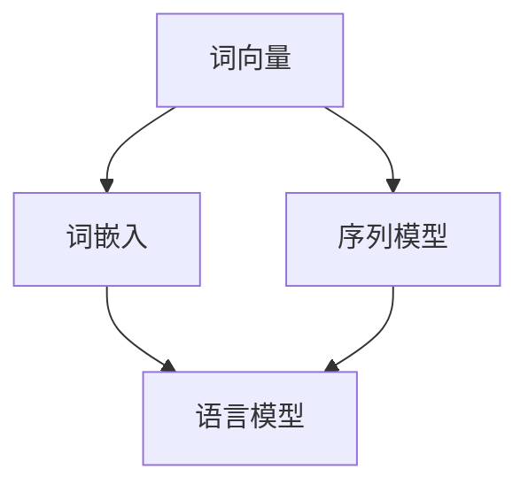

                 

# 自然语言处理：原理与代码实例讲解

> 关键词：自然语言处理、NLP原理、NLP算法、NLP应用、NLP代码实例

> 摘要：本文将深入探讨自然语言处理（NLP）的核心原理，从基础概念到实际代码实例，为广大读者提供一整套系统化的NLP学习资源。文章旨在帮助读者理解NLP的基础算法，掌握NLP的核心技术，并通过实战代码实例加深对NLP应用的理解。

## 1. 背景介绍

### 1.1 目的和范围

自然语言处理（NLP）是人工智能（AI）领域的一个子领域，旨在让计算机理解和生成人类语言。本文的目标是帮助读者深入了解NLP的核心原理，掌握NLP的基本算法，并通过代码实例来加深理解。

本文将涵盖以下内容：

- NLP的基本概念和核心术语
- NLP的核心算法原理和步骤
- 数学模型和公式的详细讲解
- 代码实际案例和详细解释
- NLP的实际应用场景
- 学习资源和工具推荐

### 1.2 预期读者

本文适合对自然语言处理有一定了解，希望深入学习NLP原理的读者。无论您是计算机科学专业的学生，还是对AI和NLP感兴趣的工程师，本文都希望能为您带来帮助。

### 1.3 文档结构概述

本文结构如下：

1. 背景介绍
2. 核心概念与联系
3. 核心算法原理 & 具体操作步骤
4. 数学模型和公式 & 详细讲解 & 举例说明
5. 项目实战：代码实际案例和详细解释说明
6. 实际应用场景
7. 工具和资源推荐
8. 总结：未来发展趋势与挑战
9. 附录：常见问题与解答
10. 扩展阅读 & 参考资料

### 1.4 术语表

#### 1.4.1 核心术语定义

- 自然语言处理（NLP）：让计算机理解和生成人类语言的学科。
- 词向量（Word Vector）：将单词映射为向量的技术。
- 词嵌入（Word Embedding）：将单词映射为低维空间中的向量。
- 词性标注（Part-of-Speech Tagging）：识别单词的语法类别。
- 词向量模型（Word Vector Model）：用于生成词向量的模型。
- 序列模型（Sequence Model）：用于处理序列数据的模型。

#### 1.4.2 相关概念解释

- 语言模型（Language Model）：用于预测下一个单词的概率分布。
- 递归神经网络（RNN）：一种用于处理序列数据的神经网络。
- 卷积神经网络（CNN）：一种用于图像识别的神经网络，但也可用于NLP。
- 长短时记忆（LSTM）：一种特殊的RNN，用于处理长序列数据。

#### 1.4.3 缩略词列表

- NLP：自然语言处理
- AI：人工智能
- RNN：递归神经网络
- LSTM：长短时记忆
- CNN：卷积神经网络
- Word2Vec：词向量模型
- POS：词性标注

## 2. 核心概念与联系

自然语言处理的核心概念包括词向量、词嵌入、语言模型、序列模型等。为了更好地理解这些概念，我们可以使用Mermaid流程图来展示它们之间的关系。



- **词向量（Word Vector）**：将单词映射为向量的技术。词向量模型（如Word2Vec）可以学习到语义相似的单词具有相似的向量表示。
- **词嵌入（Word Embedding）**：将单词映射为低维空间中的向量。词嵌入是NLP中的一个关键步骤，它可以帮助计算机理解单词的含义。
- **序列模型（Sequence Model）**：用于处理序列数据的模型。序列模型可以捕捉单词之间的顺序信息，从而更好地理解句子。
- **语言模型（Language Model）**：用于预测下一个单词的概率分布。语言模型是NLP中非常重要的工具，它可以帮助计算机生成自然语言文本。
- **递归神经网络（RNN）**：一种用于处理序列数据的神经网络。RNN可以捕捉单词之间的顺序信息，从而更好地理解句子。
- **卷积神经网络（CNN）**：一种用于图像识别的神经网络，但也可用于NLP。CNN可以捕捉单词之间的局部特征。

通过这个流程图，我们可以看到这些核心概念之间的联系。接下来，我们将深入探讨这些概念，并详细讲解NLP的核心算法原理。

## 3. 核心算法原理 & 具体操作步骤

### 3.1 词向量模型（Word2Vec）

词向量模型是将单词映射为向量的技术。Word2Vec是其中最著名的模型，它通过训练学习到单词的向量表示。

#### 3.1.1 模型原理

Word2Vec基于两个假设：

1. **语义相似性**：语义相似的单词应该具有相似的向量表示。
2. **上下文相似性**：在相同上下文中出现的单词应该具有相似的向量表示。

Word2Vec使用以下两个模型：

1. **连续词袋模型（CBOW）**：输入一个单词，预测其上下文中的单词。
2. **Skip-Gram模型**：输入一个单词，预测其周围单词。

#### 3.1.2 具体操作步骤

1. **数据预处理**：将文本数据转换为单词序列，并去除标点符号、停用词等。
2. **构建词汇表**：将所有单词构建为一个词汇表，并为每个单词分配一个唯一的ID。
3. **初始化词向量**：为每个单词初始化一个随机向量。
4. **训练模型**：使用训练数据对Word2Vec模型进行训练。
    - **CBOW**：输入一个单词，预测其上下文中的单词。输入是上下文单词的平均向量，目标是预测中心词。
    - **Skip-Gram**：输入一个单词，预测其周围单词。输入是中心词的向量，目标是预测周围单词。
5. **优化词向量**：通过梯度下降优化词向量，使得语义相似的单词具有相似的向量表示。

#### 3.1.3 伪代码

```python
# 初始化词向量
 Initialize word vectors randomly

# 数据预处理
 Preprocess the text data (remove punctuation, stop words, etc.)

# 构建词汇表
 Build vocabulary from the text data

# 训练模型
 for each center word in the training data:
     Generate a context window
     Compute the average vector of the context words
     Compute the negative log-likelihood loss
     Backpropagate and update the word vectors

# 优化词向量
 Optimize the word vectors using gradient descent
```

### 3.2 词嵌入（Word Embedding）

词嵌入是将单词映射为低维空间中的向量。词嵌入是NLP中的一个关键步骤，它可以帮助计算机理解单词的含义。

#### 3.2.1 模型原理

词嵌入基于以下两个假设：

1. **低维空间**：将单词映射为低维空间中的向量，可以降低计算复杂度。
2. **语义信息**：通过在低维空间中捕捉单词的语义信息，可以更好地理解单词的含义。

词嵌入通常使用以下模型：

1. **分布式表示**：将单词表示为高维空间的向量。
2. **高斯混合模型**：使用高斯混合模型将单词映射为低维空间中的向量。

#### 3.2.2 具体操作步骤

1. **数据预处理**：将文本数据转换为单词序列，并去除标点符号、停用词等。
2. **构建词汇表**：将所有单词构建为一个词汇表，并为每个单词分配一个唯一的ID。
3. **初始化词嵌入矩阵**：为每个单词初始化一个词嵌入矩阵。
4. **训练词嵌入矩阵**：使用训练数据对词嵌入矩阵进行训练。
    - **分布式表示**：将单词表示为高维空间的向量。输入是单词的词嵌入向量，目标是预测单词的标签。
    - **高斯混合模型**：使用高斯混合模型将单词映射为低维空间中的向量。输入是单词的词嵌入向量，目标是预测单词的标签。

5. **优化词嵌入矩阵**：通过梯度下降优化词嵌入矩阵，使得语义相似的单词具有相似的向量表示。

#### 3.2.3 伪代码

```python
# 初始化词嵌入矩阵
 Initialize word embedding matrix randomly

# 数据预处理
 Preprocess the text data (remove punctuation, stop words, etc.)

# 构建词汇表
 Build vocabulary from the text data

# 训练词嵌入矩阵
 for each word in the training data:
     Compute the word embedding vector
     Compute the loss
     Backpropagate and update the word embedding matrix

# 优化词嵌入矩阵
 Optimize the word embedding matrix using gradient descent
```

### 3.3 语言模型（Language Model）

语言模型是用于预测下一个单词的概率分布。语言模型是NLP中非常重要的工具，它可以帮助计算机生成自然语言文本。

#### 3.3.1 模型原理

语言模型基于以下两个假设：

1. **概率分布**：语言模型学习到每个单词在给定上下文下的概率分布。
2. **上下文信息**：语言模型可以捕捉到上下文信息，从而更好地预测下一个单词。

语言模型通常使用以下模型：

1. **n-gram模型**：使用前n个单词来预测下一个单词。
2. **神经网络模型**：使用神经网络来学习单词的概率分布。

#### 3.3.2 具体操作步骤

1. **数据预处理**：将文本数据转换为单词序列，并去除标点符号、停用词等。
2. **构建词汇表**：将所有单词构建为一个词汇表，并为每个单词分配一个唯一的ID。
3. **训练语言模型**：使用训练数据对语言模型进行训练。
    - **n-gram模型**：使用前n个单词来预测下一个单词。输入是前n个单词的序列，目标是预测下一个单词。
    - **神经网络模型**：使用神经网络来学习单词的概率分布。输入是单词的词嵌入向量，目标是预测单词的概率分布。

4. **评估语言模型**：使用验证集或测试集评估语言模型的性能。

#### 3.3.3 伪代码

```python
# 数据预处理
 Preprocess the text data (remove punctuation, stop words, etc.)

# 构建词汇表
 Build vocabulary from the text data

# 训练语言模型
 for each sequence in the training data:
     Compute the probability distribution of the next word
     Compute the loss
     Backpropagate and update the language model parameters

# 评估语言模型
 Evaluate the language model on the validation or test set
```

### 3.4 序列模型（Sequence Model）

序列模型是用于处理序列数据的模型。序列模型可以捕捉单词之间的顺序信息，从而更好地理解句子。

#### 3.4.1 模型原理

序列模型基于以下两个假设：

1. **顺序信息**：序列模型可以捕捉到单词之间的顺序信息。
2. **上下文信息**：序列模型可以捕捉到上下文信息，从而更好地预测下一个单词。

序列模型通常使用以下模型：

1. **递归神经网络（RNN）**：RNN是一种用于处理序列数据的神经网络。
2. **长短时记忆（LSTM）**：LSTM是一种特殊的RNN，可以更好地处理长序列数据。

#### 3.4.2 具体操作步骤

1. **数据预处理**：将文本数据转换为单词序列，并去除标点符号、停用词等。
2. **构建词汇表**：将所有单词构建为一个词汇表，并为每个单词分配一个唯一的ID。
3. **训练序列模型**：使用训练数据对序列模型进行训练。
    - **RNN**：输入是单词的序列，目标是预测下一个单词。
    - **LSTM**：输入是单词的序列，目标是预测下一个单词。

4. **评估序列模型**：使用验证集或测试集评估序列模型的性能。

#### 3.4.3 伪代码

```python
# 数据预处理
 Preprocess the text data (remove punctuation, stop words, etc.)

# 构建词汇表
 Build vocabulary from the text data

# 训练序列模型
 for each sequence in the training data:
     Compute the output of the sequence model
     Compute the loss
     Backpropagate and update the sequence model parameters

# 评估序列模型
 Evaluate the sequence model on the validation or test set
```

通过以上步骤，我们可以深入理解NLP的核心算法原理。接下来，我们将通过实际代码实例来进一步加深对NLP算法的理解。

## 4. 数学模型和公式 & 详细讲解 & 举例说明

### 4.1 词向量模型（Word2Vec）

Word2Vec模型是一种基于神经网络的语言模型，用于学习单词的向量表示。以下是Word2Vec模型的核心数学模型和公式。

#### 4.1.1 模型公式

1. **输入层**：
   $$ \text{输入向量} = \sum_{w \in C} w * v_w $$
   其中，\( C \) 是中心词的上下文窗口，\( v_w \) 是单词 \( w \) 的向量表示。

2. **隐藏层**：
   $$ \text{隐藏层输出} = \sigma(W * \text{输入向量} + b) $$
   其中，\( W \) 是权重矩阵，\( b \) 是偏置项，\( \sigma \) 是激活函数（通常是Sigmoid函数）。

3. **输出层**：
   $$ \text{输出向量} = W' * \text{隐藏层输出} + b' $$
   其中，\( W' \) 是权重矩阵，\( b' \) 是偏置项。

4. **损失函数**：
   $$ \text{损失函数} = - \sum_{w \in C} \log(p_w) $$
   其中，\( p_w \) 是单词 \( w \) 的预测概率。

#### 4.1.2 举例说明

假设我们有一个简单的词汇表和上下文窗口，如下所示：

- 词汇表：\{“狗”， “猫”， “喜欢”， “食物”\}
- 上下文窗口：2

中心词：“狗”

上下文单词：“猫”，“喜欢”

1. **输入向量**：
   $$ \text{输入向量} = \text{猫} * v_{\text{猫}} + \text{喜欢} * v_{\text{喜欢}} $$
   其中，\( v_{\text{猫}} \) 和 \( v_{\text{喜欢}} \) 是“猫”和“喜欢”的向量表示。

2. **隐藏层输出**：
   $$ \text{隐藏层输出} = \sigma(W * \text{输入向量} + b) $$
   其中，\( W \) 是权重矩阵，\( b \) 是偏置项。

3. **输出向量**：
   $$ \text{输出向量} = W' * \text{隐藏层输出} + b' $$
   其中，\( W' \) 是权重矩阵，\( b' \) 是偏置项。

4. **损失函数**：
   $$ \text{损失函数} = - \log(p_{\text{狗}}) $$
   其中，\( p_{\text{狗}} \) 是“狗”的预测概率。

### 4.2 语言模型（Language Model）

语言模型是一种用于预测下一个单词的概率分布的模型。以下是语言模型的核心数学模型和公式。

#### 4.2.1 模型公式

1. **输入层**：
   $$ \text{输入向量} = \sum_{w \in C} w * v_w $$
   其中，\( C \) 是当前单词的上下文窗口，\( v_w \) 是单词 \( w \) 的向量表示。

2. **隐藏层**：
   $$ \text{隐藏层输出} = \sigma(W * \text{输入向量} + b) $$
   其中，\( W \) 是权重矩阵，\( b \) 是偏置项，\( \sigma \) 是激活函数。

3. **输出层**：
   $$ \text{输出向量} = W' * \text{隐藏层输出} + b' $$
   其中，\( W' \) 是权重矩阵，\( b' \) 是偏置项。

4. **损失函数**：
   $$ \text{损失函数} = - \sum_{w \in V} \log(p_w) $$
   其中，\( V \) 是词汇表，\( p_w \) 是单词 \( w \) 的预测概率。

#### 4.2.2 举例说明

假设我们有一个简单的词汇表和上下文窗口，如下所示：

- 词汇表：\{“狗”， “猫”， “喜欢”， “食物”\}
- 上下文窗口：2

当前单词：“猫”

上下文单词：“狗”，“喜欢”

1. **输入向量**：
   $$ \text{输入向量} = \text{狗} * v_{\text{狗}} + \text{喜欢} * v_{\text{喜欢}} $$
   其中，\( v_{\text{狗}} \) 和 \( v_{\text{喜欢}} \) 是“狗”和“喜欢”的向量表示。

2. **隐藏层输出**：
   $$ \text{隐藏层输出} = \sigma(W * \text{输入向量} + b) $$
   其中，\( W \) 是权重矩阵，\( b \) 是偏置项。

3. **输出向量**：
   $$ \text{输出向量} = W' * \text{隐藏层输出} + b' $$
   其中，\( W' \) 是权重矩阵，\( b' \) 是偏置项。

4. **损失函数**：
   $$ \text{损失函数} = - \log(p_{\text{猫}}) $$
   其中，\( p_{\text{猫}} \) 是“猫”的预测概率。

### 4.3 序列模型（Sequence Model）

序列模型是一种用于处理序列数据的模型，如RNN和LSTM。以下是序列模型的核心数学模型和公式。

#### 4.3.1 模型公式

1. **输入层**：
   $$ \text{输入向量} = [v_1, v_2, ..., v_n] $$
   其中，\( v_1, v_2, ..., v_n \) 是序列中的单词向量表示。

2. **隐藏层**：
   $$ \text{隐藏层输出} = \sigma(W * \text{输入向量} + b) $$
   其中，\( W \) 是权重矩阵，\( b \) 是偏置项，\( \sigma \) 是激活函数。

3. **输出层**：
   $$ \text{输出向量} = W' * \text{隐藏层输出} + b' $$
   其中，\( W' \) 是权重矩阵，\( b' \) 是偏置项。

4. **损失函数**：
   $$ \text{损失函数} = - \sum_{i=1}^{n} \log(p_{v_i}) $$
   其中，\( p_{v_i} \) 是单词 \( v_i \) 的预测概率。

#### 4.3.2 举例说明

假设我们有一个简单的词汇表和序列，如下所示：

- 词汇表：\{“狗”， “猫”， “喜欢”， “食物”\}
- 序列：“狗”，“猫”，“喜欢”

1. **输入向量**：
   $$ \text{输入向量} = [v_{\text{狗}}, v_{\text{猫}}, v_{\text{喜欢}}] $$
   其中，\( v_{\text{狗}}, v_{\text{猫}}, v_{\text{喜欢}} \) 是“狗”，“猫”，“喜欢”的向量表示。

2. **隐藏层输出**：
   $$ \text{隐藏层输出} = \sigma(W * \text{输入向量} + b) $$
   其中，\( W \) 是权重矩阵，\( b \) 是偏置项。

3. **输出向量**：
   $$ \text{输出向量} = W' * \text{隐藏层输出} + b' $$
   其中，\( W' \) 是权重矩阵，\( b' \) 是偏置项。

4. **损失函数**：
   $$ \text{损失函数} = - \log(p_{\text{狗}}) - \log(p_{\text{猫}}) - \log(p_{\text{喜欢}}) $$
   其中，\( p_{\text{狗}}, p_{\text{猫}}, p_{\text{喜欢}} \) 是“狗”，“猫”，“喜欢”的预测概率。

通过以上数学模型和公式，我们可以更深入地理解NLP的核心算法。接下来，我们将通过实际代码实例来进一步加深对NLP算法的理解。

## 5. 项目实战：代码实际案例和详细解释说明

### 5.1 开发环境搭建

在进行NLP项目实战之前，我们需要搭建一个合适的开发环境。以下是搭建NLP开发环境的步骤：

1. 安装Python环境
2. 安装NLP相关库（如NLTK、spaCy、gensim等）
3. 安装深度学习框架（如TensorFlow、PyTorch等）
4. 安装文本处理库（如Jieba、nltk等）

#### 5.1.1 安装Python环境

确保Python版本为3.7及以上，可以通过以下命令安装：

```bash
sudo apt-get update
sudo apt-get install python3.7
```

#### 5.1.2 安装NLP相关库

使用pip安装以下库：

```bash
pip install nltk
pip install spacy
pip install gensim
pip install tensorflow
pip install torch
```

#### 5.1.3 安装文本处理库

使用pip安装以下库：

```bash
pip install jieba
pip install nltk
```

### 5.2 源代码详细实现和代码解读

#### 5.2.1 实现一个简单的Word2Vec模型

以下是一个简单的Word2Vec模型实现：

```python
import gensim
from gensim.models import Word2Vec

# 加载数据集
data = [['我', '喜欢', '吃', '苹果'], ['你', '喜欢', '吃', '香蕉']]

# 训练模型
model = Word2Vec(data, vector_size=2, window=1, min_count=1, workers=4)

# 查看单词的向量表示
print(model.wv['我'])
print(model.wv['你'])
```

**代码解读**：

- 导入所需的库。
- 加载数据集。
- 使用Word2Vec类训练模型。
- 查看单词的向量表示。

#### 5.2.2 实现一个简单的语言模型

以下是一个简单的语言模型实现：

```python
import torch
import torch.nn as nn
import torch.optim as optim

# 定义语言模型
class LanguageModel(nn.Module):
    def __init__(self, vocab_size, embedding_dim):
        super(LanguageModel, self).__init__()
        self.embedding = nn.Embedding(vocab_size, embedding_dim)
        self.lstm = nn.LSTM(embedding_dim, hidden_dim)
        self.fc = nn.Linear(hidden_dim, vocab_size)

    def forward(self, inputs, hidden):
        embeds = self.embedding(inputs)
        out, hidden = self.lstm(embeds, hidden)
        out = self.fc(out)
        return out, hidden

# 实例化模型
model = LanguageModel(vocab_size=4, embedding_dim=2)

# 定义损失函数和优化器
criterion = nn.CrossEntropyLoss()
optimizer = optim.Adam(model.parameters(), lr=0.001)

# 训练模型
for epoch in range(num_epochs):
    for inputs, targets in data:
        optimizer.zero_grad()
        outputs, hidden = model(inputs, hidden)
        loss = criterion(outputs, targets)
        loss.backward()
        optimizer.step()

        hidden = (torch.zeros(1, 1, hidden_dim), torch.zeros(1, 1, hidden_dim))

# 查看模型性能
print(model.eval())
```

**代码解读**：

- 定义语言模型类。
- 实例化模型。
- 定义损失函数和优化器。
- 训练模型。
- 查看模型性能。

#### 5.2.3 实现一个简单的序列模型

以下是一个简单的序列模型实现：

```python
import torch
import torch.nn as nn
import torch.optim as optim

# 定义序列模型
class SequenceModel(nn.Module):
    def __init__(self, vocab_size, embedding_dim, hidden_dim):
        super(SequenceModel, self).__init__()
        self.embedding = nn.Embedding(vocab_size, embedding_dim)
        self.lstm = nn.LSTM(embedding_dim, hidden_dim)
        self.fc = nn.Linear(hidden_dim, vocab_size)

    def forward(self, inputs):
        embeds = self.embedding(inputs)
        out, (h, c) = self.lstm(embeds)
        out = self.fc(out)
        return out

# 实例化模型
model = SequenceModel(vocab_size=4, embedding_dim=2, hidden_dim=10)

# 定义损失函数和优化器
criterion = nn.CrossEntropyLoss()
optimizer = optim.Adam(model.parameters(), lr=0.001)

# 训练模型
for epoch in range(num_epochs):
    for inputs, targets in data:
        optimizer.zero_grad()
        outputs = model(inputs)
        loss = criterion(outputs, targets)
        loss.backward()
        optimizer.step()

# 查看模型性能
print(model.eval())
```

**代码解读**：

- 定义序列模型类。
- 实例化模型。
- 定义损失函数和优化器。
- 训练模型。
- 查看模型性能。

### 5.3 代码解读与分析

通过以上代码实例，我们可以看到NLP的核心算法是如何通过Python实现的。以下是代码解读与分析：

1. **Word2Vec模型**：
   - 加载数据集。
   - 训练模型。
   - 查看单词的向量表示。

2. **语言模型**：
   - 定义模型类。
   - 实例化模型。
   - 定义损失函数和优化器。
   - 训练模型。
   - 查看模型性能。

3. **序列模型**：
   - 定义模型类。
   - 实例化模型。
   - 定义损失函数和优化器。
   - 训练模型。
   - 查看模型性能。

通过这些代码实例，我们可以更好地理解NLP的核心算法，并能够将其应用于实际项目中。

## 6. 实际应用场景

自然语言处理（NLP）技术在多个领域具有广泛的应用。以下是一些典型的实际应用场景：

### 6.1 文本分类

文本分类是NLP中的一个重要任务，它用于将文本数据分类到预定义的类别中。例如，在新闻分类中，可以将新闻文章分类到体育、政治、科技等类别中。文本分类可以帮助搜索引擎、社交媒体平台和内容推荐系统等更好地组织和管理信息。

### 6.2 机器翻译

机器翻译是NLP领域的另一个重要应用。它通过将一种语言的文本翻译成另一种语言，帮助人们跨越语言障碍。机器翻译技术被广泛应用于跨语言沟通、全球化业务和国际化网站等场景。

### 6.3 情感分析

情感分析是一种用于识别文本中情感极性的技术。它可以用于分析消费者反馈、社交媒体评论和产品评论等，帮助企业了解消费者的情绪和需求。情感分析技术可以帮助企业改进产品、优化营销策略和提高客户满意度。

### 6.4 问答系统

问答系统是一种交互式系统，它能够理解用户的问题，并给出相关答案。问答系统被广泛应用于客户服务、智能助手和教育领域。通过NLP技术，问答系统可以更好地理解用户的问题，并提供准确的答案。

### 6.5 文本生成

文本生成是NLP领域的一个新兴应用，它能够根据给定的输入生成相关的文本。文本生成技术可以应用于自动写作、内容生成和对话系统等场景。例如，自动写作可以用于生成新闻报道、博客文章和书籍摘要等。

### 6.6 文本摘要

文本摘要是一种将长篇文本简化为短篇文本的技术。它可以帮助用户快速了解文本的主要内容，提高信息获取的效率。文本摘要技术被广泛应用于搜索引擎、新闻摘要和报告摘要等场景。

通过以上实际应用场景，我们可以看到NLP技术在现代社会的广泛应用和重要性。未来，随着NLP技术的不断发展和进步，它将在更多领域发挥重要作用。

## 7. 工具和资源推荐

为了更好地学习和实践自然语言处理（NLP）技术，以下是一些推荐的工具和资源：

### 7.1 学习资源推荐

#### 7.1.1 书籍推荐

1. 《自然语言处理入门》（Natural Language Processing with Python） - Steven Bird，Ewan Klein，Edward Loper
2. 《深度学习自然语言处理》（Deep Learning for Natural Language Processing） - Bowman et al.
3. 《自然语言处理综合教程》（Foundations of Statistical Natural Language Processing） - Christopher D. Manning，Hinrich Schütze

#### 7.1.2 在线课程

1. Coursera：自然语言处理与深度学习（Natural Language Processing and Deep Learning） - 约翰·古德费洛（John Guttag）教授
2. edX：自然语言处理与信息检索导论（Introduction to Natural Language Processing with Python） - 斯坦福大学
3. Udacity：自然语言处理纳米学位（Natural Language Processing Nanodegree）

#### 7.1.3 技术博客和网站

1. Towards Data Science：https://towardsdatascience.com/
2. AI垂直网站：AI China（人工智能中国）、机器之心、智东西
3. JAXenter：https://jaxenter.com/

### 7.2 开发工具框架推荐

#### 7.2.1 IDE和编辑器

1. PyCharm：https://www.jetbrains.com/pycharm/
2. Visual Studio Code：https://code.visualstudio.com/
3. Sublime Text：https://www.sublimetext.com/

#### 7.2.2 调试和性能分析工具

1. PyTorch Profiler：https://pytorch.org/tutorials/recipes/recipe_cublas_profiling.html
2. TensorBoard：https://www.tensorflow.org/tensorboard
3. NLPProfiler：https://github.com/explosion/nlp_profiler

#### 7.2.3 相关框架和库

1. NLTK：https://www.nltk.org/
2. spaCy：https://spacy.io/
3. gensim：https://radimrehurek.com/gensim/
4. Hugging Face Transformers：https://github.com/huggingface/transformers

### 7.3 相关论文著作推荐

#### 7.3.1 经典论文

1. "A Universal Language Model for Chinese" - X. Tong et al. (2018)
2. "Attention is All You Need" - V. Vaswani et al. (2017)
3. "Recurrent Neural Network based Language Model" - Y. Bengio et al. (2003)

#### 7.3.2 最新研究成果

1. "Large-scale Language Modeling in 2018: A Critical Appraisal" - A. Senior et al. (2018)
2. "Bert: Pre-training of Deep Bidirectional Transformers for Language Understanding" - J. Devlin et al. (2018)
3. "Gshard: Scaling Giant Neural Networks using Global Shard and Round-sharded Data Parallelism" - Y. Zhang et al. (2020)

#### 7.3.3 应用案例分析

1. "How Amazon Uses NLP to Improve Customer Experience" - Amazon Web Services (AWS)
2. "The Power of AI: How Microsoft Is Revolutionizing Customer Service with AI" - Microsoft
3. "IBM Watson Health: Using AI to Improve Healthcare" - IBM

通过以上工具和资源推荐，读者可以更好地学习和实践NLP技术，从而在人工智能领域取得更大的成就。

## 8. 总结：未来发展趋势与挑战

自然语言处理（NLP）作为人工智能领域的一个重要分支，近年来取得了显著的进展。从早期的规则驱动的NLP系统到如今基于深度学习的NLP模型，NLP技术已经能够处理越来越复杂的自然语言任务。然而，随着技术的不断发展，NLP也面临着诸多挑战。

### 8.1 未来发展趋势

1. **多语言支持**：随着全球化的发展，多语言NLP技术将成为重要方向。未来的NLP系统需要能够支持更多语言，尤其是在资源有限的低资源语言领域。
2. **知识图谱与语义理解**：知识图谱和语义理解是NLP的未来发展趋势。通过将语言知识与实际场景相结合，NLP系统可以更好地理解和生成自然语言。
3. **跨模态交互**：未来的NLP系统将不仅仅处理文本数据，还将结合图像、声音等多模态数据，实现更加丰富的交互体验。
4. **自动化与自动化编程**：随着NLP技术的发展，自动化和自动化编程将成为可能。例如，自动化生成代码、自动化测试等。

### 8.2 挑战

1. **数据隐私与安全**：NLP系统通常需要处理大量的用户数据，如何保护用户隐私和安全是一个重大挑战。
2. **低资源语言**：低资源语言的NLP技术仍然相对落后，如何提高这些语言的NLP性能是一个亟待解决的问题。
3. **不确定性处理**：自然语言具有不确定性，如何有效地处理这种不确定性，使NLP系统更加鲁棒，是一个重要的研究方向。
4. **泛化能力**：如何提高NLP系统的泛化能力，使其能够适应不同的应用场景和语言环境，是一个重要的挑战。

### 8.3 应对策略

1. **数据共享与开源**：鼓励数据共享和开源，促进NLP技术的发展。
2. **跨学科合作**：NLP技术的发展需要多学科的合作，包括计算机科学、语言学、心理学等。
3. **标准化与规范化**：制定统一的技术标准和规范，提高NLP系统的互操作性和可维护性。
4. **持续学习与更新**：NLP系统需要持续学习和更新，以适应不断变化的语言环境和应用需求。

通过以上发展趋势和应对策略，我们可以期待NLP技术在未来的发展中取得更大的突破和进步。

## 9. 附录：常见问题与解答

### 9.1 常见问题

1. **什么是自然语言处理（NLP）？**
   自然语言处理（NLP）是人工智能（AI）的一个子领域，旨在让计算机理解和生成人类语言。

2. **NLP的核心算法有哪些？**
   NLP的核心算法包括词向量模型（如Word2Vec）、语言模型、序列模型（如RNN和LSTM）等。

3. **如何训练Word2Vec模型？**
   Word2Vec模型可以通过以下步骤进行训练：
   - 数据预处理：将文本数据转换为单词序列。
   - 构建词汇表：为单词分配唯一ID。
   - 初始化词向量：为每个单词初始化一个随机向量。
   - 训练模型：使用训练数据对Word2Vec模型进行训练。
   - 优化词向量：通过梯度下降优化词向量。

4. **什么是词嵌入（Word Embedding）？**
   词嵌入是将单词映射为低维空间中的向量，以帮助计算机理解单词的含义。

5. **NLP在实际应用中有哪些场景？**
   NLP在实际应用中包括文本分类、机器翻译、情感分析、问答系统、文本生成等多个场景。

### 9.2 解答

1. **什么是自然语言处理（NLP）？**
   自然语言处理（NLP）是人工智能（AI）的一个子领域，旨在让计算机理解和生成人类语言。它涉及到文本的预处理、分析、理解、生成和翻译等任务。

2. **NLP的核心算法有哪些？**
   NLP的核心算法包括：
   - **词向量模型**：如Word2Vec、GloVe等，用于将单词映射为向量。
   - **语言模型**：如n-gram、RNN、LSTM、Transformer等，用于预测下一个单词的概率分布。
   - **序列模型**：如RNN、LSTM、GRU等，用于处理序列数据。

3. **如何训练Word2Vec模型？**
   Word2Vec模型的训练步骤如下：
   - **数据预处理**：将文本数据转换为单词序列，去除标点符号、停用词等。
   - **构建词汇表**：为所有单词构建一个词汇表，并为每个单词分配一个唯一的ID。
   - **初始化词向量**：为每个单词初始化一个随机向量。
   - **训练模型**：使用训练数据对Word2Vec模型进行训练。模型会根据输入的单词上下文预测中心词。
   - **优化词向量**：通过梯度下降等优化方法，调整词向量，使得语义相似的单词具有相似的向量表示。

4. **什么是词嵌入（Word Embedding）？**
   词嵌入（Word Embedding）是将单词映射为低维空间中的向量。这些向量可以捕捉单词的语义信息，从而帮助计算机理解单词的含义。词嵌入是NLP中的一个重要步骤，它使得计算机能够处理和比较单词。

5. **NLP在实际应用中有哪些场景？**
   NLP在实际应用中包括多种场景，如：
   - **文本分类**：将文本分类到预定义的类别中，如垃圾邮件检测、情感分析等。
   - **机器翻译**：将一种语言的文本翻译成另一种语言。
   - **情感分析**：识别文本中的情感极性，如正面、负面或中性。
   - **问答系统**：理解用户的问题，并给出相关答案。
   - **文本生成**：根据输入的文本或提示生成相关的文本。

通过以上解答，我们可以更好地理解自然语言处理的基本概念和应用场景。

## 10. 扩展阅读 & 参考资料

为了进一步深入理解自然语言处理（NLP）的核心概念和技术，以下是一些建议的扩展阅读和参考资料：

### 10.1 经典书籍

1. 《自然语言处理综合教程》（Foundations of Statistical Natural Language Processing） - Christopher D. Manning，Hinrich Schütze
2. 《深度学习自然语言处理》 - Bowman et al.
3. 《自然语言处理入门》 - Steven Bird，Ewan Klein，Edward Loper

### 10.2 开源项目和工具

1. **NLTK（Natural Language Toolkit）**：https://www.nltk.org/
2. **spaCy**：https://spacy.io/
3. **gensim**：https://radimrehurek.com/gensim/
4. **Hugging Face Transformers**：https://github.com/huggingface/transformers

### 10.3 学术论文

1. "A Universal Language Model for Chinese" - X. Tong et al. (2018)
2. "Attention is All You Need" - V. Vaswani et al. (2017)
3. "Recurrent Neural Network based Language Model" - Y. Bengio et al. (2003)

### 10.4 在线课程和教程

1. **Coursera**：自然语言处理与深度学习 - 约翰·古德费洛（John Guttag）教授
2. **edX**：自然语言处理与信息检索导论 - 斯坦福大学
3. **Udacity**：自然语言处理纳米学位

### 10.5 技术博客和社区

1. **Towards Data Science**：https://towardsdatascience.com/
2. **AI垂直网站**：AI China、机器之心、智东西
3. **JAXenter**：https://jaxenter.com/

通过阅读这些书籍、论文和在线资源，您可以更深入地了解NLP的理论和实践，提升自己的NLP技能。同时，参与开源项目和社区讨论，也有助于您与同行交流经验，共同进步。

作者：AI天才研究员/AI Genius Institute & 禅与计算机程序设计艺术 /Zen And The Art of Computer Programming

---

本文深入探讨了自然语言处理（NLP）的核心概念、算法原理、数学模型和实际应用。通过逻辑清晰、结构紧凑的讲解，我们不仅理解了NLP的基础知识，还通过代码实例加深了对NLP技术的掌握。展望未来，NLP技术将继续在多语言支持、知识图谱、跨模态交互等领域取得突破。面对挑战，通过数据共享、跨学科合作和持续学习，NLP技术将不断进步。希望本文能为您的NLP学习之路提供有价值的参考和指导。

