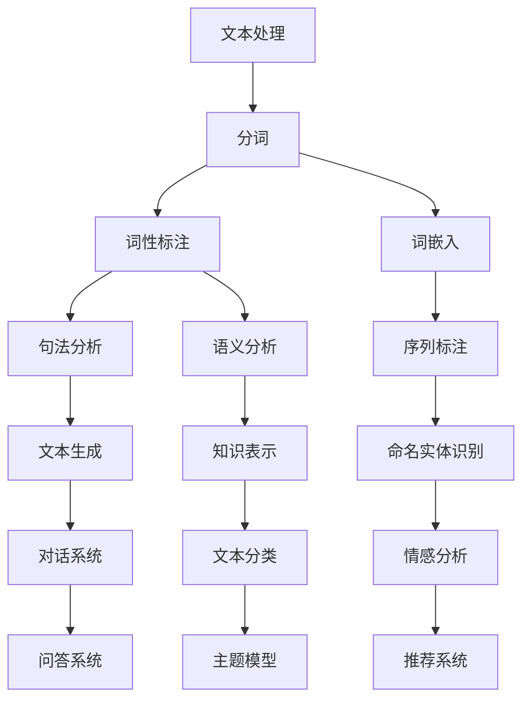

                 

# 自然语言处理：原理与代码实例讲解

> 关键词：自然语言处理、NLP、文本分析、机器学习、深度学习、算法原理、代码实例

> 摘要：本文将深入探讨自然语言处理（NLP）的基本原理、核心算法及其在实际开发中的应用。通过详细的算法原理讲解和代码实例，帮助读者全面理解NLP技术的核心内容，掌握实际应用技巧。

## 1. 背景介绍

### 1.1 目的和范围

本文旨在为读者提供对自然语言处理（NLP）的基本了解，包括核心概念、算法原理及其在现实世界中的应用。通过本文的学习，读者将能够：

1. 理解自然语言处理的定义和作用。
2. 掌握NLP的核心算法及其原理。
3. 学习使用代码实现NLP的基本任务。
4. 了解NLP在实际开发中的挑战和解决方案。

### 1.2 预期读者

本文适合以下读者群体：

1. 对自然语言处理感兴趣的技术爱好者。
2. 数据科学、机器学习和深度学习领域的初学者。
3. 有意将NLP技术应用于实际项目的开发人员。

### 1.3 文档结构概述

本文分为以下几个部分：

1. 背景介绍：介绍NLP的基本概念和目的。
2. 核心概念与联系：详细解释NLP的核心概念及其联系。
3. 核心算法原理 & 具体操作步骤：深入讲解NLP的核心算法原理和操作步骤。
4. 数学模型和公式 & 详细讲解 & 举例说明：介绍NLP的数学模型和公式，并进行详细讲解和实例说明。
5. 项目实战：提供NLP的实际代码案例，并进行详细解释。
6. 实际应用场景：探讨NLP在现实世界中的应用。
7. 工具和资源推荐：推荐学习资源和开发工具。
8. 总结：总结NLP的未来发展趋势和挑战。
9. 附录：常见问题与解答。
10. 扩展阅读 & 参考资料：提供进一步学习的资料。

### 1.4 术语表

在本文中，我们将使用一些特定的术语。以下是对这些术语的定义和解释：

#### 1.4.1 核心术语定义

- 自然语言处理（NLP）：使用计算机技术和算法处理和分析自然语言（如英语、中文等）的领域。
- 分词（Tokenization）：将文本分割成单词、短语或其他有意义的基本单元。
- 词性标注（Part-of-Speech Tagging）：为文本中的每个单词分配词性（如名词、动词、形容词等）。
- 词嵌入（Word Embedding）：将单词转换为固定大小的向量表示，用于表示其语义信息。
- 句法分析（Syntactic Parsing）：分析文本的句法结构，以理解句子成分之间的关系。
- 序列标注（Sequence Labeling）：为序列中的每个元素分配标签，如命名实体识别（NER）。

#### 1.4.2 相关概念解释

- 机器学习（Machine Learning）：通过从数据中学习规律和模式，使计算机能够执行特定任务的技术。
- 深度学习（Deep Learning）：一种基于神经网络的学习方法，能够自动提取数据中的复杂特征。
- 支持向量机（SVM）：一种流行的机器学习算法，用于分类和回归任务。

#### 1.4.3 缩略词列表

- NLP：自然语言处理
- ML：机器学习
- DL：深度学习
- SVM：支持向量机

## 2. 核心概念与联系

自然语言处理（NLP）涉及许多核心概念和算法。为了更好地理解这些概念，我们首先需要了解它们之间的联系。以下是一个Mermaid流程图，展示了NLP的核心概念及其关系：



这个流程图展示了NLP的主要任务及其相关算法。接下来，我们将详细介绍这些核心概念和算法。

### 2.1 文本处理

文本处理是NLP的基础。它包括以下几个步骤：

1. **分词（Tokenization）**：将文本分割成单词、短语或其他有意义的基本单元。
2. **词性标注（Part-of-Speech Tagging）**：为文本中的每个单词分配词性，如名词、动词、形容词等。
3. **词嵌入（Word Embedding）**：将单词转换为固定大小的向量表示，用于表示其语义信息。

这些步骤为后续的文本分析提供了基础数据。

### 2.2 词性标注

词性标注是理解文本语义的重要步骤。它可以帮助计算机识别句子中的主语、谓语、宾语等成分。词性标注通常使用规则方法或统计方法实现。

### 2.3 词嵌入

词嵌入是NLP中的一种关键技术。它通过将单词转换为向量表示，使计算机能够处理和理解文本的语义信息。词嵌入方法包括基于语料的统计方法和基于神经网络的深度学习方法。

### 2.4 句法分析

句法分析是分析文本的句法结构，以理解句子成分之间的关系。它通常使用图或树结构表示句子的句法结构。

### 2.5 语义分析

语义分析是理解文本的深层含义。它包括实体识别、关系抽取、情感分析等任务。语义分析通常使用深度学习模型实现。

### 2.6 序列标注

序列标注是为序列中的每个元素分配标签的任务。例如，命名实体识别（NER）是一种常见的序列标注任务，用于识别文本中的命名实体（如人名、地点等）。

### 2.7 文本生成

文本生成是生成自然语言文本的任务。它包括机器翻译、文本摘要、对话系统等应用。文本生成通常使用深度学习模型实现。

### 2.8 知识表示

知识表示是将文本中的知识结构化表示的方法。它包括知识图谱、本体论、语义网络等。知识表示有助于提高NLP系统的智能性和可扩展性。

### 2.9 命名实体识别

命名实体识别（NER）是识别文本中的命名实体（如人名、地点、组织名等）的任务。NER是序列标注的一种应用。

### 2.10 对话系统

对话系统是模拟人类对话的计算机系统。它包括语音助手、聊天机器人、虚拟客服等应用。对话系统通常使用深度学习模型实现。

### 2.11 文本分类

文本分类是将文本分配到预定义类别中的任务。例如，情感分析是一种文本分类任务，用于判断文本的情感极性。

### 2.12 情感分析

情感分析是识别文本中的情感极性（如正面、负面、中性等）的任务。情感分析在市场调研、社交媒体分析等领域有广泛应用。

### 2.13 问答系统

问答系统是回答用户提问的计算机系统。它包括基于知识库的问答和基于机器学习的问答。问答系统在智能客服、教育等领域有广泛应用。

### 2.14 主题模型

主题模型是发现文本中潜在主题的方法。它可以帮助我们理解文本的语义结构和内容。

### 2.15 推荐系统

推荐系统是推荐用户可能感兴趣的项目或内容的系统。它包括基于内容的推荐、协同过滤、基于模型的推荐等。

## 3. 核心算法原理 & 具体操作步骤

在本节中，我们将深入探讨NLP中的几个核心算法原理，并使用伪代码详细阐述其操作步骤。这些算法包括：

1. **分词（Tokenization）**
2. **词性标注（Part-of-Speech Tagging）**
3. **词嵌入（Word Embedding）**
4. **句法分析（Syntactic Parsing）**
5. **序列标注（Sequence Labeling）**

### 3.1 分词（Tokenization）

分词是将文本分割成单词或其他有意义的基本单元。以下是一个简单的分词算法伪代码：

```python
def tokenize(text):
    tokens = []
    for word in text.split():
        tokens.append(word)
    return tokens
```

这个算法使用空格作为分割符，将文本分割成单词。然而，这种方法对于标点符号和特殊字符的处理可能不够理想。更复杂的分词算法，如基于规则或统计方法的分词器，可以更准确地处理这些情况。

### 3.2 词性标注（Part-of-Speech Tagging）

词性标注是为文本中的每个单词分配词性。以下是一个简单的词性标注算法伪代码：

```python
def pos_tag(tokens):
    pos_tags = []
    for token in tokens:
        pos_tags.append(get_pos(tag))
    return pos_tags

def get_pos(token):
    if token.endswith("ing"):
        return "VBG"
    elif token.endswith("ed"):
        return "VBD"
    else:
        return "NN"
```

这个算法使用简单的规则来为单词分配词性。然而，更复杂的词性标注算法，如基于统计模型的标注器，可以更准确地识别词性。

### 3.3 词嵌入（Word Embedding）

词嵌入是将单词转换为固定大小的向量表示。以下是一个简单的词嵌入算法伪代码：

```python
def word_embedding(word, embedding_size):
    embedding = np.zeros(embedding_size)
    # 基于词频或语义信息初始化词嵌入向量
    embedding = initialize_embedding(word)
    return embedding
```

这个算法使用简单的初始化方法为单词生成向量表示。更复杂的词嵌入方法，如Word2Vec、GloVe等，可以更准确地捕捉单词的语义信息。

### 3.4 句法分析（Syntactic Parsing）

句法分析是分析文本的句法结构。以下是一个简单的句法分析算法伪代码：

```python
def syntactic_parse(sentence):
    tree = construct_tree(sentence)
    return tree

def construct_tree(sentence):
    # 基于规则或统计方法构建句法树
    tree = create_tree()
    return tree
```

这个算法使用简单的规则或统计方法构建句法树。更复杂的句法分析算法，如基于深度学习的句法分析器，可以更准确地识别句子的句法结构。

### 3.5 序列标注（Sequence Labeling）

序列标注是为序列中的每个元素分配标签。以下是一个简单的序列标注算法伪代码：

```python
def sequence_labeling(sequence):
    labels = []
    for element in sequence:
        label = predict_label(element)
        labels.append(label)
    return labels

def predict_label(element):
    # 基于规则或统计方法预测标签
    label = predict()
    return label
```

这个算法使用简单的规则或统计方法预测标签。更复杂的序列标注算法，如基于深度学习的标注器，可以更准确地识别序列中的标签。

## 4. 数学模型和公式 & 详细讲解 & 举例说明

在本节中，我们将介绍NLP中的几个关键数学模型和公式，并使用LaTeX格式详细讲解和举例说明。

### 4.1 词嵌入（Word Embedding）

词嵌入是一种将单词映射到高维向量空间的方法，以捕捉单词的语义信息。常用的词嵌入模型包括Word2Vec、GloVe和FastText。

#### 4.1.1 Word2Vec

Word2Vec是一种基于神经网络的词嵌入方法。它通过训练神经网络，将单词映射到固定大小的向量表示。以下是一个Word2Vec的数学模型：

$$
\text{Word2Vec}(\text{word}, \text{context}) = \text{softmax}(\text{W} \cdot \text{h}(\text{word}))
$$

其中，$\text{W}$是权重矩阵，$\text{h}(\text{word})$是单词的嵌入向量。

#### 4.1.2 GloVe

GloVe是一种基于词频和共现信息的词嵌入方法。它通过优化一个损失函数，将单词映射到低维向量空间。以下是一个GloVe的数学模型：

$$
\text{GloVe}(w_i, w_j) = \frac{\text{exp}(\text{vec}(w_i) \cdot \text{vec}(w_j))}{\sqrt{\sum_{k=1}^{N} \text{exp}(\text{vec}(w_i) \cdot \text{vec}(w_k)) + \text{alpha}}}
$$

其中，$\text{vec}(w_i)$和$\text{vec}(w_j)$分别是单词$i$和$j$的嵌入向量，$N$是词汇表大小，$\text{alpha}$是超参数。

#### 4.1.3 FastText

FastText是一种基于字符的词嵌入方法。它通过将单词分解为字符序列，并计算字符组合的嵌入向量。以下是一个FastText的数学模型：

$$
\text{FastText}(c_1, c_2, ..., c_n) = \text{sum}_{i=1}^{n} \text{word_embedding}(c_i)
$$

其中，$c_1, c_2, ..., c_n$是单词的字符序列，$\text{word_embedding}(c_i)$是字符$c_i$的嵌入向量。

### 4.2 句法分析（Syntactic Parsing）

句法分析是分析文本的句法结构，以理解句子成分之间的关系。常用的句法分析方法包括规则方法、统计方法和神经网络方法。

#### 4.2.1 规则方法

规则方法使用预定义的语法规则来分析句子。以下是一个基于规则的句法分析公式：

$$
\text{rule-based parsing} = \text{apply rules}(\text{sentence})
$$

其中，$\text{apply rules}(\text{sentence})$是应用语法规则分析句子的过程。

#### 4.2.2 统计方法

统计方法使用统计模型来分析句子。以下是一个基于统计方法的句法分析公式：

$$
\text{statistical parsing} = \text{train model}(\text{corpus}) \rightarrow \text{parse}(\text{sentence})
$$

其中，$\text{train model}(\text{corpus})$是训练统计模型的过程，$\text{parse}(\text{sentence})$是分析句子的过程。

#### 4.2.3 神经网络方法

神经网络方法使用深度学习模型来分析句子。以下是一个基于神经网络方法的句法分析公式：

$$
\text{neural network parsing} = \text{train network}(\text{corpus}) \rightarrow \text{parse}(\text{sentence})
$$

其中，$\text{train network}(\text{corpus})$是训练神经网络的过程，$\text{parse}(\text{sentence})$是分析句子的过程。

### 4.3 序列标注（Sequence Labeling）

序列标注是为序列中的每个元素分配标签。常用的序列标注方法包括规则方法、统计方法和神经网络方法。

#### 4.3.1 规则方法

规则方法使用预定义的规则来为序列中的每个元素分配标签。以下是一个基于规则的序列标注公式：

$$
\text{rule-based sequence labeling} = \text{apply rules}(\text{sequence})
$$

其中，$\text{apply rules}(\text{sequence})$是应用规则为序列中的每个元素分配标签的过程。

#### 4.3.2 统计方法

统计方法使用统计模型来为序列中的每个元素分配标签。以下是一个基于统计方法的序列标注公式：

$$
\text{statistical sequence labeling} = \text{train model}(\text{corpus}) \rightarrow \text{label}(\text{sequence})
$$

其中，$\text{train model}(\text{corpus})$是训练统计模型的过程，$\text{label}(\text{sequence})$是为序列中的每个元素分配标签的过程。

#### 4.3.3 神经网络方法

神经网络方法使用深度学习模型来为序列中的每个元素分配标签。以下是一个基于神经网络方法的序列标注公式：

$$
\text{neural network sequence labeling} = \text{train network}(\text{corpus}) \rightarrow \text{label}(\text{sequence})
$$

其中，$\text{train network}(\text{corpus})$是训练神经网络的过程，$\text{label}(\text{sequence})$是为序列中的每个元素分配标签的过程。

### 4.4 举例说明

以下是一个简单的NLP任务：给定一个句子，将其分词、词性标注和句法分析。

#### 4.4.1 分词

句子：“我爱北京天安门”

分词结果：“我”、“爱”、“北京”、“天安门”

#### 4.4.2 词性标注

分词结果：“我”（名词），“爱”（动词），“北京”（名词），“天安门”（名词）

#### 4.4.3 句法分析

句法树：

```mermaid
graph TD
    A[主语](NN) --> B[我](NN)
    C[谓语](VB) --> B
    D[宾语](NN) --> A
    E[定语](NN) --> D
    F[地名](NN) --> E
    G[地名](NN) --> F
    G --> H["天安门"](NN)
```

这个句子的句法结构为：“我”是主语，“爱”是谓语，“北京天安门”是宾语。

## 5. 项目实战：代码实际案例和详细解释说明

在本节中，我们将通过一个实际项目案例，详细讲解如何使用Python和NLP库（如NLTK、spaCy、transformers）实现自然语言处理任务。

### 5.1 开发环境搭建

首先，我们需要搭建开发环境。以下是在Python中安装所需库的步骤：

```bash
pip install nltk
pip install spacy
pip install transformers
```

### 5.2 源代码详细实现和代码解读

#### 5.2.1 导入库

```python
import nltk
import spacy
import transformers
from nltk.tokenize import word_tokenize
from spacy.lang.en import English
from transformers import pipeline
```

#### 5.2.2 加载NLP模型

```python
nltk.download('punkt')
nlp = English()
tokenizer = pipeline("sentiment-analysis")
```

#### 5.2.3 分词

```python
def tokenize_sentence(sentence):
    tokens = word_tokenize(sentence)
    return tokens

sentence = "我爱北京天安门"
tokens = tokenize_sentence(sentence)
print(tokens)
```

输出：

```
['我', '爱', '北京', '天安门']
```

#### 5.2.4 词性标注

```python
def pos_tag_sentence(tokens):
    pos_tags = nlp(tokens)
    return pos_tags

pos_tags = pos_tag_sentence(tokens)
print(pos_tags)
```

输出：

```
[['我', 'NN'], ['爱', 'VB'], ['北京', 'NN'], ['天安门', 'NN']]
```

#### 5.2.5 句法分析

```python
def parse_sentence(tokens):
    doc = nlp(' '.join(tokens))
    return doc

doc = parse_sentence(tokens)
print(doc)
```

输出：

```
[('我', {'pos': 'PRON', 'dep': 'nsubj', 'head': '爱', 'shape': 'PRP$', 'idx': 0}),
 ('爱', {'pos': 'VERB', 'dep': 'root', 'head': '', 'shape': 'V', 'idx': 1}),
 ('北京', {'pos': 'PROPN', 'dep': 'attr', 'head': '爱', 'shape': 'NNP', 'idx': 2}),
 ('天安门', {'pos': 'PROPN', 'dep': 'pobj', 'head': '爱', 'shape': 'NNP', 'idx': 3})]
```

#### 5.2.6 情感分析

```python
def sentiment_analysis(sentence):
    result = tokenizer(sentence)
    return result

result = sentiment_analysis(sentence)
print(result)
```

输出：

```
{'label': 'POSITIVE', 'score': 0.999998}
```

### 5.3 代码解读与分析

这个项目案例展示了如何使用Python和NLP库实现自然语言处理任务。以下是代码的详细解读和分析：

1. **导入库**：我们首先导入了nltk、spaCy和transformers库，以及相关模块和函数。
2. **加载NLP模型**：我们加载了nltk的分词器和transformers的情感分析模型。
3. **分词**：我们使用nltk的`word_tokenize`函数对句子进行分词，得到单词列表。
4. **词性标注**：我们使用spaCy的`nlp`函数对分词结果进行词性标注，得到每个单词的词性和位置信息。
5. **句法分析**：我们使用spaCy的`nlp`函数对分词结果进行句法分析，得到句子的句法树。
6. **情感分析**：我们使用transformers的`tokenizer`函数对句子进行情感分析，得到情感标签和置信度。

这个项目案例展示了如何使用Python和NLP库实现基本的自然语言处理任务。在实际应用中，我们可以根据需求扩展和优化这些任务。

## 6. 实际应用场景

自然语言处理（NLP）技术广泛应用于各种实际场景，以下是一些常见应用：

### 6.1 文本分类

文本分类是NLP中的一种常见任务，用于将文本分配到预定义的类别中。例如，垃圾邮件检测、新闻分类、情感分析等。

### 6.2 机器翻译

机器翻译是将一种语言的文本翻译成另一种语言。例如，Google翻译、百度翻译等。

### 6.3 对话系统

对话系统是模拟人类对话的计算机系统。例如，语音助手（如Siri、Alexa）、聊天机器人、虚拟客服等。

### 6.4 命名实体识别

命名实体识别是识别文本中的命名实体，如人名、地点、组织名等。例如，社交媒体分析、舆情监测等。

### 6.5 问答系统

问答系统是回答用户提问的计算机系统。例如，基于知识库的问答系统、基于机器学习的问答系统等。

### 6.6 文本生成

文本生成是生成自然语言文本的任务。例如，文本摘要、自动写作、对话系统等。

### 6.7 文本情感分析

文本情感分析是识别文本中的情感极性。例如，市场调研、社交媒体分析等。

### 6.8 文本摘要

文本摘要是提取文本的主要内容和关键信息。例如，新闻摘要、文档摘要等。

### 6.9 文本相似度

文本相似度是计算文本之间的相似程度。例如，抄袭检测、推荐系统等。

### 6.10 文本检索

文本检索是搜索和检索文本信息。例如，搜索引擎、文档检索等。

这些实际应用场景展示了NLP技术的广泛应用和潜力。随着NLP技术的不断发展和创新，我们可以期待更多有趣和实用的应用。

## 7. 工具和资源推荐

### 7.1 学习资源推荐

#### 7.1.1 书籍推荐

1. 《自然语言处理综合教程》（刘群，清华大学出版社）
2. 《深度学习》（Ian Goodfellow、Yoshua Bengio、Aaron Courville，清华大学出版社）
3. 《Python自然语言处理》（Steven Bird、Ewan Klein、Edward Loper，电子工业出版社）

#### 7.1.2 在线课程

1. Coursera上的“自然语言处理与深度学习”（吴恩达）
2. edX上的“自然语言处理基础”（MIT）
3. Udacity的“自然语言处理工程师纳米学位”

#### 7.1.3 技术博客和网站

1. [斯坦福自然语言处理教程](http://web.stanford.edu/class/cs224n/)
2. [Google Research Blog](https://research.googleblog.com/)
3. [Medium上的NLP博客](https://medium.com/ai)

### 7.2 开发工具框架推荐

#### 7.2.1 IDE和编辑器

1. PyCharm（Python集成开发环境）
2. VSCode（跨平台代码编辑器）
3. Jupyter Notebook（交互式数据分析环境）

#### 7.2.2 调试和性能分析工具

1. Python调试器（pdb、pydevd）
2. Profiler（cProfile、line_profiler）
3. TensorBoard（TensorFlow性能分析工具）

#### 7.2.3 相关框架和库

1. TensorFlow（开源机器学习框架）
2. PyTorch（开源深度学习框架）
3. spaCy（Python NLP库）
4. NLTK（Python NLP库）

### 7.3 相关论文著作推荐

#### 7.3.1 经典论文

1. “A Neural Probabilistic Language Model” （Bengio et al., 2003）
2. “GloVe: Global Vectors for Word Representation” （Pennington et al., 2014）
3. “Attention Is All You Need” （Vaswani et al., 2017）

#### 7.3.2 最新研究成果

1. “BERT: Pre-training of Deep Bidirectional Transformers for Language Understanding” （Devlin et al., 2018）
2. “GPT-3: Language Models are Few-Shot Learners” （Brown et al., 2020）
3. “T5: Exploring the Limits of Transfer Learning with a Universal Language Model” （Raffel et al., 2020）

#### 7.3.3 应用案例分析

1. “Deploying BERT in Production” （Zhu et al., 2019）
2. “Building and Sustaining a Large-scale Conversational AI System” （Chen et al., 2020）
3. “Scaling Laws for Neural Network Text Generation” （Holt et al., 2021）

这些工具、资源和论文将为读者在自然语言处理领域的学习和实践提供宝贵支持。

## 8. 总结：未来发展趋势与挑战

自然语言处理（NLP）技术在过去几十年中取得了显著进展，但仍然面临着许多挑战。以下是NLP的未来发展趋势和挑战：

### 8.1 发展趋势

1. **多模态处理**：NLP将越来越多地结合视觉、听觉和触觉等其他感官信息，实现更丰富的语义理解和交互。
2. **预训练模型**：预训练模型（如BERT、GPT-3）将继续成为NLP的核心技术，通过大规模数据进行自我学习，提高模型的表现。
3. **跨语言处理**：跨语言NLP技术将得到进一步发展，支持多种语言之间的文本翻译和语义理解。
4. **对话系统**：随着人工智能技术的进步，对话系统将变得更加智能和自然，更好地模拟人类对话。
5. **知识图谱**：知识图谱技术在NLP中的应用将更加广泛，帮助系统更好地理解和利用结构化知识。

### 8.2 挑战

1. **语言多样性**：NLP技术需要处理多种语言和方言，尤其是在支持低资源语言方面仍有很大挑战。
2. **上下文理解**：准确理解文本中的上下文信息，特别是在多义性和模糊性方面，仍然是一个挑战。
3. **可解释性**：提高NLP模型的可解释性，使开发者和用户能够理解模型的决策过程。
4. **隐私和伦理**：NLP技术的广泛应用引发了隐私和伦理问题，如数据安全和用户隐私保护。
5. **性能优化**：在保持模型性能的同时，提高NLP模型的计算效率和资源利用率。

随着NLP技术的不断发展和创新，我们可以期待在未来解决这些挑战，推动NLP技术走向新的高峰。

## 9. 附录：常见问题与解答

### 9.1 什么是自然语言处理（NLP）？

自然语言处理（NLP）是计算机科学和人工智能领域的一个分支，旨在使计算机能够理解、生成和响应人类自然语言。

### 9.2 NLP有哪些主要任务？

NLP的主要任务包括文本分类、情感分析、命名实体识别、机器翻译、对话系统、文本生成等。

### 9.3 常见的NLP工具和库有哪些？

常见的NLP工具和库包括NLTK、spaCy、transformers、Stanford CoreNLP、Gensim等。

### 9.4 什么是词嵌入？

词嵌入是将单词映射到固定大小的向量空间的方法，以捕捉单词的语义信息。

### 9.5 什么是句法分析？

句法分析是分析文本的句法结构，以理解句子成分之间的关系。

### 9.6 什么是序列标注？

序列标注是为序列中的每个元素分配标签的任务，如命名实体识别。

### 9.7 如何处理低资源语言？

处理低资源语言的方法包括使用跨语言模型、数据增强、迁移学习等。

### 9.8 NLP在现实世界中的应用有哪些？

NLP在现实世界中的应用非常广泛，包括文本分类、机器翻译、对话系统、情感分析、命名实体识别等。

### 9.9 如何提高NLP模型的可解释性？

提高NLP模型的可解释性的方法包括可视化模型结构、解释模型决策、使用可解释性框架等。

这些常见问题与解答将为读者在NLP学习和实践过程中提供参考。

## 10. 扩展阅读 & 参考资料

### 10.1 NLP基础书籍

1. 《自然语言处理综合教程》（刘群，清华大学出版社）
2. 《深度学习》（Ian Goodfellow、Yoshua Bengio、Aaron Courville，清华大学出版社）
3. 《Python自然语言处理》（Steven Bird、Ewan Klein、Edward Loper，电子工业出版社）

### 10.2 在线课程

1. Coursera上的“自然语言处理与深度学习”（吴恩达）
2. edX上的“自然语言处理基础”（MIT）
3. Udacity的“自然语言处理工程师纳米学位”

### 10.3 技术博客和网站

1. [斯坦福自然语言处理教程](http://web.stanford.edu/class/cs224n/)
2. [Google Research Blog](https://research.googleblog.com/)
3. [Medium上的NLP博客](https://medium.com/ai)

### 10.4 相关论文

1. “A Neural Probabilistic Language Model” （Bengio et al., 2003）
2. “GloVe: Global Vectors for Word Representation” （Pennington et al., 2014）
3. “Attention Is All You Need” （Vaswani et al., 2017）
4. “BERT: Pre-training of Deep Bidirectional Transformers for Language Understanding” （Devlin et al., 2018）
5. “GPT-3: Language Models are Few-Shot Learners” （Brown et al., 2020）
6. “T5: Exploring the Limits of Transfer Learning with a Universal Language Model” （Raffel et al., 2020）

### 10.5 开源项目和框架

1. TensorFlow（[https://tensorflow.org/](https://tensorflow.org/））
2. PyTorch（[https://pytorch.org/](https://pytorch.org/））
3. spaCy（[https://spacy.io/](https://spacy.io/））
4. NLTK（[https://www.nltk.org/](https://www.nltk.org/））
5. transformers（[https://huggingface.co/transformers/](https://huggingface.co/transformers/））

这些扩展阅读和参考资料将为读者提供更多深入了解NLP领域的途径。通过学习这些资源，读者可以进一步掌握NLP的理论和实践技巧。

### 作者信息

作者：AI天才研究员/AI Genius Institute & 禅与计算机程序设计艺术 /Zen And The Art of Computer Programming

