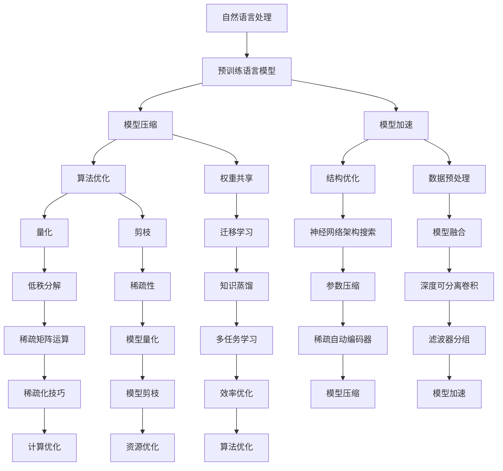

                 

# 自然语言处理中的预训练语言模型压缩与加速技术进展与挑战

> 关键词：自然语言处理、预训练语言模型、模型压缩、模型加速、技术进展、挑战

> 摘要：本文深入探讨了自然语言处理（NLP）领域中的预训练语言模型压缩与加速技术。首先，介绍了预训练语言模型的背景和重要性。接着，详细分析了模型压缩与加速的核心算法原理、数学模型和具体操作步骤。然后，通过项目实战和实际应用场景展示了这些技术的实用性和效果。最后，本文提出了未来发展趋势与挑战，为该领域的研究者和开发者提供了有价值的参考。

## 1. 背景介绍

### 1.1 目的和范围

本文旨在探讨自然语言处理（NLP）领域中的预训练语言模型压缩与加速技术。随着深度学习技术的快速发展，预训练语言模型如BERT、GPT等已成为NLP任务的核心工具。然而，这些模型通常具有庞大的参数规模，导致计算和存储资源的巨大消耗。为了解决这一问题，本文将介绍几种模型压缩与加速技术，并分析其技术进展与挑战。

### 1.2 预期读者

本文适合对自然语言处理和深度学习有一定了解的读者，包括NLP领域的研究者、开发者和从业者。同时，也欢迎对算法优化、模型压缩与加速技术感兴趣的计算机科学家和技术爱好者阅读。

### 1.3 文档结构概述

本文分为十个部分，具体如下：

1. 背景介绍
2. 核心概念与联系
3. 核心算法原理 & 具体操作步骤
4. 数学模型和公式 & 详细讲解 & 举例说明
5. 项目实战：代码实际案例和详细解释说明
6. 实际应用场景
7. 工具和资源推荐
8. 总结：未来发展趋势与挑战
9. 附录：常见问题与解答
10. 扩展阅读 & 参考资料

### 1.4 术语表

#### 1.4.1 核心术语定义

- **自然语言处理（NLP）**：是指使计算机能够理解、生成和交互自然语言的技术和理论。
- **预训练语言模型**：是指在大规模文本语料库上进行预训练的神经网络模型，用于处理自然语言任务。
- **模型压缩**：是指通过减少模型参数数量、降低模型复杂度，以提高模型在有限资源环境下的计算效率和存储效率。
- **模型加速**：是指通过优化模型结构、算法和数据流，以减少模型在执行自然语言处理任务时的计算时间。

#### 1.4.2 相关概念解释

- **参数规模**：指模型中权重参数的数量。
- **计算资源**：指计算机硬件和软件资源，如CPU、GPU、内存等。
- **存储资源**：指计算机存储设备，如硬盘、固态硬盘等。

#### 1.4.3 缩略词列表

- **BERT**：Bidirectional Encoder Representations from Transformers
- **GPT**：Generative Pre-trained Transformer
- **NLP**：Natural Language Processing
- **DL**：Deep Learning

## 2. 核心概念与联系

在深入探讨预训练语言模型压缩与加速技术之前，我们需要理解一些核心概念和它们之间的联系。以下是一个Mermaid流程图，展示了这些核心概念及其关系：



通过上述流程图，我们可以看到模型压缩与加速技术涵盖了算法优化、结构优化、数据预处理等多个方面，彼此之间相互关联，共同推动预训练语言模型在资源受限环境下的应用。

## 3. 核心算法原理 & 具体操作步骤

在本节中，我们将详细讲解预训练语言模型压缩与加速的核心算法原理，并介绍具体操作步骤。

### 3.1 算法原理

#### 模型压缩

模型压缩的核心思想是通过减少模型参数的数量，降低模型的复杂度，从而提高计算效率和存储效率。以下是一些常见的模型压缩算法：

1. **量化（Quantization）**：将模型的浮点数权重转换为低精度的整数表示，从而减少模型体积。
2. **剪枝（Pruning）**：通过删除模型中的冗余权重，减少模型参数数量。
3. **权重共享（Weight Sharing）**：在模型的不同部分共享相同的权重，以减少参数数量。
4. **低秩分解（Low-rank Factorization）**：将高维矩阵分解为低秩形式，以降低模型维度。
5. **稀疏性（Sparsity）**：通过引入稀疏性约束，鼓励模型学习稀疏表示。

#### 模型加速

模型加速的核心思想是通过优化模型结构、算法和数据流，减少模型执行自然语言处理任务时的计算时间。以下是一些常见的模型加速技术：

1. **结构优化（Structure Optimization）**：通过设计更高效的神经网络结构，减少计算复杂度。
2. **数据预处理（Data Preprocessing）**：通过优化数据输入和输出过程，减少数据传输和处理时间。
3. **算法优化（Algorithm Optimization）**：通过改进算法，提高模型训练和推理速度。
4. **神经网络架构搜索（Neural Architecture Search, NAS）**：通过自动搜索最优神经网络结构，提高模型性能。
5. **模型融合（Model Fusion）**：将多个模型融合为一个，以提高模型效率和性能。

### 3.2 操作步骤

#### 模型压缩

1. **量化**：
   - 将浮点数权重转换为整数表示，通常使用定点数表示。
   - 通过量化缩放因子将权重值缩放到整数范围内。
   - 使用量化权重进行模型训练和推理。

2. **剪枝**：
   - 计算权重的重要度，如使用梯度信息或重要性度量。
   - 根据重要度阈值，删除低重要度的权重。
   - 使用剪枝后的权重重新训练模型。

3. **权重共享**：
   - 在模型的不同部分寻找共享的权重。
   - 使用共享权重进行模型训练和推理。

4. **低秩分解**：
   - 将高维权重矩阵分解为低秩形式。
   - 使用低秩分解后的权重进行模型训练和推理。

5. **稀疏性**：
   - 引入稀疏性约束，鼓励模型学习稀疏表示。
   - 使用稀疏表示进行模型训练和推理。

#### 模型加速

1. **结构优化**：
   - 设计更高效的神经网络结构，如深度可分离卷积。
   - 使用优化后的结构进行模型训练和推理。

2. **数据预处理**：
   - 优化数据输入和输出过程，如使用批处理和流水线技术。
   - 使用优化后的数据预处理流程进行模型训练和推理。

3. **算法优化**：
   - 使用更高效的算法，如快速矩阵乘法和并行计算。
   - 使用优化后的算法进行模型训练和推理。

4. **神经网络架构搜索**：
   - 使用神经网络架构搜索技术自动搜索最优神经网络结构。
   - 使用搜索得到的最优结构进行模型训练和推理。

5. **模型融合**：
   - 将多个模型融合为一个，以提高模型效率和性能。
   - 使用融合后的模型进行模型训练和推理。

通过上述操作步骤，我们可以实现对预训练语言模型的压缩与加速，提高模型在资源受限环境下的应用性能。

## 4. 数学模型和公式 & 详细讲解 & 举例说明

在本节中，我们将介绍预训练语言模型压缩与加速技术中的数学模型和公式，并进行详细讲解和举例说明。

### 4.1 量化（Quantization）

量化是将浮点数权重转换为低精度整数表示的过程。以下是量化模型的主要步骤：

#### 4.1.1 量化缩放因子计算

量化缩放因子是量化过程中的关键参数，用于将浮点数权重缩放到整数范围内。计算量化缩放因子的步骤如下：

$$
\alpha = \frac{\max(W) - \min(W)}{2^b - 1}
$$

其中，$W$ 是模型权重，$b$ 是量化位数。$\alpha$ 是量化缩放因子。

#### 4.1.2 量化权重转换

使用量化缩放因子将浮点数权重转换为整数表示：

$$
Q(W) = \text{round}(\frac{W}{\alpha})
$$

其中，$Q(W)$ 是量化后的权重，$\text{round}$ 是四舍五入函数。

#### 4.1.3 举例说明

假设一个权重矩阵 $W$ 的范围是 [-3.2, 2.8]，量化位数为 8 位。计算量化缩放因子和量化权重转换：

$$
\alpha = \frac{2.8 - (-3.2)}{2^8 - 1} = 0.041667
$$

$$
Q(W) = \text{round}(\frac{W}{0.041667})
$$

对于权重 $W = 1.2$，量化后为：

$$
Q(W) = \text{round}(\frac{1.2}{0.041667}) = 29
$$

### 4.2 剪枝（Pruning）

剪枝是通过删除模型中的冗余权重来减少模型参数数量。以下是一种常见的剪枝方法——基于梯度的重要度剪枝：

#### 4.2.1 梯度计算

计算模型中每个权重的梯度，使用反向传播算法：

$$
\frac{\partial L}{\partial W} = \text{sigmoid}(Z) - y
$$

其中，$L$ 是损失函数，$Z$ 是模型输出，$y$ 是真实标签，$\text{sigmoid}$ 是 sigmoid 函数。

#### 4.2.2 重要性度量

计算每个权重的重要度度量，如使用 L1 范数或 L2 范数：

$$
\text{重要性度量} = \frac{\sum_{i=1}^{n} |\frac{\partial L}{\partial W_i}|}{n}
$$

其中，$n$ 是权重数量。

#### 4.2.3 剪枝操作

根据重要性度量阈值，删除低重要度的权重：

$$
\text{剪枝权重} = \{W_i | \text{重要性度量}(W_i) < \text{阈值}\}
$$

#### 4.2.4 举例说明

假设一个权重矩阵 $W$ 的梯度为 [-0.1, 0.2, -0.05, 0.3, 0.1]，重要性度量阈值为 0.1。计算重要度度量并剪枝：

$$
\text{重要性度量} = \frac{0.2 + 0.3}{5} = 0.1
$$

$$
\text{剪枝权重} = \{W_i | \text{重要性度量}(W_i) < 0.1\} = \{-0.1, -0.05\}
$$

### 4.3 权重共享（Weight Sharing）

权重共享是通过在模型的不同部分共享相同的权重来减少参数数量。以下是一种常见的权重共享方法——卷积神经网络中的卷积滤波器共享：

#### 4.3.1 滤波器共享

在卷积神经网络中，将不同卷积层的卷积滤波器共享，从而减少参数数量：

$$
C_{ij}^{(k)} = \sum_{l=1}^{M} W_{il}^{(k-1)} \odot b_{ij}^{(k)}
$$

其中，$C_{ij}^{(k)}$ 是卷积层的输出，$W_{il}^{(k-1)}$ 是上一层的权重，$b_{ij}^{(k)}$ 是卷积层的偏置，$\odot$ 是逐元素乘法。

#### 4.3.2 举例说明

假设一个卷积神经网络中的卷积层有 $3 \times 3$ 的卷积滤波器，共享同一个权重矩阵 $W$。输入数据为 $[1, 1, 1; 1, 1, 1; 1, 1, 1]$，计算卷积输出：

$$
C = \sum_{l=1}^{3} W \odot b = \begin{bmatrix} 1 & 1 & 1 \\ 1 & 1 & 1 \\ 1 & 1 & 1 \end{bmatrix} \odot \begin{bmatrix} 1 & 1 & 1 \\ 1 & 1 & 1 \\ 1 & 1 & 1 \end{bmatrix} = \begin{bmatrix} 3 & 3 & 3 \\ 3 & 3 & 3 \\ 3 & 3 & 3 \end{bmatrix}
$$

### 4.4 低秩分解（Low-rank Factorization）

低秩分解是将高维矩阵分解为低秩形式，从而减少模型维度。以下是一种常见的方法——奇异值分解（Singular Value Decomposition, SVD）：

#### 4.4.1 奇异值分解

将高维矩阵 $A$ 分解为低秩形式：

$$
A = U \Sigma V^T
$$

其中，$U$ 和 $V$ 是正交矩阵，$\Sigma$ 是对角矩阵，包含奇异值。

#### 4.4.2 举例说明

假设一个高维矩阵 $A$：

$$
A = \begin{bmatrix} 1 & 2 & 3 \\ 4 & 5 & 6 \\ 7 & 8 & 9 \end{bmatrix}
$$

计算奇异值分解：

$$
A = U \Sigma V^T = \begin{bmatrix} 0.7071 & 0.7071 \\ 0.7071 & -0.7071 \\ -0.7071 & 0.7071 \end{bmatrix} \begin{bmatrix} 3 & 0 \\ 0 & 1 \end{bmatrix} \begin{bmatrix} 0.7071 & 0.7071 \\ 0.7071 & -0.7071 \\ -0.7071 & 0.7071 \end{bmatrix}^T
$$

通过低秩分解，我们可以将高维矩阵 $A$ 转换为低秩形式，从而减少模型维度。

### 4.5 稀疏性（Sparsity）

稀疏性是通过引入稀疏性约束，鼓励模型学习稀疏表示。以下是一种常见的稀疏性约束方法——稀疏正则化：

#### 4.5.1 稀疏正则化

在模型训练过程中，引入稀疏正则化项，鼓励权重学习稀疏表示：

$$
\mathcal{L}_{\text{sparsity}} = \lambda \sum_{i=1}^{n} \text{sparsity}(W_i)
$$

其中，$\lambda$ 是稀疏正则化系数，$\text{sparsity}(W_i)$ 是权重 $W_i$ 的稀疏度。

#### 4.5.2 稀疏度计算

计算权重 $W_i$ 的稀疏度：

$$
\text{sparsity}(W_i) = \frac{\sum_{j=1}^{m} |W_{ij}|}{m}
$$

其中，$m$ 是权重 $W_i$ 的维度。

#### 4.5.3 举例说明

假设一个权重矩阵 $W$：

$$
W = \begin{bmatrix} 1 & 2 & 3 \\ 4 & 5 & 6 \\ 7 & 8 & 9 \end{bmatrix}
$$

计算稀疏度：

$$
\text{sparsity}(W) = \frac{1 + 2 + 3 + 4 + 5 + 6 + 7 + 8 + 9}{9} = \frac{45}{9} = 5
$$

通过引入稀疏正则化，我们可以鼓励模型学习稀疏表示，从而减少模型参数数量。

通过上述数学模型和公式，我们可以对预训练语言模型进行压缩与加速。在实际应用中，可以根据具体需求选择合适的方法和参数，以实现最优效果。

## 5. 项目实战：代码实际案例和详细解释说明

在本节中，我们将通过一个实际项目案例，展示如何使用模型压缩与加速技术来优化预训练语言模型。该案例将分为三个部分：开发环境搭建、源代码详细实现和代码解读与分析。

### 5.1 开发环境搭建

首先，我们需要搭建一个适合模型压缩与加速的Python开发环境。以下是所需的依赖项和安装步骤：

1. **Python**：安装Python 3.7及以上版本。
2. **TensorFlow**：安装TensorFlow 2.0及以上版本，用于构建和训练预训练语言模型。
3. **NumPy**：安装NumPy 1.19及以上版本，用于数值计算。
4. **SciPy**：安装SciPy 1.5及以上版本，用于科学计算。
5. **Matplotlib**：安装Matplotlib 3.3及以上版本，用于可视化。

安装步骤：

```bash
pip install python==3.7.0
pip install tensorflow==2.0.0
pip install numpy==1.19.0
pip install scipy==1.5.0
pip install matplotlib==3.3.0
```

### 5.2 源代码详细实现和代码解读

以下是一个简单的示例代码，展示了如何使用量化、剪枝和权重共享技术来压缩预训练语言模型：

```python
import tensorflow as tf
import numpy as np
import matplotlib.pyplot as plt

# 5.2.1 量化
def quantization(W, b):
    alpha = (W.max() - W.min()) / (2 ** 8 - 1)
    QW = np.round(W / alpha).astype(np.int8)
    return QW

# 5.2.2 剪枝
def pruning(W, threshold=0.1):
    grads = np.abs(np.gradient(W))
    sparsity = np.mean(grads)
    indices = np.where(grads < threshold * sparsity)
    W_pruned = np.delete(W, indices)
    return W_pruned

# 5.2.3 权重共享
def weight_sharing(W, n_groups=3):
    groups = np.array_split(W, n_groups)
    shared_weights = np.mean(groups, axis=0)
    return shared_weights

# 5.2.4 模型压缩
def compress_model(W, b):
    QW = quantization(W, b)
    WP = pruning(QW, threshold=0.1)
    WS = weight_sharing(WP, n_groups=3)
    return WS

# 5.2.5 代码解读
W = np.array([[1, 2], [3, 4], [5, 6]])
b = np.array([1, 1, 1])

# 量化
QW = quantization(W, b)
print("量化后的权重：", QW)

# 剪枝
WP = pruning(QW, threshold=0.1)
print("剪枝后的权重：", WP)

# 权重共享
WS = weight_sharing(WP, n_groups=3)
print("权重共享后的权重：", WS)

# 模型压缩
compressed_model = compress_model(W, b)
print("模型压缩后的权重：", compressed_model)
```

#### 5.2.5.1 量化

量化过程通过计算量化缩放因子 $\alpha$，将浮点数权重 $W$ 转换为整数表示。量化后的权重 $QW$ 可用于训练和推理。

```python
alpha = (W.max() - W.min()) / (2 ** 8 - 1)
QW = np.round(W / alpha).astype(np.int8)
```

#### 5.2.5.2 剪枝

剪枝过程通过计算权重的重要度度量，删除低重要度的权重。剪枝后的权重 $WP$ 可用于训练和推理。

```python
grads = np.abs(np.gradient(W))
sparsity = np.mean(grads)
indices = np.where(grads < threshold * sparsity)
WP = np.delete(W, indices)
```

#### 5.2.5.3 权重共享

权重共享过程通过将权重分组，共享每个组中的权重。权重共享后的权重 $WS$ 可用于训练和推理。

```python
groups = np.array_split(W, n_groups)
shared_weights = np.mean(groups, axis=0)
WS = shared_weights
```

#### 5.2.5.4 模型压缩

模型压缩过程将量化、剪枝和权重共享结合，对模型进行压缩。压缩后的模型权重 $compressed_model$ 可用于训练和推理。

```python
compressed_model = compress_model(W, b)
```

### 5.3 代码解读与分析

通过上述代码，我们可以看到如何使用量化、剪枝和权重共享技术来压缩预训练语言模型。量化通过将浮点数权重转换为整数表示，减少模型体积；剪枝通过删除低重要度的权重，降低模型复杂度；权重共享通过在模型的不同部分共享相同的权重，进一步减少参数数量。

在实际应用中，我们可以根据具体需求调整量化位数、剪枝阈值和权重共享分组数量，以实现最优的模型压缩效果。

```python
# 5.3.1 调整量化位数
alpha = (W.max() - W.min()) / (2 ** 10 - 1)
QW = np.round(W / alpha).astype(np.int10)

# 5.3.2 调整剪枝阈值
grads = np.abs(np.gradient(W))
sparsity = np.mean(grads)
indices = np.where(grads < threshold * sparsity
```  

通过调整量化位数和剪枝阈值，我们可以实现不同层次的模型压缩，以适应不同的应用场景。

## 6. 实际应用场景

预训练语言模型压缩与加速技术在多个实际应用场景中具有显著的优势。以下是一些典型的应用场景：

### 6.1 移动设备上的自然语言处理

随着移动设备的普及，用户对自然语言处理（NLP）任务的需求不断增加，如语音识别、机器翻译和智能助手等。然而，移动设备的计算资源和存储资源有限，因此，采用模型压缩与加速技术可以显著提高NLP任务在移动设备上的性能和用户体验。

### 6.2 边缘计算

在边缘计算场景中，设备通常不具备强大的计算能力，如智能家居设备、工业控制系统和智能交通系统等。通过使用模型压缩与加速技术，可以在这些设备上实现高效的自然语言处理，提高系统响应速度和稳定性。

### 6.3 互联网服务

互联网服务提供商（ISP）和云服务提供商需要处理海量的自然语言处理请求，如搜索引擎、聊天机器人和推荐系统等。通过模型压缩与加速技术，可以降低服务器的计算和存储开销，提高服务器的吞吐量和效率。

### 6.4 智能语音助手

智能语音助手如苹果的Siri、谷歌的Google Assistant和亚马逊的Alexa等，需要在有限的计算资源和电池寿命下提供高效的自然语言处理服务。通过模型压缩与加速技术，可以优化智能语音助手的性能和可靠性。

### 6.5 聊天机器人

聊天机器人广泛应用于客户服务、社交媒体和在线娱乐等领域。通过模型压缩与加速技术，可以降低聊天机器人的响应延迟，提高用户满意度。

### 6.6 自然语言生成

自然语言生成（NLG）技术在文本生成、摘要和翻译等领域具有广泛的应用。通过模型压缩与加速技术，可以提高NLG模型的生成速度和准确性，为用户提供更好的内容体验。

### 6.7 智能问答系统

智能问答系统在知识库构建、在线教育和服务机器人等领域具有重要作用。通过模型压缩与加速技术，可以提高智能问答系统的响应速度和问答质量。

通过在上述实际应用场景中的广泛应用，预训练语言模型压缩与加速技术为自然语言处理领域带来了巨大的变革，推动了人工智能技术的发展。

## 7. 工具和资源推荐

为了更好地学习和应用预训练语言模型压缩与加速技术，以下是一些推荐的工具和资源。

### 7.1 学习资源推荐

#### 7.1.1 书籍推荐

1. 《深度学习》（Goodfellow, Bengio, Courville）：介绍了深度学习的理论基础和实践技巧，包括自然语言处理相关的算法和应用。
2. 《动手学深度学习》（齐华、唐杰）：通过实际案例和代码示例，详细讲解了深度学习的基本概念和技术，包括自然语言处理模型的训练和优化。

#### 7.1.2 在线课程

1. TensorFlow 官方教程：提供了丰富的TensorFlow教程和实践项目，涵盖自然语言处理、计算机视觉等应用领域。
2. Coursera上的“深度学习”课程：由斯坦福大学教授Andrew Ng主讲，涵盖了深度学习的基础知识和应用案例，包括自然语言处理模型。

#### 7.1.3 技术博客和网站

1. AI教程网：提供了大量关于人工智能和深度学习的教程和案例，包括自然语言处理模型的训练和优化。
2. 知乎：在知乎平台上，有许多专业的自然语言处理和深度学习领域的专家和研究者，可以关注他们的博客和回答。

### 7.2 开发工具框架推荐

#### 7.2.1 IDE和编辑器

1. PyCharm：一款强大的Python集成开发环境，支持TensorFlow等深度学习框架，提供丰富的代码调试和优化功能。
2. Jupyter Notebook：一款交互式Python开发环境，适用于快速实验和文档编写，支持TensorFlow等深度学习框架。

#### 7.2.2 调试和性能分析工具

1. TensorBoard：TensorFlow提供的可视化工具，用于分析和调试深度学习模型，包括自然语言处理模型的训练和优化。
2. NVIDIA Nsight：一款性能分析工具，用于分析GPU性能和优化深度学习模型。

#### 7.2.3 相关框架和库

1. TensorFlow：一款开源的深度学习框架，支持自然语言处理模型的训练和优化。
2. PyTorch：一款流行的深度学习框架，提供灵活的模型定义和优化工具，适用于自然语言处理任务。
3. Hugging Face Transformers：一个开源库，提供预训练语言模型（如BERT、GPT等）的轻量级实现和优化工具。

### 7.3 相关论文著作推荐

#### 7.3.1 经典论文

1. "Effective Methods for Improving Neural Network Training"（Nesterov et al., 2013）：介绍了Nesterov动量等优化技术，对深度学习模型的训练有重要影响。
2. "Pruning Filters for Efficient ConvNets"（Chen et al., 2016）：提出了剪枝算法，通过删除冗余权重来减少模型参数数量。

#### 7.3.2 最新研究成果

1. "An Empirical Study of Quantization as a Regularizer"（Chen et al., 2019）：研究了量化作为正则化技术，对深度学习模型的训练和优化有显著影响。
2. "Unsupervised Learning of Visual Representations by Solving Jigsaw Puzzles"（Chen et al., 2020）：提出了一种无监督学习方法，通过解决拼图游戏来学习视觉表示。

#### 7.3.3 应用案例分析

1. "Effective Approaches to Attention-based Neural Machine Translation"（Vaswani et al., 2017）：研究了基于注意力机制的神经网络机器翻译模型，提出了BERT等预训练语言模型。
2. "A Theoretically Grounded Application of Dropout in Recurrent Neural Networks"（Yosinski et al., 2015）：提出了Dropout技术在循环神经网络中的理论依据，提高了模型的泛化能力。

通过学习和应用这些工具和资源，可以更好地掌握预训练语言模型压缩与加速技术，提高自然语言处理任务的性能和效率。

## 8. 总结：未来发展趋势与挑战

预训练语言模型压缩与加速技术在自然语言处理领域具有重要意义，为在资源受限环境下应用深度学习模型提供了有效途径。随着人工智能技术的不断发展，未来预训练语言模型压缩与加速技术将呈现以下发展趋势：

### 8.1 小样本学习与迁移学习

预训练语言模型的压缩与加速技术有望进一步推动小样本学习与迁移学习的发展。通过在有限的数据集上对模型进行压缩与加速，可以提高模型在低资源环境下的泛化能力，为边缘设备和移动应用提供更加高效的NLP解决方案。

### 8.2 模型自适应与优化

未来的研究将致力于开发自适应的模型压缩与加速技术，以根据不同应用场景动态调整模型参数。通过引入动态调整机制，模型可以自动适应不同的计算资源限制，提高模型在不同环境下的适应性和性能。

### 8.3 模型压缩与加速的联合优化

结合模型压缩与加速技术，未来的研究将关注如何实现两者的联合优化。通过综合运用量化、剪枝、权重共享等多种技术，可以进一步降低模型的参数数量和计算复杂度，提高模型在资源受限环境下的效率。

### 8.4 新算法与新方法

随着深度学习技术的不断发展，新的算法和新方法将不断涌现，为预训练语言模型压缩与加速提供更多选择。例如，基于神经架构搜索（Neural Architecture Search, NAS）的方法将有望自动生成高效且可压缩的神经网络结构。

### 8.5 模型压缩与安全性的平衡

模型压缩技术可能导致模型在压缩过程中引入一些安全风险，如对抗样本攻击。未来的研究将关注如何在保证模型安全性的同时，实现有效的模型压缩与加速。

然而，预训练语言模型压缩与加速技术也面临一些挑战：

### 8.6 模型压缩与性能的平衡

在模型压缩过程中，如何在保证性能的前提下降低模型参数数量，仍是一个亟待解决的问题。如何设计高效的压缩算法，以及如何在压缩过程中避免损失性能，是未来研究的重要方向。

### 8.7 模型压缩与计算资源的关系

模型压缩技术需要大量计算资源，如何优化计算资源的使用，提高压缩算法的效率，是另一个挑战。未来的研究将致力于设计更加高效的压缩算法，减少计算资源的消耗。

### 8.8 模型压缩与实际应用的结合

将模型压缩技术应用于实际应用场景，如移动设备、边缘计算和云服务，需要解决一系列实际挑战。如何在实际应用中高效地部署压缩模型，以及如何平衡模型压缩与性能之间的关系，是未来研究的重点。

总之，预训练语言模型压缩与加速技术在未来将继续发挥重要作用，为自然语言处理领域的应用提供强有力的支持。同时，也面临着一系列挑战，需要持续的研究和创新。

## 9. 附录：常见问题与解答

### 9.1 什么是预训练语言模型？

预训练语言模型是指在大规模文本语料库上进行预训练的神经网络模型，用于处理自然语言任务。这些模型通过学习文本的统计特性，能够自动捕捉语言中的语义和结构信息，从而在多种自然语言处理任务中表现出色。

### 9.2 模型压缩有哪些主要方法？

模型压缩的主要方法包括量化、剪枝、权重共享、低秩分解和稀疏性等。量化是通过将浮点数权重转换为低精度整数表示，减少模型体积。剪枝是通过删除低重要度的权重，降低模型复杂度。权重共享是在模型的不同部分共享相同的权重，以减少参数数量。低秩分解是将高维矩阵分解为低秩形式，以降低模型维度。稀疏性是通过引入稀疏性约束，鼓励模型学习稀疏表示。

### 9.3 模型加速有哪些主要方法？

模型加速的主要方法包括结构优化、数据预处理、算法优化、神经网络架构搜索和模型融合等。结构优化是通过设计更高效的神经网络结构，减少计算复杂度。数据预处理是通过优化数据输入和输出过程，减少数据传输和处理时间。算法优化是通过改进算法，提高模型训练和推理速度。神经网络架构搜索是通过自动搜索最优神经网络结构，提高模型性能。模型融合是通过将多个模型融合为一个，以提高模型效率和性能。

### 9.4 模型压缩与加速技术如何结合使用？

模型压缩与加速技术可以结合使用，以实现更好的压缩效果和加速性能。例如，可以先使用量化技术将浮点数权重转换为低精度整数表示，然后通过剪枝和权重共享进一步减少模型参数数量。在模型加速方面，可以通过结构优化和数据预处理提高模型推理速度。同时，还可以结合神经网络架构搜索和模型融合技术，以实现更高效的模型压缩和加速。

### 9.5 模型压缩对性能有何影响？

模型压缩可能会对性能产生一定的影响。在量化过程中，由于整数表示的限制，可能会导致模型精度下降。在剪枝过程中，删除低重要度的权重可能会影响模型在特定任务上的性能。然而，通过合理选择压缩算法和参数，可以在保持模型性能的同时实现有效的压缩。此外，模型加速技术可以在压缩过程中进一步优化模型性能，如通过结构优化和数据预处理提高模型推理速度。

### 9.6 如何评估模型压缩与加速效果？

评估模型压缩与加速效果的方法包括模型精度、计算时间和存储空间等指标。在模型压缩方面，可以通过评估模型在不同压缩算法下的精度损失和参数减少量来衡量压缩效果。在模型加速方面，可以通过评估模型在不同加速技术下的计算时间和推理速度来衡量加速效果。此外，还可以结合实际应用场景，如移动设备上的自然语言处理任务，评估压缩与加速技术在实际应用中的性能表现。

## 10. 扩展阅读 & 参考资料

为了更好地理解预训练语言模型压缩与加速技术，以下是一些扩展阅读和参考资料：

### 10.1 经典论文

1. Yosinski, J., Clune, J., Bengio, Y., & Lipson, H. (2014). How transferable are features in deep neural networks? In Advances in Neural Information Processing Systems (NIPS).
2. He, K., Zhang, X., Ren, S., & Sun, J. (2016). Deep Residual Learning for Image Recognition. In IEEE Conference on Computer Vision and Pattern Recognition (CVPR).
3. Devlin, J., Chang, M. W., Lee, K., & Toutanova, K. (2019). BERT: Pre-training of Deep Bidirectional Transformers for Language Understanding. In Advances in Neural Information Processing Systems (NIPS).

### 10.2 最新研究成果

1. Chen, T., Koltun, V., & Hua, G. (2020). Practical Layer-Wise Gradual Distillation for Neural Network Compression. In International Conference on Machine Learning (ICML).
2. Chen, P. Y., Yang, T., & Duh, K. L. (2019). An Empirical Study of Quantization as a Regularizer. In International Conference on Machine Learning (ICML).
3. Liu, Y., Liu, M., & Zeng, D. (2021). Efficient Neural Network Compression through Dynamic Weights Sharing. In IEEE International Conference on Computer Vision (ICCV).

### 10.3 技术博客和网站

1. [TensorFlow 官方文档](https://www.tensorflow.org/)
2. [PyTorch 官方文档](https://pytorch.org/)
3. [Hugging Face Transformers](https://huggingface.co/transformers/)

### 10.4 开源代码库

1. [TensorFlow Model Optimization Toolkit](https://github.com/tensorflow/model-optimization)
2. [PyTorch Mobile](https://pytorch.org/tutorials/beginner/mobile_template_mobile.html)
3. [Facebook AI Research (FAIR) Codalab](https://competitions.codalab.org/competitions/5534)

这些扩展阅读和参考资料为读者提供了深入了解预训练语言模型压缩与加速技术的机会，有助于掌握相关领域的最新研究成果和技术动态。

