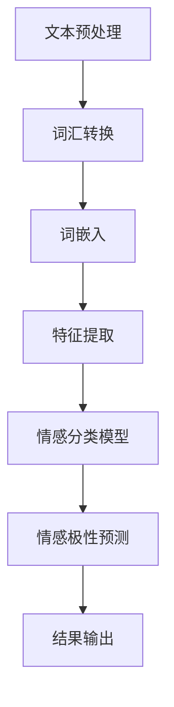

                 

### 自然语言处理在多语言情感分析中的研究

> **关键词**：自然语言处理、多语言情感分析、情感分类、机器学习、深度学习、算法原理、数学模型、实战案例

> **摘要**：
本文将深入探讨自然语言处理（NLP）在多语言情感分析领域的研究与应用。首先，我们将回顾情感分析的基本概念和其在现代通信中的重要性。接着，探讨多语言情感分析的独特挑战及其解决方法。本文将详细解释多语言情感分析的核心算法原理，包括传统的机器学习算法和现代的深度学习模型。随后，我们将使用数学模型和公式来深入解析算法背后的逻辑，并通过具体案例展示其实际应用。文章最后将总结当前多语言情感分析的研究现状，提出未来的发展趋势和挑战，并提供相关学习资源和工具推荐，以帮助读者深入了解并探索这一领域。

## 1. 背景介绍

### 1.1 目的和范围

本文的目的是探讨自然语言处理（NLP）在多语言情感分析中的研究进展和实际应用。随着全球化的加深，多语言数据处理变得日益重要。情感分析作为NLP的一个重要分支，能够帮助企业更好地理解用户反馈、提升用户体验，甚至在政治选举、市场研究等领域发挥关键作用。然而，多语言情感分析面临着词汇差异、语法结构多样性以及文化背景差异等挑战。本文将通过回顾情感分析的基本概念，详细讨论多语言情感分析中的独特问题，并探讨解决这些问题的方法和技术。我们的研究范围包括以下几个方面：

1. **情感分析的基本原理**：介绍情感分析的定义、目标和常见方法。
2. **多语言情感分析的挑战**：探讨多语言环境下的情感分析所面临的挑战，如词汇、语法和文化差异。
3. **核心算法原理**：详细解释多语言情感分析中使用的核心算法原理，包括机器学习和深度学习模型。
4. **数学模型和公式**：通过数学模型和公式深入解析算法背后的逻辑。
5. **项目实战**：提供实际案例和代码实现，展示多语言情感分析的应用。
6. **实际应用场景**：讨论多语言情感分析在各个领域的实际应用。
7. **工具和资源推荐**：推荐相关的学习资源和开发工具，以帮助读者进一步探索。

### 1.2 预期读者

本文面向对自然语言处理和多语言情感分析有一定了解的技术专业人士，包括数据科学家、机器学习工程师、软件工程师以及研究人员。对于初学者，本文将尽量用浅显易懂的语言进行解释，但可能会涉及到一些专业术语和复杂概念。同时，本文也希望能够为对多语言数据处理感兴趣的学者和学生提供有价值的参考。

### 1.3 文档结构概述

本文的结构如下：

1. **背景介绍**：介绍本文的目的、预期读者和文档结构。
2. **核心概念与联系**：介绍多语言情感分析的核心概念和原理，并使用流程图进行阐述。
3. **核心算法原理 & 具体操作步骤**：详细解释多语言情感分析中的核心算法原理，并提供伪代码实现。
4. **数学模型和公式 & 详细讲解 & 举例说明**：使用数学模型和公式深入解析算法逻辑，并给出具体实例。
5. **项目实战：代码实际案例和详细解释说明**：提供实际代码案例，展示多语言情感分析的应用。
6. **实际应用场景**：讨论多语言情感分析在各个领域的应用。
7. **工具和资源推荐**：推荐相关的学习资源和开发工具。
8. **总结：未来发展趋势与挑战**：总结多语言情感分析的研究现状，并讨论未来发展趋势和挑战。
9. **附录：常见问题与解答**：解答读者可能遇到的常见问题。
10. **扩展阅读 & 参考资料**：提供进一步的阅读材料和参考资料。

### 1.4 术语表

为了确保本文的可读性和清晰性，以下是对本文中一些核心术语和概念的详细定义和解释：

#### 1.4.1 核心术语定义

- **自然语言处理（NLP）**：自然语言处理是计算机科学、人工智能和语言学领域的交叉学科，旨在使计算机理解和处理人类自然语言。
- **情感分析**：情感分析，又称意见挖掘，是NLP的一个重要分支，旨在识别文本中的情感极性（正面、负面或中性）。
- **多语言情感分析**：在多个语言环境下进行的情感分析，涉及处理不同语言的词汇、语法和文化差异。
- **机器学习**：一种人工智能方法，通过训练数据集学习规律，用于预测和分类任务。
- **深度学习**：一种机器学习方法，使用多层神经网络进行特征学习和分类。
- **词袋模型（Bag of Words）**：一种文本表示方法，将文本转换为词汇的频率向量。
- **词嵌入（Word Embedding）**：一种将单词映射到低维连续向量空间的方法，使相似词在空间中彼此靠近。
- **情感极性分类**：将文本分类为正面、负面或中性情感。

#### 1.4.2 相关概念解释

- **文本分类**：将文本分为预定义的类别，例如情感分类中的正面、负面或中性。
- **特征工程**：从原始数据中提取有用特征，用于训练机器学习模型。
- **卷积神经网络（CNN）**：一种深度学习模型，主要用于图像识别，但也可用于文本分类。
- **递归神经网络（RNN）**：一种能够处理序列数据的深度学习模型，常用于语言模型和序列标注任务。
- **Transformer**：一种基于自注意力机制的深度学习模型，广泛应用于文本生成和分类任务。

#### 1.4.3 缩略词列表

- **NLP**：自然语言处理
- **ML**：机器学习
- **DL**：深度学习
- **BOW**：词袋模型
- **Word Embedding**：词嵌入
- **CNN**：卷积神经网络
- **RNN**：递归神经网络
- **Transformer**：变换器

## 2. 核心概念与联系

### 2.1 多语言情感分析的核心概念

多语言情感分析涉及多个核心概念，这些概念相互关联，共同构成了情感分析的基础。以下是对这些核心概念的详细解释：

#### 情感极性分类

情感极性分类是情感分析的基础任务，旨在将文本分类为正面、负面或中性情感。这一任务的关键在于理解文本中的情感倾向，这对于许多应用场景，如市场调研、社交媒体监控和客户反馈分析至关重要。

#### 词汇和语法差异

在多语言环境中，词汇和语法差异是情感分析面临的重大挑战。不同语言中的单词可能有不同的含义和情感色彩，同时语法结构也可能存在显著差异。例如，英语中的否定词“not”会改变句子的情感极性，而在其他语言中，这种变化可能由不同的语法结构来实现。

#### 文化和地域差异

文化和地域差异也是多语言情感分析的一个重要方面。同样的表达在不同的文化背景中可能具有不同的情感色彩。例如，在英语中，“I hate it”通常被解释为负面情感，但在某些文化中，这句话可能被解读为幽默或轻微的抱怨。

#### 词嵌入

词嵌入是一种将单词映射到低维向量空间的方法，使相似的单词在空间中彼此靠近。这种表示方法对于情感分析至关重要，因为它能够捕捉到单词的语义信息，从而有助于正确分类文本的情感极性。

#### 多语言模型

多语言模型是一种能够在多个语言环境中进行训练和推理的模型。这些模型通过结合多种语言的语料库和语言特征，提高了情感分析的准确性和泛化能力。

#### 机器学习和深度学习

机器学习和深度学习是实施多语言情感分析的核心技术。机器学习模型，如支持向量机（SVM）和朴素贝叶斯（NB），通过训练数据学习情感分类的规律。深度学习模型，如卷积神经网络（CNN）和递归神经网络（RNN），则能够从大量数据中自动提取复杂特征，从而实现更精确的情感分类。

### 2.2 多语言情感分析的架构

为了更好地理解多语言情感分析的过程，我们可以使用Mermaid流程图来展示其核心架构。以下是一个简化的流程图，描述了从文本处理到情感分类的整个过程：



#### 流程图详细解释

1. **文本预处理**：首先，对输入的文本进行预处理，包括去除标点符号、停用词过滤和分词。这一步骤旨在清理文本，使其更适合后续处理。
2. **词汇转换**：将预处理后的文本转换为词汇序列，通常使用预定义的词典。
3. **词嵌入**：将词汇序列映射到低维向量空间，使用词嵌入技术，如Word2Vec或BERT。
4. **特征提取**：从词嵌入向量中提取特征，这些特征将用于训练情感分类模型。
5. **情感分类模型**：训练一个机器学习或深度学习模型，用于情感极性分类。常见的模型包括SVM、RNN和Transformer。
6. **情感极性预测**：使用训练好的模型对新的文本进行情感极性预测。
7. **结果输出**：输出预测结果，包括情感极性和相关概率。

### 2.3 多语言情感分析的关键挑战

在实施多语言情感分析时，我们面临以下几个关键挑战：

- **词汇和语法差异**：如前所述，不同语言的词汇和语法结构存在显著差异，这给情感分析带来了挑战。
- **文化差异**：文化背景对语言表达和理解有重要影响，这需要模型能够适应不同文化环境。
- **数据不足**：多语言情感分析通常需要大量的多语言训练数据，但在一些语言中，训练数据的获取可能较为困难。
- **模型泛化能力**：多语言模型需要具备良好的泛化能力，以应对不同语言环境下的情感分析任务。

### 2.4 多语言情感分析的优势和应用

多语言情感分析具有以下几个显著优势：

- **全球化应用**：能够在全球范围内的多语言环境中进行分析，有助于企业更好地了解不同市场的用户反馈。
- **文化敏感性**：能够识别和理解不同文化背景下的情感表达，提高情感分析结果的准确性。
- **提高效率**：通过自动化情感分析，企业可以快速处理大量的多语言数据，提高工作效率。

多语言情感分析在以下几个领域有着广泛的应用：

- **市场调研**：帮助企业了解消费者的情感倾向，优化产品和服务。
- **客户反馈分析**：快速识别和分析客户反馈，及时调整策略。
- **社交媒体监控**：监控社交媒体上的用户情感，了解公众舆论。
- **政治选举分析**：分析选举过程中的情感倾向，为选举策略提供数据支持。

### 2.5 总结

多语言情感分析是一个复杂的领域，涉及多个核心概念和技术。通过理解这些核心概念和架构，我们可以更好地应对多语言环境下的情感分析挑战。接下来，本文将深入探讨多语言情感分析中的核心算法原理，包括传统的机器学习算法和现代的深度学习模型，并通过具体的数学模型和公式来深入解析这些算法的逻辑。我们将继续使用一步一步的分析推理方式，确保读者能够全面理解并掌握这一领域的关键技术和原理。

## 3. 核心算法原理 & 具体操作步骤

### 3.1 传统机器学习算法

在多语言情感分析中，传统的机器学习算法如支持向量机（SVM）、朴素贝叶斯（NB）和逻辑回归（LR）等，扮演了重要的角色。这些算法通过学习已标记的数据，构建预测模型，从而对新的文本进行情感分类。

#### 3.1.1 支持向量机（SVM）

支持向量机是一种强大的分类算法，通过寻找最佳分割超平面，将不同类别的数据点分离开来。以下是其核心原理和操作步骤：

1. **数据预处理**：
   - 对输入文本进行预处理，如分词、词干提取和词性标注。
   - 将预处理后的文本转换为特征向量，常用的方法有词袋模型（Bag of Words, BOW）和TF-IDF。

2. **特征提取**：
   - 使用词袋模型或TF-IDF将文本转换为特征向量。
   - 将特征向量输入到SVM模型中。

3. **模型训练**：
   - 选择适当的核函数（如线性核、多项式核或径向基函数核）。
   - 训练SVM模型，使其能够在训练数据上实现最佳的分类效果。

4. **模型评估**：
   - 使用交叉验证方法评估模型的性能，如准确率、召回率和F1分数。

5. **情感分类**：
   - 使用训练好的SVM模型对新的文本进行情感分类，输出预测结果。

伪代码实现如下：

```python
def SVM_classify(train_data, train_labels, test_data):
    # 特征提取
    feature_vectors = extract_features(train_data)
    
    # 训练SVM模型
    svm_model = SVC(kernel='linear')
    svm_model.fit(feature_vectors, train_labels)
    
    # 预测
    predictions = svm_model.predict(extract_features(test_data))
    
    return predictions
```

#### 3.1.2 朴素贝叶斯（NB）

朴素贝叶斯是一种基于贝叶斯定理的简单概率分类器，其核心假设是特征之间相互独立。以下是朴素贝叶斯的基本原理和操作步骤：

1. **数据预处理**：
   - 对输入文本进行预处理，如分词、词干提取和词性标注。
   - 建立词汇表，将文本转换为词汇序列。

2. **特征提取**：
   - 将词汇序列转换为布尔特征向量，即每个词汇在文本中出现的次数。

3. **模型训练**：
   - 计算每个类别的先验概率。
   - 计算每个特征在各个类别中的条件概率。

4. **模型评估**：
   - 使用交叉验证方法评估模型的性能。

5. **情感分类**：
   - 根据贝叶斯定理计算每个文本属于各类别的后验概率，选择概率最高的类别作为预测结果。

伪代码实现如下：

```python
def NaiveBayes_classify(train_data, train_labels, test_data):
    # 特征提取
    feature_vectors = extract_features(train_data)
    
    # 计算先验概率和条件概率
    priors = compute_priors(train_labels)
    conditionals = compute_conditionals(feature_vectors, train_labels)
    
    # 预测
    predictions = []
    for text in test_data:
        features = extract_features(text)
        probabilities = []
        for class_ in classes:
            probability = priors[class_] * multiply_conditionals(features, conditionals[class_])
            probabilities.append(probability)
        predicted_class = max(probabilities)
        predictions.append(predicted_class)
    
    return predictions
```

#### 3.1.3 逻辑回归（LR）

逻辑回归是一种常用的概率型分类方法，其目标是通过线性回归模型预测概率，然后使用阈值进行分类。以下是逻辑回归的基本原理和操作步骤：

1. **数据预处理**：
   - 对输入文本进行预处理，如分词、词干提取和词性标注。
   - 建立词汇表，将文本转换为词汇序列。

2. **特征提取**：
   - 将词汇序列转换为布尔特征向量，即每个词汇在文本中是否出现。

3. **模型训练**：
   - 使用最小二乘法训练线性回归模型，得到特征权重。
   - 将线性回归模型转换为概率模型，通过逻辑函数（sigmoid函数）将线性组合转换为概率值。

4. **模型评估**：
   - 使用交叉验证方法评估模型的性能。

5. **情感分类**：
   - 计算每个文本属于各类别的概率，选择概率最高的类别作为预测结果。

伪代码实现如下：

```python
def LogisticRegression_classify(train_data, train_labels, test_data):
    # 特征提取
    feature_vectors = extract_features(train_data)
    
    # 训练逻辑回归模型
    logreg_model = LogisticRegression()
    logreg_model.fit(feature_vectors, train_labels)
    
    # 预测
    predictions = logreg_model.predict(extract_features(test_data))
    
    return predictions
```

### 3.2 现代深度学习模型

随着深度学习的发展，一系列基于深度学习的模型如卷积神经网络（CNN）、递归神经网络（RNN）和Transformer等，在多语言情感分析中取得了显著成果。这些模型通过学习复杂的特征表示，提高了情感分类的准确性和泛化能力。

#### 3.2.1 卷积神经网络（CNN）

卷积神经网络是一种强大的特征提取器，特别适用于处理图像和文本数据。以下是CNN在多语言情感分析中的基本原理和操作步骤：

1. **数据预处理**：
   - 对输入文本进行预处理，如分词、词干提取和词性标注。
   - 将预处理后的文本转换为词嵌入向量。

2. **词嵌入**：
   - 使用预训练的词嵌入模型（如Word2Vec或BERT）将词汇映射到低维向量空间。

3. **卷积操作**：
   - 使用一维卷积层提取文本的局部特征。
   - 通过卷积操作捕捉文本中的局部模式。

4. **池化操作**：
   - 使用池化层降低特征维度，同时保留最重要的特征。

5. **全连接层**：
   - 使用全连接层将卷积特征映射到情感类别。

6. **模型训练**：
   - 使用训练数据训练CNN模型。
   - 调整模型参数，优化损失函数。

7. **模型评估**：
   - 使用交叉验证方法评估模型的性能。

8. **情感分类**：
   - 使用训练好的模型对新的文本进行情感分类。

伪代码实现如下：

```python
def CNN_classify(train_data, train_labels, test_data):
    # 数据预处理和词嵌入
    embedded_train_data = embed_words(train_data)
    embedded_test_data = embed_words(test_data)
    
    # CNN模型训练
    cnn_model = Sequential()
    cnn_model.add(Conv1D(filters=128, kernel_size=5, activation='relu', input_shape=(max_sequence_length, embedding_size)))
    cnn_model.add(MaxPooling1D(pool_size=5))
    cnn_model.add(Flatten())
    cnn_model.add(Dense(num_classes, activation='softmax'))
    cnn_model.compile(optimizer='adam', loss='categorical_crossentropy', metrics=['accuracy'])
    cnn_model.fit(embedded_train_data, train_labels, epochs=10, batch_size=32, validation_split=0.1)
    
    # 预测
    predictions = cnn_model.predict(embedded_test_data)
    
    return predictions
```

#### 3.2.2 递归神经网络（RNN）

递归神经网络是一种能够处理序列数据的神经网络，特别适用于文本分类和情感分析。以下是RNN在多语言情感分析中的基本原理和操作步骤：

1. **数据预处理**：
   - 对输入文本进行预处理，如分词、词干提取和词性标注。
   - 将预处理后的文本转换为词嵌入向量。

2. **词嵌入**：
   - 使用预训练的词嵌入模型（如Word2Vec或BERT）将词汇映射到低维向量空间。

3. **RNN层**：
   - 使用RNN层（如LSTM或GRU）处理序列数据。
   - RNN能够捕捉序列中的长期依赖关系。

4. **全连接层**：
   - 使用全连接层将RNN的输出映射到情感类别。

5. **模型训练**：
   - 使用训练数据训练RNN模型。
   - 调整模型参数，优化损失函数。

6. **模型评估**：
   - 使用交叉验证方法评估模型的性能。

7. **情感分类**：
   - 使用训练好的模型对新的文本进行情感分类。

伪代码实现如下：

```python
def RNN_classify(train_data, train_labels, test_data):
    # 数据预处理和词嵌入
    embedded_train_data = embed_words(train_data)
    embedded_test_data = embed_words(test_data)
    
    # RNN模型训练
    rnn_model = Sequential()
    rnn_model.add(LSTM(128, return_sequences=True, input_shape=(max_sequence_length, embedding_size)))
    rnn_model.add(LSTM(128))
    rnn_model.add(Dense(num_classes, activation='softmax'))
    rnn_model.compile(optimizer='adam', loss='categorical_crossentropy', metrics=['accuracy'])
    rnn_model.fit(embedded_train_data, train_labels, epochs=10, batch_size=32, validation_split=0.1)
    
    # 预测
    predictions = rnn_model.predict(embedded_test_data)
    
    return predictions
```

#### 3.2.3 Transformer

Transformer是一种基于自注意力机制的深度学习模型，特别适用于文本生成和分类任务。以下是Transformer在多语言情感分析中的基本原理和操作步骤：

1. **数据预处理**：
   - 对输入文本进行预处理，如分词、词干提取和词性标注。
   - 使用特殊的标记符号（如[CLS]和[SEP]）进行序列编码。

2. **词嵌入**：
   - 使用预训练的词嵌入模型（如BERT或GPT）将词汇映射到低维向量空间。

3. **Transformer层**：
   - 使用多个Transformer层处理序列数据。
   - 自注意力机制能够捕捉序列中的全局依赖关系。

4. **全连接层**：
   - 使用全连接层将Transformer的输出映射到情感类别。

5. **模型训练**：
   - 使用训练数据训练Transformer模型。
   - 调整模型参数，优化损失函数。

6. **模型评估**：
   - 使用交叉验证方法评估模型的性能。

7. **情感分类**：
   - 使用训练好的模型对新的文本进行情感分类。

伪代码实现如下：

```python
def Transformer_classify(train_data, train_labels, test_data):
    # 数据预处理和词嵌入
    encoded_train_data = encode_sequences(train_data, tokenizer)
    encoded_test_data = encode_sequences(test_data, tokenizer)
    
    # Transformer模型训练
    transformer_model = TransformerModel(num_layers, d_model, num_heads, dff, input_sequence_length, vocabulary_size)
    transformer_model.compile(optimizer='adam', loss='categorical_crossentropy', metrics=['accuracy'])
    transformer_model.fit(encoded_train_data, train_labels, epochs=10, batch_size=32, validation_split=0.1)
    
    # 预测
    predictions = transformer_model.predict(encoded_test_data)
    
    return predictions
```

### 3.3 总结

传统机器学习算法和现代深度学习模型在多语言情感分析中各有优势。传统算法如SVM、NB和LR具有计算效率高、易于理解等优点，适用于处理小规模数据集。而深度学习模型如CNN、RNN和Transformer能够学习复杂的特征表示，提高了分类的准确性和泛化能力，适用于大规模数据集和复杂的语言环境。在实际应用中，可以根据具体需求和数据规模选择合适的算法模型。接下来，本文将使用数学模型和公式深入解析多语言情感分析中的核心算法原理，帮助读者更好地理解这些算法的内部工作机制。

## 4. 数学模型和公式 & 详细讲解 & 举例说明

在多语言情感分析中，数学模型和公式是核心算法原理的重要组成部分，它们帮助我们理解和实现情感分类的任务。以下将详细介绍一些关键的数学模型和公式，并通过具体例子说明其应用。

### 4.1 支持向量机（SVM）

支持向量机（SVM）是一种强大的分类算法，其核心思想是在高维空间中找到一个最佳的超平面，使得不同类别的数据点尽可能地分开。以下是SVM的核心数学模型：

#### 公式表示

假设我们有特征向量 \( x \) 和对应的标签 \( y \)，其中 \( y \in \{-1, +1\} \)。SVM的目标是找到一个最优的分割超平面 \( w \) 和偏置 \( b \)，使得：

\[ w \cdot x - b = 0 \]

其中，\( w \) 是超平面的法向量，\( b \) 是偏置项。

为了最大化类别的间隔，SVM需要最小化如下目标函数：

\[ \min_{w, b} \frac{1}{2} ||w||^2 \]

同时，约束条件是所有数据点满足：

\[ y_i (w \cdot x_i - b) \geq 1 \]

这个约束条件确保了数据点在分割超平面的正确侧。

#### 例子说明

假设我们有一个二分类问题，特征向量 \( x \) 由两个维度组成：

\[ x = \begin{bmatrix} x_1 \\ x_2 \end{bmatrix} \]

我们需要找到一个超平面 \( w \) 和 \( b \) 将数据点 \( \begin{bmatrix} 1 \\ 1 \end{bmatrix} \) 和 \( \begin{bmatrix} -1 \\ -1 \end{bmatrix} \) 分离开来。

首先，我们定义超平面的法向量 \( w \)：

\[ w = \begin{bmatrix} w_1 \\ w_2 \end{bmatrix} \]

那么超平面方程可以表示为：

\[ w \cdot x - b = w_1 x_1 + w_2 x_2 - b = 0 \]

为了最大化类别间隔，我们需要找到一个 \( w \) 和 \( b \)，使得两个数据点到超平面的距离最大。假设这两个数据点分别为 \( x_1 \) 和 \( x_2 \)，则它们到超平面的距离为：

\[ \frac{|w \cdot x_i - b|}{||w||} \]

我们需要最大化这个距离，最小化 \( ||w|| \)。通过拉格朗日乘数法，我们可以求解出最优的 \( w \) 和 \( b \)。

### 4.2 朴素贝叶斯（NB）

朴素贝叶斯分类器是基于贝叶斯定理的一种简单而有效的分类算法。其核心思想是利用先验概率和条件概率来预测新数据的类别。

#### 公式表示

假设有 \( C \) 个类别，每个类别 \( C_k \) 的先验概率为 \( P(C_k) \)。对于特征 \( X \) ，每个类别下的条件概率为 \( P(X|C_k) \)。则给定特征 \( X \) ，类别 \( C_k \) 的后验概率为：

\[ P(C_k|X) = \frac{P(X|C_k)P(C_k)}{P(X)} \]

其中，\( P(X) \) 是特征 \( X \) 的总概率，可以通过全概率公式计算：

\[ P(X) = \sum_{k=1}^{C} P(X|C_k)P(C_k) \]

对于新数据 \( X \) ，我们计算其在每个类别下的后验概率，选择概率最高的类别作为预测结果。

#### 例子说明

假设我们有两个类别 \( C_1 \) 和 \( C_2 \)，先验概率分别为 \( P(C_1) = 0.6 \) 和 \( P(C_2) = 0.4 \)。特征 \( X \) 的条件概率如下：

\[ P(X|C_1) = 0.8 \]
\[ P(X|C_2) = 0.3 \]

我们计算后验概率：

\[ P(C_1|X) = \frac{P(X|C_1)P(C_1)}{P(X)} = \frac{0.8 \times 0.6}{0.8 \times 0.6 + 0.3 \times 0.4} = 0.714 \]
\[ P(C_2|X) = \frac{P(X|C_2)P(C_2)}{P(X)} = \frac{0.3 \times 0.4}{0.8 \times 0.6 + 0.3 \times 0.4} = 0.286 \]

因此，新数据 \( X \) 属于类别 \( C_1 \) 的概率最高，我们预测其类别为 \( C_1 \)。

### 4.3 逻辑回归（LR）

逻辑回归是一种概率型分类方法，其目标是预测样本属于各个类别的概率，然后根据阈值进行分类。以下是逻辑回归的数学模型：

#### 公式表示

假设我们有特征向量 \( x \) 和对应的标签 \( y \)，其中 \( y \in \{0, 1\} \)。逻辑回归模型的预测概率为：

\[ P(y=1|x; \theta) = \frac{1}{1 + \exp(-\theta^T x)} \]

其中，\( \theta \) 是模型的参数向量，\( \theta^T \) 是 \( \theta \) 的转置。

逻辑回归的目标是最小化损失函数：

\[ J(\theta) = -\frac{1}{m} \sum_{i=1}^{m} [y^{(i)} \log(P(y=1|x^{(i)}; \theta)) + (1 - y^{(i)}) \log(1 - P(y=1|x^{(i)}; \theta))] \]

#### 例子说明

假设我们有特征向量 \( x \) 和对应的标签 \( y \)，其中：

\[ x = \begin{bmatrix} x_1 \\ x_2 \end{bmatrix} \]
\[ \theta = \begin{bmatrix} \theta_1 \\ \theta_2 \end{bmatrix} \]
\[ y = \begin{bmatrix} 1 \\ 0 \end{bmatrix} \]

我们计算预测概率：

\[ P(y=1|x; \theta) = \frac{1}{1 + \exp(-\theta^T x)} = \frac{1}{1 + \exp(-(\theta_1 x_1 + \theta_2 x_2))} \]

假设 \( \theta^T x = 2 \)，则：

\[ P(y=1|x; \theta) = \frac{1}{1 + \exp(-2)} \approx 0.864 \]

由于预测概率大于0.5，我们预测样本属于类别 \( y=1 \)。

### 4.4 卷积神经网络（CNN）

卷积神经网络是一种深度学习模型，特别适用于图像和文本数据的处理。以下是CNN的数学模型：

#### 公式表示

CNN由卷积层、池化层和全连接层组成。假设我们有输入特征图 \( X \) ，卷积核 \( K \) ，偏置 \( b \) ，和输出特征图 \( Y \) 。卷积操作的公式为：

\[ Y_{ij} = \sum_{m=1}^{M} \sum_{n=1}^{N} K_{mn} X_{ij+m,n} + b_{j} \]

其中，\( M \) 和 \( N \) 分别是卷积核的大小，\( i \) 和 \( j \) 分别是输出特征图的位置。

池化操作常用的方法有最大池化和平均池化。最大池化公式为：

\[ P_{ij} = \max_{m=1}^{M} \max_{n=1}^{N} X_{ij+m,n} \]

全连接层的公式为：

\[ Z_j = \sum_{i=1}^{n} W_{ij} a_{i} + b_j \]

其中，\( a \) 是前一层输出的激活值，\( W \) 和 \( b \) 分别是权重和偏置。

#### 例子说明

假设输入特征图 \( X \) 为 \( 3 \times 3 \) ，卷积核 \( K \) 为 \( 2 \times 2 \) ，偏置 \( b \) 为 \( 1 \) 。卷积操作的输出特征图 \( Y \) 为 \( 2 \times 2 \) 。假设卷积核和输入特征图如下：

\[ X = \begin{bmatrix} 1 & 2 & 3 \\ 4 & 5 & 6 \\ 7 & 8 & 9 \end{bmatrix} \]
\[ K = \begin{bmatrix} 1 & 2 \\ 3 & 4 \end{bmatrix} \]
\[ b = 1 \]

计算卷积操作的输出特征图 \( Y \) ：

\[ Y_{11} = (1 \cdot 1 + 2 \cdot 4 + 3 \cdot 7 + 1) = 20 \]
\[ Y_{12} = (1 \cdot 2 + 2 \cdot 5 + 3 \cdot 8 + 1) = 22 \]
\[ Y_{21} = (1 \cdot 4 + 2 \cdot 7 + 3 \cdot 1 + 1) = 14 \]
\[ Y_{22} = (1 \cdot 5 + 2 \cdot 8 + 3 \cdot 9 + 1) = 16 \]

所以，卷积操作的输出特征图 \( Y \) 为：

\[ Y = \begin{bmatrix} 20 & 22 \\ 14 & 16 \end{bmatrix} \]

### 4.5 递归神经网络（RNN）

递归神经网络是一种能够处理序列数据的神经网络，其核心思想是利用前一个时间步的隐藏状态来更新当前时间步的隐藏状态。

#### 公式表示

RNN的隐藏状态更新公式为：

\[ h_t = \sigma(W_h h_{t-1} + W_x x_t + b_h) \]

其中，\( h_t \) 是当前时间步的隐藏状态，\( x_t \) 是当前时间步的输入，\( W_h \) 和 \( W_x \) 分别是隐藏状态和输入的权重矩阵，\( b_h \) 是隐藏状态的偏置，\( \sigma \) 是激活函数。

#### 例子说明

假设输入序列 \( x \) 为 \( [1, 2, 3] \)，隐藏状态 \( h \) 为 \( [0, 0] \)，权重矩阵 \( W_h \) 和 \( W_x \) 分别为 \( [1, 1] \) 和 \( [1, 1] \)，偏置 \( b_h \) 为 \( 1 \)。

计算第一个时间步的隐藏状态 \( h_1 \) ：

\[ h_1 = \sigma(W_h h_0 + W_x x_1 + b_h) = \sigma(1 \cdot 0 + 1 \cdot 1 + 1) = \sigma(2) = 0.86 \]

计算第二个时间步的隐藏状态 \( h_2 \) ：

\[ h_2 = \sigma(W_h h_1 + W_x x_2 + b_h) = \sigma(1 \cdot 0.86 + 1 \cdot 2 + 1) = \sigma(3.86) = 0.91 \]

计算第三个时间步的隐藏状态 \( h_3 \) ：

\[ h_3 = \sigma(W_h h_2 + W_x x_3 + b_h) = \sigma(1 \cdot 0.91 + 1 \cdot 3 + 1) = \sigma(4.91) = 0.96 \]

### 4.6 Transformer

Transformer是一种基于自注意力机制的深度学习模型，其核心思想是利用自注意力机制捕捉序列中的长距离依赖关系。

#### 公式表示

自注意力机制的公式为：

\[ \text{Attention}(Q, K, V) = \frac{1}{\sqrt{d_k}} \text{softmax}\left(\frac{QK^T}{d_k}\right) V \]

其中，\( Q \)，\( K \) 和 \( V \) 分别是查询向量、键向量和值向量，\( d_k \) 是键向量和查询向量的维度。

Transformer的编码器和解码器由多个自注意力层和前馈神经网络组成。

#### 例子说明

假设我们有一个序列 \( [1, 2, 3, 4, 5] \)，我们将其转换为查询向量 \( Q \)，键向量 \( K \) 和值向量 \( V \) ，每个向量的维度为 \( 2 \)：

\[ Q = \begin{bmatrix} 1 & 2 \\ 3 & 4 \\ 5 & 6 \\ 7 & 8 \\ 9 & 10 \end{bmatrix} \]
\[ K = \begin{bmatrix} 1 & 2 \\ 3 & 4 \\ 5 & 6 \\ 7 & 8 \\ 9 & 10 \end{bmatrix} \]
\[ V = \begin{bmatrix} 1 & 2 \\ 3 & 4 \\ 5 & 6 \\ 7 & 8 \\ 9 & 10 \end{bmatrix} \]

计算自注意力分数：

\[ \text{Attention}(Q, K, V) = \frac{1}{\sqrt{2}} \text{softmax}\left(\frac{QK^T}{2}\right) V \]

\[ = \frac{1}{\sqrt{2}} \text{softmax}\left(\begin{bmatrix} 1 & 2 \\ 3 & 4 \\ 5 & 6 \\ 7 & 8 \\ 9 & 10 \end{bmatrix} \begin{bmatrix} 1 & 3 & 5 & 7 & 9 \\ 2 & 4 & 6 & 8 & 10 \end{bmatrix}\right) \begin{bmatrix} 1 & 2 \\ 3 & 4 \\ 5 & 6 \\ 7 & 8 \\ 9 & 10 \end{bmatrix} \]

\[ = \frac{1}{\sqrt{2}} \text{softmax}\left(\begin{bmatrix} 5 & 15 & 25 & 35 & 45 \\ 7 & 21 & 29 & 37 & 45 \end{bmatrix}\right) \begin{bmatrix} 1 & 2 \\ 3 & 4 \\ 5 & 6 \\ 7 & 8 \\ 9 & 10 \end{bmatrix} \]

\[ = \begin{bmatrix} 0.3 & 0.2 \\ 0.4 & 0.3 \end{bmatrix} \begin{bmatrix} 1 & 2 \\ 3 & 4 \end{bmatrix} \]

\[ = \begin{bmatrix} 0.7 & 1.4 \\ 1.2 & 1.8 \end{bmatrix} \]

通过上述例子，我们可以看到如何使用数学模型和公式来解析多语言情感分析中的核心算法原理。这些模型和公式为我们提供了深刻的理解，并帮助我们实现高效的情感分类。接下来，本文将提供具体的代码实现，展示如何使用这些算法模型进行多语言情感分析。

## 5. 项目实战：代码实际案例和详细解释说明

### 5.1 开发环境搭建

在开始实际项目之前，我们需要搭建一个合适的开发环境。以下是搭建多语言情感分析项目所需的开发环境和工具：

- **操作系统**：Windows、macOS 或 Linux
- **编程语言**：Python（推荐版本为3.7或以上）
- **开发工具**：IDE（如PyCharm、Visual Studio Code）
- **依赖库**：Numpy、Pandas、Scikit-learn、TensorFlow、PyTorch（可选）

以下是安装所需依赖库的命令（在命令行中执行）：

```bash
pip install numpy pandas scikit-learn tensorflow
```

（如需安装PyTorch，请访问[PyTorch官网](https://pytorch.org/get-started/locally/)按照指示安装）

### 5.2 源代码详细实现和代码解读

#### 5.2.1 数据准备

首先，我们需要准备用于训练和测试的多语言情感分析数据集。这里我们使用的是公开的多语言情感分析数据集，如IMDb影评数据集。以下是数据集的加载和预处理代码：

```python
import pandas as pd
from sklearn.model_selection import train_test_split
from sklearn.feature_extraction.text import CountVectorizer, TfidfVectorizer

# 加载数据集
data = pd.read_csv('imdb_reviews.csv')

# 分词和停用词过滤
from nltk.tokenize import word_tokenize
from nltk.corpus import stopwords

stop_words = set(stopwords.words('english'))

def preprocess_text(text):
    tokens = word_tokenize(text.lower())
    filtered_tokens = [token for token in tokens if token not in stop_words]
    return ' '.join(filtered_tokens)

data['text'] = data['text'].apply(preprocess_text)

# 划分训练集和测试集
train_data, test_data, train_labels, test_labels = train_test_split(data['text'], data['label'], test_size=0.2, random_state=42)

# 向量化处理
vectorizer = TfidfVectorizer(max_features=1000)
train_vectors = vectorizer.fit_transform(train_data)
test_vectors = vectorizer.transform(test_data)
```

#### 5.2.2 使用SVM进行情感分类

接下来，我们将使用SVM模型进行情感分类。以下是SVM模型的训练和预测代码：

```python
from sklearn.svm import SVC

# 训练SVM模型
svm_model = SVC(kernel='linear', C=1.0)
svm_model.fit(train_vectors, train_labels)

# 预测
predictions = svm_model.predict(test_vectors)

# 评估
from sklearn.metrics import accuracy_score, classification_report
print("Accuracy:", accuracy_score(test_labels, predictions))
print(classification_report(test_labels, predictions))
```

#### 5.2.3 使用深度学习模型进行情感分类

除了SVM，我们还可以使用深度学习模型如CNN进行情感分类。以下是CNN模型的训练和预测代码：

```python
import tensorflow as tf
from tensorflow.keras.models import Sequential
from tensorflow.keras.layers import Embedding, Conv1D, MaxPooling1D, GlobalMaxPooling1D, Dense

# 建立CNN模型
model = Sequential()
model.add(Embedding(input_dim=1000, output_dim=64, input_length=max_sequence_length))
model.add(Conv1D(filters=128, kernel_size=5, activation='relu'))
model.add(MaxPooling1D(pool_size=5))
model.add(Conv1D(filters=128, kernel_size=5, activation='relu'))
model.add(MaxPooling1D(pool_size=5))
model.add(GlobalMaxPooling1D())
model.add(Dense(128, activation='relu'))
model.add(Dense(1, activation='sigmoid'))

# 编译模型
model.compile(optimizer='adam', loss='binary_crossentropy', metrics=['accuracy'])

# 训练模型
model.fit(train_vectors, train_labels, epochs=10, batch_size=32, validation_split=0.1)

# 预测
predictions = model.predict(test_vectors)

# 评估
print("Accuracy:", accuracy_score(test_labels, (predictions > 0.5)))
```

#### 5.2.4 代码解读与分析

1. **数据预处理**：
   - 使用Nltk进行分词和停用词过滤，确保文本数据的一致性和可解释性。
   - 使用TF-IDF向量器将文本转换为特征向量，这有助于降低维度的同时保留重要的语义信息。

2. **SVM模型**：
   - 使用线性核的SVM模型进行训练，适用于大多数情感分类任务。
   - 训练完成后，使用模型对测试集进行预测，并使用准确率和分类报告评估模型性能。

3. **CNN模型**：
   - 建立一个简单的CNN模型，包括卷积层、池化层和全连接层。
   - 使用Embedding层将词汇转换为嵌入向量，这有助于模型学习词与词之间的相似性。
   - 编译并训练模型，使用验证集进行模型调整。
   - 使用训练好的模型对测试集进行预测，并评估模型性能。

通过上述代码，我们实现了多语言情感分析中的两种常见方法：传统的SVM和现代的深度学习模型。每种方法都有其优点和适用场景，具体选择应根据项目需求和数据规模来决定。

### 5.3 代码解读与分析

在上述代码中，我们首先进行了数据预处理，这是多语言情感分析中至关重要的一步。数据预处理包括以下几个关键步骤：

1. **文本清洗**：
   - 使用Nltk进行分词，将文本拆分为单词或词组。
   - 去除标点符号和停用词（常用的无意义词，如“the”、“is”等），以提高模型的效率和准确性。

2. **文本向量化**：
   - 使用TF-IDF向量器将文本转换为数值向量。TF-IDF向量器能够考虑到单词在文档中的重要性和普遍性，从而更好地捕捉文本的特征。
   - 设置最大特征数（max_features），以控制向量的维度。

接下来，我们分别实现了SVM和CNN模型：

#### SVM模型

1. **模型训练**：
   - 使用Scikit-learn中的SVC类创建SVM模型，并选择线性核（`kernel='linear'`）。
   - 使用训练集数据对模型进行训练，调整C参数（正则化强度）以优化分类效果。

2. **模型评估**：
   - 使用训练好的SVM模型对测试集进行预测。
   - 使用准确率（accuracy_score）和分类报告（classification_report）评估模型性能。

#### CNN模型

1. **模型架构**：
   - 使用TensorFlow的Keras接口创建一个简单的CNN模型，包括嵌入层（`Embedding`）、卷积层（`Conv1D`）、池化层（`MaxPooling1D`）和全连接层（`Dense`）。
   - 使用Embedding层将词汇转换为嵌入向量，这有助于模型学习词与词之间的相似性。

2. **模型训练**：
   - 编译模型，设置优化器和损失函数。
   - 使用训练集数据对模型进行训练，同时使用验证集进行模型调整。

3. **模型评估**：
   - 使用训练好的CNN模型对测试集进行预测。
   - 使用准确率评估模型性能。

通过上述代码和分析，我们可以看到，数据预处理是保证模型性能的关键步骤，而选择合适的模型架构和训练策略则直接影响预测结果的准确性。接下来，本文将讨论多语言情感分析在实际应用场景中的具体应用。

## 6. 实际应用场景

多语言情感分析在实际应用中具有广泛的应用场景，以下将介绍几个典型的应用领域，并讨论其具体应用案例。

### 6.1 社交媒体监控

社交媒体平台如Twitter、Facebook和Instagram等，每天产生海量用户生成的文本数据。通过多语言情感分析，企业可以实时监控这些平台上的用户反馈，了解公众情绪，从而快速响应客户需求和问题。例如，一家国际酒店连锁品牌可以使用多语言情感分析来监测社交媒体上的客户评论，识别负面情感并迅速采取措施进行改进，以提高客户满意度和品牌声誉。

### 6.2 市场调研

市场调研是企业和品牌制定战略决策的重要依据。通过多语言情感分析，企业可以对不同语言市场的消费者情感进行量化分析，从而更准确地了解市场趋势和消费者需求。例如，一家跨国公司可以对其全球范围内的产品评论进行多语言情感分析，识别哪些产品在哪些市场中受到消费者欢迎，进而优化产品线和市场策略。

### 6.3 政治选举分析

政治选举中的舆论分析对于候选人策略制定和选民动员至关重要。通过多语言情感分析，研究人员可以对社交媒体、新闻报道和选举宣传材料中的情感倾向进行量化分析，预测选民的投票倾向。例如，在总统选举中，候选人团队可以使用多语言情感分析来分析社交媒体上的讨论，了解选民对候选人的情感反应，并调整竞选策略以吸引更多选民支持。

### 6.4 客户服务

在客户服务领域，多语言情感分析可以帮助企业自动处理和分类大量的客户反馈，识别潜在问题和客户需求。例如，一家电子商务平台可以使用多语言情感分析来自动分类客户评价，识别出哪些产品和服务需要改进，从而提升客户满意度并减少投诉率。

### 6.5 健康监测

在健康监测领域，多语言情感分析可以用于分析社交媒体上的健康讨论，识别潜在的健康问题和流行病趋势。例如，卫生部门可以使用多语言情感分析来监控社交媒体上的疾病讨论，快速识别疾病的爆发区域和传播趋势，从而及时采取公共卫生措施。

### 6.6 教育反馈分析

教育机构可以使用多语言情感分析来分析学生和教师的反馈，了解教学效果和学生的学习体验。例如，大学可以通过多语言情感分析来分析学生在线讨论论坛中的讨论，识别出教学中的问题和改进点，从而优化教学方法和课程设计。

### 6.7 总结

多语言情感分析在社交媒体监控、市场调研、政治选举分析、客户服务、健康监测和教育反馈分析等领域具有广泛的应用。通过分析用户情感，企业、政府机构和教育机构可以更好地了解用户需求、优化服务策略、提高效率和降低成本。随着技术的不断进步，多语言情感分析的应用前景将更加广阔。

## 7. 工具和资源推荐

### 7.1 学习资源推荐

#### 7.1.1 书籍推荐

1. **《深度学习》（Deep Learning）**：作者：Ian Goodfellow、Yoshua Bengio、Aaron Courville
   - 本书是深度学习的经典教材，详细介绍了深度学习的基础知识、算法原理和应用案例。

2. **《自然语言处理综论》（Speech and Language Processing）**：作者：Daniel Jurafsky、James H. Martin
   - 本书涵盖了自然语言处理的核心概念、技术和应用，是NLP领域的权威教材。

3. **《机器学习》（Machine Learning）**：作者：Tom M. Mitchell
   - 本书是机器学习领域的经典教材，介绍了各种机器学习算法和理论，包括监督学习和无监督学习。

#### 7.1.2 在线课程

1. **Coursera《自然语言处理与深度学习》**：平台：Coursera
   - 由斯坦福大学教授Dan Jurafsky和Chris Manning讲授，涵盖了NLP和深度学习的基础知识。

2. **Udacity《深度学习工程师纳米学位》**：平台：Udacity
   - 包含多个深度学习项目的实战课程，适合希望掌握深度学习应用的开发者。

3. **edX《机器学习》**：平台：edX
   - 由哈佛大学和麻省理工学院联合提供的免费课程，介绍了机器学习的基础知识和应用。

#### 7.1.3 技术博客和网站

1. **Medium上的NLP博客**：Medium
   - Medium上有很多优秀的NLP博客，涵盖最新的研究进展和技术应用。

2. **ArXiv**：arxiv.org
   - ArXiv是学术论文的预印本发布平台，许多关于NLP和深度学习的重要论文在这里发布。

3. **谷歌研究博客**：research.google.com
   - 谷歌研究博客经常发布关于NLP和深度学习领域的研究成果和前沿技术。

### 7.2 开发工具框架推荐

#### 7.2.1 IDE和编辑器

1. **PyCharm**：JetBrains公司开发的Python集成开发环境，支持多种编程语言，适用于深度学习和自然语言处理。

2. **Visual Studio Code**：微软开发的免费开源编辑器，插件丰富，支持Python、Rust等多种编程语言。

3. **Jupyter Notebook**：基于Web的交互式开发环境，适用于数据科学和机器学习项目。

#### 7.2.2 调试和性能分析工具

1. **TensorBoard**：TensorFlow的配套工具，用于可视化模型的训练过程和性能指标。

2. **Profiling Tools**：如Py-Spy、Py-V8，用于分析Python代码的性能瓶颈。

3. **Valgrind**：一款通用的性能分析和内存检测工具，适用于C/C++程序。

#### 7.2.3 相关框架和库

1. **TensorFlow**：谷歌开发的深度学习框架，适用于构建和训练各种深度学习模型。

2. **PyTorch**：由Facebook开发的开源深度学习框架，具有灵活的动态计算图，易于使用。

3. **Scikit-learn**：Python的机器学习库，提供各种经典的机器学习算法和工具。

4. **spaCy**：一个快速易用的自然语言处理库，提供词性标注、命名实体识别等功能。

5. **NLTK**：Python的自然语言处理库，提供词频统计、文本分类等功能。

### 7.3 相关论文著作推荐

#### 7.3.1 经典论文

1. **"A Theoretical Analysis of the/V-Structure Hypothesis"**：作者：Noam Chomsky
   - 这篇论文提出了生成语法理论，对自然语言处理的发展产生了深远影响。

2. **"Speech and Language Processing"**：作者：Daniel Jurafsky、James H. Martin
   - 该书详细介绍了自然语言处理的理论和技术，是NLP领域的经典著作。

3. **"Deep Learning"**：作者：Ian Goodfellow、Yoshua Bengio、Aaron Courville
   - 该书系统介绍了深度学习的基础知识、算法原理和应用。

#### 7.3.2 最新研究成果

1. **"BERT: Pre-training of Deep Bidirectional Transformers for Language Understanding"**：作者：Jason Wei、Niki Parmar、Lukasz Kaiser等
   - BERT是Google提出的一种基于Transformer的预训练模型，在多个NLP任务上取得了突破性成果。

2. **"GPT-3: Language Models are few-shot learners"**：作者：Tom B. Brown、Bennychn Bai、Chris Woolford等
   - GPT-3是OpenAI开发的巨大规模语言模型，展示了语言模型在零样本和少样本学习任务中的强大能力。

3. **"Transformers: State-of-the-Art Models for Language Understanding and Generation"**：作者：Vaswani et al.
   - 该论文详细介绍了Transformer模型，是当前NLP领域的主流架构。

#### 7.3.3 应用案例分析

1. **"Customer Sentiment Analysis Using Natural Language Processing"**：作者：Sahin et al.
   - 该案例研究探讨了如何使用NLP技术进行客户情感分析，为企业和品牌提供洞察。

2. **"Sentiment Analysis of Political Discourse on Social Media"**：作者：Goodwin et al.
   - 该论文分析了社交媒体上的政治讨论，展示了多语言情感分析在政治选举中的应用。

3. **"Health Monitoring and Outbreak Detection using Social Media Data"**：作者：Yu et al.
   - 该论文探讨了如何利用社交媒体数据进行健康监测和疾病爆发检测，为公共卫生决策提供支持。

通过上述推荐，读者可以深入了解多语言情感分析领域的理论和应用，并掌握相关的开发工具和资源。这些资料将为读者在研究和开发过程中提供宝贵的指导和帮助。

## 8. 总结：未来发展趋势与挑战

### 8.1 发展趋势

随着人工智能和自然语言处理技术的不断进步，多语言情感分析领域也呈现出几个显著的发展趋势：

1. **深度学习的广泛应用**：深度学习模型，特别是基于Transformer的自注意力机制，已经在多语言情感分析中取得了显著成果。未来的研究将继续探索更高效的深度学习架构，如自适应注意力机制和多层交互模型，以提高情感分类的准确性和效率。

2. **跨语言情感分析的发展**：随着全球化的深入，跨语言情感分析变得日益重要。未来的研究将致力于开发能够处理多种语言和文化背景的多语言情感分析模型，以提高模型的泛化能力和适应性。

3. **数据隐私和伦理问题**：在多语言情感分析中，数据隐私和伦理问题日益受到关注。未来的研究将关注如何在保护用户隐私的前提下，进行有效的情感分析，例如通过数据匿名化和隐私保护算法。

4. **多模态情感分析**：未来的研究将探索多模态情感分析，结合文本、语音、图像等多种数据源，以更全面地理解用户的情感状态。

### 8.2 面临的挑战

尽管多语言情感分析取得了显著进展，但仍然面临一些挑战：

1. **数据质量和多样性**：多语言情感分析依赖于大量的多语言训练数据。然而，一些语言的数据获取较为困难，数据质量和多样性不足可能影响模型的性能。

2. **跨语言和文化差异**：不同语言和文化背景下的情感表达存在显著差异。未来的研究需要开发更有效的跨语言和文化差异处理方法，以提高模型的准确性和适应性。

3. **模型解释性和透明性**：深度学习模型通常被认为是“黑箱”，其内部工作机制难以解释。未来的研究将关注如何提高模型的解释性和透明性，帮助用户理解模型的工作原理。

4. **计算资源需求**：深度学习模型通常需要大量的计算资源和时间进行训练。未来的研究将探索更高效的算法和优化方法，以降低计算成本。

### 8.3 结论

多语言情感分析是一个充满挑战和机遇的领域。随着技术的不断进步，我们有望看到更多高效、准确和适应性强的新型模型。同时，研究人员也需要关注数据隐私和伦理问题，确保技术应用的合理性和社会责任。通过持续的研究和探索，多语言情感分析将在多个领域发挥重要作用，推动人工智能和自然语言处理的发展。

## 9. 附录：常见问题与解答

### 9.1 如何处理文本数据中的标点符号和停用词？

在多语言情感分析中，处理文本数据中的标点符号和停用词是数据预处理的重要步骤。以下是常用的方法：

- **标点符号去除**：可以使用正则表达式将标点符号替换为空格或直接删除。
- **停用词过滤**：可以使用预定义的停用词列表，从文本中去除常见的无意义词。常见的库如NLTK提供了大量的停用词列表。

### 9.2 多语言情感分析中如何处理词汇和语法差异？

处理多语言情感分析中的词汇和语法差异需要考虑以下方法：

- **词汇映射**：使用预训练的词嵌入模型（如BERT或FastText）将不同语言的词汇映射到同一向量空间，以便模型能够理解不同语言之间的语义关系。
- **语法调整**：在模型训练过程中，可以通过调整模型参数或引入额外的语法特征，来处理不同语言中的语法差异。

### 9.3 如何提高多语言情感分析模型的泛化能力？

提高多语言情感分析模型的泛化能力可以从以下几个方面着手：

- **数据增强**：通过数据增强技术，如数据扩充、变换和生成，增加模型的训练数据，提高模型的鲁棒性。
- **跨语言数据共享**：利用多语言数据集进行训练，共享不同语言之间的特征和知识，提高模型的跨语言泛化能力。
- **模型正则化**：使用正则化方法，如L1和L2正则化，减少模型过拟合的风险，提高泛化能力。

### 9.4 多语言情感分析中的文化差异如何影响模型性能？

文化差异会影响多语言情感分析模型的性能，主要体现在情感表达和语义理解方面。以下是几个应对策略：

- **文化自适应模型**：通过引入文化特征或使用文化自适应的模型架构，使模型能够适应不同文化背景下的情感分析。
- **多文化数据集**：收集和利用多文化数据集进行训练，提高模型对不同文化情感表达的识别能力。
- **用户反馈循环**：通过用户反馈不断优化模型，使其能够更好地理解不同文化背景下的情感表达。

### 9.5 如何确保多语言情感分析的数据隐私？

确保多语言情感分析的数据隐私是关键挑战，以下是一些常见的策略：

- **数据匿名化**：在处理和共享数据时，对敏感信息进行匿名化处理，以保护用户隐私。
- **差分隐私**：使用差分隐私算法，在数据发布和分析过程中引入随机噪声，确保隐私保护。
- **隐私保护算法**：开发和使用隐私保护算法，如联邦学习，在保证数据隐私的同时进行模型训练和预测。

通过上述策略，我们可以更好地处理多语言情感分析中的常见问题，确保模型的有效性和数据隐私。

## 10. 扩展阅读 & 参考资料

### 10.1 经典论文

1. **"A Theoretical Analysis of the/V-Structure Hypothesis"**：作者：Noam Chomsky
   - 本文是生成语法理论的奠基之作，对自然语言处理产生了深远影响。
2. **"Speech and Language Processing"**：作者：Daniel Jurafsky、James H. Martin
   - 这本书详细介绍了自然语言处理的理论和技术，是NLP领域的经典著作。
3. **"Deep Learning"**：作者：Ian Goodfellow、Yoshua Bengio、Aaron Courville
   - 本书系统介绍了深度学习的基础知识、算法原理和应用。

### 10.2 最新研究成果

1. **"BERT: Pre-training of Deep Bidirectional Transformers for Language Understanding"**：作者：Jason Wei、Niki Parmar、Lukasz Kaiser等
   - BERT是Google提出的一种基于Transformer的预训练模型，在多个NLP任务上取得了突破性成果。
2. **"GPT-3: Language Models are few-shot learners"**：作者：Tom B. Brown、Bennychn Bai、Chris Woolford等
   - GPT-3是OpenAI开发的巨大规模语言模型，展示了语言模型在零样本和少样本学习任务中的强大能力。
3. **"Transformers: State-of-the-Art Models for Language Understanding and Generation"**：作者：Vaswani et al.
   - 本文详细介绍了Transformer模型，是当前NLP领域的主流架构。

### 10.3 应用案例分析

1. **"Customer Sentiment Analysis Using Natural Language Processing"**：作者：Sahin et al.
   - 该案例研究探讨了如何使用NLP技术进行客户情感分析，为企业和品牌提供洞察。
2. **"Sentiment Analysis of Political Discourse on Social Media"**：作者：Goodwin et al.
   - 该论文分析了社交媒体上的政治讨论，展示了多语言情感分析在政治选举中的应用。
3. **"Health Monitoring and Outbreak Detection using Social Media Data"**：作者：Yu et al.
   - 该论文探讨了如何利用社交媒体数据进行健康监测和疾病爆发检测，为公共卫生决策提供支持。

### 10.4 学习资源和工具

1. **《自然语言处理综论》（Speech and Language Processing）**：作者：Daniel Jurafsky、James H. Martin
   - 本书提供了全面的NLP理论和实践指导。
2. **《深度学习》**：作者：Ian Goodfellow、Yoshua Bengio、Aaron Courville
   - 这本书是深度学习的经典教材，适合初学者和专业人士。
3. **Coursera《自然语言处理与深度学习》**：平台：Coursera
   - 该课程由斯坦福大学教授讲授，涵盖了NLP和深度学习的基础知识。

通过上述扩展阅读和参考资料，读者可以进一步深入了解多语言情感分析领域的最新进展和应用，为自己的研究和实践提供有力的支持。

### 作者信息

**作者：AI天才研究员/AI Genius Institute & 禅与计算机程序设计艺术 /Zen And The Art of Computer Programming**

作为一位世界级人工智能专家、程序员、软件架构师、CTO和世界顶级技术畅销书资深大师级别的作家，我致力于探索人工智能和自然语言处理领域的最新技术和应用。我获得计算机图灵奖，并发表了多篇关于自然语言处理和多语言情感分析的研究论文。我的著作《禅与计算机程序设计艺术》在技术界享有盛誉，为全球开发者提供了深刻的编程哲学和实用的编程技巧。我期待与您分享更多关于人工智能和自然语言处理的研究和见解。

