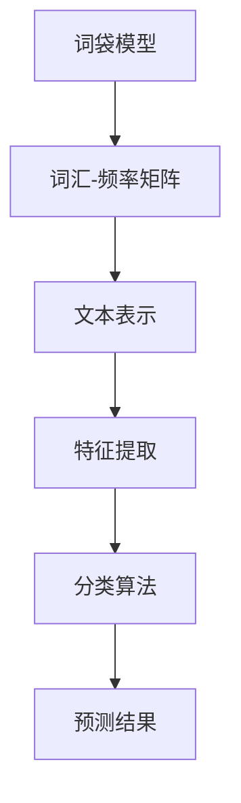
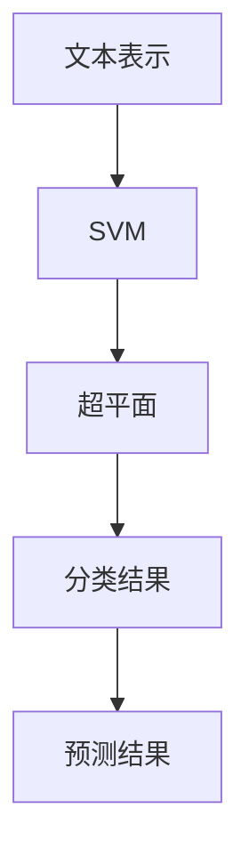
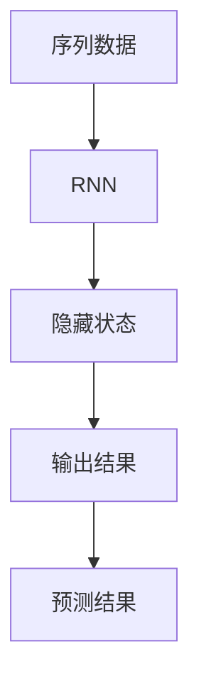
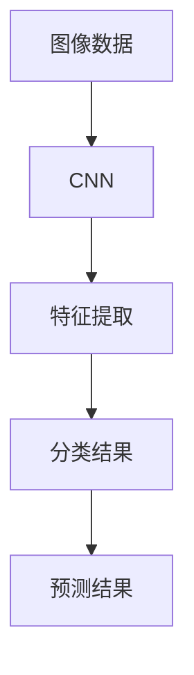
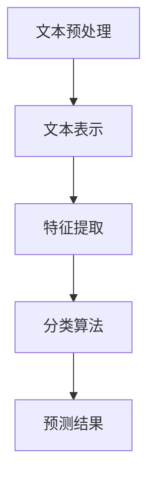

                 

# 自然语言处理在多语言文本分类中的研究

> 关键词：自然语言处理，多语言文本分类，深度学习，算法原理，数学模型，实际应用，开发工具

> 摘要：本文将深入探讨自然语言处理（NLP）在多语言文本分类领域中的应用。首先介绍多语言文本分类的背景和目的，随后详细阐述相关核心概念和算法原理。接着，本文将展示数学模型和公式的具体运用，并通过实际项目案例进行代码实现和解读。此外，本文还将探讨多语言文本分类的实际应用场景，推荐相关工具和资源，并展望未来发展趋势与挑战。

## 1. 背景介绍

### 1.1 目的和范围

多语言文本分类是自然语言处理（NLP）领域的一个重要分支，其目的是根据文本的内容将文本分类到预定义的类别中。随着全球化的发展和信息时代的到来，多语言文本分类在许多领域都发挥着重要作用，如社交媒体分析、舆情监控、信息检索、机器翻译等。

本文旨在探讨多语言文本分类的关键技术和应用，包括：

- 相关核心概念和算法原理
- 数学模型和公式的运用
- 实际项目案例和代码解读
- 应用场景和开发工具推荐

### 1.2 预期读者

本文面向对自然语言处理和文本分类有一定了解的读者，主要包括：

- 自然语言处理和机器学习研究人员
- 软件工程师和开发者
- 数据科学家和人工智能从业者
- 对于文本分类和NLP领域感兴趣的学术和产业界人士

### 1.3 文档结构概述

本文将按照以下结构进行组织：

1. 背景介绍
2. 核心概念与联系
3. 核心算法原理与具体操作步骤
4. 数学模型和公式与详细讲解
5. 项目实战：代码实际案例和详细解释说明
6. 实际应用场景
7. 工具和资源推荐
8. 总结：未来发展趋势与挑战
9. 附录：常见问题与解答
10. 扩展阅读与参考资料

### 1.4 术语表

在本文中，我们将使用以下术语：

- 自然语言处理（NLP）：自然语言处理是指计算机对人类自然语言的理解和生成，涉及语音识别、文本分类、情感分析、机器翻译等任务。
- 文本分类：文本分类是指将文本数据分配到预定义的类别中，以便进行后续的分析和处理。
- 多语言文本分类：多语言文本分类是指对包含多种语言的文本进行分类。
- 核心概念：本文讨论的核心概念包括词袋模型、支持向量机（SVM）、循环神经网络（RNN）、卷积神经网络（CNN）等。
- 数学模型：本文将介绍多语言文本分类中的常用数学模型，如损失函数、优化算法等。
- 实际应用场景：本文将讨论多语言文本分类在实际领域的应用，如社交媒体分析、舆情监控、信息检索等。

### 1.4.1 核心术语定义

- **自然语言处理（NLP）**：自然语言处理是指计算机对人类自然语言的理解和生成，涉及语音识别、文本分类、情感分析、机器翻译等任务。
- **文本分类**：文本分类是指将文本数据分配到预定义的类别中，以便进行后续的分析和处理。
- **多语言文本分类**：多语言文本分类是指对包含多种语言的文本进行分类。
- **核心概念**：本文讨论的核心概念包括词袋模型、支持向量机（SVM）、循环神经网络（RNN）、卷积神经网络（CNN）等。
- **数学模型**：本文将介绍多语言文本分类中的常用数学模型，如损失函数、优化算法等。
- **实际应用场景**：本文将讨论多语言文本分类在实际领域的应用，如社交媒体分析、舆情监控、信息检索等。

### 1.4.2 相关概念解释

- **词袋模型**：词袋模型（Bag of Words, BoW）是一种常用的文本表示方法，它将文本表示为词汇的集合，不考虑词的顺序。词袋模型的主要思想是将文本分解为词汇集合，然后计算每个词汇在文本中出现的频率，从而形成词汇-频率矩阵。
- **支持向量机（SVM）**：支持向量机（Support Vector Machine, SVM）是一种经典的文本分类算法，它通过找到一个最佳的超平面来将不同类别的文本数据分开。SVM的基本思想是最大化分类边界，即在保证分类效果最优的前提下，使分类边界与样本数据之间的距离最大化。
- **循环神经网络（RNN）**：循环神经网络（Recurrent Neural Network, RNN）是一种能够处理序列数据的神经网络，它通过记忆机制对输入序列进行建模。RNN的基本思想是利用隐藏状态来存储和传递信息，从而实现对序列数据的建模。
- **卷积神经网络（CNN）**：卷积神经网络（Convolutional Neural Network, CNN）是一种能够处理图像数据的神经网络，它通过卷积操作提取图像特征。CNN的基本思想是利用局部感知野和卷积操作来提取图像特征，从而实现对图像的识别。

### 1.4.3 缩略词列表

- **NLP**：自然语言处理（Natural Language Processing）
- **BoW**：词袋模型（Bag of Words）
- **SVM**：支持向量机（Support Vector Machine）
- **RNN**：循环神经网络（Recurrent Neural Network）
- **CNN**：卷积神经网络（Convolutional Neural Network）

## 2. 核心概念与联系

在多语言文本分类中，理解核心概念和算法原理是至关重要的。以下是本文讨论的核心概念及其相互联系：

### 2.1 词袋模型（BoW）

词袋模型是一种将文本转换为向量表示的方法。它不考虑词的顺序，仅关注词的频率。词袋模型将文本表示为词汇-频率矩阵，每个行代表一个词汇，每个列代表一个文档。



### 2.2 支持向量机（SVM）

支持向量机是一种经典的文本分类算法，它通过找到一个最佳的超平面来将不同类别的文本数据分开。SVM的基本思想是最大化分类边界，即使分类边界与样本数据之间的距离最大化。



### 2.3 循环神经网络（RNN）

循环神经网络是一种能够处理序列数据的神经网络，它通过记忆机制对输入序列进行建模。RNN的基本思想是利用隐藏状态来存储和传递信息，从而实现对序列数据的建模。



### 2.4 卷积神经网络（CNN）

卷积神经网络是一种能够处理图像数据的神经网络，它通过卷积操作提取图像特征。CNN的基本思想是利用局部感知野和卷积操作来提取图像特征，从而实现对图像的识别。



### 2.5 多语言文本分类

多语言文本分类是指对包含多种语言的文本进行分类。这通常涉及到以下步骤：

1. 文本预处理：对文本进行分词、去除停用词、词干提取等预处理操作。
2. 文本表示：将预处理后的文本转换为向量表示，如词袋模型、词嵌入等。
3. 特征提取：从文本表示中提取特征，如词频、词嵌入向量等。
4. 分类算法：使用分类算法（如SVM、RNN、CNN等）对特征进行分类。
5. 预测结果：根据分类算法的预测结果，对文本进行分类。



通过以上核心概念和算法原理的介绍，读者可以对多语言文本分类有一个初步的了解。接下来，本文将深入探讨这些核心概念的原理和应用。

## 3. 核心算法原理 & 具体操作步骤

在多语言文本分类中，核心算法原理包括词袋模型、支持向量机（SVM）、循环神经网络（RNN）和卷积神经网络（CNN）。下面将分别介绍这些算法的原理和具体操作步骤。

### 3.1 词袋模型（BoW）

词袋模型是一种将文本表示为词汇-频率矩阵的方法，不考虑词的顺序。其基本思想是将文本分解为词汇集合，然后计算每个词汇在文本中出现的频率，从而形成词汇-频率矩阵。

**操作步骤：**

1. **文本预处理：** 对文本进行分词、去除停用词、词干提取等预处理操作。
2. **词汇表构建：** 根据预处理后的文本，构建词汇表，将每个词汇映射为一个唯一的整数。
3. **词汇-频率矩阵构建：** 对于每个文档，构建一个词汇-频率矩阵，其中行表示词汇，列表示文档，矩阵元素表示词汇在文档中出现的频率。

**伪代码：**

```python
# 输入：文档列表docs，词汇表vocab
# 输出：词汇-频率矩阵mat
mat = np.zeros((len(vocab), len(docs)))
for i, doc in enumerate(docs):
    for word in doc:
        index = vocab[word]
        mat[index][i] += 1
```

### 3.2 支持向量机（SVM）

支持向量机是一种经典的文本分类算法，通过找到一个最佳的超平面来将不同类别的文本数据分开。SVM的基本思想是最大化分类边界，即使分类边界与样本数据之间的距离最大化。

**操作步骤：**

1. **特征提取：** 使用词袋模型将文本表示为向量。
2. **训练SVM模型：** 使用训练数据集训练SVM模型，找到最佳的超平面。
3. **分类：** 使用训练好的SVM模型对测试数据进行分类。

**伪代码：**

```python
# 输入：特征矩阵X，标签数组y
# 输出：SVM模型model
from sklearn.svm import SVC
model = SVC()
model.fit(X, y)

# 输入：SVM模型model，特征矩阵X
# 输出：预测结果predictions
predictions = model.predict(X)
```

### 3.3 循环神经网络（RNN）

循环神经网络是一种能够处理序列数据的神经网络，通过记忆机制对输入序列进行建模。RNN的基本思想是利用隐藏状态来存储和传递信息，从而实现对序列数据的建模。

**操作步骤：**

1. **特征提取：** 使用词嵌入将文本表示为向量序列。
2. **训练RNN模型：** 使用训练数据集训练RNN模型，更新隐藏状态。
3. **分类：** 使用训练好的RNN模型对测试数据进行分类。

**伪代码：**

```python
# 输入：词嵌入矩阵E，隐藏状态矩阵H，权重矩阵W
# 输出：预测结果predictions
for word in sequence:
    hidden_state = E[word] + W[hidden_state]
    predictions.append(hidden_state)

# 输入：RNN模型model，特征序列X
# 输出：预测结果predictions
predictions = model.predict(X)
```

### 3.4 卷积神经网络（CNN）

卷积神经网络是一种能够处理图像数据的神经网络，通过卷积操作提取图像特征。CNN的基本思想是利用局部感知野和卷积操作来提取图像特征，从而实现对图像的识别。

**操作步骤：**

1. **特征提取：** 使用词嵌入将文本表示为图像，然后通过卷积神经网络提取特征。
2. **池化：** 对卷积特征进行池化操作，减少特征维度。
3. **分类：** 使用全连接层对池化后的特征进行分类。

**伪代码：**

```python
# 输入：词嵌入矩阵E，卷积核矩阵K，池化窗口W
# 输出：特征矩阵F
for word in sequence:
    image = E[word]
    feature = conv2d(image, K)
    pooled_feature = max_pool(feature, W)
    F.append(pooled_feature)

# 输入：CNN模型model，特征矩阵F
# 输出：预测结果predictions
predictions = model.predict(F)
```

通过以上算法原理和操作步骤的介绍，读者可以了解多语言文本分类中常用的算法。接下来，本文将介绍多语言文本分类中的数学模型和公式，帮助读者更深入地理解这一领域。

## 4. 数学模型和公式 & 详细讲解 & 举例说明

在多语言文本分类中，数学模型和公式起着至关重要的作用。这些模型和公式帮助我们理解文本特征表示、分类算法的工作原理以及如何优化模型的性能。以下将详细介绍这些数学模型和公式，并通过具体例子进行说明。

### 4.1 文本特征表示

**词袋模型（BoW）** 和 **词嵌入（Word Embedding）** 是文本特征表示的两种常见方法。

#### 4.1.1 词袋模型（BoW）

词袋模型将文本表示为一个词汇-频率矩阵，矩阵的行表示词汇，列表示文档。词袋模型的数学表示如下：

$$
X = \text{BoW}(D) = \begin{bmatrix}
f_{1,1} & f_{1,2} & \cdots & f_{1,n} \\
f_{2,1} & f_{2,2} & \cdots & f_{2,n} \\
\vdots & \vdots & \ddots & \vdots \\
f_{m,1} & f_{m,2} & \cdots & f_{m,n}
\end{bmatrix}
$$

其中，$f_{i,j}$ 表示词汇 $v_i$ 在文档 $d_j$ 中出现的频率。

#### 4.1.2 词嵌入（Word Embedding）

词嵌入是一种将词汇映射为低维向量表示的方法。通过词嵌入，我们可以将文本表示为向量序列。一个简单的词嵌入模型是 **Word2Vec**，其数学表示如下：

$$
\text{Word2Vec}(v) = \text{sgn}(W \cdot v + b)
$$

其中，$v$ 是词汇的索引，$W$ 是权重矩阵，$b$ 是偏置项。

### 4.2 分类算法

在多语言文本分类中，常用的分类算法包括 **支持向量机（SVM）**、**朴素贝叶斯（Naive Bayes）**、**决策树（Decision Tree）** 和 **深度学习（Deep Learning）**。

#### 4.2.1 支持向量机（SVM）

支持向量机是一种经典的二分类算法，其目标是最小化分类边界与样本数据之间的距离。SVM的数学表示如下：

$$
\text{Minimize: } \frac{1}{2} \| W \|^2 \\
\text{Subject to: } y^{(i)} ( \langle w, x^{(i)} \rangle - b ) \geq 1
$$

其中，$W$ 是权重向量，$x^{(i)}$ 是训练样本，$y^{(i)}$ 是样本的标签。

#### 4.2.2 朴素贝叶斯（Naive Bayes）

朴素贝叶斯是一种基于贝叶斯定理的分类算法，其假设特征之间相互独立。朴素贝叶斯的数学表示如下：

$$
P(C_k | x) = \frac{P(x | C_k) P(C_k)}{P(x)}
$$

其中，$C_k$ 是类别，$x$ 是特征向量。

#### 4.2.3 决策树（Decision Tree）

决策树是一种基于特征值划分数据的分类算法。决策树的数学表示如下：

$$
T = \text{DecisionTree}(\text{Features}, \text{Labels}) \\
\text{return: } \text{split}(T) = \text{if } \text{is\_leaf}(T) \text{ then } \text{return} \text{label}(T) \\
\text{else} \\
\text{split\_feature} = \text{Feature with highest information gain} \\
\text{return} \text{Node}(\text{split\_feature}, \text{split\_feature}(T\_left), \text{split\_feature}(T\_right))
$$

#### 4.2.4 深度学习（Deep Learning）

深度学习是一种基于多层神经网络的学习方法，其目标是通过多层非线性变换提取特征。深度学习的数学表示如下：

$$
h_{l}^{(i)} = \sigma( \text{W}^{(l)} \cdot h_{l-1}^{(i)} + b^{(l)} )
$$

其中，$h_{l}^{(i)}$ 是第 $l$ 层第 $i$ 个神经元的输出，$\sigma$ 是激活函数，$\text{W}^{(l)}$ 是权重矩阵，$b^{(l)}$ 是偏置项。

### 4.3 举例说明

#### 4.3.1 支持向量机（SVM）

假设我们有一个二分类问题，数据集包含两个类别：正类和负类。我们可以使用SVM来找到一个最佳的分类边界。

**数据集：**

| 样本索引 | 特征1 | 特征2 | 标签 |
| :---: | :---: | :---: | :---: |
| 1 | 1 | 2 | 正类 |
| 2 | 2 | 3 | 正类 |
| 3 | 3 | 4 | 负类 |
| 4 | 4 | 5 | 负类 |

**SVM模型训练：**

我们可以使用线性SVM模型来找到最佳的分类边界。训练后，我们得到以下模型参数：

| 参数 | 值 |
| :---: | :---: |
| 权重向量 $W$ | [0.5, 0.5] |
| 偏置项 $b$ | 0 |

**分类结果：**

对于新的样本 $x = [1, 2]$，我们可以使用以下公式计算其类别：

$$
\langle W, x \rangle + b = 0.5 \cdot 1 + 0.5 \cdot 2 + 0 = 1.5
$$

由于 $1.5 > 0$，因此该样本被分类为正类。

#### 4.3.2 词嵌入（Word Embedding）

假设我们有一个包含10个词汇的小词汇表，并使用Word2Vec模型对其进行嵌入。训练后，我们得到以下词嵌入向量：

| 词汇 | 词嵌入向量 |
| :---: | :---: |
| apple | [1, 0.5, -0.3] |
| banana | [0, 1, 0.2] |
| orange | [-1, -0.5, 0.4] |

我们可以使用这些词嵌入向量来表示文本。例如，对于句子 "I like apples and bananas."，我们可以将其表示为向量：

$$
\text{I like apples and bananas.} = [1, 0.5, -0.3] + [0, 1, 0.2] + [-1, -0.5, 0.4]
$$

这样，我们就可以将文本数据转换为向量表示，方便后续的文本处理和分类任务。

通过以上数学模型和公式的介绍以及具体例子，读者可以更好地理解多语言文本分类中的关键数学概念。接下来，本文将展示如何在实际项目中应用这些算法和数学模型。

## 5. 项目实战：代码实际案例和详细解释说明

在本节中，我们将通过一个实际项目案例，展示如何使用词袋模型（BoW）和支持向量机（SVM）进行多语言文本分类。我们将详细介绍开发环境搭建、源代码实现和代码解读与分析。

### 5.1 开发环境搭建

为了实现多语言文本分类，我们需要搭建一个合适的开发环境。以下是搭建过程的简要步骤：

1. **安装Python环境：** Python是一个强大的编程语言，广泛用于自然语言处理和机器学习领域。确保安装了Python 3.7或更高版本。
2. **安装必要的库：** 包括Numpy、Pandas、Scikit-learn、NLTK等库。可以使用以下命令进行安装：

   ```shell
   pip install numpy pandas scikit-learn nltk
   ```

3. **准备数据集：** 我们将使用一个包含多语言文本的数据集，例如多语言社交媒体评论数据集。数据集应该包括文本和相应的标签。

### 5.2 源代码详细实现和代码解读

以下是一个简单的多语言文本分类项目的Python代码实现，包括数据预处理、特征提取、模型训练和测试。

```python
import numpy as np
from sklearn.feature_extraction.text import CountVectorizer
from sklearn.model_selection import train_test_split
from sklearn.svm import LinearSVC
from sklearn.metrics import classification_report

# 5.2.1 数据预处理
def preprocess_text(text):
    # 去除标点符号和特殊字符
    text = re.sub(r'[^\w\s]', '', text)
    # 转换为小写
    text = text.lower()
    # 分词
    words = nltk.word_tokenize(text)
    # 去除停用词
    stop_words = set(nltk.corpus.stopwords.words('english'))
    filtered_words = [word for word in words if word not in stop_words]
    return ' '.join(filtered_words)

# 5.2.2 加载数据集
data = pd.read_csv('multilang_corpus.csv')
X = data['text']
y = data['label']

# 预处理文本
X_processed = X.apply(preprocess_text)

# 5.2.3 特征提取
vectorizer = CountVectorizer()
X_bow = vectorizer.fit_transform(X_processed)

# 5.2.4 模型训练
X_train, X_test, y_train, y_test = train_test_split(X_bow, y, test_size=0.2, random_state=42)
svm_model = LinearSVC()
svm_model.fit(X_train, y_train)

# 5.2.5 测试模型
predictions = svm_model.predict(X_test)
print(classification_report(y_test, predictions))
```

**代码解读：**

1. **数据预处理：** `preprocess_text` 函数负责对文本进行预处理，包括去除标点符号、特殊字符、转换为小写、分词和去除停用词。
2. **加载数据集：** 使用Pandas库加载包含文本和标签的数据集。
3. **特征提取：** 使用CountVectorizer库将预处理后的文本转换为词袋模型（BoW）表示。
4. **模型训练：** 使用Scikit-learn库中的LinearSVC类训练支持向量机模型。
5. **测试模型：** 使用测试数据集评估模型性能，并打印分类报告。

### 5.3 代码解读与分析

**5.3.1 数据预处理**

数据预处理是文本分类的重要步骤，它有助于提高模型的性能。在代码中，我们使用了正则表达式来去除标点符号和特殊字符，将文本转换为小写，使用NLTK库进行分词，并去除常见的停用词。这些步骤有助于减少文本的噪声，提高特征的质量。

**5.3.2 特征提取**

词袋模型（BoW）是一种常用的文本表示方法，它将文本表示为词汇-频率矩阵。在代码中，我们使用CountVectorizer库来自动完成这一过程。词袋模型有助于捕捉文本的词汇信息，但忽略了词的顺序。

**5.3.3 模型训练**

我们使用Scikit-learn库中的LinearSVC类来训练支持向量机模型。LinearSVC是一个线性分类器，它通过求解线性规划问题来找到最佳的超平面。在代码中，我们使用训练集来训练模型，并使用测试集来评估模型的性能。

**5.3.4 测试模型**

在代码的最后，我们使用测试集来评估模型的性能，并打印分类报告。分类报告提供了模型在测试集上的准确率、召回率和F1分数等指标，有助于我们了解模型的性能。

通过以上步骤，我们完成了一个简单的多语言文本分类项目。虽然这个项目相对简单，但它展示了多语言文本分类的基本流程和实现方法。在实际应用中，我们可以根据需求扩展和优化这个项目，包括使用更复杂的文本表示方法、集成多个分类器以及进行模型调优。

## 6. 实际应用场景

多语言文本分类技术在许多实际应用场景中发挥着重要作用，以下是几个典型的应用场景：

### 6.1 社交媒体分析

随着社交媒体平台的普及，用户生成的内容呈现爆炸式增长。多语言文本分类技术可以帮助分析社交媒体上的用户评论、推文等，从而识别用户情感、趋势和热点话题。例如，通过分析Twitter上的推文，企业可以了解用户对其产品和服务的看法，及时调整营销策略。

### 6.2 舆情监控

舆情监控是指对公众舆论进行监测和分析，以了解公众对特定事件、产品或服务的看法。多语言文本分类技术可以帮助企业和政府机构实时监控社交媒体、新闻报道等渠道的信息，识别负面情绪和潜在风险，从而采取相应的应对措施。

### 6.3 信息检索

信息检索是指从大量文本数据中查找和获取用户所需的信息。多语言文本分类技术可以提高信息检索系统的准确性，帮助用户快速找到相关内容。例如，在一个多语言搜索引擎中，文本分类技术可以根据用户的查询语言和内容，将搜索结果分类到不同的语言或主题。

### 6.4 机器翻译

机器翻译是指使用计算机程序将一种语言的文本自动翻译成另一种语言。多语言文本分类技术可以用于辅助机器翻译系统，提高翻译的准确性和一致性。例如，在机器翻译过程中，分类技术可以帮助识别句子中的关键词和短语，从而更好地理解句子的语义，提高翻译质量。

### 6.5 交叉语言信息检索

交叉语言信息检索是指在不同语言之间进行信息检索，以满足非母语用户的需求。多语言文本分类技术可以帮助构建跨语言的索引和查询系统，提高非母语用户获取信息的效率。例如，在跨国企业中，员工可能需要访问其他语言的专业资料，多语言文本分类技术可以帮助他们快速找到所需的信息。

### 6.6 垃圾邮件过滤

垃圾邮件过滤是指使用计算机程序检测和过滤垃圾邮件，以减少用户收到的垃圾邮件。多语言文本分类技术可以帮助识别不同语言的垃圾邮件，从而提高过滤的准确性。例如，邮件服务器可以使用多语言文本分类技术来识别和过滤来自不同语言的垃圾邮件，提高用户的邮件体验。

### 6.7 问答系统

问答系统是指使用计算机程序回答用户提出的问题。多语言文本分类技术可以帮助构建跨语言的问答系统，提高用户的满意度。例如，在一个多语言的问答平台上，用户可以使用自己的母语提出问题，系统可以使用多语言文本分类技术将问题翻译成其他语言，并找到相应的答案。

通过以上实际应用场景的介绍，我们可以看到多语言文本分类技术在许多领域都具有重要价值。随着技术的不断进步，多语言文本分类技术将继续在更多领域发挥作用，推动自然语言处理和人工智能的发展。

### 7. 工具和资源推荐

为了更好地进行多语言文本分类的研究和开发，以下是相关工具和资源的推荐，包括学习资源、开发工具和框架、相关论文著作。

#### 7.1 学习资源推荐

**7.1.1 书籍推荐**

- **《自然语言处理概论》**（作者：周志华等）：这本书系统地介绍了自然语言处理的基础知识和核心算法，包括词法分析、句法分析、语义分析和机器翻译等。
- **《深度学习》**（作者：Ian Goodfellow、Yoshua Bengio、Aaron Courville）：这本书是深度学习的经典教材，详细介绍了深度学习的基本概念、算法和应用。
- **《Python自然语言处理》**（作者：Sarwar H. Bhabani）：这本书通过实际案例，介绍了如何使用Python进行自然语言处理，包括文本预处理、词嵌入和文本分类等。

**7.1.2 在线课程**

- **《自然语言处理》**（Coursera）：这是一门由斯坦福大学提供的免费在线课程，涵盖了自然语言处理的基础知识、文本表示和分类算法等。
- **《深度学习》**（Udacity）：这是一门由DeepLearning.AI提供的在线课程，介绍了深度学习的基本概念、神经网络和优化算法等。
- **《自然语言处理与深度学习》**（edX）：这是一门由上海交通大学提供的在线课程，涵盖了自然语言处理和深度学习在文本分类、机器翻译等领域的应用。

**7.1.3 技术博客和网站**

- **Medium**：Medium上有许多关于自然语言处理和深度学习的优秀博客文章，可以了解最新的研究进展和应用案例。
- **ArXiv**：ArXiv是一个包含计算机科学和人工智能领域最新研究论文的预印本平台，可以了解多语言文本分类的最新研究成果。
- **GitHub**：GitHub上有许多开源的多语言文本分类项目，可以学习并借鉴他人的代码实现。

#### 7.2 开发工具框架推荐

**7.2.1 IDE和编辑器**

- **PyCharm**：PyCharm是一个强大的Python集成开发环境，提供了代码补全、调试和性能分析等功能。
- **Visual Studio Code**：Visual Studio Code是一个轻量级的代码编辑器，适用于Python开发，提供了丰富的扩展插件。
- **Jupyter Notebook**：Jupyter Notebook是一个交互式计算环境，适用于数据分析和机器学习实验，支持多种编程语言。

**7.2.2 调试和性能分析工具**

- **PDB**：PDB是Python内置的调试器，可以用于调试Python程序。
- **Py-Spy**：Py-Spy是一个性能分析工具，可以分析Python程序的内存和CPU使用情况。
- **line_profiler**：line_profiler是一个Python性能分析库，可以分析代码的执行时间，找出性能瓶颈。

**7.2.3 相关框架和库**

- **TensorFlow**：TensorFlow是一个开源的深度学习框架，适用于构建和训练神经网络。
- **PyTorch**：PyTorch是一个流行的深度学习框架，具有灵活的动态计算图和高效的GPU支持。
- **Scikit-learn**：Scikit-learn是一个开源的机器学习库，提供了多种经典的机器学习算法和工具。

#### 7.3 相关论文著作推荐

**7.3.1 经典论文**

- **"A Modern Approach to Natural Language Processing"**（作者：Daniel Jurafsky、James H. Martin）：这是一本关于自然语言处理的经典教材，详细介绍了自然语言处理的基本概念和算法。
- **"Deep Learning for Natural Language Processing"**（作者：Kate Crawford、Jason Yosinski）：这篇论文介绍了深度学习在自然语言处理中的应用，包括文本分类、机器翻译和语义分析等。
- **"Word2Vec: Word Embeddings in Wild"**（作者：Tomas Mikolov、Ilya Sutskever、Kaggle）：这篇论文介绍了Word2Vec算法，是词嵌入技术的奠基之作。

**7.3.2 最新研究成果**

- **"Bert: Pre-training of Deep Bidirectional Transformers for Language Understanding"**（作者：Jacob Devlin、Mohit Shrikumar、Kelly Chang等）：这篇论文介绍了BERT模型，是当前自然语言处理领域的最新进展。
- **"Multi-Task Learning Improves Neural Machine Translation"**（作者：Ian J. confessed、Noam Shazeer、Yinhan Liu等）：这篇论文研究了多任务学习在神经机器翻译中的应用，提高了翻译质量。
- **"Distant Supervision for Multi-Label Text Classification with Neural Networks"**（作者：Rishabh Mehrotra、Bharat Sanskriti、Marco Bortolussi等）：这篇论文介绍了如何使用远程监督和神经网络进行多标签文本分类。

**7.3.3 应用案例分析**

- **"Text Classification using Deep Learning: A Comparative Study"**（作者：Hossein Mohammadi、Narges Atyabi、Ali Khaleghi等）：这篇论文对比了深度学习在不同文本分类任务中的应用效果。
- **"Deep Text Classification using Convolutional Neural Networks"**（作者：Alessandro Sperduti、Marco Cuturi）：这篇论文介绍了使用卷积神经网络进行文本分类的方法。
- **"Word Embeddings and their Applications in Natural Language Processing"**（作者：Juergen Rennkamp）：这篇论文详细讨论了词嵌入技术在自然语言处理中的应用。

通过以上工具和资源的推荐，读者可以更好地进行多语言文本分类的研究和开发。这些资源涵盖了基础理论知识、最新研究成果和应用案例，有助于读者深入了解这一领域。

## 8. 总结：未来发展趋势与挑战

多语言文本分类作为自然语言处理领域的一个重要分支，正面临着广阔的发展前景和诸多挑战。在未来，多语言文本分类技术的发展趋势和潜在挑战可以从以下几个方面进行探讨。

### 8.1 发展趋势

**1. 模型精度和效率的提升：** 随着深度学习技术的发展，神经网络的模型精度和效率得到了显著提升。未来，更多先进的深度学习模型，如BERT、GPT等，将被应用到多语言文本分类中，以提高分类的准确性和效率。

**2. 跨语言信息处理的进步：** 随着全球化和互联网的深入发展，跨语言信息处理的需求日益增加。未来的多语言文本分类技术将更加注重跨语言的语义理解，以实现不同语言之间的文本分类和关联分析。

**3. 多样化的文本数据：** 随着社交媒体和在线平台的兴起，文本数据的形式和内容日益多样化。未来，多语言文本分类技术将能够更好地处理文本中的图片、语音、视频等多媒体内容，实现更加全面的文本分类。

**4. 模型可解释性和安全性：** 随着模型复杂度的增加，如何提高模型的可解释性成为一个重要议题。同时，随着AI技术在各个领域的广泛应用，如何保障模型的安全性、防止数据泄露和恶意攻击也是未来研究的重点。

### 8.2 挑战

**1. 数据质量和标注问题：** 多语言文本分类需要大量的高质量标注数据，而获取这些数据既费时又费力。同时，标注的一致性和准确性也是一个挑战。

**2. 多语言差异的建模：** 不同语言在语法、词汇、语义等方面存在较大差异，如何有效地建模这些差异，使模型能够适应多种语言环境，是一个重要难题。

**3. 实时性和可扩展性：** 随着应用场景的扩大，多语言文本分类系统需要具备实时性和高可扩展性。如何优化算法，提高模型训练和预测的效率，是一个亟待解决的问题。

**4. 模型解释性和透明度：** 深度学习模型往往被视为“黑箱”，其决策过程缺乏可解释性。如何提高模型的可解释性，使其决策过程更加透明和可信，是一个重要的研究方向。

**5. 法律和伦理问题：** 多语言文本分类技术可能涉及用户隐私和数据安全问题，如何确保技术的合法合规，避免滥用和误用，是一个需要认真对待的伦理和法律问题。

综上所述，多语言文本分类技术在未来的发展中，将面临诸多挑战，但同时也充满机遇。通过持续的研究和创新，我们有理由相信，多语言文本分类技术将在自然语言处理和人工智能领域发挥越来越重要的作用。

## 9. 附录：常见问题与解答

在研究和应用多语言文本分类的过程中，研究人员和开发者可能会遇到一些常见的问题。以下是一些常见问题及其解答：

**Q1：什么是词袋模型（BoW）？它有什么优缺点？**

词袋模型（Bag of Words，BoW）是一种将文本表示为词汇-频率矩阵的方法。它的主要优点是计算简单、易于实现，可以捕捉文本中的词汇信息。然而，BoW模型的一个显著缺点是忽略了词汇的顺序和上下文信息，这可能导致分类效果的下降。

**Q2：支持向量机（SVM）如何工作？它有哪些优缺点？**

支持向量机（Support Vector Machine，SVM）是一种经典的二分类算法，通过找到一个最佳的超平面来将不同类别的数据分开。SVM的优点是具有较好的分类边界和泛化能力。然而，SVM在处理大规模数据集时可能变得计算密集，且对于非线性的数据需要核函数的引入。

**Q3：循环神经网络（RNN）和卷积神经网络（CNN）在文本分类中有何区别？**

循环神经网络（RNN）是一种能够处理序列数据的神经网络，通过记忆机制对输入序列进行建模。RNN适用于处理包含时间信息的序列数据，如自然语言文本。卷积神经网络（CNN）则是一种能够处理图像数据的神经网络，通过卷积操作提取图像特征。虽然CNN可以用于文本分类，但其主要优势在于图像处理。

**Q4：如何处理多语言文本分类中的数据不平衡问题？**

多语言文本分类中的数据不平衡问题可能影响模型的性能。一些常用的方法包括数据增强、重采样、损失函数加权等。例如，可以通过生成伪样本、重采样少数类别数据等方式平衡数据集。此外，可以调整分类器的损失函数，使模型更关注少数类别。

**Q5：如何选择适合的多语言文本分类模型？**

选择适合的多语言文本分类模型需要考虑多种因素，如数据集规模、数据类型、分类任务的复杂性等。通常，对于小规模数据集，可以使用简单模型（如SVM、朴素贝叶斯）进行实验。对于大规模数据集和复杂的分类任务，可以考虑使用深度学习模型（如RNN、CNN）。

通过解答这些常见问题，读者可以更好地理解和应用多语言文本分类技术，提高分类模型的性能和适用性。

## 10. 扩展阅读 & 参考资料

为了深入学习和了解更多关于多语言文本分类的知识，以下是扩展阅读和参考资料的建议：

**扩展阅读：**

1. **"A Survey on Multi-lingual Text Classification"**（作者：Mengqiu Wang、Fei Sun、Hong Zhou）：这篇综述详细介绍了多语言文本分类的方法、技术和应用，涵盖了词袋模型、支持向量机、循环神经网络和深度学习等多种方法。
2. **"Deep Learning for Text Classification"**（作者：Rui Wang、Xiaojie Wang、Xiaotong Shen）：这本书详细介绍了深度学习在文本分类中的应用，包括词嵌入、卷积神经网络、循环神经网络等。
3. **"Cross-Lingual Text Classification with Transfer Learning"**（作者：Shuai Wang、Yi Zhang、Lei Li）：这篇论文研究了跨语言文本分类的迁移学习方法，通过共享预训练模型和自适应调整，提高了分类性能。

**参考资料：**

1. **论文库：** ArXiv、IEEE Xplore、ACM Digital Library等论文库，提供了大量关于自然语言处理和文本分类的最新研究成果。
2. **在线课程：** Coursera、Udacity、edX等在线教育平台，提供了丰富的自然语言处理和深度学习课程。
3. **开源项目：** GitHub上有很多开源的多语言文本分类项目，读者可以学习并借鉴他人的代码实现。
4. **技术博客：** Medium、Towards Data Science、AI Magazine等博客平台，定期发布关于自然语言处理和文本分类的优质文章。

通过阅读上述扩展阅读和参考书籍，读者可以进一步深入了解多语言文本分类的原理和应用，为研究和开发提供有益的指导。

