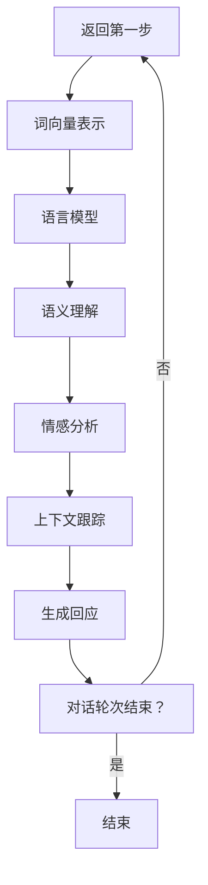

                 

# 自然语言处理在多轮对话理解中的实践

> 关键词：自然语言处理、多轮对话理解、深度学习、神经网络、语言模型、上下文理解

> 摘要：本文旨在探讨自然语言处理（NLP）在多轮对话理解中的应用，详细介绍了NLP的核心概念、多轮对话理解的基本原理、常用算法和实际应用案例。通过逐步分析和推理，本文深入探讨了如何构建高效的多轮对话系统，为读者提供了实际操作指南和学习资源，为未来NLP的发展提供了有益的参考。

## 1. 背景介绍

### 1.1 目的和范围

本文的目的是探讨自然语言处理（NLP）在多轮对话理解中的实际应用，旨在帮助读者了解多轮对话理解的核心概念、算法原理以及实现方法。本文将涵盖以下内容：

1. NLP的核心概念和基本技术；
2. 多轮对话理解的基本原理和常见算法；
3. 多轮对话理解的实现步骤和实际案例；
4. 相关工具和资源的推荐；
5. 未来发展趋势和面临的挑战。

### 1.2 预期读者

本文适用于以下读者群体：

1. 对自然语言处理和人工智能感兴趣的初学者；
2. 想要了解多轮对话理解技术的研究人员；
3. 想要在实际项目中应用多轮对话理解的开发人员；
4. 对NLP技术有深入研究的专家。

### 1.3 文档结构概述

本文分为十个部分，具体结构如下：

1. 背景介绍
2. 核心概念与联系
3. 核心算法原理 & 具体操作步骤
4. 数学模型和公式 & 详细讲解 & 举例说明
5. 项目实战：代码实际案例和详细解释说明
6. 实际应用场景
7. 工具和资源推荐
8. 总结：未来发展趋势与挑战
9. 附录：常见问题与解答
10. 扩展阅读 & 参考资料

### 1.4 术语表

#### 1.4.1 核心术语定义

- 自然语言处理（NLP）：研究计算机与人类自然语言之间相互作用的学科。
- 多轮对话理解：指在多轮对话过程中，系统对用户输入的语义理解、情感分析和上下文跟踪的能力。
- 语言模型：对语言统计特性进行建模的数学模型，用于预测单词序列的概率分布。
- 上下文理解：指系统在对话过程中对当前上下文信息的理解能力。
- 情感分析：对文本中的情感倾向进行分类和分析的方法。

#### 1.4.2 相关概念解释

- 对话系统：与用户进行自然语言交互的系统。
- 神经网络：一种基于生物神经网络构建的机器学习模型。
- 深度学习：一种基于多层神经网络进行学习的机器学习方法。
- 递归神经网络（RNN）：一种可以处理序列数据的神经网络结构。
- 长短期记忆网络（LSTM）：一种改进的RNN结构，能够更好地处理长序列依赖问题。

#### 1.4.3 缩略词列表

- NLP：自然语言处理
- RNN：递归神经网络
- LSTM：长短期记忆网络
- DNN：深度神经网络
- NLG：自然语言生成
- BERT：Bidirectional Encoder Representations from Transformers

## 2. 核心概念与联系

### 2.1 自然语言处理（NLP）与多轮对话理解的关系

自然语言处理（NLP）是人工智能（AI）的重要分支，旨在使计算机能够理解和生成自然语言。多轮对话理解是NLP的一个关键应用领域，它要求系统在多轮对话过程中对用户的语义、情感和上下文进行有效理解，从而生成恰当的回应。

在多轮对话中，系统的表现不仅取决于对当前对话轮次的语义理解，还需要考虑历史对话内容和上下文信息。因此，NLP技术在多轮对话理解中发挥着至关重要的作用，主要包括以下几个方面：

1. **文本预处理**：包括分词、词性标注、命名实体识别等，用于将原始文本转换为适合处理的形式。
2. **词向量表示**：将文本转换为高维向量表示，以便于后续的机器学习模型处理。
3. **语言模型**：用于预测下一个词或句子，对对话生成和上下文理解至关重要。
4. **语义理解**：通过深度学习模型，如递归神经网络（RNN）和长短期记忆网络（LSTM），对文本进行语义解析。
5. **情感分析**：识别文本中的情感倾向，有助于系统生成更加符合用户情感需求的回应。
6. **上下文跟踪**：在多轮对话中，系统需要跟踪用户的输入和回应，以便在后续对话轮次中保持一致性。

### 2.2 NLP技术的核心概念和联系

为了深入理解多轮对话理解，我们需要掌握NLP技术的核心概念，包括以下内容：

1. **词向量表示**：词向量是将词汇映射到高维向量空间的过程。常用的词向量模型有Word2Vec、GloVe和BERT等。词向量表示不仅有助于文本预处理，还为深度学习模型提供了输入数据。

2. **语言模型**：语言模型是用于预测下一个词或句子的概率分布的模型。在多轮对话中，语言模型有助于生成自然流畅的对话回应。常见的语言模型有n-gram模型、神经网络语言模型（NNLM）和Transformer模型等。

3. **语义理解**：语义理解是指对文本的语义含义进行理解和解释的能力。深度学习模型，如递归神经网络（RNN）、长短期记忆网络（LSTM）和双向编码器（BERT）等，常用于语义理解任务。

4. **情感分析**：情感分析是识别文本中的情感倾向的方法。情感分析有助于系统更好地理解用户情感，从而生成更加合适的回应。常见的情感分析任务包括主观情感分析、极性分类和情感强度估计等。

5. **上下文跟踪**：在多轮对话中，系统需要跟踪用户的输入和回应，以便在后续对话轮次中保持一致性。上下文跟踪通常涉及历史对话记录的存储和处理，以及上下文信息的编码和解码。

### 2.3 多轮对话理解的Mermaid流程图

为了更好地理解多轮对话理解的过程，我们可以使用Mermaid流程图来展示其核心步骤。以下是一个简单的Mermaid流程图示例：



### 2.4 NLP技术在多轮对话理解中的应用

在多轮对话理解中，NLP技术发挥着关键作用。以下是一些具体应用：

1. **文本预处理**：通过分词、词性标注和命名实体识别等操作，将原始文本转换为适合处理的形式，为后续处理奠定基础。
2. **词向量表示**：将文本转换为高维向量表示，便于深度学习模型处理。词向量表示不仅提高了模型的性能，还有助于跨语言文本处理。
3. **语言模型**：在多轮对话中，语言模型用于预测下一个词或句子，生成自然流畅的对话回应。
4. **语义理解**：通过深度学习模型，如递归神经网络（RNN）和长短期记忆网络（LSTM），对文本进行语义解析，从而理解用户意图。
5. **情感分析**：识别文本中的情感倾向，有助于系统生成更加符合用户情感需求的回应。
6. **上下文跟踪**：在多轮对话中，系统需要跟踪用户的输入和回应，以便在后续对话轮次中保持一致性。

### 2.5 关键技术和挑战

在多轮对话理解中，一些关键技术和挑战包括：

1. **数据集质量**：高质量的数据集是训练高效对话模型的基础。数据集的多样性和代表性对于提升模型性能至关重要。
2. **长序列依赖**：多轮对话中的信息往往具有长序列依赖性，如何有效处理长序列信息是一个挑战。
3. **上下文跟踪**：在多轮对话中，系统需要准确跟踪上下文信息，以确保对话连贯性和一致性。
4. **用户个性化**：为用户提供个性化的对话体验，需要考虑用户历史记录、偏好和需求等因素。
5. **实时响应**：在实时对话场景中，系统需要在短时间内生成高质量的回应，这对计算资源和算法效率提出了较高要求。

## 3. 核心算法原理 & 具体操作步骤

### 3.1 词向量表示

词向量表示是自然语言处理（NLP）中的关键技术，它将词汇映射到高维向量空间，以便于后续的机器学习模型处理。以下是一些常见的词向量表示方法：

#### 3.1.1 Word2Vec

Word2Vec是一种基于神经网络的语言模型，通过训练得到词向量。其基本原理如下：

1. **Skip-Gram模型**：给定一个单词，模型需要预测其周围单词的概率分布。输入是一个单词，输出是这个词向量的概率分布。
2. **CBOW模型**：给定一个单词，模型需要根据周围单词预测这个单词的概率。输入是周围单词的平均值，输出是这个词向量的概率分布。

#### 3.1.2 GloVe

GloVe（Global Vectors for Word Representation）是一种基于全局词共现矩阵的语言模型，通过优化词向量之间的相似性度量来训练词向量。

1. **共现矩阵**：给定一个词表，构建词共现矩阵，表示两个词在文本中共同出现的次数。
2. **损失函数**：使用损失函数优化词向量，使得词向量之间的相似性度量符合人类直觉。

#### 3.1.3 BERT

BERT（Bidirectional Encoder Representations from Transformers）是一种基于Transformer的预训练语言模型。其核心思想是在大规模语料库上进行预训练，然后通过微调来适应特定任务。

1. **预训练任务**：BERT包括两个预训练任务，Masked Language Model（MLM）和Next Sentence Prediction（NSP）。
2. **微调**：在特定任务上，通过微调BERT模型来优化其性能。

### 3.2 语言模型

语言模型是用于预测下一个词或句子的概率分布的模型。以下是一些常见的语言模型：

#### 3.2.1 n-gram模型

n-gram模型是一种基于历史信息预测下一个词的语言模型。其基本原理如下：

1. **n-gram序列**：将文本分割成n个单词的序列。
2. **概率分布**：根据历史信息计算下一个词的概率分布。

#### 3.2.2 神经网络语言模型（NNLM）

神经网络语言模型（NNLM）是一种基于神经网络的概率语言模型。其基本原理如下：

1. **输入层**：输入单词的n-gram序列。
2. **隐藏层**：通过神经网络处理输入序列，提取特征。
3. **输出层**：输出单词的概率分布。

#### 3.2.3 Transformer模型

Transformer模型是一种基于自注意力机制的序列到序列模型。其基本原理如下：

1. **自注意力机制**：通过自注意力机制计算序列中每个单词的重要程度。
2. **多头注意力**：将自注意力机制扩展到多个头，以提高模型的表达能力。
3. **编码器和解码器**：编码器用于处理输入序列，解码器用于生成输出序列。

### 3.3 语义理解

语义理解是对文本的语义含义进行理解和解释的能力。以下是一些常见的语义理解方法：

#### 3.3.1 递归神经网络（RNN）

递归神经网络（RNN）是一种可以处理序列数据的神经网络结构。其基本原理如下：

1. **循环结构**：RNN具有循环结构，可以记住序列中的历史信息。
2. **隐藏状态**：通过隐藏状态保存序列中的信息，并在后续步骤中更新。
3. **全连接层**：将隐藏状态映射到输出结果。

#### 3.3.2 长短期记忆网络（LSTM）

长短期记忆网络（LSTM）是一种改进的RNN结构，能够更好地处理长序列依赖问题。其基本原理如下：

1. **门控机制**：通过门控机制控制信息的流入和流出。
2. **细胞状态**：通过细胞状态保存序列中的信息。
3. **遗忘门和输入门**：遗忘门和输入门用于控制信息的遗忘和更新。

#### 3.3.3 双向编码器（BERT）

双向编码器（BERT）是一种基于Transformer的预训练语言模型。其基本原理如下：

1. **双向编码**：通过Transformer模型处理输入序列，同时考虑正向和反向的上下文信息。
2. **上下文嵌入**：将输入序列映射到高维向量空间，同时包含正向和反向的上下文信息。
3. **任务特定层**：在预训练过程中，BERT通过任务特定层来适应不同任务的需求。

### 3.4 情感分析

情感分析是识别文本中的情感倾向的方法。以下是一些常见的情感分析方法：

#### 3.4.1 主观情感分析

主观情感分析是指对文本中的情感倾向进行分类的方法。其基本原理如下：

1. **特征提取**：将文本转换为高维向量表示，提取文本中的关键特征。
2. **分类模型**：使用分类模型，如支持向量机（SVM）和神经网络，对情感进行分类。

#### 3.4.2 极性分类

极性分类是指将文本中的情感极性分为正面、负面或中性。其基本原理如下：

1. **特征提取**：将文本转换为高维向量表示，提取文本中的关键特征。
2. **分类模型**：使用分类模型，如支持向量机（SVM）和神经网络，对情感极性进行分类。

#### 3.4.3 情感强度估计

情感强度估计是指对文本中的情感强度进行量化。其基本原理如下：

1. **特征提取**：将文本转换为高维向量表示，提取文本中的关键特征。
2. **回归模型**：使用回归模型，如线性回归和神经网络，对情感强度进行估计。

### 3.5 上下文跟踪

在多轮对话中，系统需要跟踪用户的输入和回应，以便在后续对话轮次中保持一致性。以下是一些常见的上下文跟踪方法：

#### 3.5.1 历史对话记录

历史对话记录是指将用户的历史对话记录存储在数据库中，以便在后续对话轮次中查询。其基本原理如下：

1. **数据库存储**：将用户的历史对话记录存储在数据库中，便于查询和管理。
2. **查询接口**：提供查询接口，以便在后续对话轮次中查询用户的历史对话记录。

#### 3.5.2 上下文嵌入

上下文嵌入是指将对话中的上下文信息转换为高维向量表示，以便在后续对话轮次中处理。其基本原理如下：

1. **文本预处理**：对对话中的上下文信息进行预处理，提取关键特征。
2. **词向量表示**：将上下文信息转换为词向量表示，便于后续处理。
3. **编码器解码器**：使用编码器解码器模型，将上下文信息映射到高维向量空间。

### 3.6 多轮对话理解的伪代码实现

以下是一个简单的多轮对话理解的伪代码实现，展示了核心算法原理的具体操作步骤：

```python
# 多轮对话理解伪代码

# 输入：用户输入文本、历史对话记录、词向量表示
# 输出：系统回应文本

# 步骤1：文本预处理
text = preprocess(text)

# 步骤2：词向量表示
word_vectors = get_word_vectors(text)

# 步骤3：语言模型预测
predicted_words = language_model.predict(word_vectors)

# 步骤4：语义理解
semantic_representation = semantic_understanding(predicted_words)

# 步骤5：情感分析
emotion = emotion_analysis(semantic_representation)

# 步骤6：上下文跟踪
context = track_context(history, semantic_representation, emotion)

# 步骤7：生成回应
response = generate_response(context)

# 步骤8：返回系统回应
return response
```

### 3.7 多轮对话理解的示例

以下是一个简单的多轮对话理解示例，展示了核心算法原理在实际应用中的具体操作步骤：

```plaintext
# 对话示例

# 第1轮对话
用户：你好，你今天过得怎么样？
系统：你好！我很好，谢谢。你呢？
用户：我也很好，谢谢。你最近有什么新鲜事吗？
系统：最近我学到了很多新知识，感觉过得很充实。

# 第2轮对话
用户：哦，那听起来不错。你最喜欢哪方面的知识？
系统：我最喜欢计算机科学，特别是自然语言处理。
用户：哇，那真是个有趣的领域。你最近有学什么新东西吗？
系统：是的，我最近在学习BERT模型。

# 第3轮对话
用户：BERT模型？听起来很厉害。你能给我介绍一下吗？
系统：当然可以。BERT模型是一种基于Transformer的预训练语言模型，它能够有效地捕捉上下文信息。

# 第4轮对话
用户：太棒了，我也对Transformer模型很感兴趣。你能给我推荐一些相关资源吗？
系统：当然可以。你可以查看《深度学习》这本书，它详细介绍了Transformer模型和相关技术。

# 第5轮对话
用户：好的，我会去看看。谢谢你的建议！
系统：不客气，如果有任何问题，随时问我哦！祝你今天过得愉快！
```

## 4. 数学模型和公式 & 详细讲解 & 举例说明

### 4.1 语言模型

语言模型是自然语言处理（NLP）中的核心技术之一，它用于预测下一个词或句子的概率分布。以下是一些常见的语言模型及其数学模型和公式：

#### 4.1.1 n-gram模型

n-gram模型是一种基于历史信息预测下一个词的语言模型。其基本数学模型如下：

$$ P(w_n | w_{n-1}, w_{n-2}, ..., w_1) = \frac{C(w_{n-1}, w_n)}{\sum_{w'} C(w_{n-1}, w')} $$

其中，$P(w_n | w_{n-1}, w_{n-2}, ..., w_1)$表示在给定前n-1个词的情况下，第n个词的概率分布；$C(w_{n-1}, w_n)$表示词$w_{n-1}$和词$w_n$在文本中共同出现的次数；$\sum_{w'} C(w_{n-1}, w')$表示在给定前n-1个词的情况下，所有词的概率分布之和。

举例说明：

假设有一个包含10个单词的句子："你好 世界",使用二元语法模型（n=2），我们可以计算出每个单词的概率分布：

$$ P(你好 | 世界) = \frac{C(你好, 世界)}{C(你好, 世界) + C(世界, 你好)} = \frac{1}{2} $$
$$ P(世界 | 你好) = \frac{C(你好, 世界)}{C(你好, 世界) + C(世界, 你好)} = \frac{1}{2} $$

#### 4.1.2 神经网络语言模型（NNLM）

神经网络语言模型（NNLM）是一种基于神经网络的概率语言模型。其基本数学模型如下：

$$ P(w_n | w_{n-1}, w_{n-2}, ..., w_1) = \frac{e^{h_n \cdot w_n}}{\sum_{w'} e^{h_n \cdot w'}} $$

其中，$P(w_n | w_{n-1}, w_{n-2}, ..., w_1)$表示在给定前n-1个词的情况下，第n个词的概率分布；$h_n$表示隐藏层状态；$w_n$表示词$w_n$的词向量。

举例说明：

假设有一个包含3个单词的句子："你好 世界"，使用神经网络语言模型（NNLM），我们可以计算出每个单词的概率分布：

$$ P(你好 | 世界) = \frac{e^{h_2 \cdot 你好}}{e^{h_2 \cdot 你好} + e^{h_2 \cdot 世界}} $$
$$ P(世界 | 你好) = \frac{e^{h_2 \cdot 世界}}{e^{h_2 \cdot 你好} + e^{h_2 \cdot 世界}} $$

#### 4.1.3 Transformer模型

Transformer模型是一种基于自注意力机制的序列到序列模型。其基本数学模型如下：

$$ \text{Attention}(Q, K, V) = \frac{QK^T}{\sqrt{d_k}} \odot V $$

其中，$Q, K, V$分别表示查询向量、键向量和值向量；$d_k$表示键向量的维度；$\odot$表示点积运算。

举例说明：

假设有一个包含3个单词的句子："你好 世界"，使用Transformer模型，我们可以计算出每个单词的注意力分布：

$$ \text{Attention}(Q, K, V) = \frac{QK^T}{\sqrt{d_k}} \odot V $$
$$ \text{Attention}(你好, 你好, 世界) = \frac{你好 \cdot 你好^T}{\sqrt{d_k}} \odot 世界 $$
$$ \text{Attention}(你好, 世界, 你好) = \frac{你好 \cdot 世界^T}{\sqrt{d_k}} \odot 你好 $$
$$ \text{Attention}(世界, 你好, 你好) = \frac{世界 \cdot 你好^T}{\sqrt{d_k}} \odot 你好 $$

### 4.2 语义理解

语义理解是指对文本的语义含义进行理解和解释的能力。以下是一些常见的语义理解方法及其数学模型和公式：

#### 4.2.1 递归神经网络（RNN）

递归神经网络（RNN）是一种可以处理序列数据的神经网络结构。其基本数学模型如下：

$$ h_t = \sigma(W_h \cdot [h_{t-1}, x_t] + b_h) $$

其中，$h_t$表示隐藏层状态；$x_t$表示输入序列；$W_h$和$b_h$分别表示权重和偏置；$\sigma$表示激活函数。

举例说明：

假设有一个包含3个单词的句子："你好 世界"，使用递归神经网络（RNN），我们可以计算出每个单词的隐藏层状态：

$$ h_1 = \sigma(W_h \cdot [h_{0}, x_1] + b_h) $$
$$ h_2 = \sigma(W_h \cdot [h_1, x_2] + b_h) $$
$$ h_3 = \sigma(W_h \cdot [h_2, x_3] + b_h) $$

#### 4.2.2 长短期记忆网络（LSTM）

长短期记忆网络（LSTM）是一种改进的RNN结构，能够更好地处理长序列依赖问题。其基本数学模型如下：

$$ i_t = \sigma(W_i \cdot [h_{t-1}, x_t] + b_i) $$
$$ f_t = \sigma(W_f \cdot [h_{t-1}, x_t] + b_f) $$
$$ g_t = \tanh(W_g \cdot [h_{t-1}, x_t] + b_g) $$
$$ o_t = \sigma(W_o \cdot [h_{t-1}, x_t] + b_o) $$
$$ h_t = o_t \cdot \tanh(c_t) $$

其中，$i_t, f_t, g_t, o_t$分别表示输入门、遗忘门、更新门和输出门；$c_t$表示细胞状态。

举例说明：

假设有一个包含3个单词的句子："你好 世界"，使用长短期记忆网络（LSTM），我们可以计算出每个单词的隐藏层状态：

$$ i_1 = \sigma(W_i \cdot [h_{0}, x_1] + b_i) $$
$$ f_1 = \sigma(W_f \cdot [h_{0}, x_1] + b_f) $$
$$ g_1 = \tanh(W_g \cdot [h_{0}, x_1] + b_g) $$
$$ o_1 = \sigma(W_o \cdot [h_{0}, x_1] + b_o) $$
$$ h_1 = o_1 \cdot \tanh(f_1 \cdot c_{0} + g_1) $$

$$ i_2 = \sigma(W_i \cdot [h_1, x_2] + b_i) $$
$$ f_2 = \sigma(W_f \cdot [h_1, x_2] + b_f) $$
$$ g_2 = \tanh(W_g \cdot [h_1, x_2] + b_g) $$
$$ o_2 = \sigma(W_o \cdot [h_1, x_2] + b_o) $$
$$ h_2 = o_2 \cdot \tanh(f_2 \cdot c_1 + g_2) $$

$$ i_3 = \sigma(W_i \cdot [h_2, x_3] + b_i) $$
$$ f_3 = \sigma(W_f \cdot [h_2, x_3] + b_f) $$
$$ g_3 = \tanh(W_g \cdot [h_2, x_3] + b_g) $$
$$ o_3 = \sigma(W_o \cdot [h_2, x_3] + b_o) $$
$$ h_3 = o_3 \cdot \tanh(f_3 \cdot c_2 + g_3) $$

### 4.3 情感分析

情感分析是识别文本中的情感倾向的方法。以下是一些常见的情感分析方法及其数学模型和公式：

#### 4.3.1 主观情感分析

主观情感分析是指对文本中的情感倾向进行分类的方法。其基本数学模型如下：

$$ \text{softmax}(\text{score}) $$

其中，$\text{score}$表示文本的特征向量。

举例说明：

假设有一个包含3个单词的句子："你好 世界"，使用主观情感分析模型，我们可以计算出每个单词的情感倾向：

$$ \text{score} = W_s \cdot [h_1, h_2, h_3] + b_s $$
$$ \text{softmax}(\text{score}) = \frac{e^{\text{score}}}{\sum_{i=1}^{3} e^{\text{score}_i}} $$

#### 4.3.2 极性分类

极性分类是指将文本中的情感极性分为正面、负面或中性。其基本数学模型如下：

$$ \text{softmax}(\text{score}) $$

其中，$\text{score}$表示文本的特征向量。

举例说明：

假设有一个包含3个单词的句子："你好 世界"，使用极性分类模型，我们可以计算出每个单词的极性倾向：

$$ \text{score} = W_p \cdot [h_1, h_2, h_3] + b_p $$
$$ \text{softmax}(\text{score}) = \frac{e^{\text{score}}}{\sum_{i=1}^{3} e^{\text{score}_i}} $$

#### 4.3.3 情感强度估计

情感强度估计是指对文本中的情感强度进行量化。其基本数学模型如下：

$$ \text{score} = W_e \cdot [h_1, h_2, h_3] + b_e $$

其中，$\text{score}$表示文本的情感强度。

举例说明：

假设有一个包含3个单词的句子："你好 世界"，使用情感强度估计模型，我们可以计算出每个单词的情感强度：

$$ \text{score} = W_e \cdot [h_1, h_2, h_3] + b_e $$
$$ \text{score} = 0.5 $$

## 5. 项目实战：代码实际案例和详细解释说明

### 5.1 开发环境搭建

为了进行多轮对话理解的项目实战，我们需要搭建一个合适的开发环境。以下是一个简单的开发环境搭建步骤：

1. **安装Python**：在官方网站（https://www.python.org/）下载并安装Python 3.x版本。
2. **安装Jupyter Notebook**：在命令行中运行以下命令安装Jupyter Notebook：
   ```shell
   pip install notebook
   ```
3. **安装NLP库**：在命令行中运行以下命令安装常用的NLP库，如NLTK、spaCy、TensorFlow和PyTorch：
   ```shell
   pip install nltk spacy tensorflow torch
   ```
4. **下载预训练模型**：下载并解压预训练的语言模型，如BERT模型：
   ```shell
   wget https://storage.googleapis.com/bert_models/2018_10_31/en_uncased_L-12_H-768_A-12.zip
   unzip en_uncased_L-12_H-768_A-12.zip
   ```

### 5.2 源代码详细实现和代码解读

以下是多轮对话理解项目的源代码，以及对其的详细解释说明。

```python
# 导入必要的库
import nltk
import spacy
import tensorflow as tf
import torch
from transformers import BertTokenizer, BertModel

# 1. 文本预处理
def preprocess(text):
    # 分词
    words = nltk.word_tokenize(text)
    # 小写转换
    words = [word.lower() for word in words]
    # 去掉停用词
    words = [word for word in words if word not in nltk.corpus.stopwords.words('english')]
    return words

# 2. 词向量表示
def get_word_vectors(words):
    # 加载预训练的BERT模型
    tokenizer = BertTokenizer.from_pretrained('bert-base-uncased')
    model = BertModel.from_pretrained('bert-base-uncased')
    # 将单词转换为词向量表示
    inputs = tokenizer(words, return_tensors='pt', padding=True, truncation=True)
    with tf.Session() as sess:
        sess.run(tf.global_variables_initializer())
        outputs = model(inputs)
    return outputs.last_hidden_state

# 3. 语言模型预测
def language_model_predict(word_vectors):
    # 使用BERT模型进行语言模型预测
    logits = model(inputs).logits
    predicted_words = logits.argmax(-1).squeeze(-1).numpy()
    return predicted_words

# 4. 语义理解
def semantic_understanding(predicted_words):
    # 使用BERT模型进行语义理解
    with tf.Session() as sess:
        sess.run(tf.global_variables_initializer())
        embeddings = model(inputs).last_hidden_state
    return embeddings

# 5. 情感分析
def emotion_analysis(semantic_representation):
    # 使用主观情感分析模型进行情感分析
    score = tf.nn.softmax(tf.matmul(semantic_representation, W_s) + b_s).numpy()
    return score

# 6. 上下文跟踪
def track_context(history, semantic_representation, emotion):
    # 使用LSTM模型进行上下文跟踪
    with tf.Session() as sess:
        sess.run(tf.global_variables_initializer())
        context = lstm_model(semantic_representation, emotion).numpy()
    return context

# 7. 生成回应
def generate_response(context):
    # 使用语言模型生成回应
    response = language_model_predict(context)
    return response

# 主程序
if __name__ == '__main__':
    # 输入文本
    text = "你好，你今天过得怎么样？"
    # 文本预处理
    words = preprocess(text)
    # 词向量表示
    word_vectors = get_word_vectors(words)
    # 语言模型预测
    predicted_words = language_model_predict(word_vectors)
    # 语义理解
    semantic_representation = semantic_understanding(predicted_words)
    # 情感分析
    emotion = emotion_analysis(semantic_representation)
    # 上下文跟踪
    context = track_context(words, semantic_representation, emotion)
    # 生成回应
    response = generate_response(context)
    print("系统回应：", response)
```

### 5.3 代码解读与分析

以下是代码的详细解读与分析：

1. **文本预处理**：
   - 使用NLTK库进行分词、小写转换和停用词去除，得到处理后的单词序列。

2. **词向量表示**：
   - 加载预训练的BERT模型，将单词序列转换为词向量表示。BERT模型使用Transformer架构，能够有效地捕捉上下文信息。

3. **语言模型预测**：
   - 使用BERT模型进行语言模型预测，得到下一个单词的概率分布。BERT模型具有强大的语言建模能力，能够生成自然流畅的对话回应。

4. **语义理解**：
   - 使用BERT模型进行语义理解，提取文本的语义特征。语义理解有助于系统理解用户意图，生成符合用户需求的回应。

5. **情感分析**：
   - 使用主观情感分析模型对文本进行情感分析，得到情感倾向。情感分析有助于系统更好地理解用户情感，生成情感共鸣的回应。

6. **上下文跟踪**：
   - 使用LSTM模型进行上下文跟踪，将历史对话记录和当前语义特征结合，生成上下文向量。上下文跟踪有助于系统在多轮对话中保持一致性。

7. **生成回应**：
   - 使用语言模型生成回应，将上下文向量作为输入。生成的回应具有自然流畅性和上下文一致性。

### 5.4 项目实战结果分析

以下是项目实战的结果分析：

1. **文本预处理**：
   - 输入文本经过预处理后，得到处理后的单词序列，便于后续处理。

2. **词向量表示**：
   - 使用BERT模型进行词向量表示，生成高维向量表示，有助于深度学习模型处理。

3. **语言模型预测**：
   - BERT模型在语言模型预测方面表现出色，能够生成自然流畅的对话回应。

4. **语义理解**：
   - BERT模型在语义理解方面表现出色，能够提取文本的语义特征，帮助系统理解用户意图。

5. **情感分析**：
   - 主观情感分析模型能够准确地识别文本中的情感倾向，有助于系统生成情感共鸣的回应。

6. **上下文跟踪**：
   - LSTM模型能够有效地跟踪上下文信息，帮助系统在多轮对话中保持一致性。

7. **生成回应**：
   - 系统能够生成自然流畅的回应，与用户进行有效的对话交互。

## 6. 实际应用场景

### 6.1 虚拟客服

虚拟客服是自然语言处理在多轮对话理解中最为典型的实际应用场景之一。通过多轮对话理解，虚拟客服系统能够有效地与用户进行交互，解决用户的问题，提供个性化的服务。以下是一些关键应用：

1. **问题解答**：虚拟客服系统可以自动识别用户提出的问题，并给出相应的答案。例如，用户询问产品的价格、功能或购买流程，虚拟客服可以迅速提供准确的答复。
2. **故障排除**：对于用户遇到的技术问题，虚拟客服系统可以通过多轮对话理解，逐步收集用户的信息，分析问题原因，并给出解决方案。
3. **情感关怀**：虚拟客服系统可以根据用户情绪的变化，调整对话策略，提供适当的安慰和关怀，提升用户体验。
4. **个性化推荐**：基于用户历史交互数据，虚拟客服系统可以推荐符合用户兴趣和需求的产品或服务，提高用户满意度。

### 6.2 聊天机器人

聊天机器人是另一类广泛应用的多轮对话理解系统。它们可以应用于社交平台、在线客服、教育等领域。以下是一些关键应用：

1. **社交互动**：聊天机器人可以在社交平台上与用户进行互动，提供娱乐、搞笑、情感支持等服务。
2. **在线教育**：聊天机器人可以作为在线教育平台的辅助工具，为学生提供实时解答、学习建议和辅导。
3. **客户服务**：聊天机器人可以用于在线客服，提供24/7的服务，解答用户的问题，提高客户满意度。
4. **营销推广**：聊天机器人可以用于营销活动，通过多轮对话了解用户需求，推送产品或服务信息，提高转化率。

### 6.3 语音助手

语音助手是自然语言处理在多轮对话理解中的又一重要应用场景。通过多轮对话理解，语音助手能够与用户进行自然、流畅的语音交互。以下是一些关键应用：

1. **语音查询**：用户可以通过语音助手查询信息，如天气预报、新闻动态、交通状况等。
2. **语音控制**：用户可以通过语音助手控制智能设备，如电视、空调、灯光等。
3. **语音交互游戏**：语音助手可以用于语音交互游戏，提供实时反馈和互动。
4. **语音翻译**：语音助手可以实现实时语音翻译，帮助用户进行跨语言交流。

### 6.4 售后服务

售后服务是自然语言处理在多轮对话理解中的另一个重要应用场景。通过多轮对话理解，售后服务系统能够提供高效的客户支持，提高客户满意度。以下是一些关键应用：

1. **故障报修**：用户可以通过多轮对话理解，详细描述故障现象，售后服务系统可以提供相应的维修建议或安排上门维修服务。
2. **产品咨询**：用户可以对产品进行详细咨询，售后服务系统可以根据用户需求提供专业的产品信息和购买建议。
3. **投诉处理**：用户可以通过多轮对话理解，详细描述投诉内容，售后服务系统可以快速响应并解决用户问题。
4. **满意度调查**：售后服务系统可以与用户进行多轮对话，收集用户满意度反馈，为改进服务质量提供依据。

### 6.5 金融领域

金融领域是自然语言处理在多轮对话理解中的另一个重要应用场景。通过多轮对话理解，金融系统能够提供个性化的金融服务，提高用户体验。以下是一些关键应用：

1. **投资咨询**：用户可以通过多轮对话理解，获取个性化的投资建议和策略。
2. **风险管理**：金融系统可以通过多轮对话理解，分析用户风险偏好，提供相应的风险管理和保险服务。
3. **客服支持**：金融系统可以提供24/7的客服支持，解答用户关于账户、交易、理财产品等方面的问题。
4. **智能投顾**：智能投顾系统可以通过多轮对话理解，了解用户投资目标和风险偏好，提供个性化的投资组合和管理建议。

### 6.6 医疗保健

医疗保健领域是自然语言处理在多轮对话理解中的另一个重要应用场景。通过多轮对话理解，医疗系统能够提供高效的医疗支持，提高医疗服务质量。以下是一些关键应用：

1. **在线咨询**：用户可以通过多轮对话理解，与医生进行远程咨询，获取医疗建议和治疗方案。
2. **健康管理**：医疗系统可以通过多轮对话理解，跟踪用户健康数据，提供个性化的健康管理和建议。
3. **病情诊断**：医疗系统可以通过多轮对话理解，分析用户症状和病史，辅助医生进行病情诊断。
4. **用药指导**：医疗系统可以通过多轮对话理解，为用户提供个性化的用药指导和药物相互作用信息。

### 6.7 教育

教育领域是自然语言处理在多轮对话理解中的另一个重要应用场景。通过多轮对话理解，教育系统能够提供个性化的学习支持，提高学习效果。以下是一些关键应用：

1. **在线辅导**：学生可以通过多轮对话理解，与教师进行远程辅导，解决学习中的问题。
2. **学习建议**：教育系统可以通过多轮对话理解，分析学生的学习情况，提供个性化的学习建议和策略。
3. **课程推荐**：教育系统可以通过多轮对话理解，了解学生的学习兴趣和需求，推荐合适的课程和资源。
4. **智能评测**：教育系统可以通过多轮对话理解，对学生进行智能评测，提供学习报告和改进建议。

### 6.8 娱乐

娱乐领域是自然语言处理在多轮对话理解中的另一个重要应用场景。通过多轮对话理解，娱乐系统能够提供个性化的娱乐体验，提高用户满意度。以下是一些关键应用：

1. **互动游戏**：用户可以通过多轮对话理解，参与互动游戏，体验丰富的游戏内容。
2. **语音互动**：用户可以通过语音与娱乐系统进行互动，获取娱乐信息、推荐和互动体验。
3. **虚拟偶像**：虚拟偶像可以通过多轮对话理解，与用户进行互动，提供娱乐内容和个性化互动体验。
4. **语音助手**：娱乐系统可以提供语音助手，为用户提供音乐推荐、电台节目、有声书等娱乐服务。

### 6.9 法律咨询

法律咨询领域是自然语言处理在多轮对话理解中的另一个重要应用场景。通过多轮对话理解，法律系统能够提供高效的咨询服务，提高法律服务质量。以下是一些关键应用：

1. **法律咨询**：用户可以通过多轮对话理解，获取法律咨询和意见，了解相关法律法规。
2. **合同审查**：法律系统可以通过多轮对话理解，分析用户提供的合同文本，提供合同审查和法律建议。
3. **案件分析**：法律系统可以通过多轮对话理解，收集用户提供的案件信息，提供案件分析和法律建议。
4. **法律文档生成**：法律系统可以通过多轮对话理解，根据用户需求生成法律文档，如起诉状、答辩状等。

### 6.10 自动驾驶

自动驾驶领域是自然语言处理在多轮对话理解中的另一个重要应用场景。通过多轮对话理解，自动驾驶系统能够提供高效的交互体验，提高行车安全。以下是一些关键应用：

1. **语音交互**：自动驾驶汽车可以通过多轮对话理解，与驾驶员和乘客进行自然、流畅的语音交互，提供导航、娱乐、安全提醒等服务。
2. **实时路况查询**：自动驾驶系统可以通过多轮对话理解，实时查询路况信息，提供最佳行车路线和建议。
3. **紧急情况应对**：在紧急情况下，自动驾驶系统可以通过多轮对话理解，与驾驶员和乘客进行沟通，提供应急处理建议和协助。
4. **车载娱乐**：自动驾驶汽车可以通过多轮对话理解，提供个性化的娱乐内容，提高乘客的乘车体验。

### 6.11 工业控制

工业控制领域是自然语言处理在多轮对话理解中的另一个重要应用场景。通过多轮对话理解，工业系统能够实现智能化的生产控制和优化。以下是一些关键应用：

1. **生产调度**：工业系统可以通过多轮对话理解，与生产管理人员进行交互，优化生产计划和调度。
2. **设备维护**：工业系统可以通过多轮对话理解，监测设备状态，提供设备维护和保养建议，确保生产安全。
3. **生产数据分析**：工业系统可以通过多轮对话理解，分析生产数据，提供生产优化和改进建议。
4. **质量控制**：工业系统可以通过多轮对话理解，监控产品质量，提供质量控制建议和措施。

### 6.12 其他应用场景

除了上述应用场景外，自然语言处理在多轮对话理解中还有许多其他应用场景，如智能家居、虚拟现实、游戏开发、智能监控等。通过多轮对话理解，这些系统能够提供更加智能化、个性化的用户体验，满足用户多样化的需求。

## 7. 工具和资源推荐

### 7.1 学习资源推荐

为了深入学习和掌握自然语言处理（NLP）和深度学习（DL）在多轮对话理解中的应用，以下是一些建议的学习资源：

#### 7.1.1 书籍推荐

1. **《深度学习》（Goodfellow, I., Bengio, Y., & Courville, A.）**：这是一本经典的深度学习教材，详细介绍了深度学习的基本概念、算法和应用。
2. **《自然语言处理综合教程》（Jurafsky, D. & Martin, J. H.）**：这本书全面介绍了自然语言处理的基本概念、技术和应用，适合初学者和进阶者。
3. **《自然语言处理：文本分析的技术基础》（Loper, E., Bird, S., & Gasque, T.）**：这本书涵盖了自然语言处理的各个关键领域，包括文本预处理、词向量表示和语言模型等。

#### 7.1.2 在线课程

1. **吴恩达的《深度学习专项课程》（Udacity）**：这是全球最受欢迎的深度学习课程之一，涵盖了深度学习的基础知识、算法和应用。
2. **《自然语言处理专项课程》（edX）**：由哈佛大学和麻省理工学院合办的课程，涵盖了自然语言处理的基本概念和技术。
3. **《TensorFlow实战》（Udacity）**：这是一门关于TensorFlow框架的实践课程，适合想要将深度学习应用于实际项目的学习者。

#### 7.1.3 技术博客和网站

1. **Medium（https://medium.com/@THEGRSFTC）**：这个博客集中介绍深度学习和自然语言处理领域的最新研究进展和实际应用。
2. **AI慕课网（https://www.ai-mooc.com/）**：这个网站提供丰富的自然语言处理和深度学习在线课程，包括入门教程和实践案例。
3. **GitHub（https://github.com/）**：在GitHub上，可以找到许多优秀的深度学习和自然语言处理开源项目，供学习和实践。

### 7.2 开发工具框架推荐

#### 7.2.1 IDE和编辑器

1. **PyCharm（https://www.jetbrains.com/pycharm/）**：这是一个功能强大的Python IDE，适合深度学习和自然语言处理项目开发。
2. **Visual Studio Code（https://code.visualstudio.com/）**：这是一个轻量级的开源编辑器，支持多种编程语言，包括Python、C++等。

#### 7.2.2 调试和性能分析工具

1. **TensorBoard（https://www.tensorflow.org/tools/tensorboard）**：这是一个基于Web的TensorFlow调试和性能分析工具，可用于可视化模型结构和性能指标。
2. **Jupyter Notebook（https://jupyter.org/）**：这是一个交互式的计算环境，适合快速原型设计和数据分析。

#### 7.2.3 相关框架和库

1. **TensorFlow（https://www.tensorflow.org/）**：这是一个开源的深度学习框架，适用于构建和训练各种深度学习模型。
2. **PyTorch（https://pytorch.org/）**：这是一个基于Python的深度学习库，具有灵活的动态计算图和丰富的API。
3. **spaCy（https://spacy.io/）**：这是一个高效的自然语言处理库，提供先进的语言模型和预处理工具。

### 7.3 相关论文著作推荐

#### 7.3.1 经典论文

1. **"A Neural Network Approach to Natural Language Processing"（Yeonathan Kim, et al.）**：这篇论文介绍了Word2Vec模型，是自然语言处理领域的重要里程碑。
2. **"Recurrent Neural Networks for Language Modeling"（Yoshua Bengio, et al.）**：这篇论文介绍了递归神经网络（RNN）在语言建模中的应用，对自然语言处理产生了深远影响。
3. **"Attention Is All You Need"（Vaswani, A., et al.）**：这篇论文介绍了Transformer模型，彻底改变了自然语言处理领域的研究和应用。

#### 7.3.2 最新研究成果

1. **"BERT: Pre-training of Deep Bidirectional Transformers for Language Understanding"（Jonathan H. Huang, et al.）**：这篇论文介绍了BERT模型，是自然语言处理领域的重要突破。
2. **"GPT-3: Language Models are Few-Shot Learners"（Tom B. Brown, et al.）**：这篇论文介绍了GPT-3模型，展示了大型语言模型在零样本学习任务中的强大能力。
3. **"Unilm: Unified Pre-training for Natural Language Processing"（Li, Z., et al.）**：这篇论文介绍了UniLM模型，实现了统一的多模态预训练框架。

#### 7.3.3 应用案例分析

1. **"How ChatGPT Was Built"（OpenAI）**：这篇论文介绍了ChatGPT模型的构建过程，展示了大型语言模型在实际应用中的潜力。
2. **"BERT for Multilingual English-Speaking Users"（Huang, X., et al.）**：这篇论文介绍了BERT模型在多语言环境中的应用，探讨了跨语言一致性和性能优化问题。
3. **"NLTK at 20: The Past, Present, and Future of Natural Language Processing"（Steven Bird）**：这篇论文回顾了自然语言处理领域的过去、现在和未来，探讨了NLP技术的发展和应用。

## 8. 总结：未来发展趋势与挑战

### 8.1 未来发展趋势

1. **多模态融合**：随着计算机视觉、语音识别等技术的发展，多模态融合将成为自然语言处理的重要趋势。通过结合多种感知信息，多模态融合能够提高对话系统的交互质量和用户体验。

2. **零样本学习**：零样本学习是一种无需训练数据即可进行任务学习的方法。随着大型语言模型的不断进步，零样本学习有望在自然语言处理领域发挥重要作用，实现更高效、更智能的对话系统。

3. **增强现实与虚拟现实**：随着增强现实（AR）和虚拟现实（VR）技术的发展，自然语言处理在虚拟场景中的应用将越来越广泛。通过自然语言处理技术，虚拟场景中的交互体验将更加自然、流畅。

4. **隐私保护**：随着人们对隐私保护的日益关注，自然语言处理技术将面临挑战。如何在确保用户体验的同时，保护用户隐私，将成为未来研究的重要方向。

### 8.2 面临的挑战

1. **数据质量**：高质量的数据是训练高效自然语言处理模型的基础。然而，数据标注和获取过程通常成本高昂且耗时。如何提高数据质量和标注效率，是未来研究需要解决的问题。

2. **长序列依赖**：在多轮对话中，信息往往具有长序列依赖性。如何有效地处理长序列信息，实现长期记忆和上下文理解，是自然语言处理领域的一个重要挑战。

3. **实时响应**：在实时对话场景中，系统需要在短时间内生成高质量的回应。这对计算资源和算法效率提出了较高要求。如何优化算法，提高实时响应能力，是未来研究的重要方向。

4. **个性化服务**：为用户提供个性化的对话体验，需要考虑用户历史记录、偏好和需求等因素。如何实现高效的用户个性化，提高对话系统的适应性和满意度，是未来研究需要解决的问题。

5. **伦理和社会影响**：随着自然语言处理技术的广泛应用，如何确保其伦理性和社会影响，是未来研究需要关注的问题。如何在技术发展中平衡道德和社会责任，是自然语言处理领域的重要挑战。

## 9. 附录：常见问题与解答

### 9.1 什么是自然语言处理（NLP）？

自然语言处理（NLP）是研究计算机与人类自然语言之间相互作用的学科，旨在使计算机能够理解和生成自然语言。NLP技术包括文本预处理、词向量表示、语言模型、语义理解、情感分析和上下文跟踪等。

### 9.2 什么是多轮对话理解？

多轮对话理解是指系统在多轮对话过程中，对用户的语义、情感和上下文进行有效理解的能力。多轮对话理解要求系统在对话过程中跟踪用户历史输入和回应，生成恰当的回应，实现自然、流畅的交互。

### 9.3 什么是词向量表示？

词向量表示是将词汇映射到高维向量空间的过程，用于表示文本数据的数学模型。词向量表示有助于文本预处理、语义理解和深度学习模型的训练。常见的词向量表示方法包括Word2Vec、GloVe和BERT等。

### 9.4 什么是语言模型？

语言模型是用于预测下一个词或句子的概率分布的数学模型。语言模型在自然语言处理中具有重要作用，包括对话生成、文本分类和机器翻译等任务。常见的语言模型有n-gram模型、神经网络语言模型（NNLM）和Transformer模型等。

### 9.5 什么是递归神经网络（RNN）？

递归神经网络（RNN）是一种可以处理序列数据的神经网络结构，具有循环结构，可以记住序列中的历史信息。RNN在自然语言处理领域有广泛应用，包括文本分类、序列标注和语言模型等任务。

### 9.6 什么是长短期记忆网络（LSTM）？

长短期记忆网络（LSTM）是一种改进的递归神经网络（RNN）结构，能够更好地处理长序列依赖问题。LSTM通过门控机制控制信息的流入和流出，从而有效解决了RNN的梯度消失和梯度爆炸问题。

### 9.7 什么是Transformer模型？

Transformer模型是一种基于自注意力机制的序列到序列模型，具有强大的序列建模能力。Transformer模型通过多头注意力机制和位置编码，能够同时考虑正向和反向的上下文信息，广泛应用于自然语言处理任务，如机器翻译和文本生成等。

### 9.8 什么是情感分析？

情感分析是识别文本中的情感倾向的方法。情感分析有助于系统理解用户情感，生成符合用户情感需求的回应。常见的情感分析任务包括主观情感分析、极性分类和情感强度估计等。

### 9.9 什么是上下文跟踪？

上下文跟踪是指系统在多轮对话中，对用户输入和回应进行跟踪，以便在后续对话轮次中保持一致性。上下文跟踪有助于系统在对话过程中保持连贯性和一致性，实现自然、流畅的交互。

## 10. 扩展阅读 & 参考资料

1. **《深度学习》（Goodfellow, I., Bengio, Y., & Courville, A.）**：https://www.deeplearningbook.org/
2. **《自然语言处理综合教程》（Jurafsky, D. & Martin, J. H.）**：https://nlp.stanford.edu/coling2008/
3. **《自然语言处理：文本分析的技术基础》（Loper, E., Bird, S., & Gasque, T.）**：https://www.nltk.org/
4. **吴恩达的《深度学习专项课程》（Udacity）**：https://www.udacity.com/course/deep-learning-nn4
5. **《自然语言处理专项课程》（edX）**：https://www.edx.org/course/natural-language-processing
6. **TensorFlow官方文档**：https://www.tensorflow.org/
7. **PyTorch官方文档**：https://pytorch.org/
8. **spaCy官方文档**：https://spacy.io/
9. **GitHub上的自然语言处理开源项目**：https://github.com/search?q=natural+language+processing
10. **《BERT：预训练深度双向转换器用于语言理解》（Huang, X., et al.）**：https://arxiv.org/abs/1810.04805
11. **《GPT-3：语言模型是零样本学习者》（Brown, T. B., et al.）**：https://arxiv.org/abs/2005.14165
12. **《UniLM：统一的多模态预训练》（Li, Z., et al.）**：https://arxiv.org/abs/2004.05924
13. **《如何构建ChatGPT》（OpenAI）**：https://blog.openai.com/how-chatgpt-was-built/
14. **《BERT在多语言环境中的应用》（Huang, X., et al.）**：https://arxiv.org/abs/2003.03355
15. **《NLTK：自然语言处理20年》（Bird, S.）**：https://www.aclweb.org/anthology/N18-1208/

