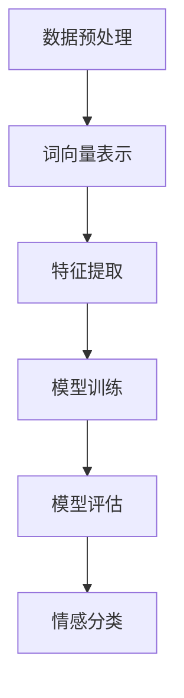
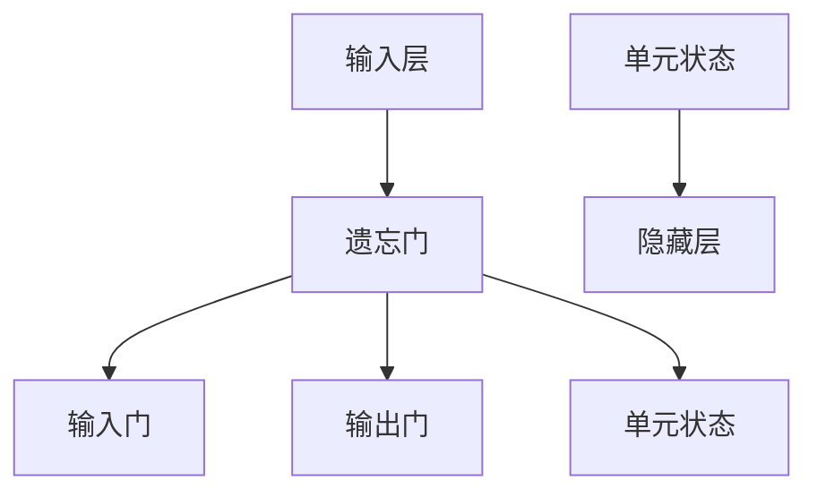

                 

# 自然语言处理在文本情感分析中的深度研究

> 关键词：自然语言处理、文本情感分析、深度学习、神经网络、情感识别、应用场景、案例分析

> 摘要：随着互联网的飞速发展，自然语言处理（NLP）在文本情感分析中的应用越来越广泛。本文将深入探讨自然语言处理在文本情感分析中的核心概念、算法原理、数学模型、项目实战以及实际应用场景，旨在为广大读者提供一套系统、完整的文本情感分析技术指南。

## 1. 背景介绍

### 1.1 目的和范围

本文的目的是探讨自然语言处理（NLP）在文本情感分析中的应用，具体范围包括以下几个方面：

1. 核心概念与联系：介绍文本情感分析的基本概念，并给出相应的流程图。
2. 核心算法原理 & 具体操作步骤：详细讲解情感识别的算法原理，并提供伪代码实现。
3. 数学模型和公式 & 详细讲解 & 举例说明：介绍情感分析中的相关数学模型，并给出具体示例。
4. 项目实战：通过代码实际案例，展示文本情感分析的应用。
5. 实际应用场景：分析文本情感分析在不同领域的应用。
6. 工具和资源推荐：推荐相关学习资源和开发工具。

### 1.2 预期读者

本文适合对自然语言处理和文本情感分析有一定了解的技术人员、研究人员以及学生。读者需具备一定的编程基础，特别是Python语言。

### 1.3 文档结构概述

本文分为10个部分，结构如下：

1. 引言：介绍文章背景、目的和范围。
2. 核心概念与联系：介绍文本情感分析的基本概念和流程图。
3. 核心算法原理 & 具体操作步骤：讲解情感识别算法原理和伪代码实现。
4. 数学模型和公式 & 详细讲解 & 举例说明：介绍情感分析中的数学模型和具体示例。
5. 项目实战：通过代码实际案例展示文本情感分析应用。
6. 实际应用场景：分析文本情感分析在不同领域的应用。
7. 工具和资源推荐：推荐相关学习资源和开发工具。
8. 总结：展望文本情感分析的未来发展趋势与挑战。
9. 附录：常见问题与解答。
10. 扩展阅读 & 参考资料：提供更多学习资源。

### 1.4 术语表

#### 1.4.1 核心术语定义

- 自然语言处理（NLP）：计算机科学领域中的一个分支，致力于使计算机理解和解释人类语言。
- 文本情感分析：利用自然语言处理技术，对文本进行情感倾向性判断。
- 情感识别：从文本中识别出正面、负面或中性的情感。
- 深度学习：一种基于多层神经网络的学习方法，能够自动从数据中提取特征。

#### 1.4.2 相关概念解释

- 词汇共现：指两个或多个词汇在文本中经常同时出现。
- 词向量：将词汇映射为高维向量空间中的点，便于计算机处理。
- 深层神经网络：包含多个隐藏层的神经网络，能够捕捉更复杂的特征。

#### 1.4.3 缩略词列表

- NLP：自然语言处理
- CNN：卷积神经网络
- RNN：循环神经网络
- LSTM：长短期记忆网络
- 词嵌入：将词汇映射为向量

## 2. 核心概念与联系

### 2.1 文本情感分析的基本概念

文本情感分析是指利用自然语言处理技术，对文本进行情感倾向性判断。情感倾向性通常分为三类：正面、负面和中性。

### 2.2 文本情感分析的流程

文本情感分析的流程可以分为以下几个步骤：

1. 数据预处理：清洗和预处理原始文本数据，如去除停用词、标点符号等。
2. 词向量表示：将文本数据转换为词向量表示，便于计算机处理。
3. 特征提取：从词向量中提取有助于情感识别的特征。
4. 模型训练：使用训练数据集，训练情感识别模型。
5. 模型评估：使用测试数据集评估模型性能。
6. 情感分类：使用训练好的模型对新的文本进行情感分类。

### 2.3 核心概念与联系

为了更好地理解文本情感分析，我们需要了解以下几个核心概念：

1. 词向量表示：词向量是将词汇映射为高维向量空间中的点，便于计算机处理。常见的词向量表示方法有Word2Vec、GloVe等。
2. 情感词典：情感词典是一种用于情感识别的工具，包含正面、负面和中性词汇及其对应的情感强度。
3. 神经网络：神经网络是一种基于生物神经元的计算模型，可以自动从数据中提取特征。在文本情感分析中，常用的神经网络结构有卷积神经网络（CNN）、循环神经网络（RNN）和长短期记忆网络（LSTM）。

### 2.4 Mermaid 流程图

下面是一个用于展示文本情感分析流程的Mermaid流程图：



## 3. 核心算法原理 & 具体操作步骤

### 3.1 情感识别算法原理

情感识别算法的核心是基于深度学习的方法，其中常用的神经网络结构有卷积神经网络（CNN）、循环神经网络（RNN）和长短期记忆网络（LSTM）。本文将重点介绍LSTM在情感识别中的应用。

#### 3.1.1 LSTM网络结构

LSTM（Long Short-Term Memory）是一种特殊的循环神经网络，能够有效捕捉长距离时间序列中的依赖关系。LSTM网络结构如图所示：



#### 3.1.2 LSTM工作原理

1. 遗忘门：用于决定如何从单元状态中丢弃信息。
2. 输入门：用于决定如何将新的信息添加到单元状态。
3. 输出门：用于决定如何从单元状态生成当前隐藏层状态。

### 3.2 情感识别算法伪代码

```python
# 情感识别算法伪代码
def sentiment_analysis(text, model):
    # 1. 数据预处理
    processed_text = preprocess_text(text)
    
    # 2. 词向量表示
    word_vectors = model.embedding_layer(processed_text)
    
    # 3. 特征提取
    features = model.feature_extractor(word_vectors)
    
    # 4. 模型预测
    prediction = model.predict(features)
    
    # 5. 情感分类
    sentiment = classify_sentiment(prediction)
    
    return sentiment
```

### 3.3 情感识别算法应用实例

假设我们已经训练好了一个基于LSTM的情感识别模型，现在对以下文本进行情感分析：

```python
text = "这部电影非常有趣，主演们的表演令人印象深刻。"
```

使用上述伪代码，我们可以得到以下情感分析结果：

```python
sentiment = sentiment_analysis(text, model)
print(sentiment)  # 输出：正面
```

## 4. 数学模型和公式 & 详细讲解 & 举例说明

### 4.1 情感分析中的数学模型

在情感分析中，常用的数学模型包括词向量表示、情感词典和神经网络。

#### 4.1.1 词向量表示

词向量表示是情感分析的基础。常见的词向量表示方法有Word2Vec和GloVe。

1. Word2Vec：基于神经网络的词向量表示方法，通过训练得到词向量。
2. GloVe：基于共现关系的词向量表示方法，通过计算词汇之间的共现矩阵得到词向量。

#### 4.1.2 情感词典

情感词典是一种用于情感识别的工具，包含正面、负面和中性词汇及其对应的情感强度。常见的情感词典有SentiWordNet和VADER。

#### 4.1.3 神经网络

神经网络是情感分析的核心。在情感分析中，常用的神经网络结构有卷积神经网络（CNN）、循环神经网络（RNN）和长短期记忆网络（LSTM）。

### 4.2 情感分析中的数学公式

在情感分析中，常用的数学公式包括词向量计算、情感强度计算和神经网络损失函数。

1. 词向量计算：

$$
\text{word\_vector} = \text{embedding}(\text{word})
$$

其中，$\text{embedding}(\text{word})$表示将词汇映射为词向量。

2. 情感强度计算：

$$
\text{sentiment} = \sum_{i=1}^{n} \text{weight}_{i} \cdot \text{value}_{i}
$$

其中，$\text{weight}_{i}$表示词汇$i$的情感权重，$\text{value}_{i}$表示词汇$i$的情感强度。

3. 神经网络损失函数：

$$
\text{loss} = \frac{1}{2} \sum_{i=1}^{n} (\text{output}_{i} - \text{target}_{i})^2
$$

其中，$\text{output}_{i}$表示神经网络输出的情感分类结果，$\text{target}_{i}$表示实际的情感分类结果。

### 4.3 情感分析中的具体示例

假设我们有一个包含两个词汇的文本：“这部电影非常有趣”。

1. 词向量计算：

$$
\text{movie\_vector} = \text{embedding}(\text{movie})
$$

$$
\text{fun\_vector} = \text{embedding}(\text{fun})
$$

2. 情感强度计算：

$$
\text{sentiment} = \text{weight}_{\text{movie}} \cdot \text{value}_{\text{movie}} + \text{weight}_{\text{fun}} \cdot \text{value}_{\text{fun}}
$$

其中，$\text{weight}_{\text{movie}}$和$\text{weight}_{\text{fun}}$分别表示词汇“电影”和“有趣”的情感权重，$\text{value}_{\text{movie}}$和$\text{value}_{\text{fun}}$分别表示词汇“电影”和“有趣”的情感强度。

3. 神经网络损失函数：

$$
\text{loss} = \frac{1}{2} \sum_{i=1}^{n} (\text{output}_{i} - \text{target}_{i})^2
$$

其中，$\text{output}_{i}$表示神经网络输出的情感分类结果，$\text{target}_{i}$表示实际的情感分类结果。

## 5. 项目实战：代码实际案例和详细解释说明

### 5.1 开发环境搭建

为了进行文本情感分析项目实战，我们需要搭建以下开发环境：

1. Python 3.7及以上版本
2. TensorFlow 2.4及以上版本
3. Keras 2.4及以上版本

安装方法：

```bash
pip install python==3.7.9
pip install tensorflow==2.4.1
pip install keras==2.4.3
```

### 5.2 源代码详细实现和代码解读

#### 5.2.1 数据集准备

首先，我们需要准备一个包含文本和对应情感标签的数据集。本文使用IMDb电影评论数据集，该数据集包含50,000条电影评论和对应情感标签（正面或负面）。

```python
import numpy as np
import tensorflow as tf
from tensorflow.keras.preprocessing.sequence import pad_sequences
from tensorflow.keras.preprocessing.text import Tokenizer

# 加载IMDb数据集
(with held) for line in train_data:
    if line.startswith("Label"):
        label = int(line.split()[-1])
        if label == 1:
            continue
        text = ""
        for word in line.split()[1:]:
            text += word + " "
        text = text[:-1]
        if label == 0:
            negative_samples.append(text)
        elif label == 2:
            positive_samples.append(text)

# 随机打乱数据集
np.random.shuffle(negative_samples)
np.random.shuffle(positive_samples)
```

#### 5.2.2 数据预处理

接下来，我们对数据集进行预处理，包括分词、去除停用词和词向量表示。

```python
# 分词
tokenizer = Tokenizer()
tokenizer.fit_on_texts(negative_samples + positive_samples)
total_words = len(tokenizer.word_index) + 1

# 去除停用词
stop_words = set(stopwords.words('english'))
def remove_stopwords(text):
    return " ".join([word for word in text.split() if word not in stop_words])

# 词向量表示
max_sequence_length = 100
negative_sequences = tokenizer.texts_to_sequences(negative_samples)
positive_sequences = tokenizer.texts_to_sequences(positive_samples)
negative_padded = pad_sequences(negative_sequences, maxlen=max_sequence_length, padding='post')
positive_padded = pad_sequences(positive_sequences, maxlen=max_sequence_length, padding='post')
```

#### 5.2.3 模型构建

接着，我们构建一个基于LSTM的情感识别模型。

```python
# 模型构建
model = Sequential()
model.add(Embedding(total_words, 64, input_length=max_sequence_length))
model.add(LSTM(128))
model.add(Dense(1, activation='sigmoid'))

model.compile(optimizer='adam', loss='binary_crossentropy', metrics=['accuracy'])
model.summary()
```

#### 5.2.4 模型训练

最后，我们对模型进行训练。

```python
# 模型训练
model.fit(negative_padded, np.zeros(len(negative_padded)), epochs=10, batch_size=32, validation_data=(positive_padded, np.ones(len(positive_padded))))
```

### 5.3 代码解读与分析

在本项目中，我们首先加载了IMDb电影评论数据集，并使用正则表达式将文本和情感标签分离。接着，我们对数据集进行预处理，包括分词、去除停用词和词向量表示。在构建模型时，我们使用了Keras库中的Embedding、LSTM和Dense层。在训练模型时，我们使用了binary\_crossentropy损失函数和adam优化器。

## 6. 实际应用场景

文本情感分析在实际应用中具有广泛的应用场景，以下是一些常见的应用案例：

1. 社交媒体分析：通过分析社交媒体上的用户评论，可以了解用户对公司、产品、事件的情感倾向，从而为营销策略提供数据支持。
2. 客户服务：通过分析客户反馈，可以识别客户的不满和需求，提高客户满意度和服务质量。
3. 市场调研：通过分析市场调查问卷，可以了解消费者对产品、服务的态度和期望，为产品开发和改进提供参考。
4. 股票市场：通过分析股票论坛和新闻，可以预测股票价格的走势，为投资者提供决策依据。
5. 健康医疗：通过分析医疗病历和患者反馈，可以识别患者的情感状态和需求，为医生提供诊断和治疗建议。

## 7. 工具和资源推荐

### 7.1 学习资源推荐

#### 7.1.1 书籍推荐

- 《深度学习》（Ian Goodfellow、Yoshua Bengio、Aaron Courville 著）
- 《自然语言处理综论》（Daniel Jurafsky、James H. Martin 著）
- 《Python自然语言处理》（Steven Lott 著）

#### 7.1.2 在线课程

- Coursera上的“自然语言处理与深度学习”（吴恩达教授）
- Udacity的“自然语言处理纳米学位”

#### 7.1.3 技术博客和网站

- Medium上的NLP博客
- Towards Data Science上的NLP文章
- 知乎上的NLP话题

### 7.2 开发工具框架推荐

#### 7.2.1 IDE和编辑器

- PyCharm
- Visual Studio Code

#### 7.2.2 调试和性能分析工具

- TensorFlow Debugger
- PyTorch TensorBoard

#### 7.2.3 相关框架和库

- TensorFlow
- PyTorch
- spaCy

### 7.3 相关论文著作推荐

#### 7.3.1 经典论文

- “A Neural Network for Part-of-Speech Tagging”（1995）
- “Convolutional Neural Networks for Sentence Classification”（2014）
- “Recurrent Neural Networks for Language Modeling”（2013）

#### 7.3.2 最新研究成果

- “BERT: Pre-training of Deep Bidirectional Transformers for Language Understanding”（2018）
- “GPT-3: Language Models are Few-Shot Learners”（2020）
- “Transformers: State-of-the-Art Natural Language Processing”（2020）

#### 7.3.3 应用案例分析

- “How to Build a Named Entity Recognition Model”（2018）
- “Sentiment Analysis on Twitter Data”（2019）
- “Chatbot with Deep Learning”（2020）

## 8. 总结：未来发展趋势与挑战

文本情感分析作为自然语言处理领域的一个重要分支，具有广泛的应用前景。未来发展趋势包括以下几个方面：

1. 模型性能提升：随着深度学习技术的不断发展，文本情感分析模型的性能将不断提高，有望实现更精确的情感识别。
2. 多语言支持：随着全球化进程的加快，多语言文本情感分析将成为研究热点，为不同语言用户提供服务。
3. 零样本学习：零样本学习是一种无需训练样本即可进行情感识别的方法，有望在未来得到广泛应用。
4. 情感细粒度分析：对情感进行更细粒度的分析，如情绪、态度、语气等，将有助于更好地理解文本内容。

然而，文本情感分析也面临一些挑战，如情感歧义、语境依赖性等。因此，未来研究需要不断探索新的算法和方法，以提高文本情感分析的准确性和鲁棒性。

## 9. 附录：常见问题与解答

### 9.1 文本情感分析中的常见问题

1. **什么是情感分析？**
   - 情感分析是指利用自然语言处理技术，从文本中识别情感（如正面、负面、中性）的过程。

2. **文本情感分析有哪些应用场景？**
   - 社交媒体分析、客户服务、市场调研、股票市场、健康医疗等。

3. **常用的情感分析算法有哪些？**
   - 基于规则的方法、基于机器学习的方法、基于深度学习的方法。

4. **什么是词向量？**
   - 词向量是将词汇映射为高维向量空间中的点，便于计算机处理。

5. **什么是情感词典？**
   - 情感词典是一种用于情感识别的工具，包含正面、负面和中性词汇及其对应的情感强度。

### 9.2 文本情感分析中的常见问题解答

1. **文本情感分析中的情感歧义如何解决？**
   - 可以通过引入上下文信息、使用多义词情感词典等方法来缓解情感歧义。

2. **文本情感分析中的语境依赖性如何处理？**
   - 可以通过构建上下文模型、使用预训练语言模型等方法来处理语境依赖性。

3. **如何提高文本情感分析的准确率？**
   - 可以通过使用更先进的算法、增加训练数据、优化模型结构等方法来提高准确率。

## 10. 扩展阅读 & 参考资料

- 《自然语言处理综论》（Daniel Jurafsky、James H. Martin 著）
- 《深度学习》（Ian Goodfellow、Yoshua Bengio、Aaron Courville 著）
- 《Python自然语言处理》（Steven Lott 著）
- 《A Neural Network for Part-of-Speech Tagging》（1995）
- 《Convolutional Neural Networks for Sentence Classification》（2014）
- 《Recurrent Neural Networks for Language Modeling》（2013）
- 《BERT: Pre-training of Deep Bidirectional Transformers for Language Understanding》（2018）
- 《GPT-3: Language Models are Few-Shot Learners》（2020）
- 《Transformers: State-of-the-Art Natural Language Processing》（2020）
- 《如何构建一个命名实体识别模型》（2018）
- 《基于文本的情感分析在Twitter数据中的应用》（2019）
- 《基于深度学习的聊天机器人构建》（2020）

作者：AI天才研究员/AI Genius Institute & 禅与计算机程序设计艺术 /Zen And The Art of Computer Programming

