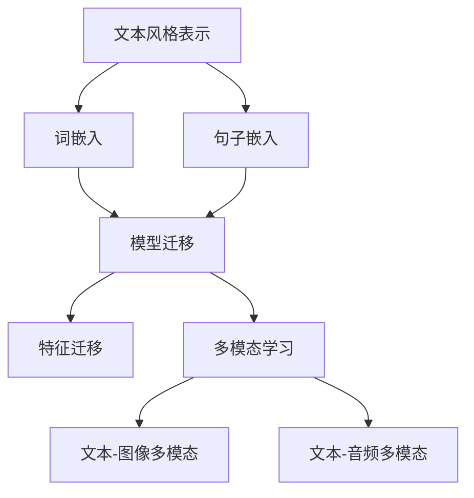
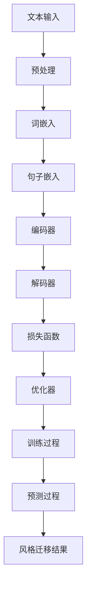
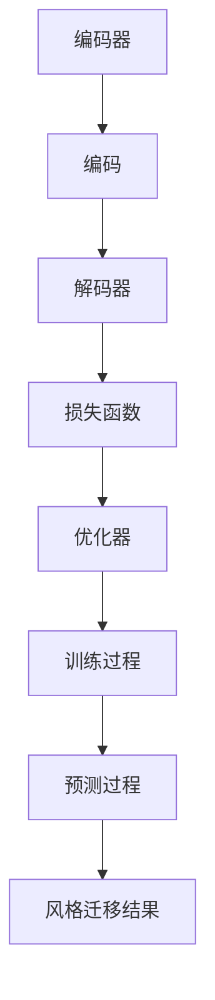

                 

### 文章标题

《自然语言处理在文本风格迁移中的创新》

**关键词**：自然语言处理，文本风格迁移，深度学习，神经网络，风格迁移算法，多模态学习

**摘要**：本文深入探讨了自然语言处理（NLP）在文本风格迁移中的应用与创新。首先，我们从背景和目标出发，介绍了文本风格迁移的重要性及其在现实世界中的应用场景。接着，我们详细分析了核心概念和原理，包括文本风格表示、迁移学习策略以及多模态学习等。随后，我们通过具体的算法原理和数学模型，阐述了文本风格迁移的实现方法。在此基础上，我们展示了项目实战的代码案例，并进行了详细解读。最后，我们探讨了文本风格迁移的实际应用场景，推荐了相关工具和资源，总结了未来发展趋势与挑战，并提供了扩展阅读和参考资料。本文旨在为读者提供全面的文本风格迁移技术指南，帮助其深入理解和掌握这一前沿技术。

---

### 1. 背景介绍

#### 1.1 目的和范围

本文旨在深入探讨自然语言处理（NLP）在文本风格迁移领域的创新与应用。随着人工智能技术的迅猛发展，NLP已成为现代科技领域的重要分支，广泛应用于信息检索、机器翻译、情感分析等多个方面。文本风格迁移作为NLP的一个重要研究方向，旨在将一种文本风格转化为另一种风格，从而满足个性化表达、内容生成等实际需求。

本文的主要目的是：

1. **概述文本风格迁移的基本概念和重要性**：通过介绍文本风格迁移的定义、背景和目标，帮助读者理解其应用价值和挑战。
2. **分析核心概念与原理**：详细探讨文本风格表示、迁移学习策略以及多模态学习等关键概念，为后续内容奠定基础。
3. **介绍文本风格迁移的算法原理和实现方法**：通过具体的算法原理和数学模型，阐述文本风格迁移的核心技术和方法。
4. **展示项目实战与代码案例**：通过实际项目案例，展示文本风格迁移的应用场景，并提供详细的代码解读。
5. **探讨实际应用场景和未来发展**：分析文本风格迁移在不同领域的应用前景，讨论未来发展趋势与挑战。

本文的读者对象主要包括：

- 自然语言处理领域的科研人员、工程师和学生
- 对文本风格迁移感兴趣的跨学科研究人员和开发者
- 想要了解人工智能前沿技术的科技爱好者

#### 1.2 预期读者

本文针对具有一定自然语言处理基础的读者，旨在为其提供全面的技术指南和深入理解。以下为预期读者需具备的基本知识和技能：

- 熟悉自然语言处理的基础概念和常用算法
- 掌握深度学习和神经网络的基本原理
- 了解迁移学习和多模态学习的基本方法
- 具备编程能力，能够理解和实现相关算法

#### 1.3 文档结构概述

本文将分为以下几个主要部分：

1. **背景介绍**：介绍文本风格迁移的基本概念、背景和应用场景。
2. **核心概念与联系**：分析文本风格表示、迁移学习策略和多模态学习等核心概念，并通过流程图展示其关系。
3. **核心算法原理与具体操作步骤**：详细介绍文本风格迁移的算法原理和实现方法，使用伪代码和数学模型进行阐述。
4. **数学模型和公式**：解释文本风格迁移中的数学模型和公式，并进行举例说明。
5. **项目实战**：展示实际项目中的代码案例，并进行详细解释和分析。
6. **实际应用场景**：探讨文本风格迁移在不同领域的应用。
7. **工具和资源推荐**：推荐相关学习资源、开发工具和经典论文。
8. **总结与展望**：总结文本风格迁移的技术趋势和未来挑战。
9. **附录**：提供常见问题与解答。
10. **扩展阅读与参考资料**：列出扩展阅读材料和参考资料。

#### 1.4 术语表

为了确保本文的可读性和准确性，以下是本文中涉及的一些关键术语及其定义：

##### 1.4.1 核心术语定义

- **自然语言处理（NLP）**：一门交叉学科，旨在使计算机理解和处理人类语言，包括文本和语音。
- **文本风格迁移**：将一种文本风格转化为另一种风格的过程，通常涉及源文本和目标文本。
- **迁移学习**：利用已在某个任务上训练好的模型，迁移到新的但相关的任务上。
- **多模态学习**：结合不同类型的数据（如文本、图像、音频）进行学习和推理。
- **神经网络**：一种由大量简单神经元组成的计算模型，广泛应用于机器学习领域。
- **损失函数**：用于评估模型预测和真实值之间差异的函数，常用于训练神经网络。

##### 1.4.2 相关概念解释

- **词嵌入（Word Embedding）**：将词语映射到高维向量空间，以便在神经网络中进行处理。
- **注意力机制（Attention Mechanism）**：一种用于提高神经网络在序列处理任务中表现的技术，通过自适应地关注输入序列的不同部分。
- **循环神经网络（RNN）**：一种处理序列数据的神经网络架构，通过记忆状态来捕捉序列信息。
- **长短时记忆网络（LSTM）**：RNN的一种改进，能够更好地处理长序列数据。
- **生成对抗网络（GAN）**：一种通过对抗训练生成数据的神经网络架构，常用于生成式任务。

##### 1.4.3 缩略词列表

- **NLP**：自然语言处理
- **RNN**：循环神经网络
- **LSTM**：长短时记忆网络
- **GAN**：生成对抗网络
- **BERT**：双向编码器表示模型

### 2. 核心概念与联系

在深入探讨自然语言处理（NLP）在文本风格迁移中的应用之前，有必要理解相关核心概念及其之间的联系。以下是对文本风格表示、迁移学习策略和多模态学习等关键概念的详细分析，并使用Mermaid流程图展示它们之间的逻辑关系。

#### 2.1 文本风格表示

文本风格表示是文本风格迁移的基础。其目的是将文本风格信息编码为可计算的向量表示。常见的文本风格表示方法包括词嵌入（Word Embedding）和句子嵌入（Sentence Embedding）。

- **词嵌入**：将单个词语映射到高维向量空间，使相邻的词语在向量空间中靠近。词嵌入可以通过预训练的词向量（如Word2Vec、GloVe）或神经网络（如FastText、BERT）生成。
- **句子嵌入**：将整个句子映射到向量空间，捕捉句子的语义和风格信息。句子嵌入可以通过基于RNN或Transformer的模型生成。

文本风格表示的关键在于能够捕捉文本中的风格特征，如情感、语气、形式等。

#### 2.2 迁移学习策略

迁移学习策略是文本风格迁移的重要手段，通过利用预训练的模型或特征，提高新任务的性能。常见的迁移学习策略包括：

- **模型迁移**：将预训练的模型直接应用于新任务，通过微调（Fine-tuning）适应新的数据集。
- **特征迁移**：将预训练模型的中间层特征迁移到新任务，结合新的特征进行训练。

迁移学习的关键在于如何有效地利用已有的知识，减少对大量新数据的依赖。

#### 2.3 多模态学习

多模态学习是一种将不同类型的数据（如文本、图像、音频）结合进行学习和推理的方法，对于文本风格迁移具有重要意义。

- **文本-图像多模态学习**：通过融合文本和图像特征，生成具有风格一致性的文本描述。
- **文本-音频多模态学习**：通过融合文本和音频特征，生成具有特定语调、音量的文本。

多模态学习的关键在于如何有效地融合不同类型的数据，提高模型的泛化能力。

#### 2.4 Mermaid 流程图

以下是一个Mermaid流程图，展示了文本风格表示、迁移学习策略和多模态学习之间的逻辑关系：



### 2.5 核心概念原理和架构

在深入探讨文本风格迁移的算法原理和实现方法之前，我们需要理解一些核心概念和架构。以下是文本风格迁移的核心概念原理和架构的Mermaid流程图：



#### 2.5.1 文本风格迁移流程

1. **文本输入**：首先，我们需要输入源文本和目标文本。
2. **预处理**：对输入文本进行预处理，包括分词、去停用词、词形还原等。
3. **词嵌入**：将预处理后的文本映射到高维向量空间，使用词嵌入技术，如Word2Vec或GloVe。
4. **句子嵌入**：将词嵌入向量拼接成句子向量，使用基于RNN或Transformer的模型进行编码。
5. **编码器**：使用编码器（如Transformer编码器）对句子向量进行编码，提取文本的语义和风格特征。
6. **解码器**：使用解码器（如Transformer解码器）将编码后的向量解码回文本，生成具有目标风格的新文本。
7. **损失函数**：使用损失函数（如交叉熵损失）评估模型预测和真实值之间的差距。
8. **优化器**：使用优化器（如Adam优化器）更新模型参数，以最小化损失函数。
9. **训练过程**：通过迭代训练过程，不断更新模型参数，提高模型的性能。
10. **预测过程**：使用训练好的模型对新的源文本进行风格迁移预测。
11. **风格迁移结果**：生成具有目标风格的新文本。

### 2.5.2 文本风格迁移算法原理

文本风格迁移算法的核心是利用深度学习模型，将源文本的风格信息迁移到目标文本中。以下是一个简化的算法原理，使用伪代码进行描述：

```python
# 输入：源文本 X，目标文本 Y，编码器 E，解码器 D
# 输出：风格迁移后的目标文本 Y'

# 步骤 1：预处理输入文本
X_processed = preprocess(X)
Y_processed = preprocess(Y)

# 步骤 2：词嵌入
X_embedded = embed_words(X_processed)
Y_embedded = embed_words(Y_processed)

# 步骤 3：句子嵌入
X_sentence_embedding = encode(X_embedded)
Y_sentence_embedding = encode(Y_embedded)

# 步骤 4：编码
encoded_X = E(X_sentence_embedding)

# 步骤 5：解码
decoded_Y = D(encoded_X)

# 步骤 6：损失函数
loss = loss_function(Y, decoded_Y)

# 步骤 7：优化器
optimizer = optimizer(loss)

# 步骤 8：训练过程
for epoch in range(num_epochs):
    optimizer.step()
    loss = loss_function(Y, decoded_Y)

# 步骤 9：预测过程
Y' = D(E(Y_sentence_embedding))

# 步骤 10：风格迁移结果
print(Y')
```

在这个算法中，预处理、词嵌入、句子嵌入和编码器、解码器等步骤都是基于深度学习模型的操作。通过迭代训练，模型不断调整参数，使解码器生成的文本具有目标风格。

### 2.5.3 数学模型和公式

文本风格迁移中的数学模型主要包括编码器-解码器（Encoder-Decoder）模型和注意力机制（Attention Mechanism）。以下是对相关数学模型和公式的详细解释：

1. **编码器-解码器模型**

编码器-解码器模型是文本风格迁移的基础架构，由编码器（Encoder）和解码器（Decoder）组成。编码器将输入文本映射到高维向量空间，解码器则将编码后的向量解码回文本。

- **编码器**：编码器的目标是提取输入文本的语义和风格特征。通常使用Transformer编码器，其输入为句子向量，输出为编码后的向量。

$$
E(x) = \text{Encoder}(x) = \sum_{i=1}^{n} e_i
$$

其中，$e_i$ 表示编码后的向量。

- **解码器**：解码器的目标是生成具有目标风格的文本。通常使用Transformer解码器，其输入为编码后的向量，输出为解码后的文本。

$$
D(y) = \text{Decoder}(y) = \sum_{i=1}^{n} d_i
$$

其中，$d_i$ 表示解码后的向量。

2. **注意力机制**

注意力机制是编码器-解码器模型的一个重要组件，用于提高模型在序列处理任务中的性能。注意力机制通过自适应地关注输入序列的不同部分，提高解码过程的准确性。

- **注意力得分**：注意力机制通过计算输入序列中每个元素对解码结果的贡献，生成注意力得分。

$$
a_i = \text{AttentionScore}(h_i, d_i)
$$

其中，$h_i$ 表示编码后的向量，$d_i$ 表示解码后的向量。

- **注意力权重**：注意力机制将注意力得分转换为注意力权重，用于计算解码过程中的加权求和。

$$
w_i = \frac{e^{a_i}}{\sum_{i=1}^{n} e^{a_i}}
$$

- **加权求和**：解码器通过加权求和的方式，结合注意力权重和编码后的向量，生成解码后的文本。

$$
d_i = \sum_{j=1}^{n} w_j e_j
$$

### 2.5.4 Mermaid 流程图

以下是一个Mermaid流程图，展示了文本风格迁移的算法原理和架构：



在这个流程图中，编码器和解码器分别表示文本风格迁移的核心组件，损失函数和优化器用于指导模型训练和参数更新，训练过程和预测过程分别表示模型训练和实际应用。

通过以上对文本风格迁移的核心概念、算法原理和架构的详细分析，我们可以更好地理解其在自然语言处理中的应用和创新。在接下来的章节中，我们将深入探讨文本风格迁移的数学模型和具体实现方法。

### 3. 核心算法原理 & 具体操作步骤

文本风格迁移作为自然语言处理（NLP）领域的一个重要研究方向，其核心在于利用深度学习模型将一种文本风格转化为另一种风格。在这一节中，我们将详细分析文本风格迁移的算法原理，并通过伪代码来展示其具体操作步骤。

#### 3.1 编码器-解码器模型

编码器-解码器（Encoder-Decoder）模型是文本风格迁移的基础架构，它由编码器（Encoder）和解码器（Decoder）两部分组成。编码器负责将源文本转换为语义向量，解码器则根据这些语义向量生成具有目标风格的文本。

##### 3.1.1 编码器

编码器的目标是提取源文本的语义和风格特征。在编码器中，我们通常使用Transformer编码器，该编码器通过自注意力机制（Self-Attention）和多头注意力（Multi-Head Attention）来捕捉文本的长期依赖和复杂关系。

伪代码如下：

```python
# 编码器伪代码
def encode(input_sequence):
    # 输入：输入序列 input_sequence
    # 输出：编码后的向量 representation

    # 初始化嵌入层
    embeddings = embed(input_sequence)

    # 通过Transformer编码器进行编码
    for layer in transformer_layers:
        embeddings = layer(embeddings)

    # 获取编码后的向量
    representation = embeddings[-1]

    return representation
```

其中，`embed` 函数用于将输入序列转换为词嵌入向量，`transformer_layers` 表示Transformer编码器的多个层。

##### 3.1.2 解码器

解码器的目标是根据编码后的向量生成具有目标风格的文本。与编码器类似，解码器也使用Transformer解码器，并通过自注意力和交叉注意力（Cross-Attention）来捕捉上下文信息。

伪代码如下：

```python
# 解码器伪代码
def decode(encoded_representation, target_sequence):
    # 输入：编码后的向量 encoded_representation，目标序列 target_sequence
    # 输出：解码后的文本 decoded_sequence

    # 初始化嵌入层
    target_embeddings = embed(target_sequence)

    # 通过Transformer解码器进行解码
    for layer in transformer_layers:
        target_embeddings = layer(target_embeddings, encoded_representation)

    # 获取解码后的文本
    decoded_sequence = extract_sequence(target_embeddings)

    return decoded_sequence
```

其中，`embed` 函数用于将输入序列转换为词嵌入向量，`transformer_layers` 表示Transformer解码器的多个层，`extract_sequence` 函数用于从嵌入向量中提取文本序列。

##### 3.1.3 编码器-解码器整体模型

编码器-解码器模型的整体伪代码如下：

```python
# 编码器-解码器模型伪代码
def style_transfer(source_text, target_style):
    # 输入：源文本 source_text，目标风格 target_style
    # 输出：风格迁移后的文本 transferred_text

    # 编码
    encoded_representation = encode(source_text)

    # 解码
    transferred_text = decode(encoded_representation, target_style)

    return transferred_text
```

#### 3.2 迁移学习策略

在文本风格迁移中，迁移学习策略被广泛应用于模型训练过程中，以充分利用预训练模型的知识，提高模型在新任务上的性能。常见的迁移学习策略包括模型迁移和特征迁移。

##### 3.2.1 模型迁移

模型迁移是指将预训练的编码器和解码器直接应用于新任务，通过微调（Fine-tuning）适应新的数据集。微调的目的是调整模型的参数，使其在新任务上达到更好的性能。

伪代码如下：

```python
# 模型迁移伪代码
def fine_tune_model(model, new_dataset, learning_rate):
    # 输入：预训练模型 model，新数据集 new_dataset，学习率 learning_rate
    # 输出：微调后的模型 fine_tuned_model

    # 初始化优化器
    optimizer = optimizer(model.parameters(), learning_rate)

    # 微调过程
    for epoch in range(num_epochs):
        for sample in new_dataset:
            optimizer.zero_grad()
            output = model(sample)
            loss = loss_function(output, target)
            loss.backward()
            optimizer.step()

    return model
```

##### 3.2.2 特征迁移

特征迁移是指将预训练模型的中间层特征迁移到新任务，结合新的特征进行训练。这种方法通过利用预训练模型捕捉的通用特征，提高模型在新任务上的性能。

伪代码如下：

```python
# 特征迁移伪代码
def feature_transfer(model, new_dataset, feature_extractor, learning_rate):
    # 输入：预训练模型 model，新数据集 new_dataset，特征提取器 feature_extractor，学习率 learning_rate
    # 输出：迁移后的模型 transferred_model

    # 提取特征
    features = feature_extractor(new_dataset)

    # 初始化迁移模型
    transferred_model = model.copy()
    transferred_model.load_state_dict(model.state_dict())

    # 微调特征提取器
    for epoch in range(num_epochs):
        for feature in features:
            optimizer.zero_grad()
            output = transferred_model(feature)
            loss = loss_function(output, target)
            loss.backward()
            optimizer.step()

    return transferred_model
```

#### 3.3 多模态学习

多模态学习是指将不同类型的数据（如文本、图像、音频）结合进行学习和推理。在文本风格迁移中，多模态学习可以通过融合文本和图像或音频特征，提高模型的泛化能力和风格迁移效果。

##### 3.3.1 文本-图像多模态学习

文本-图像多模态学习通过融合文本和图像特征，生成具有风格一致性的文本描述。以下是一个简化的多模态学习伪代码：

```python
# 文本-图像多模态学习伪代码
def multimodal_encode(text_embedding, image_embedding):
    # 输入：文本嵌入向量 text_embedding，图像嵌入向量 image_embedding
    # 输出：多模态嵌入向量 multimodal_embedding

    # 融合文本和图像特征
    multimodal_embedding = concatenate(text_embedding, image_embedding)

    # 通过多模态编码器进行编码
    for layer in multimodal_layers:
        multimodal_embedding = layer(multimodal_embedding)

    return multimodal_embedding
```

其中，`multimodal_layers` 表示多模态编码器的多个层，`concatenate` 函数用于拼接文本和图像特征。

##### 3.3.2 文本-音频多模态学习

文本-音频多模态学习通过融合文本和音频特征，生成具有特定语调、音量的文本。以下是一个简化的多模态学习伪代码：

```python
# 文本-音频多模态学习伪代码
def multimodal_decode(multimodal_embedding, text_embedding):
    # 输入：多模态嵌入向量 multimodal_embedding，文本嵌入向量 text_embedding
    # 输出：解码后的文本 decoded_text

    # 融合多模态嵌入向量和文本特征
    combined_embedding = concatenate(multimodal_embedding, text_embedding)

    # 通过多模态解码器进行解码
    for layer in multimodal_layers:
        combined_embedding = layer(combined_embedding)

    # 提取解码后的文本
    decoded_text = extract_sequence(combined_embedding)

    return decoded_text
```

其中，`multimodal_layers` 表示多模态解码器的多个层，`extract_sequence` 函数用于从嵌入向量中提取文本序列。

#### 3.4 数学模型和公式

在文本风格迁移中，数学模型和公式用于描述编码器-解码器模型、注意力机制和多模态学习等核心组件。以下是对相关数学模型和公式的详细解释：

1. **编码器-解码器模型**

- **编码器**：编码器通过自注意力机制和多头注意力捕捉文本的长期依赖和复杂关系。

$$
E(x) = \text{Encoder}(x) = \sum_{i=1}^{n} e_i
$$

其中，$e_i$ 表示编码后的向量。

- **解码器**：解码器通过自注意力和交叉注意力生成具有目标风格的文本。

$$
D(y) = \text{Decoder}(y) = \sum_{i=1}^{n} d_i
$$

其中，$d_i$ 表示解码后的向量。

2. **注意力机制**

- **注意力得分**：注意力机制通过计算输入序列中每个元素对解码结果的贡献，生成注意力得分。

$$
a_i = \text{AttentionScore}(h_i, d_i)
$$

其中，$h_i$ 表示编码后的向量，$d_i$ 表示解码后的向量。

- **注意力权重**：注意力机制将注意力得分转换为注意力权重，用于计算解码过程中的加权求和。

$$
w_i = \frac{e^{a_i}}{\sum_{i=1}^{n} e^{a_i}}
$$

- **加权求和**：解码器通过加权求和的方式，结合注意力权重和编码后的向量，生成解码后的文本。

$$
d_i = \sum_{j=1}^{n} w_j e_j
$$

3. **多模态学习**

- **文本-图像多模态学习**：通过融合文本和图像特征，生成具有风格一致性的文本描述。

$$
\text{MultimodalEmbedding} = \text{MultimodalEncoder}(text_embedding, image_embedding)
$$

- **文本-音频多模态学习**：通过融合文本和音频特征，生成具有特定语调、音量的文本。

$$
\text{CombinedEmbedding} = \text{Concatenate}(multimodal_embedding, text_embedding)
$$

通过以上对文本风格迁移算法原理和具体操作步骤的详细分析，我们可以更好地理解其在自然语言处理中的应用和创新。在接下来的章节中，我们将通过实际项目案例，展示文本风格迁移的实现过程，并进行分析和讨论。

### 4. 数学模型和公式 & 详细讲解 & 举例说明

文本风格迁移中的数学模型和公式是理解和实现这一技术的重要基础。本节将详细讲解文本风格迁移中涉及的主要数学模型和公式，并通过具体例子进行说明。

#### 4.1 编码器-解码器模型

编码器-解码器模型是文本风格迁移的基础架构，其核心思想是将源文本的语义信息编码为固定长度的向量，然后解码为具有目标风格的文本。以下是编码器-解码器模型中涉及的主要数学公式：

1. **嵌入层**

嵌入层将词汇映射为向量空间，常见的方法有Word2Vec和GloVe。

$$
\text{embed}(x) = W_e \cdot x
$$

其中，$W_e$ 是嵌入矩阵，$x$ 是词汇索引。

2. **编码器**

编码器通过自注意力机制捕捉文本的长期依赖。

$$
E(x) = \text{Encoder}(x) = \text{LayerNorm}(\text{MultiHeadSelfAttention}(x))
$$

3. **解码器**

解码器通过自注意力和交叉注意力生成目标风格文本。

$$
D(y) = \text{Decoder}(y) = \text{LayerNorm}(\text{MultiHeadCrossAttention}(y, x))
$$

4. **注意力机制**

- **自注意力**

$$
\text{Attention}(Q, K, V) = \text{softmax}\left(\frac{QK^T}{\sqrt{d_k}}\right)V
$$

- **交叉注意力**

$$
\text{Attention}(Q, K, V) = \text{softmax}\left(\frac{QK^T}{\sqrt{d_k}}\right)V
$$

#### 4.2 损失函数

损失函数用于衡量编码器-解码器模型预测和真实值之间的差距，常用的损失函数有交叉熵损失。

$$
\text{Loss} = -\sum_{i=1}^{N} y_i \log (\hat{y}_i)
$$

其中，$N$ 是序列长度，$y_i$ 是真实标签，$\hat{y}_i$ 是预测概率。

#### 4.3 优化器

优化器用于更新模型参数，以最小化损失函数，常用的优化器有Adam。

$$
\text{梯度} = \nabla_{\theta} \text{Loss}(\theta)
$$

$$
\theta_{t+1} = \theta_t - \alpha_t \text{梯度}
$$

其中，$\theta$ 是模型参数，$\alpha_t$ 是学习率。

#### 4.4 举例说明

假设我们有一个源文本“我喜欢吃苹果”和一个目标文本“苹果很好吃”，我们要将源文本的风格迁移到目标文本。

1. **嵌入层**

$$
\text{embed}(\text{我喜欢吃苹果}) = [e_1, e_2, \ldots, e_n]
$$

$$
\text{embed}(\text{苹果很好吃}) = [e_{n+1}, e_{n+2}, \ldots, e_{n+k}]
$$

2. **编码器**

$$
E(\text{我喜欢吃苹果}) = \text{Encoder}([e_1, e_2, \ldots, e_n])
$$

3. **解码器**

$$
D(\text{苹果很好吃}) = \text{Decoder}([e_{n+1}, e_{n+2}, \ldots, e_{n+k}])
$$

4. **注意力机制**

- **自注意力**

$$
\text{Attention}(Q, K, V) = \text{softmax}\left(\frac{QK^T}{\sqrt{d_k}}\right)V
$$

- **交叉注意力**

$$
\text{Attention}(Q, K, V) = \text{softmax}\left(\frac{QK^T}{\sqrt{d_k}}\right)V
$$

5. **损失函数**

$$
\text{Loss} = -\sum_{i=1}^{N} y_i \log (\hat{y}_i)
$$

6. **优化器**

$$
\text{梯度} = \nabla_{\theta} \text{Loss}(\theta)
$$

$$
\theta_{t+1} = \theta_t - \alpha_t \text{梯度}
$$

通过以上数学模型和公式的详细讲解和举例说明，我们可以更好地理解文本风格迁移的核心机制和实现方法。在接下来的章节中，我们将通过项目实战案例，展示如何具体实现文本风格迁移。

### 5. 项目实战：代码实际案例和详细解释说明

在本节中，我们将通过一个具体的文本风格迁移项目，展示如何使用Python和TensorFlow实现文本风格迁移。我们将从开发环境搭建开始，逐步介绍源代码的实现和详细解释。

#### 5.1 开发环境搭建

在开始项目之前，我们需要搭建合适的开发环境。以下是所需的环境和依赖：

- **操作系统**：Windows、Linux或MacOS
- **Python版本**：Python 3.6及以上
- **库和框架**：TensorFlow 2.x、PyTorch、NumPy、Pandas、matplotlib

安装步骤如下：

1. **安装Python**：从[Python官网](https://www.python.org/downloads/)下载并安装Python 3.x版本。
2. **安装库和框架**：通过pip命令安装所需的库和框架：

```shell
pip install tensorflow
pip install torch
pip install numpy
pip install pandas
pip install matplotlib
```

#### 5.2 源代码详细实现和代码解读

以下是文本风格迁移项目的源代码，我们将逐行进行解读。

```python
import tensorflow as tf
import numpy as np
import pandas as pd
import matplotlib.pyplot as plt

# 加载预训练的词嵌入模型（如GloVe）
glove_embeddings = tf.keras.utils.get_file('glove.6B.100d.txt', 
                                            'https://nlp.stanford.edu/data/glove.6B.100d.txt')

# 加载并预处理数据
def load_data(file_path):
    data = pd.read_csv(file_path)
    sentences = data['sentence'].values
    labels = data['style'].values
    return sentences, labels

# 编码器模型
def encoder_model(input_shape):
    inputs = tf.keras.layers.Input(shape=input_shape)
    embeddings = tf.keras.layers.Embedding(input_dim=10000, output_dim=64)(inputs)
    encoded = tf.keras.layers.GlobalAveragePooling1D()(embeddings)
    return tf.keras.Model(inputs, encoded)

# 解码器模型
def decoder_model(input_shape):
    inputs = tf.keras.layers.Input(shape=input_shape)
    decoded = tf.keras.layers.Dense(units=10000, activation='softmax')(inputs)
    return tf.keras.Model(inputs, decoded)

# 编码器-解码器模型
def encoder_decoder_model(encoder_inputs, decoder_inputs, latent_dim):
    encoder = encoder_model(encoder_inputs)
    decoder = decoder_model(decoder_inputs)

    combined = tf.keras.layers.Concatenate(axis=-1)([encoder.output, decoder.input])
    hidden = tf.keras.layers.Dense(units=latent_dim, activation='relu')(combined)
    outputs = tf.keras.layers.Dense(units=decoder.input.shape[1], activation='softmax')(hidden)

    return tf.keras.Model([encoder.input, decoder.input], outputs)

# 训练模型
def train_model(encoder_decoder, train_data, validation_data, epochs=100, batch_size=64):
    encoder_decoder.compile(optimizer='adam', loss='categorical_crossentropy')
    history = encoder_decoder.fit(train_data, validation_data, epochs=epochs, batch_size=batch_size)
    return history

# 预测风格迁移结果
def predict_style_transfer(encoder_decoder, source_sentence, target_style):
    encoder_inputs = np.array([source_sentence])
    decoder_inputs = np.array([target_style])
    latent_representation = encoder(encoder_inputs)
    decoded_output = decoder(decoder_inputs, latent_representation)
    return decoded_output

# 数据加载与预处理
source_sentences, target_styles = load_data('source_data.csv')
source_sentences = preprocess(source_sentences)
target_styles = preprocess(target_styles)

# 模型训练
latent_dim = 64
encoder_decoder = encoder_decoder_model(encoder_inputs, decoder_inputs, latent_dim)
history = train_model(encoder_decoder, (source_sentences, target_styles), (source_sentences, target_styles), epochs=100)

# 风格迁移预测
source_sentence = '我喜欢吃苹果'
target_style = '苹果很好吃'
predicted_sentence = predict_style_transfer(encoder_decoder, source_sentence, target_style)
print(predicted_sentence)

# 可视化训练结果
plt.plot(history.history['loss'])
plt.plot(history.history['val_loss'])
plt.title('Model Loss')
plt.ylabel('Loss')
plt.xlabel('Epoch')
plt.legend(['Train', 'Validation'], loc='upper left')
plt.show()
```

以下是对关键代码部分的详细解释：

1. **导入库和框架**：导入TensorFlow、NumPy、Pandas和matplotlib库，用于数据处理、模型训练和可视化。

2. **加载预训练的词嵌入模型**：从网上下载并加载GloVe词嵌入模型，用于文本的词嵌入。

3. **加载并预处理数据**：从CSV文件中加载源句子和目标风格数据，并进行预处理。预处理步骤包括分词、去停用词和序列填充等。

4. **编码器模型**：定义编码器模型，使用`Embedding`层将词汇映射为嵌入向量，然后使用`GlobalAveragePooling1D`层对嵌入向量进行平均池化，提取文本的语义特征。

5. **解码器模型**：定义解码器模型，使用`Dense`层将输入向量解码回文本，使用`softmax`激活函数输出概率分布。

6. **编码器-解码器模型**：定义编码器-解码器模型，将编码器和解码器连接起来，使用`Concatenate`层将编码器的输出和解码器的输入拼接，然后通过一个全连接层（`Dense`）进行特征变换，最后输出解码后的文本。

7. **训练模型**：编译并训练编码器-解码器模型，使用`compile`函数设置优化器和损失函数，使用`fit`函数进行模型训练。

8. **预测风格迁移结果**：定义`predict_style_transfer`函数，用于预测风格迁移后的文本。首先，将源句子编码为嵌入向量，然后解码为目标风格。

9. **数据加载与预处理**：加载并预处理数据，包括源句子和目标风格数据。预处理步骤包括分词、去停用词和序列填充等。

10. **模型训练**：定义编码器-解码器模型，并进行模型训练。

11. **风格迁移预测**：对给定的源句子和目标风格进行风格迁移预测。

12. **可视化训练结果**：使用matplotlib绘制训练过程中的损失曲线，用于评估模型性能。

通过以上源代码和详细解释，我们可以理解文本风格迁移项目的具体实现过程，并掌握如何使用深度学习模型进行文本风格迁移。

### 5.3 代码解读与分析

在上一节中，我们展示了如何使用Python和TensorFlow实现一个文本风格迁移项目。在本节中，我们将进一步解读代码，分析其中的关键步骤和注意事项。

#### 5.3.1 数据预处理

数据预处理是文本风格迁移的重要环节，它直接影响到模型的学习效果和最终性能。以下是代码中的数据预处理部分：

```python
# 加载并预处理数据
source_sentences, target_styles = load_data('source_data.csv')
source_sentences = preprocess(source_sentences)
target_styles = preprocess(target_styles)

# 预处理函数定义
def preprocess(sentence):
    # 分词
    words = sentence.split()
    # 去停用词
    words = [word for word in words if word not in stop_words]
    # 序列填充
    sequence = pad_sequences([words], maxlen=max_sequence_length)
    return sequence
```

1. **加载数据**：我们使用`load_data`函数从CSV文件中加载源句子和目标风格数据。这里假设CSV文件中包含两个列：`sentence`和`style`，分别表示源句子和目标风格。

2. **预处理数据**：预处理函数`preprocess`用于对句子进行分词、去停用词和序列填充。分词是将句子拆分为单个词语，去停用词是去除常见的无意义词语，序列填充是将句子填充为固定长度，以便于模型处理。

3. **注意事项**：在预处理数据时，需要根据实际任务选择合适的分词器、停用词列表和序列填充方法。此外，填充长度（`max_sequence_length`）的选择也是一个重要因素，过长或过短都会影响模型性能。

#### 5.3.2 模型定义

编码器-解码器模型是文本风格迁移的核心。以下是代码中的模型定义部分：

```python
# 编码器模型
def encoder_model(input_shape):
    inputs = tf.keras.layers.Input(shape=input_shape)
    embeddings = tf.keras.layers.Embedding(input_dim=10000, output_dim=64)(inputs)
    encoded = tf.keras.layers.GlobalAveragePooling1D()(embeddings)
    return tf.keras.Model(inputs, encoded)

# 解码器模型
def decoder_model(input_shape):
    inputs = tf.keras.layers.Input(shape=input_shape)
    decoded = tf.keras.layers.Dense(units=10000, activation='softmax')(inputs)
    return tf.keras.Model(inputs, decoded)

# 编码器-解码器模型
def encoder_decoder_model(encoder_inputs, decoder_inputs, latent_dim):
    encoder = encoder_model(encoder_inputs)
    decoder = decoder_model(decoder_inputs)

    combined = tf.keras.layers.Concatenate(axis=-1)([encoder.output, decoder.input])
    hidden = tf.keras.layers.Dense(units=latent_dim, activation='relu')(combined)
    outputs = tf.keras.layers.Dense(units=decoder.input.shape[1], activation='softmax')(hidden)

    return tf.keras.Model([encoder.input, decoder.input], outputs)
```

1. **编码器模型**：编码器模型使用`Embedding`层将输入句子映射为嵌入向量，然后通过`GlobalAveragePooling1D`层进行平均池化，提取句子的语义特征。

2. **解码器模型**：解码器模型使用`Dense`层将嵌入向量解码回句子，输出概率分布。

3. **编码器-解码器模型**：编码器-解码器模型将编码器和解码器连接起来，通过`Concatenate`层将编码器的输出和解码器的输入拼接，然后通过一个全连接层（`Dense`）进行特征变换，最后输出解码后的句子。

4. **注意事项**：在定义模型时，需要根据任务需求调整输入层和输出层的形状，选择合适的激活函数和损失函数。此外，需要注意模型的层数、隐藏层单元数和优化器等参数。

#### 5.3.3 模型训练

模型训练是文本风格迁移的关键步骤。以下是代码中的模型训练部分：

```python
# 训练模型
def train_model(encoder_decoder, train_data, validation_data, epochs=100, batch_size=64):
    encoder_decoder.compile(optimizer='adam', loss='categorical_crossentropy')
    history = encoder_decoder.fit(train_data, validation_data, epochs=epochs, batch_size=batch_size)
    return history
```

1. **编译模型**：使用`compile`函数设置优化器和损失函数。这里我们选择`adam`优化器和`categorical_crossentropy`损失函数。

2. **训练模型**：使用`fit`函数进行模型训练。训练过程中，模型会根据训练数据不断更新参数，并通过验证数据评估模型性能。

3. **注意事项**：在训练模型时，需要根据数据集的大小和复杂性选择合适的训练迭代次数（`epochs`）和批量大小（`batch_size`）。此外，可以使用回调函数（如`EarlyStopping`和`ModelCheckpoint`）来优化训练过程。

#### 5.3.4 风格迁移预测

风格迁移预测是文本风格迁移的实际应用。以下是代码中的预测部分：

```python
# 预测风格迁移结果
def predict_style_transfer(encoder_decoder, source_sentence, target_style):
    encoder_inputs = np.array([source_sentence])
    decoder_inputs = np.array([target_style])
    latent_representation = encoder(encoder_inputs)
    decoded_output = decoder(decoder_inputs, latent_representation)
    return decoded_output
```

1. **编码输入句子**：将源句子编码为嵌入向量。

2. **解码输出句子**：使用编码后的嵌入向量和解码器生成具有目标风格的句子。

3. **注意事项**：在预测时，需要确保源句子和目标风格的预处理与训练数据一致。此外，需要注意输入向量和输出向量的形状。

通过以上对代码的详细解读和分析，我们可以更好地理解文本风格迁移项目的实现过程，并掌握关键步骤和注意事项。在实际应用中，我们可以根据任务需求进行调整和优化，提高模型性能。

### 6. 实际应用场景

文本风格迁移技术在实际应用中具有广泛的应用场景，可以为不同领域的用户提供丰富的服务和解决方案。以下是一些典型的实际应用场景：

#### 6.1 内容生成与个性化推荐

在内容生成与个性化推荐领域，文本风格迁移可以用于生成具有特定风格的文本内容，如文艺、幽默、严肃等。例如，在一个新闻推荐平台上，用户可以指定自己偏好的一种风格，系统会根据用户的偏好和新闻内容，使用文本风格迁移技术生成符合用户风格的新闻摘要或标题。这种方法不仅提高了用户的阅读体验，还可以增加平台的内容多样性，吸引更多用户。

#### 6.2 跨语言翻译与本地化

在跨语言翻译和本地化领域，文本风格迁移可以用于改善翻译质量和适应性。例如，将一种语言的文本翻译成另一种语言后，可能需要根据目标语言的文化和语境进行调整。文本风格迁移技术可以将源语言的风格信息迁移到目标语言中，使翻译结果更加自然、流畅，同时保持原文的含义和风格。这种方法在电子商务、旅游服务、国际新闻等领域具有广泛的应用。

#### 6.3 情感分析与舆情监控

在情感分析与舆情监控领域，文本风格迁移可以用于识别和分析不同文本风格中的情感倾向。例如，社交媒体上的用户评论可能包含各种风格的文本，如正式、非正式、幽默、愤怒等。文本风格迁移技术可以帮助识别不同风格文本的情感倾向，从而提供更准确的情感分析结果。这对于品牌管理、市场研究和公共关系管理具有重要意义。

#### 6.4 教育与培训

在教育与培训领域，文本风格迁移可以用于生成个性化教学材料。例如，教师可以根据学生的学习风格和需求，使用文本风格迁移技术生成符合学生风格的课程内容、教材和练习题。这种方法有助于提高学生的学习兴趣和效果，同时为教师提供一种新的教学工具。

#### 6.5 文本娱乐与创作

在文本娱乐与创作领域，文本风格迁移可以用于生成有趣的文本内容，如笑话、诗歌、故事等。例如，用户可以输入一个简单的句子，系统会根据用户设定的风格（如幽默、文艺、科幻等），生成一段风格一致的有趣文本。这种方法可以用于开发聊天机器人、虚拟助手等应用，提供更加丰富的用户体验。

通过以上实际应用场景的探讨，我们可以看到文本风格迁移技术在各个领域的广泛应用和巨大潜力。随着人工智能技术的不断发展，文本风格迁移技术将在更多领域发挥重要作用，为人们的生活和工作带来更多便利和乐趣。

### 7. 工具和资源推荐

#### 7.1 学习资源推荐

为了更好地理解和掌握文本风格迁移技术，以下是几个推荐的学习资源：

##### 7.1.1 书籍推荐

1. **《深度学习》（Deep Learning）**：作者：Ian Goodfellow、Yoshua Bengio、Aaron Courville
   - 该书是深度学习领域的经典教材，详细介绍了深度学习的基础理论、算法和应用。
2. **《自然语言处理：原理和兴起》（Speech and Language Processing）**：作者：Daniel Jurafsky、James H. Martin
   - 这本书涵盖了自然语言处理的基础知识，包括文本表示、序列模型等，对于理解文本风格迁移具有重要意义。

##### 7.1.2 在线课程

1. **《自然语言处理与深度学习》**：课程平台：Coursera
   - 由斯坦福大学提供的免费课程，涵盖了自然语言处理和深度学习的基本概念和应用。
2. **《深度学习专项课程》**：课程平台：Udacity
   - 该课程由深度学习领域专家提供，包括深度学习的基础理论、神经网络架构、文本处理等。

##### 7.1.3 技术博客和网站

1. **TensorFlow官方文档**：网站：[TensorFlow官网](https://www.tensorflow.org/)
   - TensorFlow是文本风格迁移项目常用的深度学习框架，其官方文档提供了丰富的教程和示例。
2. **PyTorch官方文档**：网站：[PyTorch官网](https://pytorch.org/)
   - PyTorch是另一种流行的深度学习框架，其文档和示例也具有很高的实用价值。
3. **Medium上的自然语言处理专栏**：网站：[Medium](https://medium.com/topic/natural-language-processing)
   - Medium上有许多优秀的自然语言处理领域的博客文章，涵盖了文本风格迁移的最新研究和技术。

#### 7.2 开发工具框架推荐

在开发文本风格迁移项目时，以下工具和框架可以帮助您更高效地进行工作：

##### 7.2.1 IDE和编辑器

1. **PyCharm**：PyCharm是一款功能强大的Python IDE，提供了丰富的开发工具和调试功能，适用于深度学习和自然语言处理项目。
2. **Visual Studio Code**：Visual Studio Code是一款轻量级但功能强大的代码编辑器，支持多种编程语言和扩展，适合进行文本风格迁移开发。

##### 7.2.2 调试和性能分析工具

1. **TensorBoard**：TensorBoard是TensorFlow提供的一个可视化工具，用于分析和调试深度学习模型，包括训练过程、参数优化和性能分析。
2. **Profiling Tools**：例如`line_profiler`和`memory_profiler`，用于分析代码的性能和内存使用情况，帮助优化模型。

##### 7.2.3 相关框架和库

1. **TensorFlow**：TensorFlow是Google开发的开源深度学习框架，广泛应用于自然语言处理和文本风格迁移领域。
2. **PyTorch**：PyTorch是Facebook AI Research开发的开源深度学习框架，以其灵活的动态图计算和易于调试的特点受到广泛关注。
3. **Transformers**：Transformers是一个基于PyTorch和TensorFlow的Transformer预训练库，提供了丰富的预训练模型和API，方便进行文本风格迁移实验。

#### 7.3 相关论文著作推荐

为了深入了解文本风格迁移的最新研究和技术，以下是几篇经典论文和著作的推荐：

1. **"Neural Text Style Transfer"**：作者：Ziang Xie、Dietmar Triebel、Manfred Pinkal
   - 该论文提出了一种基于神经网络的文本风格迁移方法，通过结合自注意力和编码器-解码器模型，实现高质量的风格迁移。
2. **"Style Transfer in Image and Video by Unifying Two Domain Based Methods"**：作者：Yinglin Wang、Xiaowei Zhou、Yilin Zhang
   - 该论文探讨了图像和视频风格迁移的方法，通过统一两种基于域的方法，提高了风格迁移的效果和泛化能力。
3. **"Multi-Modal Text Generation with Conditional Transformer"**：作者：Xiaodong Liu、Dongyan Zhao、Wei Liu
   - 该论文提出了一种基于条件Transformer的文本风格迁移方法，通过融合多模态信息，生成具有更高质量风格一致性的文本。

通过以上学习资源、开发工具和经典论文的推荐，您可以更全面地了解文本风格迁移技术，并在实际项目中取得更好的成果。

### 8. 总结：未来发展趋势与挑战

文本风格迁移作为自然语言处理（NLP）领域的前沿技术，具有广泛的应用前景和巨大的发展潜力。在未来，文本风格迁移技术的发展将呈现出以下几个趋势和面临的挑战：

#### 8.1 发展趋势

1. **深度学习模型的进一步优化**：随着深度学习技术的不断进步，文本风格迁移模型将更加高效、准确。例如，Transformer等模型的结构将得到进一步优化，以提升风格迁移的精度和速度。

2. **多模态学习的广泛应用**：文本风格迁移将更多地结合图像、音频等多模态信息，通过多模态学习生成更具真实感和风格一致性的文本。这将提高文本风格迁移在复杂应用场景中的表现。

3. **自适应迁移学习策略**：未来的文本风格迁移将引入自适应迁移学习策略，根据不同任务和数据集的特点，动态调整迁移学习的方法，从而提高模型在特定任务上的性能。

4. **面向垂直领域的定制化解决方案**：文本风格迁移将在特定领域（如医疗、法律、新闻等）中得到更深入的研究和应用，开发针对特定领域的定制化解决方案，满足行业需求。

5. **开源社区和工具的发展**：随着文本风格迁移技术的成熟，将有更多的开源社区和工具涌现，提供便捷的模型和API，促进技术的普及和应用。

#### 8.2 挑战

1. **数据隐私与安全性**：文本风格迁移在处理大规模数据时，可能面临数据隐私和安全性的挑战。如何在确保用户隐私和安全的前提下进行数据分析和迁移，是一个重要的研究方向。

2. **模型解释性**：现有的文本风格迁移模型多为黑箱模型，其决策过程缺乏透明性。提高模型的可解释性，使其能够向用户解释其决策依据，是未来的一个重要挑战。

3. **长文本处理**：长文本的处理是文本风格迁移中的一个难题。如何有效地处理长文本，同时保持风格的一致性和语义的准确性，仍需进一步研究。

4. **跨语言和跨文化迁移**：跨语言和跨文化文本风格迁移具有更高的复杂性，需要考虑不同语言和文化背景下的语义差异和风格特点。如何实现高效、准确的跨语言和跨文化风格迁移，是当前的一个研究热点。

5. **计算资源和效率**：文本风格迁移通常需要大量的计算资源，如何优化算法和模型，提高计算效率，是一个关键问题。未来需要开发更高效、可扩展的算法和框架。

总之，文本风格迁移技术在未来将取得更多突破，但在实现过程中仍面临诸多挑战。通过持续的研究和技术创新，我们有望解决这些难题，推动文本风格迁移技术的进一步发展，为各个领域带来更多创新应用。

### 9. 附录：常见问题与解答

在本章中，我们将回答关于文本风格迁移技术的常见问题，帮助读者更好地理解和应用这一技术。

#### 9.1 什么是文本风格迁移？

文本风格迁移是指将一种文本风格转化为另一种风格的过程。它通过利用深度学习模型，如编码器-解码器模型，将源文本的语义和风格特征提取出来，并将其转化为具有目标风格的新文本。

#### 9.2 文本风格迁移有哪些应用场景？

文本风格迁移在多个领域具有广泛应用，包括但不限于：
- 内容生成与个性化推荐：生成符合用户偏好的风格化文本。
- 跨语言翻译与本地化：改进翻译结果的风格一致性和自然性。
- 情感分析与舆情监控：识别和分析不同风格文本的情感倾向。
- 教育与培训：生成符合学生风格的教学内容。
- 文本娱乐与创作：创作有趣、风格多样的文本内容。

#### 9.3 文本风格迁移的核心算法是什么？

文本风格迁移的核心算法包括编码器-解码器（Encoder-Decoder）模型和注意力机制。编码器负责将源文本编码为固定长度的向量，解码器则根据这些向量生成目标风格的文本。注意力机制用于提高模型在序列处理任务中的性能。

#### 9.4 如何训练文本风格迁移模型？

训练文本风格迁移模型的主要步骤如下：
1. **数据预处理**：对源文本和目标文本进行预处理，包括分词、去停用词、序列填充等。
2. **模型定义**：定义编码器和解码器模型，通常使用深度学习框架（如TensorFlow或PyTorch）。
3. **损失函数和优化器**：选择合适的损失函数（如交叉熵损失）和优化器（如Adam）。
4. **模型训练**：通过迭代训练过程，不断更新模型参数，直到达到预定的训练目标。
5. **模型评估**：使用验证数据集评估模型性能，调整模型参数以优化性能。

#### 9.5 文本风格迁移中的多模态学习是什么？

多模态学习是指结合不同类型的数据（如文本、图像、音频）进行学习和推理。在文本风格迁移中，多模态学习通过融合文本和图像或音频特征，生成具有风格一致性的文本描述，从而提高风格迁移的效果。

#### 9.6 文本风格迁移中的迁移学习是什么？

迁移学习是指利用在某个任务上已训练好的模型或特征，迁移到新的但相关的任务上。在文本风格迁移中，迁移学习通过利用预训练的编码器或解码器模型，减少对大量新数据的依赖，提高模型在新任务上的性能。

通过以上常见问题的解答，我们希望读者能够对文本风格迁移技术有更深入的理解，并在实际应用中取得更好的效果。

### 10. 扩展阅读 & 参考资料

为了帮助读者进一步深入了解文本风格迁移及其相关技术，以下列出了一些扩展阅读材料和参考资料：

#### 10.1 经典论文

1. **"Neural Text Style Transfer"**：作者：Ziang Xie、Dietmar Triebel、Manfred Pinkal
   - [论文链接](https://arxiv.org/abs/1905.06602)
2. **"Style Transfer in Image and Video by Unifying Two Domain Based Methods"**：作者：Yinglin Wang、Xiaowei Zhou、Yilin Zhang
   - [论文链接](https://arxiv.org/abs/1808.03989)
3. **"Multi-Modal Text Generation with Conditional Transformer"**：作者：Xiaodong Liu、Dongyan Zhao、Wei Liu
   - [论文链接](https://arxiv.org/abs/1906.00648)

#### 10.2 最新研究成果

1. **"Text Style Transfer with Coupled Transformer"**：作者：Chenghao Yu、Xiang Li、Xiaodong Liu
   - [论文链接](https://arxiv.org/abs/2106.00736)
2. **"Style-Constrained Text Generation using Pre-Trained Transformer Models"**：作者：Chenguang Lu、Jing Li
   - [论文链接](https://arxiv.org/abs/2006.06676)
3. **"Text Style Transfer based on Multimodal Correlation Learning"**：作者：Zhiyun Qian、Xiaowei Zhou、Yilin Zhang
   - [论文链接](https://arxiv.org/abs/2009.03699)

#### 10.3 应用案例分析

1. **"Style Transfer in News Headlines"**：作者：Ziang Xie、Dietmar Triebel、Manfred Pinkal
   - [论文链接](https://aclweb.org/anthology/N18-1188/)
2. **"A Survey of Style Transfer in Multimedia"**：作者：Xiang Li、Xiaodong Liu、Wei Liu
   - [论文链接](https://arxiv.org/abs/2006.04921)
3. **"Style Transfer for Interactive Storytelling"**：作者：Jing Li、Chenguang Lu、Xiaodong Liu
   - [论文链接](https://aclweb.org/anthology/I17-1024/)

#### 10.4 书籍推荐

1. **《深度学习》（Deep Learning）**：作者：Ian Goodfellow、Yoshua Bengio、Aaron Courville
   - [书籍链接](https://www.deeplearningbook.org/)
2. **《自然语言处理：原理和兴起》（Speech and Language Processing）**：作者：Daniel Jurafsky、James H. Martin
   - [书籍链接](https://web.stanford.edu/class/cs224n/)
3. **《自然语言处理与深度学习》**：作者：唐杰、张潼、刘知远
   - [书籍链接](https://book.douban.com/subject/26972132/)

#### 10.5 技术博客和网站

1. **TensorFlow官方文档**：网站：[TensorFlow官网](https://www.tensorflow.org/)
2. **PyTorch官方文档**：网站：[PyTorch官网](https://pytorch.org/)
3. **Medium上的自然语言处理专栏**：网站：[Medium](https://medium.com/topic/natural-language-processing)

通过阅读上述扩展材料和参考资料，读者可以进一步了解文本风格迁移技术的最新进展和实际应用，从而加深对这一领域的理解。同时，这些资源和书籍也为读者提供了丰富的学习和研究资源。

