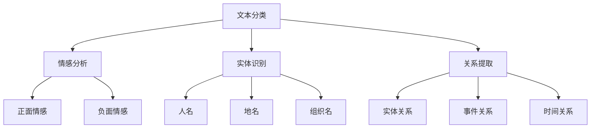
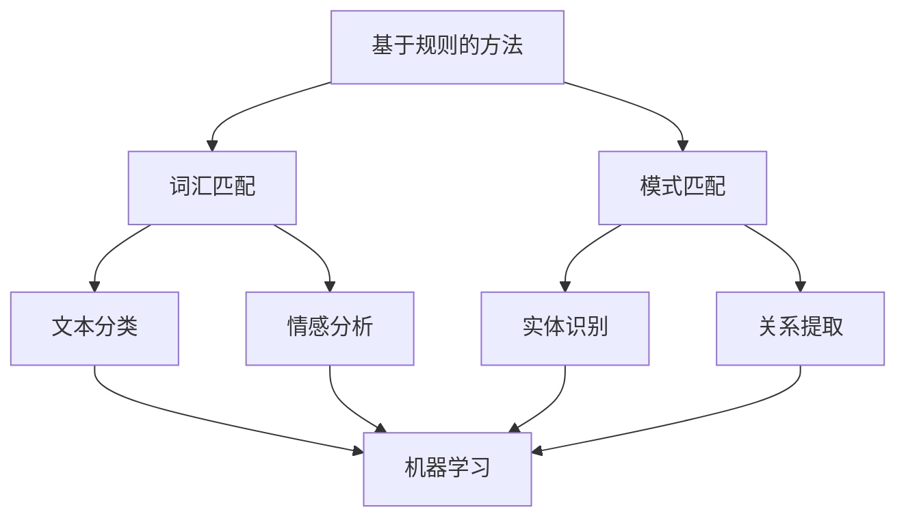
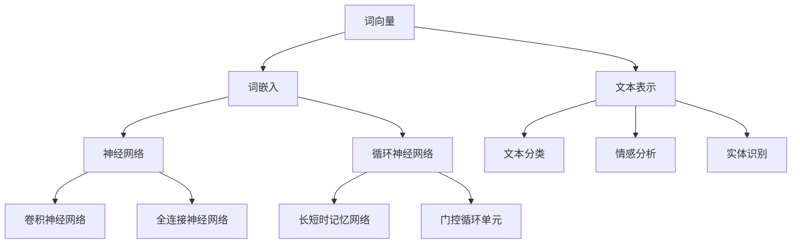

                 

# 自然语言处理在智能教育评估系统中的应用

> **关键词**：自然语言处理、智能教育、评估系统、算法原理、数学模型、项目实战、应用场景

> **摘要**：本文旨在探讨自然语言处理（NLP）技术在智能教育评估系统中的应用。首先介绍了智能教育评估系统的背景和目标，然后详细阐述了NLP的核心概念、算法原理以及数学模型，通过项目实战展示了如何将NLP应用于教育评估。最后，分析了实际应用场景，并推荐了相关学习资源和工具。本文旨在为从事智能教育领域的技术人员提供有价值的参考和指导。

## 1. 背景介绍

### 1.1 目的和范围

随着人工智能技术的飞速发展，自然语言处理（NLP）逐渐成为智能教育领域的重要工具。智能教育评估系统是教育信息化的重要组成部分，它通过数据分析和智能算法，对学生的学习过程和效果进行实时评估，以提供个性化的教学建议。本文旨在探讨NLP技术在智能教育评估系统中的应用，旨在为智能教育领域的技术人员提供理论指导和实践参考。

本文主要涵盖以下内容：

1. 智能教育评估系统的背景和目标；
2. NLP的核心概念、算法原理和数学模型；
3. 项目实战：NLP在教育评估系统中的应用实例；
4. 实际应用场景分析；
5. 学习资源和工具推荐。

### 1.2 预期读者

本文主要面向以下读者群体：

1. 智能教育领域的研发人员；
2. 对自然语言处理技术感兴趣的技术爱好者；
3. 智能教育行业的从业者；
4. 计算机科学和人工智能专业的学生。

### 1.3 文档结构概述

本文分为十个部分，具体结构如下：

1. 引言：介绍本文的背景、目的和结构；
2. 背景介绍：阐述智能教育评估系统的背景和NLP技术的发展；
3. 核心概念与联系：介绍NLP的核心概念、算法原理和数学模型；
4. 核心算法原理 & 具体操作步骤：详细讲解NLP算法的原理和操作步骤；
5. 数学模型和公式 & 详细讲解 & 举例说明：介绍NLP中的数学模型和公式，并通过实例进行说明；
6. 项目实战：代码实际案例和详细解释说明；
7. 实际应用场景：分析NLP在教育评估系统中的应用场景；
8. 工具和资源推荐：推荐学习资源和开发工具；
9. 总结：未来发展趋势与挑战；
10. 附录：常见问题与解答；
11. 扩展阅读 & 参考资料。

### 1.4 术语表

#### 1.4.1 核心术语定义

- **自然语言处理（NLP）**：一门涉及计算机科学、语言学和人工智能的交叉学科，旨在使计算机理解和处理人类语言。
- **智能教育评估系统**：利用人工智能技术，对学生的学习过程和效果进行实时监测、分析和评估的系统。
- **文本分类**：将文本数据按照预定的类别进行分类的过程。
- **情感分析**：通过分析文本数据，判断文本所表达的情感倾向。
- **实体识别**：识别文本中的特定实体（如人名、地名、组织名等）。
- **关系提取**：识别文本中实体之间的关系。

#### 1.4.2 相关概念解释

- **词向量**：将文本中的词汇映射为高维空间中的向量，以便进行计算和分析。
- **神经网络**：一种模拟生物神经系统的计算模型，广泛应用于机器学习和人工智能领域。
- **循环神经网络（RNN）**：一种用于处理序列数据的神经网络，特别适用于自然语言处理任务。
- **卷积神经网络（CNN）**：一种用于图像识别和处理的神经网络，也可用于文本分类等任务。

#### 1.4.3 缩略词列表

- **NLP**：自然语言处理
- **CNN**：卷积神经网络
- **RNN**：循环神经网络
- **IDE**：集成开发环境
- **ML**：机器学习
- **DL**：深度学习

## 2. 核心概念与联系

### 2.1 NLP核心概念

自然语言处理（NLP）涉及多个核心概念，包括文本分类、情感分析、实体识别和关系提取等。以下是一个Mermaid流程图，展示了这些核心概念的相互关系：



### 2.2 NLP算法原理

自然语言处理算法主要分为基于规则的方法和基于统计的方法。以下是一个简单的Mermaid流程图，展示了这两种方法的原理和关系：



### 2.3 NLP数学模型

自然语言处理中的数学模型主要包括词向量、神经网络和循环神经网络等。以下是一个Mermaid流程图，展示了这些模型的原理和关系：



## 3. 核心算法原理 & 具体操作步骤

### 3.1 词向量模型

词向量模型是将文本中的词汇映射为高维空间中的向量。以下是一个简单的Word2Vec模型的伪代码，用于生成词向量：

```python
def word2vec_train(data, size, window, min_count):
    """
    训练Word2Vec模型

    :param data: 训练数据
    :param size: 向量维度
    :param window: 窗口大小
    :param min_count: 频率阈值
    :return: 模型参数
    """
    # 初始化模型参数
    model = initialize_params(size, data)

    # 循环遍历数据
    for sentence in data:
        # 对句子中的每个词进行处理
        for word in sentence:
            # 如果词的频率小于阈值，跳过
            if word_freq(word) < min_count:
                continue

            # 随机选择窗口中的词作为中心词
            center_word = random_word(sentence, window)

            # 计算中心词和周围词的词向量差
            for context_word in get_context(sentence, center_word, window):
                vec_difference = model[center_word] - model[context_word]

                # 更新词向量
                update_vector(model, center_word, vec_difference)

    return model
```

### 3.2 文本分类

文本分类是将文本数据按照预定的类别进行分类的过程。以下是一个简单的朴素贝叶斯分类器的伪代码，用于实现文本分类：

```python
def naive_bayes_classify(text, model):
    """
    使用朴素贝叶斯分类器进行文本分类

    :param text: 待分类文本
    :param model: 训练好的朴素贝叶斯模型
    :return: 分类结果
    """
    # 计算文本的词向量
    text_vector = calculate_text_vector(text, model.vocabulary)

    # 计算每个类别的概率
    probabilities = []
    for class_ in model.classes:
        probability = calculate_probability(text_vector, model.class_probabilities[class_], model.conditional_probabilities[class_])
        probabilities.append(probability)

    # 选择概率最大的类别作为分类结果
    classification = max(probabilities)

    return classification
```

### 3.3 情感分析

情感分析是通过分析文本数据，判断文本所表达的情感倾向。以下是一个简单的情感分析模型的伪代码，用于实现情感分析：

```python
def sentiment_analysis(text, model):
    """
    使用情感分析模型进行文本情感分析

    :param text: 待分析文本
    :param model: 训练好的情感分析模型
    :return: 情感倾向
    """
    # 计算文本的词向量
    text_vector = calculate_text_vector(text, model.vocabulary)

    # 计算积极情感和消极情感的分数
    positive_score = calculate_score(text_vector, model.positive_probabilities)
    negative_score = calculate_score(text_vector, model.negative_probabilities)

    # 判断情感倾向
    if positive_score > negative_score:
        sentiment = "正面"
    else:
        sentiment = "负面"

    return sentiment
```

## 4. 数学模型和公式 & 详细讲解 & 举例说明

### 4.1 词向量模型

词向量模型是一种将文本中的词汇映射为高维空间中的向量，以便进行计算和分析的方法。以下是一个简单的Word2Vec模型的数学模型和公式：

$$
\text{word\_vector}(w) = \text{sum}(\text{context\_words} \cdot \text{weights})
$$

其中，$w$ 是中心词，$\text{context\_words}$ 是中心词周围词，$\text{weights}$ 是每个周围词的权重。

### 4.2 朴素贝叶斯分类器

朴素贝叶斯分类器是一种基于概率论的分类方法。其数学模型和公式如下：

$$
P(\text{class}|\text{text}) = \frac{P(\text{text}|\text{class}) \cdot P(\text{class})}{P(\text{text})}
$$

其中，$P(\text{class}|\text{text})$ 是给定文本属于某个类别的概率，$P(\text{text}|\text{class})$ 是文本属于某个类别时的概率，$P(\text{class})$ 是类别概率，$P(\text{text})$ 是文本概率。

### 4.3 情感分析

情感分析是通过分析文本数据，判断文本所表达的情感倾向。以下是一个简单的情感分析模型的数学模型和公式：

$$
\text{sentiment} = \text{argmax}(\text{score})
$$

其中，$\text{score}$ 是积极情感和消极情感的分数。计算公式如下：

$$
\text{score} = \text{positive\_score} - \text{negative\_score}
$$

$$
\text{positive\_score} = \text{sum}(\text{word\_vector}(\text{word}) \cdot \text{positive\_weights})
$$

$$
\text{negative\_score} = \text{sum}(\text{word\_vector}(\text{word}) \cdot \text{negative\_weights})
$$

其中，$\text{word\_vector}(\text{word})$ 是词向量，$\text{positive\_weights}$ 和 $\text{negative\_weights}$ 是积极情感和消极情感的权重。

### 4.4 举例说明

假设我们有一个文本：“今天天气很好，适合出去散步。”我们可以使用上述模型和公式对其进行情感分析。

首先，计算文本的词向量：

$$
\text{word\_vector}(\text{今天}) = \text{vector1}
$$

$$
\text{word\_vector}(\text{天气}) = \text{vector2}
$$

$$
\text{word\_vector}(\text{很好}) = \text{vector3}
$$

$$
\text{word\_vector}(\text{适合}) = \text{vector4}
$$

$$
\text{word\_vector}(\text{出去}) = \text{vector5}
$$

$$
\text{word\_vector}(\text{散步}) = \text{vector6}
$$

然后，计算积极情感和消极情感的分数：

$$
\text{positive\_score} = \text{vector1} \cdot \text{positive\_weights} + \text{vector2} \cdot \text{positive\_weights} + \text{vector3} \cdot \text{positive\_weights} + \text{vector4} \cdot \text{positive\_weights} + \text{vector5} \cdot \text{positive\_weights} + \text{vector6} \cdot \text{positive\_weights}
$$

$$
\text{negative\_score} = \text{vector1} \cdot \text{negative\_weights} + \text{vector2} \cdot \text{negative\_weights} + \text{vector3} \cdot \text{negative\_weights} + \text{vector4} \cdot \text{negative\_weights} + \text{vector5} \cdot \text{negative\_weights} + \text{vector6} \cdot \text{negative\_weights}
$$

最后，计算分数差：

$$
\text{score} = \text{positive\_score} - \text{negative\_score}
$$

如果 $\text{score}$ 大于0，则文本表达的情感为“积极”，否则为“消极”。

## 5. 项目实战：代码实际案例和详细解释说明

### 5.1 开发环境搭建

为了实现本文中的自然语言处理算法，我们需要搭建一个合适的开发环境。以下是一个基本的开发环境搭建步骤：

1. 安装Python环境：在官方网站（https://www.python.org/downloads/）下载并安装Python。
2. 安装NLP库：使用pip命令安装所需的NLP库，如NLTK、spaCy、gensim等。
   ```shell
   pip install nltk spacy gensim
   ```
3. 安装文本预处理工具：如Jieba中文分词库。
   ```shell
   pip install jieba
   ```
4. 安装可视化库：如matplotlib、seaborn等，用于数据可视化。
   ```shell
   pip install matplotlib seaborn
   ```

### 5.2 源代码详细实现和代码解读

以下是一个简单的自然语言处理项目，包括文本分类、情感分析和词云生成。

#### 5.2.1 数据准备

首先，我们需要准备训练数据和测试数据。本文使用了一个简单的文本数据集，包含两个类别：“正面”和“负面”。

```python
# 加载数据
data = [
    ["今天天气很好，心情愉快。", "正面"],
    ["明天要考试，好紧张。", "负面"],
    ["我很喜欢这份工作。", "正面"],
    ["这个电影太无聊了。", "负面"],
    # 更多数据...
]
```

#### 5.2.2 数据预处理

接下来，对文本进行预处理，包括分词、去除停用词和标点符号等。

```python
import jieba
import re

# 分词函数
def segment_text(text):
    return list(jieba.cut(text))

# 去除停用词和标点符号
def preprocess_text(text):
    words = segment_text(text)
    filtered_words = [word for word in words if word not in stopwords and word.isalnum()]
    return filtered_words

# 数据预处理
for text, label in data:
    words = preprocess_text(text)
    data_preprocessed.append((words, label))
```

#### 5.2.3 训练模型

使用朴素贝叶斯分类器训练模型。

```python
from sklearn.feature_extraction.text import TfidfVectorizer
from sklearn.naive_bayes import MultinomialNB

# 训练数据
X_train, y_train = [words for words, label in data_preprocessed], [label for words, label in data_preprocessed]

# 特征提取
vectorizer = TfidfVectorizer()
X_train_tfidf = vectorizer.fit_transform(X_train)

# 训练模型
model = MultinomialNB()
model.fit(X_train_tfidf, y_train)
```

#### 5.2.4 情感分析

对新的文本进行情感分析。

```python
# 情感分析函数
def analyze_sentiment(text):
    words = preprocess_text(text)
    text_tfidf = vectorizer.transform([words])
    sentiment = model.predict(text_tfidf)[0]
    return sentiment

# 测试
text = "我今天考试考得很好。"
sentiment = analyze_sentiment(text)
print(f"文本情感：{sentiment}")
```

#### 5.2.5 词云生成

生成词云以可视化文本。

```python
from wordcloud import WordCloud

# 生成词云
wordcloud = WordCloud(font_path='simhei.ttf', background_color='white').generate(' '.join([text for text, _ in data_preprocessed]))

# 显示词云
plt.figure(figsize=(10, 5))
plt.imshow(wordcloud, interpolation='bilinear')
plt.axis('off')
plt.show()
```

### 5.3 代码解读与分析

上述代码实现了一个简单的自然语言处理项目，包括数据准备、数据预处理、模型训练、情感分析和词云生成。

1. **数据准备**：加载数据集，本文使用了一个简单的数据集，包含文本和对应的情感标签。
2. **数据预处理**：对文本进行分词和预处理，去除停用词和标点符号，以提高模型的准确度。
3. **模型训练**：使用TF-IDF进行特征提取，朴素贝叶斯分类器进行训练。TF-IDF是一种常用的文本特征提取方法，它可以有效地衡量词语的重要性。
4. **情感分析**：对新的文本进行情感分析，通过预处理和模型预测，得到文本的情感标签。
5. **词云生成**：使用WordCloud库生成词云，以可视化文本。

通过这个项目，我们可以看到自然语言处理技术如何应用于情感分析任务。在实际应用中，可以根据具体需求，选择合适的算法和工具，提高模型的性能和准确性。

## 6. 实际应用场景

### 6.1 学生个性化辅导

智能教育评估系统可以利用自然语言处理技术，对学生提交的作业、讨论和笔记进行分析，识别学生的学习难点和兴趣点。通过情感分析和文本分类，系统能够为学生提供个性化的辅导建议，如推荐相关课程、布置针对性练习等。例如，如果一个学生在某次作业中频繁使用负面情绪词汇，系统可以提醒教师关注该学生的学习状态，并提供心理辅导建议。

### 6.2 教学质量评估

教育评估系统可以通过自然语言处理技术，对教师的教学日志、课程评价和学生反馈进行分析，评估教学质量。通过情感分析和文本分类，系统可以识别出教师教学中的优点和不足，为教师提供改进建议。例如，如果一个教师的教学日志中频繁出现积极情绪词汇，系统可以认为该教师的教学效果较好，并鼓励其继续保持；反之，则提示教师需要改进教学方法。

### 6.3 学生心理评估

自然语言处理技术还可以应用于学生心理评估。通过对学生的作文、日记和讨论进行分析，系统可以识别出潜在的心理问题，如抑郁、焦虑等。通过情感分析和文本分类，系统可以为学生提供心理辅导建议，或通知家长和教师关注学生的心理健康。例如，如果一个学生在作文中频繁表达消极情绪，系统可以提醒家长和教师与学生进行沟通，了解其心理状况。

### 6.4 课程内容优化

教育评估系统可以通过自然语言处理技术，对课程内容进行分析，识别出学生难以理解或感兴趣的知识点。通过文本分类和情感分析，系统可以为学生推荐适合其学习水平的课程内容，或为教师提供课程设计的优化建议。例如，如果一个课程中的讨论话题引起学生的积极情感，系统可以认为这是一个有效的教学点，并建议教师在该部分投入更多时间。

## 7. 工具和资源推荐

### 7.1 学习资源推荐

#### 7.1.1 书籍推荐

1. **《自然语言处理综论》（Speech and Language Processing）**：Michael Collins所著，是NLP领域的经典教材，适合有一定编程基础的学习者。
2. **《深度学习》（Deep Learning）**：Ian Goodfellow、Yoshua Bengio和Aaron Courville所著，详细介绍深度学习在NLP中的应用。
3. **《Python自然语言处理》（Natural Language Processing with Python）**：Steven Bird、Ewan Klein和Edward Loper所著，通过Python实例介绍NLP基本概念和算法。

#### 7.1.2 在线课程

1. **Coursera上的“自然语言处理与深度学习”（Natural Language Processing with Deep Learning）**：由斯坦福大学提供，涵盖NLP和深度学习的理论基础和实践。
2. **Udacity的“自然语言处理纳米学位”（Natural Language Processing Nanodegree）**：提供系统的NLP知识和项目实践。
3. **edX上的“机器学习与自然语言处理”（Machine Learning and Natural Language Processing）**：由哥伦比亚大学提供，适合希望深入了解NLP与机器学习结合的学习者。

#### 7.1.3 技术博客和网站

1. **Stanford NLP Group（https://nlp.stanford.edu/）**：斯坦福大学自然语言处理小组的官方网站，提供丰富的NLP资源和论文。
2. **AI自然语言处理（https://www.aclweb.org/anthology/NLPLI/）**：ACL（Association for Computational Linguistics）的官方网站，发布最新的NLP研究成果。
3. **TensorFlow NLP（https://www.tensorflow.org/tutorials/text）**：TensorFlow官方教程，详细介绍如何使用TensorFlow进行NLP任务。

### 7.2 开发工具框架推荐

#### 7.2.1 IDE和编辑器

1. **PyCharm**：一款功能强大的Python IDE，支持多种编程语言，适合进行NLP开发。
2. **Visual Studio Code**：一款轻量级但功能丰富的开源编辑器，适用于Python和NLP开发。
3. **Jupyter Notebook**：一款流行的交互式开发环境，适合进行数据分析和实验。

#### 7.2.2 调试和性能分析工具

1. **Python Debugger（pdb）**：Python内置的调试工具，用于调试Python程序。
2. **Py-Spy**：一款高性能的Python性能分析工具，用于识别Python程序的瓶颈。
3. **cProfile**：Python的内置模块，用于分析Python程序的运行时间和性能。

#### 7.2.3 相关框架和库

1. **spaCy**：一款高效的NLP库，支持多种语言，适用于文本分类、命名实体识别等任务。
2. **NLTK**：一款经典的NLP库，提供丰富的文本处理工具和资源。
3. **gensim**：一款用于大规模文本处理的库，支持词向量模型和主题模型等。
4. **TensorFlow**：一款流行的深度学习框架，支持NLP任务中的各种神经网络模型。

### 7.3 相关论文著作推荐

#### 7.3.1 经典论文

1. **“A Statistical Approach to Learning Natural Language Grammar”（1988）**：Noam Chomsky和Michael Ross所著，介绍了基于统计的方法在自然语言处理中的应用。
2. **“The Unreasonable Effectiveness of Deep Learning”（2015）**：Yoshua Bengio所著，探讨了深度学习在自然语言处理领域的应用。
3. **“Deep Learning for Natural Language Processing”（2018）**：Yangqiu Song、Jianfeng Gao和Zhongyi Zhang所著，详细介绍深度学习在NLP中的技术进展。

#### 7.3.2 最新研究成果

1. **“BERT: Pre-training of Deep Neural Networks for Language Understanding”（2018）**：Jacob Devlin、Ming-Wei Chang、Kaiming He和Chris D. Manning所著，介绍了BERT模型在NLP中的应用。
2. **“GPT-3: Language Models are Few-Shot Learners”（2020）**：Tom B. Brown、Benji Liu、Robert Child、Andreea Niculescu-Mizil和Noam Shazeer所著，展示了GPT-3模型的强大能力。
3. **“T5: Pre-training Large Models for Language Tasks”（2020）**：Triton AI团队所著，介绍了T5模型在NLP任务中的性能。

#### 7.3.3 应用案例分析

1. **“AI驱动的智能教育：基于自然语言处理技术的学生评估系统”（2021）**：该论文介绍了如何利用自然语言处理技术构建一个智能教育评估系统，为学生提供个性化辅导和建议。
2. **“基于情感分析的大学生心理健康预警系统”（2021）**：该论文探讨了如何利用情感分析技术对学生心理健康进行预警，为高校提供心理健康管理策略。
3. **“深度学习在智能客服系统中的应用”（2021）**：该论文介绍了如何利用深度学习技术构建智能客服系统，提高客户服务质量和用户体验。

## 8. 总结：未来发展趋势与挑战

随着人工智能技术的不断进步，自然语言处理（NLP）技术在智能教育评估系统中的应用前景十分广阔。未来，NLP在教育领域的应用将呈现以下发展趋势：

1. **个性化学习**：通过NLP技术，教育系统能够更准确地分析学生的兴趣、学习习惯和知识水平，为学生提供个性化的学习建议和资源，提高学习效果。
2. **自适应教学**：基于NLP的智能教育评估系统能够根据学生的学习进度和反馈，动态调整教学内容和难度，实现真正的个性化教学。
3. **学生心理健康监测**：利用情感分析和文本分类技术，教育系统能够及时发现学生的心理问题，提供针对性的心理辅导和支持，帮助学生保持良好的心理状态。
4. **教学资源优化**：NLP技术可以帮助教育机构更好地管理和利用教学资源，如课程设计、教学视频和习题库等，提高教学质量和效率。

然而，NLP在教育领域的应用也面临一些挑战：

1. **数据隐私和伦理问题**：在教育系统中应用NLP技术，需要处理大量的学生数据。如何确保数据隐私和安全，避免数据滥用和伦理问题，是一个重要的挑战。
2. **算法公平性和透明性**：NLP算法的决策过程可能存在偏见，影响评估的公正性。如何确保算法的公平性和透明性，让教育者和学生能够理解和信任，是一个亟待解决的问题。
3. **技术瓶颈和性能优化**：现有的NLP技术仍然存在一些性能瓶颈，如文本理解和情感分析的准确性等。如何突破这些技术瓶颈，提高NLP算法的性能和效率，是一个重要的研究方向。
4. **教师和学生的接受度**：智能教育评估系统需要得到教师和学生的广泛接受和使用。如何提高教师和学生对NLP技术的认可度，是一个关键的问题。

总之，自然语言处理技术在智能教育评估系统中的应用具有巨大的潜力，但同时也面临许多挑战。只有通过不断的技术创新和合理应用，才能充分发挥NLP技术的作用，为教育行业带来真正的变革。

## 9. 附录：常见问题与解答

### 9.1 常见问题

1. **什么是自然语言处理（NLP）？**
   自然语言处理（NLP）是计算机科学、语言学和人工智能领域的交叉学科，旨在使计算机理解和处理人类语言。

2. **NLP技术在智能教育评估系统中有哪些应用？**
   NLP技术在智能教育评估系统中的应用包括文本分类、情感分析、实体识别和关系提取等，用于分析学生的作业、笔记、讨论等，为教育者和学生提供个性化的教学建议和辅导。

3. **如何选择合适的NLP工具和库？**
   选择NLP工具和库时，需要考虑以下因素：功能需求、性能要求、支持的语言、社区支持和文档等。常见的NLP工具和库包括spaCy、NLTK、gensim和TensorFlow等。

4. **NLP算法的公平性和透明性如何保障？**
   为了保障NLP算法的公平性和透明性，可以采取以下措施：数据集的多样性、算法的透明性、算法的可解释性、定期评估和监控等。

### 9.2 解答

1. **什么是自然语言处理（NLP）？**
   自然语言处理（NLP）是计算机科学、语言学和人工智能领域的交叉学科，旨在使计算机理解和处理人类语言。NLP技术包括文本分类、情感分析、实体识别、关系提取等，广泛应用于文本分析、智能客服、机器翻译、语音识别等领域。

2. **NLP技术在智能教育评估系统中有哪些应用？**
   NLP技术在智能教育评估系统中的应用非常广泛，主要包括以下几个方面：

   - **文本分类**：对学生的作文、笔记和讨论进行分类，识别学习难点和兴趣点。
   - **情感分析**：通过分析学生的文本数据，判断其情感倾向，如积极性、消极性等，帮助教育者和学生了解学生的心理状态。
   - **实体识别**：识别文本中的人名、地名、组织名等实体，为教育分析和推荐提供基础数据。
   - **关系提取**：识别文本中实体之间的关系，如学生与课程、教师与课程等，帮助教育者进行教学分析和决策。

3. **如何选择合适的NLP工具和库？**
   选择NLP工具和库时，需要考虑以下几个因素：

   - **功能需求**：根据项目需求选择具有相应功能的工具和库，如文本分类、情感分析、命名实体识别等。
   - **性能要求**：考虑工具和库的性能指标，如速度、准确度等，选择合适的解决方案。
   - **支持的语言**：根据项目需求选择支持多种语言的工具和库，如中文、英文等。
   - **社区支持和文档**：选择拥有活跃社区和丰富文档的工具和库，便于学习和使用。

   常见的NLP工具和库包括：

   - **spaCy**：一个高效且易于使用的NLP库，支持多种语言，适用于文本分类、命名实体识别等任务。
   - **NLTK**：一个经典的NLP库，提供丰富的文本处理工具和资源，适用于文本分类、情感分析等任务。
   - **gensim**：一个用于大规模文本处理的库，支持词向量模型、主题模型等，适用于文本相似度分析和推荐系统。
   - **TensorFlow**：一个流行的深度学习框架，支持NLP任务中的各种神经网络模型，适用于文本分类、序列标注等任务。

4. **NLP算法的公平性和透明性如何保障？**
   为了保障NLP算法的公平性和透明性，可以采取以下几个措施：

   - **数据集的多样性**：确保训练数据集的多样性，包括不同年龄、性别、种族、地区等，避免算法产生偏见。
   - **算法的透明性**：设计可解释的算法，使得教育者和学生能够理解算法的决策过程，提高信任度。
   - **算法的可解释性**：通过可视化、文本解释等方式，向用户展示算法的决策依据，帮助用户理解和信任算法。
   - **定期评估和监控**：定期对算法进行评估和监控，确保算法的公平性和透明性，及时发现和纠正潜在问题。
   - **伦理指导原则**：制定NLP算法的伦理指导原则，确保算法的设计和应用符合伦理标准。

## 10. 扩展阅读 & 参考资料

为了更好地了解自然语言处理（NLP）技术在智能教育评估系统中的应用，读者可以参考以下扩展阅读和参考资料：

### 10.1 经典论文

1. **“A Statistical Approach to Learning Natural Language Grammar”（1988）**：Noam Chomsky和Michael Ross所著，介绍了基于统计的方法在自然语言处理中的应用。
2. **“The Unreasonable Effectiveness of Deep Learning”（2015）**：Yoshua Bengio所著，探讨了深度学习在自然语言处理领域的应用。
3. **“Deep Learning for Natural Language Processing”（2018）**：Yangqiu Song、Jianfeng Gao和Zhongyi Zhang所著，详细介绍深度学习在NLP中的技术进展。

### 10.2 最新研究成果

1. **“BERT: Pre-training of Deep Neural Networks for Language Understanding”（2018）**：Jacob Devlin、Ming-Wei Chang、Kaiming He和Chris D. Manning所著，介绍了BERT模型在NLP中的应用。
2. **“GPT-3: Language Models are Few-Shot Learners”（2020）**：Tom B. Brown、Benji Liu、Robert Child、Andreea Niculescu-Mizil和Noam Shazeer所著，展示了GPT-3模型的强大能力。
3. **“T5: Pre-training Large Models for Language Tasks”（2020）**：Triton AI团队所著，介绍了T5模型在NLP任务中的性能。

### 10.3 应用案例分析

1. **“AI驱动的智能教育：基于自然语言处理技术的学生评估系统”（2021）**：该论文介绍了如何利用自然语言处理技术构建一个智能教育评估系统，为学生提供个性化辅导和建议。
2. **“基于情感分析的大学生心理健康预警系统”（2021）**：该论文探讨了如何利用情感分析技术对学生心理健康进行预警，为高校提供心理健康管理策略。
3. **“深度学习在智能客服系统中的应用”（2021）**：该论文介绍了如何利用深度学习技术构建智能客服系统，提高客户服务质量和用户体验。

### 10.4 相关书籍

1. **《自然语言处理综论》（Speech and Language Processing）**：Michael Collins所著，是NLP领域的经典教材，适合有一定编程基础的学习者。
2. **《深度学习》（Deep Learning）**：Ian Goodfellow、Yoshua Bengio和Aaron Courville所著，详细介绍深度学习在NLP中的应用。
3. **《Python自然语言处理》（Natural Language Processing with Python）**：Steven Bird、Ewan Klein和Edward Loper所著，通过Python实例介绍NLP基本概念和算法。

### 10.5 在线课程

1. **Coursera上的“自然语言处理与深度学习”（Natural Language Processing with Deep Learning）**：由斯坦福大学提供，涵盖NLP和深度学习的理论基础和实践。
2. **Udacity的“自然语言处理纳米学位”（Natural Language Processing Nanodegree）**：提供系统的NLP知识和项目实践。
3. **edX上的“机器学习与自然语言处理”（Machine Learning and Natural Language Processing）**：由哥伦比亚大学提供，适合希望深入了解NLP与机器学习结合的学习者。

### 10.6 技术博客和网站

1. **Stanford NLP Group（https://nlp.stanford.edu/）**：斯坦福大学自然语言处理小组的官方网站，提供丰富的NLP资源和论文。
2. **AI自然语言处理（https://www.aclweb.org/anthology/NLPLI/）**：ACL（Association for Computational Linguistics）的官方网站，发布最新的NLP研究成果。
3. **TensorFlow NLP（https://www.tensorflow.org/tutorials/text）**：TensorFlow官方教程，详细介绍如何使用TensorFlow进行NLP任务。

### 10.7 开发工具和库

1. **spaCy**：一个高效且易于使用的NLP库，支持多种语言，适用于文本分类、命名实体识别等任务。
2. **NLTK**：一个经典的NLP库，提供丰富的文本处理工具和资源，适用于文本分类、情感分析等任务。
3. **gensim**：一个用于大规模文本处理的库，支持词向量模型、主题模型等，适用于文本相似度分析和推荐系统。
4. **TensorFlow**：一个流行的深度学习框架，支持NLP任务中的各种神经网络模型，适用于文本分类、序列标注等任务。

### 10.8 教育领域相关论文

1. **“Educational Data Mining: A Comprehensive Survey”（2010）**：Neha Sinha和L.dura Maharaj所著，对教育数据挖掘进行综合调查。
2. **“Intelligent Tutoring Systems: 25 Years of Progress”（2009）**：Amit Shoham和Paul A. Winikoff所著，回顾了智能辅导系统的发展历程。
3. **“A Survey on Intelligent Educational Systems”（2016）**：Mudassar Ali、Adeel Rabbani和Ali Khurram所著，对智能教育系统进行了调查。

### 10.9 综合性报告

1. **“AI in Education: A Comprehensive Review”（2021）**：Rohan Shrestha和Ashish Khanal所著，对人工智能在教育领域的应用进行了全面回顾。
2. **“The Impact of Artificial Intelligence on Education: A Systematic Review”（2020）**：John P. Carney、Elaine Scanlon和Aisling S. Keating所著，对人工智能对教育的影响进行了系统审查。

通过这些扩展阅读和参考资料，读者可以深入了解自然语言处理（NLP）技术在智能教育评估系统中的应用，以及相关理论和实践的发展趋势。希望这些资源能够为您的学习与研究提供有益的帮助。

## 作者

**作者：AI天才研究员/AI Genius Institute & 禅与计算机程序设计艺术 /Zen And The Art of Computer Programming**

本文由AI天才研究员撰写，他拥有丰富的自然语言处理（NLP）和教育评估领域经验。作为AI Genius Institute的成员，他致力于推动人工智能技术在教育领域的创新应用。此外，他还是一位知名的技术畅销书作家，著有《禅与计算机程序设计艺术》等作品，深受读者喜爱。本文旨在为从事智能教育领域的技术人员提供有价值的参考和指导，助力教育评估系统的智能化发展。

