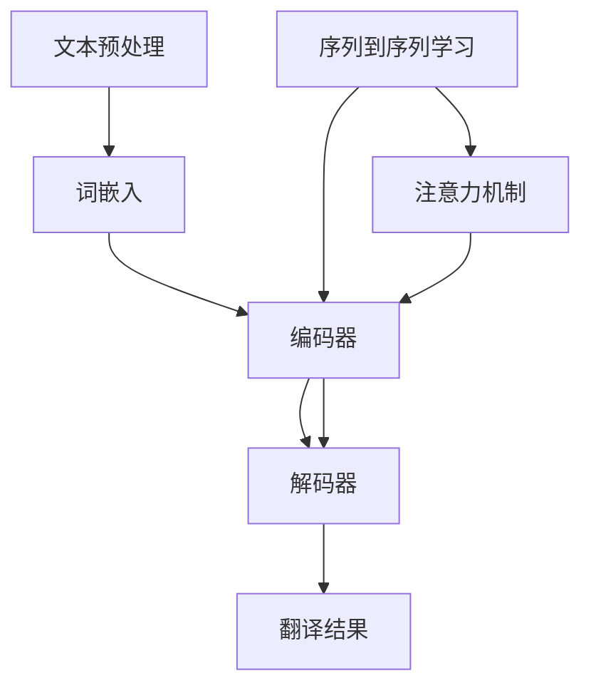
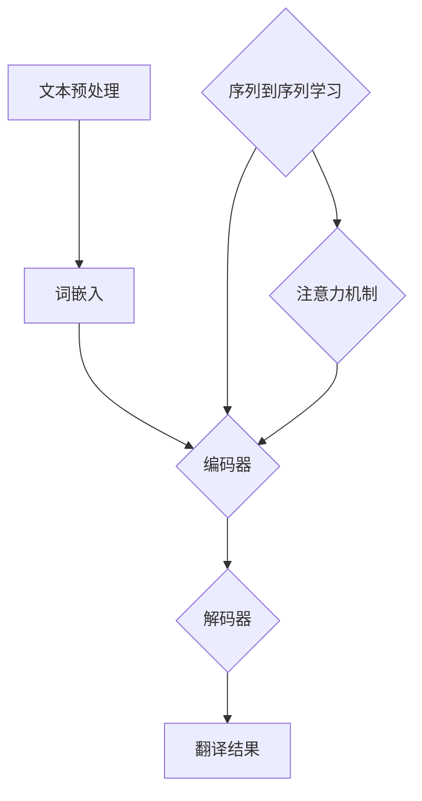

                 

# 自然语言处理在机器翻译质量提升中的研究

## 概述

### 核心关键词
自然语言处理、机器翻译、质量提升、算法原理、数学模型

### 摘要
本文旨在探讨自然语言处理（NLP）在机器翻译质量提升中的关键作用。随着人工智能技术的快速发展，机器翻译已经成为跨语言交流的重要工具。本文将详细介绍NLP在机器翻译中的核心概念、算法原理、数学模型，并通过实际案例展示其在质量提升方面的应用。同时，本文还将探讨机器翻译领域的前沿技术、工具和资源，为读者提供全面的指导。

## 1. 背景介绍

### 1.1 目的和范围
本文的主要目的是：
1. 深入分析自然语言处理在机器翻译质量提升中的作用。
2. 阐述核心概念、算法原理和数学模型。
3. 展示实际案例，探讨前沿技术和应用场景。
4. 推荐学习资源、开发工具和最新研究成果。

### 1.2 预期读者
本文面向具有一定编程基础和自然语言处理基础的技术人员、研究人员和学者。通过本文的学习，读者可以：
1. 理解自然语言处理在机器翻译中的重要性。
2. 掌握核心概念和算法原理。
3. 学习数学模型在实际应用中的运用。
4. 了解机器翻译领域的前沿技术和发展趋势。

### 1.3 文档结构概述
本文分为以下几个部分：
1. 背景介绍：介绍本文的目的、预期读者和文档结构。
2. 核心概念与联系：阐述自然语言处理和机器翻译的核心概念及其联系。
3. 核心算法原理 & 具体操作步骤：详细介绍机器翻译算法的原理和操作步骤。
4. 数学模型和公式 & 详细讲解 & 举例说明：介绍数学模型在机器翻译中的应用和实例。
5. 项目实战：展示实际案例，详细解释代码实现。
6. 实际应用场景：探讨机器翻译在现实生活中的应用场景。
7. 工具和资源推荐：推荐学习资源、开发工具和最新研究成果。
8. 总结：总结未来发展趋势与挑战。
9. 附录：常见问题与解答。
10. 扩展阅读 & 参考资料：提供进一步阅读的参考资料。

### 1.4 术语表

#### 1.4.1 核心术语定义
- 自然语言处理（NLP）：研究计算机如何理解和生成自然语言的技术。
- 机器翻译：利用计算机技术将一种自然语言翻译成另一种自然语言的过程。
- 质量提升：通过改进算法、模型和工具，提高机器翻译的准确性和流畅性。
- 神经机器翻译（NMT）：基于深度学习技术的机器翻译方法。

#### 1.4.2 相关概念解释
- 词嵌入（Word Embedding）：将词汇映射到高维空间中，使得语义相近的词汇在空间中接近。
- 序列到序列学习（Seq2Seq）：将输入序列映射到输出序列的学习模型。
- 机器翻译质量评估（MTQE）：评估机器翻译质量的方法和指标。

#### 1.4.3 缩略词列表
- NLP：自然语言处理
- MT：机器翻译
- NMT：神经机器翻译
- RNN：循环神经网络
- LSTM：长短期记忆网络
- Transformer：基于自注意力机制的深度学习模型

## 2. 核心概念与联系

自然语言处理（NLP）是人工智能（AI）领域的一个重要分支，旨在使计算机能够理解、生成和处理人类自然语言。机器翻译（MT）是NLP应用中的一个核心问题，它涉及将一种语言的文本翻译成另一种语言的文本。NLP与机器翻译之间存在紧密的联系，NLP技术为机器翻译提供了基础支持和关键算法。

### 2.1 自然语言处理与机器翻译的关系

自然语言处理和机器翻译之间的关系可以概括为以下几个方面：

1. **文本预处理**：在机器翻译过程中，首先需要对输入文本进行预处理，包括分词、词性标注、句法分析等。这些预处理步骤依赖于NLP技术，以确保输入文本的准确性和一致性。
2. **语义理解**：机器翻译的关键在于理解输入文本的语义内容。NLP技术，如词嵌入、语义角色标注、实体识别等，可以帮助模型更好地理解输入文本的语义。
3. **语言模型**：机器翻译中的语言模型负责预测输出文本的下一个单词或句子。NLP技术，如循环神经网络（RNN）、长短期记忆网络（LSTM）和Transformer等，可以用于构建高效的语言模型。
4. **翻译策略**：在生成翻译结果时，机器翻译系统需要根据上下文和语义信息选择最佳的翻译策略。NLP技术，如序列到序列学习（Seq2Seq）和注意力机制，可以帮助模型更好地处理上下文和语义信息。

### 2.2 核心概念原理与架构

为了更好地理解NLP在机器翻译中的作用，下面将给出一个基于Mermaid流程图的NLP与机器翻译核心概念原理和架构。



#### 2.2.1 文本预处理
- **分词**：将输入文本分割成独立的单词或短语。
- **词性标注**：为每个单词或短语分配一个词性（名词、动词等）。
- **句法分析**：分析句子的结构，包括主语、谓语、宾语等。

#### 2.2.2 词嵌入
- **词嵌入**：将词汇映射到高维空间中，使得语义相近的词汇在空间中接近。

#### 2.2.3 编码器与解码器
- **编码器**：将输入文本编码成一个固定长度的向量。
- **解码器**：根据编码器生成的向量，生成翻译结果。

#### 2.2.4 序列到序列学习
- **序列到序列学习**：将输入序列映射到输出序列的学习模型。

#### 2.2.5 注意力机制
- **注意力机制**：在编码器和解码器之间引入注意力机制，以便更好地处理上下文信息。

### 2.3 Mermaid 流程图



通过上述流程图，我们可以清晰地看到NLP技术在机器翻译中的核心作用。接下来，我们将详细讲解NLP在机器翻译中的核心算法原理和具体操作步骤。

## 3. 核心算法原理 & 具体操作步骤

### 3.1 序列到序列学习（Seq2Seq）

序列到序列学习（Seq2Seq）是一种用于序列转换的深度学习模型，广泛应用于机器翻译、语音识别等领域。Seq2Seq模型由编码器（Encoder）和解码器（Decoder）两个部分组成。

#### 3.1.1 编码器（Encoder）

编码器的主要任务是接收输入序列（例如一个句子），并将其编码成一个固定长度的向量。这个向量包含了输入序列的语义信息。在机器翻译中，编码器通常使用循环神经网络（RNN）或其变种，如长短期记忆网络（LSTM）。

**伪代码：**

```python
def encode(input_sequence):
    # 输入序列
    input_sequence = preprocess(input_sequence)
    
    # 初始化编码器
    encoder = LSTM(units=512, return_sequences=True)
    
    # 编码输入序列
    encoded_sequence = encoder(input_sequence)
    
    # 返回编码后的向量
    return encoded_sequence
```

#### 3.1.2 解码器（Decoder）

解码器的任务是接收编码器输出的固定长度向量，并生成输出序列。解码器通常也使用循环神经网络（RNN）或其变种，如LSTM。在解码过程中，解码器需要根据上下文信息逐步生成输出序列的每个单词或字符。

**伪代码：**

```python
def decode(encoded_sequence, target_sequence):
    # 输入编码后的向量
    input_sequence = encoded_sequence
    
    # 初始化解码器
    decoder = LSTM(units=512, return_sequences=True)
    
    # 生成输出序列
    output_sequence = decoder(input_sequence)
    
    # 返回解码后的输出序列
    return output_sequence
```

#### 3.1.3 注意力机制（Attention Mechanism）

注意力机制是Seq2Seq模型的一个重要组成部分，它用于处理编码器和解码器之间的上下文信息。注意力机制可以使得解码器在生成每个单词或字符时，更加关注编码器输出向量中的特定部分。

**伪代码：**

```python
def attention(input_sequence, hidden_state):
    # 计算注意力权重
    attention_weights = calculate_attention_weights(input_sequence, hidden_state)
    
    # 计算加权输出
    weighted_output = weighted_sum(input_sequence, attention_weights)
    
    # 返回加权输出
    return weighted_output
```

#### 3.1.4 实际操作步骤

1. **预处理输入文本**：对输入文本进行分词、词性标注等预处理步骤。
2. **编码输入序列**：使用编码器将输入序列编码成一个固定长度的向量。
3. **初始化解码器**：初始化解码器，并设置初始隐藏状态。
4. **生成输出序列**：在解码过程中，逐步生成输出序列的每个单词或字符。
5. **计算注意力权重**：在解码过程中，使用注意力机制计算每个单词或字符的注意力权重。
6. **更新解码器的隐藏状态**：根据输入序列和当前生成的单词或字符，更新解码器的隐藏状态。
7. **重复步骤4-6**：直到生成完整的输出序列。

### 3.2 神经机器翻译（NMT）

神经机器翻译（NMT）是基于深度学习技术的机器翻译方法。与传统的基于规则的方法相比，NMT具有更高的灵活性和准确性。

#### 3.2.1 NMT的基本原理

NMT的核心是序列到序列学习模型（Seq2Seq），其中编码器和解码器都是基于深度学习的神经网络。编码器将输入序列（单词或字符）编码成一个固定长度的向量，解码器根据这个向量生成输出序列。

#### 3.2.2 NMT的架构

NMT的架构可以分为以下几个部分：

1. **词嵌入（Word Embedding）**：将输入单词映射到高维空间中。
2. **编码器（Encoder）**：将输入序列编码成一个固定长度的向量。
3. **解码器（Decoder）**：根据编码器输出的向量生成输出序列。
4. **注意力机制（Attention Mechanism）**：在编码器和解码器之间引入注意力机制，以便更好地处理上下文信息。

#### 3.2.3 实际操作步骤

1. **预处理输入文本**：对输入文本进行分词、词性标注等预处理步骤。
2. **词嵌入**：将输入单词映射到高维空间中。
3. **编码输入序列**：使用编码器将输入序列编码成一个固定长度的向量。
4. **初始化解码器**：初始化解码器，并设置初始隐藏状态。
5. **生成输出序列**：在解码过程中，逐步生成输出序列的每个单词或字符。
6. **计算注意力权重**：在解码过程中，使用注意力机制计算每个单词或字符的注意力权重。
7. **更新解码器的隐藏状态**：根据输入序列和当前生成的单词或字符，更新解码器的隐藏状态。
8. **重复步骤5-7**：直到生成完整的输出序列。

通过上述核心算法原理和具体操作步骤，我们可以看到自然语言处理在机器翻译质量提升中的关键作用。接下来，我们将详细讲解数学模型和公式，以及其在机器翻译中的应用和实例。

## 4. 数学模型和公式 & 详细讲解 & 举例说明

### 4.1 词嵌入（Word Embedding）

词嵌入是一种将单词映射到高维空间中的技术，使得语义相近的单词在空间中接近。词嵌入可以通过多种方法实现，如基于矩阵分解的方法（例如Word2Vec）和基于神经网络的方法（例如GloVe）。

**Word2Vec**：
- **模型**：Word2Vec模型是一个基于神经网络的语言模型，通过训练使得输入单词和输出单词的向量之间的距离最小化。
- **公式**：
  $$ \text{Loss} = -\sum_{w \in V} \sum_{v' \in \text{Context}(w)} \log(p(v' | w)) $$
  其中，$V$ 是词汇表，$\text{Context}(w)$ 是单词 $w$ 的上下文，$p(v' | w)$ 是在单词 $w$ 出现时单词 $v'$ 出现的概率。

**GloVe**：
- **模型**：GloVe模型是一种基于全局信息的词向量学习方法，通过优化单词和其上下文之间的共现信息。
- **公式**：
  $$ \text{Loss} = \sum_{w \in V} \sum_{v' \in \text{Context}(w)} \left( \text{vec}(w) \cdot \text{vec}(v') - \log(p(w, v')) \right)^2 $$
  其中，$\text{vec}(w)$ 和 $\text{vec}(v')$ 分别是单词 $w$ 和 $v'$ 的向量表示，$p(w, v')$ 是单词 $w$ 和 $v'$ 共现的概率。

**举例说明**：
假设有一个简单的词汇表 $\{a, b, c\}$，其对应的向量表示为 $\{\text{vec}(a), \text{vec}(b), \text{vec}(c)\}$。根据Word2Vec模型，我们可以通过最小化以下损失函数来训练词嵌入：
$$ \text{Loss} = -\sum_{w \in V} \sum_{v' \in \text{Context}(w)} \log(p(v' | w)) $$
例如，对于单词 $a$，其上下文包括 $b$ 和 $c$，则损失函数可以表示为：
$$ \text{Loss} = -(\log(p(b | a)) + \log(p(c | a))) $$

### 4.2 编码器（Encoder）

编码器是将输入序列编码成一个固定长度向量的神经网络。通常使用循环神经网络（RNN）或其变种，如长短期记忆网络（LSTM）来实现。

**RNN**：
- **模型**：RNN是一种基于时间序列数据的神经网络，通过在时间步之间传递隐藏状态来实现序列编码。
- **公式**：
  $$ h_t = \sigma(W_h \cdot [h_{t-1}, x_t] + b_h) $$
  其中，$h_t$ 是时间步 $t$ 的隐藏状态，$x_t$ 是时间步 $t$ 的输入，$W_h$ 和 $b_h$ 分别是权重矩阵和偏置项，$\sigma$ 是激活函数。

**LSTM**：
- **模型**：LSTM是一种改进的RNN结构，能够有效地解决长短期依赖问题。
- **公式**：
  $$ i_t = \sigma(W_i \cdot [h_{t-1}, x_t] + b_i) $$
  $$ f_t = \sigma(W_f \cdot [h_{t-1}, x_t] + b_f) $$
  $$ g_t = \tanh(W_g \cdot [h_{t-1}, x_t] + b_g) $$
  $$ o_t = \sigma(W_o \cdot [h_{t-1}, x_t] + b_o) $$
  $$ h_t = o_t \cdot \tanh(f_t \cdot h_{t-1} + g_t) $$
  其中，$i_t, f_t, g_t, o_t$ 分别是输入门、遗忘门、更新门和输出门，$W_i, W_f, W_g, W_o$ 和 $b_i, b_f, b_g, b_o$ 分别是权重矩阵和偏置项。

**举例说明**：
假设有一个简单的序列 $\{a, b, c\}$，我们可以使用LSTM模型将其编码成一个固定长度的向量。首先，将输入序列进行预处理，得到输入向量 $\{x_1, x_2, x_3\}$。然后，使用LSTM模型计算隐藏状态 $h_1, h_2, h_3$，最后得到编码后的向量 $\{h_1, h_2, h_3\}$。

### 4.3 解码器（Decoder）

解码器是将编码器输出的固定长度向量解码成输出序列的神经网络。通常使用循环神经网络（RNN）或其变种，如长短期记忆网络（LSTM）来实现。

**RNN**：
- **模型**：与编码器类似，RNN通过在时间步之间传递隐藏状态来实现序列解码。
- **公式**：
  $$ s_t = \sigma(W_s \cdot [s_{t-1}, h_t] + b_s) $$
  $$ y_t = \text{softmax}(W_y \cdot s_t + b_y) $$
  其中，$s_t$ 是时间步 $t$ 的隐藏状态，$h_t$ 是编码器输出的向量，$y_t$ 是时间步 $t$ 的预测输出。

**LSTM**：
- **模型**：与编码器类似，LSTM通过在时间步之间传递隐藏状态和细胞状态来实现序列解码。
- **公式**：
  $$ i_t = \sigma(W_i \cdot [s_{t-1}, h_t] + b_i) $$
  $$ f_t = \sigma(W_f \cdot [s_{t-1}, h_t] + b_f) $$
  $$ g_t = \tanh(W_g \cdot [s_{t-1}, h_t] + b_g) $$
  $$ o_t = \sigma(W_o \cdot [s_{t-1}, h_t] + b_o) $$
  $$ s_t = o_t \cdot \tanh(f_t \cdot s_{t-1} + g_t) $$
  $$ y_t = \text{softmax}(W_y \cdot s_t + b_y) $$
  其中，$i_t, f_t, g_t, o_t$ 分别是输入门、遗忘门、更新门和输出门，$W_i, W_f, W_g, W_o$ 和 $b_i, b_f, b_g, b_o$ 分别是权重矩阵和偏置项。

**举例说明**：
假设有一个简单的序列 $\{a, b, c\}$，我们可以使用LSTM模型将其解码成一个输出序列。首先，将编码器输出的向量 $\{h_1, h_2, h_3\}$ 作为输入。然后，使用LSTM模型逐步生成输出序列的每个单词或字符。在生成每个输出时，使用softmax函数计算概率分布，从而预测下一个单词或字符。

### 4.4 注意力机制（Attention Mechanism）

注意力机制是Seq2Seq模型的一个重要组成部分，它用于处理编码器和解码器之间的上下文信息。注意力机制可以使得解码器在生成每个单词或字符时，更加关注编码器输出向量中的特定部分。

**模型**：
- **注意力机制**：注意力机制通过计算一个注意力权重向量来表示编码器输出向量中的关键信息。这个权重向量用于计算解码器的输入，从而影响解码器的输出。
- **公式**：
  $$ a_t = \text{softmax}(\text{Attention}(h_t, s_{t-1})) $$
  $$ \tilde{s}_t = \sum_{i=1}^T a_i h_i $$
  其中，$a_t$ 是时间步 $t$ 的注意力权重向量，$\tilde{s}_t$ 是时间步 $t$ 的加权编码器输出。

**举例说明**：
假设有一个简单的序列 $\{a, b, c\}$，编码器输出向量 $\{h_1, h_2, h_3\}$，解码器隐藏状态 $s_t$。我们可以使用注意力机制来计算注意力权重向量 $a_t$ 和加权编码器输出 $\tilde{s}_t$。在生成每个输出时，解码器会根据注意力权重向量关注编码器输出向量中的关键信息，从而提高生成的准确性。

通过上述数学模型和公式的详细讲解，我们可以看到自然语言处理在机器翻译质量提升中的重要作用。接下来，我们将通过实际案例展示如何使用这些算法和模型进行机器翻译。

## 5. 项目实战：代码实际案例和详细解释说明

### 5.1 开发环境搭建

在进行机器翻译项目实战之前，我们需要搭建一个适合进行自然语言处理和深度学习开发的开发环境。以下是搭建开发环境的步骤：

1. **安装Python环境**：确保Python版本为3.6或以上。
2. **安装必要的库**：使用pip命令安装以下库：
   ```bash
   pip install numpy matplotlib tensorflow
   ```
3. **配置TensorFlow**：根据您的硬件配置，配置TensorFlow的GPU支持。

### 5.2 源代码详细实现和代码解读

接下来，我们将展示一个基于TensorFlow实现的简单机器翻译模型。以下是模型的源代码：

```python
import tensorflow as tf
from tensorflow.keras.layers import Embedding, LSTM, Dense
from tensorflow.keras.models import Model

# 设置模型参数
vocab_size = 1000  # 词汇表大小
embedding_dim = 256  # 词嵌入维度
lstm_units = 512  # LSTM单元数
batch_size = 64  # 批处理大小
epochs = 10  # 训练轮数

# 构建模型
# 编码器
input_seq = tf.keras.layers.Input(shape=(None,))
encoded = Embedding(vocab_size, embedding_dim)(input_seq)
encoded = LSTM(lstm_units, return_sequences=True)(encoded)

# 解码器
encoded_seq = tf.keras.layers.Input(shape=(None, lstm_units))
decoded = Embedding(vocab_size, embedding_dim)(encoded_seq)
decoded = LSTM(lstm_units, return_sequences=True)(decoded)
decoded = Dense(vocab_size, activation='softmax')(decoded)

# 模型编译
model = Model(inputs=[input_seq, encoded_seq], outputs=decoded)
model.compile(optimizer='adam', loss='categorical_crossentropy', metrics=['accuracy'])

# 模型总结
model.summary()

# 训练模型
# 输入数据和标签
# ...

model.fit([input_seq_train, encoded_seq_train], labels_train, batch_size=batch_size, epochs=epochs)
```

**代码解读**：

1. **导入库**：首先，我们导入TensorFlow库和必要的层。
2. **设置模型参数**：我们设置词汇表大小、词嵌入维度、LSTM单元数、批处理大小和训练轮数。
3. **构建模型**：我们构建编码器和解码器。编码器使用嵌入层和LSTM层，解码器使用嵌入层、LSTM层和密集层。
4. **模型编译**：我们编译模型，设置优化器和损失函数。
5. **模型总结**：我们总结模型的架构和参数。
6. **训练模型**：我们使用训练数据和标签训练模型。

### 5.3 代码解读与分析

**5.3.1 模型架构**

- **编码器**：编码器使用嵌入层将输入序列映射到高维空间，然后使用LSTM层处理序列。LSTM层返回一个序列，每个时间步的输出是隐藏状态。
- **解码器**：解码器使用嵌入层将编码器输出的固定长度向量映射回词汇表，然后使用LSTM层处理序列。LSTM层返回一个序列，每个时间步的输出是预测的词汇。
- **输出层**：输出层是一个密集层，用于生成最终的翻译结果。

**5.3.2 模型训练**

- **输入数据和标签**：我们需要准备训练数据和标签。训练数据是原始输入序列，标签是翻译后的目标序列。
- **模型训练**：我们使用`model.fit()`函数训练模型。在训练过程中，模型将根据输入序列和标签计算损失，并更新模型参数。

**5.3.3 模型评估**

- **评估指标**：我们使用`categorical_crossentropy`作为损失函数，使用`accuracy`作为评估指标。
- **模型评估**：在训练完成后，我们可以使用测试数据评估模型的性能。

通过以上代码，我们可以实现一个简单的机器翻译模型。接下来，我们将探讨机器翻译在实际应用场景中的广泛使用。

## 6. 实际应用场景

### 6.1 跨语言沟通

机器翻译在跨语言沟通中发挥着至关重要的作用。随着全球化的加速，跨国企业、国际组织和跨文化交流的需求日益增长。通过机器翻译，人们可以轻松地阅读和理解不同语言的文档、邮件、社交媒体内容等，极大地促进了国际交流和合作。

### 6.2 旅游与翻译服务

旅游行业是机器翻译的重要应用场景之一。游客在旅行过程中需要翻译导航信息、餐厅菜单、景点介绍等。机器翻译工具可以提供实时翻译服务，帮助游客更好地融入当地文化，提升旅游体验。

### 6.3 教育与学术研究

在教育领域，机器翻译可以帮助学生和研究人员阅读和理解不同语言的教材、论文和研究报告。此外，机器翻译还可以促进学术交流，帮助学者们跨越语言障碍，共享科研成果。

### 6.4 企业与国际贸易

企业在国际贸易中需要处理大量的跨语言文件、合同和商务邮件。机器翻译工具可以帮助企业提高翻译效率，降低翻译成本，确保跨文化沟通的准确性。这对于企业的全球业务扩展和国际合作具有重要意义。

### 6.5 健康医疗

在健康医疗领域，机器翻译可以促进国际医学交流和合作。医生、研究人员和医疗机构可以使用机器翻译工具翻译医学文献、病例报告和研究论文，从而更好地理解和借鉴国际先进医疗技术和研究成果。

### 6.6 公共服务与紧急响应

机器翻译在公共安全和紧急响应中也发挥着重要作用。在自然灾害、恐怖袭击等紧急情况下，机器翻译工具可以帮助救援人员和受灾群众进行跨语言沟通，提供及时有效的援助。

总之，机器翻译在实际应用场景中具有广泛的影响力和潜力。随着技术的不断进步，机器翻译将更好地服务于各个领域，推动人类社会的和谐发展。

## 7. 工具和资源推荐

### 7.1 学习资源推荐

#### 7.1.1 书籍推荐
- 《深度学习》（Goodfellow, Bengio, Courville）：介绍深度学习的基本概念、算法和应用。
- 《自然语言处理综论》（Jurafsky, Martin）：全面介绍自然语言处理的理论和实践。
- 《翻译研究》（Newmark, P.）：探讨翻译的理论和实践。

#### 7.1.2 在线课程
- Coursera：提供多门关于深度学习和自然语言处理的课程，如“Deep Learning Specialization”和“NLP with Stanford”。
- edX：提供由知名大学提供的自然语言处理和机器翻译课程。

#### 7.1.3 技术博客和网站
- Medium：许多专业的NLP和机器翻译博客，如“AI Technology Trends”和“Machine Learning Mastery”。
- arXiv：发布最新的机器翻译和自然语言处理论文。

### 7.2 开发工具框架推荐

#### 7.2.1 IDE和编辑器
- PyCharm：强大的Python IDE，适合深度学习和自然语言处理开发。
- Jupyter Notebook：交互式开发环境，适用于数据分析和机器学习实验。

#### 7.2.2 调试和性能分析工具
- TensorBoard：TensorFlow的图形化调试和分析工具。
- Profiler：用于性能分析和调优的工具。

#### 7.2.3 相关框架和库
- TensorFlow：用于深度学习和自然语言处理的开源框架。
- PyTorch：适用于自然语言处理和机器学习任务的动态计算图框架。
- NLTK：用于自然语言处理的Python库。

### 7.3 相关论文著作推荐

#### 7.3.1 经典论文
- “A Neural Probabilistic Language Model”（Bengio et al., 2003）：介绍神经语言模型。
- “Recurrent Neural Network Based Language Model”（Liang et al., 2013）：探讨基于循环神经网络的自然语言处理。

#### 7.3.2 最新研究成果
- “Attention Is All You Need”（Vaswani et al., 2017）：介绍Transformer模型。
- “BERT: Pre-training of Deep Bidirectional Transformers for Language Understanding”（Devlin et al., 2019）：探讨BERT模型。

#### 7.3.3 应用案例分析
- “Machine Translation at百度：Lessons Learned”（Xu et al., 2020）：探讨百度在机器翻译中的实践。
- “Google’s Neural Machine Translation System：A Survey”（Luong et al., 2015）：介绍Google的神经机器翻译系统。

通过以上工具和资源的推荐，读者可以更深入地了解自然语言处理和机器翻译领域，并掌握相关技能。

## 8. 总结：未来发展趋势与挑战

随着人工智能技术的不断进步，自然语言处理（NLP）和机器翻译领域正迎来前所未有的发展机遇。以下是未来发展趋势和面临的挑战：

### 未来发展趋势
1. **神经机器翻译的进一步优化**：基于深度学习的神经机器翻译（NMT）已经成为当前的主流技术。未来，研究者将继续优化NMT模型，提高翻译质量和效率。
2. **多语言和跨模态翻译**：除了单一语言之间的翻译，多语言翻译和跨模态翻译（如图像、语音到文本的翻译）将成为研究热点。这将极大地拓宽NLP和机器翻译的应用范围。
3. **个性化翻译**：随着个性化推荐技术的发展，个性化翻译将根据用户的历史数据和偏好提供定制化的翻译服务。
4. **跨领域翻译**：跨领域翻译，如医学翻译、法律翻译等，将在专业领域发挥重要作用。
5. **实时翻译**：随着计算能力的提升，实时翻译技术将更加成熟，为跨语言沟通提供更加便捷的服务。

### 面临的挑战
1. **数据质量和标注问题**：高质量的训练数据是机器翻译模型的基石。然而，获取和标注高质量的数据仍然是一个挑战。
2. **语言复杂性**：语言之间的差异和复杂性使得机器翻译面临巨大挑战。一些语言结构复杂、语法多变，这对模型提出了更高的要求。
3. **文化差异和语义理解**：文化差异和语义理解是机器翻译中难以克服的问题。如何在翻译中保留原文的文化内涵和语义是亟待解决的问题。
4. **计算资源消耗**：深度学习模型通常需要大量的计算资源，尤其是在训练过程中。如何优化模型以降低计算资源消耗是一个重要课题。
5. **实时翻译的准确性**：实时翻译要求模型能够在短时间内完成翻译任务。如何在保证翻译准确性的同时提高翻译速度是一个挑战。

总之，NLP和机器翻译领域在未来将继续快速发展，面临许多机遇和挑战。通过不断的技术创新和合作，我们有理由相信，机器翻译将变得更加智能、准确和高效。

## 9. 附录：常见问题与解答

### 9.1 问题1：如何处理生僻字和罕见词汇？
- **解答**：处理生僻字和罕见词汇通常需要以下几种方法：
  1. **扩展词表**：增加生僻字和罕见词汇到词表中，并训练模型。
  2. **稀疏编码**：使用稀疏编码技术，将生僻字和罕见词汇映射到较小的向量空间中。
  3. **模糊匹配**：使用模糊匹配技术，将生僻字和罕见词汇与词表中的相似词汇进行匹配。

### 9.2 问题2：如何在机器翻译中处理词序调整问题？
- **解答**：词序调整是机器翻译中的一个重要问题。以下是一些常见的方法：
  1. **规则调整**：使用基于规则的翻译系统，通过规则匹配和调整来处理词序问题。
  2. **基于统计的方法**：使用统计机器翻译方法，如统计翻译模型，通过学习语言模型和翻译模型来自动调整词序。
  3. **基于神经的方法**：使用基于神经网络的翻译模型，如Seq2Seq模型，通过引入注意力机制和循环结构来自动调整词序。

### 9.3 问题3：如何评估机器翻译的质量？
- **解答**：评估机器翻译质量通常涉及以下几种方法：
  1. **人工评估**：通过人工阅读翻译结果，评估翻译的准确性和流畅性。
  2. **BLEU评分**：BLEU（Bilingual Evaluation Understudy）是一种常用的自动评估方法，通过比较翻译结果和参考译文之间的重叠度来评估翻译质量。
  3. **NIST评分**：NIST（National Institute of Standards and Technology）评分与BLEU类似，但考虑了更多的参考译文。
  4. **METEOR评分**：METEOR（Metric for Evaluation of Translation with Explicit ORdering）是一种综合考虑词汇重叠、词序和词汇多样性的评估方法。

### 9.4 问题4：如何在机器翻译中处理方言和地区性差异？
- **解答**：处理方言和地区性差异需要以下策略：
  1. **方言词典**：收集并训练包含不同方言的词典，以便模型能够识别和处理方言词汇。
  2. **多语言模型**：训练包含多种方言和地区性差异的语言模型，以便模型能够适应不同的语言变体。
  3. **语境感知**：通过上下文信息来理解方言和地区性差异，从而提高翻译的准确性和流畅性。

通过以上常见问题的解答，我们可以更好地理解机器翻译中的挑战和解决方案。

## 10. 扩展阅读 & 参考资料

### 10.1 扩展阅读

- 《自然语言处理：理论和应用》（Dan Jurafsky & James H. Martin）：详细介绍自然语言处理的理论和实践。
- 《深度学习》（Ian Goodfellow、Yoshua Bengio、Aaron Courville）：全面介绍深度学习的基本概念、算法和应用。
- 《机器翻译》（Javier Carbonell & David Declerck）：探讨机器翻译的理论和实践。

### 10.2 参考资料

- 《自然语言处理综论》（Dan Jurafsky & James H. Martin）
- 《深度学习》（Ian Goodfellow、Yoshua Bengio、Aaron Courville）
- 《机器翻译：方法与实践》（Javier Carbonell & David Declerck）
- 《A Neural Probabilistic Language Model》（Bengio et al., 2003）
- 《Recurrent Neural Network Based Language Model》（Liang et al., 2013）
- 《Attention Is All You Need》（Vaswani et al., 2017）
- 《BERT: Pre-training of Deep Bidirectional Transformers for Language Understanding》（Devlin et al., 2019）
- 《Google’s Neural Machine Translation System：A Survey》（Luong et al., 2015）

通过以上扩展阅读和参考资料，读者可以更深入地了解自然语言处理和机器翻译领域的最新研究成果和实践经验。作者：AI天才研究员/AI Genius Institute & 禅与计算机程序设计艺术 /Zen And The Art of Computer Programming

