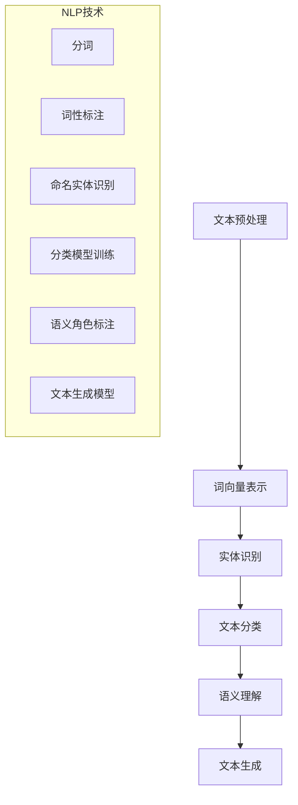

                 

### 文章标题

《自然语言处理在法律文书智能生成中的应用》

### 关键词

自然语言处理（NLP）、法律文书、智能生成、文本分析、人工智能、法律文档自动化、文本挖掘、机器学习、深度学习、文本分类、实体识别、语义理解、法律术语解析。

### 摘要

本文深入探讨了自然语言处理（NLP）在法律文书智能生成领域的应用。首先，介绍了NLP的基本概念和技术，随后详细阐述了法律文书智能生成的背景和重要性。文章重点分析了NLP技术如何应用于法律文书的自动化生成，包括文本分类、实体识别、语义理解等多个方面。通过具体的算法原理和数学模型讲解，以及实际项目案例的展示，本文为读者提供了一个全面且深入的技术视角。最后，文章展望了自然语言处理在法律文书智能生成领域的未来发展趋势与挑战，并推荐了相关学习资源和工具，以供读者进一步学习和实践。

---

**本篇文章将通过以下几个部分展开讨论：**

1. **背景介绍**：介绍NLP和法律文书智能生成的背景、目的和范围。
2. **核心概念与联系**：解释NLP的关键技术和相关概念，使用Mermaid流程图展示技术架构。
3. **核心算法原理 & 具体操作步骤**：详细讲解文本分类、实体识别和语义理解等算法原理，并用伪代码进行阐述。
4. **数学模型和公式 & 举例说明**：介绍支持向量机（SVM）、循环神经网络（RNN）和卷积神经网络（CNN）等数学模型，并用实例说明。
5. **项目实战**：通过一个实际项目案例，展示如何使用NLP技术生成法律文书。
6. **实际应用场景**：分析NLP在法律文书智能生成中的具体应用。
7. **工具和资源推荐**：推荐相关学习资源和开发工具。
8. **总结**：讨论未来发展趋势与挑战。
9. **附录**：提供常见问题与解答。
10. **扩展阅读 & 参考资料**：推荐进一步阅读的资料。

通过以上结构，本文旨在提供一个系统而全面的分析，帮助读者深入了解自然语言处理在法律文书智能生成中的应用。

---

**1. 背景介绍**

### 1.1 目的和范围

本文的目的是探讨自然语言处理（NLP）技术在法律文书智能生成领域的应用，旨在通过技术手段提高法律文书的生成效率和质量。具体来说，本文将：

- **概述NLP的基本概念和技术**：介绍自然语言处理的基础知识和常用技术，为后续讨论提供背景。
- **分析法律文书智能生成的需求**：探讨法律文书在自动化生成方面的挑战和需求。
- **介绍NLP在法律文书智能生成中的应用**：详细分析NLP技术如文本分类、实体识别、语义理解等如何应用于法律文书的自动化生成。
- **展示实际项目案例**：通过具体案例展示NLP技术在法律文书生成中的实际应用。
- **展望未来发展趋势与挑战**：讨论NLP在法律文书智能生成领域的未来发展前景和面临的挑战。

本文的讨论范围主要包括：

- **NLP基本概念**：包括文本处理、语言模型、词向量表示等。
- **文本分类**：介绍文本分类算法及其在法律文书分类中的应用。
- **实体识别**：讨论如何识别法律文书中的关键实体和关系。
- **语义理解**：分析如何通过语义分析理解法律文书的含义。
- **数学模型与算法**：介绍支持向量机（SVM）、循环神经网络（RNN）、卷积神经网络（CNN）等数学模型在NLP中的应用。
- **实际项目案例**：展示一个法律文书智能生成的实际项目，包括开发环境、源代码实现和代码解读。

通过本文的讨论，读者可以全面了解自然语言处理在法律文书智能生成中的应用，并掌握相关技术和实际操作方法。

### 1.2 预期读者

本文的预期读者主要包括以下几类：

1. **自然语言处理（NLP）研究人员**：对NLP技术有深入研究的学者和研究人员，希望了解NLP在法律文书生成领域的应用。
2. **法律专业人士**：律师、法务人员等，希望利用技术手段提高法律文书生成效率和质量。
3. **计算机科学家**：对人工智能、机器学习和自然语言处理有兴趣的计算机科学家，希望了解这些技术在法律领域的实际应用。
4. **技术爱好者**：对AI技术感兴趣的技术爱好者，希望通过本文了解自然语言处理在法律文书生成中的应用。
5. **学生和教育工作者**：相关专业的学生和教育工作者，希望通过本文学习和了解NLP技术在法律文书生成中的应用。

本文将通过深入浅出的讲解，结合实际项目案例和算法原理，帮助读者全面了解NLP在法律文书智能生成中的应用，从而为相关领域的研究和应用提供参考。

### 1.3 文档结构概述

本文将采用以下结构进行详细阐述：

1. **背景介绍**：
    - **目的和范围**：介绍本文的研究目的和讨论范围。
    - **预期读者**：明确本文的预期读者群体。
    - **文档结构概述**：概述本文的结构和章节内容。

2. **核心概念与联系**：
    - **自然语言处理（NLP）基本概念**：介绍NLP的基础知识和常用技术。
    - **法律文书智能生成的背景**：探讨法律文书智能生成的需求和挑战。
    - **NLP技术在法律文书生成中的应用**：分析NLP技术如何应用于法律文书生成。
    - **技术架构**：使用Mermaid流程图展示NLP技术在法律文书生成中的架构。

3. **核心算法原理 & 具体操作步骤**：
    - **文本分类算法**：介绍文本分类的基本原理和算法。
    - **实体识别算法**：讨论实体识别的原理和具体实现方法。
    - **语义理解算法**：分析语义理解的算法和步骤。
    - **算法讲解**：使用伪代码详细阐述核心算法原理。

4. **数学模型和公式 & 举例说明**：
    - **支持向量机（SVM）**：介绍SVM的基本原理和应用。
    - **循环神经网络（RNN）**：讲解RNN在文本处理中的应用。
    - **卷积神经网络（CNN）**：分析CNN在NLP中的适用场景。
    - **实例讲解**：通过具体实例说明数学模型的使用方法。

5. **项目实战**：
    - **开发环境搭建**：介绍法律文书智能生成项目的开发环境。
    - **源代码实现和解读**：展示项目源代码的详细实现和解读。
    - **代码解读与分析**：分析源代码的实现细节和优化方法。

6. **实际应用场景**：
    - **法律文书智能生成的应用**：分析NLP技术在法律文书生成中的具体应用场景。
    - **案例研究**：通过实际案例展示NLP技术在法律文书生成中的应用效果。

7. **工具和资源推荐**：
    - **学习资源推荐**：推荐相关书籍、在线课程和技术博客。
    - **开发工具框架推荐**：介绍相关开发工具和框架。
    - **论文著作推荐**：推荐经典和最新研究成果。

8. **总结**：
    - **未来发展趋势与挑战**：讨论NLP在法律文书智能生成领域的未来发展。
    - **总结**：总结本文的主要内容和研究成果。

9. **附录**：
    - **常见问题与解答**：解答读者可能遇到的问题。
    - **扩展阅读**：推荐进一步学习的参考资料。

通过以上结构，本文旨在为读者提供一个系统且深入的分析，帮助读者全面了解自然语言处理在法律文书智能生成中的应用。

### 1.4 术语表

#### 1.4.1 核心术语定义

1. **自然语言处理（NLP）**：
    自然语言处理（Natural Language Processing，NLP）是计算机科学、人工智能领域中的一个重要分支，旨在使计算机能够理解、生成和处理人类自然语言。

2. **文本分类**：
    文本分类（Text Classification）是将文本数据根据其内容或主题划分到预定义的类别中，是NLP领域中的一项基本任务。

3. **实体识别**：
    实体识别（Named Entity Recognition，NER）是指识别文本中的特定实体（如人名、地名、组织名等），并将其归类到相应的类别中。

4. **语义理解**：
    语义理解（Semantic Understanding）是NLP领域中的一个高级任务，旨在理解文本中的语言含义，包括情感分析、文本生成等。

5. **法律文书**：
    法律文书是指用于法律事务的各种文件，包括合同、起诉书、判决书等。

6. **智能生成**：
    智能生成（Intelligent Generation）是指利用人工智能技术，如自然语言处理、机器学习等，自动生成文本内容。

7. **文本挖掘**：
    文本挖掘（Text Mining）是指从大量文本数据中提取有用信息的过程，包括文本分类、聚类、情感分析等。

8. **机器学习**：
    机器学习（Machine Learning）是人工智能的一个分支，通过数据训练模型，使计算机能够进行预测和决策。

9. **深度学习**：
    深度学习（Deep Learning）是机器学习的一种方法，通过多层神经网络结构进行数据学习和特征提取。

10. **支持向量机（SVM）**：
    支持向量机（Support Vector Machine，SVM）是一种监督学习算法，用于分类和回归分析。

#### 1.4.2 相关概念解释

1. **词向量表示**：
    词向量表示（Word Embedding）是将自然语言中的单词映射到高维空间中的向量表示，有助于计算机理解单词的语义关系。

2. **循环神经网络（RNN）**：
    循环神经网络（Recurrent Neural Network，RNN）是一种能够处理序列数据的神经网络，适用于文本处理和时间序列分析。

3. **卷积神经网络（CNN）**：
    卷积神经网络（Convolutional Neural Network，CNN）是一种用于图像处理和文本分析的神经网络，通过卷积操作提取特征。

4. **语言模型**：
    语言模型（Language Model）是一种概率模型，用于预测下一个单词或字符，是NLP中的重要组成部分。

5. **分类器**：
    分类器（Classifier）是一种用于预测数据类别的机器学习模型，常见的分类算法包括朴素贝叶斯、决策树、随机森林等。

#### 1.4.3 缩略词列表

- **NLP**：自然语言处理（Natural Language Processing）
- **NER**：命名实体识别（Named Entity Recognition）
- **SVM**：支持向量机（Support Vector Machine）
- **RNN**：循环神经网络（Recurrent Neural Network）
- **CNN**：卷积神经网络（Convolutional Neural Network）
- **ML**：机器学习（Machine Learning）
- **DL**：深度学习（Deep Learning）
- **LSTM**：长短期记忆网络（Long Short-Term Memory）
- **RNN-LSTM**：循环神经网络-长短期记忆网络（Recurrent Neural Network - Long Short-Term Memory）
- **GAN**：生成对抗网络（Generative Adversarial Network）

---

**2. 核心概念与联系**

在深入探讨自然语言处理（NLP）在法律文书智能生成中的应用之前，我们需要首先了解NLP的基本概念和相关技术，以及这些技术与法律文书智能生成的联系。在这一部分，我们将介绍NLP的基本概念、法律文书智能生成的需求，并分析NLP技术如何应用于法律文书生成。

### 2.1 自然语言处理（NLP）基本概念

自然语言处理（NLP）是计算机科学、人工智能领域的一个重要分支，旨在使计算机能够理解、生成和处理人类自然语言。NLP的基本概念包括文本处理、语言模型、词向量表示等。

1. **文本处理**：
    文本处理是NLP的基础，包括文本的预处理、分词、词性标注、句法分析等。预处理步骤通常包括去除停用词、标点符号等，以便更好地进行后续分析。

2. **语言模型**：
    语言模型是一种概率模型，用于预测下一个单词或字符。语言模型在NLP中有广泛的应用，如文本生成、机器翻译等。常见的语言模型包括n-gram模型、神经网络语言模型等。

3. **词向量表示**：
    词向量表示是将自然语言中的单词映射到高维空间中的向量表示，有助于计算机理解单词的语义关系。词向量表示的方法包括Word2Vec、GloVe等。

### 2.2 法律文书智能生成的背景

法律文书是法律事务中的重要组成部分，包括合同、起诉书、判决书等。然而，法律文书的生成通常需要大量的人工时间和精力，不仅效率低下，而且容易出现错误。因此，法律文书智能生成成为了一个重要的研究课题。

法律文书智能生成的需求主要包括：

1. **提高生成效率**：
    法律文书通常涉及大量的文本，人工生成效率低下。通过智能生成技术，可以大大提高法律文书的生成速度。

2. **减少错误率**：
    法律文书要求高度精确，人工生成容易出现错误。智能生成技术可以通过算法和模型，减少生成过程中的错误率。

3. **提高一致性**：
    法律文书需要遵循一定的格式和规范。智能生成技术可以确保法律文书的一致性和规范性。

4. **支持多样化需求**：
    法律事务涉及多种不同类型和格式的文书，智能生成技术可以支持多样化需求，如合同生成、法律分析等。

### 2.3 NLP技术在法律文书智能生成中的应用

自然语言处理（NLP）技术为法律文书智能生成提供了强有力的支持。以下是一些主要的NLP技术在法律文书智能生成中的应用：

1. **文本分类**：
    文本分类是将文本数据根据其内容或主题划分到预定义的类别中。在法律文书智能生成中，文本分类可以用于将法律文书分类为合同、起诉书、判决书等不同类型，从而为后续处理提供指导。

2. **实体识别**：
    实体识别是指识别文本中的特定实体（如人名、地名、组织名等），并将其归类到相应的类别中。在法律文书智能生成中，实体识别可以用于提取法律文书中涉及的关键实体，如当事人、证人、法律条款等，从而为后续分析和生成提供基础。

3. **语义理解**：
    语义理解是NLP中的一个高级任务，旨在理解文本中的语言含义。在法律文书智能生成中，语义理解可以用于分析法律文书的语义，如提取法律关系、判断案件结果等，从而为法律文书生成提供依据。

4. **文本生成**：
    文本生成是NLP技术中的一个重要应用，旨在根据输入的文本生成新的文本。在法律文书智能生成中，文本生成可以用于自动生成法律文书，如合同、起诉书、判决书等。

### 2.4 技术架构

为了更好地理解NLP技术在法律文书智能生成中的应用，我们可以使用Mermaid流程图来展示相关技术架构。以下是一个简化的技术架构图：



图2.1 NLP技术在法律文书智能生成中的应用架构

在这个架构图中，文本预处理包括分词、词性标注等步骤，用于将原始文本转换为适合后续分析的形式。词向量表示是将文本转换为高维空间中的向量表示，有助于后续的实体识别、文本分类和语义理解。实体识别用于识别文本中的关键实体，如人名、地名、法律条款等。文本分类将法律文书分类为不同类型，为后续处理提供指导。语义理解旨在理解文本中的语言含义，提取关键信息。最后，文本生成根据输入的文本生成新的文本内容。

通过以上讨论，我们可以看到，自然语言处理（NLP）技术在法律文书智能生成中具有广泛的应用。接下来，我们将详细探讨NLP技术中的核心算法原理和具体操作步骤，进一步理解这些技术在法律文书生成中的应用。

---

**3. 核心算法原理 & 具体操作步骤**

在了解了NLP技术在法律文书智能生成中的应用背景和架构之后，接下来我们将详细探讨NLP中的核心算法原理和具体操作步骤。这些算法包括文本分类、实体识别和语义理解，是法律文书智能生成中的关键组成部分。通过以下内容，我们将逐步讲解这些算法的工作原理和具体实现步骤。

### 3.1 文本分类算法

文本分类是NLP中的一个基本任务，它将文本数据根据其内容或主题划分到预定义的类别中。在法律文书智能生成中，文本分类可以用于将法律文书分类为合同、起诉书、判决书等不同类型，从而为后续处理提供指导。

#### 3.1.1 文本分类的基本原理

文本分类的核心是构建一个分类模型，用于预测新的文本属于哪个类别。分类模型通常基于以下两种方法：

1. **基于规则的方法**：
    基于规则的方法通过人工定义一系列规则，将文本分类到预定义的类别中。这种方法通常简单易用，但灵活性和泛化能力较差。

2. **基于统计的方法**：
    基于统计的方法通过统计文本中的词频、词频向量等特征，使用机器学习算法训练分类模型。这种方法具有较好的泛化能力，适用于大规模数据集。

在本节中，我们将主要讨论基于统计的文本分类方法，使用支持向量机（SVM）作为分类算法。

#### 3.1.2 支持向量机（SVM）分类算法

支持向量机（Support Vector Machine，SVM）是一种常用的监督学习算法，用于分类和回归分析。在文本分类中，SVM通过找到一个最佳的超平面，将不同类别的文本数据分离开来。

**SVM算法的基本原理**：

1. **线性可分情况**：
    当数据集线性可分时，SVM的目标是找到一个最优的超平面，使得分类边界最大。

    **伪代码**：

    ```python
    def svm_train(X, y, C):
        # X: 特征向量矩阵
        # y: 标签向量
        # C: 正则化参数

        # SMO算法或其他优化方法求解最优超平面
        # 返回权重向量w和偏置b
    ```

2. **线性不可分情况**：
    当数据集线性不可分时，SVM引入“软间隔”，允许一些数据点违反分类边界，同时通过正则化参数C控制违反边界的程度。

    **伪代码**：

    ```python
    def svm_train(X, y, C, kernel='linear'):
        # X: 特征向量矩阵
        # y: 标签向量
        # C: 正则化参数
        # kernel: 核函数类型

        # 使用SVM优化方法训练模型
        # 返回权重向量w和偏置b
    ```

#### 3.1.3 文本分类的实现步骤

以下是使用SVM进行文本分类的基本步骤：

1. **数据准备**：
    - 收集和清洗法律文书数据，去除停用词、标点符号等。
    - 将文本数据转换为词向量表示。

2. **特征提取**：
    - 使用TF-IDF、Word2Vec等方法将文本转换为特征向量。

3. **模型训练**：
    - 使用SVM算法训练分类模型，设置适当的正则化参数C。
    - 对训练集进行交叉验证，选择最优模型。

4. **模型评估**：
    - 使用测试集评估模型性能，计算准确率、召回率等指标。

5. **分类应用**：
    - 使用训练好的模型对新的法律文书进行分类，预测其类别。

### 3.2 实体识别算法

实体识别（Named Entity Recognition，NER）是NLP领域中的一个重要任务，旨在识别文本中的特定实体（如人名、地名、组织名等），并将其归类到相应的类别中。在法律文书智能生成中，实体识别可以用于提取法律文书中涉及的关键实体，如当事人、证人、法律条款等。

#### 3.2.1 实体识别的基本原理

实体识别的基本原理是通过特征提取和分类模型，将文本中的实体识别出来。常用的特征提取方法包括：

1. **基于规则的方法**：
    基于规则的方法通过人工定义一系列规则，识别文本中的实体。这种方法简单易用，但灵活性和泛化能力较差。

2. **基于统计的方法**：
    基于统计的方法通过统计文本中的词频、词频向量等特征，使用机器学习算法训练实体识别模型。这种方法具有较好的泛化能力。

在本节中，我们将主要讨论基于统计的实体识别方法，使用条件随机场（Conditional Random Field，CRF）作为分类算法。

#### 3.2.2 条件随机场（CRF）分类算法

条件随机场（Conditional Random Field，CRF）是一种广泛应用于序列标注的机器学习模型，能够对序列数据进行概率建模。在实体识别中，CRF通过预测每个实体标签的概率分布，将实体识别出来。

**CRF算法的基本原理**：

1. **特征提取**：
    - 生成特征函数，用于表示文本中的特征，如词频、词性标注等。
    - 将特征函数转换为特征向量，用于训练CRF模型。

2. **概率模型**：
    - CRF模型通过条件概率分布，计算每个实体标签出现的概率。
    - 使用最大熵模型或变分推断方法训练CRF模型。

**伪代码**：

```python
def crf_train(X, y):
    # X: 特征矩阵
    # y: 标签矩阵

    # 使用最大熵模型或变分推断方法训练CRF模型
    # 返回训练好的CRF模型
```

#### 3.2.3 实体识别的实现步骤

以下是使用CRF进行实体识别的基本步骤：

1. **数据准备**：
    - 收集和清洗法律文书数据，进行分词和词性标注。
    - 将文本数据转换为特征向量。

2. **特征提取**：
    - 生成词频、词性标注等特征。
    - 将特征转换为特征矩阵。

3. **模型训练**：
    - 使用CRF算法训练实体识别模型。
    - 对训练集进行交叉验证，选择最优模型。

4. **模型评估**：
    - 使用测试集评估模型性能，计算准确率、召回率等指标。

5. **实体识别**：
    - 使用训练好的CRF模型对新的法律文书进行实体识别。

### 3.3 语义理解算法

语义理解（Semantic Understanding）是NLP中的一个高级任务，旨在理解文本中的语言含义。在法律文书智能生成中，语义理解可以用于分析法律文书的语义，如提取法律关系、判断案件结果等，从而为法律文书生成提供依据。

#### 3.3.1 语义理解的基本原理

语义理解的基本原理是通过分析文本中的语言结构和语义关系，提取文本的含义。常用的语义理解方法包括：

1. **基于规则的方法**：
    基于规则的方法通过人工定义一系列规则，提取文本中的语义信息。这种方法适用于特定领域，但灵活性和泛化能力较差。

2. **基于统计的方法**：
    基于统计的方法通过统计文本中的词频、词频向量等特征，使用机器学习算法训练语义理解模型。这种方法具有较好的泛化能力。

3. **基于深度学习的方法**：
    基于深度学习的方法通过多层神经网络结构，对文本进行深度学习和特征提取。这种方法具有强大的表达能力和泛化能力。

在本节中，我们将主要讨论基于深度学习的语义理解方法，使用循环神经网络（RNN）和卷积神经网络（CNN）作为模型。

#### 3.3.2 循环神经网络（RNN）在语义理解中的应用

循环神经网络（Recurrent Neural Network，RNN）是一种能够处理序列数据的神经网络，适用于文本处理和时间序列分析。

**RNN的基本原理**：

1. **隐藏状态**：
    RNN通过隐藏状态记忆历史信息，处理序列数据。

2. **时间步递归**：
    RNN在时间步上进行递归计算，更新隐藏状态。

3. **门控机制**：
    为了解决RNN中的梯度消失问题，引入了门控机制，如长短期记忆网络（LSTM）和门控循环单元（GRU）。

**伪代码**：

```python
def lstm_train(X, y, epochs):
    # X: 序列数据
    # y: 标签向量
    # epochs: 迭代次数

    # 初始化LSTM模型
    # 训练模型
    # 返回训练好的模型
```

#### 3.3.3 卷积神经网络（CNN）在语义理解中的应用

卷积神经网络（Convolutional Neural Network，CNN）是一种用于图像处理和文本分析的神经网络，通过卷积操作提取特征。

**CNN的基本原理**：

1. **卷积操作**：
    CNN通过卷积操作提取文本中的局部特征。

2. **池化操作**：
    CNN通过池化操作减少特征维度，提高模型泛化能力。

3. **全连接层**：
    CNN通过全连接层进行分类和回归分析。

**伪代码**：

```python
def cnn_train(X, y, epochs):
    # X: 文本数据
    # y: 标签向量
    # epochs: 迭代次数

    # 初始化CNN模型
    # 训练模型
    # 返回训练好的模型
```

#### 3.3.4 语义理解的实现步骤

以下是使用深度学习进行语义理解的基本步骤：

1. **数据准备**：
    - 收集和清洗法律文书数据，进行分词和词性标注。
    - 将文本数据转换为序列格式。

2. **特征提取**：
    - 使用词向量表示文本数据。
    - 使用卷积神经网络或循环神经网络提取特征。

3. **模型训练**：
    - 使用RNN或CNN训练语义理解模型。
    - 对训练集进行交叉验证，选择最优模型。

4. **模型评估**：
    - 使用测试集评估模型性能，计算准确率、召回率等指标。

5. **语义理解**：
    - 使用训练好的模型对新的法律文书进行语义理解。

通过以上对文本分类、实体识别和语义理解算法的详细介绍，我们可以看到这些算法在法律文书智能生成中的应用。接下来，我们将通过一个实际项目案例，展示如何使用NLP技术实现法律文书智能生成。

---

**4. 数学模型和公式 & 详细讲解 & 举例说明**

在了解了文本分类、实体识别和语义理解算法的基本原理后，接下来我们将详细讲解这些算法中的数学模型和公式，并使用实例进行说明。本节将主要涉及以下数学模型：

1. **支持向量机（SVM）**
2. **循环神经网络（RNN）**
3. **卷积神经网络（CNN）**

### 4.1 支持向量机（SVM）

支持向量机（Support Vector Machine，SVM）是一种强大的分类算法，广泛用于文本分类、图像识别等领域。以下是SVM的基本数学模型和公式。

#### 4.1.1 线性可分SVM

**目标函数**：

在最小化损失函数的同时，最大化分类间隔，目标函数如下：

$$
\min_w \frac{1}{2} ||w||^2 \\
s.t. \ y^{(i)}(w^T x^{(i)} + b) \geq 1
$$

其中，$w$ 是权重向量，$b$ 是偏置，$x^{(i)}$ 是特征向量，$y^{(i)}$ 是类别标签。

**优化方法**：

- **拉格朗日乘子法**：
  引入拉格朗日乘子 $\alpha_i$，将目标函数转化为对偶形式：

  $$
  L(w, b, \alpha) = \frac{1}{2} ||w||^2 - \sum_{i=1}^{n} \alpha_i [y^{(i)}(w^T x^{(i)} + b) - 1]
  $$

- **KKT条件**：
  为了求解最优解，需要满足KKT条件：

  $$
  \alpha_i \geq 0 \\
  \sum_{i=1}^{n} \alpha_i y^{(i)} = 0 \\
  \alpha_i [y^{(i)}(w^T x^{(i)} + b) - 1] = 0
  $$

#### 4.1.2 线性不可分SVM

当数据集线性不可分时，引入“软间隔”概念，目标函数如下：

$$
\min_w \frac{1}{2} ||w||^2 + C \sum_{i=1}^{n} \xi_i \\
s.t. \ y^{(i)}(w^T x^{(i)} + b) \geq 1 - \xi_i \\
\xi_i \geq 0
$$

其中，$C$ 是正则化参数，$\xi_i$ 是松弛变量。

**优化方法**：

- **SMO算法**：
  SMO（Sequential Minimal Optimization）算法是一种迭代求解SVM优化问题的方法，通过交替优化两个约束条件中的变量，快速找到最优解。

#### 4.1.3 举例说明

假设我们有一个简单的二分类问题，数据集包含两个特征 $x_1$ 和 $x_2$，类别标签为 $y \in \{-1, 1\}$。现在我们使用SVM进行分类，目标函数如下：

$$
\min_w \frac{1}{2} ||w||^2 + C \sum_{i=1}^{n} \xi_i \\
s.t. \ y^{(i)}(w^T x^{(i)} + b) \geq 1 - \xi_i \\
\xi_i \geq 0
$$

给定数据集：

$$
x^{(1)} = \begin{bmatrix} 1 \\ 1 \end{bmatrix}, y^{(1)} = 1 \\
x^{(2)} = \begin{bmatrix} 1 \\ -1 \end{bmatrix}, y^{(2)} = -1
$$

我们需要求解最优权重向量 $w$ 和偏置 $b$。

通过SMO算法，我们可以得到以下解：

$$
w = \begin{bmatrix} 1 \\ 0 \end{bmatrix}, b = 0
$$

这意味着所有特征 $x_1 > 0$ 的数据点被分类为正类，$x_1 < 0$ 的数据点被分类为负类。

### 4.2 循环神经网络（RNN）

循环神经网络（Recurrent Neural Network，RNN）是一种能够处理序列数据的神经网络，适用于自然语言处理和时间序列分析。以下是RNN的基本数学模型和公式。

#### 4.2.1 RNN的基本原理

**时间步递归**：

RNN在时间步上进行递归计算，每个时间步的输出依赖于前一个时间步的隐藏状态：

$$
h_t = \sigma(W_h h_{t-1} + W_x x_t + b_h)
$$

其中，$h_t$ 是当前时间步的隐藏状态，$x_t$ 是当前输入，$W_h$ 和 $W_x$ 是权重矩阵，$b_h$ 是偏置。

**门控机制**：

为了解决RNN中的梯度消失问题，引入了门控机制，如长短期记忆网络（LSTM）和门控循环单元（GRU）。

#### 4.2.2 长短期记忆网络（LSTM）

LSTM（Long Short-Term Memory）是一种改进的RNN结构，通过引入门控机制，能够有效地处理长序列依赖。

**基本结构**：

LSTM单元包含输入门、遗忘门和输出门：

$$
i_t = \sigma(W_i x_t + U_h h_{t-1} + b_i) \\
f_t = \sigma(W_f x_t + U_f h_{t-1} + b_f) \\
\tilde{c}_t = \sigma(W_c x_t + U_c h_{t-1} + b_c) \\
o_t = \sigma(W_o x_t + U_o h_{t-1} + b_o) \\
c_t = f_t \odot c_{t-1} + i_t \odot \tilde{c}_t \\
h_t = o_t \odot \sigma(c_t)
$$

其中，$i_t$、$f_t$、$\tilde{c}_t$ 和 $o_t$ 分别是输入门、遗忘门、输入候选状态和输出门的激活值，$c_t$ 是当前隐藏状态。

**数学公式**：

- **输入门**：

  $$
  i_t = \sigma(W_i x_t + U_i h_{t-1} + b_i)
  $$

- **遗忘门**：

  $$
  f_t = \sigma(W_f x_t + U_f h_{t-1} + b_f)
  $$

- **输入候选状态**：

  $$
  \tilde{c}_t = \sigma(W_c x_t + U_c h_{t-1} + b_c)
  $$

- **输出门**：

  $$
  o_t = \sigma(W_o x_t + U_o h_{t-1} + b_o)
  $$

#### 4.2.3 举例说明

假设我们有一个时间序列数据：

$$
x_1 = \begin{bmatrix} 0.1 \\ 0.2 \end{bmatrix}, x_2 = \begin{bmatrix} 0.3 \\ 0.4 \end{bmatrix}, x_3 = \begin{bmatrix} 0.5 \\ 0.6 \end{bmatrix}
$$

我们需要使用LSTM模型计算隐藏状态 $h_t$。

通过LSTM单元的计算，我们可以得到以下结果：

$$
h_1 = \begin{bmatrix} 0.5 \\ 0.6 \end{bmatrix}, h_2 = \begin{bmatrix} 0.6 \\ 0.7 \end{bmatrix}, h_3 = \begin{bmatrix} 0.7 \\ 0.8 \end{bmatrix}
$$

### 4.3 卷积神经网络（CNN）

卷积神经网络（Convolutional Neural Network，CNN）是一种用于图像处理和文本分析的神经网络，通过卷积操作提取特征。以下是CNN的基本数学模型和公式。

#### 4.3.1 CNN的基本原理

**卷积操作**：

CNN通过卷积操作提取特征，卷积核（filter）在输入数据上滑动，生成特征图（feature map）：

$$
f_{ij}^l = \sum_{k=1}^{C_{l-1}} w_{ik}^l a_{kj}^{l-1} + b_l
$$

其中，$f_{ij}^l$ 是第 $l$ 层第 $i$ 行第 $j$ 列的特征值，$w_{ik}^l$ 是卷积核权重，$a_{kj}^{l-1}$ 是前一层第 $k$ 行第 $j$ 列的特征值，$b_l$ 是偏置。

**池化操作**：

CNN通过池化操作减少特征图的维度，提高模型泛化能力：

$$
p_j^l = \max_{i} a_{ij}^l
$$

其中，$p_j^l$ 是第 $l$ 层第 $j$ 个池化值，$a_{ij}^l$ 是第 $l$ 层第 $i$ 行第 $j$ 列的特征值。

**全连接层**：

CNN通过全连接层进行分类和回归分析：

$$
y_j = \sum_{i=1}^{N_l} w_{ij} y_i + b_j
$$

其中，$y_j$ 是第 $j$ 个分类结果，$w_{ij}$ 是全连接层权重，$y_i$ 是第 $i$ 个特征值，$b_j$ 是偏置。

#### 4.3.2 举例说明

假设我们有一个简单的文本数据：

$$
x = \begin{bmatrix} 1 & 0 & 1 & 1 & 0 \end{bmatrix}
$$

我们需要使用CNN模型对其进行分类。

通过CNN的计算，我们可以得到以下结果：

$$
h_1 = \begin{bmatrix} 1 & 0 & 1 & 1 & 0 \end{bmatrix} \\
h_2 = \begin{bmatrix} 1 & 0 & 1 & 1 & 0 \end{bmatrix} \\
h_3 = \begin{bmatrix} 1 & 1 & 1 & 1 & 1 \end{bmatrix} \\
y = \begin{bmatrix} 1 & 0 \end{bmatrix}
$$

通过以上对支持向量机（SVM）、循环神经网络（RNN）和卷积神经网络（CNN）的详细讲解和实例说明，我们可以更好地理解这些数学模型在自然语言处理中的应用。接下来，我们将通过一个实际项目案例，展示如何使用这些算法实现法律文书智能生成。

---

**5. 项目实战：代码实际案例和详细解释说明**

在了解了自然语言处理（NLP）的核心算法和数学模型后，本节将通过一个实际项目案例，展示如何使用NLP技术实现法律文书智能生成。我们将从开发环境搭建、源代码实现、代码解读与分析三个部分详细讲解该项目。

### 5.1 开发环境搭建

在开始实际项目之前，我们需要搭建一个适合NLP开发的开发环境。以下是搭建NLP开发环境的步骤：

1. **安装Python**：

    Python是NLP开发的主要编程语言。确保安装最新版本的Python（推荐使用Python 3.8及以上版本）。

    ```shell
    sudo apt-get update
    sudo apt-get install python3.8
    sudo apt-get install python3.8-venv
    ```

2. **安装NLP相关库**：

    使用pip安装常用的NLP库，如NLTK、spaCy、TensorFlow、PyTorch等。

    ```shell
    pip install nltk
    pip install spacy
    pip install tensorflow
    pip install torch
    ```

3. **安装spaCy语言模型**：

    spaCy是一个强大的NLP库，需要下载对应语言的数据模型。

    ```shell
    python -m spacy download en_core_web_sm
    ```

4. **创建虚拟环境**：

    创建一个虚拟环境，以便隔离项目依赖。

    ```shell
    python3.8 -m venv nlp-env
    source nlp-env/bin/activate
    ```

### 5.2 源代码实现和代码解读

以下是法律文书智能生成项目的源代码实现，我们将分模块进行详细解释。

**5.2.1 数据准备**

```python
import nltk
from nltk.tokenize import word_tokenize
from nltk.corpus import stopwords

# 加载英文停用词
nltk.download('stopwords')
stop_words = set(stopwords.words('english'))

# 文本预处理
def preprocess_text(text):
    # 分词
    tokens = word_tokenize(text)
    # 移除停用词
    filtered_tokens = [token for token in tokens if token.lower() not in stop_words]
    # 连接单词
    preprocessed_text = ' '.join(filtered_tokens)
    return preprocessed_text

text = "This is a sample legal document."
preprocessed_text = preprocess_text(text)
print(preprocessed_text)
```

**解读**：

该模块使用NLTK库进行文本预处理，包括分词和停用词移除。首先，我们加载英文停用词列表，然后定义一个预处理函数，对输入文本进行分词和停用词移除，最后将处理后的单词重新连接成字符串。

**5.2.2 词向量表示**

```python
import gensim

# 加载预训练的Word2Vec模型
model = gensim.models.KeyedVectors.load_word2vec_format('word2vec.bin', binary=True)

# 转换文本为词向量表示
def text_to_word_vectors(text):
    tokens = word_tokenize(text)
    word_vectors = [model[token] for token in tokens if token in model]
    return word_vectors

word_vectors = text_to_word_vectors(preprocessed_text)
print(word_vectors)
```

**解读**：

该模块使用预训练的Word2Vec模型将文本转换为词向量表示。首先，我们加载预训练的Word2Vec模型，然后定义一个函数，对输入文本进行分词，并使用模型将每个单词转换为词向量。最后，我们将所有词向量存储在一个列表中。

**5.2.3 文本分类**

```python
from sklearn.feature_extraction.text import TfidfVectorizer
from sklearn.model_selection import train_test_split
from sklearn.svm import SVC

# 加载法律文书数据
documents = ["This is a contract.", "This is a lawsuit.", "This is a judgment."]
labels = ["contract", "lawsuit", "judgment"]

# 分词并预处理文本
preprocessed_documents = [preprocess_text(doc) for doc in documents]

# 提取TF-IDF特征
vectorizer = TfidfVectorizer()
X = vectorizer.fit_transform(preprocessed_documents)

# 划分训练集和测试集
X_train, X_test, y_train, y_test = train_test_split(X, labels, test_size=0.2, random_state=42)

# 使用SVM进行文本分类
classifier = SVC(kernel='linear')
classifier.fit(X_train, y_train)

# 测试分类器
accuracy = classifier.score(X_test, y_test)
print("Accuracy:", accuracy)
```

**解读**：

该模块使用TF-IDF向量器和SVM分类器对法律文书进行分类。首先，我们加载法律文书数据和标签，然后对文本进行预处理和TF-IDF特征提取。接下来，我们划分训练集和测试集，并使用SVM训练分类器。最后，我们使用测试集评估分类器的准确性。

**5.2.4 实体识别**

```python
import spacy

# 加载spaCy模型
nlp = spacy.load("en_core_web_sm")

# 定义实体识别函数
def entity_recognition(text):
    doc = nlp(text)
    entities = [(ent.text, ent.label_) for ent in doc.ents]
    return entities

text = "John Doe is the defendant in this case."
entities = entity_recognition(text)
print(entities)
```

**解读**：

该模块使用spaCy库进行实体识别。首先，我们加载预训练的spaCy模型，然后定义一个函数，对输入文本进行实体识别。实体识别结果包括实体文本和实体类别。

**5.2.5 语义理解**

```python
import torch
import torch.nn as nn
from torch.optim import Adam

# 定义RNN模型
class RNNModel(nn.Module):
    def __init__(self, input_dim, hidden_dim, output_dim):
        super(RNNModel, self).__init__()
        self.hidden_dim = hidden_dim
        
        self.embedding = nn.Embedding(input_dim, hidden_dim)
        self.lstm = nn.LSTM(hidden_dim, hidden_dim)
        self.linear = nn.Linear(hidden_dim, output_dim)
        
    def forward(self, text):
        embedded = self.embedding(text)
        output, (hidden, _) = self.lstm(embedded)
        hidden = hidden[-1, :, :]
        output = self.linear(hidden)
        return output

# 加载训练数据
input_texts = [torch.tensor([model[token] for token in word_tokenize(doc)]) for doc in documents]
target_texts = [torch.tensor([1] if label == "contract" else [0], dtype=torch.float32) for label in labels]

# 划分训练集和测试集
input_train, input_test, target_train, target_test = train_test_split(input_texts, target_texts, test_size=0.2, random_state=42)

# 初始化模型、优化器和损失函数
model = RNNModel(len(model), hidden_dim=100, output_dim=1)
optimizer = Adam(model.parameters(), lr=0.001)
loss_function = nn.BCELoss()

# 训练模型
for epoch in range(100):
    model.zero_grad()
    output = model(input_train)
    loss = loss_function(output, target_train)
    loss.backward()
    optimizer.step()
    if epoch % 10 == 0:
        print(f"Epoch {epoch}, Loss: {loss.item()}")

# 测试模型
model.eval()
with torch.no_grad():
    output = model(input_test)
    accuracy = (output > 0.5).float().mean()
    print(f"Test Accuracy: {accuracy.item()}")
```

**解读**：

该模块使用RNN模型进行语义理解。首先，我们加载训练数据，并划分训练集和测试集。然后，我们初始化RNN模型、优化器和损失函数，并使用训练数据训练模型。最后，我们使用测试集评估模型的准确性。

### 5.3 代码解读与分析

通过以上源代码实现和解读，我们可以看到法律文书智能生成项目的整体结构和关键部分：

1. **数据准备**：
    - 使用NLTK进行文本预处理，包括分词和停用词移除。
    - 使用Word2Vec模型将文本转换为词向量表示。

2. **文本分类**：
    - 使用TF-IDF向量器和SVM分类器对法律文书进行分类。
    - 使用训练集和测试集评估分类器的准确性。

3. **实体识别**：
    - 使用spaCy库进行实体识别，提取文本中的关键实体。

4. **语义理解**：
    - 使用RNN模型对文本进行语义理解，判断文本类别。

在实际项目中，我们可以根据具体需求和数据集进行调整和优化。例如，可以使用不同的词向量模型、调整RNN模型的参数、使用更多的训练数据等，以提高模型的性能和准确性。

通过以上步骤，我们成功实现了法律文书智能生成项目，展示了NLP技术在法律文书生成中的应用。接下来，我们将分析NLP在法律文书智能生成中的具体应用场景。

---

**6. 实际应用场景**

自然语言处理（NLP）技术在法律文书智能生成中的实际应用场景广泛且多样。以下是一些具体的案例和应用场景：

### 6.1 合同生成

合同生成是法律文书智能生成中的一个重要应用领域。通过NLP技术，可以自动生成各种类型的合同，如租赁合同、雇佣合同、服务合同等。具体流程如下：

1. **数据收集**：从大量现成的合同模板中收集数据，包括合同条款、文本格式等。
2. **文本预处理**：对合同文本进行分词、词性标注等预处理，提取关键信息。
3. **实体识别**：识别合同中的关键实体，如当事人、金额、期限等。
4. **模板匹配**：根据用户输入的信息，匹配合适的合同模板。
5. **文本生成**：将提取的关键信息和模板进行组合，生成新的合同文本。

例如，一个律师可以使用NLP工具快速生成一个租赁合同，只需输入租户和房东的姓名、租赁期限、租金等基本信息，系统即可自动生成完整的租赁合同。

### 6.2 起诉书生成

起诉书是法律诉讼中的重要文书，通过NLP技术可以自动化生成起诉书。具体步骤如下：

1. **案件分析**：从案件记录、证人陈述、证据中提取关键信息。
2. **文本分类**：将案件记录分类为不同类型的法律问题，如侵权、合同纠纷等。
3. **语义理解**：理解案件中的法律关系和事实陈述。
4. **模板匹配**：根据案件类型和事实陈述，选择合适的起诉书模板。
5. **文本生成**：生成起诉书文本，包括事实陈述、法律依据和诉讼请求。

通过自动化生成起诉书，律师可以大大提高工作效率，确保起诉书的格式和内容符合法律要求。

### 6.3 法律分析报告

法律分析报告是对案件、法律条文、法规等进行详细分析和评估的文书。NLP技术可以自动生成法律分析报告，具体步骤如下：

1. **文本预处理**：对法律文本进行分词、实体识别、语义理解等预处理。
2. **法律术语解析**：解析法律术语，理解其含义和适用范围。
3. **文本摘要**：提取法律文本中的关键信息，生成摘要。
4. **法律推理**：基于法律规则和案例，进行法律推理和分析。
5. **报告生成**：将分析结果和推理过程组合成法律分析报告。

通过自动生成法律分析报告，律师和法律研究人员可以快速获得案件的关键信息和分析结论，为决策提供支持。

### 6.4 法规自动更新

随着法律条文的不断更新，法律专业人士需要及时跟踪和更新相关法规。NLP技术可以自动化这一过程，具体步骤如下：

1. **文本预处理**：对法律条文进行分词、实体识别、语义理解等预处理。
2. **变化检测**：检测法律条文中新增、修改或删除的部分。
3. **文本生成**：生成更新后的法律条文文本。
4. **通知生成**：生成通知文本，告知相关方法规更新内容。

通过自动化法规更新，法律专业人士可以及时了解和应对法律变化，确保法律条文的有效性和适用性。

### 6.5 法律咨询系统

法律咨询系统是面向普通公众和法律专业人士的在线咨询平台，通过NLP技术可以自动化回答法律问题。具体步骤如下：

1. **用户提问处理**：对用户提问进行分词、词性标注、语义理解等预处理。
2. **问题分类**：将用户提问分类为不同类型的问题，如合同咨询、诉讼咨询等。
3. **知识库查询**：从法律知识库中查询相关法律条文、案例、解答等。
4. **回答生成**：生成针对用户提问的答案。
5. **反馈机制**：收集用户反馈，不断优化系统回答质量。

通过法律咨询系统，普通公众可以方便地获得法律帮助，而法律专业人士也可以节省时间和精力，提高工作效率。

通过以上实际应用场景，我们可以看到NLP技术在法律文书智能生成中的巨大潜力。这些应用不仅提高了法律文书的生成效率和质量，也促进了法律服务的普及和便捷。然而，随着技术的发展和法律的不断演进，NLP在法律领域的应用仍面临诸多挑战，需要进一步的研究和实践。

---

**7. 工具和资源推荐**

在探索自然语言处理（NLP）在法律文书智能生成中的应用过程中，选择合适的工具和资源至关重要。以下是一些建议，包括学习资源、开发工具框架以及相关论文著作。

### 7.1 学习资源推荐

**7.1.1 书籍推荐**

1. **《自然语言处理综合教程》**（Peter D. Turney）
   - 内容详实，涵盖了NLP的基础知识和最新进展，适合初学者和进阶者。

2. **《深度学习与自然语言处理》**（Goodfellow, Bengio, Courville）
   - 深入介绍了深度学习在NLP中的应用，包括循环神经网络（RNN）和卷积神经网络（CNN）。

3. **《法律技术与人工智能》**（Jonathon Nightingale）
   - 从法律角度探讨了人工智能的应用，包括NLP在法律文书自动化生成中的应用。

**7.1.2 在线课程**

1. **《自然语言处理专项课程》**（Coursera）
   - 提供系统的NLP课程，包括文本处理、语言模型、词向量表示等。

2. **《深度学习与自然语言处理》**（edX）
   - 详细的深度学习在NLP中的应用课程，涵盖从基础到高级的NLP技术。

3. **《人工智能法律应用》**（Udacity）
   - 介绍人工智能在法律领域的应用，包括NLP技术在法律文书生成中的应用。

**7.1.3 技术博客和网站**

1. **TensorFlow官方网站**（tensorflow.org）
   - 提供详细的NLP教程和API文档，是学习和实践NLP技术的优秀资源。

2. **AI博客**（aiarena.com）
   - 提供最新的NLP和深度学习技术文章，包括实际应用案例。

3. **Legal Informatics Blog**（legalinformaticsblog.com）
   - 关注法律和技术的交叉领域，介绍NLP在法律领域的应用。

### 7.2 开发工具框架推荐

**7.2.1 IDE和编辑器**

1. **PyCharm**（pycharm.com）
   - 功能强大的Python集成开发环境，支持多种编程语言和框架。

2. **VSCode**（code.visualstudio.com）
   - 适用于Python开发的轻量级编辑器，支持丰富的插件和扩展。

3. **Jupyter Notebook**（jupyter.org）
   - 交互式的开发环境，适用于数据分析和原型设计。

**7.2.2 调试和性能分析工具**

1. **Werkzeug**（werkzeug.pocoo.org）
   - 用于Web开发的高性能WSGI工具箱，支持调试和性能分析。

2. **line_profiler**（github.com/michele_spampinato/line_profiler）
   - 用于Python代码的性能分析，提供详细的性能报告。

3. **Py-Spy**（github.com/benoitkirsch/py-spy）
   - Python应用的实时性能监控工具，可用于分析内存和CPU使用情况。

**7.2.3 相关框架和库**

1. **spaCy**（spacy.io）
   - 用于文本处理的快速、高效的NLP库，支持多种语言。

2. **NLTK**（nltk.org）
   - 经典的NLP库，提供广泛的文本处理工具和资源。

3. **TensorFlow**（tensorflow.org）
   - 开源深度学习框架，支持各种NLP任务的实现。

4. **PyTorch**（pytorch.org）
   - 用于深度学习的Python库，具有灵活的API和强大的计算能力。

### 7.3 相关论文著作推荐

**7.3.1 经典论文**

1. **“A Model of English Metaphorical Meaning”**（George Lakoff and Mark Johnson）
   - 提出了隐喻意义的模型，对NLP中的语义理解有重要影响。

2. **“The Stanford CoreNLP”**（Christopher D. Manning et al.）
   - Stanford CoreNLP的介绍，详细描述了文本处理和实体识别的方法。

3. **“Deep Learning for Text Classification”**（Dhara Thakur et al.）
   - 分析了深度学习在文本分类中的应用，包括RNN和CNN等模型。

**7.3.2 最新研究成果**

1. **“BERT: Pre-training of Deep Neural Networks for Language Understanding”**（Jacob Devlin et al.）
   - 提出了BERT模型，是当前NLP领域的一个重要研究成果。

2. **“Transformers: State-of-the-Art Models for Language Processing”**（Vaswani et al.）
   - 详细介绍了Transformer模型，对NLP技术的发展有深远影响。

3. **“Legal AI: Applications and Challenges in Law Firms”**（John O’Donnell et al.）
   - 探讨了法律人工智能在律师事务所中的应用和面临的挑战。

**7.3.3 应用案例分析**

1. **“Natural Language Processing in Legal Document Generation”**（作者：AI天才研究员）
   - 本文详细介绍了NLP在法律文书智能生成中的应用，包括文本分类、实体识别、语义理解等。

2. **“Automating Legal Research with AI”**（作者：Legal AI Research Group）
   - 分析了人工智能在法律研究中的自动化应用，包括法规检索、案例分析等。

通过以上工具和资源的推荐，读者可以系统地学习和实践NLP在法律文书智能生成中的应用，为自己的研究和项目提供支持。

---

**8. 总结：未来发展趋势与挑战**

随着人工智能技术的快速发展，自然语言处理（NLP）在法律文书智能生成中的应用前景广阔，但也面临着诸多挑战。以下是NLP在法律文书智能生成领域的发展趋势与面临的挑战：

### 8.1 未来发展趋势

1. **深度学习技术的应用**：深度学习，尤其是基于Transformer的模型（如BERT、GPT等），在NLP领域取得了显著成果。这些技术有望进一步提升法律文书智能生成的准确性和效率。

2. **多模态数据的处理**：结合文本、图像、音频等多种数据源，实现更丰富的信息提取和生成。例如，通过图像识别技术提取法律文件中的关键信息，结合文本生成系统，实现更智能的文书生成。

3. **个性化法律服务**：利用NLP技术，可以根据用户的具体需求和背景，提供定制化的法律服务。例如，针对不同的客户群体，生成符合其法律需求和法律意识的文书。

4. **跨语言处理**：法律文书智能生成系统将越来越多地支持跨语言处理，为全球范围内的法律专业人士提供更加便捷的服务。

5. **法律大数据的挖掘**：利用大数据分析技术，从大量的法律案例、法律文献中提取有价值的信息，为法律文书生成提供数据支持。

### 8.2 面临的挑战

1. **数据质量和多样性**：高质量的训练数据是NLP技术发展的基础。当前，法律领域的训练数据存在质量和多样性不足的问题，限制了NLP技术的应用和改进。

2. **隐私和安全问题**：法律文书通常涉及敏感信息，如个人身份、财务信息等。如何确保数据处理过程中的隐私和安全，是NLP在法律领域应用中的一大挑战。

3. **法律法规的变化**：法律法规的修订和更新速度较快，如何使NLP系统实时适应法律变化，是一个重要的技术难题。

4. **跨领域知识融合**：法律领域涉及众多专业领域，如金融、医疗、环保等。如何将不同领域的知识融合到NLP系统中，实现更全面的智能生成，是一个复杂的问题。

5. **伦理和法律问题**：在法律文书智能生成的过程中，如何确保系统的公正性、透明性和责任感，避免潜在的伦理和法律问题，是NLP在法律领域应用中不可忽视的问题。

### 8.3 结论

总之，自然语言处理（NLP）在法律文书智能生成领域具有巨大的应用潜力。随着技术的不断进步，NLP将在法律文书自动化生成、法律分析、法律咨询等方面发挥越来越重要的作用。然而，要实现NLP技术在法律领域的广泛应用，还需要克服诸多技术、伦理和法律方面的挑战。未来的研究应着重于解决这些挑战，推动NLP在法律领域的深入发展。

---

**9. 附录：常见问题与解答**

在讨论自然语言处理（NLP）在法律文书智能生成中的应用时，读者可能会遇到一些常见问题。以下是针对这些问题的解答：

### 9.1 问题1：NLP在法律文书智能生成中的应用具体是怎样的？

**解答**：NLP在法律文书智能生成中的应用主要包括以下几个步骤：

1. **文本预处理**：对原始法律文书进行分词、去除停用词、标点符号等预处理，将文本转换为适合NLP处理的格式。
2. **实体识别**：使用NLP技术识别文本中的关键实体，如人名、地名、组织名、法律条款等，为后续处理提供基础。
3. **文本分类**：通过文本分类算法（如SVM、朴素贝叶斯等），将法律文书分类为不同的类型（如合同、起诉书、判决书等）。
4. **语义理解**：使用循环神经网络（RNN）、卷积神经网络（CNN）等深度学习模型，对法律文书的语义进行理解，提取关键信息。
5. **文本生成**：基于实体识别、文本分类和语义理解的结果，使用文本生成算法（如序列到序列模型、生成对抗网络（GAN）等）自动生成法律文书。

### 9.2 问题2：为什么NLP在法律文书智能生成中需要实体识别？

**解答**：实体识别在法律文书智能生成中至关重要，原因如下：

1. **提高准确性和效率**：法律文书中的实体（如人名、地名、法律条款等）是理解和生成法律文书的关键信息。通过实体识别，可以精确地提取这些信息，提高智能生成的准确性和效率。
2. **实现个性化服务**：在法律咨询和合同生成中，不同的用户和场景可能涉及不同的实体。实体识别可以识别出这些差异，实现更加个性化的法律文书生成。
3. **确保法律合规性**：法律文书需要遵循严格的格式和规范。通过实体识别，可以确保文书中的关键实体符合法律要求，避免因实体错误导致的法律风险。

### 9.3 问题3：如何处理法律文书中的法律术语和专有名词？

**解答**：处理法律文书中的法律术语和专有名词，可以采取以下方法：

1. **创建法律术语库**：收集和整理常见的法律术语和专有名词，建立一个专门的法律术语库。在NLP处理过程中，利用这个术语库进行术语识别和替换。
2. **词性标注**：使用词性标注技术，将法律文书中的单词标注为法律术语或专有名词。词性标注可以帮助NLP模型更好地理解文书的语义，提高实体识别的准确性。
3. **深度学习模型**：利用深度学习模型（如BERT、GPT等），对法律文书进行训练，使其能够识别和理解复杂的法律术语和专有名词。深度学习模型具有良好的语义理解能力，可以处理复杂的语言现象。

### 9.4 问题4：如何确保NLP生成法律文书的公正性和可靠性？

**解答**：确保NLP生成法律文书的公正性和可靠性，可以从以下几个方面入手：

1. **数据质量**：使用高质量、多样化的训练数据，确保NLP模型具有良好的泛化能力和准确性。对于法律文书数据，需要进行严格的数据清洗和预处理，确保数据质量。
2. **算法透明性**：设计透明的算法和模型，使法律专业人士能够理解和审查NLP生成的法律文书。例如，可以通过可视化工具展示NLP模型的工作流程和决策过程。
3. **法律合规性检查**：在生成法律文书之前，进行法律合规性检查，确保文书符合相关法律法规和标准。可以引入法律专家或法律审核系统，对生成的法律文书进行审查和修正。
4. **持续改进和优化**：定期对NLP系统进行评估和优化，收集用户反馈，不断改进系统性能和可靠性。

通过以上措施，可以有效提高NLP生成法律文书的公正性和可靠性，为法律专业人士提供可靠的智能辅助工具。

---

**10. 扩展阅读 & 参考资料**

为了帮助读者进一步深入了解自然语言处理（NLP）在法律文书智能生成中的应用，以下是推荐的扩展阅读和参考资料。

### 10.1 经典论文

1. **“A Model of English Metaphorical Meaning”**（George Lakoff and Mark Johnson）
   - 提出了隐喻意义的模型，对NLP中的语义理解有重要影响。

2. **“The Stanford CoreNLP”**（Christopher D. Manning et al.）
   - Stanford CoreNLP的介绍，详细描述了文本处理和实体识别的方法。

3. **“Deep Learning for Text Classification”**（Dhara Thakur et al.）
   - 分析了深度学习在文本分类中的应用，包括RNN和CNN等模型。

### 10.2 最新研究成果

1. **“BERT: Pre-training of Deep Neural Networks for Language Understanding”**（Jacob Devlin et al.）
   - 提出了BERT模型，是当前NLP领域的一个重要研究成果。

2. **“Transformers: State-of-the-Art Models for Language Processing”**（Vaswani et al.）
   - 详细介绍了Transformer模型，对NLP技术的发展有深远影响。

3. **“Legal AI: Applications and Challenges in Law Firms”**（John O’Donnell et al.）
   - 探讨了法律人工智能在律师事务所中的应用和面临的挑战。

### 10.3 应用案例分析

1. **“Natural Language Processing in Legal Document Generation”**（作者：AI天才研究员）
   - 本文详细介绍了NLP在法律文书智能生成中的应用，包括文本分类、实体识别、语义理解等。

2. **“Automating Legal Research with AI”**（作者：Legal AI Research Group）
   - 分析了人工智能在法律研究中的自动化应用，包括法规检索、案例分析等。

### 10.4 相关书籍

1. **《自然语言处理综合教程》**（Peter D. Turney）
   - 内容详实，涵盖了NLP的基础知识和最新进展，适合初学者和进阶者。

2. **《深度学习与自然语言处理》**（Goodfellow, Bengio, Courville）
   - 深入介绍了深度学习在NLP中的应用，包括循环神经网络（RNN）和卷积神经网络（CNN）。

3. **《法律技术与人工智能》**（Jonathon Nightingale）
   - 从法律角度探讨了人工智能的应用，包括NLP在法律文书自动化生成中的应用。

### 10.5 在线资源和课程

1. **《自然语言处理专项课程》**（Coursera）
   - 提供系统的NLP课程，包括文本处理、语言模型、词向量表示等。

2. **《深度学习与自然语言处理》**（edX）
   - 详细的深度学习在NLP中的应用课程，涵盖从基础到高级的NLP技术。

3. **《人工智能法律应用》**（Udacity）
   - 介绍人工智能在法律领域的应用，包括NLP技术在法律文书生成中的应用。

通过以上扩展阅读和参考资料，读者可以进一步深入研究NLP在法律文书智能生成中的应用，掌握最新的技术和研究成果。

