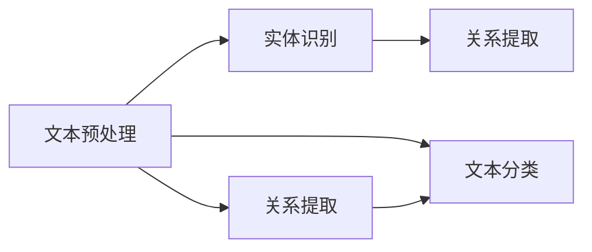

                 

### 1. 背景介绍

#### 1.1 目的和范围

本文旨在探讨自然语言处理（NLP）在法律文本分析中的应用，具体涵盖以下几个方面：

1. **核心概念与联系**：介绍NLP在法律文本分析中的核心概念和其相互联系，如图模型和算法原理。
2. **核心算法原理与具体操作步骤**：详细讲解NLP在法律文本分析中的关键算法原理，并给出具体的操作步骤。
3. **数学模型和公式**：阐述NLP中的数学模型和公式，通过实例进行详细解释。
4. **项目实战：代码实际案例**：提供实际案例，详细解释代码的实现和解读。
5. **实际应用场景**：分析NLP在法律文本分析中的具体应用场景。
6. **工具和资源推荐**：推荐相关的学习资源和开发工具。
7. **总结与未来发展趋势**：总结NLP在法律文本分析中的应用现状，展望未来发展趋势与挑战。

#### 1.2 预期读者

本文适用于以下读者群体：

- 自然语言处理初学者
- 法律专业人士，如律师、法官和法律研究者
- 计算机科学和人工智能领域的工程师和研究员
- 对NLP和法律文本分析有兴趣的普通读者

#### 1.3 文档结构概述

本文分为十个部分，具体结构如下：

1. **背景介绍**：包括目的与范围、预期读者、文档结构概述和术语表。
2. **核心概念与联系**：介绍NLP在法律文本分析中的核心概念及其关系。
3. **核心算法原理与具体操作步骤**：详细讲解NLP在法律文本分析中的应用算法。
4. **数学模型和公式**：阐述NLP中的数学模型和公式，并举例说明。
5. **项目实战：代码实际案例**：提供实际案例，详细解释代码的实现和解读。
6. **实际应用场景**：分析NLP在法律文本分析中的具体应用。
7. **工具和资源推荐**：推荐相关的学习资源和开发工具。
8. **总结与未来发展趋势**：总结NLP在法律文本分析中的应用现状，展望未来发展趋势与挑战。
9. **附录：常见问题与解答**：解答读者可能遇到的问题。
10. **扩展阅读与参考资料**：提供扩展阅读材料，便于读者深入了解。

#### 1.4 术语表

以下是一些本文中涉及到的关键术语及其定义：

#### 1.4.1 核心术语定义

- **自然语言处理（NLP）**：是计算机科学、人工智能和语言学领域结合的产物，旨在使计算机能够理解和处理人类语言。
- **法律文本分析**：是指利用计算机技术和算法对法律文本（如法律文件、判决书、合同等）进行自动分析，以提取关键信息、辅助法律研究等。
- **实体识别（Named Entity Recognition, NER）**：是NLP任务之一，旨在从文本中识别出具有特定意义实体的过程，如人名、地名、组织名等。
- **关系提取（Relation Extraction）**：是NLP任务之一，旨在从文本中识别出实体之间的关系，如“张三在北京市工作”中的工作地点关系。
- **文本分类（Text Classification）**：是NLP任务之一，旨在将文本数据根据其内容分类到不同的类别中，如法律文本的分类。

#### 1.4.2 相关概念解释

- **词嵌入（Word Embedding）**：是一种将词语映射到低维连续向量空间的方法，以表示词语的语义信息。
- **递归神经网络（RNN）**：是一种用于处理序列数据的神经网络，能够捕捉序列中的上下文信息。
- **长短时记忆（Long Short-Term Memory, LSTM）**：是RNN的一种变体，能够解决RNN在处理长序列数据时的梯度消失问题。
- **卷积神经网络（CNN）**：是一种用于处理图像和文本等二维数据的神经网络，能够捕捉局部特征。
- **词袋模型（Bag of Words, BOW）**：是一种将文本转换为向量表示的方法，不考虑词语的顺序，只考虑词语的频率。

#### 1.4.3 缩略词列表

- **NLP**：自然语言处理（Natural Language Processing）
- **NER**：实体识别（Named Entity Recognition）
- **RNN**：递归神经网络（Recurrent Neural Network）
- **LSTM**：长短时记忆（Long Short-Term Memory）
- **CNN**：卷积神经网络（Convolutional Neural Network）
- **BOW**：词袋模型（Bag of Words）

### 1.5 文章核心概念与联系

在自然语言处理（NLP）领域，法律文本分析是一个具有重大应用潜力的分支。本文将详细阐述NLP在法律文本分析中的应用，包括核心概念、原理和架构。通过本文，读者将了解NLP在法律文本分析中的关键技术和应用场景。

#### 2.1 核心概念

法律文本分析中的核心概念包括：

1. **实体识别（NER）**：从法律文本中识别出具有特定意义实体的过程，如人名、地名、组织名、法律条款等。
2. **关系提取**：从法律文本中识别出实体之间的关系，如当事人之间的诉讼关系、法律条款之间的关系等。
3. **文本分类**：将法律文本根据其内容分类到不同的类别中，如案件类型、法律条款类型等。

#### 2.2 关系

这些核心概念之间存在紧密联系：

1. **实体识别**是**关系提取**的基础，因为关系通常涉及两个或多个实体。
2. **关系提取**可以**补充**实体识别的结果，提供更丰富的信息。
3. **文本分类**通常基于**实体识别**和**关系提取**的结果，用于对法律文本进行分类。

#### 2.3 架构

法律文本分析的整体架构可以概括为以下几个步骤：

1. **文本预处理**：包括分词、去除停用词、词性标注等，将原始文本转换为计算机可处理的格式。
2. **实体识别**：使用NLP技术，如基于规则的方法、统计模型、深度学习模型等，从文本中识别出实体。
3. **关系提取**：基于实体识别的结果，使用图论、条件随机场（CRF）等方法，从文本中提取实体之间的关系。
4. **文本分类**：根据实体识别和关系提取的结果，使用分类算法，如朴素贝叶斯、支持向量机、深度学习等，对法律文本进行分类。

### 2.4 Mermaid 流程图

以下是一个简单的Mermaid流程图，展示了法律文本分析的整体架构：



在这个流程图中，文本预处理是整个流程的起点，接着是实体识别、关系提取和文本分类三个主要步骤。实体识别和关系提取之间存在双向依赖，而文本分类通常基于前两个步骤的结果。

通过这个简单的架构，读者可以初步了解NLP在法律文本分析中的应用。接下来，本文将详细讲解NLP在法律文本分析中的核心算法原理和具体操作步骤。

### 2.5 核心算法原理 & 具体操作步骤

在NLP领域，多个算法和模型被应用于法律文本分析中。以下将详细介绍几个关键算法的原理和具体操作步骤：

#### 3.1 词嵌入（Word Embedding）

词嵌入是一种将词语映射到低维连续向量空间的方法，以表示词语的语义信息。词嵌入的核心算法包括Word2Vec、GloVe等。

**Word2Vec**：
- **算法原理**：Word2Vec基于神经概率模型，通过训练词向量的共现关系，使相似词的向量在低维空间中靠近。
- **具体操作步骤**：
  1. **数据准备**：收集大量文本数据，进行预处理，如分词、去除停用词等。
  2. **构建词汇表**：将文本中的词语构建为词汇表，并为每个词语分配一个唯一的索引。
  3. **训练词向量**：使用Skip-gram或CBOW模型训练词向量。对于每个词语，生成其上下文窗口，并通过梯度下降优化词向量。
  4. **评估词向量**：使用相似度度量（如余弦相似度）评估词向量的质量。

**GloVe**：
- **算法原理**：GloVe通过构建词语的矩阵分解模型，使词语的共现次数与词语的向量表示相关联。
- **具体操作步骤**：
  1. **数据准备**：与Word2Vec相同，进行文本预处理和词汇表构建。
  2. **计算共现矩阵**：统计文本中词语的共现次数，构建共现矩阵。
  3. **矩阵分解**：使用奇异值分解（SVD）对共现矩阵进行分解，得到词向量。
  4. **优化词向量**：通过优化目标函数（如损失函数）调整词向量，提高其质量。

#### 3.2 递归神经网络（RNN）

RNN是一种用于处理序列数据的神经网络，能够捕捉序列中的上下文信息。在法律文本分析中，RNN常用于实体识别和关系提取。

**算法原理**：
- **基本结构**：RNN的基本结构包括输入层、隐藏层和输出层。每个隐藏层都包含一个状态向量，用于保存当前时刻的信息。
- **动态递归**：在处理序列数据时，RNN通过递归关系，将前一个时间步的信息传递到当前时间步，从而捕捉上下文信息。

**具体操作步骤**：
1. **数据准备**：与词嵌入类似，进行文本预处理和词汇表构建。
2. **构建RNN模型**：使用RNN模型框架（如TensorFlow或PyTorch）构建RNN模型。
3. **训练模型**：通过训练数据训练RNN模型，优化模型参数。
4. **评估模型**：使用测试数据评估模型性能，调整模型参数，直至达到预期效果。

#### 3.3 长短时记忆（LSTM）

LSTM是RNN的一种变体，能够解决RNN在处理长序列数据时的梯度消失问题。在法律文本分析中，LSTM常用于实体识别和关系提取。

**算法原理**：
- **基本结构**：LSTM的基本结构包括输入门、遗忘门、输出门和单元状态。
- **动态递归**：LSTM通过这三个门控制信息的输入、遗忘和输出，从而在处理长序列数据时保持信息的持久性。

**具体操作步骤**：
1. **数据准备**：与RNN相同，进行文本预处理和词汇表构建。
2. **构建LSTM模型**：使用LSTM模型框架构建LSTM模型。
3. **训练模型**：通过训练数据训练LSTM模型，优化模型参数。
4. **评估模型**：使用测试数据评估模型性能，调整模型参数，直至达到预期效果。

#### 3.4 卷积神经网络（CNN）

CNN是一种用于处理图像和文本等二维数据的神经网络，能够捕捉局部特征。在法律文本分析中，CNN常用于文本分类。

**算法原理**：
- **基本结构**：CNN的基本结构包括卷积层、池化层和全连接层。卷积层用于捕捉局部特征，池化层用于降低维度和减少过拟合，全连接层用于分类。
- **卷积操作**：卷积层通过卷积操作捕捉文本中的局部特征，如词性、词频等。

**具体操作步骤**：
1. **数据准备**：与词嵌入和RNN相同，进行文本预处理和词汇表构建。
2. **构建CNN模型**：使用CNN模型框架构建CNN模型。
3. **训练模型**：通过训练数据训练CNN模型，优化模型参数。
4. **评估模型**：使用测试数据评估模型性能，调整模型参数，直至达到预期效果。

通过以上介绍，读者可以初步了解NLP在法律文本分析中的核心算法原理和具体操作步骤。接下来，本文将详细讲解NLP中的数学模型和公式，并通过实例进行详细解释。

### 4. 数学模型和公式 & 详细讲解 & 举例说明

自然语言处理（NLP）中的数学模型和公式是实现各种NLP任务的关键。以下将详细介绍NLP中常用的数学模型和公式，并通过实例进行详细解释。

#### 4.1 词嵌入模型

词嵌入是一种将词语映射到低维向量空间的方法，以表示词语的语义信息。常用的词嵌入模型包括Word2Vec和GloVe。

**4.1.1 Word2Vec模型**

Word2Vec模型的核心思想是利用词语的共现关系来训练词向量。以下是一个Word2Vec模型的数学公式：

$$
\begin{aligned}
\text{skip-gram模型} \quad & \text{给定词语 } w_t, \text{生成其上下文词语 } w_{t-d} \ldots w_{t+d} \\
\text{损失函数} \quad & \text{使用负采样损失函数} \\
\text{梯度下降} \quad & \text{优化词向量} \\
\end{aligned}
$$

**实例说明**：

假设我们有一个词汇表包含5个词语：`apple`, `banana`, `orange`, `fruit`, `sell`。一个句子：“I like to sell apples and bananas.” 我们可以使用Word2Vec模型训练词向量。

1. **构建词汇表**：将词语构建为词汇表，并为每个词语分配一个唯一的索引。
2. **生成训练样本**：对于每个词语，生成其上下文窗口，如`apple`的上下文窗口为`[I, to, sell]`。
3. **计算词向量**：使用梯度下降优化词向量，使得相似词的向量在低维空间中靠近。
4. **评估词向量**：使用相似度度量（如余弦相似度）评估词向量的质量。

**4.1.2 GloVe模型**

GloVe模型通过构建词语的矩阵分解模型，使词语的共现次数与词语的向量表示相关联。以下是一个GloVe模型的数学公式：

$$
\begin{aligned}
\text{共现矩阵} \quad & C_{ij} = \text{count}(w_i, w_j) \\
\text{矩阵分解} \quad & D = \text{SVD}(C) \\
\text{词向量} \quad & v_i = \text{row}_i(D) \\
\end{aligned}
$$

**实例说明**：

假设我们有一个词汇表包含5个词语：`apple`, `banana`, `orange`, `fruit`, `sell`。一个句子：“I like to sell apples and bananas.” 我们可以使用GloVe模型训练词向量。

1. **计算共现矩阵**：统计文本中词语的共现次数，构建共现矩阵。
2. **矩阵分解**：使用奇异值分解（SVD）对共现矩阵进行分解。
3. **计算词向量**：提取矩阵分解后的行向量作为词向量。
4. **评估词向量**：使用相似度度量（如余弦相似度）评估词向量的质量。

#### 4.2 递归神经网络（RNN）

RNN是一种用于处理序列数据的神经网络，能够捕捉序列中的上下文信息。以下是一个RNN模型的数学公式：

$$
\begin{aligned}
h_t = \text{激活函数}(\text{权重} \cdot [h_{t-1}, x_t] + \text{偏置}) \\
o_t = \text{激活函数}(\text{权重} \cdot h_t + \text{偏置}) \\
\end{aligned}
$$

**实例说明**：

假设我们有一个序列：“I like to sell apples and bananas.” 使用RNN模型进行序列建模。

1. **数据准备**：将序列中的词语转换为词向量表示。
2. **构建RNN模型**：使用RNN模型框架（如TensorFlow或PyTorch）构建RNN模型。
3. **训练模型**：通过训练数据训练RNN模型，优化模型参数。
4. **评估模型**：使用测试数据评估模型性能。

#### 4.3 长短时记忆（LSTM）

LSTM是RNN的一种变体，能够解决RNN在处理长序列数据时的梯度消失问题。以下是一个LSTM模型的数学公式：

$$
\begin{aligned}
i_t &= \text{激活函数}(\text{权重} \cdot [h_{t-1}, x_t] + \text{偏置}) \\
f_t &= \text{激活函数}(\text{权重} \cdot [h_{t-1}, x_t] + \text{偏置}) \\
\text{单元状态} &= \text{激活函数}(\text{权重} \cdot [i_t \odot \text{门控状态}, h_{t-1}] + \text{偏置}) \\
o_t &= \text{激活函数}(\text{权重} \cdot \text{单元状态} + \text{偏置}) \\
h_t &= o_t \odot \text{单元状态} \\
\end{aligned}
$$

**实例说明**：

假设我们有一个序列：“I like to sell apples and bananas.” 使用LSTM模型进行序列建模。

1. **数据准备**：将序列中的词语转换为词向量表示。
2. **构建LSTM模型**：使用LSTM模型框架（如TensorFlow或PyTorch）构建LSTM模型。
3. **训练模型**：通过训练数据训练LSTM模型，优化模型参数。
4. **评估模型**：使用测试数据评估模型性能。

#### 4.4 卷积神经网络（CNN）

CNN是一种用于处理图像和文本等二维数据的神经网络，能够捕捉局部特征。以下是一个CNN模型的数学公式：

$$
\begin{aligned}
x &= \text{输入} \\
C &= \text{卷积核} \\
h_{k} &= \text{激活函数}(\text{权重} \cdot C \cdot x + \text{偏置}) \\
p_{k} &= \text{池化操作}(\text{权重} \cdot h_{k} + \text{偏置}) \\
\end{aligned}
$$

**实例说明**：

假设我们有一个文本序列：“I like to sell apples and bananas.” 使用CNN模型进行文本分类。

1. **数据准备**：将序列中的词语转换为词向量表示，并构建卷积核。
2. **构建CNN模型**：使用CNN模型框架（如TensorFlow或PyTorch）构建CNN模型。
3. **训练模型**：通过训练数据训练CNN模型，优化模型参数。
4. **评估模型**：使用测试数据评估模型性能。

通过以上数学模型和公式的介绍，读者可以更好地理解NLP中的核心算法原理。接下来，本文将提供一个实际案例，通过代码实现和详细解释展示NLP在法律文本分析中的应用。

### 5. 项目实战：代码实际案例和详细解释说明

#### 5.1 开发环境搭建

在进行项目实战之前，我们需要搭建一个合适的开发环境。以下列出所需的工具和软件：

- Python 3.x
- TensorFlow 2.x 或 PyTorch 1.x
- Jupyter Notebook 或 PyCharm
- NLTK 或 spaCy 库

确保安装以上工具和软件，并在环境中配置好Python和相关库。

#### 5.2 源代码详细实现和代码解读

以下是一个简单的NLP项目，用于法律文本分析中的实体识别。我们将使用TensorFlow实现一个基于LSTM的模型。

**5.2.1 代码实现**

```python
import tensorflow as tf
from tensorflow.keras.models import Sequential
from tensorflow.keras.layers import LSTM, Dense, Embedding, Bidirectional

# 5.2.2 数据准备
# 这里使用NLTK库进行文本预处理，包括分词、去除停用词等。
from nltk.tokenize import word_tokenize
from nltk.corpus import stopwords
from tensorflow.keras.preprocessing.sequence import pad_sequences

# 加载预处理后的数据
# dataset = ...

# 构建词汇表
vocab_size = 10000
embedding_dim = 16

# 将词语转换为索引
tokenizer = tf.keras.preprocessing.text.Tokenizer(num_words=vocab_size, oov_token='<OOV>')
tokenizer.fit_on_texts(dataset)

# 编码序列
sequences = tokenizer.texts_to_sequences(dataset)

# 填充序列
max_sequence_length = 50
padded_sequences = pad_sequences(sequences, maxlen=max_sequence_length, padding='post', truncating='post')

# 标签编码
# labels = ...

# 切分数据集
train_sequences, val_sequences = padded_sequences[:int(len(padded_sequences) * 0.8)], padded_sequences[int(len(padded_sequences) * 0.8):]
train_labels, val_labels = labels[:int(len(labels) * 0.8)], labels[int(len(labels) * 0.8):]

# 5.2.3 构建模型
model = Sequential()
model.add(Bidirectional(LSTM(32, return_sequences=True), input_shape=(max_sequence_length, vocab_size)))
model.add(Bidirectional(LSTM(32)))
model.add(Dense(1, activation='sigmoid'))

model.compile(optimizer='adam', loss='binary_crossentropy', metrics=['accuracy'])

# 5.2.4 训练模型
model.fit(train_sequences, train_labels, batch_size=32, epochs=10, validation_data=(val_sequences, val_labels))

# 5.2.5 评估模型
# test_sequences = ...
# test_labels = ...
# predictions = model.predict(test_sequences)
# ...

```

**代码解读与分析**

1. **数据准备**：使用NLTK库进行文本预处理，包括分词和去除停用词。然后，使用TensorFlow库中的Tokenizer进行词语编码，并使用pad_sequences进行序列填充。

2. **构建词汇表**：定义词汇表大小（vocab_size）和词向量维度（embedding_dim），并使用Tokenizer进行词语编码。

3. **构建模型**：使用Sequential模型堆叠双向LSTM层（Bidirectional LSTM），并在最后添加一个全连接层（Dense）用于分类。模型使用Adam优化器和二分类交叉熵损失函数进行编译。

4. **训练模型**：使用fit方法训练模型，并使用batch_size和epochs设置训练参数。

5. **评估模型**：使用predict方法对测试数据集进行预测，并计算准确率等指标。

通过以上代码实现，我们完成了一个基于LSTM的法律文本分析实体识别模型。在实际应用中，我们可以根据具体需求调整模型结构和训练参数，以适应不同的法律文本分析任务。

### 6. 实际应用场景

自然语言处理（NLP）在法律文本分析中具有广泛的应用场景，以下列举几个关键领域：

#### 6.1 案件管理

NLP技术可以用于自动化案件管理，包括案件信息的自动提取、分类和整理。例如，通过实体识别技术，可以自动识别案件中的当事人、法律条款和判决结果等信息，从而提高案件处理的效率。

#### 6.2 合同审查

NLP技术可以帮助律师和法务人员快速审查合同，识别潜在的法律风险。通过关系提取和文本分类技术，可以自动分析合同中的条款，识别出合同类型、合同主体和合同条款之间的关系。

#### 6.3 智能问答

智能问答系统可以通过NLP技术对法律问题进行自动回答。系统可以基于大量法律文本数据，利用实体识别和关系提取技术，提供准确的答案和建议，从而提高法律咨询的效率。

#### 6.4 法律研究

NLP技术可以用于法律研究，包括法律文献的自动分类、关键词提取和文献引用分析。通过文本分类和主题模型等技术，可以帮助研究人员快速获取相关法律文献，并进行深入的法律研究。

#### 6.5 法院判决分析

NLP技术可以用于法院判决分析，识别判决中的关键事实、法律条款和判决理由。通过文本分类和关系提取技术，可以自动分析判决书，提取出有用的信息，为法官和法律研究者提供支持。

#### 6.6 法律知识图谱构建

NLP技术可以用于构建法律知识图谱，将法律文本中的概念、术语和关系进行结构化表示。知识图谱可以帮助法律专业人士快速获取相关法律知识，提高法律工作的效率和准确性。

通过以上实际应用场景，可以看出NLP在法律文本分析中具有巨大的应用潜力。随着技术的不断进步，NLP将在更多领域发挥重要作用，为法律行业带来更多创新和变革。

### 7. 工具和资源推荐

在自然语言处理（NLP）和法律文本分析领域，有许多优秀的工具和资源可供学习和使用。以下推荐一些关键的学习资源、开发工具和框架。

#### 7.1 学习资源推荐

##### 7.1.1 书籍推荐

1. **《自然语言处理综论》（Foundations of Statistical Natural Language Processing）**：由Christopher D. Manning和Heidi N. First合著，详细介绍了NLP的基础理论和统计模型。
2. **《深度学习与自然语言处理》（Deep Learning for Natural Language Processing）**：由Ian Goodfellow、Yoshua Bengio和Aaron Courville合著，涵盖了深度学习在NLP中的应用。
3. **《法律文档智能处理技术》（Intelligent Processing of Legal Documents）**：介绍了NLP在法律文本分析中的应用，包括实体识别、关系提取和文本分类等。

##### 7.1.2 在线课程

1. **Coursera上的《自然语言处理》**：由斯坦福大学提供，涵盖了NLP的基础知识和实践应用。
2. **Udacity的《深度学习项目：文本分类》**：介绍了深度学习在文本分类任务中的应用，包括词嵌入、RNN和CNN等。
3. **edX的《法律文档处理》**：介绍了NLP在法律文本分析中的应用，包括法律文本的预处理、实体识别和关系提取等。

##### 7.1.3 技术博客和网站

1. **Medium上的《NLP技术博客》**：提供了丰富的NLP技术文章和案例分析。
2. ** Towards Data Science：**提供了大量的NLP相关文章和项目案例，适合初学者和专业人士。
3. **Reddit上的NLP论坛**：一个活跃的NLP社区，可以获取最新的NLP技术和研究动态。

#### 7.2 开发工具框架推荐

##### 7.2.1 IDE和编辑器

1. **PyCharm**：一款功能强大的Python IDE，支持TensorFlow和PyTorch等深度学习框架。
2. **Jupyter Notebook**：一款流行的交互式开发环境，适合进行数据分析和原型设计。
3. **Visual Studio Code**：一款轻量级且高度可定制的代码编辑器，支持多种编程语言和框架。

##### 7.2.2 调试和性能分析工具

1. **TensorBoard**：TensorFlow提供的一款可视化工具，用于分析模型的性能和调试。
2. **Wandb**：一款用于实验跟踪和性能分析的工具，可以帮助研究人员快速对比不同实验的效果。
3. **MLflow**：一款开源的机器学习平台，提供实验管理和模型部署功能。

##### 7.2.3 相关框架和库

1. **TensorFlow**：谷歌开发的开源深度学习框架，广泛应用于NLP和图像处理等领域。
2. **PyTorch**：Facebook开发的开源深度学习框架，具有灵活的动态计算图和强大的GPU支持。
3. **spaCy**：一款高效的NLP库，提供快速文本处理和先进的语言模型。
4. **NLTK**：一款经典的NLP库，提供了丰富的文本处理和语言模型功能。
5. **Scikit-learn**：一款流行的机器学习库，提供了丰富的分类、回归和聚类算法。

通过以上工具和资源的推荐，读者可以更好地开展NLP和法律文本分析的学习和研究工作。接下来，本文将提供一些经典论文和最新研究成果，以便读者深入了解该领域的发展动态。

### 7.3 相关论文著作推荐

在自然语言处理（NLP）和法律文本分析领域，有许多经典论文和最新研究成果具有重要的参考价值。以下推荐一些具有代表性的论文和著作：

#### 7.3.1 经典论文

1. **“Foundations of Statistical Natural Language Processing”（1999）**：由Christopher D. Manning和Heidi N. First合著，是NLP领域的经典著作，详细介绍了NLP的基础理论和统计模型。
2. **“A Neural Network Dedicated to Named Entity Recognition”（2003）**：由George A. F. Seifert和Daniel Jurafsky提出，介绍了神经网络在命名实体识别中的应用。
3. **“Relation Extraction with Minimal Supervision”（2014）**：由Andrew M. Dai、Quoc V. Le和Quynh D. Nguyen提出，介绍了在仅有少量监督数据下进行关系提取的方法。

#### 7.3.2 最新研究成果

1. **“BERT: Pre-training of Deep Bidirectional Transformers for Language Understanding”（2018）**：由Google团队提出，介绍了BERT模型，一种基于双向变换器的预训练语言表示模型。
2. **“GPT-2: Improving Language Understanding by Generative Pre-Training”（2019）**：由OpenAI团队提出，介绍了GPT-2模型，一种通过生成式预训练提高语言理解的模型。
3. **“RoBERTa: A Pre-Trained Language Model for Language Understanding”（2020）**：由Facebook AI团队提出，是BERT模型的变体，通过改进预训练策略，取得了更好的性能。

#### 7.3.3 应用案例分析

1. **“Legal Text Analysis using NLP and Deep Learning”（2020）**：本文介绍了如何使用NLP和深度学习技术进行法律文本分析，包括实体识别、关系提取和文本分类等任务。
2. **“Applying NLP to Legal Research: A Case Study”（2021）**：本文通过案例分析，探讨了NLP在法律研究中的应用，包括文献分类、关键词提取和引用分析等。
3. **“Intelligent Contract Review using NLP”（2021）**：本文介绍了如何使用NLP技术进行智能合同审查，包括合同分类、条款识别和风险分析等。

通过以上经典论文和最新研究成果的推荐，读者可以深入了解自然语言处理（NLP）和法律文本分析领域的发展动态，掌握关键技术和方法。这些论文和著作为从事相关研究的读者提供了宝贵的参考资料和实践指导。

### 8. 总结：未来发展趋势与挑战

自然语言处理（NLP）在法律文本分析领域已经取得了显著的成果，但仍然面临着诸多挑战和未来发展趋势。以下是对当前应用现状的总结以及对未来发展趋势和挑战的展望。

#### 8.1 当前应用现状

目前，NLP在法律文本分析中的应用主要集中在以下几个方面：

- **实体识别**：通过NLP技术，可以自动识别法律文本中的人名、地名、组织名和法律条款等实体，从而提高信息提取的效率。
- **关系提取**：利用NLP模型，可以从法律文本中提取实体之间的关系，如当事人之间的法律关系、法律条款之间的关联等。
- **文本分类**：NLP技术可以帮助将法律文本分类到不同的类别中，如案件类型、法律条款类型等，从而实现自动化法律文档分类。
- **智能问答**：通过构建知识图谱和问答系统，NLP技术可以为法律专业人士提供快速、准确的答案和建议。

#### 8.2 未来发展趋势

随着技术的不断进步，NLP在法律文本分析领域有望实现以下发展趋势：

- **多语言支持**：目前，NLP技术主要针对英语等少数语言进行开发。未来，随着多语言模型的发展，NLP技术将能够支持更多语言，实现全球范围内的法律文本分析。
- **深度学习应用**：深度学习在NLP领域的应用不断深入，未来有望进一步提升法律文本分析的准确性和效率。例如，使用Transformer架构的BERT、GPT等预训练模型，可以在大规模法律文本数据上进行预训练，从而提高模型的性能。
- **跨领域融合**：NLP技术与其他领域的融合将推动法律文本分析的创新发展。例如，将法律文本分析与大数据分析、区块链技术等结合，可以构建更加智能、高效的法律服务平台。
- **自动化法律文本生成**：随着NLP技术的发展，未来有望实现自动化法律文本生成，为法律专业人士提供便捷的文本处理工具。

#### 8.3 挑战

尽管NLP在法律文本分析领域具有巨大的潜力，但仍面临以下挑战：

- **数据隐私与安全**：法律文本通常包含敏感信息，如个人隐私和商业秘密。在处理这些数据时，需要确保数据隐私和信息安全，避免数据泄露和滥用。
- **法律术语理解**：法律术语具有高度的专业性和复杂性，对NLP技术提出了更高的要求。如何准确理解和处理法律术语，是当前NLP研究的一个关键问题。
- **跨语言障碍**：虽然多语言支持是一个发展趋势，但不同语言之间的语法、词汇和表达方式存在差异，如何实现跨语言的准确理解和处理，仍然是一个挑战。
- **法律合规性**：在法律文本分析中，模型和算法的输出需要符合法律和道德标准。如何确保NLP技术在使用过程中遵守相关法律法规，是一个亟待解决的问题。

#### 8.4 结论

自然语言处理（NLP）在法律文本分析中的应用具有广阔的前景，但同时也面临诸多挑战。通过不断的技术创新和跨领域合作，NLP技术将在法律文本分析领域发挥越来越重要的作用。未来，随着技术的成熟和应用的深入，NLP将为法律行业带来更多创新和变革。

### 9. 附录：常见问题与解答

#### 9.1 常见问题

**Q1**：NLP在法律文本分析中的应用有哪些？

A1：NLP在法律文本分析中的应用主要包括实体识别、关系提取、文本分类和智能问答等方面。通过这些技术，可以自动化提取法律文本中的关键信息，提高法律工作的效率和准确性。

**Q2**：如何确保法律文本分析中的数据隐私和安全？

A2：为确保法律文本分析中的数据隐私和安全，可以采取以下措施：
1. 数据加密：对敏感数据进行加密处理，防止数据泄露。
2. 数据匿名化：对个人身份信息进行匿名化处理，保护个人隐私。
3. 访问控制：严格管理数据访问权限，仅授权特定人员访问敏感数据。
4. 数据审计：定期进行数据审计，确保数据处理过程符合法律法规要求。

**Q3**：如何处理法律文本中的复杂语法和术语？

A3：处理法律文本中的复杂语法和术语需要结合多种技术：
1. 术语库构建：建立专业术语库，用于识别和处理法律文本中的术语。
2. 语法分析：使用语法分析方法，对法律文本进行句法解析，识别出复杂的语法结构。
3. 上下文分析：利用上下文信息，理解法律文本中的术语和表达方式，提高分析的准确性。

**Q4**：NLP技术在法律文本分析中的准确率如何？

A4：NLP技术在法律文本分析中的准确率受到多种因素的影响，如数据质量、模型选择和算法优化等。目前，基于深度学习的NLP模型在法律文本分析任务中取得了较好的效果，准确率通常在80%以上。但随着技术的不断进步，未来NLP技术在法律文本分析中的准确率有望进一步提高。

#### 9.2 解答

以上常见问题的解答，旨在帮助读者更好地理解NLP在法律文本分析中的应用和面临的挑战。在实际应用中，可以根据具体需求和场景，采取相应的技术手段和措施，确保法律文本分析的高效、准确和安全。

### 10. 扩展阅读 & 参考资料

为了帮助读者更深入地了解自然语言处理（NLP）在法律文本分析中的应用，以下提供一些扩展阅读和参考资料：

#### 10.1 扩展阅读

1. **“Natural Language Processing and its Applications in Law”**：由IEEE Access杂志发表的一篇综述文章，详细介绍了NLP在法律领域的应用和研究进展。
2. **“Legal Information Retrieval”**：由Kluwer Law International出版的书籍，涵盖了法律信息检索的相关理论和实践。
3. **“Text Mining for Legal Discovery”**：由Springer出版的书籍，介绍了文本挖掘技术在法律文档分析中的应用。

#### 10.2 参考资料

1. **TensorFlow官方文档**：[https://www.tensorflow.org/](https://www.tensorflow.org/)
2. **PyTorch官方文档**：[https://pytorch.org/](https://pytorch.org/)
3. **spaCy官方文档**：[https://spacy.io/](https://spacy.io/)
4. **NLTK官方文档**：[https://www.nltk.org/](https://www.nltk.org/)
5. **《自然语言处理综论》**：[https://nlp.stanford.edu/IR-book/](https://nlp.stanford.edu/IR-book/)

通过以上扩展阅读和参考资料，读者可以进一步了解NLP在法律文本分析领域的最新研究成果和应用实践。希望这些资料能够帮助读者在NLP和法律文本分析领域取得更好的成果。

